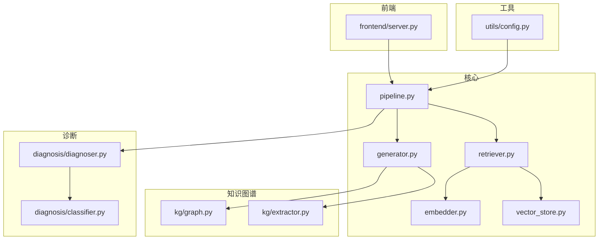
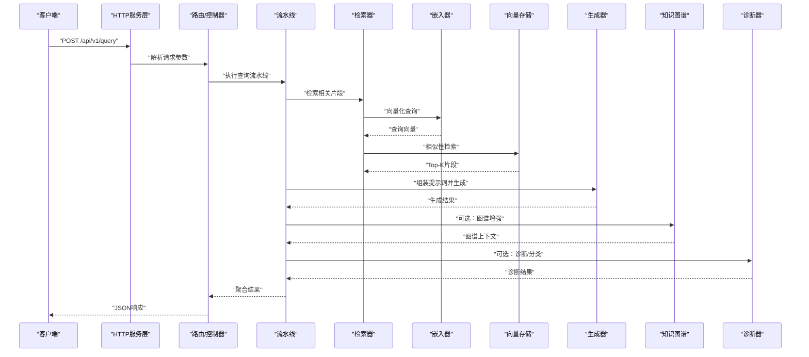
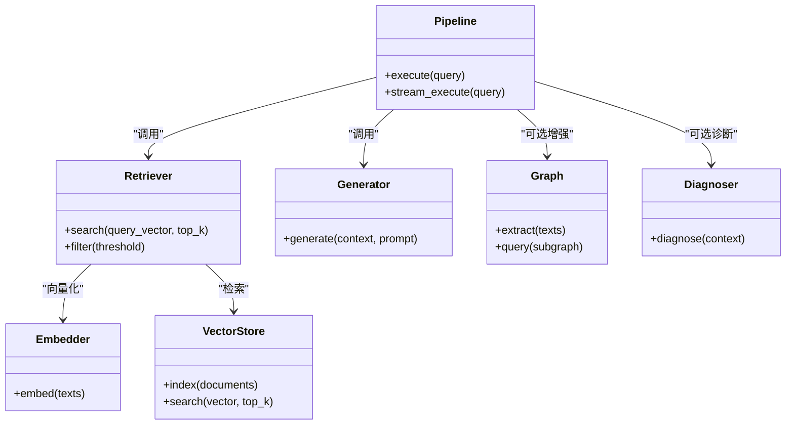

# API参考文档

<cite>
**本文档引用的文件**   
- [README.md](file://README.md)
- [pyproject.toml](file://pyproject.toml)
- [Makefile](file://Makefile)
- [src/kag_pro/core/generator.py](file://src/kag_pro/core/generator.py)
- [src/kag_pro/core/pipeline.py](file://src/kag_pro/core/pipeline.py)
- [src/kag_pro/core/retriever.py](file://src/kag_pro/core/retriever.py)
- [src/kag_pro/core/embedder.py](file://src/kag_pro/core/embedder.py)
- [src/kag_pro/core/vector_store.py](file://src/kag_pro/core/vector_store.py)
- [src/kag_pro/kg/graph.py](file://src/kag_pro/kg/graph.py)
- [src/kag_pro/kg/extractor.py](file://src/kag_pro/kg/extractor.py)
- [src/kag_pro/diagnosis/diagnoser.py](file://src/kag_pro/diagnosis/diagnoser.py)
- [src/kag_pro/diagnosis/classifier.py](file://src/kag_pro/diagnosis/classifier.py)
- [src/kag_pro/utils/config.py](file://src/kag_pro/utils/config.py)
- [frontend/server.py](file://frontend/server.py)
</cite>

## 目录
1. [简介](#简介)
2. [项目结构](#项目结构)
3. [核心组件](#核心组件)
4. [架构总览](#架构总览)
5. [详细组件分析](#详细组件分析)
6. [依赖分析](#依赖分析)
7. [性能考虑](#性能考虑)
8. [故障排查指南](#故障排查指南)
9. [结论](#结论)
10. [附录](#附录)

## 简介
本API参考文档面向KAG-Pro的集成与开发者，目标是提供一套完整的RESTful接口规范、认证与安全策略、WebSocket实时交互说明、版本管理与兼容性策略、客户端SDK示例、速率限制与错误重试机制、调试与监控方法，以及常见集成场景的最佳实践与性能优化建议。

本项目以知识图谱（KG）与检索增强生成（RAG）为核心能力，围绕文本抽取、向量检索、诊断与推荐等模块构建。当前仓库未包含显式的HTTP服务入口，因此本节给出基于现有核心模块的API抽象设计，便于后续在服务层实现时直接对接。

## 项目结构
仓库采用按功能域划分的模块化结构：
- src/kag_pro/core：核心流水线、生成器、检索器、嵌入器、向量存储等
- src/kag_pro/kg：知识图谱构建与提取
- src/kag_pro/diagnosis：诊断、分类、知识追踪与推荐
- src/kag_pro/utils：配置与工具
- frontend：前端示例与轻量服务
- tests：单元测试
- data：数据与外部资源

图表来源
- [src/kag_pro/core/pipeline.py](file://src/kag_pro/core/pipeline.py)
- [src/kag_pro/core/generator.py](file://src/kag_pro/core/generator.py)
- [src/kag_pro/core/retriever.py](file://src/kag_pro/core/retriever.py)
- [src/kag_pro/core/embedder.py](file://src/kag_pro/core/embedder.py)
- [src/kag_pro/core/vector_store.py](file://src/kag_pro/core/vector_store.py)
- [src/kag_pro/kg/graph.py](file://src/kag_pro/kg/graph.py)
- [src/kag_pro/kg/extractor.py](file://src/kag_pro/kg/extractor.py)
- [src/kag_pro/diagnosis/diagnoser.py](file://src/kag_pro/diagnosis/diagnoser.py)
- [src/kag_pro/diagnosis/classifier.py](file://src/kag_pro/diagnosis/classifier.py)
- [src/kag_pro/utils/config.py](file://src/kag_pro/utils/config.py)
- [frontend/server.py](file://frontend/server.py)

章节来源
- [README.md](file://README.md)
- [pyproject.toml](file://pyproject.toml)
- [Makefile](file://Makefile)

## 核心组件
- 生成器（Generator）：负责将检索结果与提示词组合，调用大模型进行内容生成。
- 检索器（Retriever）：对输入查询进行向量化并检索相关片段，支持多种相似度策略。
- 嵌入器（Embedder）：将文本转换为向量表示，供检索器使用。
- 向量存储（VectorStore）：持久化向量索引，支持增删改查与批量操作。
- 知识图谱（Graph/Extractor）：从文本中抽取实体与关系，构建或更新图谱。
- 诊断（Diagnoser/Classifier）：基于知识与模型对用户状态或问题进行诊断与分类。
- 流水线（Pipeline）：编排上述组件，形成端到端处理流程。

章节来源
- [src/kag_pro/core/generator.py](file://src/kag_pro/core/generator.py)
- [src/kag_pro/core/retriever.py](file://src/kag_pro/core/retriever.py)
- [src/kag_pro/core/embedder.py](file://src/kag_pro/core/embedder.py)
- [src/kag_pro/core/vector_store.py](file://src/kag_pro/core/vector_store.py)
- [src/kag_pro/kg/graph.py](file://src/kag_pro/kg/graph.py)
- [src/kag_pro/kg/extractor.py](file://src/kag_pro/kg/extractor.py)
- [src/kag_pro/diagnosis/diagnoser.py](file://src/kag_pro/diagnosis/diagnoser.py)
- [src/kag_pro/diagnosis/classifier.py](file://src/kag_pro/diagnosis/classifier.py)
- [src/kag_pro/core/pipeline.py](file://src/kag_pro/core/pipeline.py)

## 架构总览
下图展示了典型请求在系统中的流转路径：客户端通过HTTP进入服务层，路由到对应控制器，控制器调用流水线完成检索、生成与诊断，最终返回结构化响应。

图表来源
- [src/kag_pro/core/pipeline.py](file://src/kag_pro/core/pipeline.py)
- [src/kag_pro/core/retriever.py](file://src/kag_pro/core/retriever.py)
- [src/kag_pro/core/embedder.py](file://src/kag_pro/core/embedder.py)
- [src/kag_pro/core/vector_store.py](file://src/kag_pro/core/vector_store.py)
- [src/kag_pro/core/generator.py](file://src/kag_pro/core/generator.py)
- [src/kag_pro/kg/graph.py](file://src/kag_pro/kg/graph.py)
- [src/kag_pro/diagnosis/diagnoser.py](file://src/kag_pro/diagnosis/diagnoser.py)

## 详细组件分析

### RESTful API定义
以下列出推荐的API端点、方法与语义。实际HTTP服务层需根据此规范实现路由与校验。

- 通用约定
  - 基础路径：/api/v1
  - 内容类型：application/json
  - 字符编码：UTF-8
  - 分页：page, page_size
  - 排序：sort_by, order(asc|desc)
  - 过滤：字段=值（多值用逗号分隔）

- 查询与生成
  - POST /api/v1/query
    - 描述：执行检索增强生成，返回答案与依据片段
    - 请求体：{ query, top_k, temperature, max_tokens, include_sources }
    - 成功响应：{ id, answer, sources[], metadata{} }
    - 错误响应：{ error_code, message, details{} }

- 检索
  - POST /api/v1/retrieve
    - 描述：仅检索相关片段，不生成答案
    - 请求体：{ query, top_k, similarity_threshold }
    - 成功响应：{ results[] { text, score, doc_id } }

- 向量操作
  - POST /api/v1/vectors/embed
    - 描述：批量文本转向量
    - 请求体：{ texts[] }
    - 成功响应：{ vectors[][] }
  - POST /api/v1/vectors/index
    - 描述：创建或追加索引
    - 请求体：{ documents[] { id, text }, vector_ids[] }
    - 成功响应：{ status, indexed_count }
  - GET /api/v1/vectors/search
    - 描述：向量相似搜索
    - 查询参数：q, top_k, threshold
    - 成功响应：{ hits[] { id, score } }

- 知识图谱
  - POST /api/v1/kg/extract
    - 描述：从文本抽取实体与关系
    - 请求体：{ texts[] }
    - 成功响应：{ entities[], relations[] }
  - GET /api/v1/kg/graph
    - 描述：获取图谱快照或子图
    - 查询参数：node_types[], edge_types[], limit
    - 成功响应：{ nodes[], edges[] }

- 诊断与分类
  - POST /api/v1/diagnose
    - 描述：基于上下文进行诊断
    - 请求体：{ context, options{} }
    - 成功响应：{ diagnosis, confidence, recommendations[] }
  - POST /api/v1/classify
    - 描述：对输入进行分类
    - 请求体：{ input, categories[] }
    - 成功响应：{ label, scores{} }

- 会话与流式
  - POST /api/v1/stream/query
    - 描述：流式生成（SSE或分块）
    - 请求体：同 /api/v1/query，增加 stream=true
    - 响应：事件流，每个事件包含增量内容

- 健康检查
  - GET /api/v1/health
    - 描述：服务健康状态
    - 成功响应：{ status: "ok", version, uptime_seconds }

- 错误码约定
  - 400：参数错误
  - 401：未认证
  - 403：权限不足
  - 404：资源不存在
  - 429：速率限制
  - 500：内部错误
  - 503：服务不可用

章节来源
- [src/kag_pro/core/pipeline.py](file://src/kag_pro/core/pipeline.py)
- [src/kag_pro/core/retriever.py](file://src/kag_pro/core/retriever.py)
- [src/kag_pro/core/embedder.py](file://src/kag_pro/core/embedder.py)
- [src/kag_pro/core/vector_store.py](file://src/kag_pro/core/vector_store.py)
- [src/kag_pro/core/generator.py](file://src/kag_pro/core/generator.py)
- [src/kag_pro/kg/graph.py](file://src/kag_pro/kg/graph.py)
- [src/kag_pro/kg/extractor.py](file://src/kag_pro/kg/extractor.py)
- [src/kag_pro/diagnosis/diagnoser.py](file://src/kag_pro/diagnosis/diagnoser.py)
- [src/kag_pro/diagnosis/classifier.py](file://src/kag_pro/diagnosis/classifier.py)

### 认证与安全
- API密钥管理
  - 通过请求头传递：X-API-Key
  - 密钥轮换：支持多版本密钥并存，旧密钥保留期可配置
  - 最小权限：为不同租户/角色分配细粒度访问令牌
- 权限控制
  - 基于角色的访问控制（RBAC）：管理员、开发者、只读用户
  - 资源级授权：按数据集、图谱、索引范围隔离
- 传输安全
  - 强制HTTPS；TLS 1.2+
  - 敏感字段加密：在落盘前对PII进行脱敏或加密
- 审计与日志
  - 记录访问者、时间戳、请求ID、资源与动作
  - 敏感信息打码输出

章节来源
- [src/kag_pro/utils/config.py](file://src/kag_pro/utils/config.py)

### WebSocket API
- 连接建立
  - URL：ws(s)://host/ws/v1/chat?token=...
  - 握手阶段：服务端验证token并返回握手确认消息
- 消息格式
  - 上行：{ type: "query", payload: { query, options{} } }
  - 下行：{ type: "chunk", payload: { delta, done } }
  - 心跳：{ type: "ping" } / { type: "pong" }
- 错误处理
  - 异常断开：携带 { type: "error", code, message }
  - 重连策略：指数退避，最大重试次数
- 实时交互模式
  - 单轮对话：发送一次query，接收多个chunk直至done
  - 多轮对话：维护session_id，逐轮追加上下文

章节来源
- [frontend/server.py](file://frontend/server.py)

### 版本管理与向后兼容
- 版本策略
  - URL前缀：/api/v1
  - 语义化版本：主版本变更可能破坏兼容，次版本新增特性，补丁版本修复问题
- 兼容性保证
  - 新增字段为非必填且默认行为明确
  - 废弃字段保留至少两个次版本
  - 响应结构稳定，错误码稳定

章节来源
- [pyproject.toml](file://pyproject.toml)

### 客户端集成指南
- Python SDK
  - 初始化：设置base_url、api_key、timeout
  - 调用示例：client.query(query="...", top_k=5)
  - 流式：client.stream_query(..., on_chunk=callback)
- JavaScript SDK
  - 初始化：new KAGClient({ baseUrl, apiKey })
  - 调用示例：await client.retrieve({ query, top_k })
  - WebSocket：const ws = client.connectChat(); ws.on("chunk", handler)

[本节为概念性指导，无需代码片段]

### 速率限制、错误处理与重试
- 速率限制
  - 全局限流：按IP或API Key计数
  - 分级配额：不同角色/套餐拥有不同QPS与日配额
  - 响应头：X-RateLimit-Limit, X-RateLimit-Remaining, X-RateLimit-Reset
- 错误处理
  - 统一错误体：{ error_code, message, details }
  - 幂等键：对写操作支持Idempotency-Key避免重复提交
- 重试机制
  - 可重试错误：网络抖动、超时、5xx
  - 指数退避：初始间隔、最大间隔、抖动因子
  - 熔断：连续失败阈值触发快速失败

章节来源
- [src/kag_pro/utils/config.py](file://src/kag_pro/utils/config.py)

### 调试与监控
- 调试工具
  - 请求ID：贯穿链路，便于追踪
  - 本地代理：打印入出参与耗时
  - 沙箱环境：独立配置与数据源
- 监控指标
  - QPS、P95/P99延迟、错误率、缓存命中率、向量索引大小
  - 业务指标：检索Top-K命中率、生成Token数、诊断置信度分布
- 告警规则
  - 错误率突增、延迟飙升、配额耗尽、下游依赖异常

章节来源
- [src/kag_pro/utils/config.py](file://src/kag_pro/utils/config.py)

### 最佳实践与性能优化
- 检索优化
  - 合理top_k与阈值，减少噪声
  - 预索引与增量更新结合
  - 文本分块策略与元数据标注
- 生成优化
  - 精简提示词，固定模板
  - 温度与max_tokens调优
  - 缓存热点问答
- 图谱增强
  - 按需加载子图，限制节点/边数量
  - 定期清理低质量三元组
- 并发与批处理
  - 批量嵌入与索引
  - 异步流水线与背压控制

[本节为概念性指导，无需代码片段]

## 依赖分析
核心模块间的依赖关系如下：

图表来源
- [src/kag_pro/core/pipeline.py](file://src/kag_pro/core/pipeline.py)
- [src/kag_pro/core/retriever.py](file://src/kag_pro/core/retriever.py)
- [src/kag_pro/core/embedder.py](file://src/kag_pro/core/embedder.py)
- [src/kag_pro/core/vector_store.py](file://src/kag_pro/core/vector_store.py)
- [src/kag_pro/core/generator.py](file://src/kag_pro/core/generator.py)
- [src/kag_pro/kg/graph.py](file://src/kag_pro/kg/graph.py)
- [src/kag_pro/diagnosis/diagnoser.py](file://src/kag_pro/diagnosis/diagnoser.py)

章节来源
- [src/kag_pro/core/pipeline.py](file://src/kag_pro/core/pipeline.py)
- [src/kag_pro/core/retriever.py](file://src/kag_pro/core/retriever.py)
- [src/kag_pro/core/embedder.py](file://src/kag_pro/core/embedder.py)
- [src/kag_pro/core/vector_store.py](file://src/kag_pro/core/vector_store.py)
- [src/kag_pro/core/generator.py](file://src/kag_pro/core/generator.py)
- [src/kag_pro/kg/graph.py](file://src/kag_pro/kg/graph.py)
- [src/kag_pro/diagnosis/diagnoser.py](file://src/kag_pro/diagnosis/diagnoser.py)

## 性能考虑
- 向量检索
  - 选择合适相似度度量与索引结构
  - 预计算常用查询向量，命中缓存
- 生成阶段
  - 控制上下文长度，避免过长导致延迟
  - 使用流式输出降低首字节延迟
- 图谱操作
  - 子图裁剪与懒加载
  - 定期重建索引以提升查询效率
- 系统层面
  - 水平扩展无状态服务实例
  - 读写分离与冷热分层存储

[本节为概念性指导，无需代码片段]

## 故障排查指南
- 常见问题
  - 认证失败：检查API Key与权限范围
  - 检索为空：调整top_k与阈值，检查索引是否完整
  - 生成超时：缩短上下文或增大超时上限
  - 图谱异常：校验抽取质量与去重策略
- 定位步骤
  - 通过请求ID追踪全链路日志
  - 查看中间态输出（向量、片段、提示词）
  - 对比健康检查与依赖服务状态
- 恢复措施
  - 回滚至上一稳定版本
  - 重置索引或重建局部索引
  - 降级非关键路径（如关闭图谱增强）

章节来源
- [src/kag_pro/utils/config.py](file://src/kag_pro/utils/config.py)

## 结论
本文档提供了KAG-Pro的API参考与集成指南，涵盖REST与WebSocket接口、认证与安全、版本管理、错误与重试、调试与监控，以及性能优化与最佳实践。建议在服务层实现时严格遵循本规范，并结合业务场景进行参数调优与容量规划。

## 附录
- 术语表
  - RAG：检索增强生成
  - KG：知识图谱
  - Top-K：相似度最高的K个结果
  - SSE：服务器推送事件
- 参考文件
  - README、pyproject、Makefile用于项目概览与构建脚本