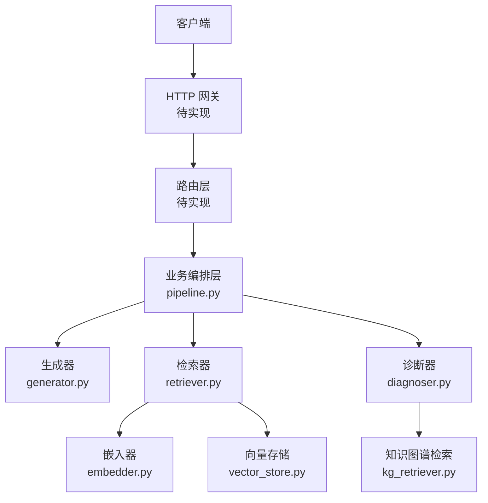
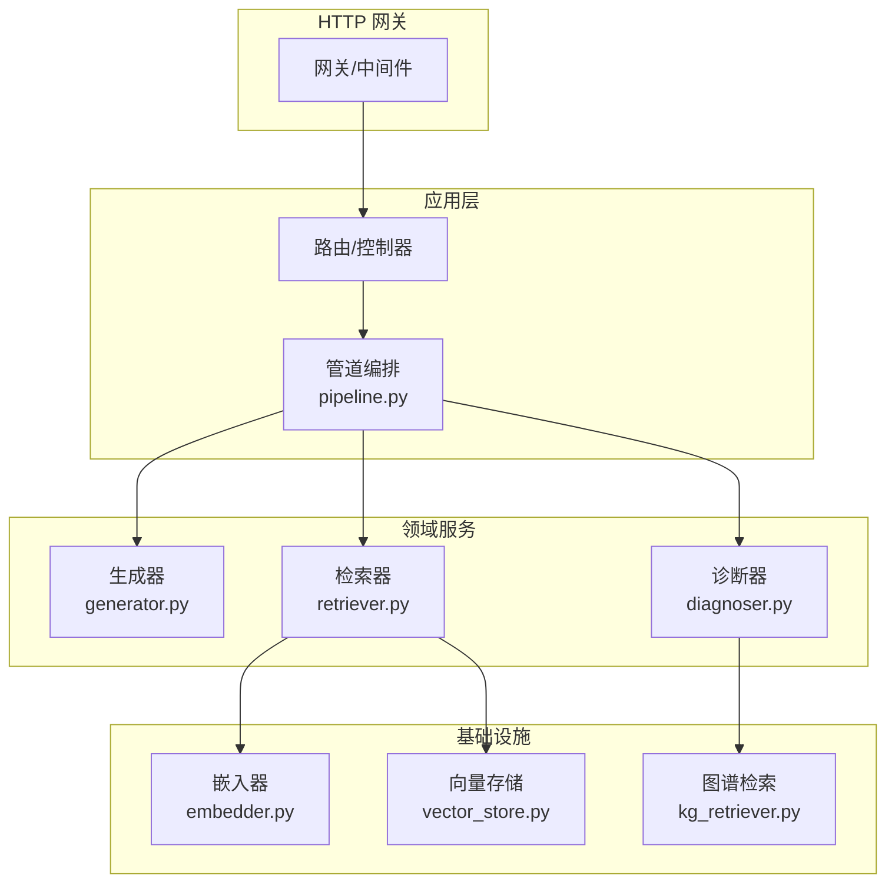
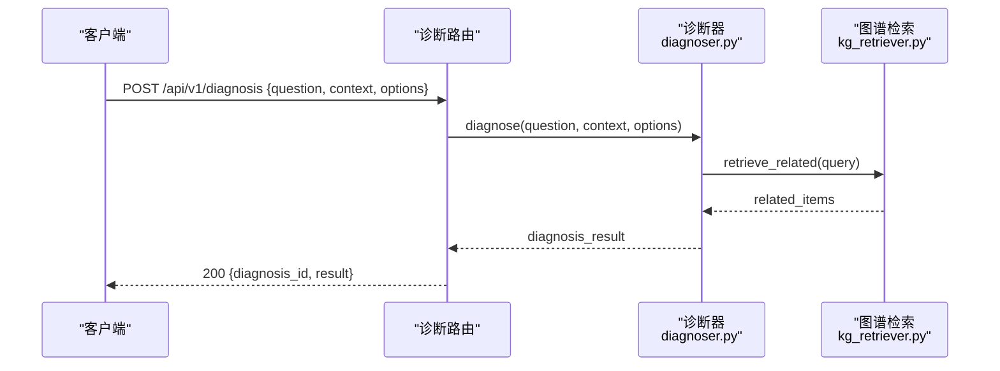
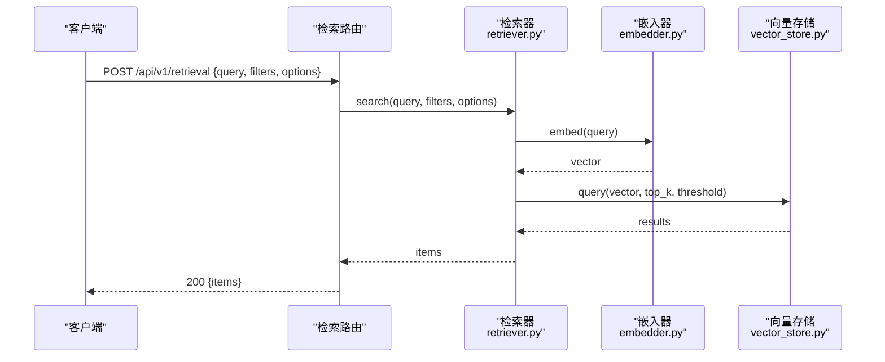
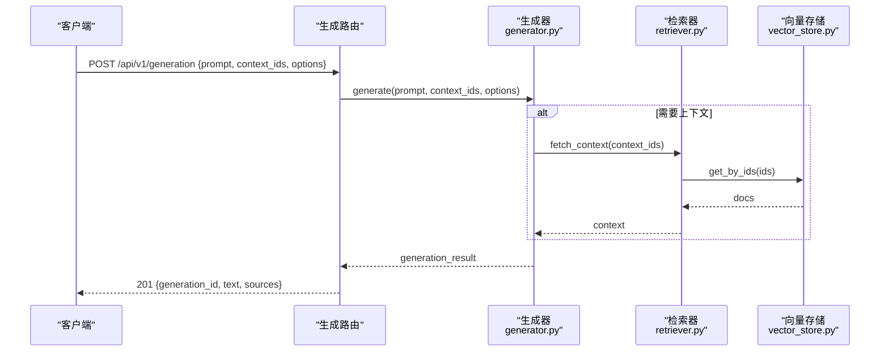
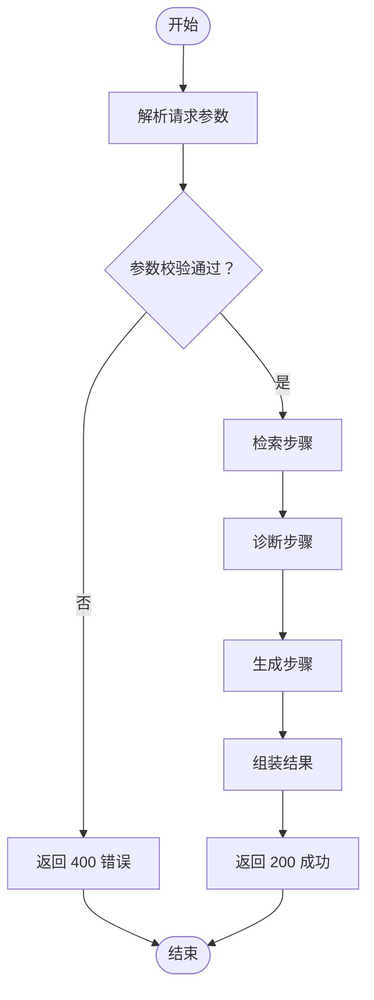
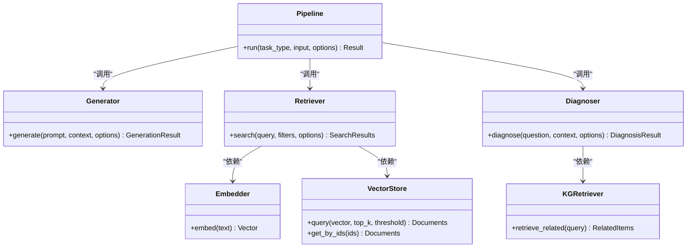

# RESTful API接口

<cite>
**本文引用的文件**   
- [README.md](file://README.md)
- [pyproject.toml](file://pyproject.toml)
- [Makefile](file://Makefile)
- [src/kag_pro/core/pipeline.py](file://src/kag_pro/core/pipeline.py)
- [src/kag_pro/core/generator.py](file://src/kag_pro/core/generator.py)
- [src/kag_pro/core/retriever.py](file://src/kag_pro/core/retriever.py)
- [src/kag_pro/core/embedder.py](file://src/kag_pro/core/embedder.py)
- [src/kag_pro/core/vector_store.py](file://src/kag_pro/core/vector_store.py)
- [src/kag_pro/diagnosis/diagnoser.py](file://src/kag_pro/diagnosis/diagnoser.py)
- [src/kag_pro/kg/kg_retriever.py](file://src/kag_pro/kg/kg_retriever.py)
- [frontend/server.py](file://frontend/server.py)
</cite>

## 目录
1. [简介](#简介)
2. [项目结构](#项目结构)
3. [核心组件](#核心组件)
4. [架构总览](#架构总览)
5. [详细组件分析](#详细组件分析)
6. [依赖关系分析](#依赖关系分析)
7. [性能考虑](#性能考虑)
8. [故障排查指南](#故障排查指南)
9. [结论](#结论)
10. [附录](#附录)

## 简介
本文件为 KAG-Pro 的 RESTful API 接口文档。KAG-Pro 是一个面向知识图谱与检索增强生成（RAG）的系统，提供诊断、检索、内容生成等核心能力。当前仓库未包含显式的 HTTP 服务实现，因此本文档基于源码中的核心模块职责与数据流，给出建议的 API 设计、请求/响应模型、错误码规范以及集成示例，便于后续快速落地到具体 Web 框架（如 FastAPI/Flask）。

## 项目结构
- 后端核心逻辑位于 src/kag_pro 下，按功能域划分：core（管道、生成器、检索器、向量存储）、diagnosis（诊断与推荐）、kg（知识图谱相关）、stage（阶段检测）、utils（配置工具）。
- 前端示例位于 frontend，包含一个简易服务器脚本与静态页面。
- 测试用例位于 tests，覆盖诊断、管道、检索、分词器等关键路径。
- 构建与运行入口参考 Makefile 与 pyproject.toml。

图表来源
- [src/kag_pro/core/pipeline.py](file://src/kag_pro/core/pipeline.py)
- [src/kag_pro/core/generator.py](file://src/kag_pro/core/generator.py)
- [src/kag_pro/core/retriever.py](file://src/kag_pro/core/retriever.py)
- [src/kag_pro/core/embedder.py](file://src/kag_pro/core/embedder.py)
- [src/kag_pro/core/vector_store.py](file://src/kag_pro/core/vector_store.py)
- [src/kag_pro/diagnosis/diagnoser.py](file://src/kag_pro/diagnosis/diagnoser.py)
- [src/kag_pro/kg/kg_retriever.py](file://src/kag_pro/kg/kg_retriever.py)

章节来源
- [README.md](file://README.md)
- [pyproject.toml](file://pyproject.toml)
- [Makefile](file://Makefile)

## 核心组件
- 管道（Pipeline）：统一编排“检索-诊断-生成”流程，协调各子模块完成端到端任务。
- 生成器（Generator）：负责文本生成或答案合成，可接受上下文与提示模板。
- 检索器（Retriever）：根据查询进行相似度检索，调用嵌入器与向量存储。
- 嵌入器（Embedder）：将文本转换为向量表示。
- 向量存储（VectorStore）：提供向量的增删改查与持久化。
- 诊断器（Diagnoser）：对用户状态或问题进行诊断并输出评估结果与建议。
- 知识图谱检索（KG Retriever）：在图谱结构中执行检索与推理辅助。

章节来源
- [src/kag_pro/core/pipeline.py](file://src/kag_pro/core/pipeline.py)
- [src/kag_pro/core/generator.py](file://src/kag_pro/core/generator.py)
- [src/kag_pro/core/retriever.py](file://src/kag_pro/core/retriever.py)
- [src/kag_pro/core/embedder.py](file://src/kag_pro/core/embedder.py)
- [src/kag_pro/core/vector_store.py](file://src/kag_pro/core/vector_store.py)
- [src/kag_pro/diagnosis/diagnoser.py](file://src/kag_pro/diagnosis/diagnoser.py)
- [src/kag_pro/kg/kg_retriever.py](file://src/kag_pro/kg/kg_retriever.py)

## 架构总览
下图展示建议的 API 分层与核心模块交互关系。HTTP 网关负责鉴权、限流、参数校验；路由层映射 URL 到控制器；控制器调用 pipeline 编排业务；pipeline 再调度 generator、retriever、diagnoser 等组件。

图表来源
- [src/kag_pro/core/pipeline.py](file://src/kag_pro/core/pipeline.py)
- [src/kag_pro/core/generator.py](file://src/kag_pro/core/generator.py)
- [src/kag_pro/core/retriever.py](file://src/kag_pro/core/retriever.py)
- [src/kag_pro/core/embedder.py](file://src/kag_pro/core/embedder.py)
- [src/kag_pro/core/vector_store.py](file://src/kag_pro/core/vector_store.py)
- [src/kag_pro/diagnosis/diagnoser.py](file://src/kag_pro/diagnosis/diagnoser.py)
- [src/kag_pro/kg/kg_retriever.py](file://src/kag_pro/kg/kg_retriever.py)

## 详细组件分析

### 版本管理与兼容性策略
- 版本前缀：所有 API 以 /api/v1 开头，便于未来演进与多版本共存。
- 向后兼容：新增字段采用可选默认值；删除字段需废弃周期与迁移说明；破坏性变更通过新版本号发布。
- 幂等性：GET/PUT/DELETE 应满足幂等；POST 用于创建资源，返回 201 与资源标识。
- 错误格式：统一 JSON 错误体，包含 code、message、details。

章节来源
- [README.md](file://README.md)

### 通用约定
- 内容类型：application/json
- 字符编码：UTF-8
- 分页：使用 page、page_size 参数，返回 total、items
- 排序：使用 sort_by、order（asc/desc）
- 时间戳：ISO 8601 字符串
- 认证：建议在网关层实现（例如 Bearer Token），此处不展开

### 健康检查
- 方法：GET
- 路径：/api/v1/health
- 描述：服务存活与健康探针
- 请求参数：无
- 成功响应（200）：
  - 字段：status（string，示例："ok"）
- 失败响应（500）：
  - 字段：code、message、details

章节来源
- [README.md](file://README.md)

### 诊断接口
- 方法：POST
- 路径：/api/v1/diagnosis
- 描述：对输入问题或用户画像进行诊断，返回诊断结论与建议
- 请求体：
  - question（string，必填）：待诊断的问题或描述
  - context（string，可选）：补充背景信息
  - options（object，可选）：
    - top_k（integer，可选，默认 5）：返回候选数量
    - confidence_threshold（number，可选，默认 0.6）：置信度阈值
- 成功响应（200）：
  - diagnosis_id（string）：诊断会话标识
  - result（object）：
    - summary（string）：诊断摘要
    - findings（array）：发现项列表
    - recommendations（array）：建议项列表
    - confidence（number）：整体置信度
- 失败响应（400/500）：
  - code（string）：错误码
  - message（string）：人类可读消息
  - details（object）：详细错误信息

图表来源
- [src/kag_pro/diagnosis/diagnoser.py](file://src/kag_pro/diagnosis/diagnoser.py)
- [src/kag_pro/kg/kg_retriever.py](file://src/kag_pro/kg/kg_retriever.py)

章节来源
- [src/kag_pro/diagnosis/diagnoser.py](file://src/kag_pro/diagnosis/diagnoser.py)
- [src/kag_pro/kg/kg_retriever.py](file://src/kag_pro/kg/kg_retriever.py)

### 检索接口
- 方法：POST
- 路径：/api/v1/retrieval
- 描述：基于语义相似度的内容检索
- 请求体：
  - query（string，必填）：检索关键词或自然语言查询
  - filters（object，可选）：
    - category（string，可选）：分类过滤
    - tags（array<string>，可选）：标签过滤
  - options（object，可选）：
    - top_k（integer，可选，默认 10）：返回条数
    - score_threshold（number，可选，默认 0.5）：分数阈值
- 成功响应（200）：
  - items（array）：
    - id（string）：条目标识
    - title（string）：标题
    - content_snippet（string）：内容片段
    - score（number）：相似度分数
    - metadata（object）：附加元数据
- 失败响应（400/500）：同上

图表来源
- [src/kag_pro/core/retriever.py](file://src/kag_pro/core/retriever.py)
- [src/kag_pro/core/embedder.py](file://src/kag_pro/core/embedder.py)
- [src/kag_pro/core/vector_store.py](file://src/kag_pro/core/vector_store.py)

章节来源
- [src/kag_pro/core/retriever.py](file://src/kag_pro/core/retriever.py)
- [src/kag_pro/core/embedder.py](file://src/kag_pro/core/embedder.py)
- [src/kag_pro/core/vector_store.py](file://src/kag_pro/core/vector_store.py)

### 内容生成接口
- 方法：POST
- 路径：/api/v1/generation
- 描述：结合检索上下文生成结构化或自由文本内容
- 请求体：
  - prompt（string，必填）：生成提示
  - context_ids（array<string>，可选）：关联的检索结果 ID 列表
  - options（object，可选）：
    - max_tokens（integer，可选，默认 512）
    - temperature（number，可选，默认 0.7）
    - top_p（number，可选，默认 0.9）
- 成功响应（201）：
  - generation_id（string）：生成任务标识
  - text（string）：生成文本
  - sources（array<object>）：引用来源
- 失败响应（400/500）：同上

图表来源
- [src/kag_pro/core/generator.py](file://src/kag_pro/core/generator.py)
- [src/kag_pro/core/retriever.py](file://src/kag_pro/core/retriever.py)
- [src/kag_pro/core/vector_store.py](file://src/kag_pro/core/vector_store.py)

章节来源
- [src/kag_pro/core/generator.py](file://src/kag_pro/core/generator.py)
- [src/kag_pro/core/retriever.py](file://src/kag_pro/core/retriever.py)
- [src/kag_pro/core/vector_store.py](file://src/kag_pro/core/vector_store.py)

### 管道编排接口（端到端）
- 方法：POST
- 路径：/api/v1/pipeline/run
- 描述：一次性完成“检索-诊断-生成”的端到端流程
- 请求体：
  - task_type（string，必填）：任务类型，如 "qa"、"summary"、"recommendation"
  - input（object，必填）：
    - query（string，必填）：主查询
    - extra（object，可选）：扩展输入
  - options（object，可选）：
    - retrieval_top_k（integer，可选，默认 10）
    - diagnosis_top_k（integer，可选，默认 5）
    - generation_max_tokens（integer，可选，默认 512）
- 成功响应（200）：
  - run_id（string）：运行标识
  - steps（array<object>）：步骤明细
    - name（string）：步骤名
    - status（string）：success/error
    - output（object）：步骤输出
  - final_output（object）：最终结果
- 失败响应（400/500）：同上

图表来源
- [src/kag_pro/core/pipeline.py](file://src/kag_pro/core/pipeline.py)
- [src/kag_pro/core/retriever.py](file://src/kag_pro/core/retriever.py)
- [src/kag_pro/diagnosis/diagnoser.py](file://src/kag_pro/diagnosis/diagnoser.py)
- [src/kag_pro/core/generator.py](file://src/kag_pro/core/generator.py)

章节来源
- [src/kag_pro/core/pipeline.py](file://src/kag_pro/core/pipeline.py)

### 错误码与响应格式
- 成功：
  - 200：常规查询与更新
  - 201：创建成功
- 客户端错误：
  - 400：参数校验失败或缺失必填字段
  - 404：资源不存在
- 服务端错误：
  - 500：内部异常或下游依赖不可用
- 统一错误体：
  - code（string）：错误码
  - message（string）：人类可读消息
  - details（object）：详细错误信息

章节来源
- [README.md](file://README.md)

## 依赖关系分析
- 检索链路：retriever 依赖 embedder 与 vector_store，形成“查询→嵌入→向量检索”的标准 RAG 路径。
- 诊断链路：diagnoser 可借助 kg_retriever 获取图谱相关节点，提升诊断准确性。
- 生成链路：generator 可接收外部上下文（由 retriever 提供），提高生成质量与可溯源性。
- 编排链路：pipeline 作为统一入口，串联上述链路，屏蔽内部复杂度。

图表来源
- [src/kag_pro/core/pipeline.py](file://src/kag_pro/core/pipeline.py)
- [src/kag_pro/core/generator.py](file://src/kag_pro/core/generator.py)
- [src/kag_pro/core/retriever.py](file://src/kag_pro/core/retriever.py)
- [src/kag_pro/core/embedder.py](file://src/kag_pro/core/embedder.py)
- [src/kag_pro/core/vector_store.py](file://src/kag_pro/core/vector_store.py)
- [src/kag_pro/diagnosis/diagnoser.py](file://src/kag_pro/diagnosis/diagnoser.py)
- [src/kag_pro/kg/kg_retriever.py](file://src/kag_pro/kg/kg_retriever.py)

章节来源
- [src/kag_pro/core/pipeline.py](file://src/kag_pro/core/pipeline.py)
- [src/kag_pro/core/generator.py](file://src/kag_pro/core/generator.py)
- [src/kag_pro/core/retriever.py](file://src/kag_pro/core/retriever.py)
- [src/kag_pro/core/embedder.py](file://src/kag_pro/core/embedder.py)
- [src/kag_pro/core/vector_store.py](file://src/kag_pro/core/vector_store.py)
- [src/kag_pro/diagnosis/diagnoser.py](file://src/kag_pro/diagnosis/diagnoser.py)
- [src/kag_pro/kg/kg_retriever.py](file://src/kag_pro/kg/kg_retriever.py)

## 性能考虑
- 检索优化：合理设置 top_k 与 score_threshold，避免过大结果集导致生成延迟。
- 缓存策略：对高频查询与嵌入结果做缓存，降低重复计算开销。
- 批处理：批量检索与生成可降低网络往返与系统调用次数。
- 异步化：长耗时操作（如大规模检索与生成）建议异步处理，返回任务 ID 供轮询。
- 资源隔离：不同租户或任务类型可隔离向量库索引与模型实例，避免相互干扰。

[本节为通用指导，无需特定文件来源]

## 故障排查指南
- 参数校验失败（400）：检查必填字段是否缺失、类型是否正确、取值范围是否越界。
- 资源不存在（404）：确认 context_ids 或检索条件是否存在对应数据。
- 内部异常（500）：查看日志定位下游依赖（嵌入器、向量库、图谱检索）是否可用。
- 超时与重试：对长耗时步骤增加超时与重试机制，避免级联失败。
- 监控指标：记录各步骤耗时、错误率、QPS、缓存命中率等关键指标。

章节来源
- [README.md](file://README.md)

## 结论
本文基于 KAG-Pro 的核心模块职责与数据流，给出了完整的 RESTful API 设计建议，涵盖健康检查、诊断、检索、生成与端到端管道编排。该设计遵循版本管理、向后兼容与统一错误格式原则，并提供序列图与流程图帮助理解调用链路与复杂逻辑。后续可在网关与路由层落地具体 Web 框架实现，并结合监控与缓存策略提升稳定性与性能。

[本节为总结性内容，无需特定文件来源]

## 附录

### 常见集成场景与示例
- 问答场景：先调用检索接口获取相关文档片段，再调用生成接口合成答案，最后返回给用户。
- 学习诊断：调用诊断接口分析问题，结合图谱检索得到知识点关联，输出个性化学习建议。
- 内容创作：提供主题与约束，通过管道编排自动完成检索、诊断与生成，产出结构化内容。

[本节为概念性示例，无需特定文件来源]