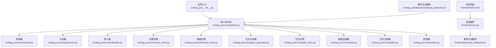
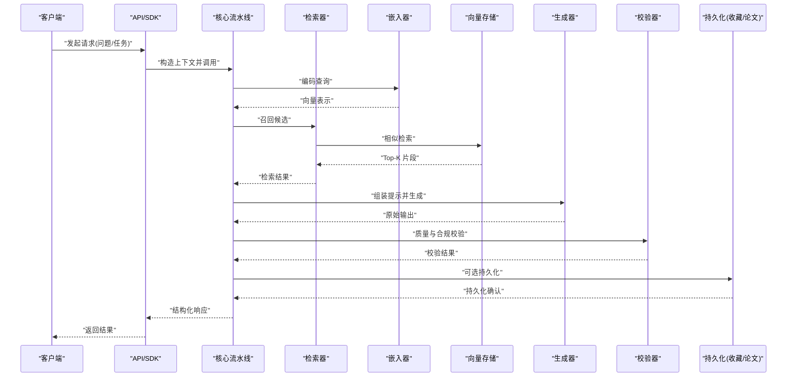
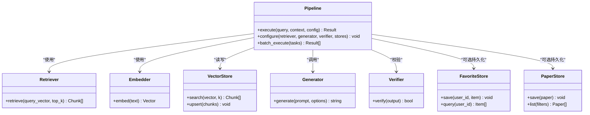
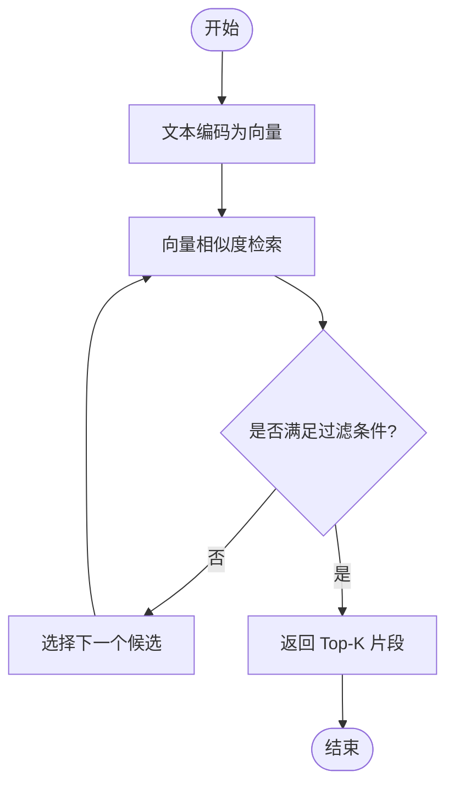
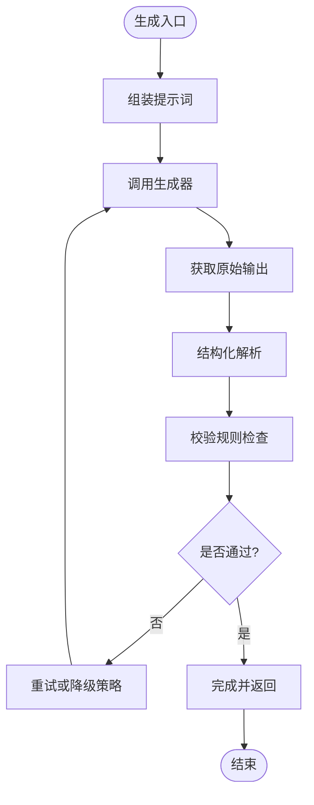
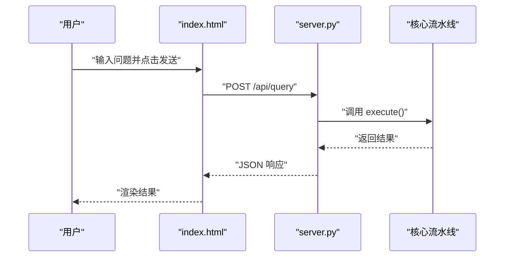
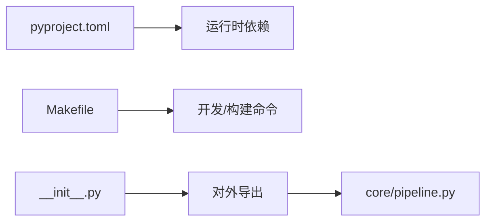
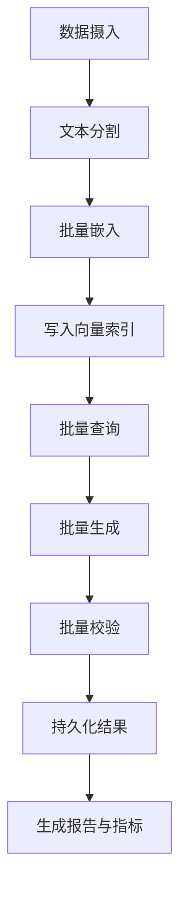

# 客户端集成指南

<cite>
**本文引用的文件**   
- [README.md](file://README.md)
- [pyproject.toml](file://pyproject.toml)
- [Makefile](file://Makefile)
- [src/kag_pro/__init__.py](file://src/kag_pro/__init__.py)
- [src/kag_pro/core/pipeline.py](file://src/kag_pro/core/pipeline.py)
- [src/kag_pro/core/generator.py](file://src/kag_pro/core/generator.py)
- [src/kag_pro/core/retriever.py](file://src/kag_pro/core/retriever.py)
- [src/kag_pro/core/embedder.py](file://src/kag_pro/core/embedder.py)
- [src/kag_pro/core/vector_store.py](file://src/kag_pro/core/vector_store.py)
- [src/kag_pro/core/favorite_store.py](file://src/kag_pro/core/favorite_store.py)
- [src/kag_pro/core/paper_generator.py](file://src/kag_pro/core/paper_generator.py)
- [src/kag_pro/core/paper_store.py](file://src/kag_pro/core/paper_store.py)
- [src/kag_pro/core/loader.py](file://src/kag_pro/core/loader.py)
- [src/kag_pro/core/splitter.py](file://src/kag_pro/core/splitter.py)
- [src/kag_pro/core/verifier.py](file://src/kag_pro/core/verifier.py)
- [src/kag_pro/datasets/textbook_generator.py](file://src/kag_pro/datasets/textbook_generator.py)
- [frontend/index.html](file://frontend/index.html)
- [frontend/server.py](file://frontend/server.py)
- [frontend/generate_textbooks.py](file://frontend/generate_textbooks.py)
</cite>

## 目录
1. [简介](#简介)
2. [项目结构](#项目结构)
3. [核心组件](#核心组件)
4. [架构总览](#架构总览)
5. [详细组件分析](#详细组件分析)
6. [依赖分析](#依赖分析)
7. [性能考虑](#性能考虑)
8. [故障排查指南](#故障排查指南)
9. [结论](#结论)
10. [附录](#附录)

## 简介
本指南面向需要在不同平台（Python、JavaScript、Java）集成 KAG-Pro 的开发者，提供从环境搭建到功能实现的完整流程。内容涵盖：
- Python SDK 使用与最佳实践（连接池、重试、超时）
- JavaScript 前端集成（HTML 嵌入、JS SDK、实时交互）
- Java 服务端集成建议（HTTP 调用、并发与批处理）
- 批量数据处理（异步、并发、结果聚合）
- 移动端集成注意事项（网络优化、缓存、离线）
- 端到端示例项目（从初始化到运行）
- 性能优化与常见问题解决方案

## 项目结构
KAG-Pro 采用模块化设计，核心能力集中在 src/kag_pro 下，包含检索、生成、向量存储、知识图谱、诊断推荐等模块；frontend 提供最小可运行的 Web 演示；tests 覆盖关键路径；pyproject.toml 管理依赖与构建；Makefile 提供常用命令。

图表来源
- [src/kag_pro/__init__.py](file://src/kag_pro/__init__.py)
- [src/kag_pro/core/pipeline.py](file://src/kag_pro/core/pipeline.py)
- [src/kag_pro/core/retriever.py](file://src/kag_pro/core/retriever.py)
- [src/kag_pro/core/generator.py](file://src/kag_pro/core/generator.py)
- [src/kag_pro/core/embedder.py](file://src/kag_pro/core/embedder.py)
- [src/kag_pro/core/vector_store.py](file://src/kag_pro/core/vector_store.py)
- [src/kag_pro/core/favorite_store.py](file://src/kag_pro/core/favorite_store.py)
- [src/kag_pro/core/paper_generator.py](file://src/kag_pro/core/paper_generator.py)
- [src/kag_pro/core/paper_store.py](file://src/kag_pro/core/paper_store.py)
- [src/kag_pro/core/loader.py](file://src/kag_pro/core/loader.py)
- [src/kag_pro/core/splitter.py](file://src/kag_pro/core/splitter.py)
- [src/kag_pro/core/verifier.py](file://src/kag_pro/core/verifier.py)
- [src/kag_pro/datasets/textbook_generator.py](file://src/kag_pro/datasets/textbook_generator.py)
- [frontend/index.html](file://frontend/index.html)
- [frontend/server.py](file://frontend/server.py)
- [frontend/generate_textbooks.py](file://frontend/generate_textbooks.py)

章节来源
- [README.md](file://README.md)
- [pyproject.toml](file://pyproject.toml)
- [Makefile](file://Makefile)

## 核心组件
- 核心流水线 pipeline：编排检索、生成、验证、持久化等步骤，是客户端集成的主要入口。
- 检索器 retriever：负责基于向量或图结构的召回。
- 生成器 generator：驱动大模型生成答案或内容。
- 嵌入器 embedder：将文本转换为向量表示。
- 向量存储 vector_store：提供向量的写入、查询与索引维护。
- 收藏存储 favorite_store：用户偏好与收藏数据的持久化。
- 论文生成器 paper_generator 与论文存储 paper_store：面向学术内容的生成与归档。
- 数据加载器 loader 与文本分割器 splitter：数据接入与分块策略。
- 校验器 verifier：对输出进行质量与合规性检查。
- 教材生成脚本 textbook_generator：批量生成教材素材。

章节来源
- [src/kag_pro/core/pipeline.py](file://src/kag_pro/core/pipeline.py)
- [src/kag_pro/core/retriever.py](file://src/kag_pro/core/retriever.py)
- [src/kag_pro/core/generator.py](file://src/kag_pro/core/generator.py)
- [src/kag_pro/core/embedder.py](file://src/kag_pro/core/embedder.py)
- [src/kag_pro/core/vector_store.py](file://src/kag_pro/core/vector_store.py)
- [src/kag_pro/core/favorite_store.py](file://src/kag_pro/core/favorite_store.py)
- [src/kag_pro/core/paper_generator.py](file://src/kag_pro/core/paper_generator.py)
- [src/kag_pro/core/paper_store.py](file://src/kag_pro/core/paper_store.py)
- [src/kag_pro/core/loader.py](file://src/kag_pro/core/loader.py)
- [src/kag_pro/core/splitter.py](file://src/kag_pro/core/splitter.py)
- [src/kag_pro/core/verifier.py](file://src/kag_pro/core/verifier.py)
- [src/kag_pro/datasets/textbook_generator.py](file://src/kag_pro/datasets/textbook_generator.py)

## 架构总览
下图展示了典型请求在 KAG-Pro 中的流转过程：客户端通过 HTTP 或服务端 SDK 发起请求，进入核心流水线，依次执行检索、生成、校验与存储，最终返回结果。

图表来源
- [src/kag_pro/core/pipeline.py](file://src/kag_pro/core/pipeline.py)
- [src/kag_pro/core/retriever.py](file://src/kag_pro/core/retriever.py)
- [src/kag_pro/core/embedder.py](file://src/kag_pro/core/embedder.py)
- [src/kag_pro/core/vector_store.py](file://src/kag_pro/core/vector_store.py)
- [src/kag_pro/core/generator.py](file://src/kag_pro/core/generator.py)
- [src/kag_pro/core/verifier.py](file://src/kag_pro/core/verifier.py)
- [src/kag_pro/core/favorite_store.py](file://src/kag_pro/core/favorite_store.py)
- [src/kag_pro/core/paper_store.py](file://src/kag_pro/core/paper_store.py)

## 详细组件分析

### 核心流水线（Pipeline）
- 职责：统一编排检索、生成、校验、持久化等阶段，对外暴露一致的接口。
- 关键点：
  - 输入参数标准化（查询、上下文、配置）。
  - 中间状态传递（检索结果、生成草稿、校验标记）。
  - 错误边界与重试策略（可结合上层 HTTP 层实现）。
  - 可扩展点（替换检索器、生成器、校验器）。

图表来源
- [src/kag_pro/core/pipeline.py](file://src/kag_pro/core/pipeline.py)
- [src/kag_pro/core/retriever.py](file://src/kag_pro/core/retriever.py)
- [src/kag_pro/core/embedder.py](file://src/kag_pro/core/embedder.py)
- [src/kag_pro/core/vector_store.py](file://src/kag_pro/core/vector_store.py)
- [src/kag_pro/core/generator.py](file://src/kag_pro/core/generator.py)
- [src/kag_pro/core/verifier.py](file://src/kag_pro/core/verifier.py)
- [src/kag_pro/core/favorite_store.py](file://src/kag_pro/core/favorite_store.py)
- [src/kag_pro/core/paper_store.py](file://src/kag_pro/core/paper_store.py)

章节来源
- [src/kag_pro/core/pipeline.py](file://src/kag_pro/core/pipeline.py)

### 检索与向量存储
- 检索器：根据查询向量召回相关片段，支持 Top-K 与过滤条件。
- 嵌入器：将文本转为固定维度向量，需考虑批次大小与精度权衡。
- 向量存储：提供高效相似度搜索与增量更新，注意索引重建与一致性。

图表来源
- [src/kag_pro/core/retriever.py](file://src/kag_pro/core/retriever.py)
- [src/kag_pro/core/embedder.py](file://src/kag_pro/core/embedder.py)
- [src/kag_pro/core/vector_store.py](file://src/kag_pro/core/vector_store.py)

章节来源
- [src/kag_pro/core/retriever.py](file://src/kag_pro/core/retriever.py)
- [src/kag_pro/core/embedder.py](file://src/kag_pro/core/embedder.py)
- [src/kag_pro/core/vector_store.py](file://src/kag_pro/core/vector_store.py)

### 生成与校验
- 生成器：接收检索结果与提示词模板，驱动模型生成。
- 校验器：对输出进行格式、长度、敏感信息、事实性等检查。
- 建议：在生成前做提示词工程，在生成后做结构化解析与二次校验。

图表来源
- [src/kag_pro/core/generator.py](file://src/kag_pro/core/generator.py)
- [src/kag_pro/core/verifier.py](file://src/kag_pro/core/verifier.py)

章节来源
- [src/kag_pro/core/generator.py](file://src/kag_pro/core/generator.py)
- [src/kag_pro/core/verifier.py](file://src/kag_pro/core/verifier.py)

### 数据加载与分割
- 加载器：读取本地或外部数据源，统一为内部数据结构。
- 分割器：按语义或固定长度切分文本，影响检索粒度与召回质量。
- 建议：针对长文档采用分层分割（章节→段落→句子），并结合元数据保留上下文。

章节来源
- [src/kag_pro/core/loader.py](file://src/kag_pro/core/loader.py)
- [src/kag_pro/core/splitter.py](file://src/kag_pro/core/splitter.py)

### 教材与论文生成
- 教材生成：批量生成教材素材，适合离线批处理与定时任务。
- 论文生成：面向学术场景的结构化生成与归档。
- 建议：使用队列与幂等键避免重复生成，结合校验器保证质量。

章节来源
- [src/kag_pro/datasets/textbook_generator.py](file://src/kag_pro/datasets/textbook_generator.py)
- [src/kag_pro/core/paper_generator.py](file://src/kag_pro/core/paper_generator.py)
- [src/kag_pro/core/paper_store.py](file://src/kag_pro/core/paper_store.py)

### 前端集成（HTML + JS + 后端服务）
- HTML 页面：提供输入框与结果展示区域，通过事件触发调用后端。
- 前端服务：封装业务逻辑，转发请求至 KAG-Pro 核心流水线。
- 实时交互：可使用轮询或 WebSocket 推送流式结果。

图表来源
- [frontend/index.html](file://frontend/index.html)
- [frontend/server.py](file://frontend/server.py)
- [src/kag_pro/core/pipeline.py](file://src/kag_pro/core/pipeline.py)

章节来源
- [frontend/index.html](file://frontend/index.html)
- [frontend/server.py](file://frontend/server.py)

## 依赖分析
- 运行时依赖：由 pyproject.toml 声明，确保安装时拉取必要包。
- 构建与命令：Makefile 提供常用命令（如测试、格式化、打包）。
- 模块耦合：pipeline 作为中枢，其他组件以松耦合方式被注入。

图表来源
- [pyproject.toml](file://pyproject.toml)
- [Makefile](file://Makefile)
- [src/kag_pro/__init__.py](file://src/kag_pro/__init__.py)
- [src/kag_pro/core/pipeline.py](file://src/kag_pro/core/pipeline.py)

章节来源
- [pyproject.toml](file://pyproject.toml)
- [Makefile](file://Makefile)
- [src/kag_pro/__init__.py](file://src/kag_pro/__init__.py)

## 性能考虑
- 连接池配置
  - HTTP 客户端：复用连接、限制最大空闲连接数、合理设置 keep-alive。
  - 向量存储：连接池大小与并发度匹配硬件资源，避免过度竞争。
- 请求重试机制
  - 指数退避与抖动，限定最大重试次数。
  - 仅对幂等请求启用自动重试，非幂等需业务侧控制。
- 超时设置
  - 连接超时、读超时分离，避免长时间阻塞。
  - 生成类请求适当放宽超时，但需配合心跳或流式反馈。
- 批量处理
  - 分批编码与检索，控制批次大小平衡吞吐与内存。
  - 使用异步队列与限流，避免下游过载。
- 缓存策略
  - 热点查询结果短期缓存（TTL），减少重复计算。
  - 向量索引定期重建与增量更新。
- 前端优化
  - 防抖与节流输入，合并短间隔请求。
  - 分页与懒加载结果，降低首屏压力。
- 移动端优化
  - 弱网自适应（降采样、缩短上下文）。
  - 本地缓存与离线队列，网络恢复后重试。
  - 压缩传输与增量同步。

[本节为通用指导，不直接分析具体文件]

## 故障排查指南
- 常见错误定位
  - 检索为空：检查嵌入维度、索引是否重建、过滤条件是否过严。
  - 生成失败：核对提示词模板、模型可用性、输出解析逻辑。
  - 校验失败：查看校验规则阈值与白名单配置。
- 日志与追踪
  - 记录关键阶段耗时与中间状态，便于定位瓶颈。
  - 为每次请求分配唯一 ID，贯穿全链路。
- 回滚与降级
  - 生成失败时返回缓存或默认答案。
  - 检索失败时退回关键词匹配或空结果提示。
- 健康检查
  - 提供 /health 接口，监控依赖服务可用性与延迟。

章节来源
- [src/kag_pro/core/verifier.py](file://src/kag_pro/core/verifier.py)
- [src/kag_pro/core/retriever.py](file://src/kag_pro/core/retriever.py)
- [src/kag_pro/core/generator.py](file://src/kag_pro/core/generator.py)

## 结论
通过统一的流水线编排与模块化设计，KAG-Pro 能够灵活适配多语言客户端与多种部署形态。遵循本文的连接池、重试、超时、批处理与缓存策略，可在生产环境中获得稳定且高效的体验。前端与移动端可按需采用轮询或 WebSocket 实现实时交互，并结合本地缓存提升用户体验。

[本节为总结性内容，不直接分析具体文件]

## 附录

### 环境搭建与快速开始
- 安装依赖：参考 pyproject.toml 中声明的依赖项。
- 运行命令：使用 Makefile 提供的命令进行开发、测试与打包。
- 启动前端：运行 frontend/server.py，访问 index.html 进行交互。

章节来源
- [pyproject.toml](file://pyproject.toml)
- [Makefile](file://Makefile)
- [frontend/server.py](file://frontend/server.py)
- [frontend/index.html](file://frontend/index.html)

### Python SDK 使用要点
- 初始化：导入核心模块并配置检索器、生成器、校验器与存储。
- 单次调用：传入查询与上下文，获取结构化结果。
- 批量调用：提交任务列表，使用异步与并发控制，聚合结果。
- 错误处理：捕获异常并实施重试与降级。

章节来源
- [src/kag_pro/core/pipeline.py](file://src/kag_pro/core/pipeline.py)
- [src/kag_pro/core/retriever.py](file://src/kag_pro/core/retriever.py)
- [src/kag_pro/core/generator.py](file://src/kag_pro/core/generator.py)
- [src/kag_pro/core/verifier.py](file://src/kag_pro/core/verifier.py)

### JavaScript 前端集成要点
- 页面嵌入：在 HTML 中添加输入控件与结果容器。
- 调用后端：通过 fetch 或 axios 发起请求，处理 JSON 响应。
- 实时交互：使用轮询或 WebSocket 接收流式结果。
- 用户体验：添加加载态、错误提示与重试按钮。

章节来源
- [frontend/index.html](file://frontend/index.html)
- [frontend/server.py](file://frontend/server.py)

### Java 服务端集成要点
- HTTP 客户端：使用连接池与超时配置，封装重试逻辑。
- 并发处理：使用线程池或异步框架，限制并发度。
- 批处理：将任务入队，消费端批量处理并落盘。
- 结果聚合：按请求 ID 聚合子任务结果，超时清理。

[本节为通用指导，不直接分析具体文件]

### 批量数据处理流程

图表来源
- [src/kag_pro/core/splitter.py](file://src/kag_pro/core/splitter.py)
- [src/kag_pro/core/embedder.py](file://src/kag_pro/core/embedder.py)
- [src/kag_pro/core/vector_store.py](file://src/kag_pro/core/vector_store.py)
- [src/kag_pro/core/generator.py](file://src/kag_pro/core/generator.py)
- [src/kag_pro/core/verifier.py](file://src/kag_pro/core/verifier.py)

章节来源
- [src/kag_pro/core/splitter.py](file://src/kag_pro/core/splitter.py)
- [src/kag_pro/core/embedder.py](file://src/kag_pro/core/embedder.py)
- [src/kag_pro/core/vector_store.py](file://src/kag_pro/core/vector_store.py)
- [src/kag_pro/core/generator.py](file://src/kag_pro/core/generator.py)
- [src/kag_pro/core/verifier.py](file://src/kag_pro/core/verifier.py)

### 移动端集成注意事项
- 网络优化：压缩请求体、启用 GZIP、合理分页。
- 缓存策略：本地 SQLite/Room 缓存热点数据，设置 TTL。
- 离线处理：队列化待提交任务，网络恢复后重试。
- 资源管理：后台任务调度与前台 UI 解耦，避免 ANR。

[本节为通用指导，不直接分析具体文件]