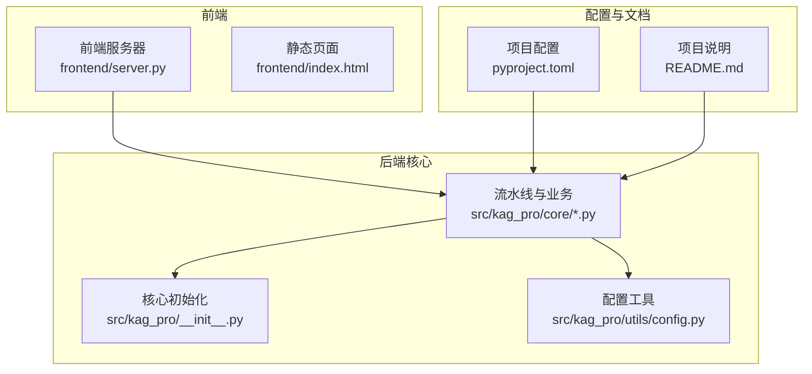
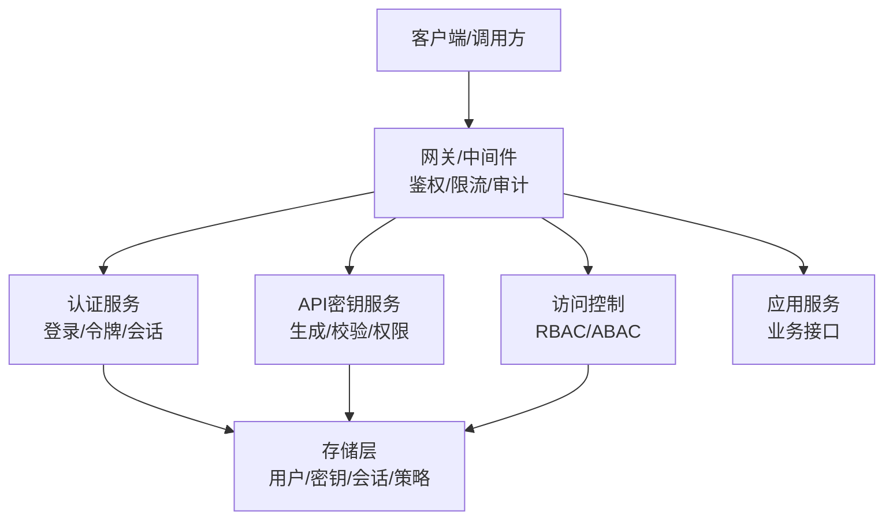
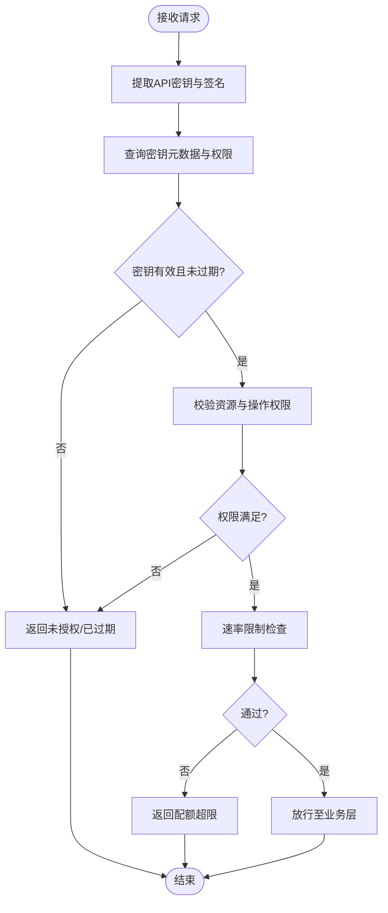
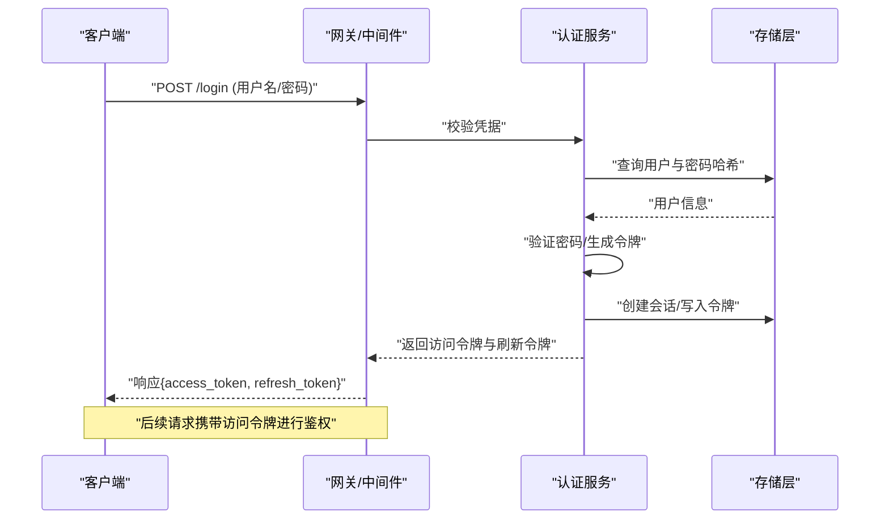
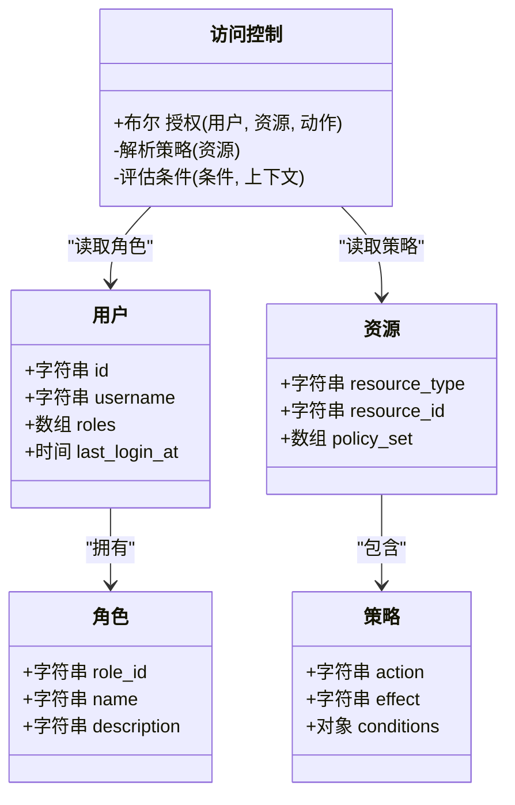
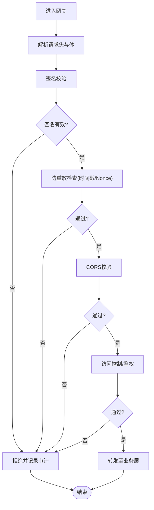
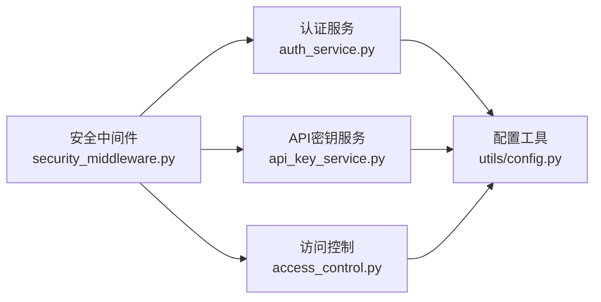

# 认证与安全

<cite>
**本文引用的文件**   
- [README.md](file://README.md)
- [pyproject.toml](file://pyproject.toml)
- [src/kag_pro/utils/config.py](file://src/kag_pro/utils/config.py)
- [frontend/server.py](file://frontend/server.py)
</cite>

## 目录
1. [简介](#简介)
2. [项目结构](#项目结构)
3. [核心组件](#核心组件)
4. [架构总览](#架构总览)
5. [详细组件分析](#详细组件分析)
6. [依赖分析](#依赖分析)
7. [性能考虑](#性能考虑)
8. [故障排查指南](#故障排查指南)
9. [结论](#结论)
10. [附录](#附录)

## 简介
本文件面向KAG-Pro的认证与安全机制，目标是：
- 说明API密钥的生成、管理与验证流程，覆盖生命周期与权限控制
- 文档化用户身份验证方法（登录认证、会话管理、令牌刷新）
- 详细说明访问控制与权限系统（角色定义、资源访问权限、操作权限）
- 记录安全最佳实践（HTTPS配置、CORS设置、请求签名验证、防重放攻击）
- 提供安全配置示例与常见威胁防护方案
- 给出安全审计日志的记录格式与分析方法

重要说明：当前仓库未包含显式的认证与安全实现代码。本文基于现有工程结构与通用安全实践，给出可落地的设计与集成建议，并标注“待实现”项，便于后续在工程中落地。

## 项目结构
从仓库结构看，后端核心逻辑位于 src/kag_pro/，前端服务位于 frontend/，配置入口在 pyproject.toml 与 README.md。认证与安全相关能力尚未以独立模块形式出现，建议在 utils 或新增 security 子包中统一实现。

图表来源
- [frontend/server.py](file://frontend/server.py)
- [src/kag_pro/utils/config.py](file://src/kag_pro/utils/config.py)
- [pyproject.toml](file://pyproject.toml)
- [README.md](file://README.md)

章节来源
- [README.md](file://README.md)
- [pyproject.toml](file://pyproject.toml)
- [src/kag_pro/utils/config.py](file://src/kag_pro/utils/config.py)
- [frontend/server.py](file://frontend/server.py)

## 核心组件
本节聚焦认证与安全的关键构件与职责划分，结合现有工程位置提出落地建议。

- API密钥服务（待实现）
  - 职责：生成、存储、轮换、吊销、校验；绑定租户/用户与权限集
  - 建议位置：security/api_key_service.py（新建）
  - 关键能力：
    - 生成：高熵随机串，前缀标识版本与环境
    - 存储：加密存储（如KMS/环境变量/密钥管理服务），仅存哈希或密文
    - 校验：请求头提取、签名校验、过期检查、速率限制
    - 权限：按密钥粒度授权资源与操作

- 用户认证与会话（待实现）
  - 职责：用户名/密码或第三方登录、会话创建、令牌签发与刷新
  - 建议位置：security/auth_service.py（新建）
  - 关键能力：
    - 登录：校验凭据，签发短期访问令牌与长期刷新令牌
    - 会话：服务端会话存储（Redis/DB），支持失效与注销
    - 刷新：无感续期，限频与设备指纹校验

- 访问控制与权限（待实现）
  - 职责：RBAC/ABAC策略、资源级与操作级鉴权
  - 建议位置：security/access_control.py（新建）
  - 关键能力：
    - 角色模型：管理员、开发者、只读等
    - 资源模型：数据集、知识库、生成任务等
    - 策略引擎：规则匹配、缓存命中、拒绝优先

- 网关与中间件（待实现）
  - 职责：统一入口、鉴权拦截、审计日志、限流熔断
  - 建议位置：middleware/security_middleware.py（新建）
  - 关键能力：
    - 请求签名验证、时间戳与Nonce防重放
    - CORS白名单、IP白名单、UA校验
    - 审计日志结构化输出

- 配置与安全参数（已有/扩展）
  - 现有：src/kag_pro/utils/config.py 用于加载配置
  - 建议：将密钥、证书路径、CORS、限流阈值等集中管理

章节来源
- [src/kag_pro/utils/config.py](file://src/kag_pro/utils/config.py)

## 架构总览
下图展示认证与安全在系统中的分层与交互关系。当前为概念性设计图，用于指导后续实现。

[此图为概念性架构图，不直接映射具体源码文件，故不提供图表来源]

## 详细组件分析

### API密钥服务（待实现）
- 目标
  - 为外部调用者提供稳定的API密钥凭证，支持细粒度权限与生命周期管理
- 关键流程
  - 生成：组合环境标识、版本、随机数，计算摘要并持久化
  - 校验：解析请求头、验签、检查过期与配额
  - 轮换：灰度发布旧密钥，自动迁移
  - 吊销：黑名单与快速失效
- 数据结构（建议）
  - 密钥元数据：id、owner_id、scope、expires_at、status、created_at
  - 权限集合：resource_action[]
- 复杂度与性能
  - 校验O(1)查找+签名验证，建议缓存热点密钥元数据
- 错误处理
  - 非法签名、过期、越权、配额超限分别返回不同状态码与提示
- 参考实现位置
  - 建议新建：security/api_key_service.py

[此图为概念流程图，不直接映射具体源码文件，故不提供图表来源]

### 用户认证与会话（待实现）
- 目标
  - 提供安全的登录认证、会话管理与令牌刷新能力
- 关键流程
  - 登录：校验凭据，签发短期访问令牌与长期刷新令牌
  - 会话：服务端维护会话状态，支持主动失效
  - 刷新：使用刷新令牌换取新访问令牌，支持设备指纹与频率限制
- 数据结构（建议）
  - 用户：id、username、password_hash、roles[]、last_login_at
  - 会话：session_id、user_id、device_fingerprint、expires_at、revoked
  - 令牌：access_token、refresh_token、issued_at、expires_at、jti
- 复杂度与性能
  - 登录O(1)查表+哈希校验；刷新O(1)查会话；建议缓存热点会话
- 错误处理
  - 凭据错误、会话失效、刷新失败、并发冲突等
- 参考实现位置
  - 建议新建：security/auth_service.py

[此图为概念序列图，不直接映射具体源码文件，故不提供图表来源]

### 访问控制与权限（待实现）
- 目标
  - 基于角色与资源的精细化访问控制，支持操作级权限
- 关键流程
  - 策略解析：根据用户角色、资源类型、操作类型匹配策略
  - 决策：默认拒绝，允许列表与拒绝列表优先级明确
  - 审计：记录每次鉴权结果与上下文
- 数据结构（建议）
  - 角色：role_id、name、description
  - 资源：resource_type、resource_id、policy_set[]
  - 策略：action、effect、conditions
- 复杂度与性能
  - 策略匹配可采用规则树或表达式引擎，建议缓存策略结果
- 错误处理
  - 策略缺失、条件不满足、资源不存在等
- 参考实现位置
  - 建议新建：security/access_control.py

[此图为概念类图，不直接映射具体源码文件，故不提供图表来源]

### 网关与中间件（待实现）
- 目标
  - 统一鉴权入口，执行签名校验、防重放、限流、CORS与审计
- 关键流程
  - 签名校验：时间戳+Nonce+BodyHash+私钥签名
  - 防重放：Nonce去重窗口、时间戳窗口
  - CORS：白名单域名、预检请求处理
  - 审计：结构化日志记录请求ID、用户、资源、动作、结果
- 参考实现位置
  - 建议新建：middleware/security_middleware.py

[此图为概念流程图，不直接映射具体源码文件，故不提供图表来源]

### 配置与安全参数（已有/扩展）
- 现有
  - 配置工具位于 src/kag_pro/utils/config.py，可用于加载环境变量与配置文件
- 建议
  - 将以下安全参数纳入配置：
    - HTTPS证书路径与端口
    - CORS白名单域名与方法
    - API密钥算法与轮转周期
    - 签名算法、时间戳容忍窗口、Nonce长度
    - 限流阈值与滑动窗口大小
    - 审计日志输出路径与级别

章节来源
- [src/kag_pro/utils/config.py](file://src/kag_pro/utils/config.py)

## 依赖分析
- 内部依赖
  - 认证与访问控制应依赖配置工具与存储抽象
  - 中间件依赖认证服务、密钥服务与访问控制
- 外部依赖
  - 建议使用成熟库进行JWT、哈希、加密与限流
- 耦合与内聚
  - 将鉴权逻辑集中在中间件，业务层保持最小依赖
  - 策略与角色解耦，便于扩展

[此图为概念依赖图，不直接映射具体源码文件，故不提供图表来源]

## 性能考虑
- 缓存
  - 缓存密钥元数据、策略结果与会话热点条目
- 异步
  - 审计日志异步落盘，避免阻塞主流程
- 限流
  - 网关层对登录与刷新接口实施更严格限流
- 连接池
  - 数据库与缓存连接复用，减少握手开销

[本节为通用指导，不涉及具体源码文件]

## 故障排查指南
- 常见问题
  - 签名失败：检查时间戳窗口、Nonce重复、私钥一致性
  - 权限不足：核对角色与策略、资源ID与操作名
  - 会话失效：确认刷新令牌是否过期、设备指纹是否变更
  - CORS报错：检查预检请求与白名单配置
- 定位步骤
  - 查看网关审计日志中的请求ID与错误码
  - 核对配置项与运行时环境变量
  - 复现时开启调试日志，关注鉴权链路各节点耗时
- 恢复措施
  - 临时放宽策略或添加白名单，事后复盘
  - 轮换密钥并通知受影响调用方

[本节为通用指导，不涉及具体源码文件]

## 结论
当前仓库未包含显式的安全实现。本文提供了完整的认证与安全体系设计蓝图，包括API密钥、用户认证与会话、访问控制、网关中间件与配置管理。建议按本文档逐步落地，并在生产环境启用HTTPS、CORS白名单、请求签名与防重放机制，配合结构化审计日志与监控告警，形成闭环安全治理。

[本节为总结性内容，不涉及具体源码文件]

## 附录

### 安全最佳实践清单
- 传输安全
  - 强制HTTPS，禁用弱协议与套件
  - 启用HSTS与证书固定（可选）
- 跨域安全
  - 精确配置CORS白名单，禁止通配符
  - 预检请求缓存与校验
- 请求完整性
  - 使用强签名算法（如HMAC-SHA256或RSA-PSS）
  - 时间戳与Nonce防重放
- 身份与会话
  - 短时效访问令牌+长时效刷新令牌
  - 会话服务端存储，支持主动失效
- 权限控制
  - RBAC为主，必要时引入ABAC条件
  - 默认拒绝，最小权限原则
- 审计与合规
  - 结构化日志，记录请求ID、主体、资源、动作、结果
  - 定期审计与异常告警

[本节为通用指导，不涉及具体源码文件]

### 安全配置示例（字段说明）
- HTTPS
  - 证书路径、私钥路径、监听端口
- CORS
  - 允许源、允许方法、允许头、是否允许凭据
- API密钥
  - 算法、版本前缀、轮转周期、吊销列表存储
- 签名
  - 算法、时间戳容忍秒数、Nonce长度、去重窗口
- 限流
  - 全局QPS、登录接口QPS、刷新接口QPS
- 审计
  - 输出路径、保留天数、脱敏字段

[本节为通用指导，不涉及具体源码文件]

### 常见威胁与防护
- 重放攻击：时间戳窗口+Nonce去重
- 暴力破解：登录限流与账户锁定
- 越权访问：资源级与操作级鉴权、默认拒绝
- 敏感泄露：最小化日志、脱敏字段、HTTPS
- 跨站脚本与注入：输入校验、输出编码、参数化查询

[本节为通用指导，不涉及具体源码文件]

### 安全审计日志格式（建议）
- 字段
  - timestamp、request_id、client_ip、user_id、resource、action、result、latency_ms、error_code、signature_algo、nonce
- 用途
  - 安全事件溯源、异常检测、合规审计

[本节为通用指导，不涉及具体源码文件]