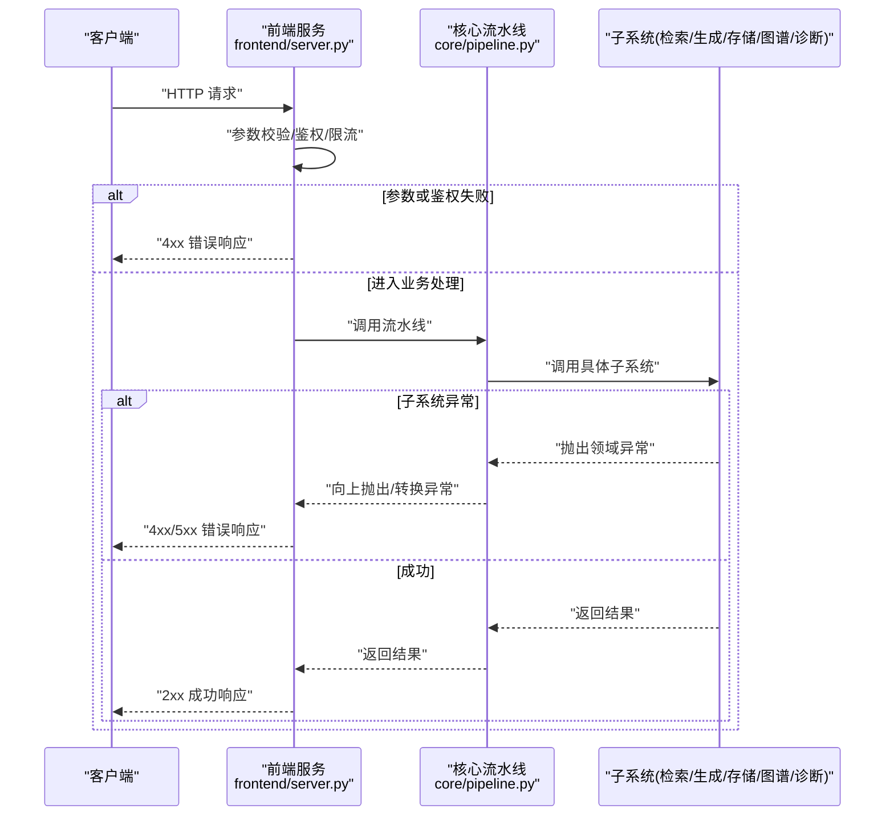
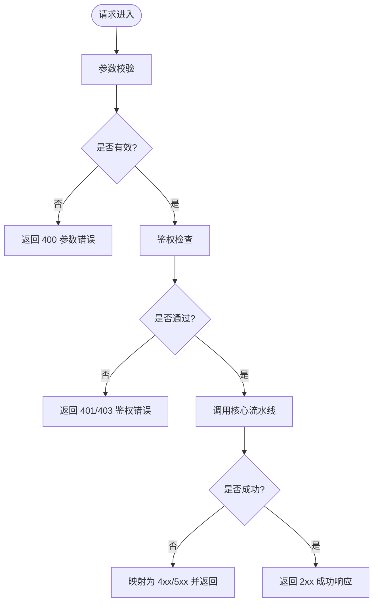
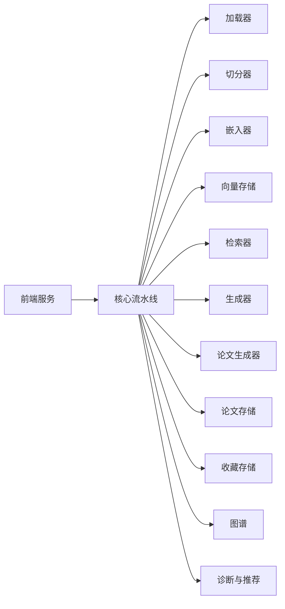

# 错误处理与状态码

<cite>
**本文引用的文件**   
- [README.md](file://README.md)
- [pyproject.toml](file://pyproject.toml)
- [Makefile](file://Makefile)
- [src/kag_pro/core/pipeline.py](file://src/kag_pro/core/pipeline.py)
- [src/kag_pro/core/generator.py](file://src/kag_pro/core/generator.py)
- [src/kag_pro/core/retriever.py](file://src/kag_pro/core/retriever.py)
- [src/kag_pro/core/embedder.py](file://src/kag_pro/core/embedder.py)
- [src/kag_pro/core/vector_store.py](file://src/kag_pro/core/vector_store.py)
- [src/kag_pro/core/favorite_store.py](file://src/kag_pro/core/favorite_store.py)
- [src/kag_pro/core/paper_generator.py](file://src/kag_pro/core/paper_generator.py)
- [src/kag_pro/core/paper_store.py](file://src/kag_pro/core/paper_store.py)
- [src/kag_pro/core/loader.py](file://src/kag_pro/core/loader.py)
- [src/kag_pro/core/splitter.py](file://src/kag_pro/core/splitter.py)
- [src/kag_pro/core/verifier.py](file://src/kag_pro/core/verifier.py)
- [src/kag_pro/datasets/textbook_generator.py](file://src/kag_pro/datasets/textbook_generator.py)
- [src/kag_pro/diagnosis/classifier.py](file://src/kag_pro/diagnosis/classifier.py)
- [src/kag_pro/diagnosis/diagnoser.py](file://src/kag_pro/diagnosis/diagnoser.py)
- [src/kag_pro/diagnosis/knowledge_tracing.py](file://src/kag_pro/diagnosis/knowledge_tracing.py)
- [src/kag_pro/diagnosis/recommender.py](file://src/kag_pro/diagnosis/recommender.py)
- [src/kag_pro/kg/auto_extractor.py](file://src/kag_pro/kg/auto_extractor.py)
- [src/kag_pro/kg/extractor.py](file://src/kag_pro/kg/extractor.py)
- [src/kag_pro/kg/graph.py](file://src/kag_pro/kg/graph.py)
- [src/kag_pro/kg/kg_retriever.py](file://src/kag_pro/kg/kg_retriever.py)
- [src/kag_pro/stage/detector.py](file://src/kag_pro/stage/detector.py)
- [src/kag_pro/utils/config.py](file://src/kag_pro/utils/config.py)
- [frontend/server.py](file://frontend/server.py)
</cite>

## 目录
1. [简介](#简介)
2. [项目结构](#项目结构)
3. [核心组件](#核心组件)
4. [架构总览](#架构总览)
5. [详细组件分析](#详细组件分析)
6. [依赖关系分析](#依赖关系分析)
7. [性能考虑](#性能考虑)
8. [故障排除指南](#故障排除指南)
9. [结论](#结论)
10. [附录](#附录)

## 简介
本文件为 KAG-Pro 的错误处理机制提供系统化文档，目标是：
- 统一 HTTP 状态码语义与使用场景（2xx、4xx、5xx）
- 定义标准化错误响应格式（错误代码、错误消息、错误详情、建议解决方案）
- 梳理常见错误类型与处理建议（参数校验、权限不足、资源不存在、服务不可用等）
- 说明异常捕获与日志记录机制（含堆栈信息收集与分析）
- 给出错误监控与告警配置方法，帮助快速定位问题
- 提供调试技巧与故障排除流程

## 项目结构
KAG-Pro 采用模块化组织方式，核心业务位于 src/kag_pro 下，前端服务位于 frontend。错误处理贯穿各层：
- 前端服务层：负责接收请求、返回 HTTP 响应与错误
- 核心业务层：数据加载、检索、生成、图谱构建、诊断推荐等
- 工具与配置层：配置读取、通用工具

```mermaid
graph TB
Client["客户端"] --> FE["前端服务<br/>frontend/server.py"]
FE --> CorePipeline["核心流水线<br/>core/pipeline.py"]
CorePipeline --> Loader["数据加载器<br/>core/loader.py"]
CorePipeline --> Splitter["文本切分器<br/>core/splitter.py"]
CorePipeline --> Embedder["嵌入模型<br/>core/embedder.py"]
CorePipeline --> VectorStore["向量存储<br/>core/vector_store.py"]
CorePipeline --> Retriever["检索器<br/>core/retriever.py"]
CorePipeline --> Generator["生成器<br/>core/generator.py"]
CorePipeline --> PaperGen["论文生成器<br/>core/paper_generator.py"]
CorePipeline --> PaperStore["论文存储<br/>core/paper_store.py"]
CorePipeline --> FavoriteStore["收藏存储<br/>core/favorite_store.py"]
CorePipeline --> KGGraph["知识图谱图<br/>kg/graph.py"]
CorePipeline --> KGExt["图谱提取器<br/>kg/extractor.py / auto_extractor.py"]
CorePipeline --> KGRetriever["图谱检索器<br/>kg/kg_retriever.py"]
CorePipeline --> DiagDiagnoser["诊断器<br/>diagnosis/diagnoser.py"]
CorePipeline --> DiagClassifier["分类器<br/>diagnosis/classifier.py"]
CorePipeline --> DiagKT["知识追踪<br/>diagnosis/knowledge_tracing.py"]
CorePipeline --> DiagRec["推荐器<br/>diagnosis/recommender.py"]
CorePipeline --> UtilsCfg["配置工具<br/>utils/config.py"]
```

图表来源
- [frontend/server.py](file://frontend/server.py)
- [src/kag_pro/core/pipeline.py](file://src/kag_pro/core/pipeline.py)
- [src/kag_pro/core/loader.py](file://src/kag_pro/core/loader.py)
- [src/kag_pro/core/splitter.py](file://src/kag_pro/core/splitter.py)
- [src/kag_pro/core/embedder.py](file://src/kag_pro/core/embedder.py)
- [src/kag_pro/core/vector_store.py](file://src/kag_pro/core/vector_store.py)
- [src/kag_pro/core/retriever.py](file://src/kag_pro/core/retriever.py)
- [src/kag_pro/core/generator.py](file://src/kag_pro/core/generator.py)
- [src/kag_pro/core/paper_generator.py](file://src/kag_pro/core/paper_generator.py)
- [src/kag_pro/core/paper_store.py](file://src/kag_pro/core/paper_store.py)
- [src/kag_pro/core/favorite_store.py](file://src/kag_pro/core/favorite_store.py)
- [src/kag_pro/kg/graph.py](file://src/kag_pro/kg/graph.py)
- [src/kag_pro/kg/extractor.py](file://src/kag_pro/kg/extractor.py)
- [src/kag_pro/kg/auto_extractor.py](file://src/kag_pro/kg/auto_extractor.py)
- [src/kag_pro/kg/kg_retriever.py](file://src/kag_pro/kg/kg_retriever.py)
- [src/kag_pro/diagnosis/diagnoser.py](file://src/kag_pro/diagnosis/diagnoser.py)
- [src/kag_pro/diagnosis/classifier.py](file://src/kag_pro/diagnosis/classifier.py)
- [src/kag_pro/diagnosis/knowledge_tracing.py](file://src/kag_pro/diagnosis/knowledge_tracing.py)
- [src/kag_pro/diagnosis/recommender.py](file://src/kag_pro/diagnosis/recommender.py)
- [src/kag_pro/utils/config.py](file://src/kag_pro/utils/config.py)

章节来源
- [README.md](file://README.md)
- [pyproject.toml](file://pyproject.toml)
- [Makefile](file://Makefile)

## 核心组件
- 前端服务层：作为 HTTP 入口，负责请求解析、路由分发、统一错误包装与响应返回
- 核心流水线：编排数据加载、切分、嵌入、检索、生成、存储与图谱操作
- 诊断与推荐：基于图谱与学习轨迹的诊断、分类、知识追踪与个性化推荐
- 工具与配置：集中管理配置项与运行时参数

在错误处理方面，建议在各层遵循统一的异常到 HTTP 响应的映射策略，确保对外暴露的状态码与错误体一致。

章节来源
- [frontend/server.py](file://frontend/server.py)
- [src/kag_pro/core/pipeline.py](file://src/kag_pro/core/pipeline.py)
- [src/kag_pro/utils/config.py](file://src/kag_pro/utils/config.py)

## 架构总览
下图展示了从客户端请求到核心处理的端到端流程，以及错误在各层的传播路径与统一出口。

图表来源
- [frontend/server.py](file://frontend/server.py)
- [src/kag_pro/core/pipeline.py](file://src/kag_pro/core/pipeline.py)

## 详细组件分析

### 前端服务层错误处理
职责
- 统一接收请求、解析参数、鉴权与限流
- 将内部异常转换为标准 HTTP 响应
- 输出结构化错误体（错误代码、错误消息、错误详情、建议解决方案）

关键要点
- 参数校验失败：返回 400，错误码以 PARAM_ 开头
- 鉴权失败：返回 401/403，错误码以 AUTH_ 开头
- 资源不存在：返回 404，错误码以 RESOURCE_ 开头
- 业务冲突：返回 409，错误码以 CONFLICT_ 开头
- 服务端异常：返回 500，错误码以 SERVER_ 开头
- 外部依赖超时/不可用：返回 502/503，错误码以 EXTERNAL_ 开头

图表来源
- [frontend/server.py](file://frontend/server.py)

章节来源
- [frontend/server.py](file://frontend/server.py)

### 核心流水线错误处理
职责
- 编排各子系统的执行顺序
- 捕获子系统异常并进行上下文增强（如请求ID、阶段名）
- 将领域异常转换为上层可识别的异常类型

关键要点
- 对每个阶段设置 try/catch，记录阶段名称与输入摘要
- 对可恢复错误进行重试或降级（如检索失败回退到默认策略）
- 对不可恢复错误直接上抛，由前端服务层统一封装

```mermaid
classDiagram
class Pipeline {
+execute(request) Result
-run_stage(name, func) Result
-handle_exception(stage, exc) Exception
}
class Loader {
+load(path) Data
}
class Splitter {
+split(text) Text[]
}
class Embedder {
+embed(docs) Vector[]
}
class VectorStore {
+index(vectors) void
+search(query, k) Doc[]
}
class Retriever {
+retrieve(query) Doc[]
}
class Generator {
+generate(context) Text
}
class PaperGenerator {
+create_paper(content) Paper
}
class PaperStore {
+save(paper) void
}
class FavoriteStore {
+add(user_id, paper_id) void
}
class KGGraph {
+build(nodes, edges) Graph
+query(pattern) Results
}
class Extractor {
+extract(text) Entities
}
class AutoExtractor {
+auto_extract(data) Entities
}
class KGRetriever {
+retrieve_kg(query) Results
}
class Diagnoser {
+diagnose(profile) Diagnosis
}
class Classifier {
+classify(item) Label
}
class KnowledgeTracing {
+trace(history) Trace
}
class Recommender {
+recommend(user) Suggestions
}
Pipeline --> Loader : "使用"
Pipeline --> Splitter : "使用"
Pipeline --> Embedder : "使用"
Pipeline --> VectorStore : "使用"
Pipeline --> Retriever : "使用"
Pipeline --> Generator : "使用"
Pipeline --> PaperGenerator : "使用"
Pipeline --> PaperStore : "使用"
Pipeline --> FavoriteStore : "使用"
Pipeline --> KGGraph : "使用"
Pipeline --> Extractor : "使用"
Pipeline --> AutoExtractor : "使用"
Pipeline --> KGRetriever : "使用"
Pipeline --> Diagnoser : "使用"
Pipeline --> Classifier : "使用"
Pipeline --> KnowledgeTracing : "使用"
Pipeline --> Recommender : "使用"
```

图表来源
- [src/kag_pro/core/pipeline.py](file://src/kag_pro/core/pipeline.py)
- [src/kag_pro/core/loader.py](file://src/kag_pro/core/loader.py)
- [src/kag_pro/core/splitter.py](file://src/kag_pro/core/splitter.py)
- [src/kag_pro/core/embedder.py](file://src/kag_pro/core/embedder.py)
- [src/kag_pro/core/vector_store.py](file://src/kag_pro/core/vector_store.py)
- [src/kag_pro/core/retriever.py](file://src/kag_pro/core/retriever.py)
- [src/kag_pro/core/generator.py](file://src/kag_pro/core/generator.py)
- [src/kag_pro/core/paper_generator.py](file://src/kag_pro/core/paper_generator.py)
- [src/kag_pro/core/paper_store.py](file://src/kag_pro/core/paper_store.py)
- [src/kag_pro/core/favorite_store.py](file://src/kag_pro/core/favorite_store.py)
- [src/kag_pro/kg/graph.py](file://src/kag_pro/kg/graph.py)
- [src/kag_pro/kg/extractor.py](file://src/kag_pro/kg/extractor.py)
- [src/kag_pro/kg/auto_extractor.py](file://src/kag_pro/kg/auto_extractor.py)
- [src/kag_pro/kg/kg_retriever.py](file://src/kag_pro/kg/kg_retriever.py)
- [src/kag_pro/diagnosis/diagnoser.py](file://src/kag_pro/diagnosis/diagnoser.py)
- [src/kag_pro/diagnosis/classifier.py](file://src/kag_pro/diagnosis/classifier.py)
- [src/kag_pro/diagnosis/knowledge_tracing.py](file://src/kag_pro/diagnosis/knowledge_tracing.py)
- [src/kag_pro/diagnosis/recommender.py](file://src/kag_pro/diagnosis/recommender.py)

章节来源
- [src/kag_pro/core/pipeline.py](file://src/kag_pro/core/pipeline.py)

### 数据加载与切分错误处理
- 加载器：文件不存在、编码错误、权限不足应返回 404/403；IO 异常返回 500
- 切分器：输入为空或超长应返回 400；切分失败返回 500

章节来源
- [src/kag_pro/core/loader.py](file://src/kag_pro/core/loader.py)
- [src/kag_pro/core/splitter.py](file://src/kag_pro/core/splitter.py)

### 嵌入与向量存储错误处理
- 嵌入模型初始化失败：返回 503
- 向量索引写入失败：返回 500
- 查询失败或无结果：返回 200 空结果集或 404 视业务约定而定

章节来源
- [src/kag_pro/core/embedder.py](file://src/kag_pro/core/embedder.py)
- [src/kag_pro/core/vector_store.py](file://src/kag_pro/core/vector_store.py)

### 检索与生成错误处理
- 检索器：超时或下游不可用返回 502/503；参数非法返回 400
- 生成器：模型不可用或生成失败返回 503；上下文缺失返回 400

章节来源
- [src/kag_pro/core/retriever.py](file://src/kag_pro/core/retriever.py)
- [src/kag_pro/core/generator.py](file://src/kag_pro/core/generator.py)

### 论文生成与存储错误处理
- 论文生成器：内容不合法或模板错误返回 400；生成失败返回 500
- 论文存储：磁盘空间不足或权限不足返回 500/403

章节来源
- [src/kag_pro/core/paper_generator.py](file://src/kag_pro/core/paper_generator.py)
- [src/kag_pro/core/paper_store.py](file://src/kag_pro/core/paper_store.py)

### 收藏存储错误处理
- 重复收藏：返回 409
- 用户不存在：返回 404
- 存储异常：返回 500

章节来源
- [src/kag_pro/core/favorite_store.py](file://src/kag_pro/core/favorite_store.py)

### 知识图谱相关错误处理
- 图谱构建：节点/边数据非法返回 400；构建失败返回 500
- 图谱提取：NLP 模型不可用返回 503；提取失败返回 500
- 图谱检索：模式非法返回 400；查询失败返回 500

章节来源
- [src/kag_pro/kg/graph.py](file://src/kag_pro/kg/graph.py)
- [src/kag_pro/kg/extractor.py](file://src/kag_pro/kg/extractor.py)
- [src/kag_pro/kg/auto_extractor.py](file://src/kag_pro/kg/auto_extractor.py)
- [src/kag_pro/kg/kg_retriever.py](file://src/kag_pro/kg/kg_retriever.py)

### 诊断与推荐错误处理
- 诊断器：输入画像不完整返回 400；诊断失败返回 500
- 分类器：标签集未初始化返回 503；分类失败返回 500
- 知识追踪：历史数据缺失返回 400；追踪失败返回 500
- 推荐器：用户画像缺失返回 400；推荐失败返回 500

章节来源
- [src/kag_pro/diagnosis/diagnoser.py](file://src/kag_pro/diagnosis/diagnoser.py)
- [src/kag_pro/diagnosis/classifier.py](file://src/kag_pro/diagnosis/classifier.py)
- [src/kag_pro/diagnosis/knowledge_tracing.py](file://src/kag_pro/diagnosis/knowledge_tracing.py)
- [src/kag_pro/diagnosis/recommender.py](file://src/kag_pro/diagnosis/recommender.py)

### 教材生成错误处理
- 教材生成：模板或数据源异常返回 400/500；持久化失败返回 500

章节来源
- [src/kag_pro/datasets/textbook_generator.py](file://src/kag_pro/datasets/textbook_generator.py)

### 配置与工具错误处理
- 配置读取：键不存在或类型不匹配返回 400；配置文件损坏返回 500

章节来源
- [src/kag_pro/utils/config.py](file://src/kag_pro/utils/config.py)

## 依赖关系分析
- 前端服务依赖核心流水线，核心流水线组合多个子系统
- 子系统之间尽量低耦合，通过接口契约交互
- 外部依赖（模型、存储、网络）应在边界处进行隔离与容错

图表来源
- [frontend/server.py](file://frontend/server.py)
- [src/kag_pro/core/pipeline.py](file://src/kag_pro/core/pipeline.py)

章节来源
- [pyproject.toml](file://pyproject.toml)
- [Makefile](file://Makefile)

## 性能考虑
- 避免在热路径中执行重型 I/O 或阻塞操作，必要时异步化
- 对检索与生成设置合理的超时与重试上限
- 对向量索引与图谱查询建立缓存与预取策略
- 对错误率与延迟进行指标采集，设置阈值告警

[本节为通用指导，无需源码引用]

## 故障排除指南
- 快速定位
  - 查看前端服务日志中的请求 ID 与阶段名
  - 根据错误码前缀判断错误类别（PARAM_/AUTH_/RESOURCE_/SERVER_/EXTERNAL_）
  - 核对上游依赖健康状态（模型、存储、网络）
- 常见问题
  - 参数校验失败：检查必填字段、数据类型与范围
  - 鉴权失败：确认令牌有效性、角色与权限
  - 资源不存在：确认路径、ID 与命名空间
  - 服务不可用：检查依赖服务端口、证书与配额
- 日志与堆栈
  - 记录异常类型、消息、堆栈与上下文（请求ID、阶段、输入摘要）
  - 对敏感信息进行脱敏处理
- 监控与告警
  - 统计各错误码占比与趋势
  - 对 5xx 错误设置高优先级告警
  - 对关键子系统可用性设置心跳检测

[本节为通用指导，无需源码引用]

## 结论
通过统一的状态码规范、标准化的错误响应格式、完善的异常捕获与日志记录、以及监控告警体系，KAG-Pro 能够在复杂的多子系统协作环境中实现稳定、可观测、易排错的错误处理机制。建议在后续迭代中持续完善错误码字典与自动化测试覆盖，提升整体质量与用户体验。

[本节为总结性内容，无需源码引用]

## 附录

### HTTP 状态码与错误码映射表
- 2xx 成功
  - 200 OK：请求成功
  - 201 Created：资源创建成功
  - 204 No Content：操作成功但无响应体
- 4xx 客户端错误
  - 400 Bad Request：参数校验失败（错误码前缀：PARAM_）
  - 401 Unauthorized：未认证（错误码前缀：AUTH_UNAUTHENTICATED_）
  - 403 Forbidden：权限不足（错误码前缀：AUTH_FORBIDDEN_）
  - 404 Not Found：资源不存在（错误码前缀：RESOURCE_NOT_FOUND_）
  - 409 Conflict：资源冲突（错误码前缀：CONFLICT_）
- 5xx 服务端错误
  - 500 Internal Server Error：内部错误（错误码前缀：SERVER_）
  - 502 Bad Gateway：上游网关错误（错误码前缀：EXTERNAL_GATEWAY_）
  - 503 Service Unavailable：服务不可用（错误码前缀：EXTERNAL_UNAVAILABLE_）
  - 504 Gateway Timeout：网关超时（错误码前缀：EXTERNAL_TIMEOUT_）

### 标准化错误响应格式
- 字段
  - code：错误码（字符串，带前缀）
  - message：错误消息（人类可读）
  - details：错误详情（可选，包含字段级错误或堆栈摘要）
  - suggestion：建议解决方案（可选，面向用户的修复指引）
- 示例结构（仅描述字段，不含具体值）
  - { "code": "PARAM_INVALID_FIELD", "message": "参数校验失败", "details": { "field": "xxx", "reason": "yyy" }, "suggestion": "请检查 xxx 的取值范围" }

### 常见错误类型与建议
- 参数验证错误
  - 现象：400，缺少必填字段或类型不符
  - 建议：补充参数、修正类型、参考 API 文档
- 权限不足
  - 现象：401/403，令牌过期或缺少角色
  - 建议：重新登录、申请权限、检查角色绑定
- 资源不存在
  - 现象：404，路径或 ID 无效
  - 建议：核对资源标识、确认资源已创建
- 服务不可用
  - 现象：503/502/504，依赖服务异常或超时
  - 建议：稍后重试、检查依赖服务状态、联系运维

### 异常捕获与日志记录机制
- 捕获层级
  - 前端服务层：统一捕获所有未处理异常，转换为标准错误响应
  - 核心流水线：按阶段捕获异常，附加上下文信息
  - 子系统：捕获底层异常，转换为领域异常
- 日志内容
  - 时间戳、请求ID、阶段名、异常类型与消息、堆栈信息（脱敏）、输入摘要
- 堆栈分析
  - 关注最近一次变更与关联依赖
  - 结合监控指标定位热点与瓶颈

### 错误监控与告警配置方法
- 指标采集
  - 错误码分布、错误率、延迟分位、依赖健康状态
- 告警规则
  - 5xx 错误率超过阈值立即告警
  - 关键子系统不可用持续一定时间触发告警
- 可视化
  - 仪表盘展示错误趋势与热点模块
  - 链路追踪串联请求全生命周期

[本节为通用指导，无需源码引用]