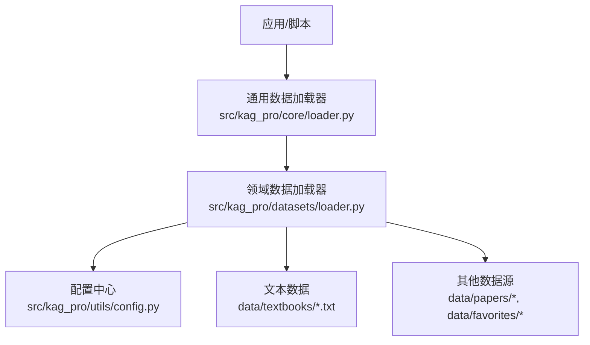
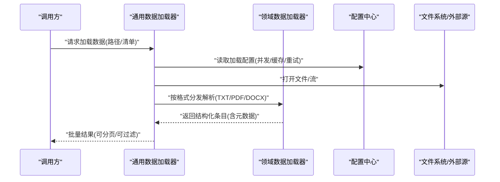
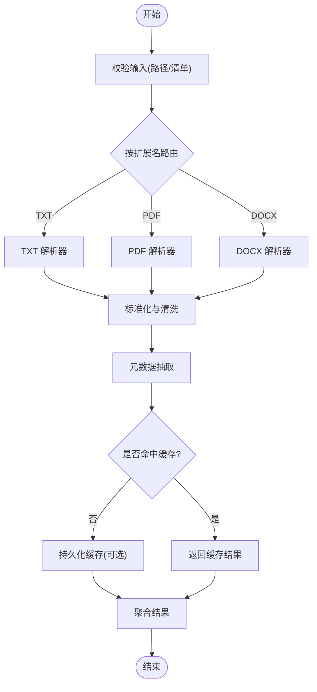
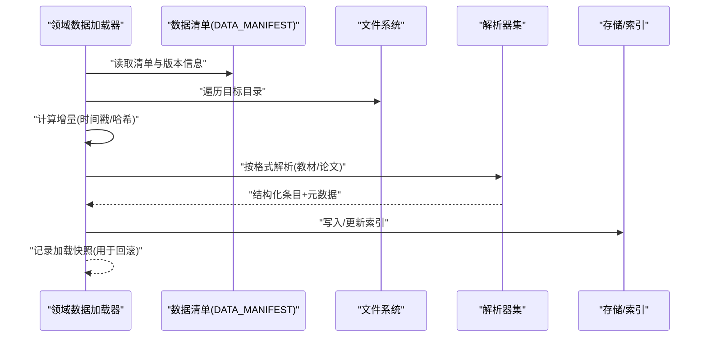
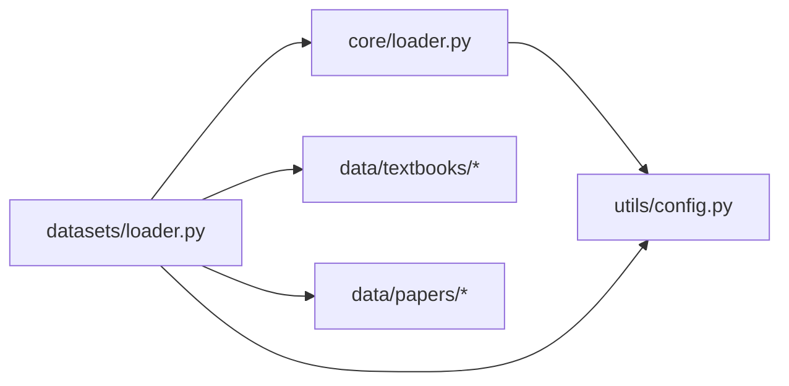

# 内容加载器

<cite>
**本文引用的文件**   
- [src/kag_pro/core/loader.py](file://src/kag_pro/core/loader.py)
- [src/kag_pro/datasets/loader.py](file://src/kag_pro/datasets/loader.py)
- [src/kag_pro/utils/config.py](file://src/kag_pro/utils/config.py)
- [README.md](file://README.md)
- [DATA_MANIFEST.md](file://DATA_MANIFEST.md)
</cite>

## 目录
1. [简介](#简介)
2. [项目结构](#项目结构)
3. [核心组件](#核心组件)
4. [架构总览](#架构总览)
5. [详细组件分析](#详细组件分析)
6. [依赖关系分析](#依赖关系分析)
7. [性能考虑](#性能考虑)
8. [故障排查指南](#故障排查指南)
9. [结论](#结论)
10. [附录](#附录)

## 简介
本技术文档聚焦于 KAG-Pro 的内容加载器，围绕多格式文件解析（TXT、PDF、DOCX）、元数据提取（标题识别、章节划分、关键词提取、标签分类）、数据预处理管道（文本清洗、格式标准化、编码转换、异常处理）、版本管理（变更追踪、增量更新、回滚机制）以及配置选项（并行处理、缓存策略、错误恢复）进行系统化说明。同时提供面向教学内容的实际使用示例与数据集管理最佳实践，帮助读者快速上手并高效维护高质量的知识内容库。

## 项目结构
KAG-Pro 将“内容加载”能力拆分为两个层次：
- 通用数据加载层：负责从文件系统或外部来源读取原始数据，统一为内部数据结构。
- 领域数据加载层：针对教材、论文等特定资源类型，提供专用加载流程与元数据处理。

图表来源
- [src/kag_pro/core/loader.py](file://src/kag_pro/core/loader.py)
- [src/kag_pro/datasets/loader.py](file://src/kag_pro/datasets/loader.py)
- [src/kag_pro/utils/config.py](file://src/kag_pro/utils/config.py)

章节来源
- [README.md](file://README.md)
- [DATA_MANIFEST.md](file://DATA_MANIFEST.md)

## 核心组件
- 通用数据加载器：提供统一的文件读取接口、基础校验与错误包装，屏蔽底层差异，向上层暴露一致的数据契约。
- 领域数据加载器：在通用加载器基础上，实现教材/论文等资源的专用解析、元数据抽取与结构化输出。
- 配置中心：集中管理加载器的运行参数，包括并发度、缓存开关、重试策略、路径映射等。

章节来源
- [src/kag_pro/core/loader.py](file://src/kag_pro/core/loader.py)
- [src/kag_pro/datasets/loader.py](file://src/kag_pro/datasets/loader.py)
- [src/kag_pro/utils/config.py](file://src/kag_pro/utils/config.py)

## 架构总览
内容加载器采用分层解耦设计：上层业务调用通用加载器；通用加载器根据文件扩展名与配置路由到具体解析器；领域加载器对教材等资源执行元数据抽取与标准化；所有操作受配置中心统一管理，支持并行、缓存与错误恢复。

图表来源
- [src/kag_pro/core/loader.py](file://src/kag_pro/core/loader.py)
- [src/kag_pro/datasets/loader.py](file://src/kag_pro/datasets/loader.py)
- [src/kag_pro/utils/config.py](file://src/kag_pro/utils/config.py)

## 详细组件分析

### 通用数据加载器
职责
- 统一入口：接收路径列表或清单，返回标准数据项集合。
- 格式路由：基于扩展名选择 TXT、PDF、DOCX 等解析器。
- 错误封装：捕获 IO、解码、解析异常，转换为统一错误对象。
- 并发控制：依据配置启用线程/进程池并行读取。
- 缓存策略：可选地缓存已解析结果，避免重复 I/O 与计算。

关键流程
- 输入校验与去重
- 并行调度与进度反馈
- 失败重试与降级策略
- 结果聚合与排序

图表来源
- [src/kag_pro/core/loader.py](file://src/kag_pro/core/loader.py)

章节来源
- [src/kag_pro/core/loader.py](file://src/kag_pro/core/loader.py)

### 领域数据加载器（教材/论文）
职责
- 教材加载：扫描教材目录，按命名规范组织章节，生成结构化条目。
- 论文加载：解析论文元信息（作者、摘要、关键词），关联正文片段。
- 元数据增强：自动推断学科标签、难度等级、适用学段等。

关键流程
- 清单驱动：优先读取 DATA_MANIFEST 中的索引，保证一致性。
- 增量更新：对比时间戳与哈希，仅处理变更文件。
- 回滚机制：记录每次加载快照，支持回退到上一稳定版本。

图表来源
- [src/kag_pro/datasets/loader.py](file://src/kag_pro/datasets/loader.py)
- [DATA_MANIFEST.md](file://DATA_MANIFEST.md)

章节来源
- [src/kag_pro/datasets/loader.py](file://src/kag_pro/datasets/loader.py)
- [DATA_MANIFEST.md](file://DATA_MANIFEST.md)

### 配置中心
职责
- 集中管理加载器参数：并发度、超时、重试次数、缓存开关、路径映射、日志级别等。
- 环境适配：区分开发/测试/生产环境的不同默认值。
- 动态生效：支持运行时重载部分配置（如缓存开关）。

常用配置项（示例）
- 并发与队列：max_workers、batch_size、queue_timeout
- 缓存：cache_enabled、cache_backend、cache_ttl
- 错误恢复：retry_times、retry_backoff、fail_fast
- 路径与清单：data_root、manifest_path、ignore_patterns

章节来源
- [src/kag_pro/utils/config.py](file://src/kag_pro/utils/config.py)

## 依赖关系分析
- 模块内聚：通用加载器与领域加载器职责清晰，通过配置中心解耦。
- 外部依赖：文件系统、可能的第三方解析库（PDF/DOCX）、缓存后端（本地/内存）。
- 潜在循环：应避免在加载器中直接反向引用配置中心以外的上层模块。

图表来源
- [src/kag_pro/core/loader.py](file://src/kag_pro/core/loader.py)
- [src/kag_pro/datasets/loader.py](file://src/kag_pro/datasets/loader.py)
- [src/kag_pro/utils/config.py](file://src/kag_pro/utils/config.py)

章节来源
- [src/kag_pro/core/loader.py](file://src/kag_pro/core/loader.py)
- [src/kag_pro/datasets/loader.py](file://src/kag_pro/datasets/loader.py)
- [src/kag_pro/utils/config.py](file://src/kag_pro/utils/config.py)

## 性能考虑
- 并行读取：合理设置 max_workers，避免磁盘 I/O 争用。
- 批处理：大文件分块读取，降低峰值内存占用。
- 缓存命中：开启缓存并设置合适的 TTL，减少重复解析。
- 增量更新：基于清单与哈希的细粒度更新，缩短冷启动时间。
- 压缩与索引：对历史版本归档压缩，提升检索效率。

[本节为通用指导，不直接分析具体文件]

## 故障排查指南
常见问题与定位步骤
- 无法打开文件或权限不足：检查路径映射与权限，确认清单文件存在且可读。
- 编码错误：确认文本编码声明，必要时指定编码或启用容错替换。
- PDF/DOCX 解析失败：验证依赖库安装与版本兼容性，查看解析器日志。
- 缓存不一致：清理缓存或强制刷新，核对缓存键与 TTL。
- 并发导致竞争：降低并发度或增大队列超时，观察是否缓解。

建议的日志与断点
- 在路由阶段打印文件扩展名与解析器选择。
- 在解析前后记录耗时与大小，辅助定位瓶颈。
- 在错误分支记录完整堆栈与上下文（路径、行号、状态码）。

章节来源
- [src/kag_pro/core/loader.py](file://src/kag_pro/core/loader.py)
- [src/kag_pro/datasets/loader.py](file://src/kag_pro/datasets/loader.py)
- [src/kag_pro/utils/config.py](file://src/kag_pro/utils/config.py)

## 结论
KAG-Pro 的内容加载器以分层设计与配置驱动为核心，实现了多格式解析、元数据抽取、预处理与版本管理的闭环。通过并发、缓存与增量更新，系统在吞吐与稳定性之间取得良好平衡。配合清晰的清单与快照机制，便于团队协作与长期演进。

[本节为总结性内容，不直接分析具体文件]

## 附录

### 多格式解析机制要点
- TXT：逐行读取，去除空行与多余空白，保留段落边界。
- PDF：提取可见文本与页眉页脚，忽略水印与装饰元素。
- DOCX：解析段落与样式，保留层级结构，剔除隐藏文本。

[本节为概念性说明，不直接分析具体文件]

### 元数据提取算法概览
- 标题识别：基于层级结构与正则模式匹配，结合语义模型二次校验。
- 章节划分：依据标题层级与长度阈值，合并碎片段落。
- 关键词提取：词频统计与 TF-IDF 结合，过滤停用词与噪声。
- 标签分类：规则与模型混合，覆盖学科、学段、难度等多维标签。

[本节为概念性说明，不直接分析具体文件]

### 数据预处理管道
- 文本清洗：去除不可见字符、统一标点、规范化数字与单位。
- 格式标准化：统一换行、缩进与列表标记，确保下游一致性。
- 编码转换：检测并转换为 UTF-8，失败时回退至容错模式。
- 异常处理：记录异常上下文，支持跳过与重试策略。

[本节为概念性说明，不直接分析具体文件]

### 版本管理系统
- 变更追踪：基于清单与文件哈希，记录新增、修改、删除。
- 增量更新：仅处理变更项，保持索引与缓存同步。
- 回滚机制：保存每次加载快照，支持一键回退到上一稳定版本。

[本节为概念性说明，不直接分析具体文件]

### 配置选项速查
- 并行处理：max_workers、batch_size、queue_timeout
- 缓存策略：cache_enabled、cache_backend、cache_ttl
- 错误恢复：retry_times、retry_backoff、fail_fast
- 路径与清单：data_root、manifest_path、ignore_patterns

章节来源
- [src/kag_pro/utils/config.py](file://src/kag_pro/utils/config.py)

### 使用示例（教学内容与数据集管理）
- 批量导入教材：
  - 准备清单文件，列出教材路径与元数据字段。
  - 设置并发与缓存，执行加载任务。
  - 校验输出条目数量与元数据完整性。
- 增量更新：
  - 修改若干教材后，再次运行加载任务。
  - 系统仅处理变更文件，更新索引与缓存。
- 回滚到上一版本：
  - 查询最近快照，执行回滚命令。
  - 验证索引与缓存一致性。

[本节为概念性说明，不直接分析具体文件]