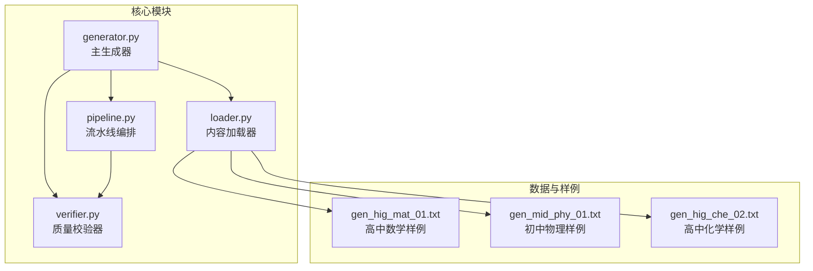
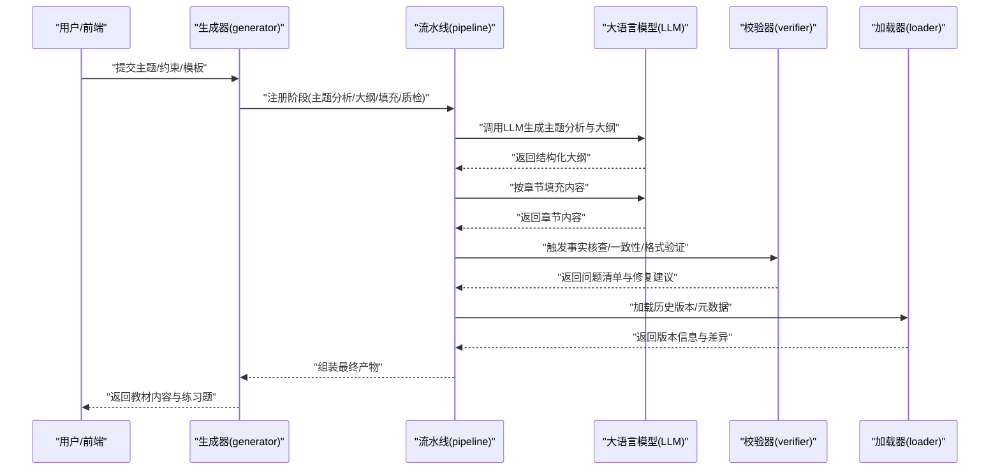
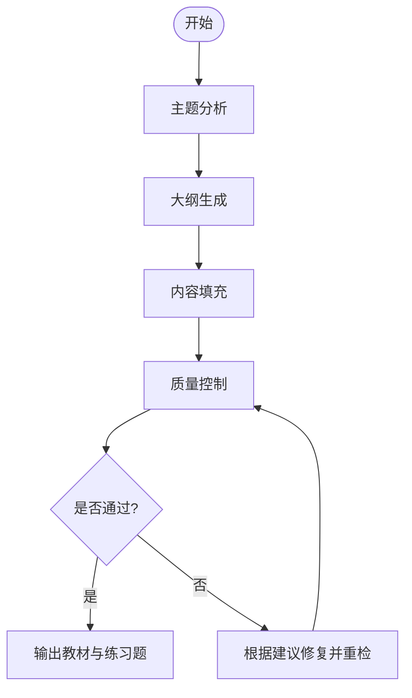
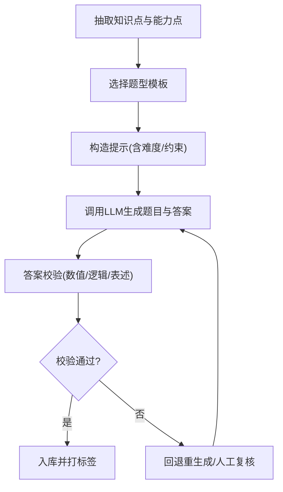
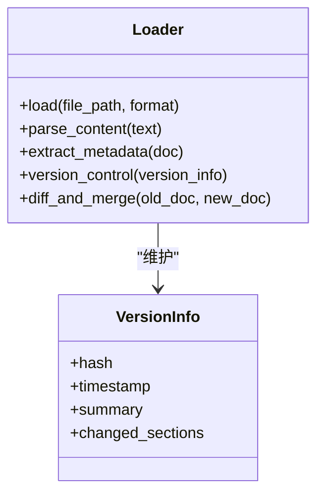
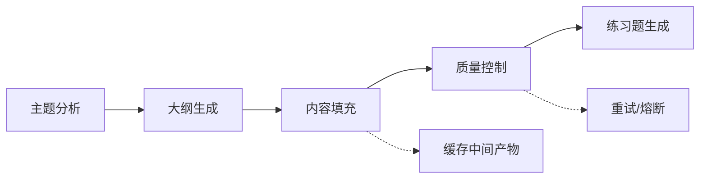
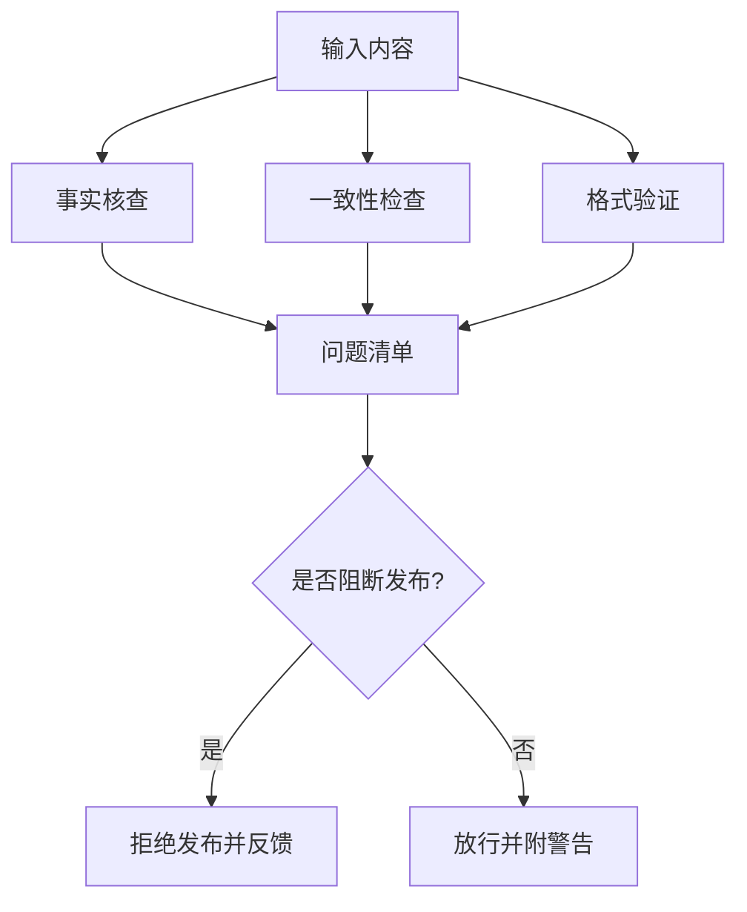
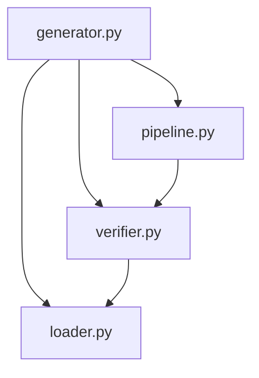

# 内容生成模块

<cite>
**本文引用的文件**   
- [src/kag_pro/core/generator.py](file://src/kag_pro/core/generator.py)
- [src/kag_pro/core/loader.py](file://src/kag_pro/core/loader.py)
- [src/kag_pro/core/pipeline.py](file://src/kag_pro/core/pipeline.py)
- [src/kag_pro/core/verifier.py](file://src/kag_pro/core/verifier.py)
- [src/kag_pro/data/textbooks/gen_hig_mat_01.txt](file://src/kag_pro/data/textbooks/gen_hig_mat_01.txt)
- [src/kag_pro/data/textbooks/gen_mid_phy_01.txt](file://src/kag_pro/data/textbooks/gen_mid_phy_01.txt)
- [src/kag_pro/data/textbooks/gen_hig_che_02.txt](file://src/kag_pro/data/textbooks/gen_hig_che_02.txt)
- [README.md](file://README.md)
</cite>

## 目录
1. [简介](#简介)
2. [项目结构](#项目结构)
3. [核心组件](#核心组件)
4. [架构总览](#架构总览)
5. [详细组件分析](#详细组件分析)
6. [依赖关系分析](#依赖关系分析)
7. [性能考虑](#性能考虑)
8. [故障排查指南](#故障排查指南)
9. [结论](#结论)
10. [附录：API与使用示例](#附录api与使用示例)

## 简介
本技术文档聚焦KAG-Pro的内容生成模块，系统化阐述教材内容生成的完整流程（主题分析、大纲生成、内容填充、质量控制），练习题创建机制（题型支持、难度控制、答案生成），内容加载器实现（多格式解析、元数据提取、版本管理），生成器核心算法（提示模板设计、语言模型调用、后处理逻辑），以及内容质量控制机制（事实核查、一致性检查、格式验证）。同时提供批量生成、增量更新与自定义模板支持的接口说明，并给出数学、物理、化学等学科的具体使用示例。

## 项目结构
内容生成相关代码主要位于src/kag_pro/core与src/kag_pro/data下，配合前端脚本与样例文本进行端到端演示。核心模块职责如下：
- generator.py：编排主题分析、大纲生成、内容填充与质量控制的主生成器
- loader.py：多格式内容加载器，负责解析、元数据提取与版本管理
- pipeline.py：可插拔的流水线编排器，串联各阶段任务
- verifier.py：质量校验器，执行事实核查、一致性与格式验证
- data/textbooks：已生成的教材样例，覆盖初高中数学、物理、化学等多学科

图表来源
- [src/kag_pro/core/generator.py](file://src/kag_pro/core/generator.py)
- [src/kag_pro/core/loader.py](file://src/kag_pro/core/loader.py)
- [src/kag_pro/core/pipeline.py](file://src/kag_pro/core/pipeline.py)
- [src/kag_pro/core/verifier.py](file://src/kag_pro/core/verifier.py)
- [src/kag_pro/data/textbooks/gen_hig_mat_01.txt](file://src/kag_pro/data/textbooks/gen_hig_mat_01.txt)
- [src/kag_pro/data/textbooks/gen_mid_phy_01.txt](file://src/kag_pro/data/textbooks/gen_mid_phy_01.txt)
- [src/kag_pro/data/textbooks/gen_hig_che_02.txt](file://src/kag_pro/data/textbooks/gen_hig_che_02.txt)

章节来源
- [README.md](file://README.md)

## 核心组件
- 主生成器（generator）
  - 职责：接收主题与约束，驱动主题分析、大纲生成、内容填充与质量控制；协调外部LLM与内部校验器。
  - 关键能力：提示模板装配、批量与增量生成、结果后处理与结构化输出。
- 内容加载器（loader）
  - 职责：读取多种格式（如txt、markdown等）内容，抽取元数据（学科、学段、标题、标签、版本），维护版本信息以便增量更新。
  - 关键能力：多格式解析、元数据规范化、冲突检测与合并策略。
- 流水线编排器（pipeline）
  - 职责：将“主题分析→大纲生成→内容填充→质量控制”串成可配置的执行流，支持并行与重试。
  - 关键能力：阶段注册、依赖注入、错误传播与恢复。
- 质量校验器（verifier）
  - 职责：对生成内容进行事实核查、一致性检查与格式验证；输出问题清单与修复建议。
  - 关键能力：规则引擎、统计指标、阈值判定与报告生成。

章节来源
- [src/kag_pro/core/generator.py](file://src/kag_pro/core/generator.py)
- [src/kag_pro/core/loader.py](file://src/kag_pro/core/loader.py)
- [src/kag_pro/core/pipeline.py](file://src/kag_pro/core/pipeline.py)
- [src/kag_pro/core/verifier.py](file://src/kag_pro/core/verifier.py)

## 架构总览
内容生成采用“编排+校验”的双层架构：上层由生成器与流水线负责流程控制与提示工程，下层由加载器与校验器负责数据接入与质量把关。

图表来源
- [src/kag_pro/core/generator.py](file://src/kag_pro/core/generator.py)
- [src/kag_pro/core/pipeline.py](file://src/kag_pro/core/pipeline.py)
- [src/kag_pro/core/verifier.py](file://src/kag_pro/core/verifier.py)
- [src/kag_pro/core/loader.py](file://src/kag_pro/core/loader.py)

## 详细组件分析

### 生成器（generator）
- 主题分析
  - 输入：主题关键词、学段/学科、目标读者画像、教学要求。
  - 处理：通过提示模板组织上下文，调用LLM产出知识图谱要点、先修知识与学习目标。
  - 输出：主题分析报告（知识点、能力维度、学习路径）。
- 大纲生成
  - 输入：主题分析报告、课程时长、章节粒度。
  - 处理：基于模板生成层级化大纲（章-节-小节），标注重点与难点。
  - 输出：结构化大纲（JSON或Markdown）。
- 内容填充
  - 输入：大纲、参考素材（可选）、风格与术语约束。
  - 处理：逐节调用LLM生成正文，插入示例、图示描述与过渡段落。
  - 输出：章节内容集合，附带元数据（标题、难度、标签）。
- 质量控制
  - 输入：待审内容、规则集、阈值。
  - 处理：事实核查（引用来源比对）、一致性检查（术语/符号统一）、格式验证（标题层级、列表规范）。
  - 输出：质检报告、修复建议与修订版内容。

图表来源
- [src/kag_pro/core/generator.py](file://src/kag_pro/core/generator.py)
- [src/kag_pro/core/verifier.py](file://src/kag_pro/core/verifier.py)

章节来源
- [src/kag_pro/core/generator.py](file://src/kag_pro/core/generator.py)
- [src/kag_pro/core/verifier.py](file://src/kag_pro/core/verifier.py)

### 练习题创建机制
- 题目类型支持
  - 选择题、填空题、判断题、简答题、计算题、实验设计与探究题等。
  - 题型由模板参数控制，结合知识点与能力维度自动匹配。
- 难度控制
  - 依据先修知识掌握度、概念抽象度、计算复杂度与情境新颖性综合评估。
  - 支持分级（基础/提高/拓展）与自适应调整。
- 答案生成
  - 客观题：标准答案与选项解析自动生成。
  - 主观题：评分要点、参考答案与常见误区提示。
  - 计算/实验题：步骤推导、关键公式与注意事项。
- 生成流程
  - 从大纲抽取知识点→选择题型模板→构造提示→调用LLM→校验答案正确性与表述规范→入库。

图表来源
- [src/kag_pro/core/generator.py](file://src/kag_pro/core/generator.py)

章节来源
- [src/kag_pro/core/generator.py](file://src/kag_pro/core/generator.py)

### 内容加载器（loader）
- 多格式解析
  - 支持txt、markdown等常见文本格式；可扩展至docx/pdf（需插件）。
  - 解析时保留标题层级、列表、表格与图片占位符。
- 元数据提取
  - 自动识别学科、学段、标题、作者、版本、标签、时间戳。
  - 支持从文件名与内容头注释中推断元数据。
- 版本管理
  - 记录每次生成的版本哈希、变更摘要与差异对比。
  - 增量更新：仅重新生成变更章节，合并元数据与练习题。

图表来源
- [src/kag_pro/core/loader.py](file://src/kag_pro/core/loader.py)

章节来源
- [src/kag_pro/core/loader.py](file://src/kag_pro/core/loader.py)

### 流水线编排器（pipeline）
- 阶段定义
  - 主题分析、大纲生成、内容填充、质量控制、练习题生成。
- 执行策略
  - 顺序/并行执行、失败重试、超时与熔断。
  - 中间产物缓存，支持断点续跑。
- 集成点
  - 与生成器、校验器、加载器解耦，通过接口契约协作。

图表来源
- [src/kag_pro/core/pipeline.py](file://src/kag_pro/core/pipeline.py)

章节来源
- [src/kag_pro/core/pipeline.py](file://src/kag_pro/core/pipeline.py)

### 质量校验器（verifier）
- 事实核查
  - 基于知识库/权威来源交叉验证关键陈述，标记存疑点。
- 一致性检查
  - 术语统一、符号与单位规范、前后文逻辑自洽。
- 格式验证
  - 标题层级、列表与编号、图表引用、脚注与参考文献格式。
- 输出
  - 问题清单、严重等级、修复建议与自动化修复脚本（可选）。

图表来源
- [src/kag_pro/core/verifier.py](file://src/kag_pro/core/verifier.py)

章节来源
- [src/kag_pro/core/verifier.py](file://src/kag_pro/core/verifier.py)

## 依赖关系分析
- 模块耦合
  - 生成器依赖流水线与校验器；流水线串联各阶段；加载器为生成器与校验器提供数据源。
- 外部依赖
  - 大语言模型（LLM）用于主题分析、大纲与内容生成；校验器可能依赖知识库或检索服务。
- 潜在循环
  - 当前设计无直接循环依赖；若扩展“生成→校验→再生成”闭环，应通过流水线回调避免硬耦合。

图表来源
- [src/kag_pro/core/generator.py](file://src/kag_pro/core/generator.py)
- [src/kag_pro/core/pipeline.py](file://src/kag_pro/core/pipeline.py)
- [src/kag_pro/core/verifier.py](file://src/kag_pro/core/verifier.py)
- [src/kag_pro/core/loader.py](file://src/kag_pro/core/loader.py)

章节来源
- [src/kag_pro/core/generator.py](file://src/kag_pro/core/generator.py)
- [src/kag_pro/core/pipeline.py](file://src/kag_pro/core/pipeline.py)
- [src/kag_pro/core/verifier.py](file://src/kag_pro/core/verifier.py)
- [src/kag_pro/core/loader.py](file://src/kag_pro/core/loader.py)

## 性能考虑
- 并发与批处理
  - 章节级并行生成，限制并发度以避免LLM限流；批量生成时采用分片与去重。
- 缓存与增量
  - 中间产物与校验结果缓存；增量更新仅处理变更章节，减少重复调用。
- 提示优化
  - 模板精简与上下文裁剪，降低token消耗；复用通用片段（术语表、公式库）。
- 容错与重试
  - 指数退避重试、熔断与降级策略，保障长链路稳定性。

[本节为通用指导，不直接分析具体文件]

## 故障排查指南
- 常见问题
  - LLM调用失败：检查网络、密钥与配额；启用重试与熔断。
  - 格式校验失败：核对标题层级与列表规范；使用校验器报告定位问题。
  - 事实核查告警：补充权威来源或修正表述；必要时人工复核。
  - 增量更新冲突：查看版本差异与合并策略；必要时回滚到上一稳定版本。
- 诊断工具
  - 启用详细日志与追踪ID；导出质检报告与差异对比。
  - 使用样例文本快速复现问题（见附录示例）。

章节来源
- [src/kag_pro/core/verifier.py](file://src/kag_pro/core/verifier.py)
- [src/kag_pro/core/loader.py](file://src/kag_pro/core/loader.py)

## 结论
KAG-Pro内容生成模块以“编排+校验”为核心，围绕主题分析、大纲生成、内容填充与质量控制形成闭环；通过加载器实现多格式解析与版本管理，借助校验器保障事实准确、表达一致与格式规范。该架构具备良好的可扩展性与工程可用性，适合在数学、物理、化学等多学科场景落地。

[本节为总结性内容，不直接分析具体文件]

## 附录：API与使用示例

### API概览
- 生成接口
  - 单条生成：传入主题、学段/学科、模板与约束，返回教材与练习题。
  - 批量生成：传入主题列表与批次参数，返回聚合结果与进度。
  - 增量更新：传入旧版本ID与变更范围，返回差异与合并结果。
- 模板接口
  - 内置模板：主题分析、大纲、内容填充、练习题。
  - 自定义模板：支持替换变量与条件分支，适配不同学科风格。
- 校验接口
  - 事实核查、一致性检查、格式验证；支持阈值与严重等级配置。

[本节为接口说明，不直接分析具体文件]

### 使用示例（多学科）
- 数学（高中）
  - 主题：函数与导数应用
  - 目标：构建概念理解—方法训练—综合应用的三段式内容
  - 练习题：选择/填空/计算/证明，难度分层
  - 参考样例：[gen_hig_mat_01.txt](file://src/kag_pro/data/textbooks/gen_hig_mat_01.txt)
- 物理（初中）
  - 主题：力学基础与受力分析
  - 目标：强化直观建模与定量计算
  - 练习题：选择/填空/简答/实验设计
  - 参考样例：[gen_mid_phy_01.txt](file://src/kag_pro/data/textbooks/gen_mid_phy_01.txt)
- 化学（高中）
  - 主题：化学反应速率与平衡
  - 目标：突出实验现象与理论解释的结合
  - 练习题：选择/填空/简答/实验探究
  - 参考样例：[gen_hig_che_02.txt](file://src/kag_pro/data/textbooks/gen_hig_che_02.txt)

章节来源
- [src/kag_pro/data/textbooks/gen_hig_mat_01.txt](file://src/kag_pro/data/textbooks/gen_hig_mat_01.txt)
- [src/kag_pro/data/textbooks/gen_mid_phy_01.txt](file://src/kag_pro/data/textbooks/gen_mid_phy_01.txt)
- [src/kag_pro/data/textbooks/gen_hig_che_02.txt](file://src/kag_pro/data/textbooks/gen_hig_che_02.txt)