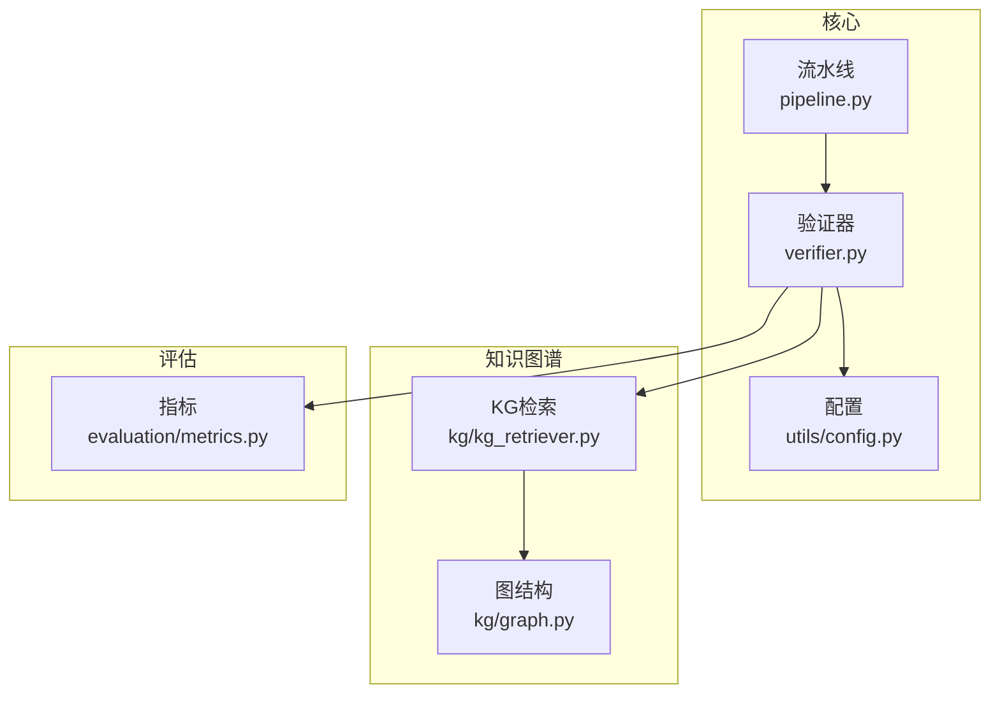
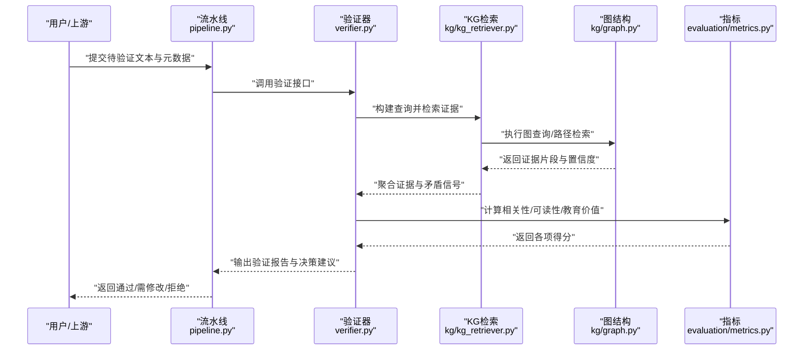
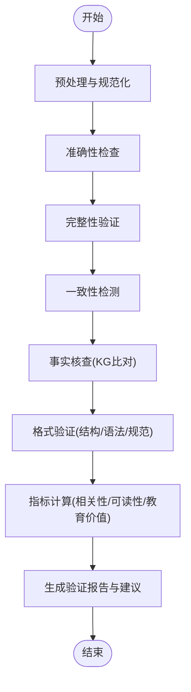
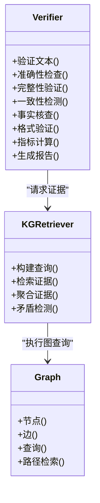
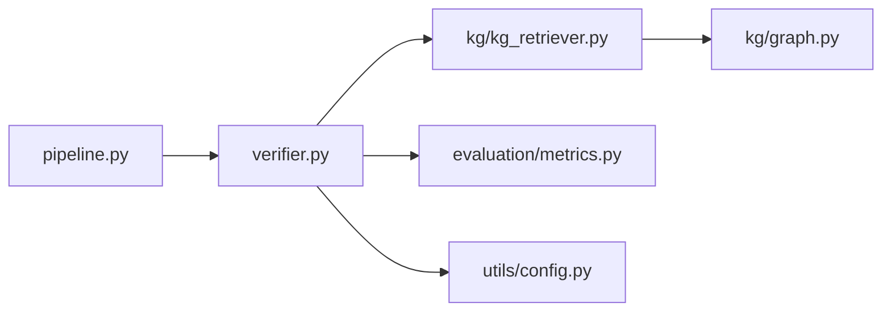

# 内容验证器

<cite>
**本文引用的文件**   
- [verifier.py](file://src/kag_pro/core/verifier.py)
- [metrics.py](file://src/kag_pro/evaluation/metrics.py)
- [graph.py](file://src/kag_pro/kg/graph.py)
- [kg_retriever.py](file://src/kag_pro/kg/kg_retriever.py)
- [pipeline.py](file://src/kag_pro/core/pipeline.py)
- [config.py](file://src/kag_pro/utils/config.py)
</cite>

## 目录
1. [简介](#简介)
2. [项目结构](#项目结构)
3. [核心组件](#核心组件)
4. [架构总览](#架构总览)
5. [详细组件分析](#详细组件分析)
6. [依赖关系分析](#依赖关系分析)
7. [性能考虑](#性能考虑)
8. [故障排查指南](#故障排查指南)
9. [结论](#结论)
10. [附录](#附录)

## 简介
本技术文档围绕 KAG-Pro 的内容验证器展开，系统阐述内容质量评估体系与事实核查机制，覆盖准确性检查、完整性验证、一致性检测算法；说明格式验证规则（结构完整性、语法正确性、规范性）；定义评估指标（内容相关性评分、可读性分析、教育价值评估）；并提供自定义验证规则的扩展方法（验证插件开发与评估模型集成）。同时给出内容质量监控的实现示例与常见问题诊断指南，帮助读者快速理解并落地使用。

## 项目结构
KAG-Pro 将内容验证相关能力分布在核心模块、知识图谱、评估指标与配置等位置：
- 核心验证入口与编排位于 core 层
- 知识图谱检索与图结构用于事实核查
- evaluation 提供评估指标
- utils.config 提供配置项
- pipeline 串联生成与验证流程

图表来源
- [verifier.py](file://src/kag_pro/core/verifier.py)
- [pipeline.py](file://src/kag_pro/core/pipeline.py)
- [config.py](file://src/kag_pro/utils/config.py)
- [graph.py](file://src/kag_pro/kg/graph.py)
- [kg_retriever.py](file://src/kag_pro/kg/kg_retriever.py)
- [metrics.py](file://src/kag_pro/evaluation/metrics.py)

章节来源
- [verifier.py](file://src/kag_pro/core/verifier.py)
- [pipeline.py](file://src/kag_pro/core/pipeline.py)
- [config.py](file://src/kag_pro/utils/config.py)
- [graph.py](file://src/kag_pro/kg/graph.py)
- [kg_retriever.py](file://src/kag_pro/kg/kg_retriever.py)
- [metrics.py](file://src/kag_pro/evaluation/metrics.py)

## 核心组件
- 验证器（Verifier）
  - 职责：接收待验证文本与上下文，执行准确性、完整性、一致性检查；调用知识图谱检索进行事实核查；输出结构化验证报告与评分。
  - 关键能力：
    - 准确性检查：基于命题抽取与证据比对，结合相似度阈值判定
    - 完整性验证：按模板或大纲校验必要段落/要点是否齐全
    - 一致性检测：跨段落语义一致性与逻辑冲突识别
    - 事实核查：通过 KG 检索获取权威证据，进行矛盾检测
    - 格式验证：结构完整性、语法正确性、规范性检查
    - 指标计算：相关性、可读性、教育价值等维度打分
- 知识图谱检索（KG Retriever）
  - 职责：从图结构中检索与查询相关的三元组/实体/路径，返回证据片段与置信度
- 评估指标（Metrics）
  - 职责：实现相关性评分、可读性分析、教育价值评估等度量函数
- 配置（Config）
  - 职责：集中管理验证阈值、KG 参数、指标权重、日志开关等

章节来源
- [verifier.py](file://src/kag_pro/core/verifier.py)
- [kg_retriever.py](file://src/kag_pro/kg/kg_retriever.py)
- [graph.py](file://src/kag_pro/kg/graph.py)
- [metrics.py](file://src/kag_pro/evaluation/metrics.py)
- [config.py](file://src/kag_pro/utils/config.py)

## 架构总览
内容验证器在流水线中作为“质量门”，对生成内容进行多维度校验，并将结果反馈给上游以触发修正或降级策略。

图表来源
- [pipeline.py](file://src/kag_pro/core/pipeline.py)
- [verifier.py](file://src/kag_pro/core/verifier.py)
- [kg_retriever.py](file://src/kag_pro/kg/kg_retriever.py)
- [graph.py](file://src/kag_pro/kg/graph.py)
- [metrics.py](file://src/kag_pro/evaluation/metrics.py)

## 详细组件分析

### 验证器（Verifier）
- 输入
  - 待验证文本、主题/大纲、参考材料、外部约束（如学科规范）
- 处理流程
  - 预处理：分句/分段、术语归一化、去噪
  - 准确性检查：命题抽取→证据检索→相似度/一致性判定
  - 完整性验证：对照大纲/模板逐项核对缺失点
  - 一致性检测：跨段语义对齐、反例/矛盾发现
  - 事实核查：KG 检索→证据聚合→矛盾检测→可信度加权
  - 格式验证：结构完整性、语法正确性、规范性（术语、单位、引用）
  - 指标计算：相关性、可读性、教育价值
  - 报告生成：问题清单、定位信息、修复建议、综合评分
- 输出
  - 结构化验证报告（通过/警告/失败）、各维度分数、证据与矛盾详情

图表来源
- [verifier.py](file://src/kag_pro/core/verifier.py)
- [kg_retriever.py](file://src/kag_pro/kg/kg_retriever.py)
- [graph.py](file://src/kag_pro/kg/graph.py)
- [metrics.py](file://src/kag_pro/evaluation/metrics.py)

章节来源
- [verifier.py](file://src/kag_pro/core/verifier.py)

### 知识图谱检索（KG Retriever）
- 职责
  - 将自然语言查询转换为图查询，检索相关实体、关系与路径
  - 返回证据片段、来源与置信度，支持多跳推理
- 关键流程
  - 查询解析→索引匹配→子图检索→排序与去重→证据聚合
- 与验证器的协作
  - 为准确性与事实核查提供权威证据，辅助矛盾检测与可信度评估

图表来源
- [verifier.py](file://src/kag_pro/core/verifier.py)
- [kg_retriever.py](file://src/kag_pro/kg/kg_retriever.py)
- [graph.py](file://src/kag_pro/kg/graph.py)

章节来源
- [kg_retriever.py](file://src/kag_pro/kg/kg_retriever.py)
- [graph.py](file://src/kag_pro/kg/graph.py)

### 评估指标（Metrics）
- 相关性评分
  - 衡量内容与目标主题/大纲的契合度，可基于语义相似度与关键词覆盖
- 可读性分析
  - 句子长度分布、词汇复杂度、连贯性等指标的综合
- 教育价值评估
  - 概念清晰度、示例充分性、难度梯度、学习引导性等维度
- 指标融合
  - 根据场景设定权重，输出加权总分与分项明细

章节来源
- [metrics.py](file://src/kag_pro/evaluation/metrics.py)

### 配置（Config）
- 管理验证阈值（相似度、矛盾容忍度）、KG 检索参数、指标权重、日志级别等
- 支持按任务/学科加载不同配置集

章节来源
- [config.py](file://src/kag_pro/utils/config.py)

## 依赖关系分析
- 直接依赖
  - 验证器依赖 KG 检索与指标模块
  - KG 检索依赖图结构
  - 流水线编排验证器
- 间接依赖
  - 配置影响所有模块行为
- 潜在耦合点
  - 验证器与 KG 检索之间的证据契约（字段、置信度、来源）
  - 指标模块与验证器之间的评分口径统一

图表来源
- [pipeline.py](file://src/kag_pro/core/pipeline.py)
- [verifier.py](file://src/kag_pro/core/verifier.py)
- [kg_retriever.py](file://src/kag_pro/kg/kg_retriever.py)
- [graph.py](file://src/kag_pro/kg/graph.py)
- [metrics.py](file://src/kag_pro/evaluation/metrics.py)
- [config.py](file://src/kag_pro/utils/config.py)

章节来源
- [pipeline.py](file://src/kag_pro/core/pipeline.py)
- [verifier.py](file://src/kag_pro/core/verifier.py)
- [kg_retriever.py](file://src/kag_pro/kg/kg_retriever.py)
- [graph.py](file://src/kag_pro/kg/graph.py)
- [metrics.py](file://src/kag_pro/evaluation/metrics.py)
- [config.py](file://src/kag_pro/utils/config.py)

## 性能考虑
- 批量验证与缓存
  - 对重复查询与相似文本进行缓存，减少 KG 检索与指标计算开销
- 流式处理
  - 长文本分块并行验证，合并结果以降低延迟
- 阈值调优
  - 依据业务场景调整相似度与矛盾阈值，平衡召回与误报
- 资源控制
  - 限制 KG 多跳深度与返回证据数量，避免大图遍历导致的性能瓶颈

[本节为通用指导，不直接分析具体文件]

## 故障排查指南
- 常见症状
  - 验证通过率异常低：检查相似度阈值、KG 索引覆盖率、术语归一化
  - 事实核查频繁报错：确认 KG 连接、查询语句、实体对齐策略
  - 指标波动大：核对指标权重与样本分布，确保统计窗口稳定
- 定位步骤
  - 开启详细日志，记录证据片段与矛盾详情
  - 抽样回溯原始文本与 KG 证据，人工复核边界案例
  - 逐步关闭非关键检查项，隔离问题模块
- 修复建议
  - 更新 KG 数据与索引，完善实体消歧
  - 调整阈值与权重，优化提示词/规则
  - 增加回归测试用例，覆盖典型错误模式

章节来源
- [verifier.py](file://src/kag_pro/core/verifier.py)
- [kg_retriever.py](file://src/kag_pro/kg/kg_retriever.py)
- [metrics.py](file://src/kag_pro/evaluation/metrics.py)
- [config.py](file://src/kag_pro/utils/config.py)

## 结论
KAG-Pro 内容验证器以“准确性—完整性—一致性—事实核查—格式—指标”为主线，结合知识图谱与可配置指标，形成闭环的质量保障体系。通过合理的阈值与权重设计、缓存与批处理优化，可在保证质量的同时兼顾性能。建议在生产环境持续积累错误样例，迭代规则与模型，提升鲁棒性与泛化能力。

[本节为总结性内容，不直接分析具体文件]

## 附录

### 自定义验证规则扩展方法
- 验证插件开发
  - 新增独立检查模块，遵循统一的输入输出契约（文本、上下文、报告条目）
  - 注册到验证器调度表，按优先级顺序执行
  - 提供单元测试与基准数据集，确保稳定性
- 评估模型集成
  - 封装第三方模型为指标函数，接入 metrics 模块
  - 通过配置切换模型版本与参数，支持 A/B 对比
- 最佳实践
  - 保持幂等与可观测性（日志、埋点）
  - 对高风险检查设置熔断与降级策略
  - 定期复盘误报/漏报，持续优化

[本节为通用指导，不直接分析具体文件]

### 内容质量监控实现示例
- 监控指标
  - 通过率、平均分数、矛盾密度、证据覆盖率、指标漂移
- 告警策略
  - 阈值越界、趋势异常、数据源变更
- 可视化
  - 仪表盘展示各维度分数与问题分布，支持下钻到证据与原文定位

[本节为通用指导，不直接分析具体文件]