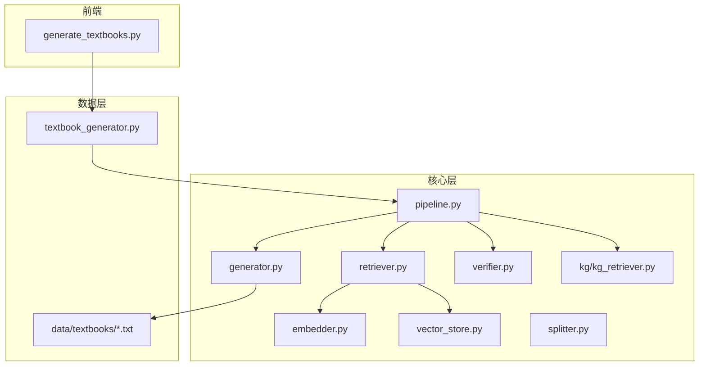
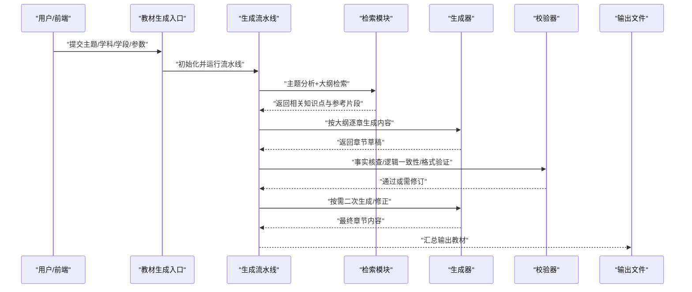
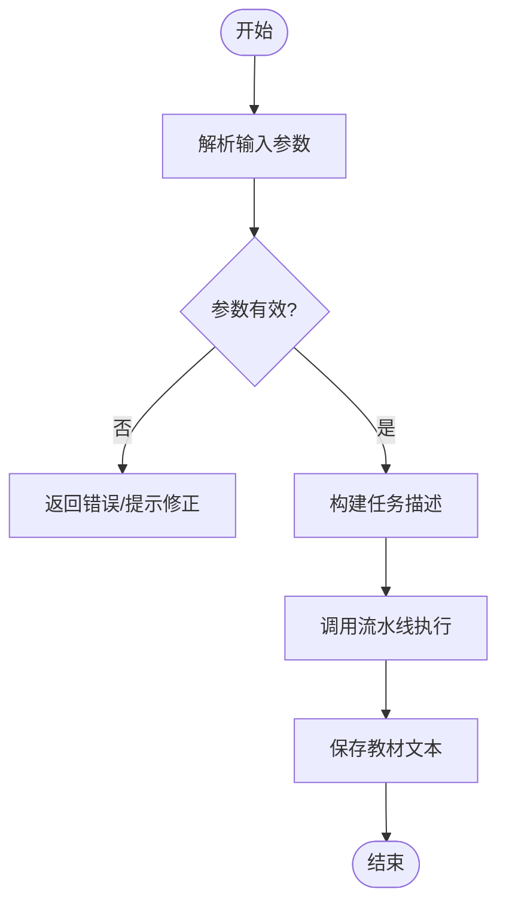
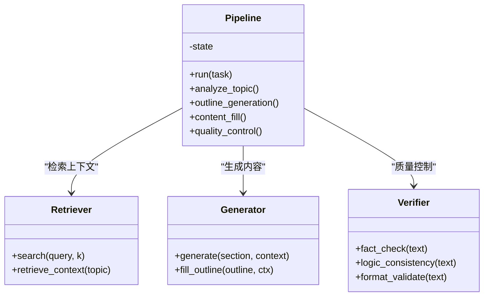
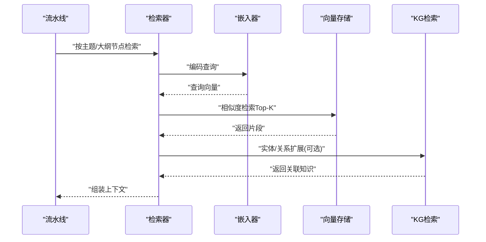
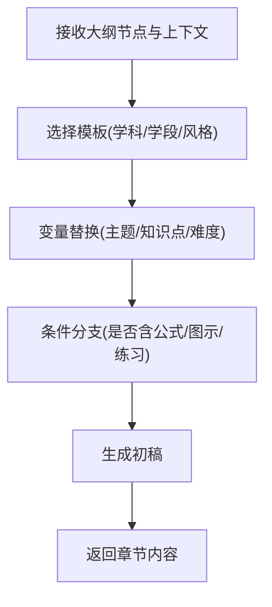
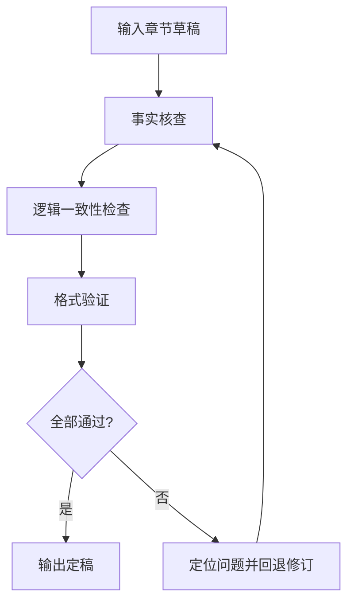
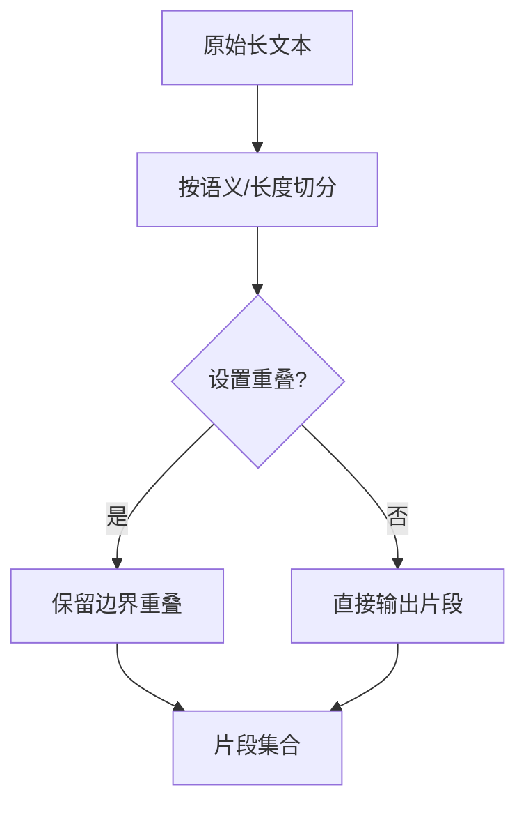
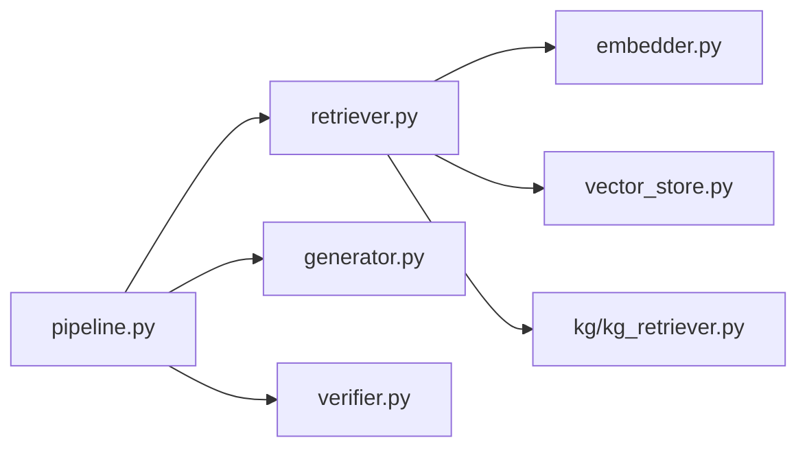

# 教材生成器

<cite>
**本文引用的文件**   
- [README.md](file://README.md)
- [pyproject.toml](file://pyproject.toml)
- [src/kag_pro/core/generator.py](file://src/kag_pro/core/generator.py)
- [src/kag_pro/core/pipeline.py](file://src/kag_pro/core/pipeline.py)
- [src/kag_pro/core/retriever.py](file://src/kag_pro/core/retriever.py)
- [src/kag_pro/core/embedder.py](file://src/kag_pro/core/embedder.py)
- [src/kag_pro/core/vector_store.py](file://src/kag_pro/core/vector_store.py)
- [src/kag_pro/core/splitter.py](file://src/kag_pro/core/splitter.py)
- [src/kag_pro/core/verifier.py](file://src/kag_pro/core/verifier.py)
- [src/kag_pro/data/datasets/textbook_generator.py](file://src/kag_pro/data/datasets/textbook_generator.py)
- [src/kag_pro/kg/kg_retriever.py](file://src/kag_pro/kg/kg_retriever.py)
- [frontend/generate_textbooks.py](file://frontend/generate_textbooks.py)
- [data/textbooks/gen_hig_mat_01.txt](file://data/textbooks/gen_hig_mat_01.txt)
</cite>

## 目录
1. [简介](#简介)
2. [项目结构](#项目结构)
3. [核心组件](#核心组件)
4. [架构总览](#架构总览)
5. [详细组件分析](#详细组件分析)
6. [依赖关系分析](#依赖关系分析)
7. [性能考虑](#性能考虑)
8. [故障排除指南](#故障排除指南)
9. [结论](#结论)
10. [附录](#附录)

## 简介
本技术文档面向KAG-Pro的“教材生成器”，系统化阐述从主题分析、大纲生成、内容填充到质量控制的完整流程，覆盖多学科（数学、物理、化学、生物等）的特定生成策略；文档化提示模板系统的设计与变量替换机制；解释事实核查、逻辑一致性检查与格式验证等质量控制算法；并提供配置参数、自定义模板与批量生成的使用示例，以及性能优化建议与故障排除指南。

## 项目结构
本项目采用分层与按功能域组织相结合的结构：
- core：核心流水线、检索、嵌入、向量存储、切分、校验与生成器
- data/datasets：数据集加载与教材生成入口
- kg：知识图谱相关能力（含KG检索）
- frontend：前端交互与批量生成脚本
- data/textbooks：已生成的教材样例（多科目、多学段）

图表来源
- [frontend/generate_textbooks.py](file://frontend/generate_textbooks.py)
- [src/kag_pro/data/datasets/textbook_generator.py](file://src/kag_pro/data/datasets/textbook_generator.py)
- [src/kag_pro/core/pipeline.py](file://src/kag_pro/core/pipeline.py)
- [src/kag_pro/core/generator.py](file://src/kag_pro/core/generator.py)
- [src/kag_pro/core/retriever.py](file://src/kag_pro/core/retriever.py)
- [src/kag_pro/core/embedder.py](file://src/kag_pro/core/embedder.py)
- [src/kag_pro/core/vector_store.py](file://src/kag_pro/core/vector_store.py)
- [src/kag_pro/core/splitter.py](file://src/kag_pro/core/splitter.py)
- [src/kag_pro/core/verifier.py](file://src/kag_pro/core/verifier.py)
- [src/kag_pro/kg/kg_retriever.py](file://src/kag_pro/kg/kg_retriever.py)

章节来源
- [README.md](file://README.md)
- [pyproject.toml](file://pyproject.toml)

## 核心组件
- 教材生成入口：负责解析输入主题、学科与学段，驱动流水线执行并输出教材文本。
- 生成流水线：编排主题分析、大纲生成、内容填充、质量控制等阶段。
- 检索与知识库：基于嵌入与向量存储的知识检索，结合知识图谱增强上下文。
- 生成器：根据模板与上下文生成各章节内容。
- 校验器：执行事实核查、逻辑一致性与格式验证。
- 切片器：对长文本进行合理切分，提升检索与生成稳定性。

章节来源
- [src/kag_pro/data/datasets/textbook_generator.py](file://src/kag_pro/data/datasets/textbook_generator.py)
- [src/kag_pro/core/pipeline.py](file://src/kag_pro/core/pipeline.py)
- [src/kag_pro/core/generator.py](file://src/kag_pro/core/generator.py)
- [src/kag_pro/core/retriever.py](file://src/kag_pro/core/retriever.py)
- [src/kag_pro/core/embedder.py](file://src/kag_pro/core/embedder.py)
- [src/kag_pro/core/vector_store.py](file://src/kag_pro/core/vector_store.py)
- [src/kag_pro/core/splitter.py](file://src/kag_pro/core/splitter.py)
- [src/kag_pro/core/verifier.py](file://src/kag_pro/core/verifier.py)
- [src/kag_pro/kg/kg_retriever.py](file://src/kag_pro/kg/kg_retriever.py)

## 架构总览
教材生成器的端到端流程如下：
- 输入：主题、学科、学段、目标读者、风格偏好、长度约束等
- 主题分析与大纲生成：结合领域知识与检索结果，产出结构化大纲
- 内容填充：按章节逐节生成，动态注入检索到的知识点与示例
- 质量控制：事实核查、逻辑一致性检查、格式验证
- 输出：可编辑的教材文本（Markdown或纯文本），支持批量导出

图表来源
- [src/kag_pro/data/datasets/textbook_generator.py](file://src/kag_pro/data/datasets/textbook_generator.py)
- [src/kag_pro/core/pipeline.py](file://src/kag_pro/core/pipeline.py)
- [src/kag_pro/core/retriever.py](file://src/kag_pro/core/retriever.py)
- [src/kag_pro/core/generator.py](file://src/kag_pro/core/generator.py)
- [src/kag_pro/core/verifier.py](file://src/kag_pro/core/verifier.py)

## 详细组件分析

### 教材生成入口（数据层）
职责
- 解析输入参数（主题、学科、学段、难度、风格、长度等）
- 调用流水线完成生成
- 将结果持久化至data/textbooks目录

关键流程
- 参数校验与默认值合并
- 构建任务描述（包含学科标签与学段信息）
- 触发流水线执行并落盘

图表来源
- [src/kag_pro/data/datasets/textbook_generator.py](file://src/kag_pro/data/datasets/textbook_generator.py)

章节来源
- [src/kag_pro/data/datasets/textbook_generator.py](file://src/kag_pro/data/datasets/textbook_generator.py)

### 生成流水线（编排层）
职责
- 编排主题分析、大纲生成、内容填充、质量控制等阶段
- 管理上下文状态与中间产物
- 提供重试与回退策略

阶段说明
- 主题分析：抽取关键词、概念边界、前置知识
- 大纲生成：依据学科知识体系与检索结果生成层级大纲
- 内容填充：按节点顺序逐节生成，注入检索片段与示例
- 质量控制：事实核查、逻辑一致性、格式验证与必要修订

图表来源
- [src/kag_pro/core/pipeline.py](file://src/kag_pro/core/pipeline.py)
- [src/kag_pro/core/retriever.py](file://src/kag_pro/core/retriever.py)
- [src/kag_pro/core/generator.py](file://src/kag_pro/core/generator.py)
- [src/kag_pro/core/verifier.py](file://src/kag_pro/core/verifier.py)

章节来源
- [src/kag_pro/core/pipeline.py](file://src/kag_pro/core/pipeline.py)

### 检索与知识库（上下文增强）
职责
- 基于嵌入模型将查询与文档向量化
- 在向量库中检索最相关的知识点片段
- 可选地结合知识图谱进行实体对齐与关系推理

关键组件
- 嵌入器：将文本映射为向量
- 向量存储：索引与检索
- KG检索：利用知识图谱补充结构化知识

图表来源
- [src/kag_pro/core/retriever.py](file://src/kag_pro/core/retriever.py)
- [src/kag_pro/core/embedder.py](file://src/kag_pro/core/embedder.py)
- [src/kag_pro/core/vector_store.py](file://src/kag_pro/core/vector_store.py)
- [src/kag_pro/kg/kg_retriever.py](file://src/kag_pro/kg/kg_retriever.py)

章节来源
- [src/kag_pro/core/retriever.py](file://src/kag_pro/core/retriever.py)
- [src/kag_pro/core/embedder.py](file://src/kag_pro/core/embedder.py)
- [src/kag_pro/core/vector_store.py](file://src/kag_pro/core/vector_store.py)
- [src/kag_pro/kg/kg_retriever.py](file://src/kag_pro/kg/kg_retriever.py)

### 生成器（模板与动态内容）
职责
- 接收大纲节点与上下文，按模板生成章节内容
- 支持变量替换与条件分支，适配不同学科与学段
- 控制篇幅、难度与表达风格

模板系统要点
- 模板结构：标题占位符、段落结构、示例/练习占位符、公式/图示标记
- 变量替换：主题名、知识点列表、难度等级、受众特征
- 动态生成：根据上下文选择合适示例与难度梯度

图表来源
- [src/kag_pro/core/generator.py](file://src/kag_pro/core/generator.py)

章节来源
- [src/kag_pro/core/generator.py](file://src/kag_pro/core/generator.py)

### 质量控制（事实核查/逻辑一致性/格式验证）
职责
- 事实核查：对比权威来源与检索片段，识别潜在矛盾
- 逻辑一致性：检查前后术语、符号、推导链条的一致性
- 格式验证：标题层级、编号、公式/图示标记、引用规范

图表来源
- [src/kag_pro/core/verifier.py](file://src/kag_pro/core/verifier.py)

章节来源
- [src/kag_pro/core/verifier.py](file://src/kag_pro/core/verifier.py)

### 文本切片器（提升检索与生成稳定性）
职责
- 将长文档切分为语义连贯的片段
- 控制片段长度与重叠度，平衡召回率与上下文完整性

图表来源
- [src/kag_pro/core/splitter.py](file://src/kag_pro/core/splitter.py)

章节来源
- [src/kag_pro/core/splitter.py](file://src/kag_pro/core/splitter.py)

### 多学科生成策略
- 数学：强调定义—定理—证明—例题—习题的递进结构；公式与符号一致性要求高；示例需覆盖典型题型与变式。
- 物理：注重概念引入—实验/现象—建模—公式—应用题；图示与单位制统一；注意量纲与近似假设说明。
- 化学：元素/化合物性质—反应方程式—实验步骤—安全注意事项—计算题；注意配平与状态标注。
- 生物：概念—结构—功能—过程—实例—拓展；图示与术语标准化；关注生命周期与生态视角。

上述策略通过模板系统与生成器中的条件分支实现，由学科标签与学段参数驱动。

章节来源
- [src/kag_pro/core/generator.py](file://src/kag_pro/core/generator.py)
- [data/textbooks/gen_hig_mat_01.txt](file://data/textbooks/gen_hig_mat_01.txt)

## 依赖关系分析
- 组件耦合
  - 流水线强依赖检索器、生成器与校验器，形成清晰的分层协作
  - 检索器依赖嵌入器与向量存储，KG检索为可选增强
- 外部依赖
  - 嵌入模型与向量数据库（具体实现由嵌入器与向量存储封装）
  - 知识图谱接口（通过KG检索器抽象）

图表来源
- [src/kag_pro/core/pipeline.py](file://src/kag_pro/core/pipeline.py)
- [src/kag_pro/core/retriever.py](file://src/kag_pro/core/retriever.py)
- [src/kag_pro/core/generator.py](file://src/kag_pro/core/generator.py)
- [src/kag_pro/core/verifier.py](file://src/kag_pro/core/verifier.py)
- [src/kag_pro/core/embedder.py](file://src/kag_pro/core/embedder.py)
- [src/kag_pro/core/vector_store.py](file://src/kag_pro/core/vector_store.py)
- [src/kag_pro/kg/kg_retriever.py](file://src/kag_pro/kg/kg_retriever.py)

章节来源
- [src/kag_pro/core/pipeline.py](file://src/kag_pro/core/pipeline.py)
- [src/kag_pro/core/retriever.py](file://src/kag_pro/core/retriever.py)
- [src/kag_pro/core/generator.py](file://src/kag_pro/core/generator.py)
- [src/kag_pro/core/verifier.py](file://src/kag_pro/core/verifier.py)
- [src/kag_pro/core/embedder.py](file://src/kag_pro/core/embedder.py)
- [src/kag_pro/core/vector_store.py](file://src/kag_pro/core/vector_store.py)
- [src/kag_pro/kg/kg_retriever.py](file://src/kag_pro/kg/kg_retriever.py)

## 性能考虑
- 检索优化
  - 调整Top-K与阈值，平衡召回与延迟
  - 缓存热点查询与常用上下文片段
- 生成优化
  - 并行生成非依赖章节
  - 限制单次生成长度，避免上下文溢出
- 存储优化
  - 增量更新向量索引，减少全量重建
  - 压缩与归档历史版本
- 资源控制
  - 并发上限与队列限流
  - 失败重试与退避策略

[本节为通用指导，不直接分析具体文件]

## 故障排除指南
常见问题与处理
- 检索不到相关内容
  - 检查嵌入维度与向量库索引是否匹配
  - 扩大Top-K或放宽相似度阈值
  - 确认KG检索开关与实体对齐是否正确
- 生成内容不一致或重复
  - 增加上下文窗口内的去重与摘要
  - 调整模板变量以避免冗余
- 事实性错误
  - 提高事实核查严格度，增加权威来源权重
  - 对争议点添加“待核实”标记并人工复核
- 格式错误
  - 启用更严格的格式验证规则
  - 对标题层级、编号、公式/图示标记进行预检

章节来源
- [src/kag_pro/core/verifier.py](file://src/kag_pro/core/verifier.py)
- [src/kag_pro/core/retriever.py](file://src/kag_pro/core/retriever.py)
- [src/kag_pro/core/generator.py](file://src/kag_pro/core/generator.py)

## 结论
KAG-Pro教材生成器以流水线为核心，结合检索增强与质量控制，实现了从主题到成稿的自动化生成。通过模板系统与多学科策略，系统能够灵活适配不同学科与学段的需求。配合性能优化与完善的故障排除方案，可在保证质量的同时提升生成效率。

[本节为总结性内容，不直接分析具体文件]

## 附录

### 使用示例
- 基本生成
  - 指定主题、学科、学段与目标读者，运行生成入口，输出到data/textbooks
- 自定义模板
  - 在生成器中选择对应学科的模板，调整变量（如难度、示例数量、练习比例）
- 批量生成
  - 通过前端脚本传入任务清单，逐个主题触发流水线，结果按主题命名落盘

章节来源
- [frontend/generate_textbooks.py](file://frontend/generate_textbooks.py)
- [src/kag_pro/data/datasets/textbook_generator.py](file://src/kag_pro/data/datasets/textbook_generator.py)

### 配置项参考
- 检索相关
  - Top-K、相似度阈值、是否启用KG检索
- 生成相关
  - 模板选择、难度等级、篇幅限制、风格偏好
- 质量控制
  - 事实核查严格度、逻辑一致性阈值、格式验证规则集

章节来源
- [src/kag_pro/core/retriever.py](file://src/kag_pro/core/retriever.py)
- [src/kag_pro/core/generator.py](file://src/kag_pro/core/generator.py)
- [src/kag_pro/core/verifier.py](file://src/kag_pro/core/verifier.py)