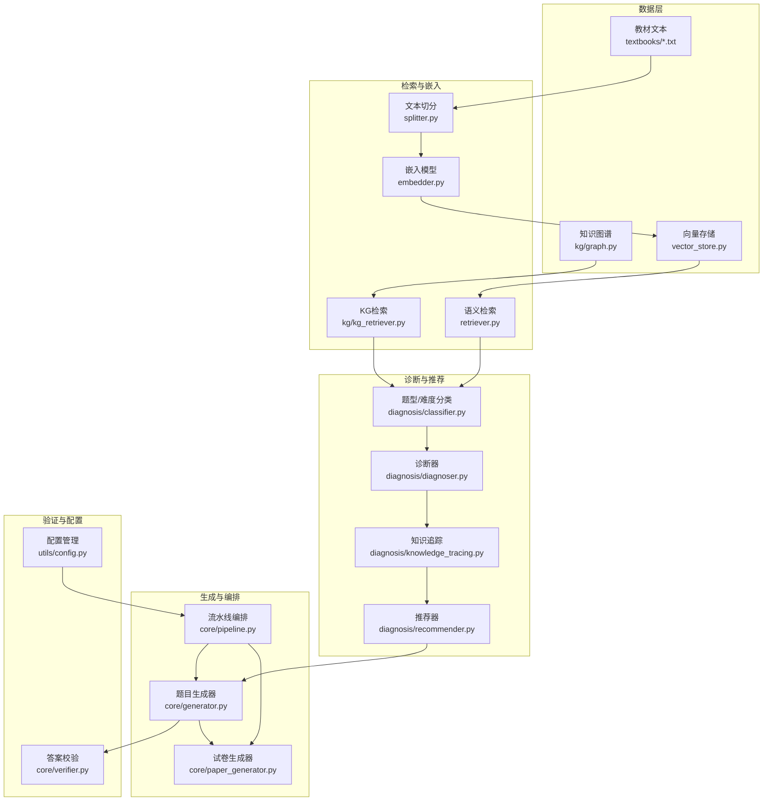
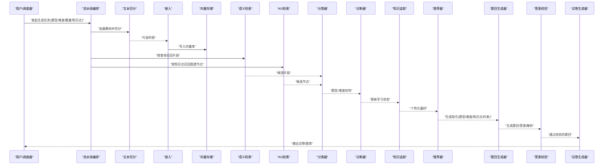
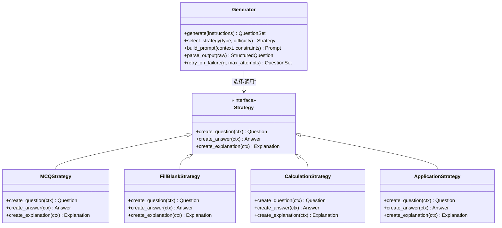
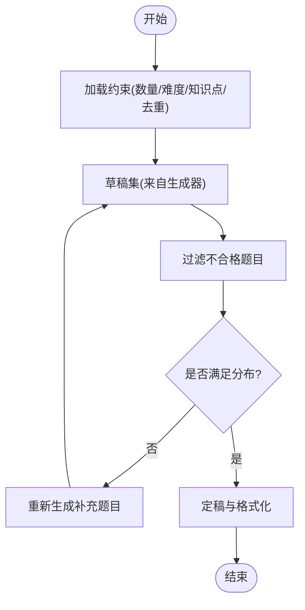
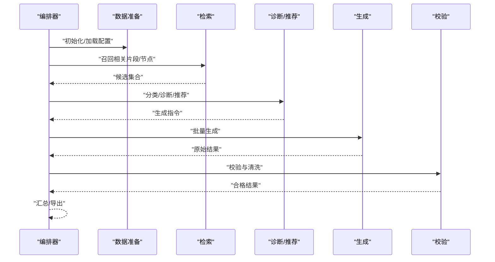
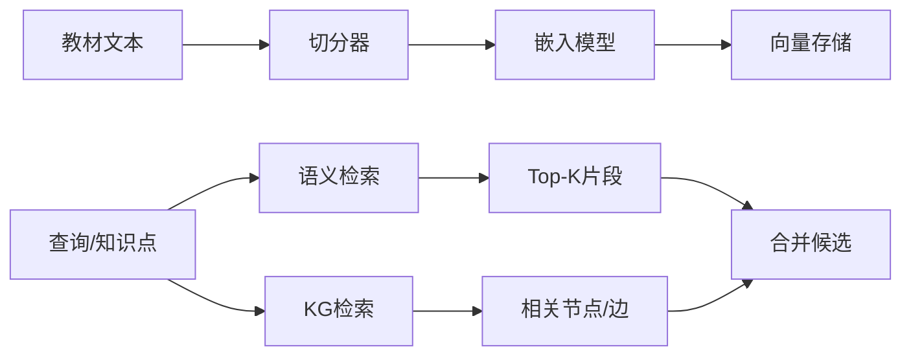
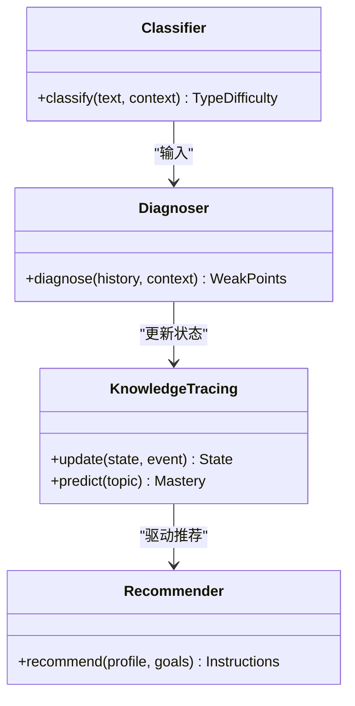
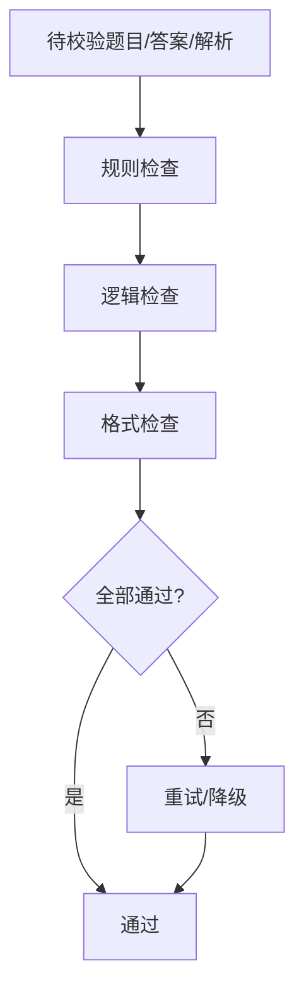
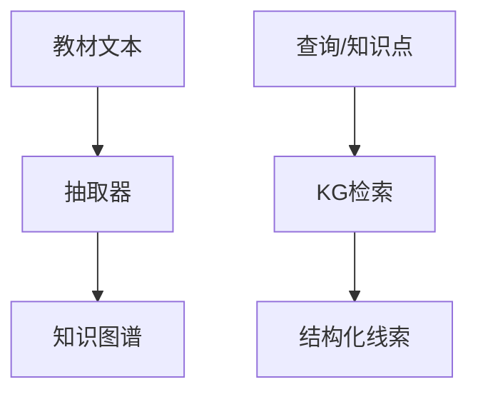
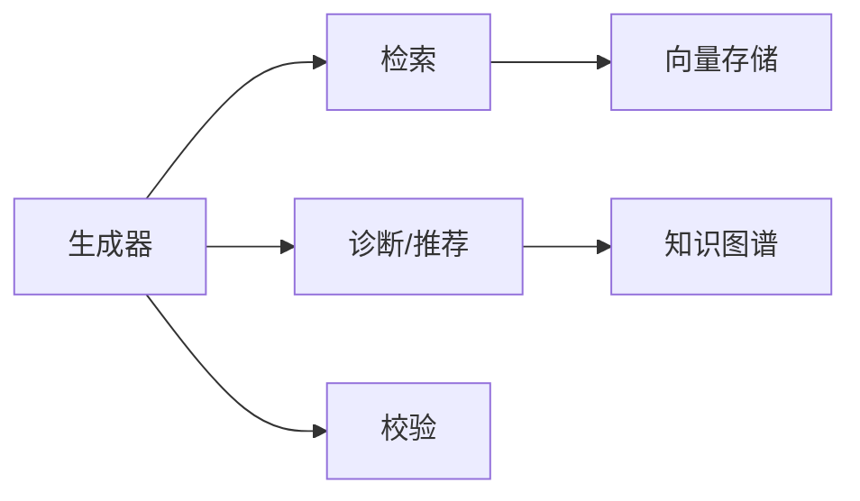

# 练习题生成器

<cite>
**本文引用的文件**   
- [src/kag_pro/core/generator.py](file://src/kag_pro/core/generator.py)
- [src/kag_pro/core/paper_generator.py](file://src/kag_pro/core/paper_generator.py)
- [src/kag_pro/core/pipeline.py](file://src/kag_pro/core/pipeline.py)
- [src/kag_pro/core/retriever.py](file://src/kag_pro/core/retriever.py)
- [src/kag_pro/core/embedder.py](file://src/kag_pro/core/embedder.py)
- [src/kag_pro/core/vector_store.py](file://src/kag_pro/core/vector_store.py)
- [src/kag_pro/core/splitter.py](file://src/kag_pro/core/splitter.py)
- [src/kag_pro/core/verifier.py](file://src/kag_pro/core/verifier.py)
- [src/kag_pro/diagnosis/classifier.py](file://src/kag_pro/diagnosis/classifier.py)
- [src/kag_pro/diagnosis/diagnoser.py](file://src/kag_pro/diagnosis/diagnoser.py)
- [src/kag_pro/diagnosis/knowledge_tracing.py](file://src/kag_pro/diagnosis/knowledge_tracing.py)
- [src/kag_pro/diagnosis/recommender.py](file://src/kag_pro/diagnosis/recommender.py)
- [src/kag_pro/kg/graph.py](file://src/kag_pro/kg/graph.py)
- [src/kag_pro/kg/auto_extractor.py](file://src/kag_pro/kg/auto_extractor.py)
- [src/kag_pro/kg/extractor.py](file://src/kag_pro/kg/extractor.py)
- [src/kag_pro/kg/kg_retriever.py](file://src/kag_pro/kg/kg_retriever.py)
- [src/kag_pro/stage/detector.py](file://src/kag_pro/stage/detector.py)
- [src/kag_pro/utils/config.py](file://src/kag_pro/utils/config.py)
- [src/kag_pro/data/textbooks/01_分数初步.txt](file://src/kag_pro/data/textbooks/01_分数初步.txt)
- [src/kag_pro/data/textbooks/04_四则运算.txt](file://src/kag_pro/data/textbooks/04_四则运算.txt)
- [src/kag_pro/data/textbooks/05_面积与周长.txt](file://src/kag_pro/data/textbooks/05_面积与周长.txt)
- [src/kag_pro/data/textbooks/07_初中函数初步.txt](file://src/kag_pro/data/textbooks/07_初中函数初步.txt)
- [src/kag_pro/data/textbooks/08_初中物理力学.txt](file://src/kag_pro/data/textbooks/08_初中物理力学.txt)
- [src/kag_pro/data/textbooks/10_初中几何基础.txt](file://src/kag_pro/data/textbooks/10_初中几何基础.txt)
- [src/kag_pro/data/textbooks/11_初中物理压强.txt](file://src/kag_pro/data/textbooks/11_初中物理压强.txt)
- [src/kag_pro/data/textbooks/13_高中概率统计.txt](file://src/kag_pro/data/textbooks/13_高中概率统计.txt)
- [src/kag_pro/data/textbooks/14_高中物理电磁.txt](file://src/kag_pro/data/textbooks/14_高中物理电磁.txt)
</cite>

## 目录
1. [简介](#简介)
2. [项目结构](#项目结构)
3. [核心组件](#核心组件)
4. [架构总览](#架构总览)
5. [详细组件分析](#详细组件分析)
6. [依赖关系分析](#依赖关系分析)
7. [性能考虑](#性能考虑)
8. [故障排查指南](#故障排查指南)
9. [结论](#结论)
10. [附录](#附录)

## 简介
本技术文档面向KAG-Pro的“练习题生成器”，系统性地阐述从知识点抽取、题目类型识别、难度评估、答案生成到解析编写的全流程。文档覆盖选择题、填空题、计算题与应用题等题型策略，说明难度控制机制（知识点复杂度分析、学生水平匹配、自适应调整），并给出批量生成、个性化定制与质量评估的实现要点与优化建议。

## 项目结构
本项目采用分层模块化设计：
- 数据层：教材文本、向量存储、知识图谱
- 检索与嵌入：文本切分、向量化、相似度检索
- 诊断与推荐：分类器、学习者画像、知识追踪、推荐
- 生成与编排：题目生成器、试卷生成器、流水线编排
- 验证与配置：答案校验、通用配置

图表来源
- [src/kag_pro/core/generator.py](file://src/kag_pro/core/generator.py)
- [src/kag_pro/core/paper_generator.py](file://src/kag_pro/core/paper_generator.py)
- [src/kag_pro/core/pipeline.py](file://src/kag_pro/core/pipeline.py)
- [src/kag_pro/core/retriever.py](file://src/kag_pro/core/retriever.py)
- [src/kag_pro/core/embedder.py](file://src/kag_pro/core/embedder.py)
- [src/kag_pro/core/vector_store.py](file://src/kag_pro/core/vector_store.py)
- [src/kag_pro/core/splitter.py](file://src/kag_pro/core/splitter.py)
- [src/kag_pro/core/verifier.py](file://src/kag_pro/core/verifier.py)
- [src/kag_pro/diagnosis/classifier.py](file://src/kag_pro/diagnosis/classifier.py)
- [src/kag_pro/diagnosis/diagnoser.py](file://src/kag_pro/diagnosis/diagnoser.py)
- [src/kag_pro/diagnosis/knowledge_tracing.py](file://src/kag_pro/diagnosis/knowledge_tracing.py)
- [src/kag_pro/diagnosis/recommender.py](file://src/kag_pro/diagnosis/recommender.py)
- [src/kag_pro/kg/graph.py](file://src/kag_pro/kg/graph.py)
- [src/kag_pro/kg/kg_retriever.py](file://src/kag_pro/kg/kg_retriever.py)
- [src/kag_pro/utils/config.py](file://src/kag_pro/utils/config.py)

章节来源
- [src/kag_pro/core/generator.py](file://src/kag_pro/core/generator.py)
- [src/kag_pro/core/paper_generator.py](file://src/kag_pro/core/paper_generator.py)
- [src/kag_pro/core/pipeline.py](file://src/kag_pro/core/pipeline.py)
- [src/kag_pro/core/retriever.py](file://src/kag_pro/core/retriever.py)
- [src/kag_pro/core/embedder.py](file://src/kag_pro/core/embedder.py)
- [src/kag_pro/core/vector_store.py](file://src/kag_pro/core/vector_store.py)
- [src/kag_pro/core/splitter.py](file://src/kag_pro/core/splitter.py)
- [src/kag_pro/core/verifier.py](file://src/kag_pro/core/verifier.py)
- [src/kag_pro/diagnosis/classifier.py](file://src/kag_pro/diagnosis/classifier.py)
- [src/kag_pro/diagnosis/diagnoser.py](file://src/kag_pro/diagnosis/diagnoser.py)
- [src/kag_pro/diagnosis/knowledge_tracing.py](file://src/kag_pro/diagnosis/knowledge_tracing.py)
- [src/kag_pro/diagnosis/recommender.py](file://src/kag_pro/diagnosis/recommender.py)
- [src/kag_pro/kg/graph.py](file://src/kag_pro/kg/graph.py)
- [src/kag_pro/kg/kg_retriever.py](file://src/kag_pro/kg/kg_retriever.py)
- [src/kag_pro/utils/config.py](file://src/kag_pro/utils/config.py)

## 核心组件
- 题目生成器：负责根据检索到的知识点片段与用户约束，生成题目、标准答案与解析；支持多种题型模板与参数化构造。
- 试卷生成器：在题目生成基础上进行组合编排，满足数量、难度分布、知识点覆盖等要求。
- 流水线编排：串联“切分→嵌入→检索→分类→诊断→推荐→生成→校验”的端到端流程。
- 检索与嵌入：将教材文本切分为可索引片段，构建向量库，并通过语义检索召回相关片段；同时提供知识图谱检索以增强结构化信息。
- 诊断与推荐：基于分类器与诊断器对题目类型与难度进行判定，结合知识追踪与学习者画像进行个性化推荐。
- 答案校验：对生成的答案进行一致性、正确性与格式校验，必要时触发重试或降级策略。
- 配置管理：集中管理模型、阈值、批处理大小、输出格式等运行参数。

章节来源
- [src/kag_pro/core/generator.py](file://src/kag_pro/core/generator.py)
- [src/kag_pro/core/paper_generator.py](file://src/kag_pro/core/paper_generator.py)
- [src/kag_pro/core/pipeline.py](file://src/kag_pro/core/pipeline.py)
- [src/kag_pro/core/retriever.py](file://src/kag_pro/core/retriever.py)
- [src/kag_pro/core/embedder.py](file://src/kag_pro/core/embedder.py)
- [src/kag_pro/core/vector_store.py](file://src/kag_pro/core/vector_store.py)
- [src/kag_pro/core/splitter.py](file://src/kag_pro/core/splitter.py)
- [src/kag_pro/core/verifier.py](file://src/kag_pro/core/verifier.py)
- [src/kag_pro/diagnosis/classifier.py](file://src/kag_pro/diagnosis/classifier.py)
- [src/kag_pro/diagnosis/diagnoser.py](file://src/kag_pro/diagnosis/diagnoser.py)
- [src/kag_pro/diagnosis/knowledge_tracing.py](file://src/kag_pro/diagnosis/knowledge_tracing.py)
- [src/kag_pro/diagnosis/recommender.py](file://src/kag_pro/diagnosis/recommender.py)
- [src/kag_pro/kg/kg_retriever.py](file://src/kag_pro/kg/kg_retriever.py)
- [src/kag_pro/utils/config.py](file://src/kag_pro/utils/config.py)

## 架构总览
下图展示从教材到题目的端到端数据流与控制流，包括多源检索（向量+图谱）、诊断与推荐、生成与校验、以及批量与个性化路径。

图表来源
- [src/kag_pro/core/pipeline.py](file://src/kag_pro/core/pipeline.py)
- [src/kag_pro/core/splitter.py](file://src/kag_pro/core/splitter.py)
- [src/kag_pro/core/embedder.py](file://src/kag_pro/core/embedder.py)
- [src/kag_pro/core/vector_store.py](file://src/kag_pro/core/vector_store.py)
- [src/kag_pro/core/retriever.py](file://src/kag_pro/core/retriever.py)
- [src/kag_pro/kg/kg_retriever.py](file://src/kag_pro/kg/kg_retriever.py)
- [src/kag_pro/diagnosis/classifier.py](file://src/kag_pro/diagnosis/classifier.py)
- [src/kag_pro/diagnosis/diagnoser.py](file://src/kag_pro/diagnosis/diagnoser.py)
- [src/kag_pro/diagnosis/knowledge_tracing.py](file://src/kag_pro/diagnosis/knowledge_tracing.py)
- [src/kag_pro/diagnosis/recommender.py](file://src/kag_pro/diagnosis/recommender.py)
- [src/kag_pro/core/generator.py](file://src/kag_pro/core/generator.py)
- [src/kag_pro/core/verifier.py](file://src/kag_pro/core/verifier.py)
- [src/kag_pro/core/paper_generator.py](file://src/kag_pro/core/paper_generator.py)

## 详细组件分析

### 题目生成器（generator）
- 职责
  - 接收“题型/难度/知识点/上下文片段/约束”等指令，调用模板与提示工程生成题干、选项（选择题）、填空位（填空题）、数值/表达式（计算题）、情境描述（应用题）。
  - 同步生成标准答案与解题步骤解析，确保与题干一致且符合学科规范。
- 关键能力
  - 题型识别与路由：依据输入标签与上下文选择对应生成策略。
  - 难度控制：结合知识点复杂度与学生水平，动态调整问题深度与干扰项质量。
  - 答案生成与校验：先产出答案，再经校验模块进行一致性检查，失败时触发重试或降级。
- 扩展点
  - 新增题型可通过注册新策略类实现，保持统一接口。
  - 解析模板可按学科差异化配置。

图表来源
- [src/kag_pro/core/generator.py](file://src/kag_pro/core/generator.py)

章节来源
- [src/kag_pro/core/generator.py](file://src/kag_pro/core/generator.py)

### 试卷生成器（paper_generator）
- 职责
  - 在题目生成基础上进行组合编排，满足数量、难度分布、知识点覆盖、重复度控制等目标。
- 关键能力
  - 组合策略：按难度分层抽样、知识点均衡覆盖、去重与多样性控制。
  - 质量控制：生成后二次校验，剔除不达标题目。
  - 输出格式：支持JSON/CSV/Markdown等多格式导出。

图表来源
- [src/kag_pro/core/paper_generator.py](file://src/kag_pro/core/paper_generator.py)

章节来源
- [src/kag_pro/core/paper_generator.py](file://src/kag_pro/core/paper_generator.py)

### 流水线编排（pipeline）
- 职责
  - 串联数据准备、检索、诊断、推荐、生成、校验各阶段，提供统一的执行入口与错误恢复。
- 关键能力
  - 阶段可插拔：每个环节独立封装，便于替换实现。
  - 容错与重试：单阶段失败不影响整体，支持局部重试与降级。
  - 监控与日志：记录关键指标与中间产物，便于回溯。

图表来源
- [src/kag_pro/core/pipeline.py](file://src/kag_pro/core/pipeline.py)

章节来源
- [src/kag_pro/core/pipeline.py](file://src/kag_pro/core/pipeline.py)

### 检索与嵌入（retriever, embedder, vector_store, splitter）
- 文本切分：按段落/主题边界切分教材，保证片段语义完整。
- 嵌入与存储：将片段转为向量并持久化，支持增量更新。
- 语义检索：基于查询与片段相似度召回，返回Top-K及相关权重。
- 知识图谱检索：结合实体/关系召回结构化线索，提升准确性。

图表来源
- [src/kag_pro/core/splitter.py](file://src/kag_pro/core/splitter.py)
- [src/kag_pro/core/embedder.py](file://src/kag_pro/core/embedder.py)
- [src/kag_pro/core/vector_store.py](file://src/kag_pro/core/vector_store.py)
- [src/kag_pro/core/retriever.py](file://src/kag_pro/core/retriever.py)
- [src/kag_pro/kg/kg_retriever.py](file://src/kag_pro/kg/kg_retriever.py)

章节来源
- [src/kag_pro/core/splitter.py](file://src/kag_pro/core/splitter.py)
- [src/kag_pro/core/embedder.py](file://src/kag_pro/core/embedder.py)
- [src/kag_pro/core/vector_store.py](file://src/kag_pro/core/vector_store.py)
- [src/kag_pro/core/retriever.py](file://src/kag_pro/core/retriever.py)
- [src/kag_pro/kg/kg_retriever.py](file://src/kag_pro/kg/kg_retriever.py)

### 诊断与推荐（classifier, diagnoser, knowledge_tracing, recommender）
- 分类器：对题目类型与难度进行初判，为后续生成提供强约束。
- 诊断器：综合上下文与历史表现，定位薄弱知识点与易错点。
- 知识追踪：维护学习者状态，预测掌握度与遗忘曲线。
- 推荐器：基于诊断与追踪结果，生成个性化生成指令（题型/难度/知识点权重）。

图表来源
- [src/kag_pro/diagnosis/classifier.py](file://src/kag_pro/diagnosis/classifier.py)
- [src/kag_pro/diagnosis/diagnoser.py](file://src/kag_pro/diagnosis/diagnoser.py)
- [src/kag_pro/diagnosis/knowledge_tracing.py](file://src/kag_pro/diagnosis/knowledge_tracing.py)
- [src/kag_pro/diagnosis/recommender.py](file://src/kag_pro/diagnosis/recommender.py)

章节来源
- [src/kag_pro/diagnosis/classifier.py](file://src/kag_pro/diagnosis/classifier.py)
- [src/kag_pro/diagnosis/diagnoser.py](file://src/kag_pro/diagnosis/diagnoser.py)
- [src/kag_pro/diagnosis/knowledge_tracing.py](file://src/kag_pro/diagnosis/knowledge_tracing.py)
- [src/kag_pro/diagnosis/recommender.py](file://src/kag_pro/diagnosis/recommender.py)

### 答案校验（verifier）
- 职责
  - 校验答案与解析的一致性、数值/符号正确性、格式合规性。
- 策略
  - 规则校验：单位、有效数字、选项唯一性等。
  - 逻辑校验：步骤完整性、结论与题干一致。
  - 回退策略：失败时自动重试或切换更保守的策略。

图表来源
- [src/kag_pro/core/verifier.py](file://src/kag_pro/core/verifier.py)

章节来源
- [src/kag_pro/core/verifier.py](file://src/kag_pro/core/verifier.py)

### 知识图谱（graph, auto_extractor, extractor, kg_retriever）
- 职责
  - 抽取教材中的概念、关系与层级，构建领域知识图谱；提供结构化检索以增强题目生成的准确性与连贯性。
- 关键点
  - 自动抽取与人工校对相结合，保证图谱质量。
  - 图谱检索与语义检索融合，提高召回相关性。

图表来源
- [src/kag_pro/kg/auto_extractor.py](file://src/kag_pro/kg/auto_extractor.py)
- [src/kag_pro/kg/extractor.py](file://src/kag_pro/kg/extractor.py)
- [src/kag_pro/kg/graph.py](file://src/kag_pro/kg/graph.py)
- [src/kag_pro/kg/kg_retriever.py](file://src/kag_pro/kg/kg_retriever.py)

章节来源
- [src/kag_pro/kg/auto_extractor.py](file://src/kag_pro/kg/auto_extractor.py)
- [src/kag_pro/kg/extractor.py](file://src/kag_pro/kg/extractor.py)
- [src/kag_pro/kg/graph.py](file://src/kag_pro/kg/graph.py)
- [src/kag_pro/kg/kg_retriever.py](file://src/kag_pro/kg/kg_retriever.py)

### 题型与生成策略
- 选择题
  - 策略：基于知识点生成主干题干与多个干扰项；干扰项需具备常见误区特征。
  - 难度控制：通过混淆度与推理步数调节。
- 填空题
  - 策略：抽取关键术语/数值作为空位，保留必要上下文。
  - 难度控制：空位数量与位置由难度决定。
- 计算题
  - 策略：给定条件与目标，生成逐步推导过程与最终结果。
  - 难度控制：变量个数、公式复杂度与计算量。
- 应用题
  - 策略：结合真实情境，强调建模与跨知识点整合。
  - 难度控制：情境复杂度与抽象程度。

章节来源
- [src/kag_pro/core/generator.py](file://src/kag_pro/core/generator.py)

### 难度控制机制
- 知识点复杂度分析：基于图谱深度、前置依赖数量与关联密度评分。
- 学生水平匹配：依据知识追踪的输出，选择略高于当前掌握度的题目。
- 自适应调整算法：根据答题反馈动态上调/下调难度，维持挑战区间。

章节来源
- [src/kag_pro/diagnosis/classifier.py](file://src/kag_pro/diagnosis/classifier.py)
- [src/kag_pro/diagnosis/diagnoser.py](file://src/kag_pro/diagnosis/diagnoser.py)
- [src/kag_pro/diagnosis/knowledge_tracing.py](file://src/kag_pro/diagnosis/knowledge_tracing.py)
- [src/kag_pro/diagnosis/recommender.py](file://src/kag_pro/diagnosis/recommender.py)

### 答案生成与验证系统
- 标准答案生成：与题干严格对齐，包含数值/表达式/选项标识。
- 解题步骤编写：分步呈现关键思路与过渡，避免跳跃。
- 答案正确性检查：规则+逻辑双重校验，失败时自动重试或降级。

章节来源
- [src/kag_pro/core/generator.py](file://src/kag_pro/core/generator.py)
- [src/kag_pro/core/verifier.py](file://src/kag_pro/core/verifier.py)

### 批量生成与个性化定制
- 批量生成
  - 输入：题型/难度/数量/知识点范围/去重策略。
  - 输出：结构化题库（含题目、答案、解析、元数据）。
- 个性化定制
  - 输入：学习者画像、薄弱知识点、目标难度区间。
  - 输出：适配个人水平的题目序列与渐进式练习计划。

章节来源
- [src/kag_pro/core/pipeline.py](file://src/kag_pro/core/pipeline.py)
- [src/kag_pro/core/paper_generator.py](file://src/kag_pro/core/paper_generator.py)
- [src/kag_pro/diagnosis/recommender.py](file://src/kag_pro/diagnosis/recommender.py)

### 质量评估指标与优化建议
- 指标建议
  - 内容质量：知识点覆盖度、难度分布合理性、重复率。
  - 答案质量：正确率、步骤完整性、格式合规率。
  - 用户体验：可读性、干扰项有效性、情境真实性。
- 优化建议
  - 检索增强：融合语义与图谱双路召回，提升上下文相关性。
  - 生成稳定性：引入确定性种子与温度控制，减少波动。
  - 持续迭代：基于反馈闭环更新图谱与难度模型。

[本节为通用指导，无需列出具体文件来源]

## 依赖关系分析
- 组件耦合
  - 生成器依赖检索与诊断输出，校验器反向影响生成器重试策略。
  - 诊断模块依赖知识图谱与学习者历史，推荐器据此输出指令。
- 外部依赖
  - 嵌入模型与向量存储用于语义检索。
  - 知识图谱用于结构化检索与复杂度评估。

图表来源
- [src/kag_pro/core/generator.py](file://src/kag_pro/core/generator.py)
- [src/kag_pro/core/retriever.py](file://src/kag_pro/core/retriever.py)
- [src/kag_pro/core/vector_store.py](file://src/kag_pro/core/vector_store.py)
- [src/kag_pro/core/verifier.py](file://src/kag_pro/core/verifier.py)
- [src/kag_pro/diagnosis/classifier.py](file://src/kag_pro/diagnosis/classifier.py)
- [src/kag_pro/diagnosis/diagnoser.py](file://src/kag_pro/diagnosis/diagnoser.py)
- [src/kag_pro/diagnosis/recommender.py](file://src/kag_pro/diagnosis/recommender.py)
- [src/kag_pro/kg/kg_retriever.py](file://src/kag_pro/kg/kg_retriever.py)

章节来源
- [src/kag_pro/core/generator.py](file://src/kag_pro/core/generator.py)
- [src/kag_pro/core/retriever.py](file://src/kag_pro/core/retriever.py)
- [src/kag_pro/core/vector_store.py](file://src/kag_pro/core/vector_store.py)
- [src/kag_pro/core/verifier.py](file://src/kag_pro/core/verifier.py)
- [src/kag_pro/diagnosis/classifier.py](file://src/kag_pro/diagnosis/classifier.py)
- [src/kag_pro/diagnosis/diagnoser.py](file://src/kag_pro/diagnosis/diagnoser.py)
- [src/kag_pro/diagnosis/recommender.py](file://src/kag_pro/diagnosis/recommender.py)
- [src/kag_pro/kg/kg_retriever.py](file://src/kag_pro/kg/kg_retriever.py)

## 性能考虑
- 检索效率
  - 使用近似最近邻与索引优化，降低Top-K召回延迟。
  - 对高频知识点建立缓存，减少重复计算。
- 生成吞吐
  - 并行生成与批处理，限制并发上限以避免资源争用。
  - 模板预编译与提示复用，减少LLM调用开销。
- 内存占用
  - 流式写入向量库，避免一次性加载大文本。
  - 图谱按需加载与分页查询。

[本节为通用指导，无需列出具体文件来源]

## 故障排查指南
- 常见问题
  - 检索不到相关内容：检查切分粒度、嵌入模型与相似度阈值。
  - 答案不一致：查看校验日志，确认规则与逻辑检查项。
  - 难度偏差：复核诊断器与知识追踪的状态更新。
- 定位方法
  - 启用阶段级日志，记录输入/输出与耗时。
  - 对关键路径增加断言与快照，便于回放。
- 恢复策略
  - 自动重试与降级（如放宽相似度阈值、简化题型）。
  - 回滚至上一稳定版本配置。

章节来源
- [src/kag_pro/core/pipeline.py](file://src/kag_pro/core/pipeline.py)
- [src/kag_pro/core/verifier.py](file://src/kag_pro/core/verifier.py)
- [src/kag_pro/utils/config.py](file://src/kag_pro/utils/config.py)

## 结论
本系统通过“检索增强+诊断推荐+生成校验”的闭环，实现了高质量、可控难度的练习题批量生成与个性化定制。未来可在图谱质量、难度模型与生成稳定性方面持续优化，进一步提升教学适用性与规模化生产能力。

[本节为总结，无需列出具体文件来源]

## 附录
- 示例教材文件（用于理解数据来源与主题覆盖）
  - [src/kag_pro/data/textbooks/01_分数初步.txt](file://src/kag_pro/data/textbooks/01_分数初步.txt)
  - [src/kag_pro/data/textbooks/04_四则运算.txt](file://src/kag_pro/data/textbooks/04_四则运算.txt)
  - [src/kag_pro/data/textbooks/05_面积与周长.txt](file://src/kag_pro/data/textbooks/05_面积与周长.txt)
  - [src/kag_pro/data/textbooks/07_初中函数初步.txt](file://src/kag_pro/data/textbooks/07_初中函数初步.txt)
  - [src/kag_pro/data/textbooks/08_初中物理力学.txt](file://src/kag_pro/data/textbooks/08_初中物理力学.txt)
  - [src/kag_pro/data/textbooks/10_初中几何基础.txt](file://src/kag_pro/data/textbooks/10_初中几何基础.txt)
  - [src/kag_pro/data/textbooks/11_初中物理压强.txt](file://src/kag_pro/data/textbooks/11_初中物理压强.txt)
  - [src/kag_pro/data/textbooks/13_高中概率统计.txt](file://src/kag_pro/data/textbooks/13_高中概率统计.txt)
  - [src/kag_pro/data/textbooks/14_高中物理电磁.txt](file://src/kag_pro/data/textbooks/14_高中物理电磁.txt)