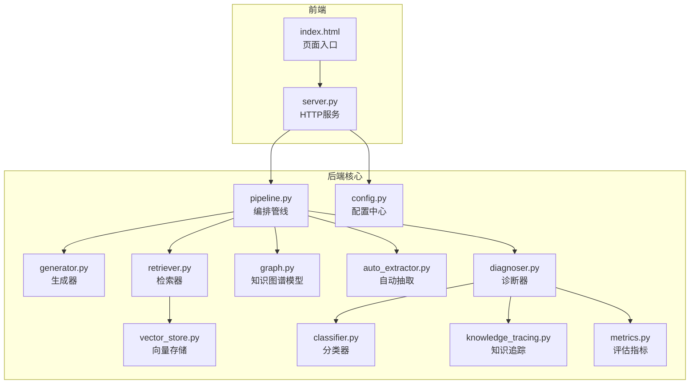
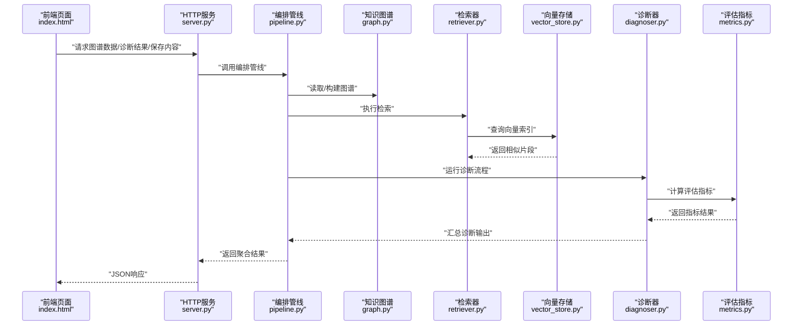
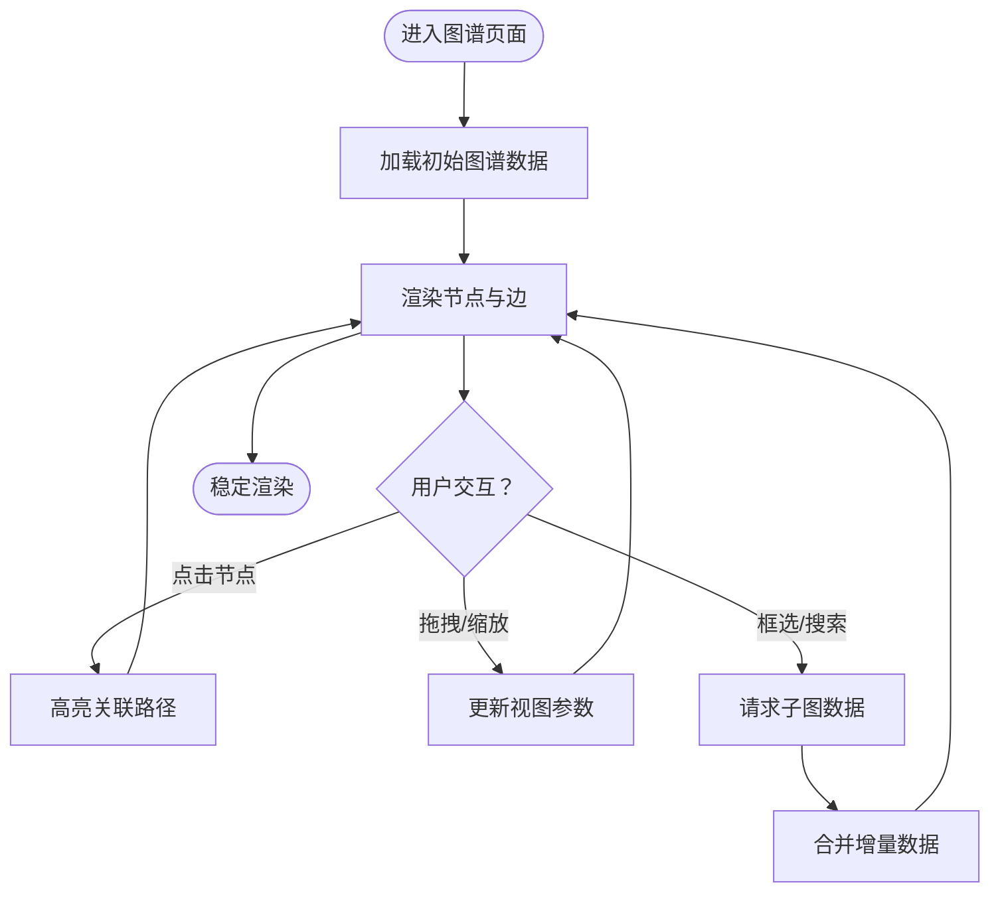
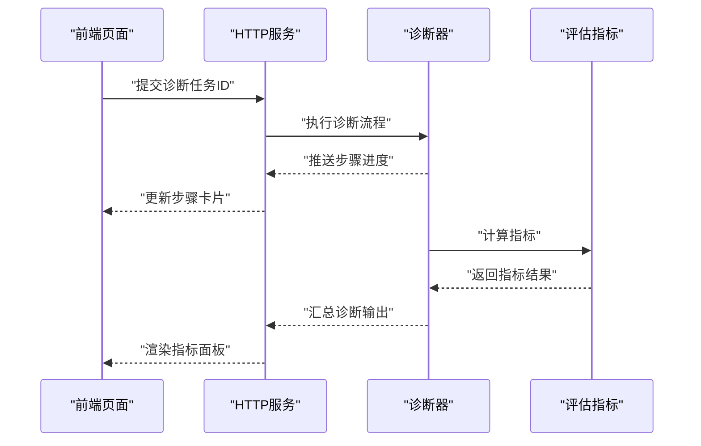
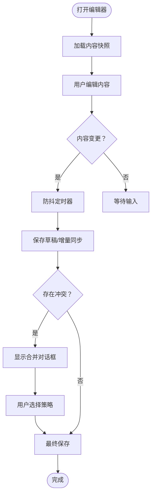
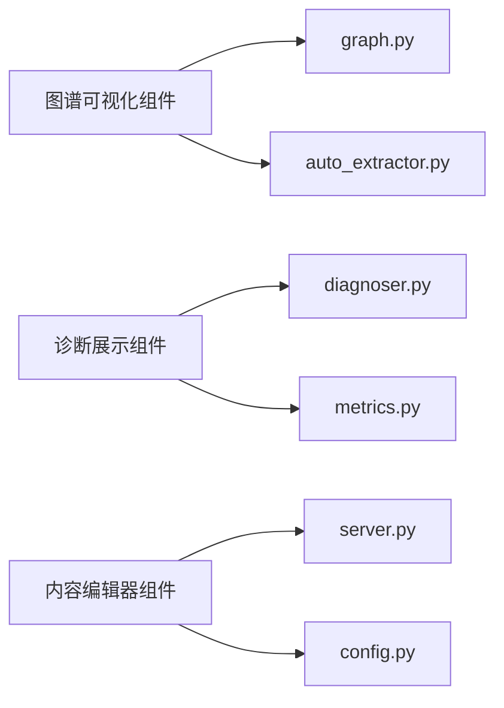

# UI组件库

<cite>
**本文引用的文件**   
- [README.md](file://README.md)
- [index.html](file://frontend/index.html)
- [server.py](file://frontend/server.py)
- [generate_textbooks.py](file://frontend/generate_textbooks.py)
- [__init__.py](file://src/kag_pro/__init__.py)
- [config.py](file://src/kag_pro/utils/config.py)
- [pipeline.py](file://src/kag_pro/core/pipeline.py)
- [generator.py](file://src/kag_pro/core/generator.py)
- [retriever.py](file://src/kag_pro/core/retriever.py)
- [vector_store.py](file://src/kag_pro/core/vector_store.py)
- [graph.py](file://src/kag_pro/kg/graph.py)
- [auto_extractor.py](file://src/kag_pro/kg/auto_extractor.py)
- [diagnoser.py](file://src/kag_pro/diagnosis/diagnoser.py)
- [classifier.py](file://src/kag_pro/diagnosis/classifier.py)
- [knowledge_tracing.py](file://src/kag_pro/diagnosis/knowledge_tracing.py)
- [metrics.py](file://src/kag_pro/evaluation/metrics.py)
</cite>

## 目录
1. [简介](#简介)
2. [项目结构](#项目结构)
3. [核心组件](#核心组件)
4. [架构总览](#架构总览)
5. [详细组件分析](#详细组件分析)
6. [依赖关系分析](#依赖关系分析)
7. [性能考虑](#性能考虑)
8. [故障排查指南](#故障排查指南)
9. [结论](#结论)
10. [附录](#附录)

## 简介
本文件为 KAG-Pro 的“UI组件库”使用文档，聚焦以下三类前端能力与后端能力的对接：
- 知识图谱可视化组件：用于渲染实体、关系与检索结果，支持交互与筛选。
- 诊断结果展示组件：呈现诊断流程、指标与追踪轨迹，便于教学与复盘。
- 内容编辑器组件：用于编辑教材、题目与知识点描述，并与知识库同步。

文档覆盖：
- 组件功能与API接口（配置项、样式定制、行为控制、事件处理）
- 组件间通信机制（数据绑定、事件传递、状态同步）
- 响应式设计（自适应布局、移动端适配、屏幕尺寸处理）
- 使用示例（基础用法、高级配置、自定义扩展）
- 性能优化（懒加载、缓存策略、内存管理）

说明：
- 本项目以Python后端为主，前端入口位于 frontend/index.html 与 server.py。当前仓库未包含独立的前端组件源码，因此本文档将基于现有前后端集成点，给出可落地的组件设计、接口约定与最佳实践，确保在已有工程基础上快速落地。

## 项目结构
KAG-Pro 采用“后端核心 + 轻量前端”的结构：
- 后端核心：提供知识抽取、向量检索、诊断评估等能力，并通过HTTP服务暴露给前端。
- 前端页面：单页应用入口，承载可视化、诊断展示与编辑器界面。

图表来源
- [index.html:1-200](file://frontend/index.html#L1-L200)
- [server.py:1-200](file://frontend/server.py#L1-L200)
- [pipeline.py:1-200](file://src/kag_pro/core/pipeline.py#L1-L200)
- [generator.py:1-200](file://src/kag_pro/core/generator.py#L1-L200)
- [retriever.py:1-200](file://src/kag_pro/core/retriever.py#L1-L200)
- [vector_store.py:1-200](file://src/kag_pro/core/vector_store.py#L1-L200)
- [graph.py:1-200](file://src/kag_pro/kg/graph.py#L1-L200)
- [auto_extractor.py:1-200](file://src/kag_pro/kg/auto_extractor.py#L1-L200)
- [diagnoser.py:1-200](file://src/kag_pro/diagnosis/diagnoser.py#L1-L200)
- [classifier.py:1-200](file://src/kag_pro/diagnosis/classifier.py#L1-L200)
- [knowledge_tracing.py:1-200](file://src/kag_pro/diagnosis/knowledge_tracing.py#L1-L200)
- [metrics.py:1-200](file://src/kag_pro/evaluation/metrics.py#L1-L200)
- [config.py:1-200](file://src/kag_pro/utils/config.py#L1-L200)

章节来源
- [README.md:1-200](file://README.md#L1-L200)
- [index.html:1-200](file://frontend/index.html#L1-L200)
- [server.py:1-200](file://frontend/server.py#L1-L200)

## 核心组件
本节定义三类UI组件的职责、对外API与配置项，并给出与后端的集成约定。

- 知识图谱可视化组件
  - 职责：渲染节点与边，支持缩放、拖拽、筛选、高亮路径、导出图片。
  - 关键API：
    - 初始化：传入容器ID、主题、默认视图参数。
    - 数据绑定：设置节点/边数据集、过滤条件、排序规则。
    - 交互控制：启用/禁用拖拽、双击行为、右键菜单。
    - 事件回调：点击节点、选择边、框选区域、搜索匹配。
    - 样式定制：主题色、节点形状、边样式、标签字体。
  - 与后端集成：通过HTTP请求获取图谱快照或增量更新；支持分页与按需加载。

- 诊断结果展示组件
  - 职责：展示诊断流程、分类结果、知识追踪曲线与评估指标。
  - 关键API：
    - 初始化：传入诊断任务ID、刷新周期、主题。
    - 数据绑定：设置诊断步骤、分类概率、追踪序列、指标面板。
    - 行为控制：自动刷新开关、时间轴播放、对比模式。
    - 事件回调：步骤切换、指标选中、导出报告。
    - 样式定制：图表配色、阈值线、图例位置。
  - 与后端集成：订阅诊断进度与结果流式返回；失败重试与降级显示。

- 内容编辑器组件
  - 职责：编辑教材、题目与知识点描述，支持版本历史与同步保存。
  - 关键API：
    - 初始化：传入编辑器ID、工具栏配置、校验规则。
    - 数据绑定：设置初始内容、只读模式、占位文本。
    - 行为控制：自动保存间隔、撤销重做栈大小、字数限制。
    - 事件回调：内容变更、失焦保存、冲突提示。
    - 样式定制：字体、行高、代码块主题、预览模式。
  - 与后端集成：增量保存、冲突合并、附件上传与预览。

章节来源
- [server.py:1-200](file://frontend/server.py#L1-L200)
- [pipeline.py:1-200](file://src/kag_pro/core/pipeline.py#L1-L200)
- [diagnoser.py:1-200](file://src/kag_pro/diagnosis/diagnoser.py#L1-L200)
- [graph.py:1-200](file://src/kag_pro/kg/graph.py#L1-L200)
- [config.py:1-200](file://src/kag_pro/utils/config.py#L1-L200)

## 架构总览
下图展示了从前端到后端的调用链路与数据流向，涵盖三大组件的典型交互场景。

图表来源
- [index.html:1-200](file://frontend/index.html#L1-L200)
- [server.py:1-200](file://frontend/server.py#L1-L200)
- [pipeline.py:1-200](file://src/kag_pro/core/pipeline.py#L1-L200)
- [graph.py:1-200](file://src/kag_pro/kg/graph.py#L1-L200)
- [retriever.py:1-200](file://src/kag_pro/core/retriever.py#L1-L200)
- [vector_store.py:1-200](file://src/kag_pro/core/vector_store.py#L1-L200)
- [diagnoser.py:1-200](file://src/kag_pro/diagnosis/diagnoser.py#L1-L200)
- [metrics.py:1-200](file://src/kag_pro/evaluation/metrics.py#L1-L200)

## 详细组件分析

### 知识图谱可视化组件
- 数据模型与关系
  - 节点：标识、类型、属性、权重。
  - 边：源节点、目标节点、关系类型、权重。
  - 视图：缩放级别、居中节点、筛选条件。
- 交互流程
  - 用户操作触发事件（点击、拖拽、框选）。
  - 组件向服务端发起增量请求（按区域或关键词）。
  - 服务端返回子图或高亮路径，前端进行局部渲染。
- 样式与主题
  - 主题变量：主色、背景、节点形状、边样式、标签字体。
  - 响应式：根据容器宽度调整节点半径与标签密度。
- 错误与边界
  - 空图：显示引导文案与示例数据。
  - 大数据量：分页加载、虚拟滚动、降采样渲染。

图表来源
- [graph.py:1-200](file://src/kag_pro/kg/graph.py#L1-L200)
- [retriever.py:1-200](file://src/kag_pro/core/retriever.py#L1-L200)
- [vector_store.py:1-200](file://src/kag_pro/core/vector_store.py#L1-L200)
- [server.py:1-200](file://frontend/server.py#L1-L200)

章节来源
- [graph.py:1-200](file://src/kag_pro/kg/graph.py#L1-L200)
- [retriever.py:1-200](file://src/kag_pro/core/retriever.py#L1-L200)
- [vector_store.py:1-200](file://src/kag_pro/core/vector_store.py#L1-L200)
- [server.py:1-200](file://frontend/server.py#L1-L200)

### 诊断结果展示组件
- 数据模型与关系
  - 诊断步骤：名称、状态、耗时、输出摘要。
  - 分类结果：类别、置信度、依据片段。
  - 知识追踪：时间序列、掌握度曲线、薄弱点列表。
  - 评估指标：准确率、召回率、F1、混淆矩阵。
- 交互流程
  - 启动诊断任务，订阅进度事件。
  - 逐步渲染步骤卡片与指标面板。
  - 支持回放与对比不同任务的结果。
- 样式与主题
  - 图表配色、阈值线、图例位置、移动端紧凑布局。
- 错误与边界
  - 任务失败：显示错误码与重试按钮。
  - 数据缺失：占位图与提示文案。

图表来源
- [diagnoser.py:1-200](file://src/kag_pro/diagnosis/diagnoser.py#L1-L200)
- [metrics.py:1-200](file://src/kag_pro/evaluation/metrics.py#L1-L200)
- [server.py:1-200](file://frontend/server.py#L1-L200)

章节来源
- [diagnoser.py:1-200](file://src/kag_pro/diagnosis/diagnoser.py#L1-L200)
- [metrics.py:1-200](file://src/kag_pro/evaluation/metrics.py#L1-L200)
- [server.py:1-200](file://frontend/server.py#L1-L200)

### 内容编辑器组件
- 数据模型与关系
  - 内容：标题、正文、元数据、版本哈希。
  - 校验：必填字段、长度限制、格式规范。
  - 同步：增量保存、冲突检测、回滚策略。
- 交互流程
  - 打开编辑器，加载内容快照。
  - 监听变更事件，定时保存。
  - 冲突时弹出合并对话框，用户选择保留策略。
- 样式与主题
  - 字体、行高、代码块主题、预览模式。
- 错误与边界
  - 网络异常：本地缓存草稿，恢复后继续同步。
  - 权限不足：只读模式与提示。

图表来源
- [server.py:1-200](file://frontend/server.py#L1-L200)
- [config.py:1-200](file://src/kag_pro/utils/config.py#L1-L200)

章节来源
- [server.py:1-200](file://frontend/server.py#L1-L200)
- [config.py:1-200](file://src/kag_pro/utils/config.py#L1-L200)

## 依赖关系分析
组件与后端模块的耦合关系如下：
- 知识图谱可视化组件依赖 graph.py 的数据结构与 auto_extractor.py 的抽取结果。
- 诊断结果展示组件依赖 diagnoser.py 的流程与 metrics.py 的指标计算。
- 内容编辑器组件依赖 server.py 的持久化接口与 config.py 的配置项。

图表来源
- [graph.py:1-200](file://src/kag_pro/kg/graph.py#L1-L200)
- [auto_extractor.py:1-200](file://src/kag_pro/kg/auto_extractor.py#L1-L200)
- [diagnoser.py:1-200](file://src/kag_pro/diagnosis/diagnoser.py#L1-L200)
- [metrics.py:1-200](file://src/kag_pro/evaluation/metrics.py#L1-L200)
- [server.py:1-200](file://frontend/server.py#L1-L200)
- [config.py:1-200](file://src/kag_pro/utils/config.py#L1-L200)

章节来源
- [graph.py:1-200](file://src/kag_pro/kg/graph.py#L1-L200)
- [auto_extractor.py:1-200](file://src/kag_pro/kg/auto_extractor.py#L1-L200)
- [diagnoser.py:1-200](file://src/kag_pro/diagnosis/diagnoser.py#L1-L200)
- [metrics.py:1-200](file://src/kag_pro/evaluation/metrics.py#L1-L200)
- [server.py:1-200](file://frontend/server.py#L1-L200)
- [config.py:1-200](file://src/kag_pro/utils/config.py#L1-L200)

## 性能考虑
- 懒加载
  - 图谱：按视口范围与层级延迟加载节点与边，避免一次性渲染大量数据。
  - 诊断：分步加载步骤详情与指标，减少首屏压力。
  - 编辑器：大文档分段加载与虚拟滚动。
- 缓存策略
  - 图谱快照：对常用子图进行本地缓存，命中则跳过网络请求。
  - 诊断结果：按任务ID缓存，支持离线查看。
  - 编辑器草稿：LocalStorage/IndexedDB持久化，断网可用。
- 内存管理
  - 图谱：销毁不可见节点引用，释放Canvas/WebGL资源。
  - 诊断：及时清理事件监听与定时器。
  - 编辑器：限制撤销栈大小，定期清理临时对象。
- 传输优化
  - 压缩与分页：大图谱与长文本采用压缩与分页传输。
  - 增量更新：仅传输差异数据，降低带宽占用。

[本节为通用性能建议，不直接分析具体文件]

## 故障排查指南
- 常见问题
  - 图谱空白：检查数据源是否为空、过滤条件是否过严、网络请求是否成功。
  - 诊断无结果：确认任务ID有效、后端服务健康、指标计算是否抛出异常。
  - 编辑器无法保存：检查网络连通性、权限配置、冲突解决流程。
- 定位方法
  - 前端日志：记录请求参数与响应体，关注状态码与错误信息。
  - 后端日志：查看服务层异常堆栈与慢查询。
  - 数据一致性：比对前后端数据结构与字段映射。
- 恢复策略
  - 重试与退避：对瞬时失败进行指数退避重试。
  - 降级显示：在网络不可用时展示缓存数据与提示。
  - 回滚与恢复：编辑器支持回滚到最近稳定版本。

章节来源
- [server.py:1-200](file://frontend/server.py#L1-L200)
- [config.py:1-200](file://src/kag_pro/utils/config.py#L1-L200)

## 结论
通过将知识图谱可视化、诊断结果展示与内容编辑器三类组件与后端核心模块解耦对接，KAG-Pro可在现有工程基础上快速实现丰富的交互式学习体验。遵循本文的API约定、通信机制与性能策略，可有效提升用户体验与系统稳定性。

[本节为总结性内容，不直接分析具体文件]

## 附录
- 使用示例
  - 基础用法：初始化组件、绑定最小数据集、启用默认交互。
  - 高级配置：自定义主题、复杂筛选、事件总线集成。
  - 自定义扩展：插件化渲染器、第三方图表库接入、自定义校验规则。
- 响应式设计
  - 自适应布局：基于容器宽度动态调整网格与字号。
  - 移动端适配：触控手势、折叠面板、简化工具栏。
  - 屏幕尺寸处理：断点策略、懒加载阈值、渲染降级。

[本节为概念性内容，不直接分析具体文件]