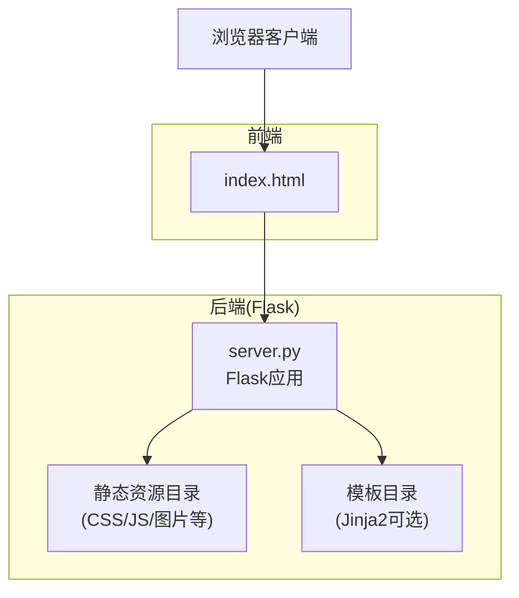
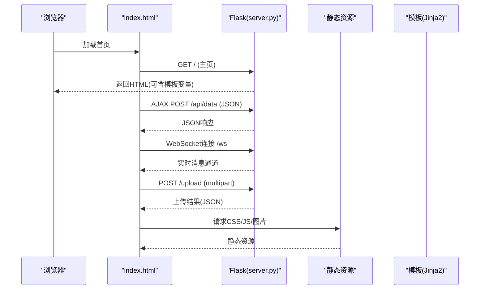
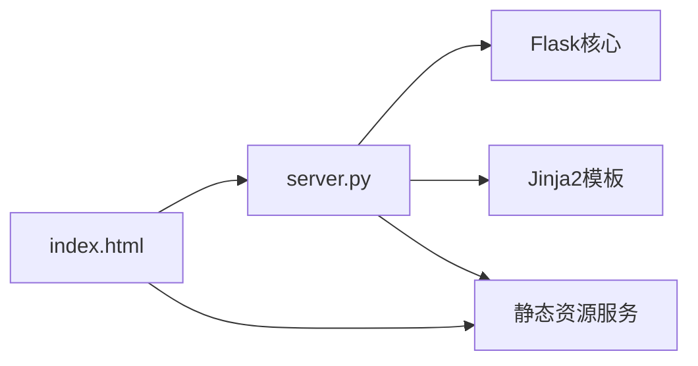

# 前端架构设计

<cite>
**本文引用的文件**   
- [frontend/server.py](file://frontend/server.py)
- [frontend/index.html](file://frontend/index.html)
- [README.md](file://README.md)
</cite>

## 目录
1. [简介](#简介)
2. [项目结构](#项目结构)
3. [核心组件](#核心组件)
4. [架构总览](#架构总览)
5. [详细组件分析](#详细组件分析)
6. [依赖分析](#依赖分析)
7. [性能考虑](#性能考虑)
8. [故障排查指南](#故障排查指南)
9. [结论](#结论)
10. [附录](#附录)

## 简介
本技术文档面向KAG-Pro的前端与Web服务层，聚焦基于Flask的Web服务器架构、静态资源管理、模板渲染机制、前后端通信模式（RESTful API、WebSocket、文件上传）、页面生命周期管理、安全策略以及扩展指南。文档旨在帮助开发者快速理解现有实现并在此基础上进行功能扩展与优化。

## 项目结构
当前仓库的前端相关代码集中在 frontend 目录下，包含：
- server.py：基于Flask的Web服务入口，负责路由、静态资源托管、模板渲染及API处理。
- index.html：单页应用的主HTML入口，承载前端UI与交互逻辑。
- generate_textbooks.py：用于生成教材文本的脚本（非运行时必需）。

图表来源
- [frontend/server.py](file://frontend/server.py)
- [frontend/index.html](file://frontend/index.html)

章节来源
- [frontend/server.py](file://frontend/server.py)
- [frontend/index.html](file://frontend/index.html)

## 核心组件
- Flask应用实例与配置
  - 应用初始化、调试开关、静态/模板目录设置。
- 路由与视图
  - 主页路由返回HTML；API路由提供数据接口；文件上传路由接收多部分表单。
- 静态资源管理
  - 通过Flask内置静态目录服务提供CSS/JS/媒体资源。
- 模板渲染
  - 使用Jinja2模板引擎渲染动态内容（如上下文变量注入）。
- 前后端通信
  - RESTful API：JSON请求/响应。
  - WebSocket：实时双向通信（若启用）。
  - 文件上传：multipart/form-data处理与存储。
- 错误处理与安全
  - 全局异常捕获、CSRF保护、输入校验、XSS防护。

章节来源
- [frontend/server.py](file://frontend/server.py)

## 架构总览
整体采用“单页HTML + Flask后端”的模式：
- 浏览器加载 index.html，执行前端脚本发起AJAX/WebSocket请求。
- Flask根据URL路径分发到对应视图函数或API处理器。
- 静态资源由Flask直接托管，减少Nginx等反向代理的复杂度。
- 模板渲染用于服务端生成初始页面或动态片段。

图表来源
- [frontend/server.py](file://frontend/server.py)
- [frontend/index.html](file://frontend/index.html)

## 详细组件分析

### Flask应用与配置
- 应用初始化
  - 创建Flask实例，设置静态文件夹与模板文件夹路径。
  - 配置调试模式、密钥、跨域等选项。
- 蓝图与模块化路由
  - 将不同功能模块的路由组织为蓝图，便于扩展与维护。
- 中间件与钩子
  - 请求前/后钩子用于日志记录、鉴权、CORS设置等。

章节来源
- [frontend/server.py](file://frontend/server.py)

### 路由设计与视图
- 主页路由
  - 返回 index.html 或通过模板渲染动态内容。
- API路由
  - 定义RESTful风格接口，如 /api/data、/api/upload 等。
  - 统一响应格式与错误码。
- 文件上传路由
  - 接收 multipart/form-data，校验文件类型与大小，持久化存储并返回结果。

章节来源
- [frontend/server.py](file://frontend/server.py)

### 静态资源管理
- 静态目录约定
  - CSS、JavaScript、字体、图片等资源放置在静态目录中。
- 版本化与缓存
  - 建议对静态资源添加版本号或哈希后缀以支持强缓存。
- CDN集成
  - 可将静态资源迁移至CDN以提升首屏加载速度。

章节来源
- [frontend/server.py](file://frontend/server.py)

### 模板渲染机制
- Jinja2模板
  - 在模板中注入上下文变量，实现动态页面生成。
- 模板继承与片段复用
  - 通过模板继承减少重复代码，提升一致性。
- 安全输出
  - 自动转义模板变量，防止XSS攻击。

章节来源
- [frontend/server.py](file://frontend/server.py)

### 前后端通信模式
- RESTful API
  - 使用标准HTTP方法与状态码，遵循幂等性与无状态原则。
  - 请求体与响应体采用JSON格式。
- WebSocket连接
  - 建立长连接以实现实时推送与双向通信。
  - 处理连接生命周期、心跳检测与断线重连。
- 文件上传
  - 支持分片上传与大文件流式处理。
  - 校验文件类型、大小与完整性，返回进度与结果。

章节来源
- [frontend/server.py](file://frontend/server.py)

### 页面生命周期管理
- 初始化流程
  - DOM就绪后加载必要资源，初始化状态管理器与事件监听器。
- 状态维护
  - 集中管理应用状态，避免分散的全局变量。
- 错误处理
  - 捕获网络异常、解析错误与业务错误，提供用户友好的提示。
- 资源清理
  - 页面卸载时释放定时器、事件监听与WebSocket连接。

章节来源
- [frontend/index.html](file://frontend/index.html)

### 安全考虑
- CSRF保护
  - 启用Flask-WTF或自定义CSRF令牌，确保表单提交安全性。
- 输入验证
  - 服务端严格校验所有输入参数，拒绝非法数据。
- XSS防护
  - 模板自动转义，前端对用户输入进行白名单过滤。
- 敏感信息
  - 不在前端暴露密钥或内部配置，必要时通过后端代理访问。

章节来源
- [frontend/server.py](file://frontend/server.py)

### 扩展指南
- 新增页面
  - 在路由中注册新页面路径，返回对应HTML或模板。
  - 在静态目录中添加对应的CSS/JS文件。
- 组件复用
  - 将通用UI封装为独立模块，通过模块化方式引入。
- 插件集成
  - 定义插件接口，允许第三方扩展功能而不侵入核心逻辑。
- 蓝图拆分
  - 按功能域划分蓝图，提高可维护性与团队协作效率。

章节来源
- [frontend/server.py](file://frontend/server.py)

## 依赖分析
- 外部依赖
  - Flask：Web框架核心。
  - Jinja2：模板引擎。
  - 可选：Flask-WTF（CSRF）、Flask-SocketIO（WebSocket）、Pydantic（数据校验）。
- 内部依赖
  - server.py 作为唯一入口，聚合路由、中间件与工具函数。
  - index.html 作为前端入口，依赖静态资源与服务端API。

图表来源
- [frontend/server.py](file://frontend/server.py)
- [frontend/index.html](file://frontend/index.html)

章节来源
- [frontend/server.py](file://frontend/server.py)
- [frontend/index.html](file://frontend/index.html)

## 性能考虑
- 静态资源优化
  - 启用Gzip/Brotli压缩，合并与最小化CSS/JS。
  - 使用HTTP缓存头与资源版本控制。
- 数据库与I/O
  - 对频繁读取的数据进行缓存（内存或Redis）。
  - 异步处理耗时任务，避免阻塞请求线程。
- 前端优化
  - 懒加载与按需加载脚本。
  - 使用虚拟滚动与分页减少DOM压力。
- 监控与指标
  - 记录关键接口延迟与错误率，设置告警阈值。

[本节为通用指导，不直接分析具体文件]

## 故障排查指南
- 常见问题定位
  - 检查Flask日志输出，确认路由匹配与异常堆栈。
  - 查看浏览器控制台与Network面板，定位前端错误与网络失败。
- 典型错误场景
  - 404：路由未注册或路径拼写错误。
  - 403/401：权限不足或CSRF令牌缺失。
  - 500：服务端未捕获异常或依赖服务不可用。
- 恢复策略
  - 重启服务、回滚变更、降级功能。
  - 增加重试与熔断机制，提升系统韧性。

章节来源
- [frontend/server.py](file://frontend/server.py)

## 结论
KAG-Pro前端采用简洁清晰的“单页HTML + Flask后端”架构，具备可扩展的路由设计、完善的静态资源管理与模板渲染机制。通过RESTful API、WebSocket与文件上传能力，满足多样化交互需求。建议在后续迭代中强化安全策略、性能优化与可观测性，进一步提升用户体验与系统稳定性。

[本节为总结性内容，不直接分析具体文件]

## 附录
- 参考文档
  - README.md：项目背景与使用说明。
- 术语表
  - RESTful API：基于HTTP方法的标准化接口设计。
  - WebSocket：全双工通信协议，适用于实时场景。
  - CSRF：跨站请求伪造攻击防护机制。
  - XSS：跨站脚本攻击防护机制。

章节来源
- [README.md](file://README.md)