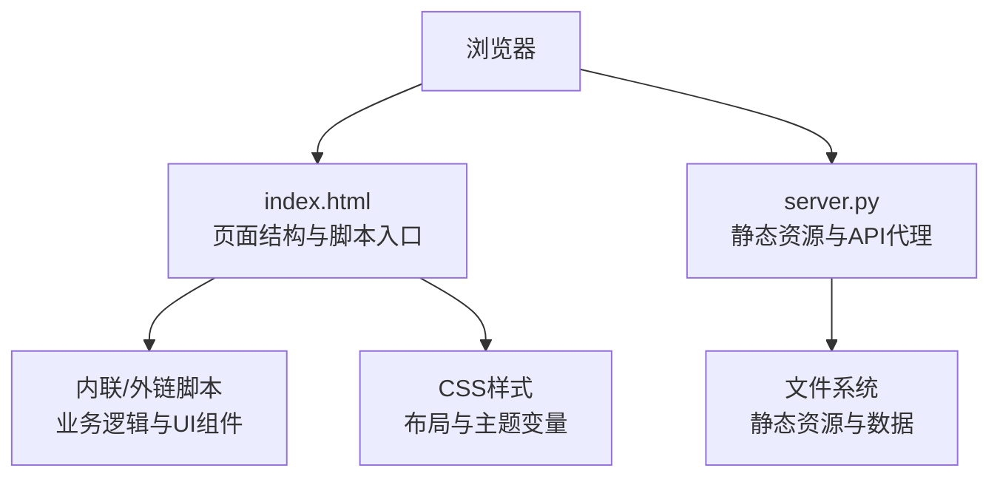
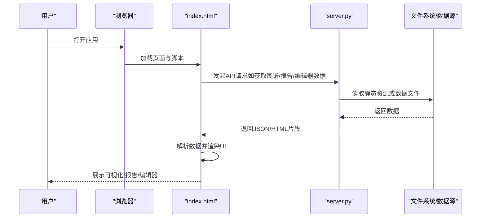
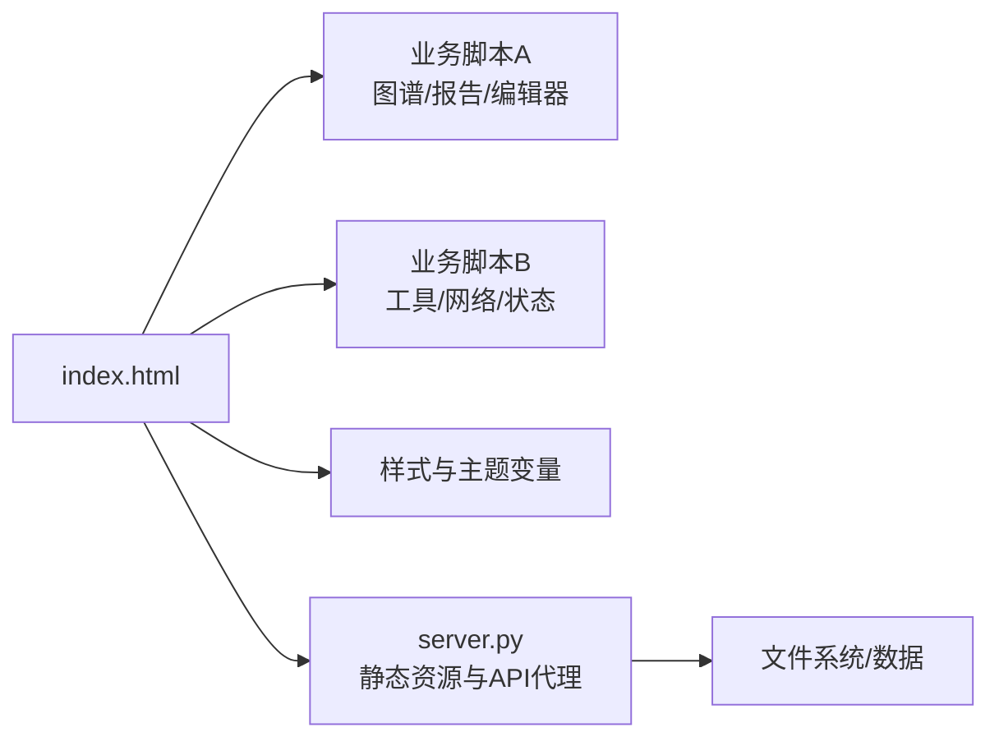

# 前端界面

<cite>
**本文引用的文件**   
- [frontend/index.html](file://frontend/index.html)
- [frontend/server.py](file://frontend/server.py)
- [README.md](file://README.md)
</cite>

## 目录
1. [简介](#简介)
2. [项目结构](#项目结构)
3. [核心组件](#核心组件)
4. [架构总览](#架构总览)
5. [详细组件分析](#详细组件分析)
6. [依赖分析](#依赖分析)
7. [性能考虑](#性能考虑)
8. [故障排查指南](#故障排查指南)
9. [结论](#结论)
10. [附录](#附录)

## 简介
本文件面向KAG-Pro的前端界面，提供从架构到实现细节的完整技术文档。内容涵盖HTML/CSS/JavaScript的组织与模块化、用户交互流程（页面导航、表单处理、异步通信）、核心UI组件（知识图谱可视化、诊断报告展示、内容编辑器）的功能与配置、响应式设计与跨浏览器兼容策略、主题定制与样式覆盖方法、前端开发规范与构建部署流程，以及性能优化与扩展指南。

## 项目结构
前端位于仓库根目录下的 frontend 子目录中，采用“单页应用 + 轻量后端服务”的极简组织方式：
- index.html：前端入口，承载页面结构与脚本加载逻辑
- server.py：基于Python的HTTP服务，用于本地开发与调试时提供静态资源与API代理
- generate_textbooks.py：辅助脚本，用于生成或准备教材数据（非运行时必需）

图表来源
- [frontend/index.html](file://frontend/index.html)
- [frontend/server.py](file://frontend/server.py)

章节来源
- [frontend/index.html](file://frontend/index.html)
- [frontend/server.py](file://frontend/server.py)

## 核心组件
本节聚焦前端三大核心能力：知识图谱可视化、诊断报告展示、内容编辑器。由于当前前端为单页结构，这些能力以模块化的方式在 index.html 中通过脚本组织与渲染。

- 知识图谱可视化
  - 功能要点：节点与边数据的加载、渲染、缩放与拖拽、点击交互、图例与筛选
  - 数据流：从后端接口获取图谱数据 → 解析并转换为可视化所需格式 → 初始化画布与图层 → 绑定事件监听
  - 关键实现位置参考：[frontend/index.html](file://frontend/index.html)

- 诊断报告展示
  - 功能要点：结构化报告的渲染、折叠/展开、导出、高亮错误与建议项
  - 数据流：请求诊断结果 → 组装模板 → 渲染DOM → 更新交互状态
  - 关键实现位置参考：[frontend/index.html](file://frontend/index.html)

- 内容编辑器
  - 功能要点：富文本编辑、自动保存、版本历史、协作提示（可选）
  - 数据流：捕获输入变更 → 防抖/节流 → 提交至后端 → 同步显示与状态
  - 关键实现位置参考：[frontend/index.html](file://frontend/index.html)

章节来源
- [frontend/index.html](file://frontend/index.html)

## 架构总览
整体采用“前端单页 + 轻量后端”的架构：浏览器直接加载 index.html，并通过异步请求与 server.py 提供的接口进行数据交换。该模式适合快速迭代与本地调试。

图表来源
- [frontend/index.html](file://frontend/index.html)
- [frontend/server.py](file://frontend/server.py)

## 详细组件分析

### 页面导航与路由
- 设计目标：在不刷新页面的前提下切换视图（首页、图谱、报告、编辑器）
- 实现思路：
  - 使用哈希路由或History API维护当前视图状态
  - 根据路由匹配加载对应模块并渲染
  - 支持后退/前进与书签直达
- 关键实现位置参考：[frontend/index.html](file://frontend/index.html)

章节来源
- [frontend/index.html](file://frontend/index.html)

### 表单处理与校验
- 设计目标：统一收集用户输入、实时校验、错误提示与提交反馈
- 实现思路：
  - 表单元素绑定事件监听器
  - 前端规则校验（必填、格式、范围等）
  - 提交前二次确认与防重复提交
  - 成功后清空或跳转，失败时保留输入并提示
- 关键实现位置参考：[frontend/index.html](file://frontend/index.html)

章节来源
- [frontend/index.html](file://frontend/index.html)

### 异步通信机制
- 设计目标：稳定高效的网络请求与错误恢复
- 实现思路：
  - 封装统一的请求函数（含超时、重试、取消）
  - 拦截器处理鉴权头、错误码映射与全局提示
  - 对大数据量接口采用分页或增量加载
- 关键实现位置参考：[frontend/index.html](file://frontend/index.html)

章节来源
- [frontend/index.html](file://frontend/index.html)

### 知识图谱可视化组件
- 数据结构：节点（id、label、type、position等）、边（source、target、weight、type等）
- 渲染流程：
  - 初始化画布与坐标系
  - 批量创建节点与边对象
  - 计算布局（力导向/层级/网格）
  - 绑定交互（缩放、拖拽、点击、悬停）
  - 提供筛选与搜索
- 性能优化：
  - 虚拟渲染与按需绘制
  - 合并绘制批次与减少重排
  - 使用离屏Canvas/WebGL（视规模而定）
- 关键实现位置参考：[frontend/index.html](file://frontend/index.html)

章节来源
- [frontend/index.html](file://frontend/index.html)

### 诊断报告展示组件
- 数据结构：诊断条目（id、category、severity、message、suggestion、evidence等）
- 渲染流程：
  - 按类别分组与排序
  - 折叠面板与详情展开
  - 高亮严重问题与建议项
  - 支持导出PDF/Markdown
- 关键实现位置参考：[frontend/index.html](file://frontend/index.html)

章节来源
- [frontend/index.html](file://frontend/index.html)

### 内容编辑器组件
- 数据结构：文档元信息（title、author、version、updatedAt等）、正文（富文本或Markdown）
- 渲染流程：
  - 初始化编辑器实例
  - 监听输入变更并触发自动保存
  - 版本历史对比与回滚
  - 协同编辑（可选）
- 关键实现位置参考：[frontend/index.html](file://frontend/index.html)

章节来源
- [frontend/index.html](file://frontend/index.html)

### 响应式设计与跨浏览器兼容
- 响应式策略：
  - 使用相对单位与弹性布局（Flex/Grid）
  - 媒体查询适配不同屏幕尺寸
  - 移动端优先的触控交互优化
- 兼容性策略：
  - 特性检测与降级方案
  - Polyfill按需引入
  - 避免使用最新未广泛支持的API
- 关键实现位置参考：[frontend/index.html](file://frontend/index.html)

章节来源
- [frontend/index.html](file://frontend/index.html)

### 主题定制与样式覆盖
- CSS变量：
  - 定义主题色板、字体族、字号、间距、阴影等变量
  - 通过data-theme或类名切换主题
- 自定义注入：
  - 提供样式注入点（如头部插入自定义CSS）
  - 暴露配置对象供外部覆盖默认值
- 关键实现位置参考：[frontend/index.html](file://frontend/index.html)

章节来源
- [frontend/index.html](file://frontend/index.html)

## 依赖分析
前端依赖关系集中在 index.html 的脚本加载与模块划分上；后端由 server.py 提供静态资源与API代理。

图表来源
- [frontend/index.html](file://frontend/index.html)
- [frontend/server.py](file://frontend/server.py)

章节来源
- [frontend/index.html](file://frontend/index.html)
- [frontend/server.py](file://frontend/server.py)

## 性能考虑
- 资源加载优化
  - 延迟加载非首屏脚本与组件
  - 压缩与缓存静态资源
  - 预连接与预取关键资源
- 渲染性能
  - 减少重排与重绘，批量更新DOM
  - 使用虚拟列表/虚拟化渲染大数据集
  - 动画与过渡使用GPU加速属性
- 网络优化
  - 接口合并与分页
  - 断线重试与超时控制
  - 条件请求与ETag/Last-Modified
- 用户体验改进
  - 骨架屏与占位符
  - 操作反馈与进度指示
  - 错误边界与友好提示

## 故障排查指南
- 常见问题定位
  - 检查浏览器控制台的网络请求与错误日志
  - 验证API路径与返回格式是否符合预期
  - 确认静态资源路径与权限
- 调试建议
  - 使用开发者工具的Performance与Memory面板分析瓶颈
  - 开启CORS与跨域调试（本地开发）
  - 逐步注释脚本定位冲突模块
- 关键实现位置参考
  - 前端入口与脚本组织：[frontend/index.html](file://frontend/index.html)
  - 后端服务与路由：[frontend/server.py](file://frontend/server.py)

章节来源
- [frontend/index.html](file://frontend/index.html)
- [frontend/server.py](file://frontend/server.py)

## 结论
KAG-Pro的前端采用简洁的单页架构，结合轻量后端服务，满足快速开发与本地调试需求。通过模块化脚本与清晰的职责划分，实现了知识图谱可视化、诊断报告展示与内容编辑器三大核心能力。配合响应式与主题定制策略，可在多设备与多品牌浏览器中获得一致体验。后续可在此基础上引入更完善的构建与打包流程、组件库与测试体系，进一步提升可维护性与性能。

## 附录

### 前端开发指南
- 代码规范
  - 命名约定：模块与变量使用小驼峰，常量全大写
  - 文件组织：按功能拆分模块，避免单文件过大
  - 注释与文档：关键逻辑添加行内注释与JSDoc
- 构建流程
  - 本地开发：直接运行 server.py 启动静态服务
  - 生产构建：引入打包工具（如Vite/Webpack），启用压缩与Tree Shaking
- 部署配置
  - 静态资源托管（Nginx/Apache/CDN）
  - 环境变量与API地址配置
  - HTTPS与安全头设置

### 自定义界面开发示例与扩展指南
- 新增页面
  - 在 index.html 中添加路由与容器节点
  - 编写独立模块脚本并在路由处懒加载
- 扩展组件
  - 将通用能力抽离为可复用组件
  - 通过配置对象注入行为与样式
- 主题扩展
  - 在CSS变量集中新增主题键
  - 提供主题切换入口与持久化存储

章节来源
- [frontend/index.html](file://frontend/index.html)
- [frontend/server.py](file://frontend/server.py)
- [README.md](file://README.md)