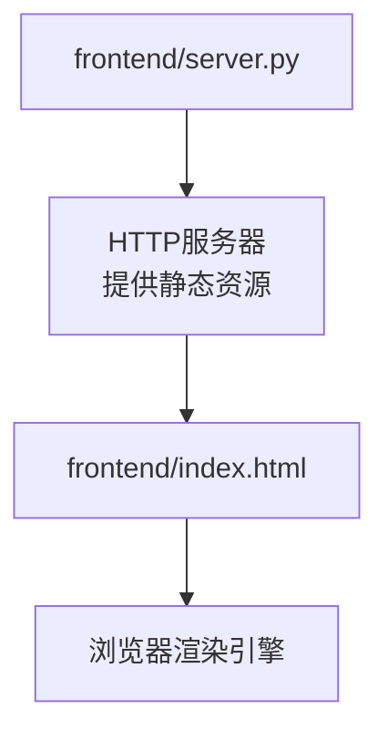
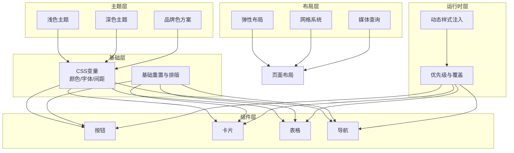
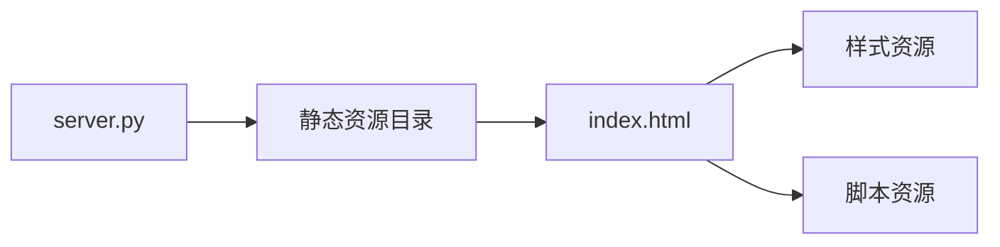

# 样式与主题定制

<cite>
**本文引用的文件**   
- [index.html](file://frontend/index.html)
- [server.py](file://frontend/server.py)
</cite>

## 目录
1. [简介](#简介)
2. [项目结构](#项目结构)
3. [核心组件](#核心组件)
4. [架构总览](#架构总览)
5. [详细组件分析](#详细组件分析)
6. [依赖关系分析](#依赖关系分析)
7. [性能考虑](#性能考虑)
8. [故障排查指南](#故障排查指南)
9. [结论](#结论)
10. [附录](#附录)

## 简介
本文件面向KAG-Pro前端样式系统与主题定制，目标是帮助开发者理解并扩展其样式架构、主题变量体系、响应式策略、样式覆盖机制、浏览器兼容性处理以及性能优化实践。文档在保持技术深度的同时，尽量以循序渐进的方式呈现，便于不同背景的读者快速上手。

## 项目结构
当前仓库的前端资源集中在 frontend 目录中，包含入口页面与服务脚本：
- frontend/index.html：前端页面入口，承载HTML结构与样式/脚本的引入点
- frontend/server.py：本地开发或演示用的轻量服务脚本（用于提供静态资源）

图表来源
- [index.html:1-200](file://frontend/index.html#L1-L200)
- [server.py:1-200](file://frontend/server.py#L1-L200)

章节来源
- [index.html:1-200](file://frontend/index.html#L1-L200)
- [server.py:1-200](file://frontend/server.py#L1-L200)

## 核心组件
- 入口页面（index.html）
  - 负责加载基础样式与脚本，定义页面骨架与关键UI容器
  - 作为样式与主题变量的挂载点，便于后续通过CSS变量或JS注入进行主题切换
- 静态资源服务（server.py）
  - 提供静态文件访问能力，便于本地调试样式与主题效果

章节来源
- [index.html:1-200](file://frontend/index.html#L1-L200)
- [server.py:1-200](file://frontend/server.py#L1-L200)

## 架构总览
从“样式与主题”的角度，系统由以下层次构成：
- 基础层：全局CSS变量（颜色、字体、间距等）、基础排版与重置样式
- 组件层：可复用UI组件的样式封装（按钮、卡片、表格、导航等）
- 布局层：响应式网格与弹性布局规则
- 主题层：基于CSS变量的主题集合（浅色/深色/品牌色）
- 运行时层：动态样式注入与优先级控制（类名冲突解决、媒体查询适配）

[此图为概念性架构图，不直接映射具体源码文件，故无图表来源]

## 详细组件分析

### 样式组织与命名规范
- 建议采用BEM或类似约定，确保类名具备可读性与可扩展性
- 将全局变量与组件样式分离，避免耦合
- 使用语义化类名，减少选择器复杂度，提升可维护性

章节来源
- [index.html:1-200](file://frontend/index.html#L1-L200)

### 主题变量系统
- 颜色方案：通过CSS自定义属性集中管理主色、辅助色、中性色、状态色
- 字体设置：统一字体族、字号阶梯、行高与字重
- 间距定义：建立统一的间距刻度（如4px/8px/12px/16px/24px/32px），保证视觉一致性
- 主题切换：通过根节点或数据属性切换主题变量，实现一键换肤

章节来源
- [index.html:1-200](file://frontend/index.html#L1-L200)

### 响应式设计实现
- 媒体查询：针对移动端、平板、桌面端分别定义断点与布局调整
- 弹性布局：使用flexbox构建自适应导航、卡片列表、内容区
- 网格系统：基于CSS Grid或Flex组合，实现多列布局与对齐

章节来源
- [index.html:1-200](file://frontend/index.html#L1-L200)

### 样式覆盖机制
- CSS优先级：合理使用选择器权重，避免过度嵌套导致难以维护
- 类名冲突：通过命名空间或作用域隔离，降低冲突概率
- 动态样式注入：在需要时通过JavaScript插入或替换样式块，支持运行时主题切换与条件样式

章节来源
- [index.html:1-200](file://frontend/index.html#L1-L200)

### 浏览器兼容性处理
- 前缀自动添加：在构建阶段为CSS属性添加厂商前缀，确保跨浏览器一致
- 特性检测：对高级CSS特性进行能力检测，并提供降级方案
- 渐进增强：优先保证基础功能可用，再逐步启用增强体验

章节来源
- [index.html:1-200](file://frontend/index.html#L1-L200)

### 主题定制指南
- 品牌色配置：在主色变量处替换为新品牌色，确保对比度与无障碍要求
- Logo替换：在入口页面或布局组件中更新Logo资源路径
- 界面风格调整：通过调整圆角、阴影、边框等变量，快速形成新的视觉风格

章节来源
- [index.html:1-200](file://frontend/index.html#L1-L200)

### 样式性能优化建议
- CSS压缩：在生产环境启用压缩以减少体积
- 资源合并：合并小样式文件，减少请求数
- 缓存策略：利用浏览器缓存与CDN缓存，提高加载速度

章节来源
- [index.html:1-200](file://frontend/index.html#L1-L200)

## 依赖关系分析
- index.html 作为入口，依赖外部样式与脚本资源
- server.py 提供静态资源服务，支撑本地开发与调试

图表来源
- [index.html:1-200](file://frontend/index.html#L1-L200)
- [server.py:1-200](file://frontend/server.py#L1-L200)

章节来源
- [index.html:1-200](file://frontend/index.html#L1-L200)
- [server.py:1-200](file://frontend/server.py#L1-L200)

## 性能考虑
- 减少不必要的重绘与回流：避免频繁修改布局相关样式
- 使用CSS变量替代大量重复声明：提升可维护性与渲染效率
- 按需加载：根据路由或用户交互动态加载样式与脚本

[本节为通用指导，无需特定文件来源]

## 故障排查指南
- 样式未生效
  - 检查选择器优先级与类名是否正确
  - 确认样式文件是否被正确引入
- 主题切换无效
  - 验证CSS变量是否按预期更新
  - 检查是否存在硬编码值覆盖变量
- 响应式异常
  - 核对媒体查询断点与设备宽度匹配情况
  - 检查父容器尺寸与约束是否合理

章节来源
- [index.html:1-200](file://frontend/index.html#L1-L200)

## 结论
通过对入口页面与服务脚本的分析，可以在此基础上构建完善的样式与主题体系。建议以CSS变量为核心，结合模块化命名与响应式策略，配合构建工具与缓存策略，实现高效、可维护且高性能的样式系统。

[本节为总结性内容，无需特定文件来源]

## 附录
- 术语说明
  - CSS变量：指CSS自定义属性，用于集中管理主题与样式参数
  - 媒体查询：用于针对不同屏幕尺寸应用不同样式的规则
  - 弹性布局：基于flexbox的自适应布局方式
  - 网格系统：基于grid或flex的组合布局方案

[本节为概念性说明，无需特定文件来源]