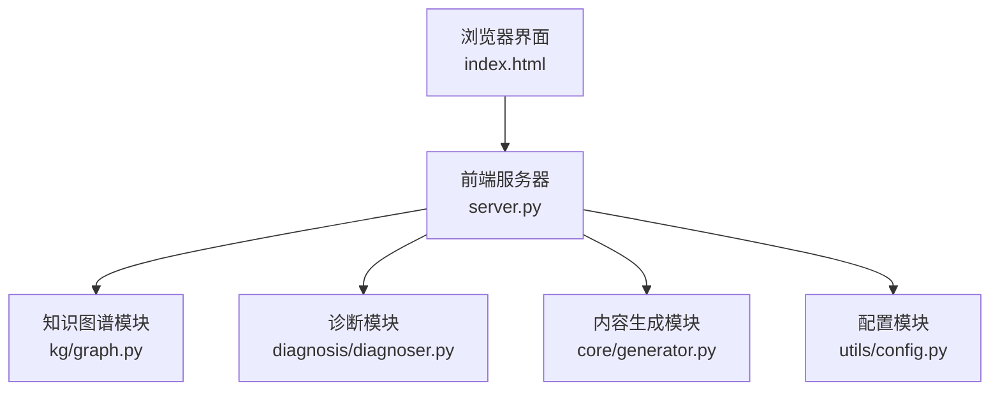
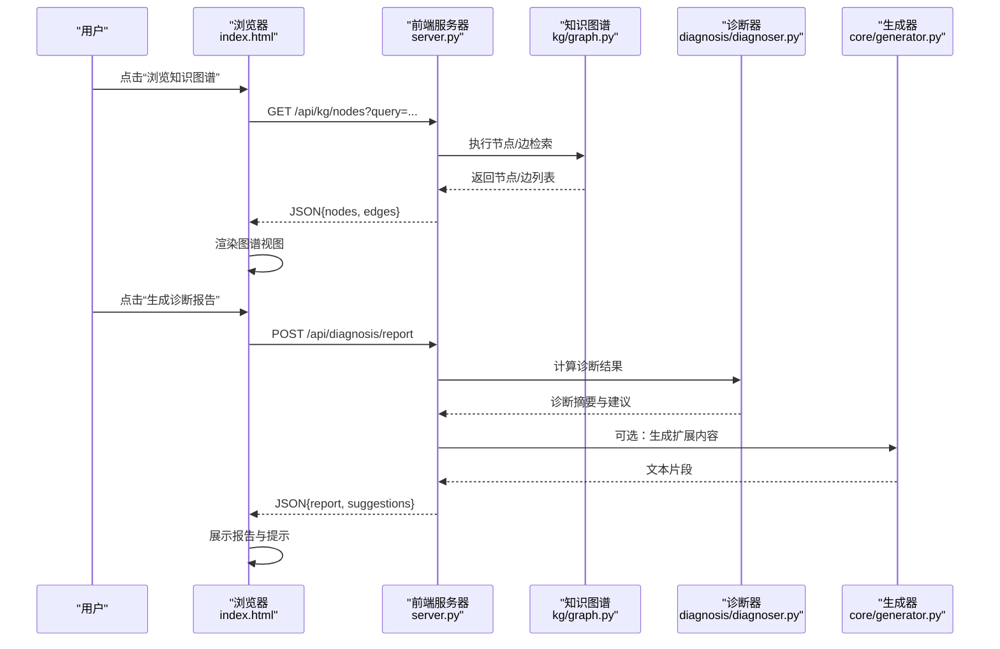
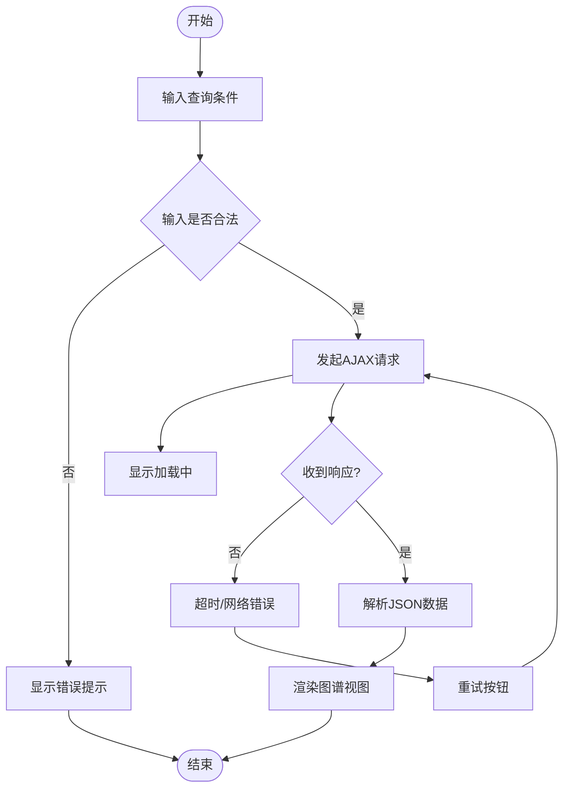
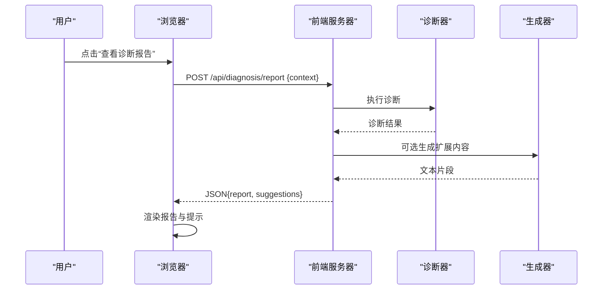
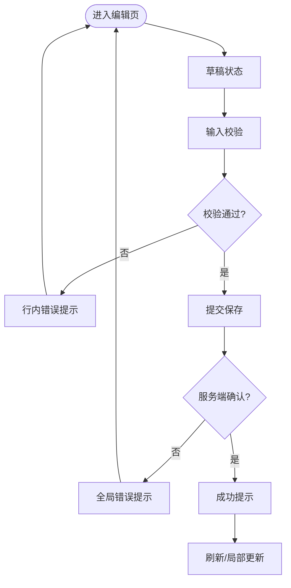
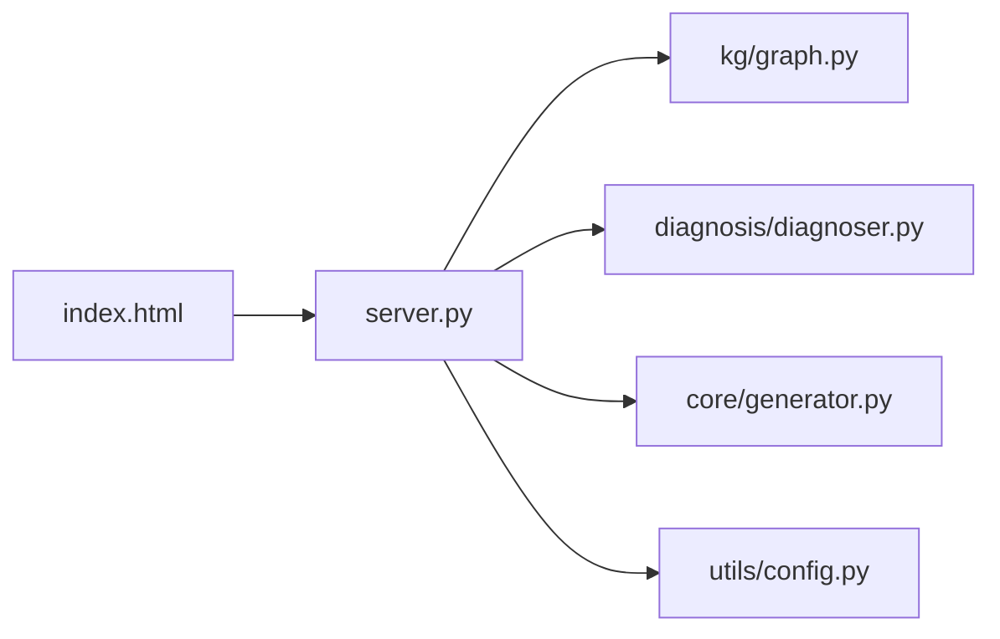

# 用户交互设计

<cite>
**本文引用的文件**   
- [frontend/index.html](file://frontend/index.html)
- [frontend/server.py](file://frontend/server.py)
- [src/kag_pro/kg/graph.py](file://src/kag_pro/kg/graph.py)
- [src/kag_pro/diagnosis/diagnoser.py](file://src/kag_pro/diagnosis/diagnoser.py)
- [src/kag_pro/core/generator.py](file://src/kag_pro/core/generator.py)
- [src/kag_pro/utils/config.py](file://src/kag_pro/utils/config.py)
</cite>

## 目录
1. [简介](#简介)
2. [项目结构](#项目结构)
3. [核心组件](#核心组件)
4. [架构总览](#架构总览)
5. [详细组件分析](#详细组件分析)
6. [依赖分析](#依赖分析)
7. [性能考虑](#性能考虑)
8. [故障排查指南](#故障排查指南)
9. [结论](#结论)
10. [附录](#附录)

## 简介
本设计文档面向KAG-Pro的用户交互系统，聚焦以下目标：
- 描述核心用户工作流：知识图谱浏览、诊断报告查看、内容编辑的主要操作流程。
- 详细说明表单处理机制：输入验证、数据提交与错误反馈。
- 解释异步通信实现：AJAX请求、进度显示与实时响应处理。
- 文档化用户反馈系统：加载状态、成功提示与错误消息展示。
- 说明导航设计：页面跳转、历史记录管理与面包屑导航。
- 提供用户体验优化建议：响应时间优化、操作确认与撤销功能。

## 项目结构
前端采用轻量静态页面与服务端脚本协作的方式：
- 前端入口：index.html（页面结构与基础交互逻辑）
- 前端服务：server.py（HTTP服务与路由转发）
- 后端能力：通过Python模块暴露图检索、诊断、生成等能力，供前端调用

图表来源
- [frontend/index.html](file://frontend/index.html)
- [frontend/server.py](file://frontend/server.py)
- [src/kag_pro/kg/graph.py](file://src/kag_pro/kg/graph.py)
- [src/kag_pro/diagnosis/diagnoser.py](file://src/kag_pro/diagnosis/diagnoser.py)
- [src/kag_pro/core/generator.py](file://src/kag_pro/core/generator.py)
- [src/kag_pro/utils/config.py](file://src/kag_pro/utils/config.py)

章节来源
- [frontend/index.html](file://frontend/index.html)
- [frontend/server.py](file://frontend/server.py)

## 核心组件
- 前端界面层（index.html）
  - 负责渲染页面、收集用户输入、发起AJAX请求、更新UI状态与反馈。
- 前端服务层（server.py）
  - 提供HTTP接口，接收前端请求，转发到后端模块，返回结构化JSON响应。
- 知识图谱模块（kg/graph.py）
  - 提供节点/边查询、路径检索、可视化所需的数据聚合。
- 诊断模块（diagnosis/diagnoser.py）
  - 基于学习轨迹或输入特征输出诊断结果与建议。
- 内容生成模块（core/generator.py）
  - 根据上下文与规则生成文本内容，用于报告或教学材料。
- 配置模块（utils/config.py）
  - 集中管理运行参数与开关，便于前后端一致行为。

章节来源
- [frontend/index.html](file://frontend/index.html)
- [frontend/server.py](file://frontend/server.py)
- [src/kag_pro/kg/graph.py](file://src/kag_pro/kg/graph.py)
- [src/kag_pro/diagnosis/diagnoser.py](file://src/kag_pro/diagnosis/diagnoser.py)
- [src/kag_pro/core/generator.py](file://src/kag_pro/core/generator.py)
- [src/kag_pro/utils/config.py](file://src/kag_pro/utils/config.py)

## 架构总览
整体交互遵循“前端请求—服务端路由—业务模块—返回JSON—前端渲染”的闭环。

图表来源
- [frontend/index.html](file://frontend/index.html)
- [frontend/server.py](file://frontend/server.py)
- [src/kag_pro/kg/graph.py](file://src/kag_pro/kg/graph.py)
- [src/kag_pro/diagnosis/diagnoser.py](file://src/kag_pro/diagnosis/diagnoser.py)
- [src/kag_pro/core/generator.py](file://src/kag_pro/core/generator.py)

## 详细组件分析

### 知识图谱浏览工作流
- 用户输入关键词或选择主题后，前端发送GET请求至图谱接口。
- 服务端调用图谱模块进行检索，返回节点与边的集合。
- 前端将数据转换为可视化数据结构并渲染。

图表来源
- [frontend/index.html](file://frontend/index.html)
- [frontend/server.py](file://frontend/server.py)
- [src/kag_pro/kg/graph.py](file://src/kag_pro/kg/graph.py)

章节来源
- [frontend/index.html](file://frontend/index.html)
- [frontend/server.py](file://frontend/server.py)
- [src/kag_pro/kg/graph.py](file://src/kag_pro/kg/graph.py)

### 诊断报告查看工作流
- 用户触发诊断动作，前端POST请求携带必要上下文。
- 服务端调用诊断器生成诊断结果，必要时联动生成器补充内容。
- 前端以结构化方式展示报告与建议项。

图表来源
- [frontend/index.html](file://frontend/index.html)
- [frontend/server.py](file://frontend/server.py)
- [src/kag_pro/diagnosis/diagnoser.py](file://src/kag_pro/diagnosis/diagnoser.py)
- [src/kag_pro/core/generator.py](file://src/kag_pro/core/generator.py)

章节来源
- [frontend/index.html](file://frontend/index.html)
- [frontend/server.py](file://frontend/server.py)
- [src/kag_pro/diagnosis/diagnoser.py](file://src/kag_pro/diagnosis/diagnoser.py)
- [src/kag_pro/core/generator.py](file://src/kag_pro/core/generator.py)

### 内容编辑工作流
- 用户在编辑器中修改文本或结构化字段。
- 前端对输入进行本地校验，通过后提交保存。
- 服务端持久化变更并返回确认信息，前端刷新或局部更新。

章节来源
- [frontend/index.html](file://frontend/index.html)
- [frontend/server.py](file://frontend/server.py)

### 表单处理机制
- 输入验证
  - 前端在提交前进行必填、格式、长度等校验，失败时即时反馈。
  - 服务端再次校验，确保数据安全与一致性。
- 数据提交
  - 使用AJAX提交JSON或表单数据，避免整页刷新。
  - 支持分块上传或增量保存以提升体验。
- 错误反馈
  - 统一错误码与消息结构，前端按类型展示（行内、全局、弹窗）。
  - 对网络异常、超时、服务端异常分别处理。

章节来源
- [frontend/index.html](file://frontend/index.html)
- [frontend/server.py](file://frontend/server.py)

### 异步通信实现
- AJAX请求
  - 使用Fetch或XMLHttpRequest发起请求，设置超时与重试策略。
- 进度显示
  - 长耗时任务采用轮询或事件流，前端展示进度条或步骤指示。
- 实时响应处理
  - 对增量数据采用追加渲染；对关键状态变更使用Toast或横幅提示。

章节来源
- [frontend/index.html](file://frontend/index.html)
- [frontend/server.py](file://frontend/server.py)

### 用户反馈系统
- 加载状态
  - 全局遮罩或局部骨架屏，避免误触与重复提交。
- 成功提示
  - 短暂出现的成功消息，自动消失并提供“查看详情”链接。
- 错误消息
  - 明确原因与修复建议，提供重试与回退路径。

章节来源
- [frontend/index.html](file://frontend/index.html)

### 导航设计
- 页面跳转
  - 单页应用模式，通过路由切换视图，保持状态与缓存。
- 历史记录管理
  - 维护前进/后退栈，支持深链直达与状态恢复。
- 面包屑导航
  - 动态构建层级路径，支持一键返回上级。

章节来源
- [frontend/index.html](file://frontend/index.html)

## 依赖分析
前后端通过HTTP解耦，后端模块职责清晰，耦合度低、内聚度高。

图表来源
- [frontend/index.html](file://frontend/index.html)
- [frontend/server.py](file://frontend/server.py)
- [src/kag_pro/kg/graph.py](file://src/kag_pro/kg/graph.py)
- [src/kag_pro/diagnosis/diagnoser.py](file://src/kag_pro/diagnosis/diagnoser.py)
- [src/kag_pro/core/generator.py](file://src/kag_pro/core/generator.py)
- [src/kag_pro/utils/config.py](file://src/kag_pro/utils/config.py)

章节来源
- [frontend/index.html](file://frontend/index.html)
- [frontend/server.py](file://frontend/server.py)
- [src/kag_pro/kg/graph.py](file://src/kag_pro/kg/graph.py)
- [src/kag_pro/diagnosis/diagnoser.py](file://src/kag_pro/diagnosis/diagnoser.py)
- [src/kag_pro/core/generator.py](file://src/kag_pro/core/generator.py)
- [src/kag_pro/utils/config.py](file://src/kag_pro/utils/config.py)

## 性能考虑
- 减少首屏负载
  - 按需加载图谱数据与诊断结果，避免一次性拉取全部资源。
- 缓存策略
  - 对热点节点与诊断模板做客户端缓存，结合ETag/Last-Modified降低重复请求。
- 并发控制
  - 限制并行请求数，避免阻塞主线程与UI抖动。
- 渲染优化
  - 虚拟滚动与增量更新，提升大数据量下的交互流畅度。
- 超时与重试
  - 合理设置超时阈值与指数退避重试，提高鲁棒性。

[本节为通用指导，不直接分析具体文件]

## 故障排查指南
- 常见问题定位
  - 网络错误：检查跨域、端口与代理配置。
  - 超时问题：增大超时阈值或拆分大请求。
  - 数据不一致：核对前后端字段映射与校验规则。
- 日志与调试
  - 前端记录请求ID与关键状态，服务端打印入参出参与耗时。
- 快速恢复
  - 提供重试与回退按钮，允许用户回到上一稳定状态。

章节来源
- [frontend/index.html](file://frontend/index.html)
- [frontend/server.py](file://frontend/server.py)

## 结论
本设计围绕“可理解、可操作、可恢复”的原则，构建了清晰的交互流程与稳健的异步通信机制。通过模块化后端与轻量前端协作，既保证了可扩展性，也提升了用户体验。后续可在缓存、懒加载与撤销重做等方面持续优化。

[本节为总结性内容，不直接分析具体文件]

## 附录
- 术语表
  - 知识图谱：由节点与边构成的结构化知识表示。
  - 诊断报告：基于模型或规则生成的个性化评估与建议。
  - 面包屑导航：显示当前页面层级路径的导航控件。
- 参考实现位置
  - 前端入口与交互：[frontend/index.html](file://frontend/index.html)
  - 前端服务与路由：[frontend/server.py](file://frontend/server.py)
  - 知识图谱能力：[src/kag_pro/kg/graph.py](file://src/kag_pro/kg/graph.py)
  - 诊断能力：[src/kag_pro/diagnosis/diagnoser.py](file://src/kag_pro/diagnosis/diagnoser.py)
  - 内容生成能力：[src/kag_pro/core/generator.py](file://src/kag_pro/core/generator.py)
  - 配置管理：[src/kag_pro/utils/config.py](file://src/kag_pro/utils/config.py)