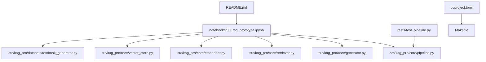
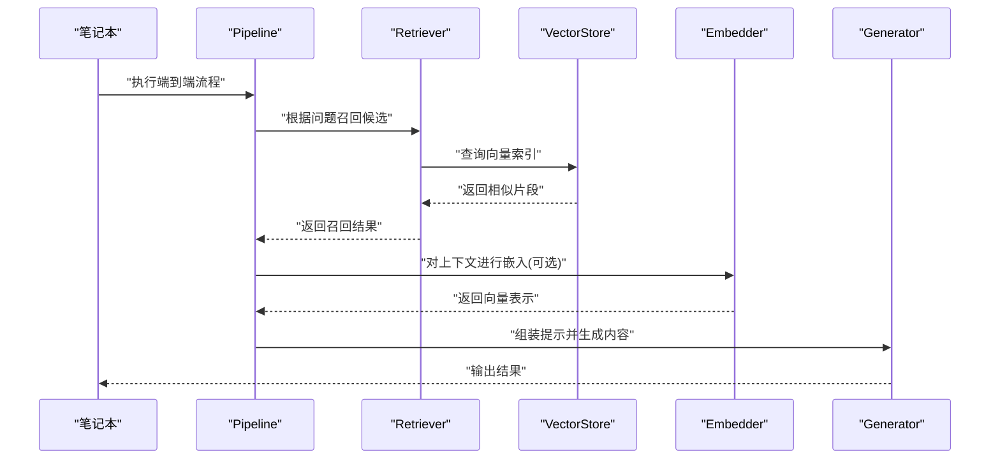
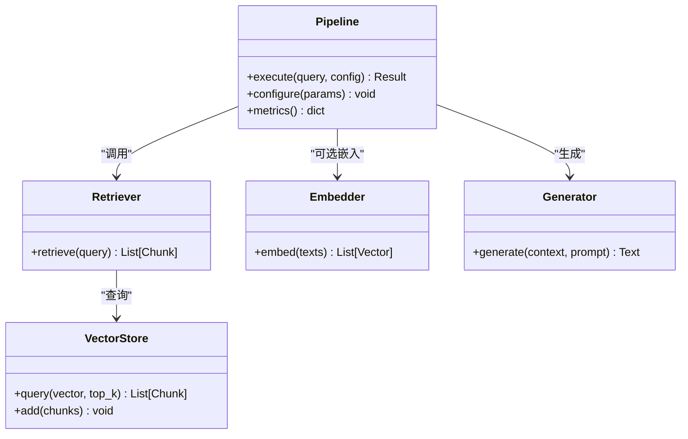
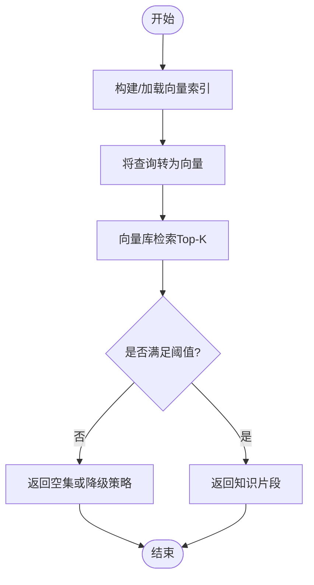
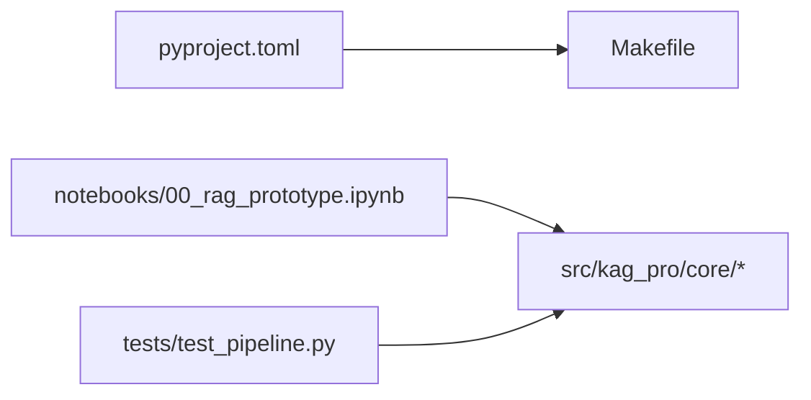

# Jupyter笔记本开发

<cite>
**本文引用的文件**   
- [README.md](file://README.md)
- [00_rag_prototype.ipynb](file://notebooks/00_rag_prototype.ipynb)
- [pyproject.toml](file://pyproject.toml)
- [Makefile](file://Makefile)
- [src/kag_pro/core/pipeline.py](file://src/kag_pro/core/pipeline.py)
- [src/kag_pro/core/generator.py](file://src/kag_pro/core/generator.py)
- [src/kag_pro/core/retriever.py](file://src/kag_pro/core/retriever.py)
- [src/kag_pro/core/embedder.py](file://src/kag_pro/core/embedder.py)
- [src/kag_pro/core/vector_store.py](file://src/kag_pro/core/vector_store.py)
- [src/kag_pro/datasets/textbook_generator.py](file://src/kag_pro/datasets/textbook_generator.py)
- [tests/test_pipeline.py](file://tests/test_pipeline.py)
</cite>

## 目录
1. [简介](#简介)
2. [项目结构](#项目结构)
3. [核心组件](#核心组件)
4. [架构总览](#架构总览)
5. [详细组件分析](#详细组件分析)
6. [依赖分析](#依赖分析)
7. [性能考虑](#性能考虑)
8. [故障排除指南](#故障排除指南)
9. [结论](#结论)
10. [附录](#附录)

## 简介
本指南面向在KAG-Pro中使用Jupyter进行原型开发、实验设计与结果可视化的工程师与研究者。文档围绕以下目标展开：
- 明确笔记本在项目中的定位：快速验证假设、探索数据、对比算法与可视化结果。
- 建立最佳实践：代码组织、单元格管理、版本控制策略，确保可复现与可协作。
- 提供从笔记本到生产代码的迁移路径：提取逻辑、模块化拆分、测试集成。
- 总结数据分析与可视化技巧：图表生成、结果对比、性能分析。
- 规范共享与协作方式：导出格式、文档生成、演示制作。
- 给出调试与排障方法：常见错误定位、日志与断点使用、环境隔离。

## 项目结构
KAG-Pro采用“源码+测试+示例”的分层组织，其中notebooks用于交互式探索，src为可复用模块，tests保障质量。

图示来源
- [00_rag_prototype.ipynb](file://notebooks/00_rag_prototype.ipynb)
- [src/kag_pro/core/pipeline.py](file://src/kag_pro/core/pipeline.py)
- [src/kag_pro/core/generator.py](file://src/kag_pro/core/generator.py)
- [src/kag_pro/core/retriever.py](file://src/kag_pro/core/retriever.py)
- [src/kag_pro/core/embedder.py](file://src/kag_pro/core/embedder.py)
- [src/kag_pro/core/vector_store.py](file://src/kag_pro/core/vector_store.py)
- [src/kag_pro/datasets/textbook_generator.py](file://src/kag_pro/datasets/textbook_generator.py)
- [tests/test_pipeline.py](file://tests/test_pipeline.py)
- [pyproject.toml](file://pyproject.toml)
- [Makefile](file://Makefile)
- [README.md](file://README.md)

章节来源
- [README.md](file://README.md)
- [pyproject.toml](file://pyproject.toml)
- [Makefile](file://Makefile)
- [00_rag_prototype.ipynb](file://notebooks/00_rag_prototype.ipynb)

## 核心组件
- 管道编排（Pipeline）：将检索、嵌入、向量存储、生成等步骤串联，形成端到端流程。
- 生成器（Generator）：封装文本生成或内容构造逻辑，供笔记本与生产代码共同调用。
- 检索器（Retriever）：负责从知识库或向量库中召回相关片段。
- 嵌入器（Embedder）：将文本转换为向量表示，支撑相似度检索。
- 向量存储（Vector Store）：持久化与管理向量索引，支持增量更新与查询。
- 教材生成（Textbook Generator）：面向教学内容的批量生成与组织。

章节来源
- [src/kag_pro/core/pipeline.py](file://src/kag_pro/core/pipeline.py)
- [src/kag_pro/core/generator.py](file://src/kag_pro/core/generator.py)
- [src/kag_pro/core/retriever.py](file://src/kag_pro/core/retriever.py)
- [src/kag_pro/core/embedder.py](file://src/kag_pro/core/embedder.py)
- [src/kag_pro/core/vector_store.py](file://src/kag_pro/core/vector_store.py)
- [src/kag_pro/datasets/textbook_generator.py](file://src/kag_pro/datasets/textbook_generator.py)

## 架构总览
下图展示笔记本如何驱动核心模块完成一次RAG式问答或内容生成的典型流程。

图示来源
- [src/kag_pro/core/pipeline.py](file://src/kag_pro/core/pipeline.py)
- [src/kag_pro/core/retriever.py](file://src/kag_pro/core/retriever.py)
- [src/kag_pro/core/vector_store.py](file://src/kag_pro/core/vector_store.py)
- [src/kag_pro/core/embedder.py](file://src/kag_pro/core/embedder.py)
- [src/kag_pro/core/generator.py](file://src/kag_pro/core/generator.py)

## 详细组件分析

### 组件A：Pipeline（流程编排）
- 职责：统一入口，协调检索、嵌入、生成等阶段；暴露简洁API供笔记本与测试调用。
- 设计要点：
  - 参数化配置：通过配置对象注入模型、分块策略、阈值等。
  - 可扩展阶段：新增处理节点时保持向后兼容。
  - 可观测性：记录关键指标（耗时、召回数量、生成长度）。
- 与测试的关系：tests/test_pipeline.py覆盖主流程，确保迁移后行为一致。

图示来源
- [src/kag_pro/core/pipeline.py](file://src/kag_pro/core/pipeline.py)
- [src/kag_pro/core/retriever.py](file://src/kag_pro/core/retriever.py)
- [src/kag_pro/core/vector_store.py](file://src/kag_pro/core/vector_store.py)
- [src/kag_pro/core/embedder.py](file://src/kag_pro/core/embedder.py)
- [src/kag_pro/core/generator.py](file://src/kag_pro/core/generator.py)

章节来源
- [src/kag_pro/core/pipeline.py](file://src/kag_pro/core/pipeline.py)
- [tests/test_pipeline.py](file://tests/test_pipeline.py)

### 组件B：Retriever与VectorStore（检索与存储）
- 职责：将自然语言问题映射为向量，并在向量库中检索最相关的知识片段。
- 关键点：
  - 索引构建：批量导入与增量更新策略。
  - 查询优化：top_k选择、相似度阈值过滤。
  - 一致性：与Embedder的维度与编码约定保持一致。

图示来源
- [src/kag_pro/core/retriever.py](file://src/kag_pro/core/retriever.py)
- [src/kag_pro/core/vector_store.py](file://src/kag_pro/core/vector_store.py)
- [src/kag_pro/core/embedder.py](file://src/kag_pro/core/embedder.py)

章节来源
- [src/kag_pro/core/retriever.py](file://src/kag_pro/core/retriever.py)
- [src/kag_pro/core/vector_store.py](file://src/kag_pro/core/vector_store.py)
- [src/kag_pro/core/embedder.py](file://src/kag_pro/core/embedder.py)

### 组件C：Generator（生成器）
- 职责：基于检索到的上下文与提示词模板，生成答案或教学内容。
- 关注点：
  - 提示工程：结构化输入、约束输出格式。
  - 稳定性：温度、最大长度等参数的敏感性分析。
  - 可测试性：固定种子与最小数据集回归。

章节来源
- [src/kag_pro/core/generator.py](file://src/kag_pro/core/generator.py)

### 组件D：Textbook Generator（教材生成）
- 职责：面向教材内容的批量生成与组织，便于在笔记本中进行样例演示与评估。
- 建议：
  - 将生成脚本拆分为独立函数，便于单元测试。
  - 输出产物落盘，避免重复计算。

章节来源
- [src/kag_pro/datasets/textbook_generator.py](file://src/kag_pro/datasets/textbook_generator.py)

## 依赖分析
- 运行与构建：pyproject.toml声明依赖与工具链，Makefile提供常用命令（如安装、测试、清理）。
- 模块耦合：
  - notebooks仅依赖src中的稳定接口，避免直接修改业务逻辑。
  - tests聚焦pipeline与关键子模块，保证迁移后的正确性。

图示来源
- [pyproject.toml](file://pyproject.toml)
- [Makefile](file://Makefile)
- [00_rag_prototype.ipynb](file://notebooks/00_rag_prototype.ipynb)
- [tests/test_pipeline.py](file://tests/test_pipeline.py)

章节来源
- [pyproject.toml](file://pyproject.toml)
- [Makefile](file://Makefile)

## 性能考虑
- 批处理与缓存：对嵌入与检索进行批处理，减少外部调用开销；对中间结果做缓存。
- 索引维护：定期重建或增量更新向量索引，平衡新鲜度与成本。
- 参数调优：针对top_k、相似度阈值、生成温度等进行网格搜索或贝叶斯优化。
- 资源监控：记录CPU/GPU占用、内存峰值与I/O等待，识别瓶颈。

## 故障排除指南
- 环境依赖缺失：优先使用pyproject.toml与Makefile提供的命令安装依赖，避免手动pip导致的冲突。
- 数据路径错误：确认notebooks与src中的数据目录相对路径一致，必要时使用绝对路径或环境变量。
- 向量维度不匹配：检查Embedder与VectorStore的维度约定，确保索引与查询一致。
- 生成不稳定：固定随机种子，逐步放宽约束以定位问题；对提示词进行最小化复现。
- 测试失败：先运行tests/test_pipeline.py，定位回归点后再回退变更。

章节来源
- [pyproject.toml](file://pyproject.toml)
- [Makefile](file://Makefile)
- [tests/test_pipeline.py](file://tests/test_pipeline.py)

## 结论
通过将笔记本作为“探索与验证”的前置环节，并以稳定的src接口为桥梁，KAG-Pro实现了从原型到生产的平滑迁移。配合完善的测试与构建脚本，团队可在保证质量的前提下高效迭代。

## 附录

### 笔记本最佳实践
- 代码组织
  - 将可复用逻辑下沉至src，笔记本只负责编排与可视化。
  - 使用相对路径与环境变量管理数据与模型权重。
- 单元格管理
  - 按功能划分单元格：配置、数据加载、预处理、训练/推理、可视化。
  - 每个单元格具备幂等性，便于重跑与并行执行。
- 版本控制策略
  - 提交notebooks时尽量包含已执行的输出，但避免过大二进制；必要时使用git-lfs。
  - 对关键实验创建分支与标签，记录超参与结论。

### 从笔记本迁移到生产代码
- 提取步骤
  - 将核心逻辑抽取为函数/类，放入src对应模块。
  - 在tests中添加单测用例，覆盖边界条件与异常路径。
- 模块化
  - 通过配置对象注入参数，避免硬编码。
  - 对外暴露清晰API，隐藏实现细节。
- 测试集成
  - 使用pytest运行tests/test_pipeline.py，确保端到端流程稳定。
  - 引入最小数据集与固定种子，提升回归效率。

### 数据分析与可视化技巧
- 图表生成
  - 使用一致的样式与主题，标注坐标轴与单位。
  - 将图表保存为矢量格式，便于论文与报告引用。
- 结果对比
  - 将不同方法的指标汇总为表格，辅以统计显著性检验。
  - 使用折线/柱状图对比关键指标随时间或参数的变化。
- 性能分析
  - 记录各阶段耗时，绘制甘特图或瀑布图定位瓶颈。
  - 对长尾分布进行分位数分析，避免均值误导。

### 共享与协作
- 导出格式
  - 导出为HTML/PDF用于汇报；导出为Markdown便于文档沉淀。
- 文档生成
  - 结合README与notebooks的说明，自动生成API与示例文档。
- 演示制作
  - 使用幻灯片模式或导出为可交互网页，便于现场演示。

### 调试与排障
- 日志与断点
  - 在关键路径添加结构化日志，便于追踪。
  - 使用IDE断点与变量监视定位复杂问题。
- 环境隔离
  - 使用虚拟环境或容器，锁定依赖版本。
- 常见问题
  - 导入错误：检查包名与路径。
  - 资源不足：分批处理与释放显存。
  - 网络超时：重试机制与代理设置。