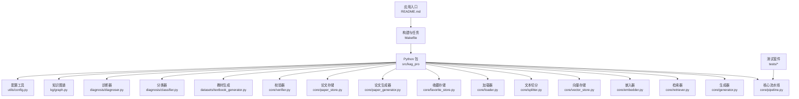
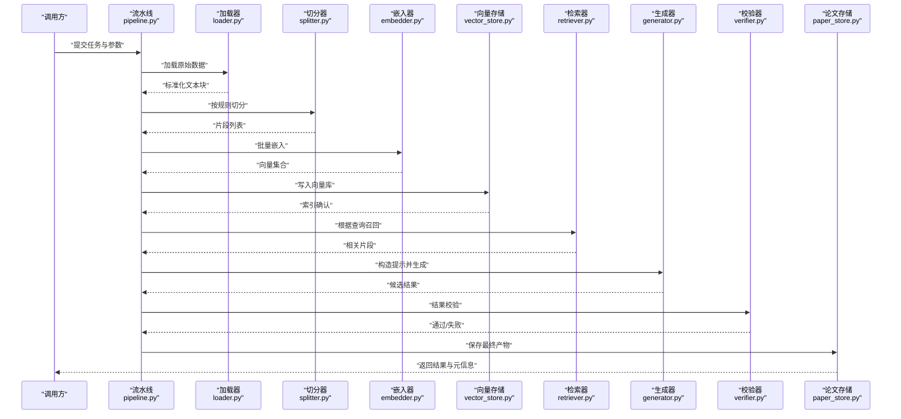
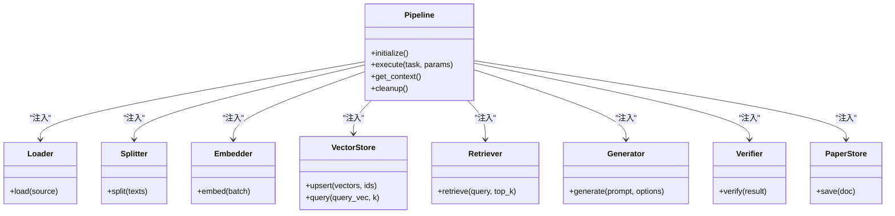
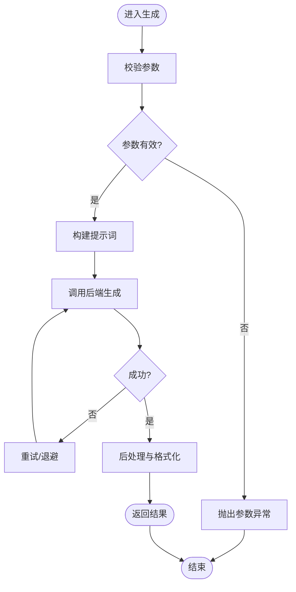
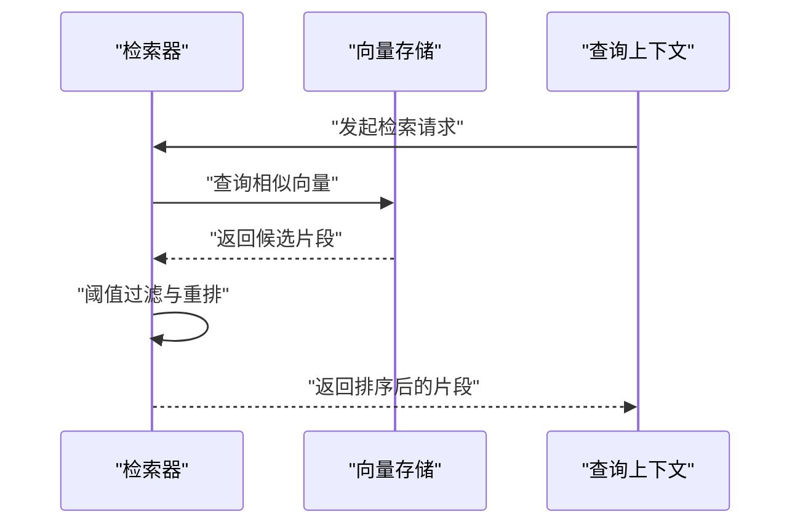
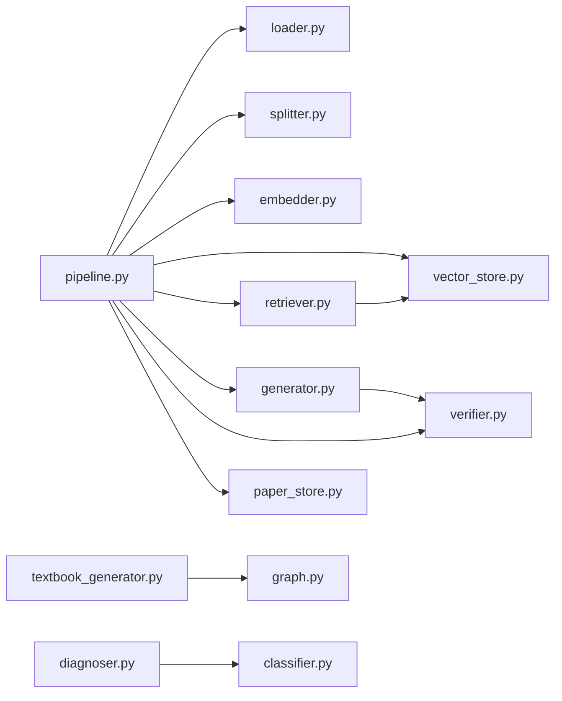

# 代码规范与约定

<cite>
**本文引用的文件**   
- [README.md](file://README.md)
- [pyproject.toml](file://pyproject.toml)
- [Makefile](file://Makefile)
- [src/kag_pro/core/pipeline.py](file://src/kag_pro/core/pipeline.py)
- [src/kag_pro/core/generator.py](file://src/kag_pro/core/generator.py)
- [src/kag_pro/core/retriever.py](file://src/kag_pro/core/retriever.py)
- [src/kag_pro/core/embedder.py](file://src/kag_pro/core/embedder.py)
- [src/kag_pro/core/vector_store.py](file://src/kag_pro/core/vector_store.py)
- [src/kag_pro/core/splitter.py](file://src/kag_pro/core/splitter.py)
- [src/kag_pro/core/loader.py](file://src/kag_pro/core/loader.py)
- [src/kag_pro/core/favorite_store.py](file://src/kag_pro/core/favorite_store.py)
- [src/kag_pro/core/paper_generator.py](file://src/kag_pro/core/paper_generator.py)
- [src/kag_pro/core/paper_store.py](file://src/kag_pro/core/paper_store.py)
- [src/kag_pro/core/verifier.py](file://src/kag_pro/core/verifier.py)
- [src/kag_pro/datasets/textbook_generator.py](file://src/kag_pro/datasets/textbook_generator.py)
- [src/kag_pro/diagnosis/classifier.py](file://src/kag_pro/diagnosis/classifier.py)
- [src/kag_pro/diagnosis/diagnoser.py](file://src/kag_pro/diagnosis/diagnoser.py)
- [src/kag_pro/kg/graph.py](file://src/kag_pro/kg/graph.py)
- [src/kag_pro/utils/config.py](file://src/kag_pro/utils/config.py)
- [tests/test_pipeline.py](file://tests/test_pipeline.py)
</cite>

## 目录
1. [简介](#简介)
2. [项目结构](#项目结构)
3. [核心组件](#核心组件)
4. [架构总览](#架构总览)
5. [详细组件分析](#详细组件分析)
6. [依赖关系分析](#依赖关系分析)
7. [性能考虑](#性能考虑)
8. [故障排查指南](#故障排查指南)
9. [结论](#结论)
10. [附录](#附录)

## 简介
本文件为 KAG-Pro 项目的代码规范与编程约定，目标是在团队内统一 Python 编码风格、注释与文档标准、模块设计原则、错误处理策略，以及质量检查与代码审查流程。规范覆盖 PEP8 遵循、命名规则、缩进与格式、文档字符串与行内注释、API 文档编写、单一职责与依赖注入、接口抽象、异常类型定义、日志与调试输出，以及 flake8、mypy、black 等工具的集成使用。

## 项目结构
KAG-Pro 采用分层与按功能域组织相结合的结构：
- src/kag_pro：核心源码包，包含 core（流水线与生成）、datasets（数据与教材生成）、diagnosis（诊断与推荐）、kg（知识图谱）、stage（阶段检测）、utils（工具）等子包。
- tests：单元测试与集成测试。
- frontend：前端辅助脚本与服务。
- notebooks：原型实验。
- data：外部数据与向量数据库存储。
- pyproject.toml：项目元数据与依赖管理。
- Makefile：常用任务命令封装。

图表来源
- [README.md](file://README.md)
- [Makefile](file://Makefile)
- [src/kag_pro/core/pipeline.py](file://src/kag_pro/core/pipeline.py)
- [src/kag_pro/core/generator.py](file://src/kag_pro/core/generator.py)
- [src/kag_pro/core/retriever.py](file://src/kag_pro/core/retriever.py)
- [src/kag_pro/core/embedder.py](file://src/kag_pro/core/embedder.py)
- [src/kag_pro/core/vector_store.py](file://src/kag_pro/core/vector_store.py)
- [src/kag_pro/core/splitter.py](file://src/kag_pro/core/splitter.py)
- [src/kag_pro/core/loader.py](file://src/kag_pro/core/loader.py)
- [src/kag_pro/core/favorite_store.py](file://src/kag_pro/core/favorite_store.py)
- [src/kag_pro/core/paper_generator.py](file://src/kag_pro/core/paper_generator.py)
- [src/kag_pro/core/paper_store.py](file://src/kag_pro/core/paper_store.py)
- [src/kag_pro/core/verifier.py](file://src/kag_pro/core/verifier.py)
- [src/kag_pro/datasets/textbook_generator.py](file://src/kag_pro/datasets/textbook_generator.py)
- [src/kag_pro/diagnosis/classifier.py](file://src/kag_pro/diagnosis/classifier.py)
- [src/kag_pro/diagnosis/diagnoser.py](file://src/kag_pro/diagnosis/diagnoser.py)
- [src/kag_pro/kg/graph.py](file://src/kag_pro/kg/graph.py)
- [src/kag_pro/utils/config.py](file://src/kag_pro/utils/config.py)
- [tests/test_pipeline.py](file://tests/test_pipeline.py)

章节来源
- [README.md](file://README.md)
- [pyproject.toml](file://pyproject.toml)
- [Makefile](file://Makefile)

## 核心组件
- 流水线编排：负责串联加载、切分、嵌入、检索、生成、验证等步骤，提供统一的执行入口与上下文传递。
- 生成器：基于提示词或模板进行内容生成，支持多种输出格式与参数控制。
- 检索器：从向量库或知识库中召回相关片段，支持相似度阈值与重排策略。
- 嵌入器：将文本转换为向量表示，支持多模型与批量处理。
- 向量存储：封装向量数据库的增删改查与索引维护。
- 文本切分：按段落、句子或自定义规则对长文本进行切分。
- 加载器：读取本地或远程数据源，统一输入格式。
- 收藏与论文存储：持久化用户收藏与生成的论文资源。
- 校验器：对生成结果进行一致性、完整性与合规性校验。
- 教材生成：面向教学场景的数据与内容生成管线。
- 诊断与分类：学习诊断、能力评估与推荐。
- 知识图谱：图结构与查询操作封装。
- 配置工具：集中管理环境变量、配置文件与默认值。

章节来源
- [src/kag_pro/core/pipeline.py](file://src/kag_pro/core/pipeline.py)
- [src/kag_pro/core/generator.py](file://src/kag_pro/core/generator.py)
- [src/kag_pro/core/retriever.py](file://src/kag_pro/core/retriever.py)
- [src/kag_pro/core/embedder.py](file://src/kag_pro/core/embedder.py)
- [src/kag_pro/core/vector_store.py](file://src/kag_pro/core/vector_store.py)
- [src/kag_pro/core/splitter.py](file://src/kag_pro/core/splitter.py)
- [src/kag_pro/core/loader.py](file://src/kag_pro/core/loader.py)
- [src/kag_pro/core/favorite_store.py](file://src/kag_pro/core/favorite_store.py)
- [src/kag_pro/core/paper_generator.py](file://src/kag_pro/core/paper_generator.py)
- [src/kag_pro/core/paper_store.py](file://src/kag_pro/core/paper_store.py)
- [src/kag_pro/core/verifier.py](file://src/kag_pro/core/verifier.py)
- [src/kag_pro/datasets/textbook_generator.py](file://src/kag_pro/datasets/textbook_generator.py)
- [src/kag_pro/diagnosis/classifier.py](file://src/kag_pro/diagnosis/classifier.py)
- [src/kag_pro/diagnosis/diagnoser.py](file://src/kag_pro/diagnosis/diagnoser.py)
- [src/kag_pro/kg/graph.py](file://src/kag_pro/kg/graph.py)
- [src/kag_pro/utils/config.py](file://src/kag_pro/utils/config.py)

## 架构总览
KAG-Pro 的核心架构围绕“数据入站—处理—检索—生成—校验—存储”的流水线展开，各组件通过清晰的接口交互，便于替换实现与扩展。

图表来源
- [src/kag_pro/core/pipeline.py](file://src/kag_pro/core/pipeline.py)
- [src/kag_pro/core/loader.py](file://src/kag_pro/core/loader.py)
- [src/kag_pro/core/splitter.py](file://src/kag_pro/core/splitter.py)
- [src/kag_pro/core/embedder.py](file://src/kag_pro/core/embedder.py)
- [src/kag_pro/core/vector_store.py](file://src/kag_pro/core/vector_store.py)
- [src/kag_pro/core/retriever.py](file://src/kag_pro/core/retriever.py)
- [src/kag_pro/core/generator.py](file://src/kag_pro/core/generator.py)
- [src/kag_pro/core/verifier.py](file://src/kag_pro/core/verifier.py)
- [src/kag_pro/core/paper_store.py](file://src/kag_pro/core/paper_store.py)

## 详细组件分析

### 流水线组件（Pipeline）
- 职责：编排数据处理与生成流程，管理上下文对象，协调各阶段状态与错误传播。
- 设计要点：
  - 单一职责：仅负责流程编排与生命周期管理，不直接实现业务逻辑。
  - 依赖注入：通过构造函数或方法参数注入加载器、切分器、嵌入器、检索器、生成器、校验器与存储。
  - 接口抽象：对外暴露统一的任务提交与结果获取接口。
- 关键流程：
  - 初始化阶段：加载配置、建立连接、准备缓存。
  - 执行阶段：顺序或并行执行各阶段，记录中间状态。
  - 收尾阶段：清理资源、持久化结果、上报指标。

图表来源
- [src/kag_pro/core/pipeline.py](file://src/kag_pro/core/pipeline.py)
- [src/kag_pro/core/loader.py](file://src/kag_pro/core/loader.py)
- [src/kag_pro/core/splitter.py](file://src/kag_pro/core/splitter.py)
- [src/kag_pro/core/embedder.py](file://src/kag_pro/core/embedder.py)
- [src/kag_pro/core/vector_store.py](file://src/kag_pro/core/vector_store.py)
- [src/kag_pro/core/retriever.py](file://src/kag_pro/core/retriever.py)
- [src/kag_pro/core/generator.py](file://src/kag_pro/core/generator.py)
- [src/kag_pro/core/verifier.py](file://src/kag_pro/core/verifier.py)
- [src/kag_pro/core/paper_store.py](file://src/kag_pro/core/paper_store.py)

章节来源
- [src/kag_pro/core/pipeline.py](file://src/kag_pro/core/pipeline.py)

### 生成器组件（Generator）
- 职责：根据上下文与提示词生成内容，支持多种后端与参数组合。
- 设计要点：
  - 可插拔后端：通过接口抽象支持不同大模型或模板引擎。
  - 参数校验：在入口处对温度、最大长度、采样策略等进行校验。
  - 重试与退避：对网络或服务不可用场景提供重试机制。
- 错误处理：
  - 明确区分参数错误、服务错误与超时错误。
  - 记录必要上下文以便复现问题。

图表来源
- [src/kag_pro/core/generator.py](file://src/kag_pro/core/generator.py)

章节来源
- [src/kag_pro/core/generator.py](file://src/kag_pro/core/generator.py)

### 检索器组件（Retriever）
- 职责：根据查询向量召回相关片段，支持阈值过滤与重排。
- 设计要点：
  - 与向量存储解耦：通过接口访问底层存储。
  - 可配置召回数量与相似度阈值。
  - 支持多路召回与融合策略。
- 性能优化：
  - 批量查询与缓存热点查询结果。
  - 合理设置 top_k 与阈值以平衡精度与延迟。

图表来源
- [src/kag_pro/core/retriever.py](file://src/kag_pro/core/retriever.py)
- [src/kag_pro/core/vector_store.py](file://src/kag_pro/core/vector_store.py)

章节来源
- [src/kag_pro/core/retriever.py](file://src/kag_pro/core/retriever.py)
- [src/kag_pro/core/vector_store.py](file://src/kag_pro/core/vector_store.py)

### 嵌入器组件（Embedder）
- 职责：将文本批量转换为向量，支持模型切换与批大小调优。
- 设计要点：
  - 批处理：减少模型调用开销。
  - 并发控制：限制并发度以避免资源耗尽。
  - 错误隔离：单个样本失败不影响整批处理。
- 性能建议：
  - 根据硬件与模型特性调整 batch_size。
  - 启用内存映射或预取以提升吞吐。

章节来源
- [src/kag_pro/core/embedder.py](file://src/kag_pro/core/embedder.py)

### 文本切分器（Splitter）
- 职责：按段落、句子或自定义规则切分长文本，保证语义完整性。
- 设计要点：
  - 可配置切分粒度与最小长度。
  - 保留必要的元信息（如标题、页码）。
  - 支持增量更新时的局部切分。

章节来源
- [src/kag_pro/core/splitter.py](file://src/kag_pro/core/splitter.py)

### 加载器（Loader）
- 职责：统一读取本地与远程数据源，输出标准化数据结构。
- 设计要点：
  - 支持多种格式（文本、CSV、JSON 等）。
  - 错误时返回明确的异常类型与上下文。
  - 提供进度回调与断点续传。

章节来源
- [src/kag_pro/core/loader.py](file://src/kag_pro/core/loader.py)

### 收藏与论文存储（FavoriteStore / PaperStore）
- 职责：持久化用户收藏与论文资源，提供增删改查与版本管理。
- 设计要点：
  - 原子写入与事务保障。
  - 冲突解决策略（合并或覆盖）。
  - 审计日志与回滚支持。

章节来源
- [src/kag_pro/core/favorite_store.py](file://src/kag_pro/core/favorite_store.py)
- [src/kag_pro/core/paper_store.py](file://src/kag_pro/core/paper_store.py)

### 论文生成器（PaperGenerator）
- 职责：面向学术产出的结构化生成，包括摘要、正文与参考文献。
- 设计要点：
  - 模板驱动与提示工程结合。
  - 多轮生成与迭代优化。
  - 与校验器协作确保格式与引用规范。

章节来源
- [src/kag_pro/core/paper_generator.py](file://src/kag_pro/core/paper_generator.py)

### 校验器（Verifier）
- 职责：对生成结果进行一致性、完整性与合规性检查。
- 设计要点：
  - 规则引擎与启发式检查结合。
  - 可插拔校验规则集。
  - 输出详细的失败原因与建议修复。

章节来源
- [src/kag_pro/core/verifier.py](file://src/kag_pro/core/verifier.py)

### 教材生成（TextbookGenerator）
- 职责：面向教学场景的内容生成，适配课程大纲与知识点。
- 设计要点：
  - 与知识图谱联动，确保知识点覆盖。
  - 难度分级与循序渐进结构。
  - 评测指标与反馈闭环。

章节来源
- [src/kag_pro/datasets/textbook_generator.py](file://src/kag_pro/datasets/textbook_generator.py)

### 诊断与分类（Diagnoser / Classifier）
- 职责：学习者能力诊断与分类，提供个性化推荐。
- 设计要点：
  - 特征工程与模型选择可配置。
  - 在线学习与离线训练分离。
  - 公平性与偏差检测。

章节来源
- [src/kag_pro/diagnosis/diagnoser.py](file://src/kag_pro/diagnosis/diagnoser.py)
- [src/kag_pro/diagnosis/classifier.py](file://src/kag_pro/diagnosis/classifier.py)

### 知识图谱（Graph）
- 职责：图结构的构建、查询与维护。
- 设计要点：
  - 节点与边类型定义清晰。
  - 支持路径查询与子图提取。
  - 与检索器协同提升召回质量。

章节来源
- [src/kag_pro/kg/graph.py](file://src/kag_pro/kg/graph.py)

### 配置工具（Config）
- 职责：集中管理环境变量、配置文件与默认值。
- 设计要点：
  - 强类型校验与默认值回退。
  - 敏感信息加密与脱敏。
  - 运行时热重载支持。

章节来源
- [src/kag_pro/utils/config.py](file://src/kag_pro/utils/config.py)

## 依赖关系分析
- 内部依赖：
  - 流水线依赖所有核心组件，形成松耦合的组合关系。
  - 生成器与检索器共享嵌入与向量存储能力。
  - 诊断与分类模块可与知识图谱和教材生成模块协作。
- 外部依赖：
  - 向量数据库、大模型 API、文件系统与网络服务。
- 潜在风险：
  - 循环导入需避免，必要时使用延迟导入或重构模块边界。
  - 第三方库升级需关注兼容性矩阵与迁移指南。

图表来源
- [src/kag_pro/core/pipeline.py](file://src/kag_pro/core/pipeline.py)
- [src/kag_pro/core/loader.py](file://src/kag_pro/core/loader.py)
- [src/kag_pro/core/splitter.py](file://src/kag_pro/core/splitter.py)
- [src/kag_pro/core/embedder.py](file://src/kag_pro/core/embedder.py)
- [src/kag_pro/core/vector_store.py](file://src/kag_pro/core/vector_store.py)
- [src/kag_pro/core/retriever.py](file://src/kag_pro/core/retriever.py)
- [src/kag_pro/core/generator.py](file://src/kag_pro/core/generator.py)
- [src/kag_pro/core/verifier.py](file://src/kag_pro/core/verifier.py)
- [src/kag_pro/core/paper_store.py](file://src/kag_pro/core/paper_store.py)
- [src/kag_pro/datasets/textbook_generator.py](file://src/kag_pro/datasets/textbook_generator.py)
- [src/kag_pro/diagnosis/diagnoser.py](file://src/kag_pro/diagnosis/diagnoser.py)
- [src/kag_pro/diagnosis/classifier.py](file://src/kag_pro/diagnosis/classifier.py)
- [src/kag_pro/kg/graph.py](file://src/kag_pro/kg/graph.py)

章节来源
- [src/kag_pro/core/pipeline.py](file://src/kag_pro/core/pipeline.py)
- [src/kag_pro/core/generator.py](file://src/kag_pro/core/generator.py)
- [src/kag_pro/core/retriever.py](file://src/kag_pro/core/retriever.py)
- [src/kag_pro/core/embedder.py](file://src/kag_pro/core/embedder.py)
- [src/kag_pro/core/vector_store.py](file://src/kag_pro/core/vector_store.py)
- [src/kag_pro/core/splitter.py](file://src/kag_pro/core/splitter.py)
- [src/kag_pro/core/loader.py](file://src/kag_pro/core/loader.py)
- [src/kag_pro/core/favorite_store.py](file://src/kag_pro/core/favorite_store.py)
- [src/kag_pro/core/paper_generator.py](file://src/kag_pro/core/paper_generator.py)
- [src/kag_pro/core/paper_store.py](file://src/kag_pro/core/paper_store.py)
- [src/kag_pro/core/verifier.py](file://src/kag_pro/core/verifier.py)
- [src/kag_pro/datasets/textbook_generator.py](file://src/kag_pro/datasets/textbook_generator.py)
- [src/kag_pro/diagnosis/classifier.py](file://src/kag_pro/diagnosis/classifier.py)
- [src/kag_pro/diagnosis/diagnoser.py](file://src/kag_pro/diagnosis/diagnoser.py)
- [src/kag_pro/kg/graph.py](file://src/kag_pro/kg/graph.py)
- [src/kag_pro/utils/config.py](file://src/kag_pro/utils/config.py)

## 性能考虑
- 批处理与并发：
  - 嵌入与检索尽量使用批量接口，合理设置并发度。
  - 避免在高频路径中进行阻塞 I/O。
- 缓存与复用：
  - 缓存热点查询结果与嵌入向量。
  - 重用连接与模型实例。
- 资源监控：
  - 记录关键指标（耗时、吞吐、错误率）。
  - 设置超时与熔断策略。
- 存储优化：
  - 选择合适的向量维度与索引算法。
  - 定期重建索引与清理过期数据。

## 故障排查指南
- 常见问题定位：
  - 参数错误：检查生成器与检索器的参数校验与默认值。
  - 服务不可用：查看重试与退避策略是否生效。
  - 数据不一致：核对加载器与切分器的输出格式。
- 日志与调试：
  - 使用结构化日志记录关键事件与上下文。
  - 开启调试模式输出详细堆栈与中间状态。
- 测试回归：
  - 针对关键路径编写单测与集成测试。
  - 使用测试夹具模拟外部依赖。

章节来源
- [tests/test_pipeline.py](file://tests/test_pipeline.py)

## 结论
本规范旨在为 KAG-Pro 提供一致的编码风格、清晰的模块边界、稳健的错误处理与高效的性能实践。通过引入质量检查工具与代码审查清单，可在日常开发中持续保持代码质量与可维护性。

## 附录

### Python 编码标准与命名规则
- 遵循 PEP8：
  - 缩进：4 空格；行长不超过 88 字符（与 black 一致）。
  - 空行：模块级函数之间两个空行，类方法之间一个空行。
  - 导入顺序：标准库、第三方库、本地包，每组之间空一行。
- 命名规则：
  - 变量与函数：小写加下划线（snake_case）。
  - 类名：大驼峰（PascalCase）。
  - 常量：全大写加下划线（UPPER_SNAKE_CASE）。
  - 模块名：短横线或小写下划线均可，但需保持一致。
- 类型注解：
  - 为公共接口与方法签名添加类型注解。
  - 使用 typing 模块中的泛型与联合类型。

### 注释与文档规范
- 文档字符串（Docstring）：
  - 使用三引号，首行概述，第二行空行，随后详细描述参数、返回值与异常。
  - 参考 Google 或 NumPy 风格，保持团队一致。
- 行内注释：
  - 解释复杂逻辑与决策依据，避免重复显而易见的代码。
  - 使用 TODO/FIXME/HACK 标记待办事项。
- API 文档：
  - 自动生成 API 文档，确保与代码同步更新。
  - 提供示例用法与错误处理说明。

### 模块设计原则
- 单一职责：每个模块只承担一个明确职责。
- 依赖注入：通过构造函数或工厂注入依赖，降低耦合。
- 接口抽象：定义清晰的接口，便于替换实现与测试。
- 开闭原则：对扩展开放，对修改封闭。

### 错误处理策略
- 异常类型定义：
  - 自定义业务异常基类，派生具体异常类型。
  - 区分参数错误、服务错误、超时与网络错误。
- 错误日志记录：
  - 记录错误级别、消息、堆栈与上下文。
  - 避免记录敏感信息。
- 调试信息输出：
  - 使用 logger 而非 print。
  - 提供调试开关与采样策略。

### 代码审查清单
- 风格与可读性：
  - 是否符合 PEP8 与 black 格式化。
  - 命名是否清晰、一致。
- 正确性与健壮性：
  - 是否处理边界条件与异常。
  - 是否有足够的单元测试与集成测试。
- 性能与安全：
  - 是否存在不必要的 I/O 或计算。
  - 是否避免硬编码敏感信息与 SQL 注入风险。
- 文档与可维护性：
  - 是否更新文档字符串与 README。
  - 变更是否影响现有接口与行为。

### 质量检查工具配置与集成
- flake8：
  - 启用主要规则集，忽略无关项。
  - 在 CI 中作为必检项。
- mypy：
  - 严格模式，逐步完善类型注解。
  - 允许部分忽略，但需记录原因。
- black：
  - 统一代码格式，提交前自动格式化。
- 集成方式：
  - 在 Makefile 中封装 lint、format、type-check 任务。
  - 在 pre-commit 钩子中运行检查。
  - 在 CI 流水线中集成报告与阻断策略。

章节来源
- [pyproject.toml](file://pyproject.toml)
- [Makefile](file://Makefile)