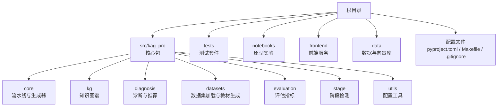
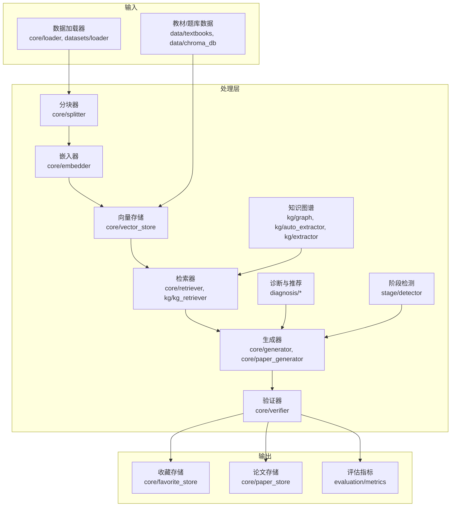
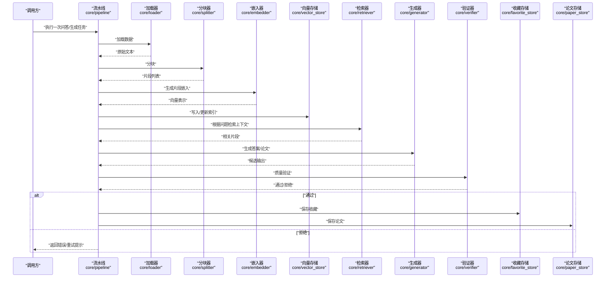
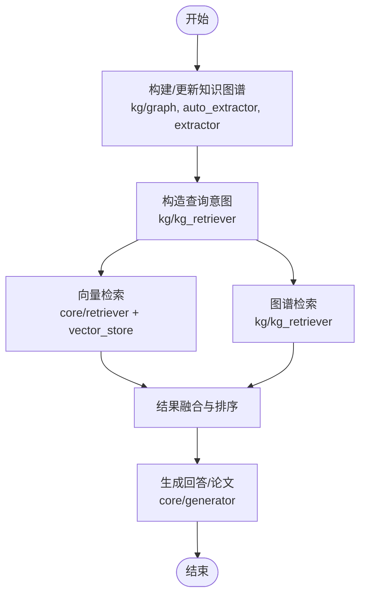
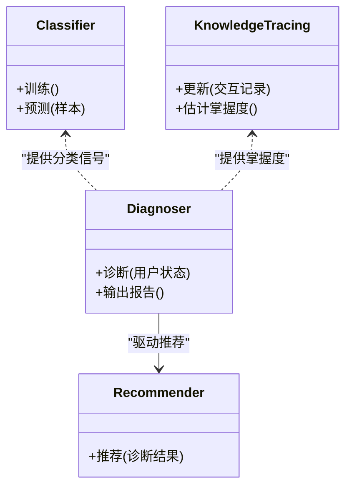
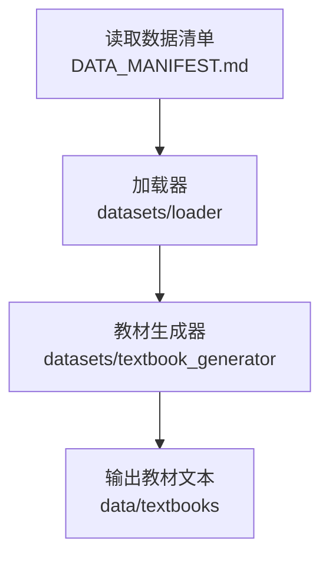
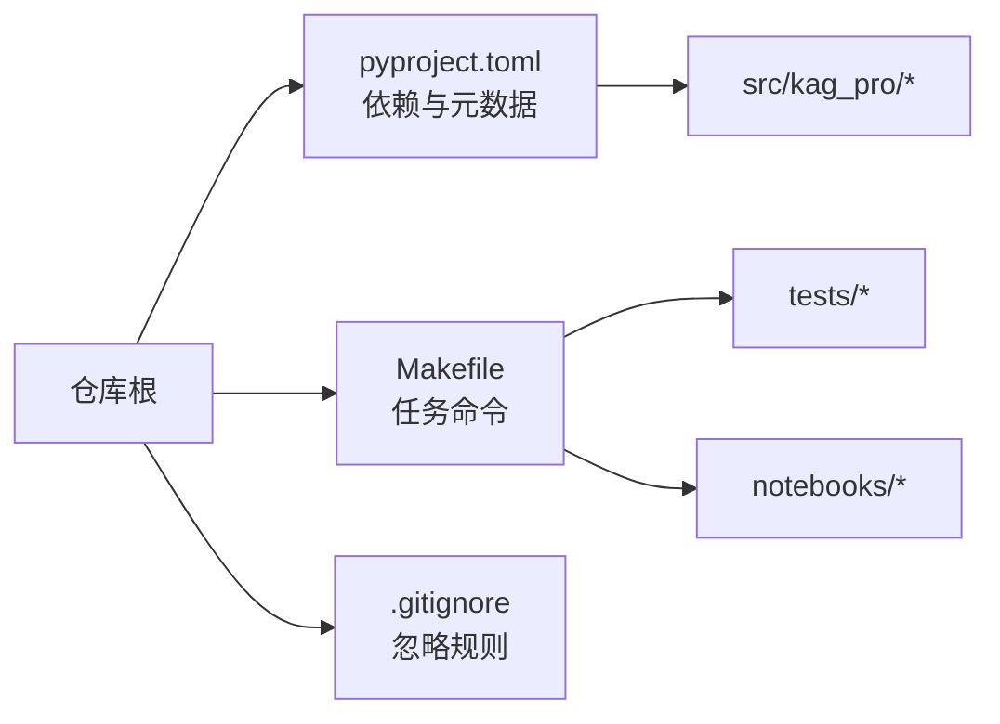

# 开发指南

<cite>
**本文引用的文件**   
- [README.md](file://README.md)
- [pyproject.toml](file://pyproject.toml)
- [Makefile](file://Makefile)
- [.gitignore](file://.gitignore)
- [DATA_MANIFEST.md](file://DATA_MANIFEST.md)
- [src/kag_pro/__init__.py](file://src/kag_pro/__init__.py)
- [src/kag_pro/core/pipeline.py](file://src/kag_pro/core/pipeline.py)
- [src/kag_pro/core/generator.py](file://src/kag_pro/core/generator.py)
- [src/kag_pro/core/retriever.py](file://src/kag_pro/core/retriever.py)
- [src/kag_pro/core/embedder.py](file://src/kag_pro/core/embedder.py)
- [src/kag_pro/core/vector_store.py](file://src/kag_pro/core/vector_store.py)
- [src/kag_pro/core/splitter.py](file://src/kag_pro/core/splitter.py)
- [src/kag_pro/core/loader.py](file://src/kag_pro/core/loader.py)
- [src/kag_pro/core/favorite_store.py](file://src/kag_pro/core/favorite_store.py)
- [src/kag_pro/core/paper_generator.py](file://src/kag_pro/core/paper_generator.py)
- [src/kag_pro/core/paper_store.py](file://src/kag_pro/core/paper_store.py)
- [src/kag_pro/core/verifier.py](file://src/kag_pro/core/verifier.py)
- [src/kag_pro/datasets/__init__.py](file://src/kag_pro/datasets/__init__.py)
- [src/kag_pro/datasets/loader.py](file://src/kag_pro/datasets/loader.py)
- [src/kag_pro/datasets/textbook_generator.py](file://src/kag_pro/datasets/textbook_generator.py)
- [src/kag_pro/kg/graph.py](file://src/kag_pro/kg/graph.py)
- [src/kag_pro/kg/auto_extractor.py](file://src/kag_pro/kg/auto_extractor.py)
- [src/kag_pro/kg/extractor.py](file://src/kag_pro/kg/extractor.py)
- [src/kag_pro/kg/kg_retriever.py](file://src/kag_pro/kg/kg_retriever.py)
- [src/kag_pro/diagnosis/classifier.py](file://src/kag_pro/diagnosis/classifier.py)
- [src/kag_pro/diagnosis/diagnoser.py](file://src/kag_pro/diagnosis/diagnoser.py)
- [src/kag_pro/diagnosis/knowledge_tracing.py](file://src/kag_pro/diagnosis/knowledge_tracing.py)
- [src/kag_pro/diagnosis/recommender.py](file://src/kag_pro/diagnosis/recommender.py)
- [src/kag_pro/evaluation/metrics.py](file://src/kag_pro/evaluation/metrics.py)
- [src/kag_pro/stage/detector.py](file://src/kag_pro/stage/detector.py)
- [src/kag_pro/utils/config.py](file://src/kag_pro/utils/config.py)
- [tests/test_pipeline.py](file://tests/test_pipeline.py)
- [tests/test_splitter.py](file://tests/test_splitter.py)
- [tests/test_retriever.py](file://tests/test_retriever.py)
- [tests/test_diagnoser.py](file://tests/test_diagnoser.py)
- [tests/test_classifier.py](file://tests/test_classifier.py)
- [tests/test_stage.py](file://tests/test_stage.py)
- [notebooks/00_rag_prototype.ipynb](file://notebooks/00_rag_prototype.ipynb)
- [frontend/server.py](file://frontend/server.py)
</cite>

## 目录
1. [简介](#简介)
2. [项目结构](#项目结构)
3. [核心组件](#核心组件)
4. [架构总览](#架构总览)
5. [详细组件分析](#详细组件分析)
6. [依赖分析](#依赖分析)
7. [性能考虑](#性能考虑)
8. [故障排除指南](#故障排除指南)
9. [结论](#结论)
10. [附录](#附录)

## 简介
本指南面向KAG-Pro项目的开发者，覆盖从环境搭建、代码规范、测试策略、Jupyter原型开发、贡献流程到调试与排障的完整工作流。文档基于仓库现有结构与源码组织进行说明，帮助新成员快速上手并高效协作。

## 项目结构
仓库采用“功能域+分层”的组织方式：
- src/kag_pro：核心Python包，按领域划分core、kg、diagnosis、datasets、evaluation、stage、utils等子模块
- tests：单元测试与集成测试用例
- notebooks：Jupyter原型实验
- frontend：前端服务脚本（用于本地演示）
- data：数据与向量数据库持久化目录
- pyproject.toml：项目元数据与依赖声明
- Makefile：常用任务命令封装
- .gitignore：忽略规则
- DATA_MANIFEST.md：数据清单说明
- README.md：项目概览与使用说明

**章节来源**
- [README.md](file://README.md)
- [pyproject.toml](file://pyproject.toml)
- [Makefile](file://Makefile)
- [.gitignore](file://.gitignore)
- [DATA_MANIFEST.md](file://DATA_MANIFEST.md)

## 核心组件
- 核心流水线（core/pipeline）：编排数据加载、分块、检索、生成与验证等步骤，提供统一的调用入口
- 生成器（core/generator、core/paper_generator）：负责文本与论文内容的生成逻辑
- 检索器（core/retriever、kg/kg_retriever）：结合向量检索与知识图谱检索
- 嵌入器（core/embedder）：文本向量化接口
- 向量存储（core/vector_store）：向量索引与查询
- 分块器（core/splitter）：长文本切分为可检索片段
- 加载器（core/loader、datasets/loader）：统一数据读取与预处理
- 收藏与论文存储（core/favorite_store、core/paper_store）：结果持久化
- 验证器（core/verifier）：输出质量校验与过滤
- 诊断与推荐（diagnosis/*）：学习者画像、知识追踪与个性化推荐
- 评估指标（evaluation/metrics）：通用评测度量
- 阶段检测（stage/detector）：学习阶段识别
- 配置工具（utils/config）：集中式配置管理

**章节来源**
- [src/kag_pro/core/pipeline.py](file://src/kag_pro/core/pipeline.py)
- [src/kag_pro/core/generator.py](file://src/kag_pro/core/generator.py)
- [src/kag_pro/core/retriever.py](file://src/kag_pro/core/retriever.py)
- [src/kag_pro/core/embedder.py](file://src/kag_pro/core/embedder.py)
- [src/kag_pro/core/vector_store.py](file://src/kag_pro/core/vector_store.py)
- [src/kag_pro/core/splitter.py](file://src/kag_pro/core/splitter.py)
- [src/kag_pro/core/loader.py](file://src/kag_pro/core/loader.py)
- [src/kag_pro/core/favorite_store.py](file://src/kag_pro/core/favorite_store.py)
- [src/kag_pro/core/paper_generator.py](file://src/kag_pro/core/paper_generator.py)
- [src/kag_pro/core/paper_store.py](file://src/kag_pro/core/paper_store.py)
- [src/kag_pro/core/verifier.py](file://src/kag_pro/core/verifier.py)
- [src/kag_pro/diagnosis/classifier.py](file://src/kag_pro/diagnosis/classifier.py)
- [src/kag_pro/diagnosis/diagnoser.py](file://src/kag_pro/diagnosis/diagnoser.py)
- [src/kag_pro/diagnosis/knowledge_tracing.py](file://src/kag_pro/diagnosis/knowledge_tracing.py)
- [src/kag_pro/diagnosis/recommender.py](file://src/kag_pro/diagnosis/recommender.py)
- [src/kag_pro/evaluation/metrics.py](file://src/kag_pro/evaluation/metrics.py)
- [src/kag_pro/stage/detector.py](file://src/kag_pro/stage/detector.py)
- [src/kag_pro/utils/config.py](file://src/kag_pro/utils/config.py)

## 架构总览
KAG-Pro以“数据→检索→生成→验证→存储”为主线，结合知识图谱增强检索与诊断推荐能力。

**图表来源**
- [src/kag_pro/core/pipeline.py](file://src/kag_pro/core/pipeline.py)
- [src/kag_pro/core/loader.py](file://src/kag_pro/core/loader.py)
- [src/kag_pro/core/splitter.py](file://src/kag_pro/core/splitter.py)
- [src/kag_pro/core/embedder.py](file://src/kag_pro/core/embedder.py)
- [src/kag_pro/core/vector_store.py](file://src/kag_pro/core/vector_store.py)
- [src/kag_pro/core/retriever.py](file://src/kag_pro/core/retriever.py)
- [src/kag_pro/kg/kg_retriever.py](file://src/kag_pro/kg/kg_retriever.py)
- [src/kag_pro/kg/graph.py](file://src/kag_pro/kg/graph.py)
- [src/kag_pro/kg/auto_extractor.py](file://src/kag_pro/kg/auto_extractor.py)
- [src/kag_pro/kg/extractor.py](file://src/kag_pro/kg/extractor.py)
- [src/kag_pro/core/generator.py](file://src/kag_pro/core/generator.py)
- [src/kag_pro/core/paper_generator.py](file://src/kag_pro/core/paper_generator.py)
- [src/kag_pro/diagnosis/diagnoser.py](file://src/kag_pro/diagnosis/diagnoser.py)
- [src/kag_pro/stage/detector.py](file://src/kag_pro/stage/detector.py)
- [src/kag_pro/core/verifier.py](file://src/kag_pro/core/verifier.py)
- [src/kag_pro/core/favorite_store.py](file://src/kag_pro/core/favorite_store.py)
- [src/kag_pro/core/paper_store.py](file://src/kag_pro/core/paper_store.py)
- [src/kag_pro/evaluation/metrics.py](file://src/kag_pro/evaluation/metrics.py)

## 详细组件分析

### 核心流水线（Pipeline）
- 职责：协调数据加载、分块、嵌入、检索、生成、验证与存储；对外暴露统一执行接口
- 关键交互：
  - 通过加载器获取原始数据
  - 使用分块器将长文本切分为片段
  - 借助嵌入器与向量存储构建索引
  - 由检索器返回相关上下文
  - 生成器基于上下文产出内容
  - 验证器对输出进行质量检查
  - 最终写入收藏或论文存储
- 扩展点：可在不改动主流程的前提下替换检索器、生成器或验证器实现

**图表来源**
- [src/kag_pro/core/pipeline.py](file://src/kag_pro/core/pipeline.py)
- [src/kag_pro/core/loader.py](file://src/kag_pro/core/loader.py)
- [src/kag_pro/core/splitter.py](file://src/kag_pro/core/splitter.py)
- [src/kag_pro/core/embedder.py](file://src/kag_pro/core/embedder.py)
- [src/kag_pro/core/vector_store.py](file://src/kag_pro/core/vector_store.py)
- [src/kag_pro/core/retriever.py](file://src/kag_pro/core/retriever.py)
- [src/kag_pro/core/generator.py](file://src/kag_pro/core/generator.py)
- [src/kag_pro/core/verifier.py](file://src/kag_pro/core/verifier.py)
- [src/kag_pro/core/favorite_store.py](file://src/kag_pro/core/favorite_store.py)
- [src/kag_pro/core/paper_store.py](file://src/kag_pro/core/paper_store.py)

**章节来源**
- [src/kag_pro/core/pipeline.py](file://src/kag_pro/core/pipeline.py)

### 知识图谱与检索增强
- 知识图谱：提供实体与关系建模，支持自动抽取与手动提取
- 图谱检索：在向量检索基础上融合图谱路径与语义关联，提升召回质量
- 典型流程：图谱构建→节点/边抽取→图谱检索→与向量检索结果融合→生成

**图表来源**
- [src/kag_pro/kg/graph.py](file://src/kag_pro/kg/graph.py)
- [src/kag_pro/kg/auto_extractor.py](file://src/kag_pro/kg/auto_extractor.py)
- [src/kag_pro/kg/extractor.py](file://src/kag_pro/kg/extractor.py)
- [src/kag_pro/kg/kg_retriever.py](file://src/kag_pro/kg/kg_retriever.py)
- [src/kag_pro/core/retriever.py](file://src/kag_pro/core/retriever.py)
- [src/kag_pro/core/vector_store.py](file://src/kag_pro/core/vector_store.py)
- [src/kag_pro/core/generator.py](file://src/kag_pro/core/generator.py)

**章节来源**
- [src/kag_pro/kg/graph.py](file://src/kag_pro/kg/graph.py)
- [src/kag_pro/kg/auto_extractor.py](file://src/kag_pro/kg/auto_extractor.py)
- [src/kag_pro/kg/extractor.py](file://src/kag_pro/kg/extractor.py)
- [src/kag_pro/kg/kg_retriever.py](file://src/kag_pro/kg/kg_retriever.py)

### 诊断与推荐
- 分类器：对用户行为或题目特征进行分类
- 诊断器：综合多源信号给出学习诊断
- 知识追踪：动态估计掌握度
- 推荐器：基于诊断结果推荐学习资源

**图表来源**
- [src/kag_pro/diagnosis/classifier.py](file://src/kag_pro/diagnosis/classifier.py)
- [src/kag_pro/diagnosis/diagnoser.py](file://src/kag_pro/diagnosis/diagnoser.py)
- [src/kag_pro/diagnosis/knowledge_tracing.py](file://src/kag_pro/diagnosis/knowledge_tracing.py)
- [src/kag_pro/diagnosis/recommender.py](file://src/kag_pro/diagnosis/recommender.py)

**章节来源**
- [src/kag_pro/diagnosis/classifier.py](file://src/kag_pro/diagnosis/classifier.py)
- [src/kag_pro/diagnosis/diagnoser.py](file://src/kag_pro/diagnosis/diagnoser.py)
- [src/kag_pro/diagnosis/knowledge_tracing.py](file://src/kag_pro/diagnosis/knowledge_tracing.py)
- [src/kag_pro/diagnosis/recommender.py](file://src/kag_pro/diagnosis/recommender.py)

### 数据集与教材生成
- 数据集加载：统一读取外部数据与内置教材
- 教材生成：批量生成结构化教材内容，便于后续入库与检索

**图表来源**
- [DATA_MANIFEST.md](file://DATA_MANIFEST.md)
- [src/kag_pro/datasets/loader.py](file://src/kag_pro/datasets/loader.py)
- [src/kag_pro/datasets/textbook_generator.py](file://src/kag_pro/datasets/textbook_generator.py)

**章节来源**
- [src/kag_pro/datasets/loader.py](file://src/kag_pro/datasets/loader.py)
- [src/kag_pro/datasets/textbook_generator.py](file://src/kag_pro/datasets/textbook_generator.py)
- [DATA_MANIFEST.md](file://DATA_MANIFEST.md)

## 依赖分析
- 项目依赖与版本约束集中在pyproject.toml中
- Makefile封装了常见任务（如安装、运行、测试等），便于统一入口
- .gitignore确保敏感与中间产物不被提交

**图表来源**
- [pyproject.toml](file://pyproject.toml)
- [Makefile](file://Makefile)
- [.gitignore](file://.gitignore)

**章节来源**
- [pyproject.toml](file://pyproject.toml)
- [Makefile](file://Makefile)
- [.gitignore](file://.gitignore)

## 性能考虑
- 分块粒度：合理设置分块大小，平衡检索精度与计算开销
- 向量维度与索引：选择合适嵌入模型与索引参数，兼顾召回率与延迟
- 批处理：对嵌入与检索尽量使用批处理降低I/O与模型调用次数
- 缓存：对热点查询与重复生成结果做缓存，减少重复计算
- 内存管理：避免一次性加载超大文本或全量图谱，按需分页与增量更新
- 并行：在安全范围内对独立任务启用并发，注意线程/进程安全

[本节为通用指导，无需特定文件引用]

## 故障排除指南
- 日志查看
  - 定位核心流水线与检索/生成环节的关键日志输出
  - 关注异常堆栈与警告信息，优先排查数据加载与模型初始化
- 常见问题
  - 向量库连接失败：检查本地ChromaDB路径与权限
  - 嵌入模型不可用：确认网络与API密钥配置
  - 生成结果不稳定：调整温度、Top-K等采样参数
- 诊断建议
  - 逐步关闭下游模块（如禁用图谱检索）以隔离问题
  - 使用最小复现数据与简化配置复现问题
  - 对比不同分块策略与检索阈值的影响

**章节来源**
- [src/kag_pro/core/pipeline.py](file://src/kag_pro/core/pipeline.py)
- [src/kag_pro/core/vector_store.py](file://src/kag_pro/core/vector_store.py)
- [src/kag_pro/core/retriever.py](file://src/kag_pro/core/retriever.py)
- [src/kag_pro/core/generator.py](file://src/kag_pro/core/generator.py)

## 结论
KAG-Pro以模块化设计支撑“检索增强生成”与“知识图谱增强”，并通过诊断与推荐形成闭环。遵循本指南的环境搭建、代码规范、测试与调试实践，可显著提升开发与协作效率。

[本节为总结性内容，无需特定文件引用]

## 附录

### 开发环境搭建
- Python与虚拟环境
  - 建议使用与pyproject.toml一致的Python版本
  - 创建并激活虚拟环境后，使用项目提供的依赖安装命令
- IDE配置
  - 推荐使用VS Code或PyCharm
  - 配置解释器指向虚拟环境，启用lint与格式化插件
  - 设置断点调试，优先在pipeline与retriever处下断点
- 调试工具
  - 使用pytest进行单测与覆盖率统计
  - 使用Makefile封装的命令统一执行
- 开发依赖安装
  - 参考pyproject.toml中的依赖声明
  - 使用Makefile的任务命令一键安装与运行

**章节来源**
- [pyproject.toml](file://pyproject.toml)
- [Makefile](file://Makefile)

### 代码规范与编程约定
- 命名规则
  - 模块与包名使用小写下划线
  - 类名使用大驼峰，方法与变量使用小写加下划线
- 注释标准
  - 模块级docstring说明用途与依赖
  - 函数级docstring描述参数、返回值与异常
- 文件组织结构
  - 按领域分包（core、kg、diagnosis、datasets、evaluation、stage、utils）
  - 每个模块保持单一职责，避免跨层耦合
- 配置管理
  - 使用utils/config集中管理配置项
  - 环境变量与默认值分离，便于不同环境切换

**章节来源**
- [src/kag_pro/utils/config.py](file://src/kag_pro/utils/config.py)

### 测试策略与用例编写
- 单元测试
  - 针对splitter、retriever、classifier、stage等无外部依赖或可mock的单元
  - 使用pytest组织用例，断言输入输出与边界条件
- 集成测试
  - 针对pipeline端到端流程，使用轻量数据与本地向量库
  - 控制外部依赖（如模型服务）为模拟或本地替代
- 端到端测试
  - 覆盖典型用户场景：加载数据→检索→生成→验证→存储
  - 使用固定种子与数据快照保证可重复性
- 测试命令
  - 通过Makefile统一执行测试与覆盖率统计

**章节来源**
- [tests/test_splitter.py](file://tests/test_splitter.py)
- [tests/test_retriever.py](file://tests/test_retriever.py)
- [tests/test_diagnoser.py](file://tests/test_diagnoser.py)
- [tests/test_classifier.py](file://tests/test_classifier.py)
- [tests/test_stage.py](file://tests/test_stage.py)
- [tests/test_pipeline.py](file://tests/test_pipeline.py)
- [Makefile](file://Makefile)

### Jupyter笔记本使用
- 原型开发
  - 在notebooks中进行快速实验，验证分块策略、检索阈值与生成参数
- 实验设计
  - 固定随机种子与数据切片，保证实验可复现
  - 记录关键超参与指标，便于对比
- 结果分析
  - 可视化检索命中率、生成质量与耗时
  - 导出结果至CSV或表格，纳入评估报告

**章节来源**
- [notebooks/00_rag_prototype.ipynb](file://notebooks/00_rag_prototype.ipynb)

### 贡献指南
- 分支与提交
  - 使用功能分支开发，提交信息清晰描述变更目的
  - 小步提交，避免一次性过大变更
- Pull Request流程
  - 提交前运行测试与基础检查
  - PR描述包含背景、变更点、影响范围与测试证据
- 代码审查标准
  - 可读性与可维护性优先
  - 新增模块需补充docstring与必要测试
  - 避免引入新的全局状态与硬编码配置

[本节为通用流程说明，无需特定文件引用]

### 调试技巧与故障排除
- 日志查看
  - 在关键路径打印结构化日志（时间戳、模块、请求ID）
  - 区分info/warn/error级别，便于过滤
- 性能分析
  - 使用性能剖析工具定位热点函数
  - 关注I/O瓶颈与模型调用延迟
- 内存泄漏检测
  - 监控长生命周期对象与缓存增长
  - 及时释放临时大对象与关闭外部连接

**章节来源**
- [src/kag_pro/core/pipeline.py](file://src/kag_pro/core/pipeline.py)
- [src/kag_pro/core/vector_store.py](file://src/kag_pro/core/vector_store.py)

### 新模块开发指导
- 模块设计原则
  - 单一职责、低耦合、高内聚
  - 通过接口抽象替换具体实现，便于测试与扩展
- 接口定义
  - 明确输入输出类型与异常契约
  - 提供默认实现与可选参数
- 文档编写要求
  - 模块docstring说明用途、依赖与示例
  - 关键方法添加参数与返回值说明
  - 在README或内部Wiki补充架构图与流程图

**章节来源**
- [src/kag_pro/core/pipeline.py](file://src/kag_pro/core/pipeline.py)
- [src/kag_pro/utils/config.py](file://src/kag_pro/utils/config.py)

### 自动化脚本与工具链
- Makefile任务
  - 封装安装、运行、测试、清理等常用命令
  - 统一入口，减少环境差异带来的问题
- 前端服务
  - 使用frontend/server.py启动本地演示服务
- 数据清单
  - 依据DATA_MANIFEST.md准备与校验数据

**章节来源**
- [Makefile](file://Makefile)
- [frontend/server.py](file://frontend/server.py)
- [DATA_MANIFEST.md](file://DATA_MANIFEST.md)