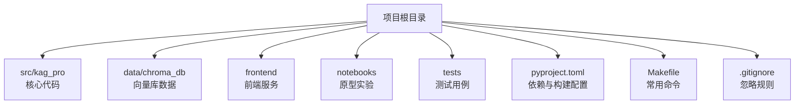
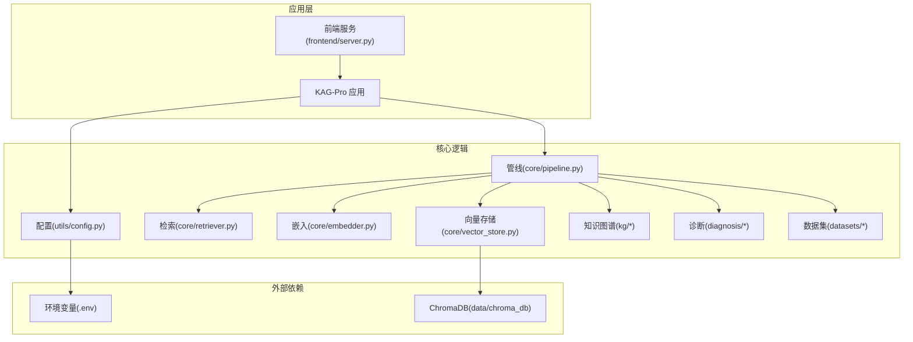
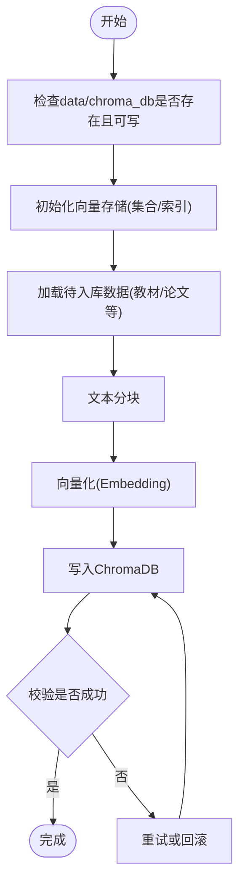
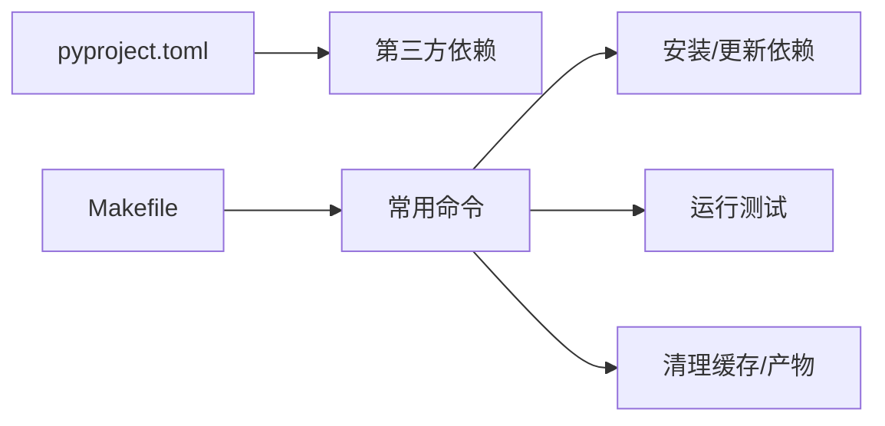

# 开发环境搭建

<cite>
**本文引用的文件**   
- [README.md](file://README.md)
- [pyproject.toml](file://pyproject.toml)
- [Makefile](file://Makefile)
- [.gitignore](file://.gitignore)
- [src/kag_pro/utils/config.py](file://src/kag_pro/utils/config.py)
- [src/kag_pro/core/vector_store.py](file://src/kag_pro/core/vector_store.py)
- [src/kag_pro/core/embedder.py](file://src/kag_pro/core/embedder.py)
- [src/kag_pro/datasets/textbook_generator.py](file://src/kag_pro/datasets/textbook_generator.py)
- [frontend/server.py](file://frontend/server.py)
</cite>

## 目录
1. [简介](#简介)
2. [项目结构](#项目结构)
3. [核心组件](#核心组件)
4. [架构总览](#架构总览)
5. [详细组件分析](#详细组件分析)
6. [依赖分析](#依赖分析)
7. [性能考虑](#性能考虑)
8. [故障排查指南](#故障排查指南)
9. [结论](#结论)
10. [附录](#附录)

## 简介
本指南面向KAG-Pro项目的开发者，提供从零开始的本地开发环境搭建说明。内容涵盖Python与虚拟环境、依赖安装、IDE推荐配置、项目结构与模块划分、数据库初始化（ChromaDB）、环境变量与配置文件模板，以及常见问题排查方法。目标是帮助你在最短时间内完成可运行的开发环境并高效调试。

## 项目结构
仓库采用“功能域+工具”的模块化组织方式：
- src/kag_pro：核心源码包，按领域划分为core、kg、diagnosis、datasets、evaluation、stage、utils等子模块
- data/chroma_db：向量数据库（ChromaDB）持久化数据目录
- frontend：前端服务与示例脚本
- notebooks：原型与实验Notebook
- tests：单元测试与集成测试
- pyproject.toml：项目元数据与依赖声明
- Makefile：常用命令封装
- .gitignore：忽略规则

[本节为概念性概述，无需来源标注]

## 核心组件
- 配置管理：通过统一配置模块加载环境变量与默认值，便于在不同环境切换
- 嵌入与检索：文本分块、向量化、相似度检索，支撑RAG流程
- 知识库与图谱：知识抽取、图谱构建与检索
- 诊断与推荐：学习阶段检测、知识追踪与推荐策略
- 数据集与生成：教材/论文等数据的加载与生成流水线
- 评估指标：评测相关度量实现

上述能力由src/kag_pro下的各子模块协同完成，具体职责见后续章节。

[本节为概念性概述，无需来源标注]

## 架构总览
下图展示了开发环境中的关键运行组件与交互关系，包括应用入口、配置加载、向量库、嵌入模型与前端服务。

图表来源
- [src/kag_pro/utils/config.py](file://src/kag_pro/utils/config.py)
- [src/kag_pro/core/vector_store.py](file://src/kag_pro/core/vector_store.py)
- [src/kag_pro/core/embedder.py](file://src/kag_pro/core/embedder.py)
- [frontend/server.py](file://frontend/server.py)

章节来源
- [src/kag_pro/utils/config.py](file://src/kag_pro/utils/config.py)
- [src/kag_pro/core/vector_store.py](file://src/kag_pro/core/vector_store.py)
- [src/kag_pro/core/embedder.py](file://src/kag_pro/core/embedder.py)
- [frontend/server.py](file://frontend/server.py)

## 详细组件分析

### Python环境与依赖
- Python版本要求
  - 建议Python 3.10或更高版本（以pyproject.toml为准）
- 虚拟环境
  - 使用venv或conda创建隔离环境，避免系统包冲突
- 依赖安装
  - 推荐使用pyproject.toml声明的依赖进行安装
  - 若使用pip，可通过解析pyproject.toml后安装；或使用支持PEP 582/518的工具链
- 可选加速
  - GPU可用时启用相应后端以提升嵌入与推理速度

章节来源
- [pyproject.toml](file://pyproject.toml)

### IDE与编辑器推荐配置
- VS Code
  - 插件
    - Python扩展（语言支持、调试、Linting）
    - Jupyter（Notebook开发与调试）
    - Pylance（类型提示与智能补全）
    - Black Formatter / Ruff（格式化与静态检查）
  - 调试配置
    - 在.vscode/launch.json中配置Python启动参数与工作目录
    - 设置断点、变量监视与日志输出
- PyCharm
  - 解释器
    - 指向虚拟环境的Python解释器
  - 运行/调试配置
    - 添加Python脚本或模块运行配置
    - 设置工作目录为项目根目录
  - Lint与格式化工具
    - 启用Black/Ruff/Flake8等，保持风格一致

[本节为通用实践建议，无需来源标注]

### 项目结构与模块约定
- src/kag_pro
  - core：核心流水线（嵌入、检索、生成、验证、分块、向量存储等）
  - kg：知识抽取、图谱构建与检索
  - diagnosis：诊断、知识追踪与推荐
  - datasets：数据加载与生成（如教材生成）
  - evaluation：评估指标
  - stage：阶段检测
  - utils：通用工具（配置、日志等）
- 命名约定
  - 模块名小写下划线分隔，类名大驼峰，函数/变量小写
  - 每个模块尽量单一职责，公共接口集中暴露于__init__.py
- 数据目录
  - data/chroma_db：ChromaDB持久化目录，确保写入权限与备份策略

章节来源
- [src/kag_pro/utils/config.py](file://src/kag_pro/utils/config.py)
- [src/kag_pro/core/vector_store.py](file://src/kag_pro/core/vector_store.py)
- [src/kag_pro/core/embedder.py](file://src/kag_pro/core/embedder.py)
- [src/kag_pro/datasets/textbook_generator.py](file://src/kag_pro/datasets/textbook_generator.py)

### 数据库初始化（ChromaDB）
- 作用
  - 用于存储文档切片后的向量表示，支撑语义检索
- 初始化步骤
  - 确认data/chroma_db目录存在且可写
  - 首次运行前执行初始化脚本或调用初始化接口，创建集合与索引
  - 导入初始数据（如教材文本），触发分块与向量化入库
- 配置要点
  - 通过配置模块指定ChromaDB路径、集合名称、维度等参数
  - 生产环境建议开启持久化与定期备份

图表来源
- [src/kag_pro/core/vector_store.py](file://src/kag_pro/core/vector_store.py)
- [src/kag_pro/core/embedder.py](file://src/kag_pro/core/embedder.py)
- [src/kag_pro/datasets/textbook_generator.py](file://src/kag_pro/datasets/textbook_generator.py)

章节来源
- [src/kag_pro/core/vector_store.py](file://src/kag_pro/core/vector_store.py)
- [src/kag_pro/core/embedder.py](file://src/kag_pro/core/embedder.py)
- [src/kag_pro/datasets/textbook_generator.py](file://src/kag_pro/datasets/textbook_generator.py)

### 环境变量与配置文件模板
- 环境变量
  - 建议将敏感信息与运行期配置放入.env文件，并在配置模块中读取
  - 常见键名示例：
    - KAG_PRO_DB_PATH：ChromaDB数据目录
    - KAG_PRO_EMBED_MODEL：嵌入模型标识或路径
    - KAG_PRO_LOG_LEVEL：日志级别
    - KAG_PRO_FRONTEND_PORT：前端服务端口
- 配置文件模板
  - 在项目根目录提供.env.example作为模板，复制为.env后按需修改
  - 配置模块应提供默认值与环境覆盖机制

章节来源
- [src/kag_pro/utils/config.py](file://src/kag_pro/utils/config.py)

### 前端服务与本地联调
- 前端服务
  - 位于frontend/server.py，提供本地HTTP服务以便浏览器访问
- 联调步骤
  - 启动后端服务（包含向量检索与生成能力）
  - 启动前端服务，访问本地页面进行交互测试
  - 通过浏览器控制台查看网络请求与错误信息

章节来源
- [frontend/server.py](file://frontend/server.py)

## 依赖分析
- 构建与依赖
  - pyproject.toml集中声明项目元数据与依赖项
  - Makefile封装常用命令（如安装、测试、清理）
- 外部依赖
  - ChromaDB：向量数据库
  - 嵌入模型：根据配置选择本地或远程模型
  - 其他第三方库：由pyproject.toml统一管理

图表来源
- [pyproject.toml](file://pyproject.toml)
- [Makefile](file://Makefile)

章节来源
- [pyproject.toml](file://pyproject.toml)
- [Makefile](file://Makefile)

## 性能考虑
- 嵌入与检索
  - 合理设置分块大小与重叠比例，平衡召回率与延迟
  - 对高频查询结果做缓存，减少重复计算
- 向量存储
  - 控制集合规模与索引策略，避免大规模插入时的抖动
- 资源利用
  - 在GPU可用时启用相应后端，提升吞吐
  - 调整并发度与批处理大小，匹配硬件能力

[本节为通用优化建议，无需来源标注]

## 故障排查指南
- 无法找到ChromaDB数据目录
  - 检查data/chroma_db是否存在且当前用户有读写权限
  - 确认配置中路径正确
- 嵌入模型加载失败
  - 核对模型标识或路径配置
  - 检查网络与代理设置（远程模型）
- 端口占用导致前端无法启动
  - 修改KAG_PRO_FRONTEND_PORT或释放占用端口
- 依赖安装报错
  - 确认Python版本满足要求
  - 清理缓存后重新安装
  - 参考Makefile提供的命令进行标准化操作
- 日志定位问题
  - 提高日志级别，关注关键错误堆栈
  - 结合测试用例复现最小场景

章节来源
- [src/kag_pro/utils/config.py](file://src/kag_pro/utils/config.py)
- [Makefile](file://Makefile)

## 结论
按照本指南完成Python环境、依赖、IDE配置、ChromaDB初始化与环境变量设置后，即可在本地稳定运行KAG-Pro并进行二次开发。建议在团队内统一配置模板与Makefile命令，保证环境一致性，并通过测试与日志快速定位问题。

[本节为总结性内容，无需来源标注]

## 附录
- 常用命令（基于Makefile）
  - 安装依赖
  - 运行测试
  - 清理缓存与临时文件
- 忽略规则
  - .gitignore用于排除本地缓存、虚拟环境、日志与中间产物

章节来源
- [Makefile](file://Makefile)
- [.gitignore](file://.gitignore)