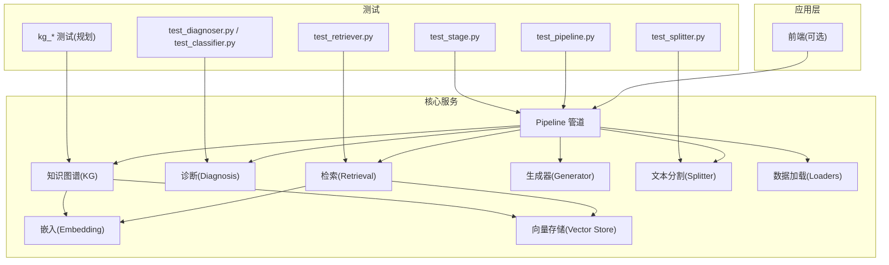
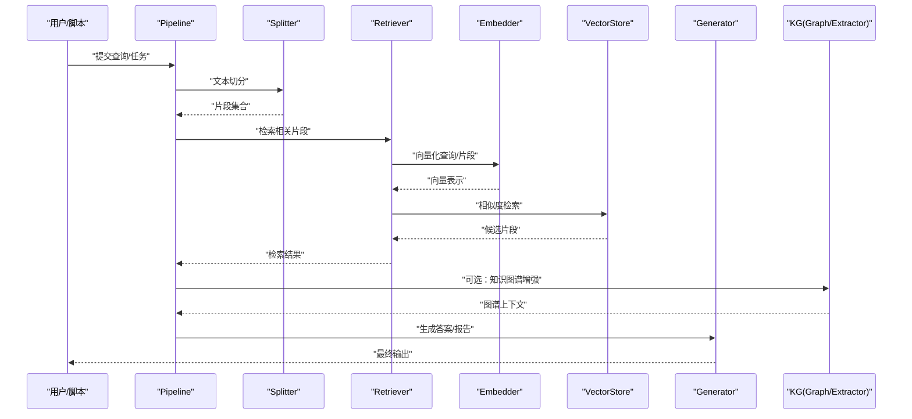
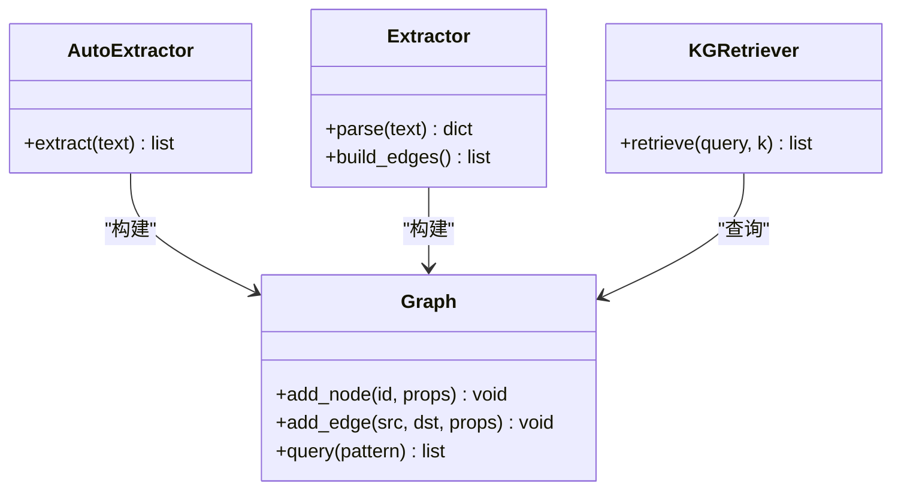
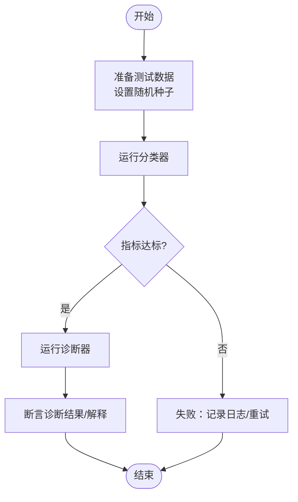
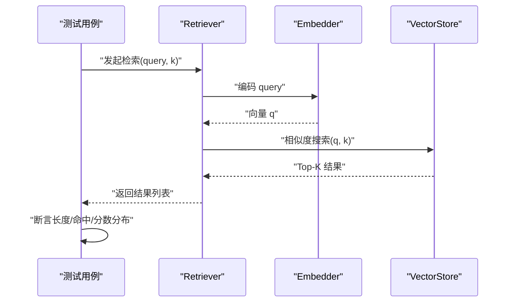
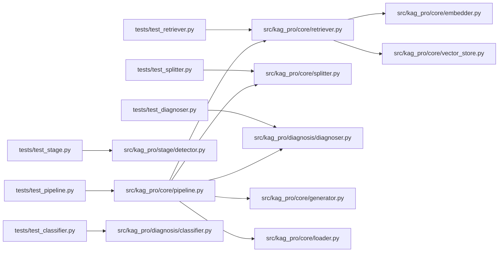

# 测试策略与实践

<cite>
**本文引用的文件**   
- [README.md](file://README.md)
- [pyproject.toml](file://pyproject.toml)
- [Makefile](file://Makefile)
- [tests/__init__.py](file://tests/__init__.py)
- [tests/test_pipeline.py](file://tests/test_pipeline.py)
- [tests/test_retriever.py](file://tests/test_retriever.py)
- [tests/test_splitter.py](file://tests/test_splitter.py)
- [tests/test_stage.py](file://tests/test_stage.py)
- [tests/test_diagnoser.py](file://tests/test_diagnoser.py)
- [tests/test_classifier.py](file://tests/test_classifier.py)
- [src/kag_pro/core/pipeline.py](file://src/kag_pro/core/pipeline.py)
- [src/kag_pro/core/retriever.py](file://src/kag_pro/core/retriever.py)
- [src/kag_pro/core/splitter.py](file://src/kag_pro/core/splitter.py)
- [src/kag_pro/stage/detector.py](file://src/kag_pro/stage/detector.py)
- [src/kag_pro/diagnosis/diagnoser.py](file://src/kag_pro/diagnosis/diagnoser.py)
- [src/kag_pro/diagnosis/classifier.py](file://src/kag_pro/diagnosis/classifier.py)
- [src/kag_pro/kg/graph.py](file://src/kag_pro/kg/graph.py)
- [src/kag_pro/kg/auto_extractor.py](file://src/kag_pro/kg/auto_extractor.py)
- [src/kag_pro/kg/extractor.py](file://src/kag_pro/kg/extractor.py)
- [src/kag_pro/kg/kg_retriever.py](file://src/kag_pro/kg/kg_retriever.py)
- [src/kag_pro/core/embedder.py](file://src/kag_pro/core/embedder.py)
- [src/kag_pro/core/vector_store.py](file://src/kag_pro/core/vector_store.py)
- [src/kag_pro/core/generator.py](file://src/kag_pro/core/generator.py)
- [src/kag_pro/core/loader.py](file://src/kag_pro/core/loader.py)
- [src/kag_pro/utils/config.py](file://src/kag_pro/utils/config.py)
</cite>

## 目录
1. [简介](#简介)
2. [项目结构](#项目结构)
3. [核心组件](#核心组件)
4. [架构总览](#架构总览)
5. [详细组件分析](#详细组件分析)
6. [依赖分析](#依赖分析)
7. [性能考虑](#性能考虑)
8. [故障排查指南](#故障排查指南)
9. [结论](#结论)
10. [附录](#附录)

## 简介
本文件为 KAG-Pro 建立完整的测试策略与实践指南，围绕测试金字塔（单元测试、集成测试、端到端测试）给出分层目标与覆盖范围；文档化 pytest 配置、用例组织与断言方法；针对知识图谱构建、诊断算法、检索引擎与生成器等核心模块提供可落地的测试方法与最佳实践；说明 Mock 与 Fixture 的使用，包括外部服务模拟、数据准备与环境隔离；并给出覆盖率要求、持续集成流程与报告生成建议，以及性能与压力测试指导。

## 项目结构
KAG-Pro 采用按功能域划分的源码组织方式：core（管道、嵌入、向量存储、检索、分割、加载等）、kg（知识图谱抽取与检索）、diagnosis（诊断与推荐）、stage（阶段检测）、evaluation（评估指标）、utils（通用工具）。测试位于 tests 目录，以模块维度对应 src 中的功能域。

图表来源
- [src/kag_pro/core/pipeline.py](file://src/kag_pro/core/pipeline.py)
- [src/kag_pro/core/retriever.py](file://src/kag_pro/core/retriever.py)
- [src/kag_pro/core/splitter.py](file://src/kag_pro/core/splitter.py)
- [src/kag_pro/core/embedder.py](file://src/kag_pro/core/embedder.py)
- [src/kag_pro/core/vector_store.py](file://src/kag_pro/core/vector_store.py)
- [src/kag_pro/core/generator.py](file://src/kag_pro/core/generator.py)
- [src/kag_pro/core/loader.py](file://src/kag_pro/core/loader.py)
- [src/kag_pro/kg/graph.py](file://src/kag_pro/kg/graph.py)
- [src/kag_pro/kg/auto_extractor.py](file://src/kag_pro/kg/auto_extractor.py)
- [src/kag_pro/kg/extractor.py](file://src/kag_pro/kg/extractor.py)
- [src/kag_pro/kg/kg_retriever.py](file://src/kag_pro/kg/kg_retriever.py)
- [src/kag_pro/diagnosis/diagnoser.py](file://src/kag_pro/diagnosis/diagnoser.py)
- [src/kag_pro/diagnosis/classifier.py](file://src/kag_pro/diagnosis/classifier.py)
- [tests/test_pipeline.py](file://tests/test_pipeline.py)
- [tests/test_retriever.py](file://tests/test_retriever.py)
- [tests/test_splitter.py](file://tests/test_splitter.py)
- [tests/test_stage.py](file://tests/test_stage.py)
- [tests/test_diagnoser.py](file://tests/test_diagnoser.py)
- [tests/test_classifier.py](file://tests/test_classifier.py)

章节来源
- [README.md](file://README.md)
- [pyproject.toml](file://pyproject.toml)
- [Makefile](file://Makefile)

## 核心组件
本节聚焦测试金字塔在各层的职责与覆盖范围，并给出关键模块的测试要点。

- 单元测试（Unit Tests）
  - 目标：验证最小可测单元（函数/类方法）的正确性、边界条件与异常路径。
  - 重点模块：Splitter、Classifier、Diagnoser 内部逻辑、KG 图操作、Embedding/VectorStore 接口契约。
  - 断言建议：输入输出形状/类型、返回值语义、错误抛出、副作用（如写入临时文件）清理。
- 集成测试（Integration Tests）
  - 目标：验证组件间协作（如 Pipeline 编排、Retriever 调用 Embedding/VectorStore/KG）。
  - 重点场景：端到端链路中关键步骤的组合行为、配置注入、资源初始化与释放。
  - 环境：使用轻量级本地或内存型后端（如内存向量库），避免真实外部依赖。
- 端到端测试（E2E Tests）
  - 目标：在接近生产的环境中验证完整业务流程（从数据加载到生成结果）。
  - 范围：小样本数据集、受限并发、短超时；用于回归与冒烟验证。
  - 注意：严格控制成本与耗时，必要时通过标记跳过或在 CI 中单独运行。

章节来源
- [tests/test_pipeline.py](file://tests/test_pipeline.py)
- [tests/test_retriever.py](file://tests/test_retriever.py)
- [tests/test_splitter.py](file://tests/test_splitter.py)
- [tests/test_stage.py](file://tests/test_stage.py)
- [tests/test_diagnoser.py](file://tests/test_diagnoser.py)
- [tests/test_classifier.py](file://tests/test_classifier.py)

## 架构总览
下图展示 KAG-Pro 的核心处理流与测试切入点。测试应围绕“输入→处理→输出”的关键路径进行断言，并对关键副作用（如持久化、网络调用）进行隔离。

图表来源
- [src/kag_pro/core/pipeline.py](file://src/kag_pro/core/pipeline.py)
- [src/kag_pro/core/splitter.py](file://src/kag_pro/core/splitter.py)
- [src/kag_pro/core/retriever.py](file://src/kag_pro/core/retriever.py)
- [src/kag_pro/core/embedder.py](file://src/kag_pro/core/embedder.py)
- [src/kag_pro/core/vector_store.py](file://src/kag_pro/core/vector_store.py)
- [src/kag_pro/core/generator.py](file://src/kag_pro/core/generator.py)
- [src/kag_pro/kg/graph.py](file://src/kag_pro/kg/graph.py)
- [src/kag_pro/kg/auto_extractor.py](file://src/kag_pro/kg/auto_extractor.py)
- [src/kag_pro/kg/extractor.py](file://src/kag_pro/kg/extractor.py)

## 详细组件分析

### 测试框架与工程化
- 测试运行器：pytest
- 配置文件：pyproject.toml 中集中管理 pytest 参数、插件与覆盖率阈值
- 常用命令：
  - 运行全部测试：make test
  - 指定标签/子集：通过 pytest 的 -m/-k 选择器
  - 生成覆盖率报告：结合 coverage 插件
- 建议：
  - 将慢速/需要外部资源的用例打标记，默认跳过，按需启用
  - 使用 fixtures 统一构造测试数据与临时目录
  - 对 I/O 和网络调用使用 mock，保证可重复性与快速执行

章节来源
- [pyproject.toml](file://pyproject.toml)
- [Makefile](file://Makefile)

### 测试用例组织与命名规范
- 目录结构：tests 下按模块划分，文件名以 test_ 前缀标识
- 命名约定：test_<模块名>.py；函数名体现被测行为与预期结果
- 分类：
  - unit：纯逻辑、无外部依赖
  - integration：跨模块协作，使用内存/轻量后端
  - e2e：端到端流程，小数据集、短超时
- 断言风格：优先使用 pytest 内置断言与第三方扩展（如 hypothesis 做属性测试）

章节来源
- [tests/__init__.py](file://tests/__init__.py)
- [tests/test_pipeline.py](file://tests/test_pipeline.py)
- [tests/test_retriever.py](file://tests/test_retriever.py)
- [tests/test_splitter.py](file://tests/test_splitter.py)
- [tests/test_stage.py](file://tests/test_stage.py)
- [tests/test_diagnoser.py](file://tests/test_diagnoser.py)
- [tests/test_classifier.py](file://tests/test_classifier.py)

### 知识图谱构建与检索测试
- 关注点：
  - 抽取器（AutoExtractor/Extractor）对输入文本的实体/关系抽取稳定性
  - Graph 数据结构的一致性（节点/边完整性、去重、索引）
  - KG-Retriever 的召回质量与排序稳定性
- 测试策略：
  - 使用小型可控语料，断言抽取结果的三元组集合
  - 对 Graph 操作进行增量更新与查询一致性校验
  - 对 KG-Retriever 使用固定种子与确定性排序，断言 Top-K 命中
- 隔离与 Mock：
  - 外部抽取模型可用轻量模型或返回固定结构的 Mock
  - 向量检索可替换为内存实现

图表来源
- [src/kag_pro/kg/auto_extractor.py](file://src/kag_pro/kg/auto_extractor.py)
- [src/kag_pro/kg/extractor.py](file://src/kag_pro/kg/extractor.py)
- [src/kag_pro/kg/graph.py](file://src/kag_pro/kg/graph.py)
- [src/kag_pro/kg/kg_retriever.py](file://src/kag_pro/kg/kg_retriever.py)

章节来源
- [src/kag_pro/kg/auto_extractor.py](file://src/kag_pro/kg/auto_extractor.py)
- [src/kag_pro/kg/extractor.py](file://src/kag_pro/kg/extractor.py)
- [src/kag_pro/kg/graph.py](file://src/kag_pro/kg/graph.py)
- [src/kag_pro/kg/kg_retriever.py](file://src/kag_pro/kg/kg_retriever.py)

### 诊断算法测试（Diagnoser/Classifier）
- 关注点：
  - Classifier 的分类准确率/混淆矩阵、类别不平衡下的鲁棒性
  - Diagnoser 的诊断流程（特征提取→推理→解释）一致性与可复现性
- 测试策略：
  - 使用合成/小规模标注数据，断言预测标签与置信度区间
  - 对随机性设置固定随机种子，确保结果稳定
  - 对异常输入（空文本、缺失字段）进行健壮性测试
- 隔离与 Mock：
  - 模型权重与外部 API 用 Mock 替代，仅验证接口契约与数据处理逻辑

图表来源
- [src/kag_pro/diagnosis/classifier.py](file://src/kag_pro/diagnosis/classifier.py)
- [src/kag_pro/diagnosis/diagnoser.py](file://src/kag_pro/diagnosis/diagnoser.py)

章节来源
- [src/kag_pro/diagnosis/classifier.py](file://src/kag_pro/diagnosis/classifier.py)
- [src/kag_pro/diagnosis/diagnoser.py](file://src/kag_pro/diagnosis/diagnoser.py)
- [tests/test_diagnoser.py](file://tests/test_diagnoser.py)
- [tests/test_classifier.py](file://tests/test_classifier.py)

### 检索引擎测试（Retriever/Embedder/VectorStore）
- 关注点：
  - Embedder 的向量维度、归一化、批处理行为
  - VectorStore 的插入/查询/删除正确性与性能基线
  - Retriever 的召回率、Top-K 稳定性、过滤条件生效
- 测试策略：
  - 使用固定数据集与查询集，断言相似度排序与命中率
  - 对并发插入/查询进行基本压力测试（单进程内）
  - 对空查询、越界查询、非法参数进行异常路径测试
- 隔离与 Mock：
  - 外部向量库可用内存实现或本地轻量实现
  - Embedder 可用固定权重或 Mock 返回已知向量

图表来源
- [src/kag_pro/core/retriever.py](file://src/kag_pro/core/retriever.py)
- [src/kag_pro/core/embedder.py](file://src/kag_pro/core/embedder.py)
- [src/kag_pro/core/vector_store.py](file://src/kag_pro/core/vector_store.py)
- [tests/test_retriever.py](file://tests/test_retriever.py)

章节来源
- [src/kag_pro/core/retriever.py](file://src/kag_pro/core/retriever.py)
- [src/kag_pro/core/embedder.py](file://src/kag_pro/core/embedder.py)
- [src/kag_pro/core/vector_store.py](file://src/kag_pro/core/vector_store.py)
- [tests/test_retriever.py](file://tests/test_retriever.py)

### 生成器测试（Generator）
- 关注点：
  - 输入上下文拼接、提示词模板渲染、输出格式约束
  - 长上下文截断与回退策略
- 测试策略：
  - 使用固定上下文与模板，断言输出关键字段存在性与格式
  - 对超长输入进行边界测试，验证截断位置与内容完整性
- 隔离与 Mock：
  - 大模型调用使用 Mock，返回预定义响应，确保快速与稳定

章节来源
- [src/kag_pro/core/generator.py](file://src/kag_pro/core/generator.py)

### 文本分割与加载器测试（Splitter/Loader）
- Splitter：
  - 断言分割粒度、重叠比例、边界情况（空串、单字符、特殊符号）
- Loader：
  - 断言读取路径、编码、元数据注入、错误文件处理

章节来源
- [src/kag_pro/core/splitter.py](file://src/kag_pro/core/splitter.py)
- [src/kag_pro/core/loader.py](file://src/kag_pro/core/loader.py)
- [tests/test_splitter.py](file://tests/test_splitter.py)

### 阶段检测与管道编排（Stage/Pipeline）
- Stage：
  - 断言状态转换、触发条件、中间产物传递
- Pipeline：
  - 断言各阶段顺序、错误传播、重试/回退策略
  - 使用 fixture 构造最小可运行流水线，减少外部依赖

章节来源
- [src/kag_pro/stage/detector.py](file://src/kag_pro/stage/detector.py)
- [src/kag_pro/core/pipeline.py](file://src/kag_pro/core/pipeline.py)
- [tests/test_stage.py](file://tests/test_stage.py)
- [tests/test_pipeline.py](file://tests/test_pipeline.py)

## 依赖分析
测试与源码的依赖关系如下，便于定位回归影响面与选择最小测试集。

图表来源
- [tests/test_pipeline.py](file://tests/test_pipeline.py)
- [tests/test_retriever.py](file://tests/test_retriever.py)
- [tests/test_splitter.py](file://tests/test_splitter.py)
- [tests/test_stage.py](file://tests/test_stage.py)
- [tests/test_diagnoser.py](file://tests/test_diagnoser.py)
- [tests/test_classifier.py](file://tests/test_classifier.py)
- [src/kag_pro/core/pipeline.py](file://src/kag_pro/core/pipeline.py)
- [src/kag_pro/core/retriever.py](file://src/kag_pro/core/retriever.py)
- [src/kag_pro/core/splitter.py](file://src/kag_pro/core/splitter.py)
- [src/kag_pro/stage/detector.py](file://src/kag_pro/stage/detector.py)
- [src/kag_pro/diagnosis/diagnoser.py](file://src/kag_pro/diagnosis/diagnoser.py)
- [src/kag_pro/diagnosis/classifier.py](file://src/kag_pro/diagnosis/classifier.py)
- [src/kag_pro/core/embedder.py](file://src/kag_pro/core/embedder.py)
- [src/kag_pro/core/vector_store.py](file://src/kag_pro/core/vector_store.py)
- [src/kag_pro/core/generator.py](file://src/kag_pro/core/generator.py)
- [src/kag_pro/core/loader.py](file://src/kag_pro/core/loader.py)

章节来源
- [pyproject.toml](file://pyproject.toml)
- [Makefile](file://Makefile)

## 性能考虑
- 基准测试
  - 对 Embedder/VectorStore/Retriever 建立延迟与吞吐基线（QPS、P95/P99 延迟）
  - 使用固定数据集与查询集，定期回归对比
- 压力测试
  - 并发插入/查询压测，观察内存占用与 GC 行为
  - 对长上下文生成进行限流与超时保护
- 优化建议
  - 批量向量化、缓存热点查询、惰性加载大图
  - 对检索结果做去重与早停策略

[本节为通用指导，不直接分析具体文件]

## 故障排查指南
- 常见问题
  - 外部依赖不可用：确认 Mock/Fixture 是否生效，检查环境变量与路径
  - 随机性导致不稳定：确保设置随机种子或使用确定性数据
  - 资源未释放：使用 fixture 的 yield 模式与 finally 清理
- 调试技巧
  - 使用 pytest -s 打印日志，-v 增加详细输出
  - 使用 --tb=short/--tb=long 控制堆栈信息
  - 对慢用例添加 @pytest.mark.slow 并在 CI 中单独运行

章节来源
- [pyproject.toml](file://pyproject.toml)
- [Makefile](file://Makefile)

## 结论
通过分层测试策略、严格的 Mock/Fixture 隔离与稳定的 CI 流程，KAG-Pro 可在保证质量的同时保持迭代效率。建议逐步提升覆盖率与自动化程度，并将性能基线纳入回归门禁。

[本节为总结性内容，不直接分析具体文件]

## 附录

### 覆盖率与门禁建议
- 行覆盖率目标：≥80%（核心模块 ≥90%）
- 分支覆盖率目标：≥70%
- 报告：生成 HTML 与 XML 报告，CI 中阻断低于阈值的合并请求

章节来源
- [pyproject.toml](file://pyproject.toml)

### 持续集成与自动化
- 建议流程
  - 代码提交触发：lint → 单元测试 → 集成测试 → 覆盖率报告
  - 定时任务：每日全量回归与性能基线对比
  - 发布前：端到端冒烟测试与文档生成
- 命令参考
  - make test：运行测试套件
  - make coverage：生成覆盖率报告

章节来源
- [Makefile](file://Makefile)

### 配置与环境隔离
- 使用 utils.config 统一管理测试配置
- 通过环境变量切换后端（内存/本地/远程）
- 使用临时目录存放中间产物，避免污染工作区

章节来源
- [src/kag_pro/utils/config.py](file://src/kag_pro/utils/config.py)