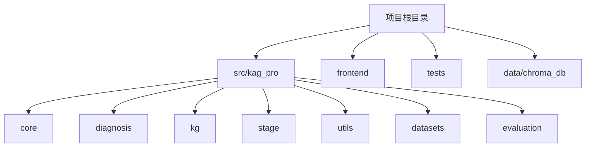
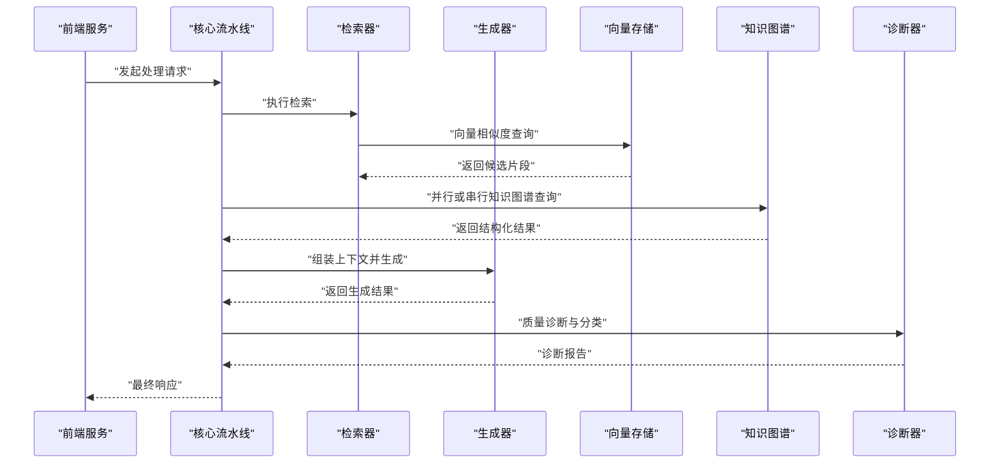
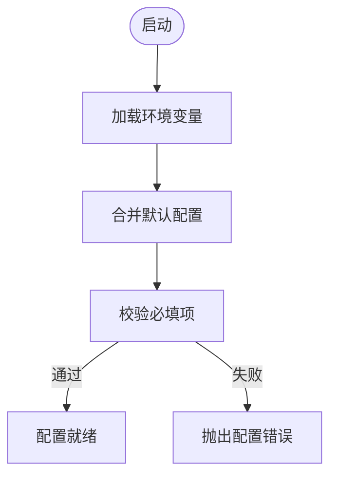
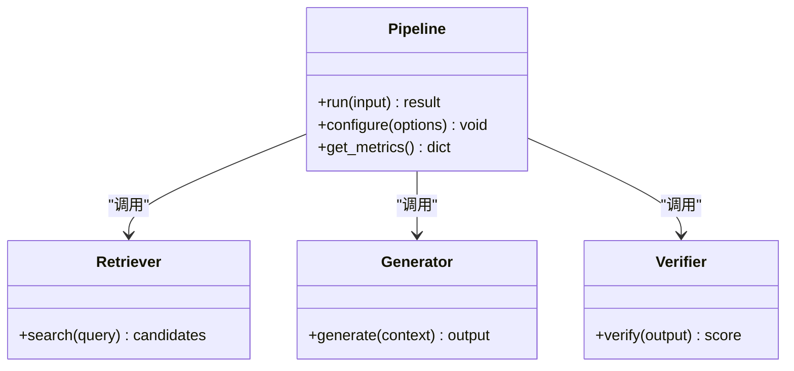
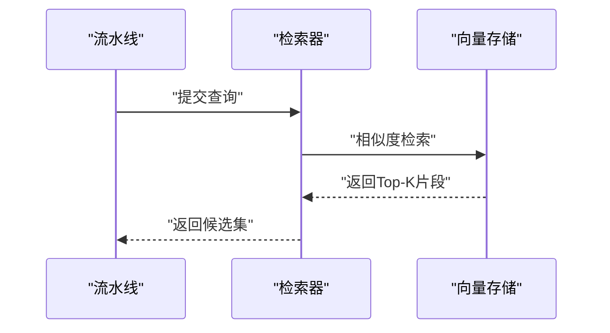
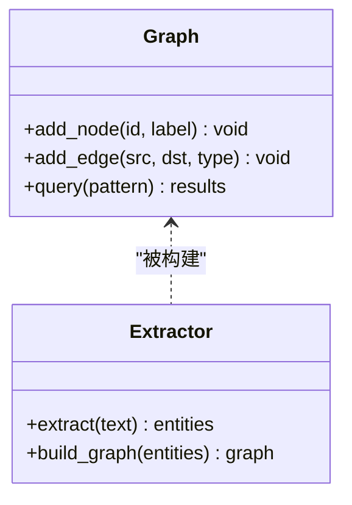
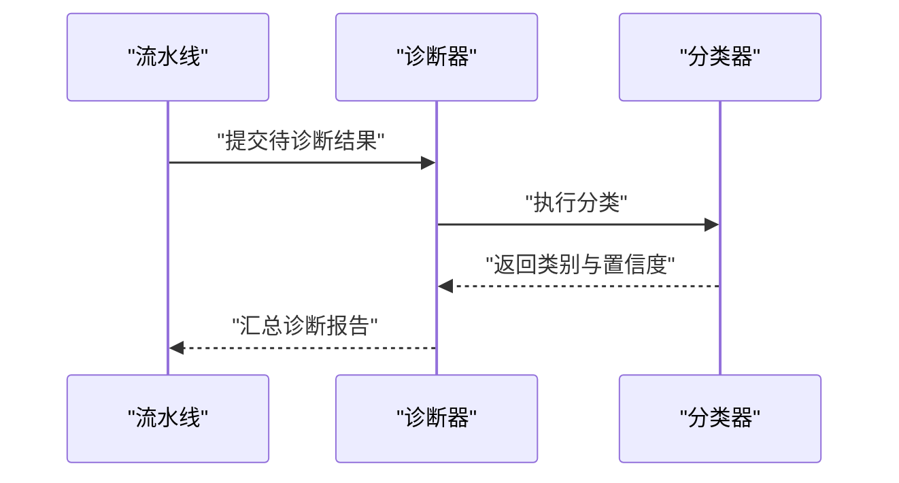
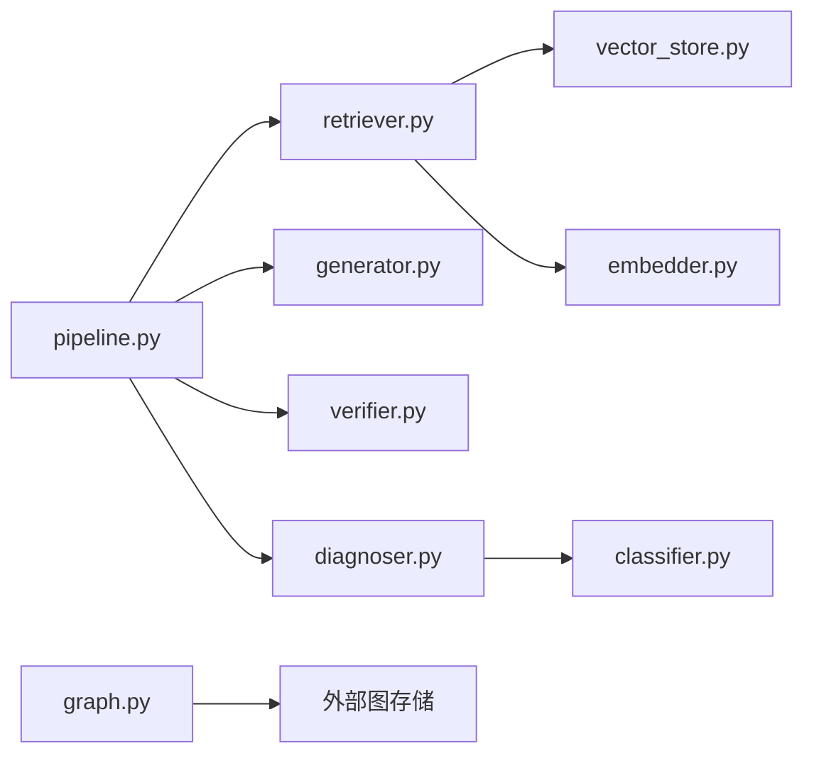

# 调试与故障排除

<cite>
**本文引用的文件**   
- [README.md](file://README.md)
- [pyproject.toml](file://pyproject.toml)
- [Makefile](file://Makefile)
- [src/kag_pro/utils/config.py](file://src/kag_pro/utils/config.py)
- [src/kag_pro/core/pipeline.py](file://src/kag_pro/core/pipeline.py)
- [src/kag_pro/core/generator.py](file://src/kag_pro/core/generator.py)
- [src/kag_pro/core/retriever.py](file://src/kag_pro/core/retriever.py)
- [src/kag_pro/core/embedder.py](file://src/kag_pro/core/embedder.py)
- [src/kag_pro/core/vector_store.py](file://src/kag_pro/core/vector_store.py)
- [src/kag_pro/diagnosis/diagnoser.py](file://src/kag_pro/diagnosis/diagnoser.py)
- [src/kag_pro/diagnosis/classifier.py](file://src/kag_pro/diagnosis/classifier.py)
- [src/kag_pro/kg/graph.py](file://src/kag_pro/kg/graph.py)
- [src/kag_pro/kg/extractor.py](file://src/kag_pro/kg/extractor.py)
- [src/kag_pro/stage/detector.py](file://src/kag_pro/stage/detector.py)
- [tests/test_pipeline.py](file://tests/test_pipeline.py)
- [tests/test_diagnoser.py](file://tests/test_diagnoser.py)
- [frontend/server.py](file://frontend/server.py)
</cite>

## 目录
1. [简介](#简介)
2. [项目结构](#项目结构)
3. [核心组件](#核心组件)
4. [架构总览](#架构总览)
5. [详细组件分析](#详细组件分析)
6. [依赖关系分析](#依赖关系分析)
7. [性能考虑](#性能考虑)
8. [故障排除指南](#故障排除指南)
9. [结论](#结论)
10. [附录](#附录)

## 简介
本指南面向KAG-Pro的开发者与运维人员，提供从环境搭建、调试工具配置到问题定位、性能优化与监控告警的全流程实践。内容覆盖：
- Python调试器、日志系统与性能分析工具的启用与使用
- 常见问题（环境问题、依赖冲突、内存泄漏、性能瓶颈）的诊断方法
- 日志分析与错误模式识别技巧
- 代码级profiling、数据库查询优化与缓存策略调整
- 应用健康检查、指标收集与异常通知
- 故障恢复与灾难恢复最佳实践

## 项目结构
KAG-Pro采用模块化分层组织：核心流水线与知识图谱处理位于src/kag_pro下，诊断与评估模块独立，前端服务在frontend中，测试用例集中于tests。关键入口与配置文件包括：
- 项目元数据与依赖：pyproject.toml
- 构建与任务脚本：Makefile
- 核心流水线编排：core/pipeline.py
- 配置管理：utils/config.py
- 前端服务：frontend/server.py

图表来源
- [pyproject.toml](file://pyproject.toml)
- [Makefile](file://Makefile)
- [src/kag_pro/utils/config.py](file://src/kag_pro/utils/config.py)
- [src/kag_pro/core/pipeline.py](file://src/kag_pro/core/pipeline.py)
- [frontend/server.py](file://frontend/server.py)

章节来源
- [README.md](file://README.md)
- [pyproject.toml](file://pyproject.toml)
- [Makefile](file://Makefile)

## 核心组件
- 配置管理：集中读取环境变量与默认值，为各模块提供统一配置入口
- 流水线编排：串联加载、分块、检索、生成、验证等阶段，支持可插拔组件
- 向量存储与嵌入：负责文本向量化与相似度检索
- 知识图谱：图结构与抽取器，支撑结构化知识检索与推理
- 诊断与分类：对模型输出进行质量评估与分类
- 前端服务：提供Web接口与交互能力

章节来源
- [src/kag_pro/utils/config.py](file://src/kag_pro/utils/config.py)
- [src/kag_pro/core/pipeline.py](file://src/kag_pro/core/pipeline.py)
- [src/kag_pro/core/embedder.py](file://src/kag_pro/core/embedder.py)
- [src/kag_pro/core/vector_store.py](file://src/kag_pro/core/vector_store.py)
- [src/kag_pro/kg/graph.py](file://src/kag_pro/kg/graph.py)
- [src/kag_pro/kg/extractor.py](file://src/kag_pro/kg/extractor.py)
- [src/kag_pro/diagnosis/diagnoser.py](file://src/kag_pro/diagnosis/diagnoser.py)
- [src/kag_pro/diagnosis/classifier.py](file://src/kag_pro/diagnosis/classifier.py)
- [frontend/server.py](file://frontend/server.py)

## 架构总览
下图展示KAG-Pro在运行时的主要组件交互：前端请求进入后由流水线协调各子系统进行数据处理与生成，期间涉及向量检索、知识图谱查询与诊断评估。

图表来源
- [src/kag_pro/core/pipeline.py](file://src/kag_pro/core/pipeline.py)
- [src/kag_pro/core/retriever.py](file://src/kag_pro/core/retriever.py)
- [src/kag_pro/core/generator.py](file://src/kag_pro/core/generator.py)
- [src/kag_pro/core/vector_store.py](file://src/kag_pro/core/vector_store.py)
- [src/kag_pro/kg/graph.py](file://src/kag_pro/kg/graph.py)
- [src/kag_pro/diagnosis/diagnoser.py](file://src/kag_pro/diagnosis/diagnoser.py)
- [frontend/server.py](file://frontend/server.py)

## 详细组件分析

### 配置子系统（utils/config.py）
- 职责：集中管理环境变量、默认值与运行时参数；为其他模块提供统一的配置访问接口
- 调试要点：
  - 通过环境变量切换不同环境（开发、测试、生产），便于隔离问题
  - 打印或记录关键配置项用于快速定位配置错误
  - 校验必填字段，避免运行时出现空指针或缺失依赖

图表来源
- [src/kag_pro/utils/config.py](file://src/kag_pro/utils/config.py)

章节来源
- [src/kag_pro/utils/config.py](file://src/kag_pro/utils/config.py)

### 核心流水线（core/pipeline.py）
- 职责：编排加载、分块、检索、生成、验证等步骤；对外暴露统一调用接口
- 调试要点：
  - 在每个阶段前后记录耗时与输入输出摘要，便于定位慢点
  - 支持开关式日志级别，按阶段细化日志粒度
  - 捕获并上报异常，附带上下文信息（如当前阶段、输入标识）

图表来源
- [src/kag_pro/core/pipeline.py](file://src/kag_pro/core/pipeline.py)
- [src/kag_pro/core/retriever.py](file://src/kag_pro/core/retriever.py)
- [src/kag_pro/core/generator.py](file://src/kag_pro/core/generator.py)

章节来源
- [src/kag_pro/core/pipeline.py](file://src/kag_pro/core/pipeline.py)
- [tests/test_pipeline.py](file://tests/test_pipeline.py)

### 检索与向量存储（core/retriever.py, core/vector_store.py）
- 职责：将文本转换为向量并进行相似度检索；维护向量索引
- 调试要点：
  - 记录查询向量维度与索引大小，排查维度不匹配
  - 统计召回率与延迟，结合阈值调优
  - 监控向量库连接状态与写入失败重试次数

图表来源
- [src/kag_pro/core/retriever.py](file://src/kag_pro/core/retriever.py)
- [src/kag_pro/core/vector_store.py](file://src/kag_pro/core/vector_store.py)

章节来源
- [src/kag_pro/core/retriever.py](file://src/kag_pro/core/retriever.py)
- [src/kag_pro/core/vector_store.py](file://src/kag_pro/core/vector_store.py)

### 生成器（core/generator.py）
- 职责：基于上下文生成回答或内容；可能调用外部模型或服务
- 调试要点：
  - 记录提示词模板与上下文长度，避免超出限制
  - 捕获超时与限流错误，实现退避重试
  - 输出采样参数与温度设置，辅助复现问题

章节来源
- [src/kag_pro/core/generator.py](file://src/kag_pro/core/generator.py)

### 嵌入器（core/embedder.py）
- 职责：文本编码为向量；决定检索质量的关键环节
- 调试要点：
  - 监控编码耗时与显存占用
  - 对比不同模型/维度的效果差异
  - 记录批量编码的吞吐与错误率

章节来源
- [src/kag_pro/core/embedder.py](file://src/kag_pro/core/embedder.py)

### 知识图谱（kg/graph.py, kg/extractor.py）
- 职责：维护图结构并提供查询；从文本中抽取实体与关系
- 调试要点：
  - 记录图规模与查询路径深度，防止遍历爆炸
  - 抽取成功率与去重策略影响下游检索质量
  - 持久化与一致性校验，避免脏数据污染

图表来源
- [src/kag_pro/kg/graph.py](file://src/kag_pro/kg/graph.py)
- [src/kag_pro/kg/extractor.py](file://src/kag_pro/kg/extractor.py)

章节来源
- [src/kag_pro/kg/graph.py](file://src/kag_pro/kg/graph.py)
- [src/kag_pro/kg/extractor.py](file://src/kag_pro/kg/extractor.py)

### 诊断与分类（diagnosis/diagnoser.py, diagnosis/classifier.py）
- 职责：对生成结果进行质量诊断与分类，辅助反馈与改进
- 调试要点：
  - 记录诊断指标与分类置信度
  - 针对低分样本进行抽样分析，定位系统性偏差
  - 与流水线集成，形成闭环优化

图表来源
- [src/kag_pro/diagnosis/diagnoser.py](file://src/kag_pro/diagnosis/diagnoser.py)
- [src/kag_pro/diagnosis/classifier.py](file://src/kag_pro/diagnosis/classifier.py)

章节来源
- [src/kag_pro/diagnosis/diagnoser.py](file://src/kag_pro/diagnosis/diagnoser.py)
- [src/kag_pro/diagnosis/classifier.py](file://src/kag_pro/diagnosis/classifier.py)
- [tests/test_diagnoser.py](file://tests/test_diagnoser.py)

### 阶段检测（stage/detector.py）
- 职责：在特定阶段触发检测逻辑（如数据质量、规则校验）
- 调试要点：
  - 记录触发条件与检测结果
  - 与流水线阶段对齐，确保可观测性

章节来源
- [src/kag_pro/stage/detector.py](file://src/kag_pro/stage/detector.py)

### 前端服务（frontend/server.py）
- 职责：提供HTTP接口，接收用户请求并转发至后端流水线
- 调试要点：
  - 记录请求ID、方法与耗时
  - 统一错误码与消息格式，便于前端友好提示
  - 健康检查端点用于负载均衡与健康探测

章节来源
- [frontend/server.py](file://frontend/server.py)

## 依赖关系分析
- 内部依赖：
  - 流水线依赖检索器、生成器、验证器与诊断器
  - 检索器依赖向量存储与嵌入器
  - 知识图谱与抽取器协同工作
- 外部依赖：
  - 向量数据库（如Chroma）
  - 外部模型或服务（生成器可能调用）
  - 前端框架（HTTP服务）

图表来源
- [src/kag_pro/core/pipeline.py](file://src/kag_pro/core/pipeline.py)
- [src/kag_pro/core/retriever.py](file://src/kag_pro/core/retriever.py)
- [src/kag_pro/core/generator.py](file://src/kag_pro/core/generator.py)
- [src/kag_pro/core/vector_store.py](file://src/kag_pro/core/vector_store.py)
- [src/kag_pro/core/embedder.py](file://src/kag_pro/core/embedder.py)
- [src/kag_pro/diagnosis/diagnoser.py](file://src/kag_pro/diagnosis/diagnoser.py)
- [src/kag_pro/diagnosis/classifier.py](file://src/kag_pro/diagnosis/classifier.py)
- [src/kag_pro/kg/graph.py](file://src/kag_pro/kg/graph.py)

章节来源
- [pyproject.toml](file://pyproject.toml)
- [Makefile](file://Makefile)

## 性能考虑
- 代码级Profiling
  - 使用Python内置cProfile或第三方工具（如line_profiler）对热点函数进行剖析
  - 在流水线关键阶段埋点，统计端到端耗时与各阶段占比
- 数据库查询优化
  - 向量检索：调整Top-K、相似度阈值与索引参数，平衡召回与延迟
  - 知识图谱：限制查询深度与分支因子，避免全图遍历
- 缓存策略
  - 对高频查询结果进行短期缓存（如LRU），降低重复计算
  - 对嵌入向量与中间结果进行持久化缓存，提升批处理吞吐
- 资源监控
  - 监控CPU、内存、GPU与I/O使用率，识别瓶颈
  - 记录GC行为与对象生命周期，排查内存泄漏

[本节为通用指导，无需具体文件引用]

## 故障排除指南

### 环境与依赖问题
- 症状：导入失败、版本冲突、缺少系统依赖
- 排查步骤：
  - 核对pyproject.toml中的依赖声明与环境变量
  - 使用虚拟环境隔离，重新安装依赖
  - 检查Makefile中的构建任务是否完整
- 参考
  - [pyproject.toml](file://pyproject.toml)
  - [Makefile](file://Makefile)

章节来源
- [pyproject.toml](file://pyproject.toml)
- [Makefile](file://Makefile)

### 配置错误
- 症状：启动时报错、功能不可用、行为异常
- 排查步骤：
  - 确认必需环境变量已设置且非空
  - 打印合并后的配置，逐项比对期望值
  - 增加配置校验失败时的详细错误信息
- 参考
  - [src/kag_pro/utils/config.py](file://src/kag_pro/utils/config.py)

章节来源
- [src/kag_pro/utils/config.py](file://src/kag_pro/utils/config.py)

### 流水线异常
- 症状：阶段失败、超时、返回空结果
- 排查步骤：
  - 在流水线每个阶段记录输入摘要与耗时
  - 捕获异常并附带上下文（阶段名、输入标识）
  - 使用测试用例复现问题（见tests/test_pipeline.py）
- 参考
  - [src/kag_pro/core/pipeline.py](file://src/kag_pro/core/pipeline.py)
  - [tests/test_pipeline.py](file://tests/test_pipeline.py)

章节来源
- [src/kag_pro/core/pipeline.py](file://src/kag_pro/core/pipeline.py)
- [tests/test_pipeline.py](file://tests/test_pipeline.py)

### 检索与向量存储问题
- 症状：召回率低、查询慢、连接失败
- 排查步骤：
  - 检查向量维度与索引大小是否匹配
  - 调整Top-K与相似度阈值，观察效果变化
  - 监控连接池与重试计数，排查网络与权限问题
- 参考
  - [src/kag_pro/core/retriever.py](file://src/kag_pro/core/retriever.py)
  - [src/kag_pro/core/vector_store.py](file://src/kag_pro/core/vector_store.py)

章节来源
- [src/kag_pro/core/retriever.py](file://src/kag_pro/core/retriever.py)
- [src/kag_pro/core/vector_store.py](file://src/kag_pro/core/vector_store.py)

### 生成器问题
- 症状：超时、限流、输出不稳定
- 排查步骤：
  - 记录提示词与上下文长度，避免超限
  - 实现退避重试与熔断策略
  - 固定随机种子以复现问题
- 参考
  - [src/kag_pro/core/generator.py](file://src/kag_pro/core/generator.py)

章节来源
- [src/kag_pro/core/generator.py](file://src/kag_pro/core/generator.py)

### 知识图谱问题
- 症状：查询缓慢、结果不一致、抽取失败
- 排查步骤：
  - 限制查询深度与分支，避免遍历爆炸
  - 校验抽取结果的完整性与去重策略
  - 检查持久化一致性与备份恢复
- 参考
  - [src/kag_pro/kg/graph.py](file://src/kag_pro/kg/graph.py)
  - [src/kag_pro/kg/extractor.py](file://src/kag_pro/kg/extractor.py)

章节来源
- [src/kag_pro/kg/graph.py](file://src/kag_pro/kg/graph.py)
- [src/kag_pro/kg/extractor.py](file://src/kag_pro/kg/extractor.py)

### 诊断与分类问题
- 症状：诊断分数偏低、分类不准确
- 排查步骤：
  - 抽样低分样本进行分析，定位系统性偏差
  - 调整分类阈值与特征工程
  - 与流水线集成，形成持续优化闭环
- 参考
  - [src/kag_pro/diagnosis/diagnoser.py](file://src/kag_pro/diagnosis/diagnoser.py)
  - [src/kag_pro/diagnosis/classifier.py](file://src/kag_pro/diagnosis/classifier.py)
  - [tests/test_diagnoser.py](file://tests/test_diagnoser.py)

章节来源
- [src/kag_pro/diagnosis/diagnoser.py](file://src/kag_pro/diagnosis/diagnoser.py)
- [src/kag_pro/diagnosis/classifier.py](file://src/kag_pro/diagnosis/classifier.py)
- [tests/test_diagnoser.py](file://tests/test_diagnoser.py)

### 前端服务问题
- 症状：接口超时、错误码不规范、健康检查失败
- 排查步骤：
  - 记录请求ID与方法，追踪链路
  - 统一错误响应格式，便于前端处理
  - 实现健康检查端点，配合负载均衡
- 参考
  - [frontend/server.py](file://frontend/server.py)

章节来源
- [frontend/server.py](file://frontend/server.py)

### 日志分析技巧
- 日志级别配置：
  - 开发环境使用DEBUG，生产环境使用INFO或WARNING
  - 按模块划分日志处理器，便于过滤与分析
- 关键信息提取：
  - 记录请求ID、阶段名、耗时、输入摘要与错误堆栈
  - 对敏感信息进行脱敏处理
- 错误模式识别：
  - 聚合相同错误类型与频率，定位系统性问题
  - 建立错误基线，发现异常峰值

[本节为通用指导，无需具体文件引用]

### 监控与告警
- 健康检查：
  - 提供健康检查端点，返回服务状态与依赖可用性
- 指标收集：
  - 采集QPS、延迟分布、错误率、资源使用率
  - 对关键阶段埋点，形成时序指标
- 异常通知：
  - 设定阈值与告警规则，及时推送通知
  - 与日志系统联动，快速定位根因

[本节为通用指导，无需具体文件引用]

### 故障恢复与灾难恢复
- 故障恢复：
  - 实现幂等与重试机制，避免重复副作用
  - 使用熔断与降级策略，保护核心链路
- 灾难恢复：
  - 定期备份向量库与知识图谱数据
  - 制定回滚计划与演练流程，确保可恢复性

[本节为通用指导，无需具体文件引用]

## 结论
通过系统化配置调试工具、完善日志与监控、实施性能优化与故障恢复策略，KAG-Pro可在复杂场景下保持稳定与高效。建议在生产环境中持续迭代诊断与告警能力，形成闭环的质量保障体系。

## 附录
- 常用命令与脚本：
  - 使用Makefile执行构建与测试任务
  - 通过环境变量切换不同运行环境
- 参考文件：
  - [README.md](file://README.md)
  - [pyproject.toml](file://pyproject.toml)
  - [Makefile](file://Makefile)