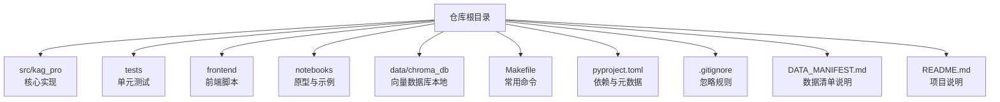
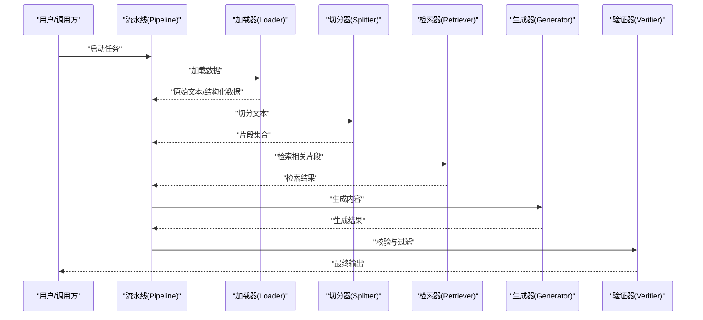
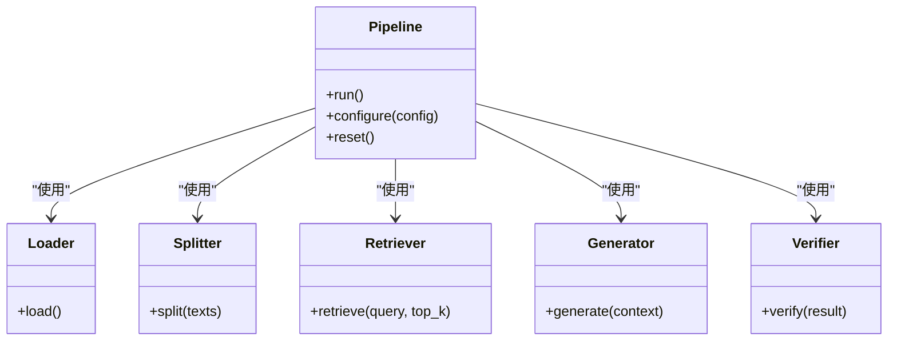
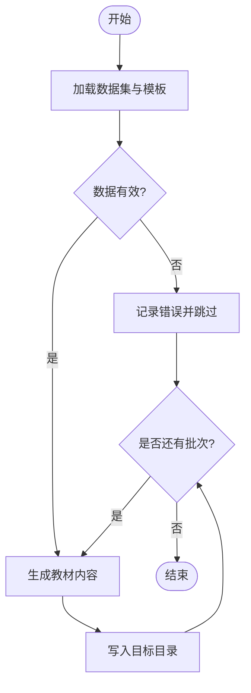
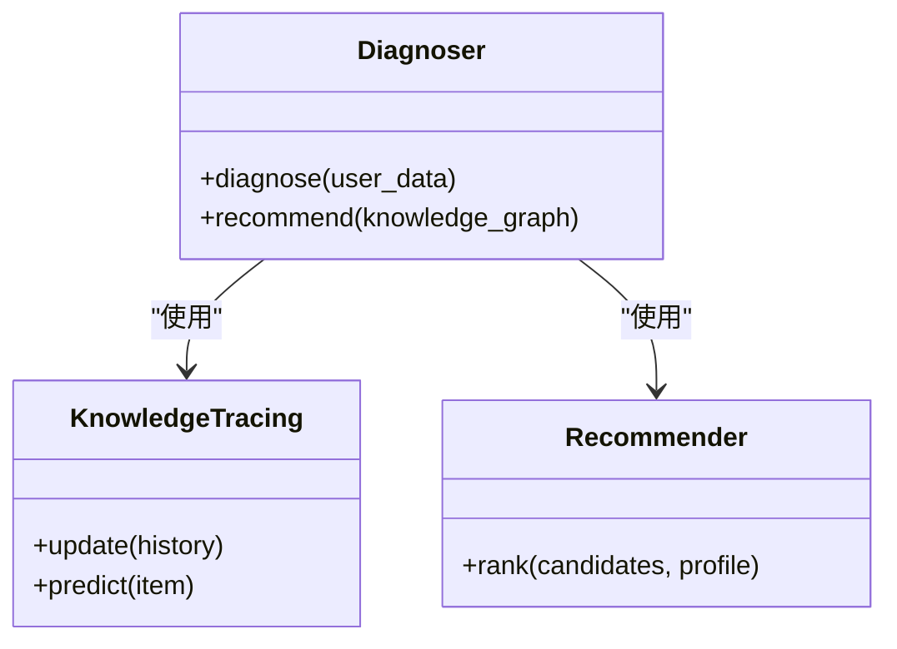
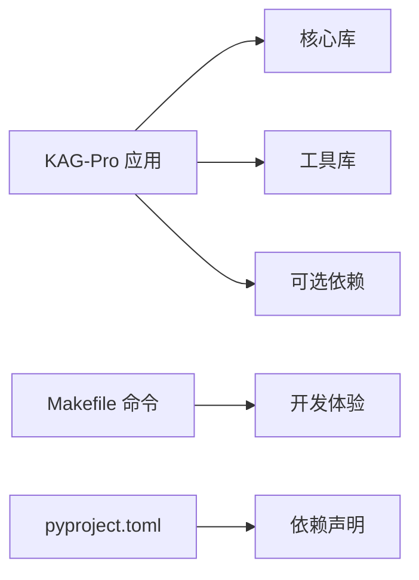

# 贡献指南

<cite>
**本文引用的文件**   
- [README.md](file://README.md)
- [pyproject.toml](file://pyproject.toml)
- [Makefile](file://Makefile)
- [.gitignore](file://.gitignore)
- [DATA_MANIFEST.md](file://DATA_MANIFEST.md)
- [src/kag_pro/core/pipeline.py](file://src/kag_pro/core/pipeline.py)
- [src/kag_pro/datasets/textbook_generator.py](file://src/kag_pro/datasets/textbook_generator.py)
- [src/kag_pro/diagnosis/diagnoser.py](file://src/kag_pro/diagnosis/diagnoser.py)
- [tests/test_pipeline.py](file://tests/test_pipeline.py)
</cite>

## 目录
1. [简介](#简介)
2. [项目结构](#项目结构)
3. [核心组件](#核心组件)
4. [架构总览](#架构总览)
5. [详细组件分析](#详细组件分析)
6. [依赖分析](#依赖分析)
7. [性能考虑](#性能考虑)
8. [故障排查指南](#故障排查指南)
9. [结论](#结论)
10. [附录](#附录)

## 简介
本贡献指南面向希望参与 KAG-Pro 开发与维护的贡献者，涵盖 Git 工作流、分支策略、提交信息规范、标签管理、Pull Request 流程与审查标准、Issue 报告规范、新功能开发流程、社区参与方式、许可证与法律声明以及贡献者协议要求。目标是让不同背景的参与者都能高效、安全地协作，保障代码质量与发布节奏。

## 项目结构
KAG-Pro 采用 Python 包组织方式，核心逻辑位于 src/kag_pro 下，测试位于 tests，前端脚本位于 frontend，数据清单与构建脚本位于仓库根目录。

**图表来源**
- [README.md](file://README.md)
- [pyproject.toml](file://pyproject.toml)
- [Makefile](file://Makefile)
- [.gitignore](file://.gitignore)
- [DATA_MANIFEST.md](file://DATA_MANIFEST.md)

**章节来源**
- [README.md](file://README.md)
- [pyproject.toml](file://pyproject.toml)
- [Makefile](file://Makefile)
- [.gitignore](file://.gitignore)
- [DATA_MANIFEST.md](file://DATA_MANIFEST.md)

## 核心组件
- 流水线编排：负责串联加载、切分、检索、生成、验证等阶段，提供统一入口与配置。
- 教材生成：基于数据集与模板生成教材内容，支持批量处理与输出路径管理。
- 诊断器：整合知识追踪与推荐能力，为学习者提供个性化诊断与建议。

上述组件的职责与交互关系在后续“架构总览”和“详细组件分析”中进一步展开。

**章节来源**
- [src/kag_pro/core/pipeline.py](file://src/kag_pro/core/pipeline.py)
- [src/kag_pro/datasets/textbook_generator.py](file://src/kag_pro/datasets/textbook_generator.py)
- [src/kag_pro/diagnosis/diagnoser.py](file://src/kag_pro/diagnosis/diagnoser.py)

## 架构总览
下图展示了从输入到输出的关键流程，包括数据加载、文本切分、向量检索、生成与验证等环节。

**图表来源**
- [src/kag_pro/core/pipeline.py](file://src/kag_pro/core/pipeline.py)

## 详细组件分析

### 流水线组件（Pipeline）
- 职责：协调各阶段执行，管理上下文与中间状态，暴露统一的运行接口。
- 关键点：
  - 阶段可插拔：加载、切分、检索、生成、验证均可替换或扩展。
  - 错误传播：任一阶段失败应向上抛出明确异常，便于定位。
  - 配置驱动：通过配置对象控制参数与后端选择。

**图表来源**
- [src/kag_pro/core/pipeline.py](file://src/kag_pro/core/pipeline.py)

**章节来源**
- [src/kag_pro/core/pipeline.py](file://src/kag_pro/core/pipeline.py)

### 教材生成组件（Textbook Generator）
- 职责：读取数据集与模板，批量生成教材文本并落盘。
- 关键点：
  - 输入源：来自 datasets 的数据加载器与外部素材。
  - 输出格式：按学科/年级分类的文本文件。
  - 批处理：支持并发与断点续写（视实现而定）。

**图表来源**
- [src/kag_pro/datasets/textbook_generator.py](file://src/kag_pro/datasets/textbook_generator.py)

**章节来源**
- [src/kag_pro/datasets/textbook_generator.py](file://src/kag_pro/datasets/textbook_generator.py)

### 诊断器组件（Diagnoser）
- 职责：结合知识追踪与推荐算法，输出学习诊断与建议。
- 关键点：
  - 输入：学习者历史表现与知识点图谱。
  - 输出：诊断报告与个性化推荐。
  - 可扩展：支持替换追踪模型与推荐策略。

**图表来源**
- [src/kag_pro/diagnosis/diagnoser.py](file://src/kag_pro/diagnosis/diagnoser.py)

**章节来源**
- [src/kag_pro/diagnosis/diagnoser.py](file://src/kag_pro/diagnosis/diagnoser.py)

## 依赖分析
- 运行时依赖：由 pyproject.toml 声明，包含核心库与可选功能。
- 构建与工具：Makefile 提供常用命令（如安装、测试、格式化）。
- 版本锁定：建议通过虚拟环境或容器化确保一致性。

**图表来源**
- [pyproject.toml](file://pyproject.toml)
- [Makefile](file://Makefile)

**章节来源**
- [pyproject.toml](file://pyproject.toml)
- [Makefile](file://Makefile)

## 性能考虑
- 流水线并行：对独立阶段（如检索与生成）尽量异步化，减少等待时间。
- 缓存策略：对频繁访问的检索结果进行缓存，避免重复计算。
- 资源限制：合理设置并发度与内存上限，防止 OOM。
- 日志与指标：关键阶段埋点，便于定位瓶颈。

[本节为通用指导，不直接分析具体文件]

## 故障排查指南
- 常见问题定位：
  - 数据加载失败：检查路径权限与文件格式。
  - 检索为空：确认索引构建与查询参数。
  - 生成质量差：调整提示词与上下文窗口。
- 调试建议：
  - 开启详细日志，记录输入输出摘要。
  - 使用最小复现用例隔离问题。
  - 借助单元测试回归已修复缺陷。

**章节来源**
- [tests/test_pipeline.py](file://tests/test_pipeline.py)

## 结论
遵循本指南的工作流与规范，有助于提升协作效率与代码质量。请在新功能开发前完成需求与设计评审，提交 PR 时附带测试与文档更新，并在 Issue 中清晰描述问题背景与复现步骤。

[本节为总结性内容，不直接分析具体文件]

## 附录

### Git 工作流程与分支策略
- 主分支
  - main：稳定发布基线，仅接受合并请求，禁止直接推送。
  - develop：日常集成分支，所有特性分支在此聚合。
- 分支命名
  - feature/<短名>：新功能
  - fix/<短名>：缺陷修复
  - docs/<短名>：文档改进
  - chore/<短名>：构建/依赖/工具变更
- 提交信息规范
  - 类型：feat、fix、docs、style、refactor、test、chore、perf、build、ci、revert
  - 格式：<type>(<scope>): <subject>
  - 主题简洁明了，必要时在正文补充动机与影响范围
- 标签管理
  - 语义化版本：vX.Y.Z（主.次.修订）
  - 发布前打 tag，附变更摘要与迁移说明

### Pull Request 流程与审查标准
- 创建 PR
  - 基于最新 develop 分支创建特性分支
  - 填写 PR 模板：背景、改动、影响范围、测试覆盖、截图/日志
- 代码审查
  - 可读性与一致性：命名、注释、模块边界清晰
  - 正确性与健壮性：边界条件、异常处理、回滚策略
  - 可测试性：单测覆盖率与用例有效性
  - 性能与安全：无显著退化，无敏感信息泄露
- 合并要求
  - 至少一名维护者批准
  - CI 全绿（构建、测试、静态检查）
  - 冲突已解决，变更可追溯

### Issue 报告规范
- 标题：简明扼要，包含组件与现象
- 描述模板
  - 问题概述：发生了什么，影响范围
  - 复现步骤：环境、输入、操作步骤
  - 期望行为：预期结果
  - 实际行为：真实结果与错误信息
  - 附加信息：日志、截图、配置文件、版本
- 标签建议
  - bug、enhancement、documentation、question、good first issue

### 新功能开发流程
- 需求分析
  - 明确目标用户与价值，定义验收标准
- 设计文档
  - 方案对比、接口契约、数据模型、风险与回滚
- 实现
  - 小步快跑，持续集成；保持向后兼容
- 测试验证
  - 单元/集成/端到端测试；性能基准回归
- 上线与复盘
  - 灰度发布、监控告警、事后复盘与优化

### 社区参与指导
- 讨论参与
  - 在 Issue 或讨论区理性交流，尊重他人观点
- 文档改进
  - 修正错漏、补充示例、完善 API 说明
- 问题解答
  - 帮助新用户快速上手，沉淀 FAQ

### 许可证与法律声明
- 许可证
  - 本项目采用 Apache License 2.0
  - 使用、修改与分发需遵守许可条款
- 法律声明
  - 贡献即表示同意以项目许可证授权贡献内容
  - 不得提交侵犯第三方知识产权的内容

### 贡献者协议要求
- 开发者签名
  - 提交前确认已阅读并同意贡献者许可条款
- 合规检查
  - 版权头、许可证文件、第三方依赖许可证合规
- 隐私与安全
  - 不提交密钥、令牌、个人敏感信息