# 故障排除与FAQ

<cite>
**本文引用的文件**   
- [README.md](file://README.md)
- [pyproject.toml](file://pyproject.toml)
- [Makefile](file://Makefile)
- [src/kag_pro/core/pipeline.py](file://src/kag_pro/core/pipeline.py)
- [src/kag_pro/core/generator.py](file://src/kag_pro/core/generator.py)
- [src/kag_pro/core/retriever.py](file://src/kag_pro/core/retriever.py)
- [src/kag_pro/core/embedder.py](file://src/kag_pro/core/embedder.py)
- [src/kag_pro/core/vector_store.py](file://src/kag_pro/core/vector_store.py)
- [src/kag_pro/core/loader.py](file://src/kag_pro/core/loader.py)
- [src/kag_pro/core/splitter.py](file://src/kag_pro/core/splitter.py)
- [src/kag_pro/diagnosis/classifier.py](file://src/kag_pro/diagnosis/classifier.py)
- [src/kag_pro/diagnosis/diagnoser.py](file://src/kag_pro/diagnosis/diagnoser.py)
- [src/kag_pro/kg/graph.py](file://src/kag_pro/kg/graph.py)
- [src/kag_pro/kg/extractor.py](file://src/kag_pro/kg/extractor.py)
- [src/kag_pro/utils/config.py](file://src/kag_pro/utils/config.py)
- [frontend/server.py](file://frontend/server.py)
- [tests/test_pipeline.py](file://tests/test_pipeline.py)
- [tests/test_diagnoser.py](file://tests/test_diagnoser.py)
</cite>

## 目录
1. [简介](#简介)
2. [项目结构](#项目结构)
3. [核心组件](#核心组件)
4. [架构总览](#架构总览)
5. [详细组件分析](#详细组件分析)
6. [依赖关系分析](#依赖关系分析)
7. [性能注意事项](#性能注意事项)
8. [故障排查指南](#故障排查指南)
9. [结论](#结论)
10. [附录](#附录)

## 简介
本指南面向KAG-Pro用户与维护者，聚焦安装配置、运行时错误与性能问题的系统化排查与解决。文档提供：
- 常见错误的定位方法与修复建议（依赖冲突、模型加载失败、数据格式错误等）
- 日志分析与堆栈跟踪解读要点
- 性能问题诊断与优化路径（内存、CPU、I/O）
- 监控与告警配置思路（健康检查、错误率、指标采集）
- 社区支持与反馈渠道、问题报告模板
- 持续更新的故障知识库条目

## 项目结构
KAG-Pro采用模块化分层组织：核心流水线、检索与生成、知识图谱、诊断评估、前端服务与测试用例。关键目录与职责如下：
- src/kag_pro/core：数据处理、嵌入、向量存储、检索、生成与主流程编排
- src/kag_pro/kg：知识抽取与图结构管理
- src/kag_pro/diagnosis：分类与诊断器
- src/kag_pro/utils：配置与工具
- frontend：轻量Web服务
- tests：单元测试与回归用例
- data：示例数据与本地数据库

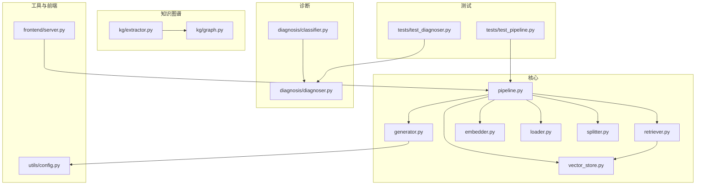

图表来源
- [src/kag_pro/core/pipeline.py](file://src/kag_pro/core/pipeline.py)
- [src/kag_pro/core/generator.py](file://src/kag_pro/core/generator.py)
- [src/kag_pro/core/retriever.py](file://src/kag_pro/core/retriever.py)
- [src/kag_pro/core/embedder.py](file://src/kag_pro/core/embedder.py)
- [src/kag_pro/core/vector_store.py](file://src/kag_pro/core/vector_store.py)
- [src/kag_pro/core/loader.py](file://src/kag_pro/core/loader.py)
- [src/kag_pro/core/splitter.py](file://src/kag_pro/core/splitter.py)
- [src/kag_pro/kg/extractor.py](file://src/kag_pro/kg/extractor.py)
- [src/kag_pro/kg/graph.py](file://src/kag_pro/kg/graph.py)
- [src/kag_pro/diagnosis/classifier.py](file://src/kag_pro/diagnosis/classifier.py)
- [src/kag_pro/diagnosis/diagnoser.py](file://src/kag_pro/diagnosis/diagnoser.py)
- [src/kag_pro/utils/config.py](file://src/kag_pro/utils/config.py)
- [frontend/server.py](file://frontend/server.py)
- [tests/test_pipeline.py](file://tests/test_pipeline.py)
- [tests/test_diagnoser.py](file://tests/test_diagnoser.py)

章节来源
- [README.md](file://README.md)
- [pyproject.toml](file://pyproject.toml)
- [Makefile](file://Makefile)

## 核心组件
- 流水线 pipeline：串联数据加载、分块、嵌入、索引构建、检索与生成的主入口，负责异常捕获与阶段状态上报。
- 检索 retriever：基于向量相似度召回相关片段，支持过滤与排序策略。
- 生成 generator：调用大模型或本地生成器进行答案合成，处理提示词组装与输出校验。
- 嵌入 embedder：文本向量化，管理模型加载、批大小与设备选择。
- 向量存储 vector_store：持久化向量索引，支持创建、查询、更新与清理。
- 数据加载 loader：读取原始数据源（文本、CSV、JSON等），统一为内部表示。
- 分块 splitter：按长度/语义切分文本，控制重叠与边界处理。
- 知识图谱 extractor/graph：从文本抽取三元组并维护图结构，用于增强检索与解释。
- 诊断 classifier/diagnoser：对错误进行分类与归因，辅助快速定位根因。
- 配置 utils/config：集中管理运行参数、路径、模型与后端选项。
- 前端 server：提供HTTP接口，便于集成与可视化调试。

章节来源
- [src/kag_pro/core/pipeline.py](file://src/kag_pro/core/pipeline.py)
- [src/kag_pro/core/retriever.py](file://src/kag_pro/core/retriever.py)
- [src/kag_pro/core/generator.py](file://src/kag_pro/core/generator.py)
- [src/kag_pro/core/embedder.py](file://src/kag_pro/core/embedder.py)
- [src/kag_pro/core/vector_store.py](file://src/kag_pro/core/vector_store.py)
- [src/kag_pro/core/loader.py](file://src/kag_pro/core/loader.py)
- [src/kag_pro/core/splitter.py](file://src/kag_pro/core/splitter.py)
- [src/kag_pro/kg/extractor.py](file://src/kag_pro/kg/extractor.py)
- [src/kag_pro/kg/graph.py](file://src/kag_pro/kg/graph.py)
- [src/kag_pro/diagnosis/classifier.py](file://src/kag_pro/diagnosis/classifier.py)
- [src/kag_pro/diagnosis/diagnoser.py](file://src/kag_pro/diagnosis/diagnoser.py)
- [src/kag_pro/utils/config.py](file://src/kag_pro/utils/config.py)
- [frontend/server.py](file://frontend/server.py)

## 架构总览
下图展示一次典型“问答”请求在系统中的流转过程，包括数据准备、检索、生成与结果返回。

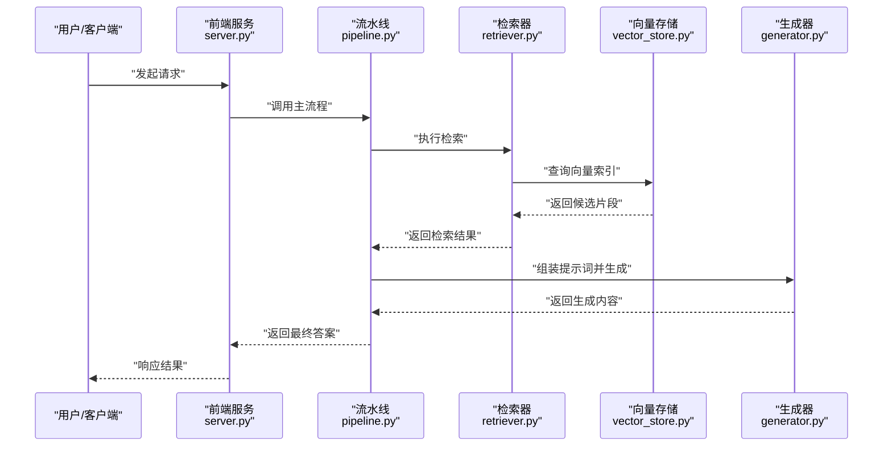

图表来源
- [frontend/server.py](file://frontend/server.py)
- [src/kag_pro/core/pipeline.py](file://src/kag_pro/core/pipeline.py)
- [src/kag_pro/core/retriever.py](file://src/kag_pro/core/retriever.py)
- [src/kag_pro/core/vector_store.py](file://src/kag_pro/core/vector_store.py)
- [src/kag_pro/core/generator.py](file://src/kag_pro/core/generator.py)

## 详细组件分析

### 流水线 pipeline 的异常流与重试
- 目标：确保各阶段异常可追踪、可恢复；记录阶段耗时与错误类型；支持可选重试与降级。
- 关键点：
  - 阶段级try/catch与错误分类
  - 中间状态落盘与断点续跑
  - 超时与熔断保护
  - 指标上报（耗时、错误率）

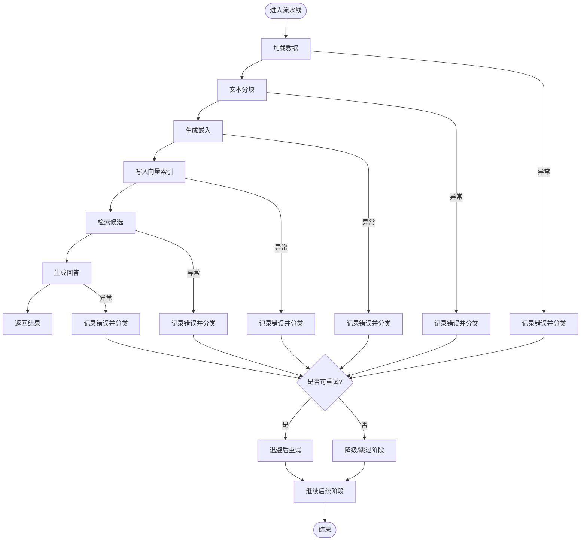

图表来源
- [src/kag_pro/core/pipeline.py](file://src/kag_pro/core/pipeline.py)

章节来源
- [src/kag_pro/core/pipeline.py](file://src/kag_pro/core/pipeline.py)

### 检索器 retriever 与向量存储 vector_store 的交互
- 目标：高效召回相关片段，保证准确性与延迟平衡。
- 关键点：
  - 相似度阈值与Top-K调优
  - 批量查询与缓存命中
  - 索引重建与增量更新
  - 磁盘/内存占用监控

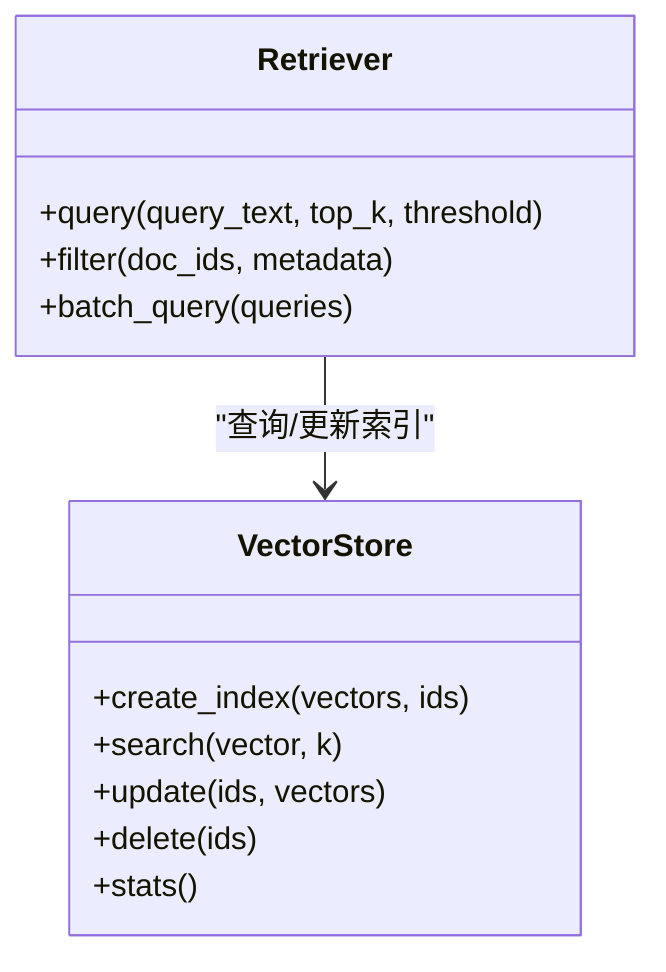

图表来源
- [src/kag_pro/core/retriever.py](file://src/kag_pro/core/retriever.py)
- [src/kag_pro/core/vector_store.py](file://src/kag_pro/core/vector_store.py)

章节来源
- [src/kag_pro/core/retriever.py](file://src/kag_pro/core/retriever.py)
- [src/kag_pro/core/vector_store.py](file://src/kag_pro/core/vector_store.py)

### 生成器 generator 的提示词与输出校验
- 目标：稳定生成高质量答案，避免幻觉与格式错误。
- 关键点：
  - 提示词模板与上下文拼接
  - 输出解析与结构化校验
  - 重试与回退策略（短答案/兜底模板）
  - 敏感信息与合规检查

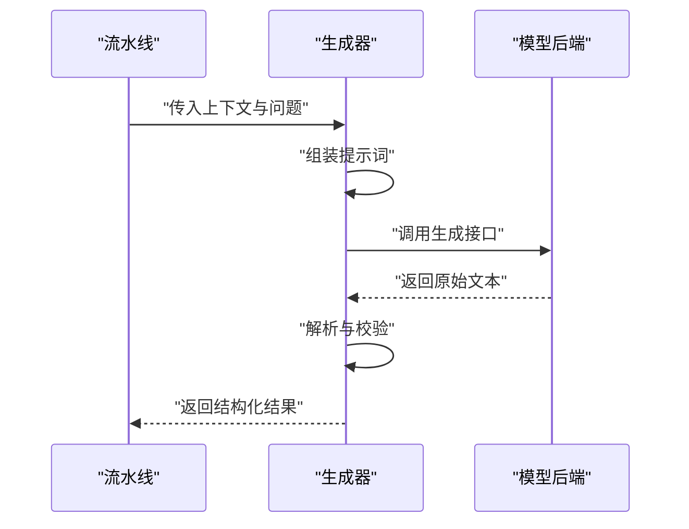

图表来源
- [src/kag_pro/core/generator.py](file://src/kag_pro/core/generator.py)

章节来源
- [src/kag_pro/core/generator.py](file://src/kag_pro/core/generator.py)

### 嵌入 embedder 与模型加载
- 目标：稳定加载嵌入模型，合理分配资源，避免OOM。
- 关键点：
  - 设备选择（CPU/GPU）与显存限制
  - 批大小与并行度
  - 模型权重路径与版本一致性
  - 缓存与预热

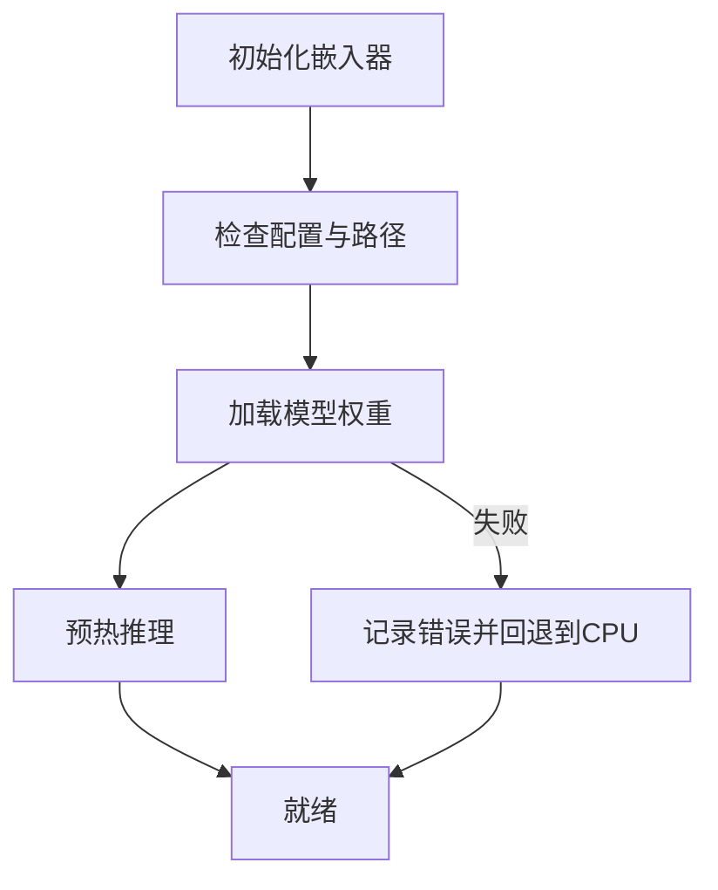

图表来源
- [src/kag_pro/core/embedder.py](file://src/kag_pro/core/embedder.py)

章节来源
- [src/kag_pro/core/embedder.py](file://src/kag_pro/core/embedder.py)

### 数据加载 loader 与分块 splitter
- 目标：可靠读取多格式数据，稳定切分为适合检索的片段。
- 关键点：
  - 编码与换行规范化
  - 空内容与超长段落处理
  - 重叠窗口与边界对齐
  - 进度与断点保存

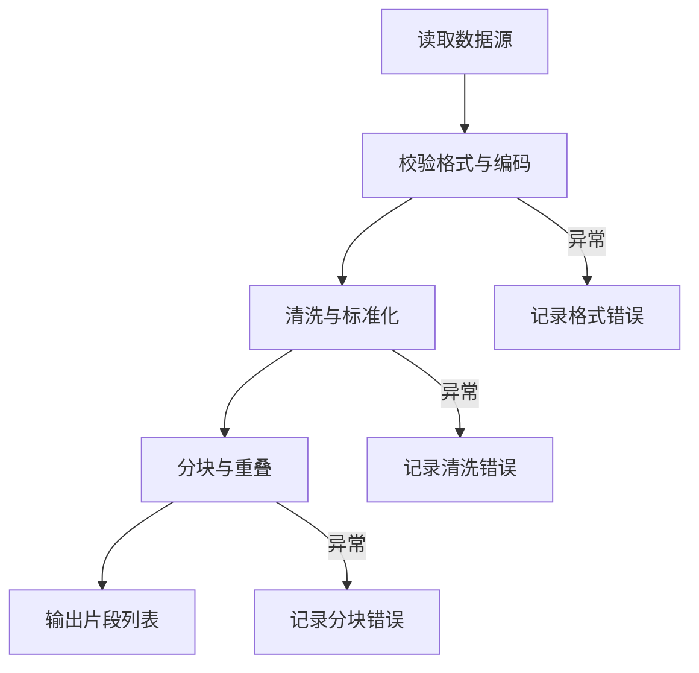

图表来源
- [src/kag_pro/core/loader.py](file://src/kag_pro/core/loader.py)
- [src/kag_pro/core/splitter.py](file://src/kag_pro/core/splitter.py)

章节来源
- [src/kag_pro/core/loader.py](file://src/kag_pro/core/loader.py)
- [src/kag_pro/core/splitter.py](file://src/kag_pro/core/splitter.py)

### 知识图谱 extractor/graph
- 目标：从文本抽取实体与关系，构建可检索的知识图。
- 关键点：
  - 抽取规则/模型选择
  - 去重与合并
  - 图遍历与子图裁剪
  - 与向量检索融合

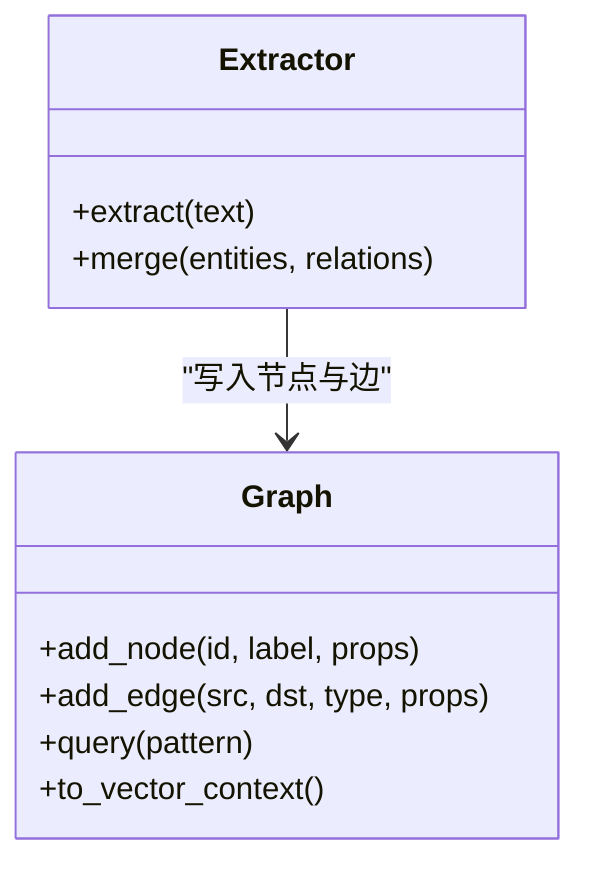

图表来源
- [src/kag_pro/kg/extractor.py](file://src/kag_pro/kg/extractor.py)
- [src/kag_pro/kg/graph.py](file://src/kag_pro/kg/graph.py)

章节来源
- [src/kag_pro/kg/extractor.py](file://src/kag_pro/kg/extractor.py)
- [src/kag_pro/kg/graph.py](file://src/kag_pro/kg/graph.py)

### 诊断 classifier/diagnoser
- 目标：对错误进行分类与归因，辅助快速定位根因。
- 关键点：
  - 错误模式库与规则匹配
  - 置信度评分与建议动作
  - 与流水线集成上报

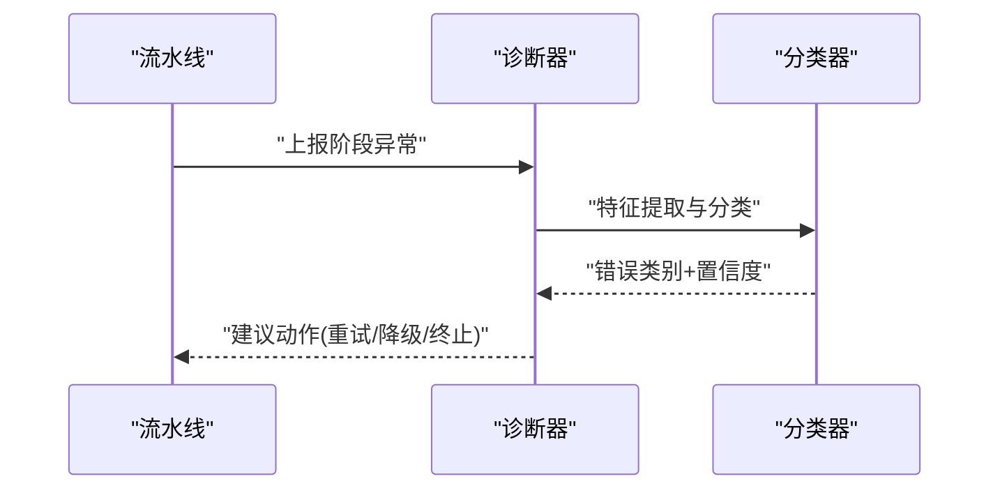

图表来源
- [src/kag_pro/diagnosis/diagnoser.py](file://src/kag_pro/diagnosis/diagnoser.py)
- [src/kag_pro/diagnosis/classifier.py](file://src/kag_pro/diagnosis/classifier.py)

章节来源
- [src/kag_pro/diagnosis/diagnoser.py](file://src/kag_pro/diagnosis/diagnoser.py)
- [src/kag_pro/diagnosis/classifier.py](file://src/kag_pro/diagnosis/classifier.py)

### 配置 utils/config 与前端 server
- 目标：集中管理运行参数，提供便捷的前端访问。
- 关键点：
  - 环境变量与配置文件优先级
  - 默认值与校验
  - 前端路由与错误响应格式

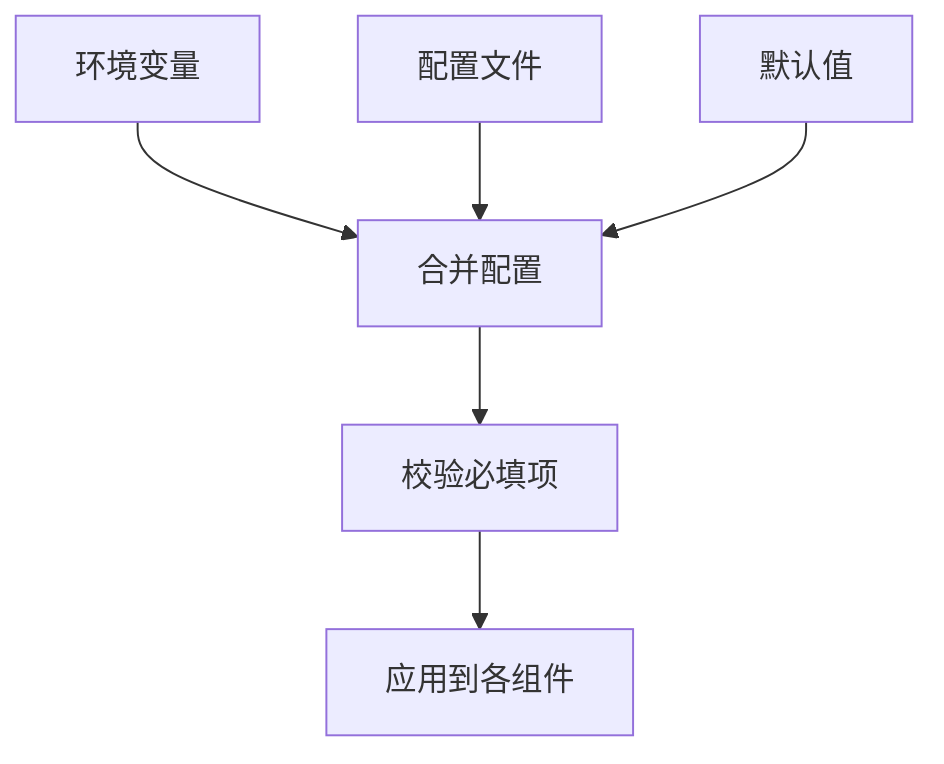

图表来源
- [src/kag_pro/utils/config.py](file://src/kag_pro/utils/config.py)
- [frontend/server.py](file://frontend/server.py)

章节来源
- [src/kag_pro/utils/config.py](file://src/kag_pro/utils/config.py)
- [frontend/server.py](file://frontend/server.py)

## 依赖关系分析
- 外部依赖：Python环境、包管理器、可能的GPU驱动与CUDA、向量数据库后端。
- 内部依赖：core模块间强耦合，通过配置解耦；前端与服务层松耦合。
- 潜在循环：应避免在core与diagnosis之间形成双向导入，必要时使用接口抽象。

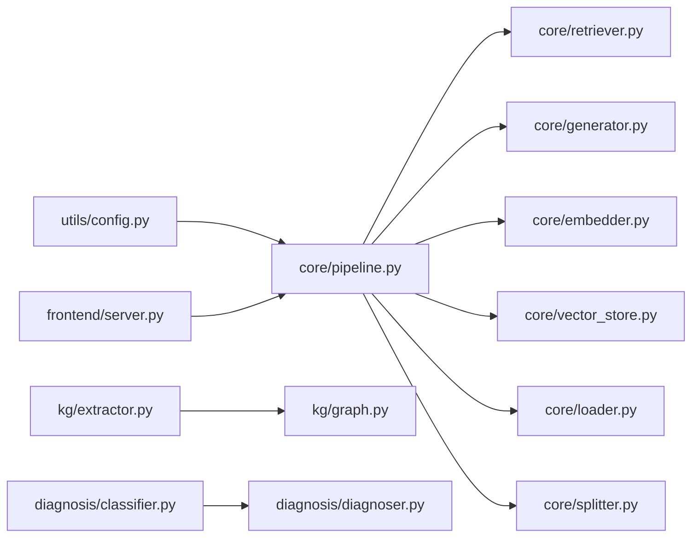

图表来源
- [src/kag_pro/core/pipeline.py](file://src/kag_pro/core/pipeline.py)
- [src/kag_pro/core/retriever.py](file://src/kag_pro/core/retriever.py)
- [src/kag_pro/core/generator.py](file://src/kag_pro/core/generator.py)
- [src/kag_pro/core/embedder.py](file://src/kag_pro/core/embedder.py)
- [src/kag_pro/core/vector_store.py](file://src/kag_pro/core/vector_store.py)
- [src/kag_pro/core/loader.py](file://src/kag_pro/core/loader.py)
- [src/kag_pro/core/splitter.py](file://src/kag_pro/core/splitter.py)
- [src/kag_pro/kg/extractor.py](file://src/kag_pro/kg/extractor.py)
- [src/kag_pro/kg/graph.py](file://src/kag_pro/kg/graph.py)
- [src/kag_pro/diagnosis/classifier.py](file://src/kag_pro/diagnosis/classifier.py)
- [src/kag_pro/diagnosis/diagnoser.py](file://src/kag_pro/diagnosis/diagnoser.py)
- [src/kag_pro/utils/config.py](file://src/kag_pro/utils/config.py)
- [frontend/server.py](file://frontend/server.py)

章节来源
- [pyproject.toml](file://pyproject.toml)
- [Makefile](file://Makefile)

## 性能注意事项
- 内存使用
  - 调整嵌入批大小与并发度，避免峰值内存过高
  - 向量索引采用分页/分片存储，减少一次性加载
  - 及时释放中间对象，启用垃圾回收
- CPU瓶颈
  - 识别热点函数（嵌入、相似度计算、正则/分块）
  - 使用向量化操作与并行队列
  - 合理设置线程/进程池大小
- I/O性能
  - 预取与缓存常用数据
  - 使用异步I/O与连接池
  - 压缩与增量更新索引
- 监控指标
  - 端到端延迟、P95/P99
  - 错误率与重试次数
  - 资源利用率（CPU、内存、GPU、磁盘IO）

[本节为通用指导，不直接分析具体文件]

## 故障排查指南

### 安装与环境问题
- 症状
  - 启动时报依赖缺失或版本冲突
  - GPU不可用或CUDA版本不匹配
- 排查步骤
  - 检查环境与依赖声明，确认包版本兼容
  - 验证Python与系统库版本
  - 查看Makefile中的安装命令与脚本
- 常见原因
  - 虚拟环境未激活或混用pip/conda
  - 第三方库ABI不兼容
- 解决方案
  - 重新创建干净环境并按顺序安装依赖
  - 锁定依赖版本，使用requirements或pyproject约束
  - 根据硬件选择正确的后端与驱动

章节来源
- [pyproject.toml](file://pyproject.toml)
- [Makefile](file://Makefile)

### 配置错误
- 症状
  - 启动时缺少必要配置项
  - 路径错误或权限不足
- 排查步骤
  - 核对配置键名、类型与默认值
  - 检查环境变量覆盖是否正确
  - 验证文件路径存在且可读
- 解决方案
  - 使用最小可用配置启动，逐步添加
  - 将敏感信息放入安全的位置并通过环境变量注入

章节来源
- [src/kag_pro/utils/config.py](file://src/kag_pro/utils/config.py)

### 模型加载失败
- 症状
  - 嵌入或生成模型无法加载
  - OOM或显存不足
- 排查步骤
  - 检查模型路径与版本一致性
  - 降低批大小与并发度
  - 切换至CPU或增加显存
- 解决方案
  - 预下载权重并校验完整性
  - 启用模型缓存与预热
  - 使用更小的模型或量化版本

章节来源
- [src/kag_pro/core/embedder.py](file://src/kag_pro/core/embedder.py)
- [src/kag_pro/core/generator.py](file://src/kag_pro/core/generator.py)

### 数据格式错误
- 症状
  - 加载阶段报错或产生空片段
  - 分块后质量差导致检索效果下降
- 排查步骤
  - 检查编码与换行符
  - 过滤空内容与超长段落
  - 调整分块大小与重叠比例
- 解决方案
  - 预处理脚本清洗数据
  - 引入格式校验与容错逻辑

章节来源
- [src/kag_pro/core/loader.py](file://src/kag_pro/core/loader.py)
- [src/kag_pro/core/splitter.py](file://src/kag_pro/core/splitter.py)

### 检索与索引问题
- 症状
  - 检索结果为空或相关性低
  - 索引构建缓慢或失败
- 排查步骤
  - 检查向量维度与模型匹配
  - 调整相似度阈值与Top-K
  - 观察索引大小与碎片情况
- 解决方案
  - 重建索引并启用增量更新
  - 引入缓存与预取策略

章节来源
- [src/kag_pro/core/retriever.py](file://src/kag_pro/core/retriever.py)
- [src/kag_pro/core/vector_store.py](file://src/kag_pro/core/vector_store.py)

### 生成质量与稳定性
- 症状
  - 输出格式不符合预期
  - 重复或无意义内容
- 排查步骤
  - 检查提示词模板与上下文拼接
  - 增加输出校验与重试
  - 引入后处理与去重
- 解决方案
  - 固定随机种子与温度参数
  - 使用结构化输出与约束解码

章节来源
- [src/kag_pro/core/generator.py](file://src/kag_pro/core/generator.py)

### 前端与服务问题
- 症状
  - 前端无法连接后端
  - 接口超时或返回错误码
- 排查步骤
  - 检查端口与跨域配置
  - 查看服务端日志与错误响应体
  - 简化请求以定位问题
- 解决方案
  - 增加重试与超时上限
  - 提供健康检查端点

章节来源
- [frontend/server.py](file://frontend/server.py)

### 诊断与分类
- 症状
  - 错误频发但难以定位根因
- 排查步骤
  - 启用诊断器收集阶段异常
  - 查看分类结果与建议动作
- 解决方案
  - 扩展错误模式库
  - 将诊断结果接入告警系统

章节来源
- [src/kag_pro/diagnosis/diagnoser.py](file://src/kag_pro/diagnosis/diagnoser.py)
- [src/kag_pro/diagnosis/classifier.py](file://src/kag_pro/diagnosis/classifier.py)

### 日志分析与堆栈跟踪解读
- 日志级别
  - DEBUG：详细输入输出与中间变量摘要
  - INFO：关键阶段开始/结束与耗时
  - WARN：可恢复异常与降级动作
  - ERROR：不可恢复异常与堆栈
- 关键字段
  - 阶段名称、错误类型、错误消息、堆栈、时间戳、请求ID
- 解读技巧
  - 自顶向下定位首个异常
  - 关注最近一次变更与配置差异
  - 结合指标曲线判断是否为瞬时抖动

[本节为通用指导，不直接分析具体文件]

### 性能问题定位
- 内存
  - 使用内存快照对比构建前后
  - 定位大对象与未释放引用
- CPU
  - 火焰图定位热点函数
  - 减少不必要的序列化/反序列化
- I/O
  - 监控磁盘读写与网络延迟
  - 使用异步与连接池

[本节为通用指导，不直接分析具体文件]

### 监控与告警配置
- 健康检查
  - 定义就绪与存活探针
  - 定期自检关键依赖（模型、索引、后端）
- 错误率监控
  - 统计各阶段错误数与占比
  - 设置阈值触发告警
- 性能指标
  - 延迟分布、吞吐、资源利用率
  - 指标持久化与可视化

[本节为通用指导，不直接分析具体文件]

### 社区支持与反馈
- 论坛与讨论区
  - 发布问题前搜索历史帖子
  - 提供最小复现与完整日志
- 问题报告模板
  - 环境信息（OS、Python、依赖版本）
  - 配置与命令
  - 错误日志与堆栈
  - 期望行为与实际行为
- 反馈渠道
  - Issue提交、邮件列表、即时通讯群组

[本节为通用指导，不直接分析具体文件]

### 故障知识库（持续更新）
- 条目结构
  - 标题、现象、影响范围、根因、解决步骤、预防措施、关联日志
- 示例条目
  - “模型加载失败：路径不存在或版本不匹配”
  - “检索为空：向量维度不一致或阈值过高”
  - “前端超时：后端负载过高或连接池耗尽”

[本节为通用指导，不直接分析具体文件]

## 结论
通过系统化的错误分类、日志与指标分析、以及针对性的优化策略，可以显著提升KAG-Pro的稳定性与性能。建议在生产环境中部署完善的监控与告警体系，并结合诊断器实现自动化排障。

[本节为总结性内容，不直接分析具体文件]

## 附录

### 快速自检清单
- 环境与依赖是否一致
- 配置项是否齐全且正确
- 模型权重是否存在且可加载
- 数据格式是否规范
- 索引是否成功构建并可查询
- 前端是否能连通后端

[本节为通用指导，不直接分析具体文件]

### 参考测试用例
- 流水线与诊断器的单测可作为回归基线，帮助快速验证修复有效性。

章节来源
- [tests/test_pipeline.py](file://tests/test_pipeline.py)
- [tests/test_diagnoser.py](file://tests/test_diagnoser.py)