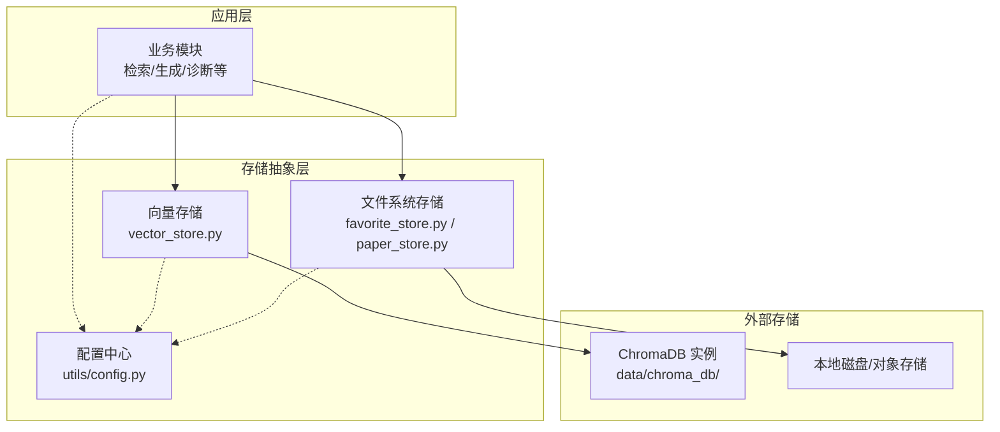
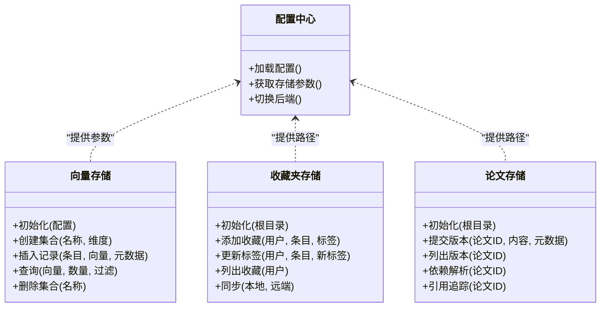
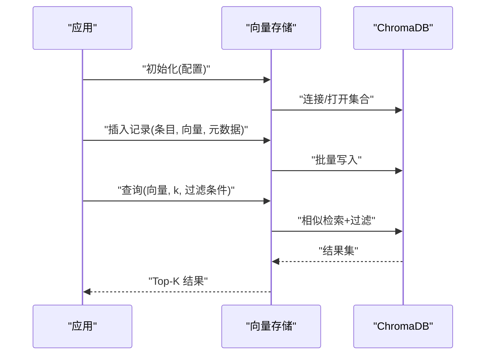
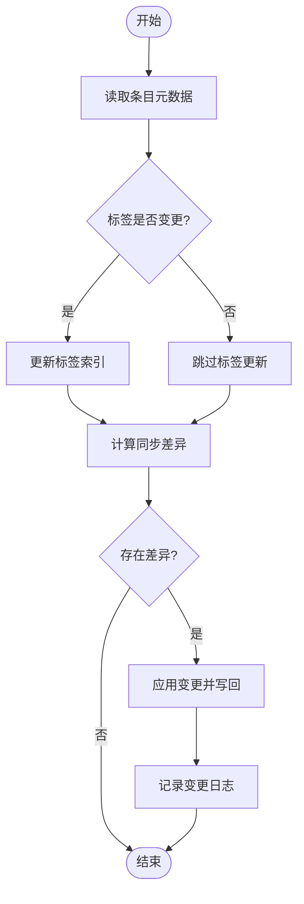
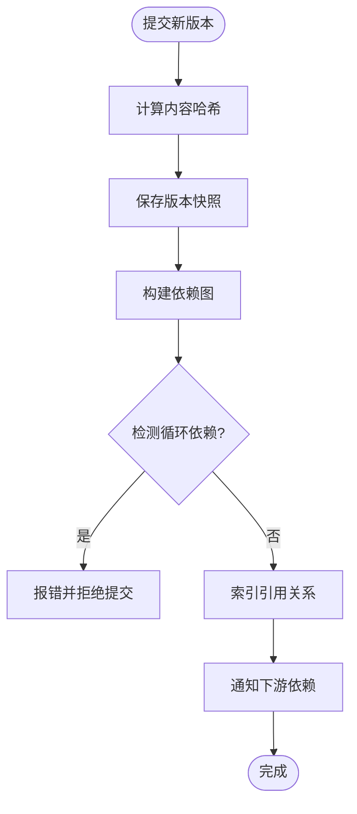
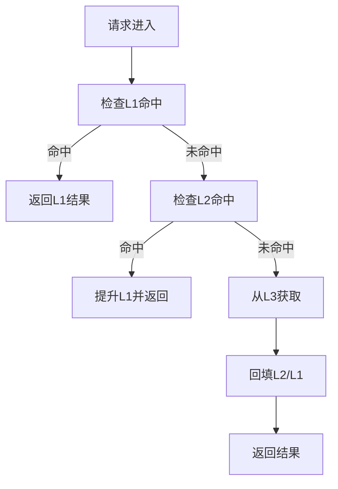
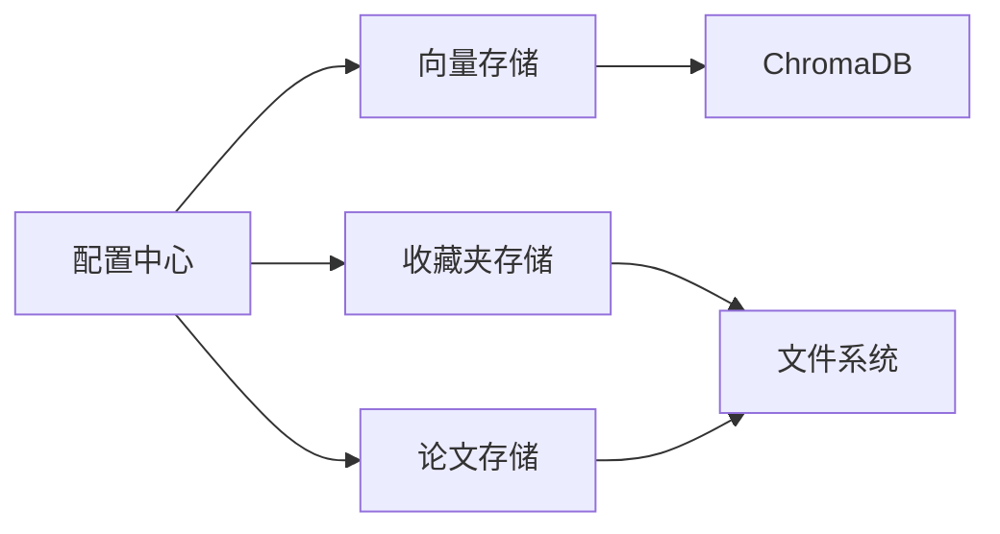

# 存储策略

<cite>
**本文引用的文件**   
- [src/kag_pro/core/vector_store.py](file://src/kag_pro/core/vector_store.py)
- [src/kag_pro/core/favorite_store.py](file://src/kag_pro/core/favorite_store.py)
- [src/kag_pro/core/paper_store.py](file://src/kag_pro/core/paper_store.py)
- [src/kag_pro/utils/config.py](file://src/kag_pro/utils/config.py)
- [data/chroma_db/](file://data/chroma_db/)
</cite>

## 目录
1. [简介](#简介)
2. [项目结构](#项目结构)
3. [核心组件](#核心组件)
4. [架构总览](#架构总览)
5. [详细组件分析](#详细组件分析)
6. [依赖关系分析](#依赖关系分析)
7. [性能考虑](#性能考虑)
8. [故障排除指南](#故障排除指南)
9. [结论](#结论)
10. [附录：配置与示例](#附录配置与示例)

## 简介
本技术文档聚焦KAG-Pro的存储策略，覆盖文件系统存储、向量数据库集成（ChromaDB）、收藏夹系统、论文管理系统、缓存策略、安全与扩展性设计，并提供配置示例与故障排除建议。目标是为开发者与运维人员提供可落地的存储方案说明与最佳实践。

## 项目结构
围绕存储相关能力，仓库采用“按功能域组织”的结构，核心存储逻辑集中在 src/kag_pro/core 下，数据持久化路径位于 data 目录，配置集中于 utils/config.py。

图表来源
- [src/kag_pro/core/vector_store.py](file://src/kag_pro/core/vector_store.py)
- [src/kag_pro/core/favorite_store.py](file://src/kag_pro/core/favorite_store.py)
- [src/kag_pro/core/paper_store.py](file://src/kag_pro/core/paper_store.py)
- [src/kag_pro/utils/config.py](file://src/kag_pro/utils/config.py)
- [data/chroma_db/](file://data/chroma_db/)

章节来源
- [src/kag_pro/core/vector_store.py](file://src/kag_pro/core/vector_store.py)
- [src/kag_pro/core/favorite_store.py](file://src/kag_pro/core/favorite_store.py)
- [src/kag_pro/core/paper_store.py](file://src/kag_pro/core/paper_store.py)
- [src/kag_pro/utils/config.py](file://src/kag_pro/utils/config.py)

## 核心组件
- 向量存储（ChromaDB）：负责文本向量化索引与相似检索，支持集合管理、批量写入、过滤查询与元数据操作。
- 收藏夹系统：基于文件系统实现用户偏好、标签与同步状态，提供增删改查与一致性保障。
- 论文管理系统：以版本化方式管理论文资源及其依赖、引用关系，提供变更追踪与回溯能力。
- 配置中心：集中管理存储后端、路径、连接参数与开关项，为各存储组件提供统一入口。

章节来源
- [src/kag_pro/core/vector_store.py](file://src/kag_pro/core/vector_store.py)
- [src/kag_pro/core/favorite_store.py](file://src/kag_pro/core/favorite_store.py)
- [src/kag_pro/core/paper_store.py](file://src/kag_pro/core/paper_store.py)
- [src/kag_pro/utils/config.py](file://src/kag_pro/utils/config.py)

## 架构总览
整体存储架构遵循“应用-抽象-外部存储”的分层模式，通过配置驱动选择具体后端，保证可扩展性与可替换性。

图表来源
- [src/kag_pro/core/vector_store.py](file://src/kag_pro/core/vector_store.py)
- [src/kag_pro/core/favorite_store.py](file://src/kag_pro/core/favorite_store.py)
- [src/kag_pro/core/paper_store.py](file://src/kag_pro/core/paper_store.py)
- [src/kag_pro/utils/config.py](file://src/kag_pro/utils/config.py)

## 详细组件分析

### 向量数据库集成（ChromaDB）
- 配置要点
  - 集合名、持久化路径、嵌入维度、相似度度量、批大小、超时与重试策略。
  - 通过配置中心注入，避免硬编码。
- 索引策略
  - 批量写入时合并小批次，减少IO与锁竞争。
  - 对高频查询热点集合启用内存映射或预取策略（由后端决定）。
  - 元数据字段建立筛选索引以提升过滤查询性能。
- 查询优化
  - 使用向量+元数据联合过滤，缩小候选集。
  - 分页与游标式查询避免一次性返回大量结果。
  - 对重复查询进行短期缓存（见缓存策略）。
- 错误处理
  - 连接失败重试与退避。
  - 幂等写入（去重键）避免重复记录。
  - 事务性写入失败回滚。

图表来源
- [src/kag_pro/core/vector_store.py](file://src/kag_pro/core/vector_store.py)

章节来源
- [src/kag_pro/core/vector_store.py](file://src/kag_pro/core/vector_store.py)

### 收藏夹系统（用户偏好、标签与同步）
- 目录结构设计
  - 根目录按用户划分，子目录存放收藏条目与标签索引。
  - 每个条目包含元数据文件与可选附件。
- 文件命名规范
  - 条目ID唯一且稳定，文件名与ID一致，便于定位与幂等操作。
  - 标签文件采用“条目ID_标签名”形式，便于快速枚举。
- 元数据管理
  - 每条收藏包含基础信息、时间戳、来源、标签列表与同步状态。
  - 变更日志用于审计与冲突解决。
- 同步机制
  - 增量同步：仅传输新增/修改/删除的条目。
  - 冲突策略：基于时间戳与版本号合并，必要时人工介入。
  - 断点续传：记录已同步偏移量，失败后从断点继续。

图表来源
- [src/kag_pro/core/favorite_store.py](file://src/kag_pro/core/favorite_store.py)

章节来源
- [src/kag_pro/core/favorite_store.py](file://src/kag_pro/core/favorite_store.py)

### 论文管理系统（版本控制、依赖与引用）
- 版本控制
  - 每次提交生成不可变版本快照，附带哈希校验。
  - 分支与标签用于发布管理与回滚。
- 依赖关系
  - 显式声明依赖清单，构建依赖图，检测循环依赖。
  - 变更传播：上游版本升级触发下游重新验证。
- 引用追踪
  - 维护引用图谱，支持溯源与影响面分析。
  - 自动发现未满足引用并提示修复。

图表来源
- [src/kag_pro/core/paper_store.py](file://src/kag_pro/core/paper_store.py)

章节来源
- [src/kag_pro/core/paper_store.py](file://src/kag_pro/core/paper_store.py)

### 缓存策略（多级缓存、失效与监控）
- 多级缓存设计
  - L1：进程内内存缓存（短TTL），适合热点向量与元数据。
  - L2：本地磁盘缓存（长TTL），跨进程共享，降低重复IO。
  - L3：远程存储（ChromaDB/对象存储），作为权威源。
- 失效机制
  - 基于时间过期与事件驱动失效（如版本提交后失效相关缓存）。
  - 分层失效：上层失效不立即清理下层，采用懒失效与后台回收。
- 性能监控
  - 命中率、延迟分布、缓存大小与淘汰率指标上报。
  - 告警阈值与降级策略（如关闭L1以提升稳定性）。

[此图为概念流程，无需图表来源]

### 安全考虑（访问控制、加密与备份）
- 访问控制
  - 基于角色的目录级权限，最小权限原则。
  - 敏感元数据脱敏与审计日志。
- 数据加密
  - 静态数据加密（磁盘/对象存储级别）。
  - 传输加密（TLS）确保客户端到服务端的通道安全。
- 备份策略
  - 定期全量+增量备份，保留多代副本。
  - 恢复演练与RTO/RPO指标跟踪。

[本节为通用指导，无需章节来源]

### 扩展性设计（水平扩展、负载均衡与容错）
- 水平扩展
  - 无状态服务节点横向扩容，存储后端独立扩展（ChromaDB集群/对象存储桶分区）。
- 负载均衡
  - 读写分离与分片路由，按集合或用户ID哈希分片。
- 容错机制
  - 健康检查与自动摘除异常节点。
  - 重试与熔断，避免雪崩效应。
  - 数据一致性：最终一致性模型下的补偿任务与纠偏。

[本节为通用指导，无需章节来源]

## 依赖关系分析
存储组件之间的耦合度较低，主要通过配置中心解耦，便于替换与演进。

图表来源
- [src/kag_pro/core/vector_store.py](file://src/kag_pro/core/vector_store.py)
- [src/kag_pro/core/favorite_store.py](file://src/kag_pro/core/favorite_store.py)
- [src/kag_pro/core/paper_store.py](file://src/kag_pro/core/paper_store.py)
- [src/kag_pro/utils/config.py](file://src/kag_pro/utils/config.py)

章节来源
- [src/kag_pro/core/vector_store.py](file://src/kag_pro/core/vector_store.py)
- [src/kag_pro/core/favorite_store.py](file://src/kag_pro/core/favorite_store.py)
- [src/kag_pro/core/paper_store.py](file://src/kag_pro/core/paper_store.py)
- [src/kag_pro/utils/config.py](file://src/kag_pro/utils/config.py)

## 性能考虑
- 向量检索
  - 合理设置k值与过滤条件，避免全表扫描。
  - 批量写入合并，减少锁与网络往返。
- 文件系统
  - 大目录分片与小文件聚合，避免inode压力。
  - 并发写入加锁与原子替换，保证一致性。
- 缓存
  - 热点预热与自适应TTL，平衡命中率与内存占用。
- 监控
  - 关键路径埋点，观察P95/P99延迟与吞吐。

[本节为通用指导，无需章节来源]

## 故障排除指南
- 常见问题
  - 连接失败：检查ChromaDB地址、端口与认证；确认防火墙与DNS。
  - 写入失败：核对集合名与维度匹配；检查磁盘空间与权限。
  - 查询慢：评估过滤条件复杂度；增加索引或调整k值。
  - 同步不一致：查看变更日志与时间戳；执行一致性校验与修复。
- 定位步骤
  - 开启调试日志，捕获请求ID与上下文。
  - 检查缓存命中率与后端健康状态。
  - 复现最小用例，隔离问题范围。
- 恢复措施
  - 重启服务节点，清理异常会话。
  - 回滚到最近稳定版本快照。
  - 重建索引或集合（谨慎操作，先备份）。

章节来源
- [src/kag_pro/core/vector_store.py](file://src/kag_pro/core/vector_store.py)
- [src/kag_pro/core/favorite_store.py](file://src/kag_pro/core/favorite_store.py)
- [src/kag_pro/core/paper_store.py](file://src/kag_pro/core/paper_store.py)

## 结论
KAG-Pro的存储策略以配置为中心，将向量检索、文件系统与版本化管理有机结合，兼顾性能、一致性与可扩展性。通过合理的索引与缓存设计、完善的安全与容错机制，可在不同规模场景下稳定运行。建议在生产环境持续监控与压测，结合业务特征调优参数与架构细节。

## 附录：配置与示例
- 配置项建议
  - 向量存储：集合名、持久化路径、嵌入维度、相似度度量、批大小、超时与重试次数。
  - 收藏夹：根目录、同步间隔、冲突策略、最大标签数。
  - 论文管理：根目录、分支策略、依赖解析深度、引用索引开关。
  - 缓存：L1容量、L2路径、TTL策略、监控上报频率。
- 示例路径
  - 向量数据库持久化目录：data/chroma_db/
- 操作步骤
  - 初始化：加载配置，创建必要集合与目录结构。
  - 写入：批量插入向量与元数据，确保幂等键。
  - 查询：组合向量相似度与元数据过滤，分页返回。
  - 同步：增量对比差异，应用变更并记录日志。
  - 备份：定期打包快照，校验完整性并归档。

章节来源
- [src/kag_pro/utils/config.py](file://src/kag_pro/utils/config.py)
- [data/chroma_db/](file://data/chroma_db/)