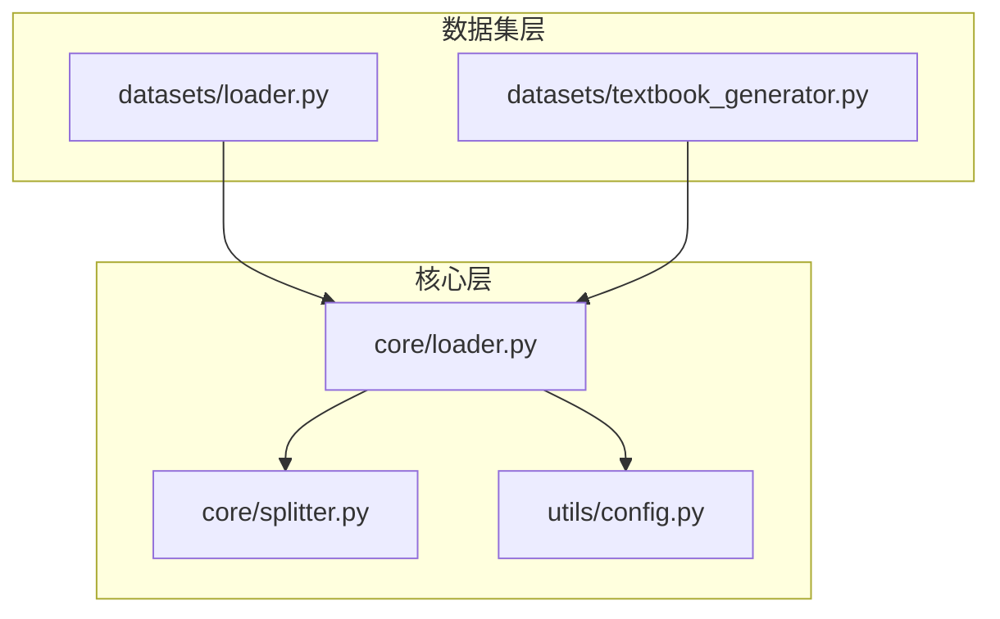
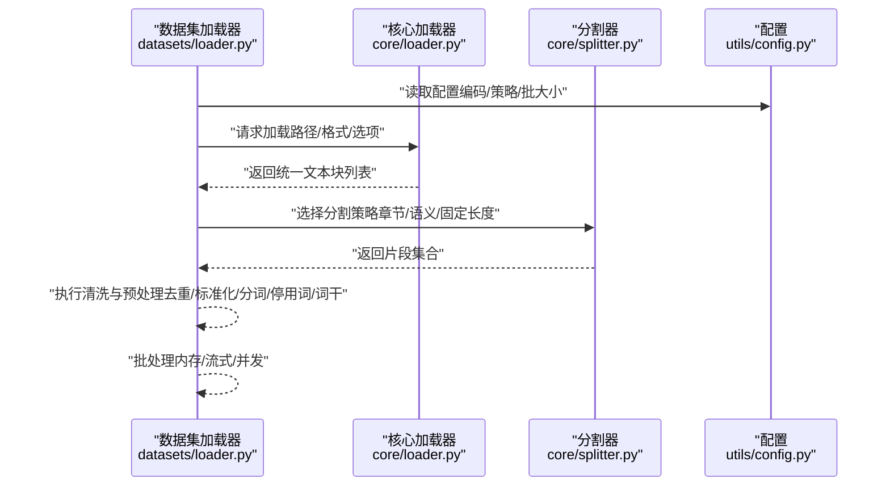
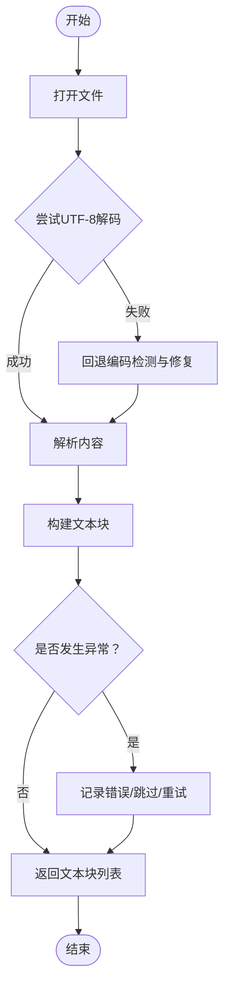
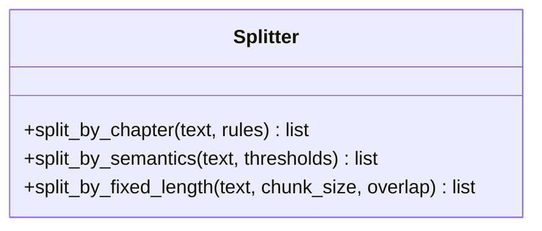
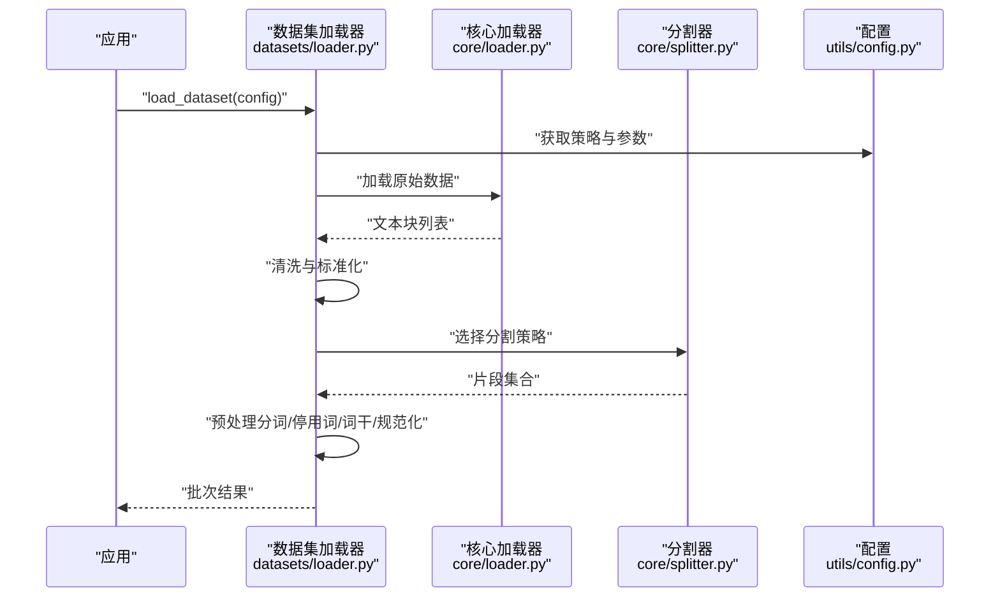
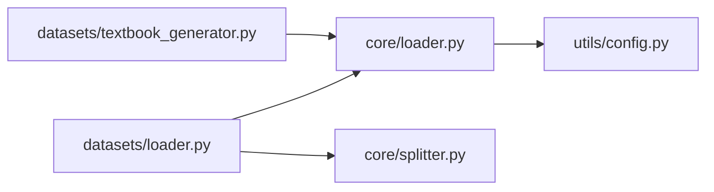

# 数据加载与预处理

<cite>
**本文引用的文件**   
- [src/kag_pro/core/loader.py](file://src/kag_pro/core/loader.py)
- [src/kag_pro/core/splitter.py](file://src/kag_pro/core/splitter.py)
- [src/kag_pro/datasets/loader.py](file://src/kag_pro/datasets/loader.py)
- [src/kag_pro/datasets/textbook_generator.py](file://src/kag_pro/datasets/textbook_generator.py)
- [src/kag_pro/utils/config.py](file://src/kag_pro/utils/config.py)
- [README.md](file://README.md)
</cite>

## 目录
1. [简介](#简介)
2. [项目结构](#项目结构)
3. [核心组件](#核心组件)
4. [架构总览](#架构总览)
5. [详细组件分析](#详细组件分析)
6. [依赖关系分析](#依赖关系分析)
7. [性能考虑](#性能考虑)
8. [故障排查指南](#故障排查指南)
9. [结论](#结论)
10. [附录](#附录)

## 简介
本技术文档聚焦KAG-Pro的数据加载与预处理系统，覆盖以下关键主题：
- 数据加载器工作原理与多格式支持（TXT、JSON、CSV等）
- 编码处理与错误恢复机制
- 文本分割策略（按章节、语义、固定长度）
- 数据清洗流程（去重、标准化、特殊字符过滤、噪声清理）
- 预处理管道（分词、停用词移除、词干提取、文本规范化）
- 批量数据处理（内存管理、流式处理、并发优化）
- 自定义数据加载器开发指南（接口规范与最佳实践）
- 代码示例路径与性能调优建议

## 项目结构
与数据加载和预处理相关的核心模块位于如下位置：
- 数据加载与生成：src/kag_pro/datasets/
- 核心工具：src/kag_pro/core/（包含加载器、分割器等）
- 配置：src/kag_pro/utils/config.py
- 顶层说明：README.md

图表来源
- [src/kag_pro/datasets/loader.py](file://src/kag_pro/datasets/loader.py)
- [src/kag_pro/datasets/textbook_generator.py](file://src/kag_pro/datasets/textbook_generator.py)
- [src/kag_pro/core/loader.py](file://src/kag_pro/core/loader.py)
- [src/kag_pro/core/splitter.py](file://src/kag_pro/core/splitter.py)
- [src/kag_pro/utils/config.py](file://src/kag_pro/utils/config.py)

章节来源
- [README.md](file://README.md)
- [src/kag_pro/datasets/loader.py](file://src/kag_pro/datasets/loader.py)
- [src/kag_pro/datasets/textbook_generator.py](file://src/kag_pro/datasets/textbook_generator.py)
- [src/kag_pro/core/loader.py](file://src/kag_pro/core/loader.py)
- [src/kag_pro/core/splitter.py](file://src/kag_pro/core/splitter.py)
- [src/kag_pro/utils/config.py](file://src/kag_pro/utils/config.py)

## 核心组件
- 数据加载器（core.loader）：负责从多种格式读取原始数据，统一为内部表示；提供编码容错、异常捕获与重试策略。
- 文本分割器（core.splitter）：实现多种分割策略（按章节、语义、固定长度），并输出可被下游处理的片段集合。
- 数据集加载器（datasets.loader）：面向具体数据集的封装，协调加载、清洗、分割与批处理。
- 教材生成器（datasets.textbook_generator）：将结构化或半结构化内容组装为教材类文本，供后续处理。
- 配置（utils.config）：集中管理加载、清洗、分割与批处理的参数。

章节来源
- [src/kag_pro/core/loader.py](file://src/kag_pro/core/loader.py)
- [src/kag_pro/core/splitter.py](file://src/kag_pro/core/splitter.py)
- [src/kag_pro/datasets/loader.py](file://src/kag_pro/datasets/loader.py)
- [src/kag_pro/datasets/textbook_generator.py](file://src/kag_pro/datasets/textbook_generator.py)
- [src/kag_pro/utils/config.py](file://src/kag_pro/utils/config.py)

## 架构总览
整体数据流水线由“加载→清洗→分割→预处理→批处理”构成，各阶段通过配置驱动，具备可扩展性与容错能力。

图表来源
- [src/kag_pro/datasets/loader.py](file://src/kag_pro/datasets/loader.py)
- [src/kag_pro/core/loader.py](file://src/kag_pro/core/loader.py)
- [src/kag_pro/core/splitter.py](file://src/kag_pro/core/splitter.py)
- [src/kag_pro/utils/config.py](file://src/kag_pro/utils/config.py)

## 详细组件分析

### 数据加载器（core.loader）
职责与特性
- 多格式支持：针对TXT、JSON、CSV等常见格式提供解析入口，统一转换为内部文本块结构。
- 编码处理：优先使用UTF-8，失败时回退到常用编码（如GBK/GB2312/ISO-8859-1），并提供解码错误修复策略。
- 错误恢复：对IO异常、解析异常进行捕获与记录，支持跳过坏记录、重试与最小化损失读取。
- 元数据保留：在可能的情况下保留源文件路径、行号、时间戳等元信息，便于溯源与调试。

典型调用流程
- 输入：文件路径、格式标识、编码策略、错误恢复选项
- 处理：打开文件→尝试解码→解析内容→构建文本块→异常处理与日志
- 输出：文本块序列（含可选元数据）

图表来源
- [src/kag_pro/core/loader.py](file://src/kag_pro/core/loader.py)

章节来源
- [src/kag_pro/core/loader.py](file://src/kag_pro/core/loader.py)

### 文本分割器（core.splitter）
支持的策略
- 按章节分割：基于标题层级、段落边界或特定标记进行切分，适合结构化文档。
- 语义分割：依据句子/段落语义连贯性进行切分，保持上下文完整性。
- 固定长度分割：按字符或token数量切分，适用于需要严格长度约束的场景。

策略选择建议
- 结构化强、层次清晰：优先按章节分割
- 自然语言为主、需保持语义：优先语义分割
- 模型输入长度受限：优先固定长度分割

图表来源
- [src/kag_pro/core/splitter.py](file://src/kag_pro/core/splitter.py)

章节来源
- [src/kag_pro/core/splitter.py](file://src/kag_pro/core/splitter.py)

### 数据集加载器（datasets.loader）
职责与特性
- 编排加载、清洗、分割与预处理步骤，形成端到端的数据管线。
- 根据配置动态选择分割策略与预处理规则。
- 提供批处理接口，支持内存友好与流式处理。

典型流程
- 读取配置 → 加载原始数据 → 清洗（去重/标准化/过滤） → 分割 → 预处理（分词/停用词/词干/规范化） → 批处理输出

图表来源
- [src/kag_pro/datasets/loader.py](file://src/kag_pro/datasets/loader.py)
- [src/kag_pro/core/loader.py](file://src/kag_pro/core/loader.py)
- [src/kag_pro/core/splitter.py](file://src/kag_pro/core/splitter.py)
- [src/kag_pro/utils/config.py](file://src/kag_pro/utils/config.py)

章节来源
- [src/kag_pro/datasets/loader.py](file://src/kag_pro/datasets/loader.py)

### 教材生成器（datasets/textbook_generator）
职责与特性
- 将结构化或半结构化内容（如知识点、题目、解释）组合为教材类文本。
- 支持模板填充、顺序控制与内容校验。
- 与加载器协同，确保生成内容与后续清洗/分割流程兼容。

章节来源
- [src/kag_pro/datasets/textbook_generator.py](file://src/kag_pro/datasets/textbook_generator.py)

### 配置（utils.config）
职责与特性
- 集中管理加载、清洗、分割与批处理的参数，包括编码策略、分割阈值、批大小、并发度等。
- 提供默认值与校验逻辑，确保运行时稳定性。

章节来源
- [src/kag_pro/utils/config.py](file://src/kag_pro/utils/config.py)

## 依赖关系分析
组件间依赖关系如下：
- datasets.loader 依赖 core.loader 与 core.splitter
- core.loader 依赖 utils.config
- datasets.textbook_generator 依赖 core.loader

图表来源
- [src/kag_pro/datasets/loader.py](file://src/kag_pro/datasets/loader.py)
- [src/kag_pro/core/loader.py](file://src/kag_pro/core/loader.py)
- [src/kag_pro/core/splitter.py](file://src/kag_pro/core/splitter.py)
- [src/kag_pro/datasets/textbook_generator.py](file://src/kag_pro/datasets/textbook_generator.py)
- [src/kag_pro/utils/config.py](file://src/kag_pro/utils/config.py)

章节来源
- [src/kag_pro/datasets/loader.py](file://src/kag_pro/datasets/loader.py)
- [src/kag_pro/core/loader.py](file://src/kag_pro/core/loader.py)
- [src/kag_pro/core/splitter.py](file://src/kag_pro/core/splitter.py)
- [src/kag_pro/datasets/textbook_generator.py](file://src/kag_pro/datasets/textbook_generator.py)
- [src/kag_pro/utils/config.py](file://src/kag_pro/utils/config.py)

## 性能考虑
- 内存管理
  - 采用流式读取大文件，避免一次性载入全部数据。
  - 使用生成器与迭代器减少中间对象创建。
- 批处理
  - 合理设置批大小，平衡吞吐与内存占用。
  - 对CPU密集型预处理（分词、词干提取）启用并行。
- 并发优化
  - I/O密集任务（文件读取、网络下载）使用异步或线程池。
  - CPU密集任务使用进程池以避免GIL限制。
- 缓存与复用
  - 对重复计算（如停用词表、词干映射）进行缓存。
  - 对稳定数据源的结果进行持久化缓存，加速二次运行。

[本节为通用指导，不直接分析具体文件]

## 故障排查指南
常见问题与定位方法
- 编码错误
  - 现象：解码失败或乱码
  - 排查：检查配置文件中的编码策略与回退顺序；查看加载器的错误日志与恢复记录
- 解析异常
  - 现象：JSON/CSV格式错误导致中断
  - 排查：确认文件格式与分隔符；启用跳过坏记录模式；检查字段映射
- 分割质量不佳
  - 现象：片段过短/过长或语义断裂
  - 排查：调整分割阈值与重叠比例；切换分割策略；检查输入文本结构
- 内存溢出
  - 现象：进程崩溃或卡顿
  - 排查：减小批大小；启用流式处理；释放中间引用；监控峰值内存

章节来源
- [src/kag_pro/core/loader.py](file://src/kag_pro/core/loader.py)
- [src/kag_pro/core/splitter.py](file://src/kag_pro/core/splitter.py)
- [src/kag_pro/datasets/loader.py](file://src/kag_pro/datasets/loader.py)
- [src/kag_pro/utils/config.py](file://src/kag_pro/utils/config.py)

## 结论
KAG-Pro的数据加载与预处理系统以模块化设计为核心，通过配置驱动的加载、清洗、分割与预处理流程，提供了良好的扩展性与鲁棒性。结合流式与并发优化，可在大规模数据场景下保持稳定与高效。建议在实际使用中根据数据类型与下游需求选择合适的分割策略与批处理参数，并充分利用错误恢复与日志机制提升系统可靠性。

[本节为总结性内容，不直接分析具体文件]

## 附录

### 自定义数据加载器开发指南
- 接口规范
  - 定义统一的加载函数签名，接收路径、格式与配置参数，返回文本块序列。
  - 遵循错误恢复约定：记录异常、可选择跳过或重试。
  - 保留必要元数据（源路径、行号、时间戳）。
- 最佳实践
  - 使用生成器与流式读取降低内存占用。
  - 对解析逻辑进行单元测试，覆盖异常分支。
  - 将策略与参数外置至配置，便于运行时切换。
- 集成方式
  - 在数据集加载器中注册新格式解析器。
  - 更新配置项以支持新策略与参数。

章节来源
- [src/kag_pro/datasets/loader.py](file://src/kag_pro/datasets/loader.py)
- [src/kag_pro/core/loader.py](file://src/kag_pro/core/loader.py)
- [src/kag_pro/utils/config.py](file://src/kag_pro/utils/config.py)