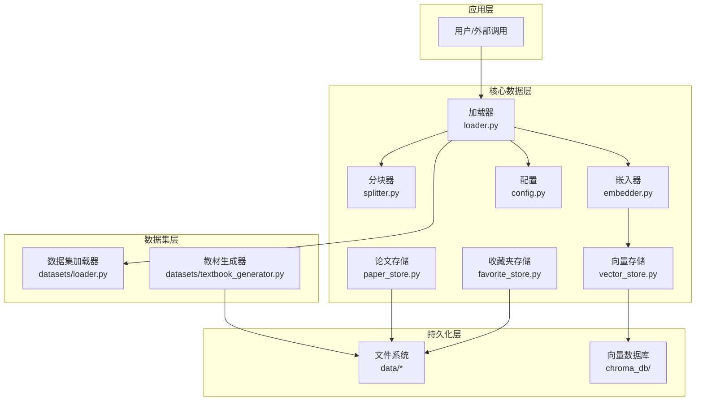
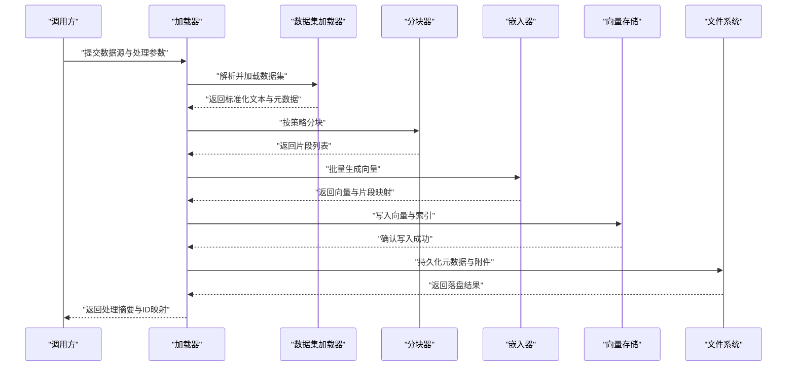
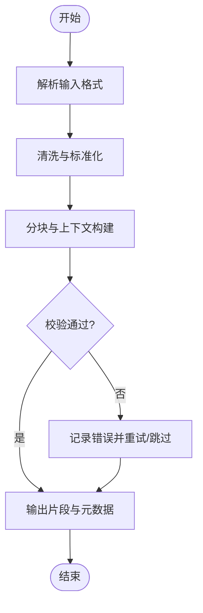
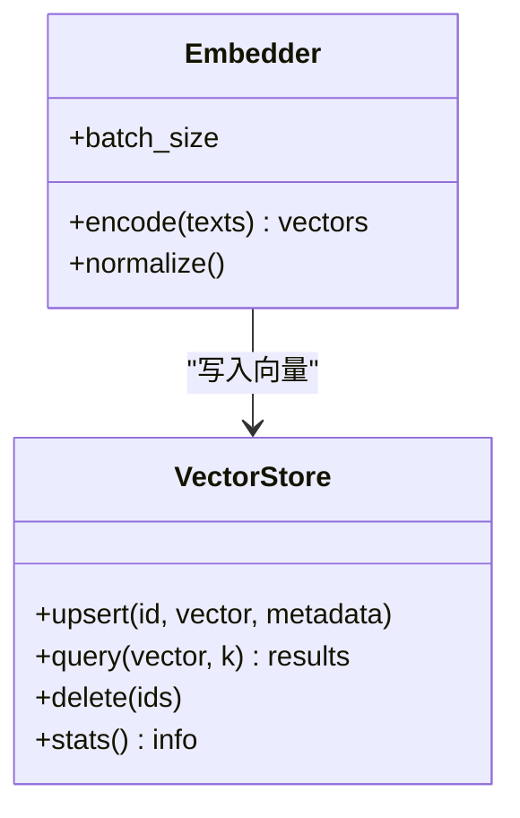
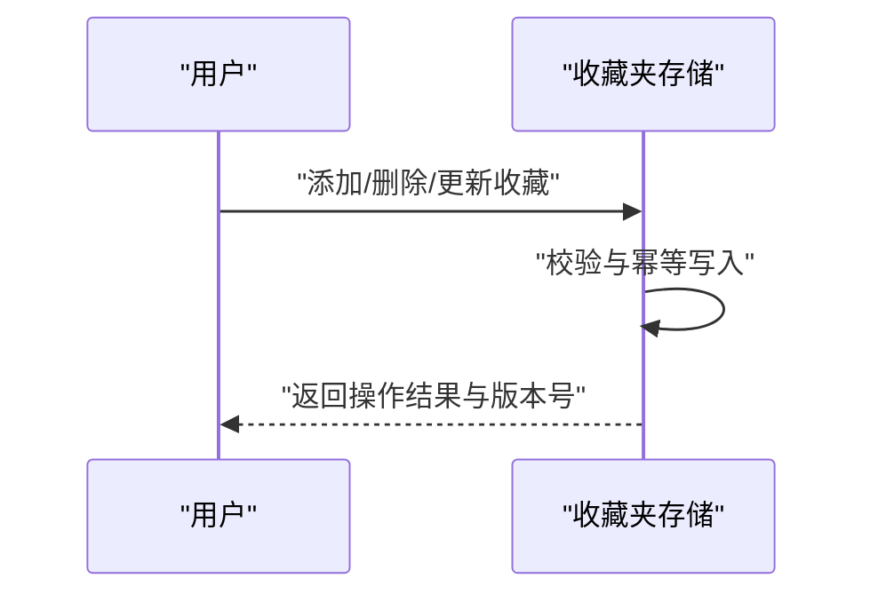
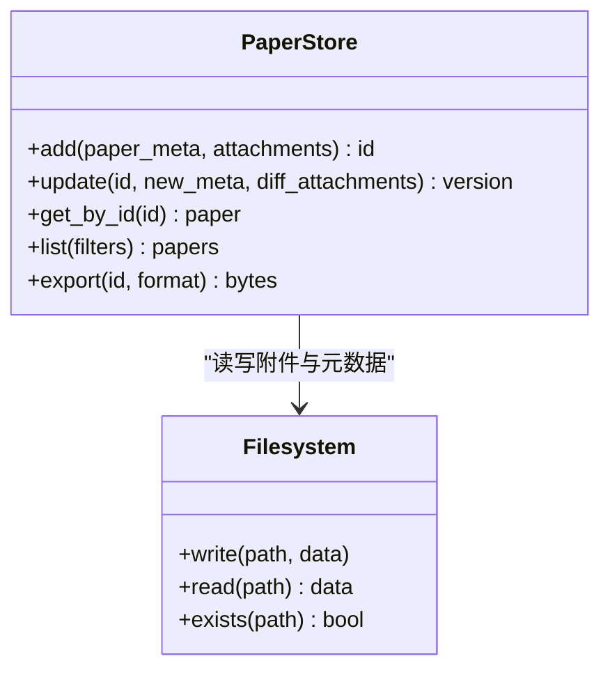
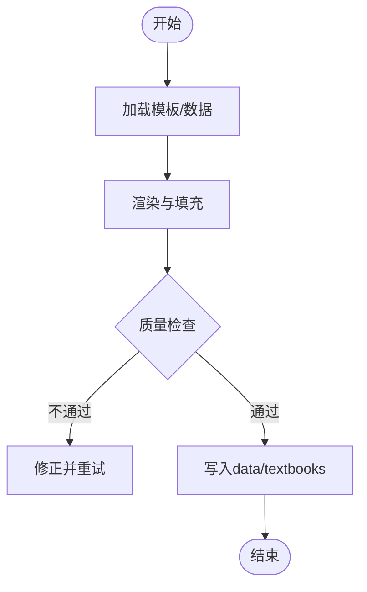
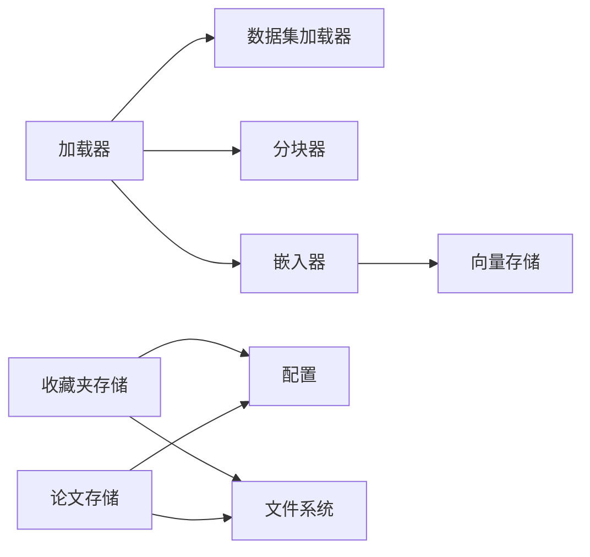

# 数据管理

<cite>
**本文引用的文件**   
- [src/kag_pro/core/loader.py](file://src/kag_pro/core/loader.py)
- [src/kag_pro/datasets/loader.py](file://src/kag_pro/datasets/loader.py)
- [src/kag_pro/datasets/textbook_generator.py](file://src/kag_pro/datasets/textbook_generator.py)
- [src/kag_pro/core/favorite_store.py](file://src/kag_pro/core/favorite_store.py)
- [src/kag_pro/core/paper_store.py](file://src/kag_pro/core/paper_store.py)
- [src/kag_pro/core/vector_store.py](file://src/kag_pro/core/vector_store.py)
- [src/kag_pro/core/embedder.py](file://src/kag_pro/core/embedder.py)
- [src/kag_pro/core/splitter.py](file://src/kag_pro/core/splitter.py)
- [src/kag_pro/utils/config.py](file://src/kag_pro/utils/config.py)
- [data/chroma_db/](file://data/chroma_db/)
- [data/textbooks/](file://data/textbooks/)
- [data/favorites/](file://data/favorites/)
- [data/papers/](file://data/papers/)
</cite>

## 目录
1. [简介](#简介)
2. [项目结构](#项目结构)
3. [核心组件](#核心组件)
4. [架构总览](#架构总览)
5. [详细组件分析](#详细组件分析)
6. [依赖关系分析](#依赖关系分析)
7. [性能考虑](#性能考虑)
8. [故障排除指南](#故障排除指南)
9. [结论](#结论)
10. [附录](#附录)

## 简介
本技术文档面向KAG-Pro的数据管理系统，聚焦于数据结构设计、数据加载与预处理、存储策略、收藏夹与论文管理、数据迁移方案、访问模式最佳实践以及数据生命周期管理。文档旨在帮助开发者与维护者理解系统的数据流、关键模块职责与扩展点，并提供可操作的实践建议与排障指引。

## 项目结构
数据相关代码主要分布在以下位置：
- 核心数据管道与存储抽象：core 目录（加载器、分块器、嵌入器、向量存储、收藏夹与论文存储）
- 数据集与教材生成：datasets 目录（通用加载器与教材生成器）
- 配置与工具：utils 目录（配置读取）
- 持久化数据：data 目录（chroma_db、textbooks、favorites、papers）

图表来源
- [src/kag_pro/core/loader.py](file://src/kag_pro/core/loader.py)
- [src/kag_pro/datasets/loader.py](file://src/kag_pro/datasets/loader.py)
- [src/kag_pro/datasets/textbook_generator.py](file://src/kag_pro/datasets/textbook_generator.py)
- [src/kag_pro/core/splitter.py](file://src/kag_pro/core/splitter.py)
- [src/kag_pro/core/embedder.py](file://src/kag_pro/core/embedder.py)
- [src/kag_pro/core/vector_store.py](file://src/kag_pro/core/vector_store.py)
- [src/kag_pro/core/favorite_store.py](file://src/kag_pro/core/favorite_store.py)
- [src/kag_pro/core/paper_store.py](file://src/kag_pro/core/paper_store.py)
- [src/kag_pro/utils/config.py](file://src/kag_pro/utils/config.py)
- [data/chroma_db/](file://data/chroma_db/)
- [data/textbooks/](file://data/textbooks/)
- [data/favorites/](file://data/favorites/)
- [data/papers/](file://data/papers/)

章节来源
- [src/kag_pro/core/loader.py](file://src/kag_pro/core/loader.py)
- [src/kag_pro/datasets/loader.py](file://src/kag_pro/datasets/loader.py)
- [src/kag_pro/datasets/textbook_generator.py](file://src/kag_pro/datasets/textbook_generator.py)
- [src/kag_pro/core/splitter.py](file://src/kag_pro/core/splitter.py)
- [src/kag_pro/core/embedder.py](file://src/kag_pro/core/embedder.py)
- [src/kag_pro/core/vector_store.py](file://src/kag_pro/core/vector_store.py)
- [src/kag_pro/core/favorite_store.py](file://src/kag_pro/core/favorite_store.py)
- [src/kag_pro/core/paper_store.py](file://src/kag_pro/core/paper_store.py)
- [src/kag_pro/utils/config.py](file://src/kag_pro/utils/config.py)

## 核心组件
本节概述数据管理的关键组件及其职责边界：
- 加载器：统一入口，协调数据集加载、清洗、分块、向量化与入库流程
- 分块器：将长文本切分为适合检索的片段，维护上下文与元信息
- 嵌入器：将文本片段转换为向量表示，供向量检索使用
- 向量存储：封装向量数据库操作，提供索引、查询与更新能力
- 收藏夹存储：持久化用户偏好与收藏项，支持增删改查与同步
- 论文存储：管理论文元数据、版本与关联资源，支持增量更新
- 配置：集中管理路径、模型参数、存储后端等运行时配置

章节来源
- [src/kag_pro/core/loader.py](file://src/kag_pro/core/loader.py)
- [src/kag_pro/core/splitter.py](file://src/kag_pro/core/splitter.py)
- [src/kag_pro/core/embedder.py](file://src/kag_pro/core/embedder.py)
- [src/kag_pro/core/vector_store.py](file://src/kag_pro/core/vector_store.py)
- [src/kag_pro/core/favorite_store.py](file://src/kag_pro/core/favorite_store.py)
- [src/kag_pro/core/paper_store.py](file://src/kag_pro/core/paper_store.py)
- [src/kag_pro/utils/config.py](file://src/kag_pro/utils/config.py)

## 架构总览
数据从原始输入到可检索状态的整体流程如下：
- 输入来源：本地文本、结构化数据集或外部数据源
- 预处理：格式解析、清洗、标准化、分块
- 向量化：通过嵌入器生成向量
- 存储：向量存入向量数据库；元数据与附件落盘至文件系统
- 检索：基于向量相似度与元数据过滤进行召回
- 用户资产：收藏夹与论文库独立持久化，支持版本与同步

图表来源
- [src/kag_pro/core/loader.py](file://src/kag_pro/core/loader.py)
- [src/kag_pro/datasets/loader.py](file://src/kag_pro/datasets/loader.py)
- [src/kag_pro/core/splitter.py](file://src/kag_pro/core/splitter.py)
- [src/kag_pro/core/embedder.py](file://src/kag_pro/core/embedder.py)
- [src/kag_pro/core/vector_store.py](file://src/kag_pro/core/vector_store.py)

## 详细组件分析

### 数据加载与预处理
- 目标：统一多格式输入，完成清洗、标准化与分块，输出稳定的中间表示
- 关键点：
  - 文件格式支持：文本、常见结构化数据（由数据集加载器负责解析）
  - 清洗与标准化：去噪、编码统一、空白与标点规范化、重复检测
  - 分块策略：固定长度、语义边界、重叠窗口，保留上下文与来源定位
  - 批处理：对大集合采用分批处理以降低内存峰值
  - 错误恢复：记录失败条目与原因，支持重试与跳过策略

图表来源
- [src/kag_pro/datasets/loader.py](file://src/kag_pro/datasets/loader.py)
- [src/kag_pro/core/splitter.py](file://src/kag_pro/core/splitter.py)

章节来源
- [src/kag_pro/datasets/loader.py](file://src/kag_pro/datasets/loader.py)
- [src/kag_pro/core/splitter.py](file://src/kag_pro/core/splitter.py)

### 向量化与向量存储
- 目标：将文本片段转换为高维向量，建立高效检索索引
- 关键点：
  - 嵌入器：支持批量推理、维度对齐、异常值处理
  - 向量存储：提供追加、更新、删除、相似性搜索与分页
  - 索引策略：根据数据规模选择合适索引与分区
  - 一致性：写入前校验向量与元数据对应关系，确保查询正确性

图表来源
- [src/kag_pro/core/embedder.py](file://src/kag_pro/core/embedder.py)
- [src/kag_pro/core/vector_store.py](file://src/kag_pro/core/vector_store.py)

章节来源
- [src/kag_pro/core/embedder.py](file://src/kag_pro/core/embedder.py)
- [src/kag_pro/core/vector_store.py](file://src/kag_pro/core/vector_store.py)

### 收藏夹系统
- 目标：持久化用户偏好与收藏项，支持跨会话同步
- 关键点：
  - 数据结构：用户标识、收藏项ID、时间戳、标签、备注
  - 存储策略：JSON/SQLite/轻量KV（依据配置），保证幂等写入
  - 同步机制：增量变更日志、冲突合并策略（以最新时间戳为准）
  - 权限与隔离：按用户命名空间隔离，避免交叉污染

图表来源
- [src/kag_pro/core/favorite_store.py](file://src/kag_pro/core/favorite_store.py)

章节来源
- [src/kag_pro/core/favorite_store.py](file://src/kag_pro/core/favorite_store.py)

### 论文管理系统
- 目标：管理论文元数据、版本与附件，支持检索与导出
- 关键点：
  - 元数据模型：标题、作者、年份、DOI、关键词、摘要、来源URL
  - 版本管理：每次更新生成新版本号，保留历史快照
  - 附件管理：PDF/全文文本分离存储，保持与元数据关联
  - 增量更新：基于哈希或时间戳判断是否拉取新内容

图表来源
- [src/kag_pro/core/paper_store.py](file://src/kag_pro/core/paper_store.py)

章节来源
- [src/kag_pro/core/paper_store.py](file://src/kag_pro/core/paper_store.py)

### 教材生成与组织
- 目标：从模板或数据源生成教材文本，按学科/年级组织到文件系统
- 关键点：
  - 生成流程：模板渲染、内容填充、质量检查、落盘
  - 命名规范：按“序号_主题.txt”或“gen_<阶段>_<科目>_<序号>.txt”
  - 目录结构：按学科与学段分层，便于检索与批量处理

图表来源
- [src/kag_pro/datasets/textbook_generator.py](file://src/kag_pro/datasets/textbook_generator.py)

章节来源
- [src/kag_pro/datasets/textbook_generator.py](file://src/kag_pro/datasets/textbook_generator.py)

## 依赖关系分析
- 组件耦合：
  - 加载器依赖数据集加载器、分块器、嵌入器与向量存储
  - 收藏夹与论文存储依赖文件系统与配置
  - 嵌入器与向量存储为底层基础设施，被上层复用
- 外部依赖：
  - 向量数据库（如Chroma）用于近似最近邻检索
  - 配置文件驱动路径与模型参数

图表来源
- [src/kag_pro/core/loader.py](file://src/kag_pro/core/loader.py)
- [src/kag_pro/datasets/loader.py](file://src/kag_pro/datasets/loader.py)
- [src/kag_pro/core/splitter.py](file://src/kag_pro/core/splitter.py)
- [src/kag_pro/core/embedder.py](file://src/kag_pro/core/embedder.py)
- [src/kag_pro/core/vector_store.py](file://src/kag_pro/core/vector_store.py)
- [src/kag_pro/core/favorite_store.py](file://src/kag_pro/core/favorite_store.py)
- [src/kag_pro/core/paper_store.py](file://src/kag_pro/core/paper_store.py)
- [src/kag_pro/utils/config.py](file://src/kag_pro/utils/config.py)

章节来源
- [src/kag_pro/core/loader.py](file://src/kag_pro/core/loader.py)
- [src/kag_pro/datasets/loader.py](file://src/kag_pro/datasets/loader.py)
- [src/kag_pro/core/splitter.py](file://src/kag_pro/core/splitter.py)
- [src/kag_pro/core/embedder.py](file://src/kag_pro/core/embedder.py)
- [src/kag_pro/core/vector_store.py](file://src/kag_pro/core/vector_store.py)
- [src/kag_pro/core/favorite_store.py](file://src/kag_pro/core/favorite_store.py)
- [src/kag_pro/core/paper_store.py](file://src/kag_pro/core/paper_store.py)
- [src/kag_pro/utils/config.py](file://src/kag_pro/utils/config.py)

## 性能考虑
- 批量处理：在分块与嵌入阶段尽量使用批接口，减少I/O与模型调用开销
- 内存控制：对大文件采用流式读取与分片写入，避免一次性加载全部数据
- 索引优化：根据查询延迟与吞吐需求选择合适的向量索引与分区策略
- 缓存策略：对热点元数据与常用片段设置短期缓存，降低重复计算
- 并发控制：写入时加锁或队列化，避免竞争条件；读取侧可并行但需限制并发度

[本节为通用指导，无需具体文件引用]

## 故障排除指南
- 常见问题
  - 向量维度不一致：检查嵌入器输出与向量存储配置的维度匹配
  - 写入失败：确认文件系统权限与磁盘空间，查看错误日志中的路径与文件名
  - 查询无结果：确认索引已构建且查询向量与索引向量同域
  - 同步冲突：以时间戳或版本号为准进行合并，必要时人工介入
- 排查步骤
  - 启用详细日志，记录输入摘要、中间产物大小与错误堆栈
  - 复现最小用例，逐步关闭功能定位问题模块
  - 校验数据完整性（哈希/校验和），对比前后版本差异
- 恢复策略
  - 回滚到最近稳定版本快照
  - 重建索引：先清理旧索引，再重新执行完整流水线
  - 增量修复：仅重放失败批次，避免全量重跑

章节来源
- [src/kag_pro/core/vector_store.py](file://src/kag_pro/core/vector_store.py)
- [src/kag_pro/core/embedder.py](file://src/kag_pro/core/embedder.py)
- [src/kag_pro/core/favorite_store.py](file://src/kag_pro/core/favorite_store.py)
- [src/kag_pro/core/paper_store.py](file://src/kag_pro/core/paper_store.py)

## 结论
KAG-Pro的数据管理系统围绕“加载—预处理—向量化—存储—检索”的主线展开，辅以收藏夹与论文管理两大用户资产子系统。通过清晰的组件边界与可扩展的配置，系统能够支撑大规模教育数据的采集、治理与检索。建议在工程实践中重视批处理、索引优化与并发控制，并建立完善的备份与回滚机制，以确保数据一致性与可用性。

[本节为总结性内容，无需具体文件引用]

## 附录

### 数据结构设计要点
- 片段（Chunk）
  - 字段：文本内容、来源ID、起始位置、结束位置、标签、时间戳
  - 用途：作为检索的基本单元，承载内容与定位信息
- 向量（Vector）
  - 字段：向量数组、维度、归一化标志、来源片段ID
  - 用途：用于相似度检索与聚类
- 收藏夹项（Favorite）
  - 字段：用户ID、目标ID、类型、标签、备注、创建/更新时间
  - 用途：记录用户偏好与快速访问入口
- 论文（Paper）
  - 字段：标题、作者、年份、DOI、关键词、摘要、来源URL、版本、附件路径
  - 用途：学术资源的元数据管理与版本追踪

[本节为概念说明，无需具体文件引用]

### 存储策略与文件系统组织
- 向量数据库：data/chroma_db 存放向量索引与元数据，按集合或命名空间隔离
- 文本与附件：data/textbooks、data/papers 按学科/主题分层，文件命名遵循约定
- 收藏夹：data/favorites 按用户或会话隔离，支持增量同步
- 配置：通过配置中心统一管理路径、模型参数与后端开关

章节来源
- [data/chroma_db/](file://data/chroma_db/)
- [data/textbooks/](file://data/textbooks/)
- [data/favorites/](file://data/favorites/)
- [data/papers/](file://data/papers/)
- [src/kag_pro/utils/config.py](file://src/kag_pro/utils/config.py)

### 数据迁移方案
- 版本升级
  - 定义迁移脚本，按顺序执行，保证幂等与可回滚
  - 对向量索引与元数据进行兼容性校验
- 数据备份
  - 定期快照文件系统与向量数据库，保留至少N个历史版本
  - 校验备份完整性（哈希/校验和）
- 恢复策略
  - 优先恢复元数据与索引，再回填附件
  - 恢复后执行一致性检查与抽样验证

[本节为通用指导，无需具体文件引用]

### 数据访问模式最佳实践
- 批量操作：优先使用批量插入与批量查询，减少往返次数
- 增量更新：基于时间戳或哈希识别变更，仅处理新增与修改
- 并发控制：写入串行化或队列化，读取可并行但限制并发度
- 事务与一致性：对关键写操作使用事务或补偿机制，确保最终一致

[本节为通用指导，无需具体文件引用]

### 数据生命周期管理
- 归档：对长期不访问的数据压缩归档，保留元数据以便检索
- 清理：定期清理无效片段与过期附件，释放存储空间
- 合规性：遵循隐私与版权要求，脱敏敏感信息，记录数据来源与授权

[本节为通用指导，无需具体文件引用]

### 示例与操作指引
- 加载与入库
  - 指定数据源与处理参数，调用加载器完成清洗、分块、向量化与入库
  - 参考路径：[src/kag_pro/core/loader.py](file://src/kag_pro/core/loader.py)
- 生成教材
  - 使用教材生成器按模板批量生成文本，自动落盘到data/textbooks
  - 参考路径：[src/kag_pro/datasets/textbook_generator.py](file://src/kag_pro/datasets/textbook_generator.py)
- 管理收藏夹
  - 增删改查收藏项，支持同步与冲突合并
  - 参考路径：[src/kag_pro/core/favorite_store.py](file://src/kag_pro/core/favorite_store.py)
- 管理论文
  - 添加/更新论文元数据与附件，导出与版本回溯
  - 参考路径：[src/kag_pro/core/paper_store.py](file://src/kag_pro/core/paper_store.py)

章节来源
- [src/kag_pro/core/loader.py](file://src/kag_pro/core/loader.py)
- [src/kag_pro/datasets/textbook_generator.py](file://src/kag_pro/datasets/textbook_generator.py)
- [src/kag_pro/core/favorite_store.py](file://src/kag_pro/core/favorite_store.py)
- [src/kag_pro/core/paper_store.py](file://src/kag_pro/core/paper_store.py)