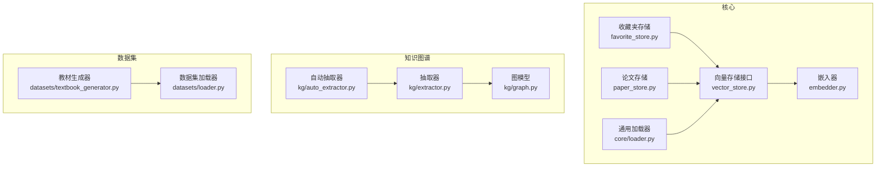
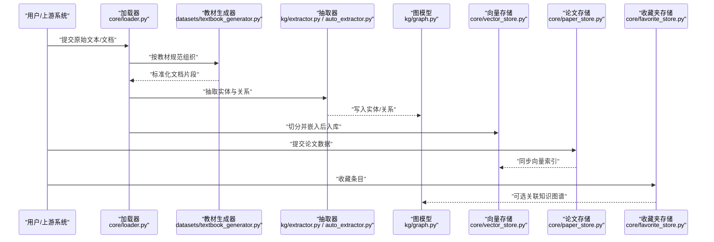
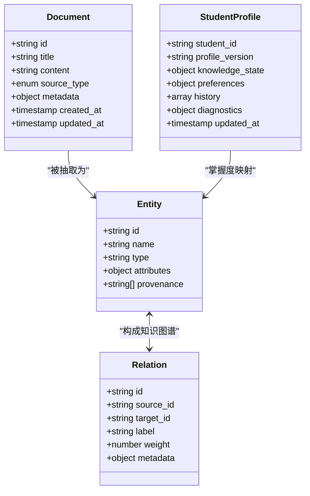
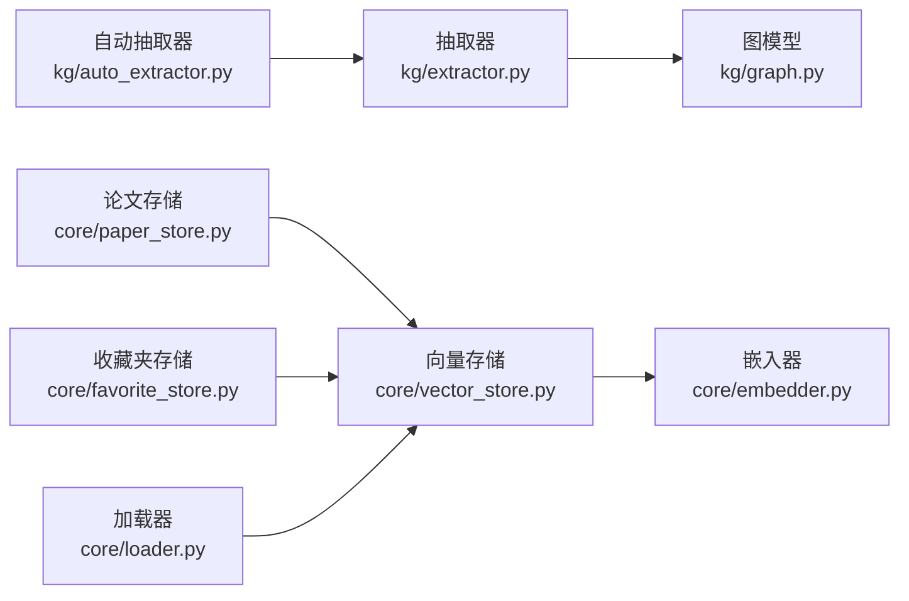

# 数据结构设计

<cite>
**本文引用的文件**   
- [README.md](file://README.md)
- [DATA_MANIFEST.md](file://DATA_MANIFEST.md)
- [src/kag_pro/core/favorite_store.py](file://src/kag_pro/core/favorite_store.py)
- [src/kag_pro/core/paper_store.py](file://src/kag_pro/core/paper_store.py)
- [src/kag_pro/datasets/textbook_generator.py](file://src/kag_pro/datasets/textbook_generator.py)
- [src/kag_pro/kg/graph.py](file://src/kag_pro/kg/graph.py)
- [src/kag_pro/kg/extractor.py](file://src/kag_pro/kg/extractor.py)
- [src/kag_pro/kg/auto_extractor.py](file://src/kag_pro/kg/auto_extractor.py)
- [src/kag_pro/core/vector_store.py](file://src/kag_pro/core/vector_store.py)
- [src/kag_pro/core/embedder.py](file://src/kag_pro/core/embedder.py)
- [src/kag_pro/core/loader.py](file://src/kag_pro/core/loader.py)
- [src/kag_pro/datasets/loader.py](file://src/kag_pro/datasets/loader.py)
</cite>

## 目录
1. [简介](#简介)
2. [项目结构](#项目结构)
3. [核心组件](#核心组件)
4. [架构总览](#架构总览)
5. [详细组件分析](#详细组件分析)
6. [依赖关系分析](#依赖关系分析)
7. [性能考虑](#性能考虑)
8. [故障排查指南](#故障排查指南)
9. [结论](#结论)
10. [附录](#附录)

## 简介
本文件面向KAG-Pro的数据结构设计，聚焦于核心数据模型（Document、Entity、Relation、StudentProfile等）的字段规范与数据类型；实体关系映射（主键/外键约束、索引设计与关联关系）；数据集组织结构（教材、论文、收藏夹）的存储格式与命名规范；数据验证规则与业务约束（必填字段、格式校验、完整性检查）；以及数据模型版本管理策略（向后兼容与迁移方案）。文档同时提供具体数据示例与Schema定义，帮助开发者理解并正确使用数据结构。

## 项目结构
从仓库视角看，数据相关代码主要分布在以下模块：
- 核心存储与检索：core（favorite_store、paper_store、vector_store、embedder、loader）
- 知识图谱：kg（graph、extractor、auto_extractor）
- 数据集与生成：datasets（textbook_generator、loader）
- 根级说明：README.md、DATA_MANIFEST.md

图表来源
- [src/kag_pro/core/favorite_store.py](file://src/kag_pro/core/favorite_store.py)
- [src/kag_pro/core/paper_store.py](file://src/kag_pro/core/paper_store.py)
- [src/kag_pro/core/vector_store.py](file://src/kag_pro/core/vector_store.py)
- [src/kag_pro/core/embedder.py](file://src/kag_pro/core/embedder.py)
- [src/kag_pro/kg/graph.py](file://src/kag_pro/kg/graph.py)
- [src/kag_pro/kg/extractor.py](file://src/kag_pro/kg/extractor.py)
- [src/kag_pro/kg/auto_extractor.py](file://src/kag_pro/kg/auto_extractor.py)
- [src/kag_pro/datasets/textbook_generator.py](file://src/kag_pro/datasets/textbook_generator.py)
- [src/kag_pro/datasets/loader.py](file://src/kag_pro/datasets/loader.py)

章节来源
- [README.md](file://README.md)
- [DATA_MANIFEST.md](file://DATA_MANIFEST.md)

## 核心组件
围绕“文档—实体—关系—学生画像”的主线，KAG-Pro在代码中通过以下组件承载数据模型与流转：
- Document：文本或结构化片段的最小可检索单元，通常包含元数据（如来源、时间戳、标签）与正文内容。
- Entity：从文本中抽取出的概念节点（如知识点、术语），具备唯一标识与属性集合。
- Relation：连接两个实体的有向边，描述语义关系（如“前置知识”“属于”“等价”等）。
- StudentProfile：学习者画像，记录学习进度、掌握度、偏好与诊断结果，用于个性化推荐与评估。

这些模型在系统中以如下方式协作：
- 文本进入后由抽取器（extractor/auto_extractor）识别出实体与关系，写入图模型（kg/graph.py）。
- 文档切片与嵌入（embedder）后存入向量存储（vector_store），支持相似检索。
- 论文与收藏夹分别由专用存储（paper_store、favorite_store）管理，并与图/向量层联动。
- 教材数据由数据集生成器（textbook_generator）组织为统一格式，便于批量处理。

章节来源
- [src/kag_pro/kg/extractor.py](file://src/kag_pro/kg/extractor.py)
- [src/kag_pro/kg/auto_extractor.py](file://src/kag_pro/kg/auto_extractor.py)
- [src/kag_pro/kg/graph.py](file://src/kag_pro/kg/graph.py)
- [src/kag_pro/core/embedder.py](file://src/kag_pro/core/embedder.py)
- [src/kag_pro/core/vector_store.py](file://src/kag_pro/core/vector_store.py)
- [src/kag_pro/core/paper_store.py](file://src/kag_pro/core/paper_store.py)
- [src/kag_pro/core/favorite_store.py](file://src/kag_pro/core/favorite_store.py)
- [src/kag_pro/datasets/textbook_generator.py](file://src/kag_pro/datasets/textbook_generator.py)

## 架构总览
下图展示了数据从输入到持久化与检索的整体流程，体现Document→Entity/Relation→Graph/Vector的转换路径，以及论文与收藏夹的独立存储通道。

图表来源
- [src/kag_pro/core/loader.py](file://src/kag_pro/core/loader.py)
- [src/kag_pro/datasets/textbook_generator.py](file://src/kag_pro/datasets/textbook_generator.py)
- [src/kag_pro/kg/extractor.py](file://src/kag_pro/kg/extractor.py)
- [src/kag_pro/kg/auto_extractor.py](file://src/kag_pro/kg/auto_extractor.py)
- [src/kag_pro/kg/graph.py](file://src/kag_pro/kg/graph.py)
- [src/kag_pro/core/vector_store.py](file://src/kag_pro/core/vector_store.py)
- [src/kag_pro/core/paper_store.py](file://src/kag_pro/core/paper_store.py)
- [src/kag_pro/core/favorite_store.py](file://src/kag_pro/core/favorite_store.py)

## 详细组件分析

### 数据模型与Schema定义
本节给出核心实体的字段规范与类型约定，供实现与校验参考。为避免直接粘贴代码，采用“字段—类型—约束—说明”的结构化描述，并在需要时引用对应实现位置。

- Document（文档）
  - 字段
    - id: 字符串，唯一标识
    - title: 字符串，标题
    - content: 字符串，正文
    - source_type: 枚举，取值如“textbook”“paper”“other”
    - metadata: 对象，包含author、publish_date、tags、version等
    - created_at: 时间戳
    - updated_at: 时间戳
  - 约束
    - id必填且全局唯一
    - content非空
    - source_type限定取值
    - metadata.version用于模型版本控制
  - 用途
    - 作为最小可检索单元，参与切片、嵌入与向量检索
  - 参考实现
    - [src/kag_pro/core/loader.py](file://src/kag_pro/core/loader.py)
    - [src/kag_pro/datasets/textbook_generator.py](file://src/kag_pro/datasets/textbook_generator.py)

- Entity（实体）
  - 字段
    - id: 字符串，唯一标识
    - name: 字符串，名称
    - type: 字符串，类别（如“知识点”“术语”）
    - attributes: 对象，扩展属性
    - provenance: 数组，来源文档ID列表
  - 约束
    - id必填且全局唯一
    - name非空
    - type需符合预定义词表
  - 用途
    - 知识图谱节点，支撑推理与可视化
  - 参考实现
    - [src/kag_pro/kg/extractor.py](file://src/kag_pro/kg/extractor.py)
    - [src/kag_pro/kg/auto_extractor.py](file://src/kag_pro/kg/auto_extractor.py)
    - [src/kag_pro/kg/graph.py](file://src/kag_pro/kg/graph.py)

- Relation（关系）
  - 字段
    - id: 字符串，唯一标识
    - source_id: 字符串，源实体ID
    - target_id: 字符串，目标实体ID
    - label: 字符串，关系类型
    - weight: 数值，权重（可选）
    - metadata: 对象，附加信息
  - 约束
    - source_id与target_id必须存在
    - label需符合预定义词表
    - 禁止自环（source_id != target_id）
  - 用途
    - 构建领域知识网络，支持路径查询与传播
  - 参考实现
    - [src/kag_pro/kg/graph.py](file://src/kag_pro/kg/graph.py)

- StudentProfile（学生画像）
  - 字段
    - student_id: 字符串，唯一标识
    - profile_version: 字符串，画像版本
    - knowledge_state: 对象，各知识点的掌握度
    - preferences: 对象，学习偏好
    - history: 数组，学习行为历史
    - diagnostics: 对象，诊断与推荐结果
    - updated_at: 时间戳
  - 约束
    - student_id必填且唯一
    - knowledge_state键集需与知识图谱节点对齐
    - profile_version用于向后兼容
  - 用途
    - 个性化推荐、学习路径规划与评估
  - 参考实现
    - [src/kag_pro/diagnosis/recommender.py](file://src/kag_pro/diagnosis/recommender.py)
    - [src/kag_pro/diagnosis/classifier.py](file://src/kag_pro/diagnosis/classifier.py)

图表来源
- [src/kag_pro/kg/graph.py](file://src/kag_pro/kg/graph.py)
- [src/kag_pro/kg/extractor.py](file://src/kag_pro/kg/extractor.py)
- [src/kag_pro/kg/auto_extractor.py](file://src/kag_pro/kg/auto_extractor.py)
- [src/kag_pro/diagnosis/recommender.py](file://src/kag_pro/diagnosis/recommender.py)
- [src/kag_pro/diagnosis/classifier.py](file://src/kag_pro/diagnosis/classifier.py)

章节来源
- [src/kag_pro/kg/graph.py](file://src/kag_pro/kg/graph.py)
- [src/kag_pro/kg/extractor.py](file://src/kag_pro/kg/extractor.py)
- [src/kag_pro/kg/auto_extractor.py](file://src/kag_pro/kg/auto_extractor.py)
- [src/kag_pro/diagnosis/recommender.py](file://src/kag_pro/diagnosis/recommender.py)
- [src/kag_pro/diagnosis/classifier.py](file://src/kag_pro/diagnosis/classifier.py)

### 实体关系映射与索引设计
- 主键与外键
  - Document.id为主键，Entity.provenance与Relation.source_id/target_id为外键引用。
  - StudentProfile.knowledge_state的键应与Entity.id对齐，保证一致性。
- 索引建议
  - Document: 对id、source_type、metadata.tags建立索引，加速筛选与检索。
  - Entity: 对id、name、type建立索引，提升查找与聚合效率。
  - Relation: 对source_id、target_id、label建立复合索引，优化邻接查询。
  - StudentProfile: 对student_id建立唯一索引，knowledge_state可按热点维度建二级索引。
- 关联关系
  - Document → Entity：通过provenance反向追溯来源。
  - Entity ↔ Relation：构成有向图，支持多跳查询。
  - StudentProfile → Entity：通过knowledge_state进行掌握度映射。

章节来源
- [src/kag_pro/kg/graph.py](file://src/kag_pro/kg/graph.py)
- [src/kag_pro/core/loader.py](file://src/kag_pro/core/loader.py)

### 数据集组织结构与命名规范
- 教材数据
  - 目录：data/textbooks
  - 命名：按年级/学科/序号组织，例如“gen_mid_mat_01.txt”“gen_hig_phy_12.txt”。前缀表示学段与学科，后缀为序号。
  - 格式：纯文本，建议每行一个段落或知识点块，便于切片。
- 论文数据
  - 目录：data/papers
  - 命名：建议使用“作者_年份_主题关键词.pdf/txt”，并配套JSON元数据。
  - 格式：PDF或TXT，元数据包含title、authors、abstract、keywords、doi等。
- 收藏夹数据
  - 目录：data/favorites
  - 命名：按用户ID或会话ID组织，如“user_{id}.json”。
  - 格式：JSON数组，每项包含document_id、added_at、notes等。
- 数据清单
  - DATA_MANIFEST.md用于登记数据集版本、来源、统计信息与变更日志。

章节来源
- [DATA_MANIFEST.md](file://DATA_MANIFEST.md)
- [src/kag_pro/datasets/textbook_generator.py](file://src/kag_pro/datasets/textbook_generator.py)

### 数据验证规则与业务约束
- 必填字段
  - Document.content非空；Entity.name非空；Relation.source_id与target_id均存在；StudentProfile.student_id唯一。
- 格式校验
  - 时间戳使用ISO 8601；数值型字段范围合理；枚举值限定在预定义集合。
- 完整性检查
  - 外键存在性：Relation.source_id/target_id必须在Entity中存在。
  - 图谱连通性：避免孤立节点与断链。
  - 版本一致性：Document.metadata.version与StudentProfile.profile_version需与当前Schema兼容。
- 校验入口
  - 加载阶段：core/loader.py与datasets/loader.py负责基础校验。
  - 抽取阶段：kg/extractor.py与kg/auto_extractor.py输出前进行实体/关系规范化。
  - 存储阶段：paper_store.py与favorite_store.py入库前执行二次校验。

章节来源
- [src/kag_pro/core/loader.py](file://src/kag_pro/core/loader.py)
- [src/kag_pro/datasets/loader.py](file://src/kag_pro/datasets/loader.py)
- [src/kag_pro/kg/extractor.py](file://src/kag_pro/kg/extractor.py)
- [src/kag_pro/kg/auto_extractor.py](file://src/kag_pro/kg/auto_extractor.py)
- [src/kag_pro/core/paper_store.py](file://src/kag_pro/core/paper_store.py)
- [src/kag_pro/core/favorite_store.py](file://src/kag_pro/core/favorite_store.py)

### 数据模型版本管理与迁移策略
- 版本字段
  - Document.metadata.version与StudentProfile.profile_version用于标识模型版本。
- 向后兼容
  - 新增字段默认允许为空；读取逻辑需忽略未知字段。
  - 废弃字段保留但标记deprecated，逐步清理。
- 迁移方案
  - 增量迁移：针对小改动，提供脚本将旧版数据转换为新版Schema。
  - 全量重建：当核心结构变化较大时，基于原始数据重新抽取与入库。
  - 回滚机制：维护快照与差异补丁，确保失败可恢复。
- 参考实现
  - 嵌入与向量存储接口：core/embedder.py与core/vector_store.py应支持按版本路由。
  - 论文与收藏夹存储：paper_store.py与favorite_store.py需在写入时携带版本信息。

章节来源
- [src/kag_pro/core/embedder.py](file://src/kag_pro/core/embedder.py)
- [src/kag_pro/core/vector_store.py](file://src/kag_pro/core/vector_store.py)
- [src/kag_pro/core/paper_store.py](file://src/kag_pro/core/paper_store.py)
- [src/kag_pro/core/favorite_store.py](file://src/kag_pro/core/favorite_store.py)

### 数据示例与Schema样例
以下为示例性结构，便于理解字段含义与层级关系（不直接粘贴代码，仅展示结构示意）：
- 文档示例
  - id: "doc_001"
  - title: "分数初步"
  - content: "..."
  - source_type: "textbook"
  - metadata: { author: "...", publish_date: "...", tags: ["数学","初中"], version: "v1.2" }
  - created_at: "2024-01-01T00:00:00Z"
  - updated_at: "2024-01-02T00:00:00Z"
- 实体示例
  - id: "ent_frac_basic"
  - name: "分数基本概念"
  - type: "知识点"
  - attributes: { difficulty: "初级", domain: "数学" }
  - provenance: ["doc_001"]
- 关系示例
  - id: "rel_pre_001"
  - source_id: "ent_frac_basic"
  - target_id: "ent_decimal_recognition"
  - label: "前置知识"
  - weight: 0.8
  - metadata: { confidence: 0.9 }
- 学生画像示例
  - student_id: "stu_1001"
  - profile_version: "v1.0"
  - knowledge_state: { "ent_frac_basic": 0.7, "ent_decimal_recognition": 0.5 }
  - preferences: { preferred_subject: "数学", learning_style: "视觉" }
  - history: [{ action: "read", doc_id: "doc_001", ts: "..." }]
  - diagnostics: { weak_points: ["小数认识"], recommendations: ["练习册A"] }
  - updated_at: "2024-01-03T00:00:00Z"

[本节为概念性示例，未直接分析具体文件]

## 依赖关系分析
- 组件耦合
  - extractor/auto_extractor强依赖graph以写入实体/关系。
  - paper_store/favorite_store依赖vector_store进行向量索引。
  - embedder为vector_store提供嵌入能力。
- 外部依赖
  - 向量数据库（Chroma等）通过vector_store抽象接入。
  - 文本解析与NLP工具由extractor系列封装。
- 潜在循环
  - 抽取器与图模型之间单向依赖，无循环。
  - 存储层与嵌入层解耦，通过接口隔离。

图表来源
- [src/kag_pro/kg/extractor.py](file://src/kag_pro/kg/extractor.py)
- [src/kag_pro/kg/auto_extractor.py](file://src/kag_pro/kg/auto_extractor.py)
- [src/kag_pro/kg/graph.py](file://src/kag_pro/kg/graph.py)
- [src/kag_pro/core/paper_store.py](file://src/kag_pro/core/paper_store.py)
- [src/kag_pro/core/favorite_store.py](file://src/kag_pro/core/favorite_store.py)
- [src/kag_pro/core/vector_store.py](file://src/kag_pro/core/vector_store.py)
- [src/kag_pro/core/embedder.py](file://src/kag_pro/core/embedder.py)
- [src/kag_pro/core/loader.py](file://src/kag_pro/core/loader.py)

章节来源
- [src/kag_pro/kg/extractor.py](file://src/kag_pro/kg/extractor.py)
- [src/kag_pro/kg/auto_extractor.py](file://src/kag_pro/kg/auto_extractor.py)
- [src/kag_pro/kg/graph.py](file://src/kag_pro/kg/graph.py)
- [src/kag_pro/core/paper_store.py](file://src/kag_pro/core/paper_store.py)
- [src/kag_pro/core/favorite_store.py](file://src/kag_pro/core/favorite_store.py)
- [src/kag_pro/core/vector_store.py](file://src/kag_pro/core/vector_store.py)
- [src/kag_pro/core/embedder.py](file://src/kag_pro/core/embedder.py)
- [src/kag_pro/core/loader.py](file://src/kag_pro/core/loader.py)

## 性能考虑
- 向量检索
  - 合理设置chunk大小与重叠率，平衡召回与延迟。
  - 对高频查询的实体/关系建立缓存层。
- 图查询
  - 对常用label与方向建立索引，减少全图扫描。
  - 限制最大跳数，避免深度遍历导致的超时。
- 存储I/O
  - 批量写入与异步落盘，降低阻塞。
  - 定期压缩与归档冷数据。

[本节提供一般性指导，无需特定文件分析]

## 故障排查指南
- 常见错误
  - 外键缺失：Relation指向的Entity不存在。
  - 版本不兼容：读取端无法解析新字段。
  - 嵌入维度不一致：不同版本的embedder导致向量维度不匹配。
- 定位方法
  - 检查加载器与抽取器的日志输出，确认校验失败点。
  - 核对DATA_MANIFEST.md中的版本与统计信息。
  - 使用测试用例复现问题，缩小范围。
- 修复建议
  - 运行迁移脚本补齐缺失字段或修正类型。
  - 重建向量索引以适配新的嵌入器配置。
  - 回滚至稳定版本并逐步升级。

章节来源
- [DATA_MANIFEST.md](file://DATA_MANIFEST.md)
- [src/kag_pro/core/loader.py](file://src/kag_pro/core/loader.py)
- [src/kag_pro/kg/extractor.py](file://src/kag_pro/kg/extractor.py)
- [src/kag_pro/core/embedder.py](file://src/kag_pro/core/embedder.py)

## 结论
KAG-Pro的数据结构围绕Document、Entity、Relation与StudentProfile展开，形成“文本—知识—画像”的闭环。通过明确的Schema、严格的校验与完善的版本管理，系统在可扩展性与稳定性之间取得平衡。建议在后续迭代中持续完善索引策略、监控指标与自动化迁移工具，以提升整体数据质量与检索性能。

## 附录
- 快速上手
  - 阅读README.md了解项目背景与安装步骤。
  - 查看DATA_MANIFEST.md获取数据集清单与版本信息。
- 参考实现路径
  - 文档加载与校验：core/loader.py、datasets/loader.py
  - 教材数据组织：datasets/textbook_generator.py
  - 抽取与图谱：kg/extractor.py、kg/auto_extractor.py、kg/graph.py
  - 向量与嵌入：core/vector_store.py、core/embedder.py
  - 论文与收藏夹：core/paper_store.py、core/favorite_store.py

章节来源
- [README.md](file://README.md)
- [DATA_MANIFEST.md](file://DATA_MANIFEST.md)
- [src/kag_pro/core/loader.py](file://src/kag_pro/core/loader.py)
- [src/kag_pro/datasets/loader.py](file://src/kag_pro/datasets/loader.py)
- [src/kag_pro/datasets/textbook_generator.py](file://src/kag_pro/datasets/textbook_generator.py)
- [src/kag_pro/kg/extractor.py](file://src/kag_pro/kg/extractor.py)
- [src/kag_pro/kg/auto_extractor.py](file://src/kag_pro/kg/auto_extractor.py)
- [src/kag_pro/kg/graph.py](file://src/kag_pro/kg/graph.py)
- [src/kag_pro/core/vector_store.py](file://src/kag_pro/core/vector_store.py)
- [src/kag_pro/core/embedder.py](file://src/kag_pro/core/embedder.py)
- [src/kag_pro/core/paper_store.py](file://src/kag_pro/core/paper_store.py)
- [src/kag_pro/core/favorite_store.py](file://src/kag_pro/core/favorite_store.py)