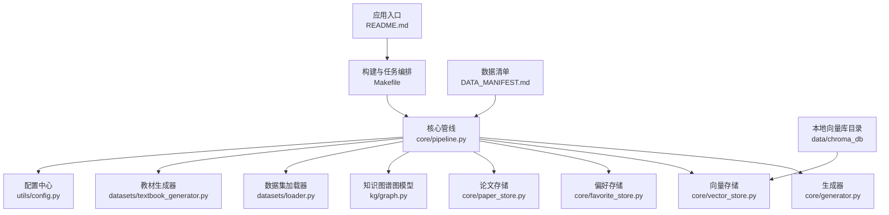
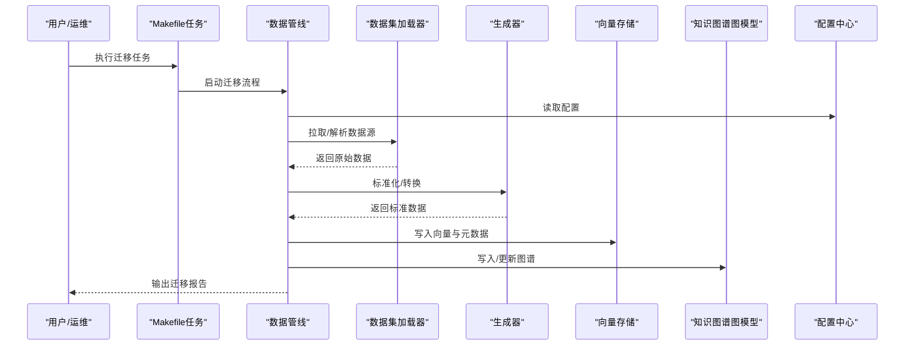
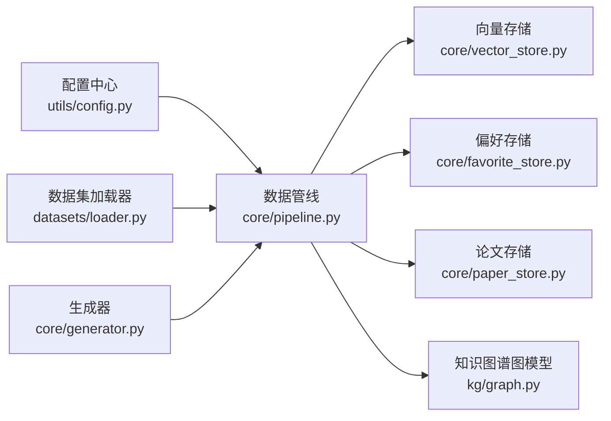

# 数据迁移

<cite>
**本文引用的文件**   
- [README.md](file://README.md)
- [DATA_MANIFEST.md](file://DATA_MANIFEST.md)
- [pyproject.toml](file://pyproject.toml)
- [Makefile](file://Makefile)
- [src/kag_pro/core/pipeline.py](file://src/kag_pro/core/pipeline.py)
- [src/kag_pro/core/generator.py](file://src/kag_pro/core/generator.py)
- [src/kag_pro/core/vector_store.py](file://src/kag_pro/core/vector_store.py)
- [src/kag_pro/core/favorite_store.py](file://src/kag_pro/core/favorite_store.py)
- [src/kag_pro/core/paper_store.py](file://src/kag_pro/core/paper_store.py)
- [src/kag_pro/datasets/loader.py](file://src/kag_pro/datasets/loader.py)
- [src/kag_pro/datasets/textbook_generator.py](file://src/kag_pro/datasets/textbook_generator.py)
- [src/kag_pro/kg/graph.py](file://src/kag_pro/kg/graph.py)
- [src/kag_pro/utils/config.py](file://src/kag_pro/utils/config.py)
</cite>

## 目录
1. [简介](#简介)
2. [项目结构](#项目结构)
3. [核心组件](#核心组件)
4. [架构总览](#架构总览)
5. [详细组件分析](#详细组件分析)
6. [依赖关系分析](#依赖关系分析)
7. [性能考虑](#性能考虑)
8. [故障排查指南](#故障排查指南)
9. [结论](#结论)
10. [附录](#附录)

## 简介
本技术文档围绕KAG-Pro的数据迁移系统，系统化阐述版本管理、迁移脚本规范、备份与恢复策略、最佳实践以及工具使用指南。目标是在不改变现有业务逻辑的前提下，提供安全、可靠、可观测的数据迁移能力，覆盖从增量更新到灾难恢复的全生命周期。

## 项目结构
仓库采用按功能域划分的组织方式：
- src/kag_pro/core：核心处理管线、生成器、向量存储与偏好/论文存储等
- src/kag_pro/datasets：数据集加载与教材生成
- src/kag_pro/kg：知识图谱相关能力（图结构与检索）
- src/kag_pro/utils：配置与通用工具
- data/chroma_db：向量数据库本地持久化目录
- frontend：前端服务与示例页面
- notebooks：原型实验
- tests：单元测试与集成测试
- Makefile：常用任务编排入口
- pyproject.toml：依赖与元信息
- DATA_MANIFEST.md：数据清单与说明
- README.md：项目概览与使用说明

图表来源
- [README.md](file://README.md)
- [Makefile](file://Makefile)
- [src/kag_pro/core/pipeline.py](file://src/kag_pro/core/pipeline.py)
- [src/kag_pro/core/generator.py](file://src/kag_pro/core/generator.py)
- [src/kag_pro/core/vector_store.py](file://src/kag_pro/core/vector_store.py)
- [src/kag_pro/core/favorite_store.py](file://src/kag_pro/core/favorite_store.py)
- [src/kag_pro/core/paper_store.py](file://src/kag_pro/core/paper_store.py)
- [src/kag_pro/kg/graph.py](file://src/kag_pro/kg/graph.py)
- [src/kag_pro/datasets/loader.py](file://src/kag_pro/datasets/loader.py)
- [src/kag_pro/datasets/textbook_generator.py](file://src/kag_pro/datasets/textbook_generator.py)
- [src/kag_pro/utils/config.py](file://src/kag_pro/utils/config.py)
- [DATA_MANIFEST.md](file://DATA_MANIFEST.md)

章节来源
- [README.md](file://README.md)
- [Makefile](file://Makefile)
- [DATA_MANIFEST.md](file://DATA_MANIFEST.md)
- [pyproject.toml](file://pyproject.toml)

## 核心组件
- 数据管线（Pipeline）：串联数据读取、清洗、向量化、入库与索引构建等步骤，是迁移流程的编排中枢。
- 生成器（Generator）：负责文本/结构化内容的生成或转换，为后续入库提供标准化产物。
- 向量存储（Vector Store）：封装Chroma等向量库的读写接口，承载嵌入向量与元数据。
- 偏好与论文存储（Favorite/Paper Store）：面向用户偏好与论文资源的持久化存储。
- 知识图谱图模型（KG Graph）：维护节点与边关系，支撑图谱数据的迁移与校验。
- 数据集加载器（Dataset Loader）：统一接入外部数据集与内部教材资源。
- 教材生成器（Textbook Generator）：将原始教材材料转换为标准格式，便于批量迁移。
- 配置中心（Config）：集中管理迁移参数、路径、并发度、重试策略等。

章节来源
- [src/kag_pro/core/pipeline.py](file://src/kag_pro/core/pipeline.py)
- [src/kag_pro/core/generator.py](file://src/kag_pro/core/generator.py)
- [src/kag_pro/core/vector_store.py](file://src/kag_pro/core/vector_store.py)
- [src/kag_pro/core/favorite_store.py](file://src/kag_pro/core/favorite_store.py)
- [src/kag_pro/core/paper_store.py](file://src/kag_pro/core/paper_store.py)
- [src/kag_pro/kg/graph.py](file://src/kag_pro/kg/graph.py)
- [src/kag_pro/datasets/loader.py](file://src/kag_pro/datasets/loader.py)
- [src/kag_pro/datasets/textbook_generator.py](file://src/kag_pro/datasets/textbook_generator.py)
- [src/kag_pro/utils/config.py](file://src/kag_pro/utils/config.py)

## 架构总览
下图展示数据迁移在系统中的位置与交互关系：外部数据经加载器进入管线，由生成器产出标准化数据，随后写入向量存储与图谱存储；配置中心贯穿全链路，提供运行时参数；Makefile作为任务编排入口，驱动迁移任务执行。

图表来源
- [Makefile](file://Makefile)
- [src/kag_pro/core/pipeline.py](file://src/kag_pro/core/pipeline.py)
- [src/kag_pro/datasets/loader.py](file://src/kag_pro/datasets/loader.py)
- [src/kag_pro/core/generator.py](file://src/kag_pro/core/generator.py)
- [src/kag_pro/core/vector_store.py](file://src/kag_pro/core/vector_store.py)
- [src/kag_pro/kg/graph.py](file://src/kag_pro/kg/graph.py)
- [src/kag_pro/utils/config.py](file://src/kag_pro/utils/config.py)

## 详细组件分析

### 数据版本管理机制
- 版本号规范
  - 建议采用“主版本.次版本.修订号”语义化版本，主版本用于破坏性变更，次版本用于新增兼容特性，修订号用于修复问题。
  - 每个迁移包需包含唯一标识与时间戳，便于审计与回滚定位。
- 变更日志维护
  - 每次迁移应记录变更范围、影响对象、预期结果与验证方法，并归档至数据清单中。
- 兼容性检查
  - 在迁移前进行依赖与数据结构兼容性校验，包括向量维度、字段类型、图谱模式等。
  - 对关键指标（如条目数、哈希指纹、统计摘要）进行前后对比，确保一致性。

章节来源
- [DATA_MANIFEST.md](file://DATA_MANIFEST.md)
- [src/kag_pro/utils/config.py](file://src/kag_pro/utils/config.py)

### 迁移脚本开发规范
- 增量更新
  - 以幂等为原则设计迁移脚本，支持重复执行而不产生副作用。
  - 基于时间戳或增量标记识别待迁移数据，避免全量重算。
- 回滚支持
  - 每个迁移包需提供对应的回滚操作，保证可逆性与最小停机窗口。
- 事务处理
  - 对写操作采用事务边界控制，失败时自动回滚，保障原子性。
  - 对长耗时任务引入分片与断点续跑机制。

章节来源
- [src/kag_pro/core/pipeline.py](file://src/kag_pro/core/pipeline.py)
- [src/kag_pro/core/vector_store.py](file://src/kag_pro/core/vector_store.py)
- [src/kag_pro/kg/graph.py](file://src/kag_pro/kg/graph.py)

### 数据备份策略
- 全量备份
  - 定期导出完整数据快照，包括向量库、图谱与元数据，并校验完整性。
- 增量备份
  - 基于变更日志与时间窗口，仅备份差异部分，降低存储与带宽开销。
- 异地容灾
  - 将备份副本同步至异地存储，实现多活与快速恢复。

章节来源
- [src/kag_pro/core/vector_store.py](file://src/kag_pro/core/vector_store.py)
- [src/kag_pro/kg/graph.py](file://src/kag_pro/kg/graph.py)
- [DATA_MANIFEST.md](file://DATA_MANIFEST.md)

### 数据恢复流程
- 灾难恢复
  - 优先恢复最近一致的全量快照，再按顺序回放增量备份。
- 数据修复
  - 针对损坏或不一致的条目，依据校验规则进行修复或剔除。
- 一致性验证
  - 通过统计摘要、抽样比对与端到端查询验证，确保恢复后数据可用。

章节来源
- [src/kag_pro/core/pipeline.py](file://src/kag_pro/core/pipeline.py)
- [src/kag_pro/core/vector_store.py](file://src/kag_pro/core/vector_store.py)
- [src/kag_pro/kg/graph.py](file://src/kag_pro/kg/graph.py)

### 迁移最佳实践
- 灰度发布
  - 先在小流量或隔离环境执行迁移，验证通过后逐步扩大范围。
- A/B测试
  - 并行运行新旧数据版本，对比关键指标，评估迁移效果。
- 监控告警
  - 对迁移时长、错误率、吞吐与资源占用设置阈值，异常即时告警。

章节来源
- [src/kag_pro/core/pipeline.py](file://src/kag_pro/core/pipeline.py)
- [src/kag_pro/utils/config.py](file://src/kag_pro/utils/config.py)

### 迁移工具使用指南
- 命令行工具
  - 通过Makefile提供的任务入口，执行迁移、备份、恢复与校验等操作。
- Web界面
  - 前端服务提供可视化操作面板，便于非技术人员发起迁移任务与查看进度。
- API接口
  - 暴露迁移任务的创建、状态查询与结果获取接口，便于系统集成。

章节来源
- [Makefile](file://Makefile)
- [frontend/server.py](file://frontend/server.py)
- [frontend/index.html](file://frontend/index.html)

### 具体迁移案例
- 教材数据批量迁移
  - 从教材目录读取文本，经生成器标准化后写入向量存储，并更新图谱关联。
- 论文集合迁移
  - 导入论文元数据与全文内容，建立向量索引与检索路径。
- 用户偏好迁移
  - 迁移用户收藏与偏好标签，保持与现有推荐系统的兼容。

章节来源
- [src/kag_pro/datasets/textbook_generator.py](file://src/kag_pro/datasets/textbook_generator.py)
- [src/kag_pro/core/paper_store.py](file://src/kag_pro/core/paper_store.py)
- [src/kag_pro/core/favorite_store.py](file://src/kag_pro/core/favorite_store.py)
- [src/kag_pro/core/vector_store.py](file://src/kag_pro/core/vector_store.py)
- [src/kag_pro/kg/graph.py](file://src/kag_pro/kg/graph.py)

### 常见问题解决方案
- 向量维度不一致
  - 在迁移前统一嵌入模型与维度，必要时进行投影或重新计算。
- 图谱模式变更导致写入失败
  - 预检模式兼容性，提供模式升级脚本与回滚方案。
- 迁移中断与重试
  - 启用断点续跑与幂等写入，结合任务队列与重试策略。

章节来源
- [src/kag_pro/core/vector_store.py](file://src/kag_pro/core/vector_store.py)
- [src/kag_pro/kg/graph.py](file://src/kag_pro/kg/graph.py)
- [src/kag_pro/core/pipeline.py](file://src/kag_pro/core/pipeline.py)

## 依赖关系分析
下图展示核心模块之间的依赖关系，有助于理解迁移过程中的调用链与耦合点。

图表来源
- [src/kag_pro/utils/config.py](file://src/kag_pro/utils/config.py)
- [src/kag_pro/core/pipeline.py](file://src/kag_pro/core/pipeline.py)
- [src/kag_pro/datasets/loader.py](file://src/kag_pro/datasets/loader.py)
- [src/kag_pro/core/generator.py](file://src/kag_pro/core/generator.py)
- [src/kag_pro/core/vector_store.py](file://src/kag_pro/core/vector_store.py)
- [src/kag_pro/core/favorite_store.py](file://src/kag_pro/core/favorite_store.py)
- [src/kag_pro/core/paper_store.py](file://src/kag_pro/core/paper_store.py)
- [src/kag_pro/kg/graph.py](file://src/kag_pro/kg/graph.py)

章节来源
- [src/kag_pro/core/pipeline.py](file://src/kag_pro/core/pipeline.py)
- [src/kag_pro/utils/config.py](file://src/kag_pro/utils/config.py)

## 性能考虑
- 批处理与并发
  - 合理设置批次大小与并发度，平衡吞吐与内存占用。
- 索引与缓存
  - 对热点数据进行缓存，减少重复计算与IO压力。
- 资源隔离
  - 迁移任务与在线服务分离，避免相互干扰。
- 监控与调优
  - 采集关键指标，定位瓶颈并进行针对性优化。

[本节为通用指导，无需列出具体文件来源]

## 故障排查指南
- 常见错误定位
  - 检查配置项是否正确加载，确认数据源路径与权限。
  - 核对向量维度、字段类型与图谱模式是否匹配。
- 日志与诊断
  - 开启详细日志，记录迁移阶段、输入输出摘要与异常堆栈。
- 回滚与恢复
  - 若迁移失败，立即触发回滚流程，恢复到上一个稳定版本。

章节来源
- [src/kag_pro/utils/config.py](file://src/kag_pro/utils/config.py)
- [src/kag_pro/core/pipeline.py](file://src/kag_pro/core/pipeline.py)

## 结论
通过统一的版本管理、规范的迁移脚本、完善的备份与恢复策略以及严格的监控与回滚机制，KAG-Pro的数据迁移系统能够在复杂场景下保障数据安全与一致性。建议在生产环境中严格执行灰度发布与A/B测试，并结合自动化流水线提升效率与可靠性。

[本节为总结性内容，无需列出具体文件来源]

## 附录
- 术语表
  - 向量存储：用于保存高维向量与元数据的持久化系统
  - 知识图谱：以节点与边表示实体关系的结构化数据模型
  - 幂等：多次执行同一操作不会产生额外副作用
- 参考文件
  - 项目概览与使用说明见README
  - 数据清单与说明见DATA_MANIFEST
  - 依赖与元信息见pyproject.toml
  - 任务编排入口见Makefile

章节来源
- [README.md](file://README.md)
- [DATA_MANIFEST.md](file://DATA_MANIFEST.md)
- [pyproject.toml](file://pyproject.toml)
- [Makefile](file://Makefile)