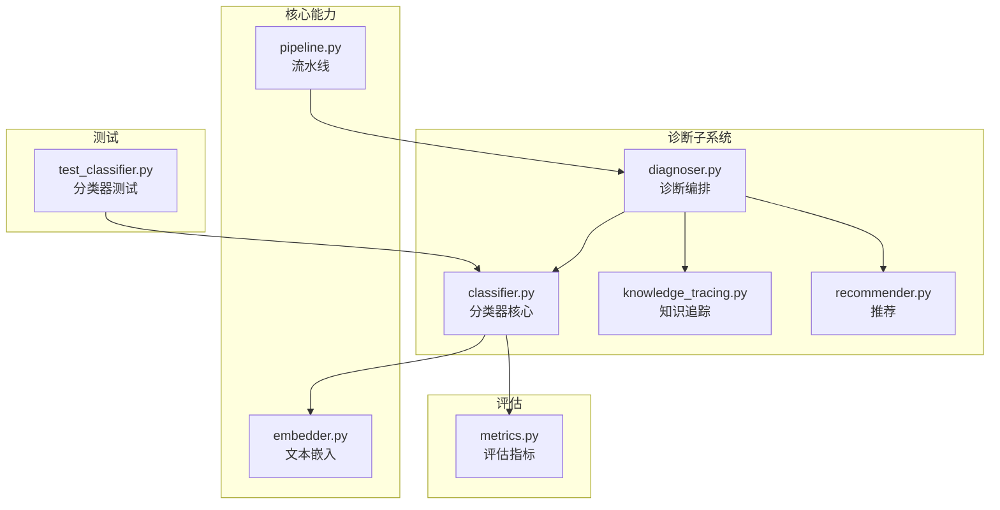
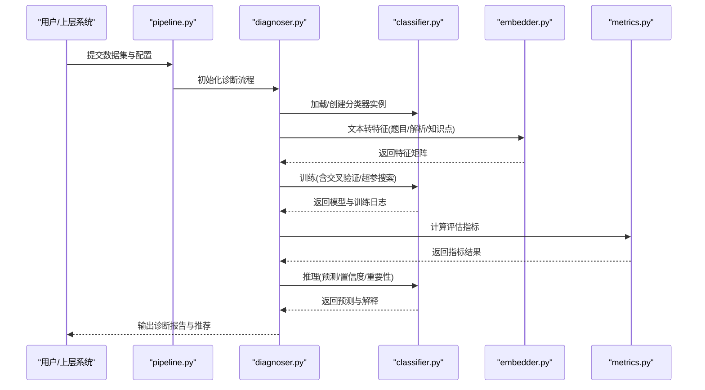
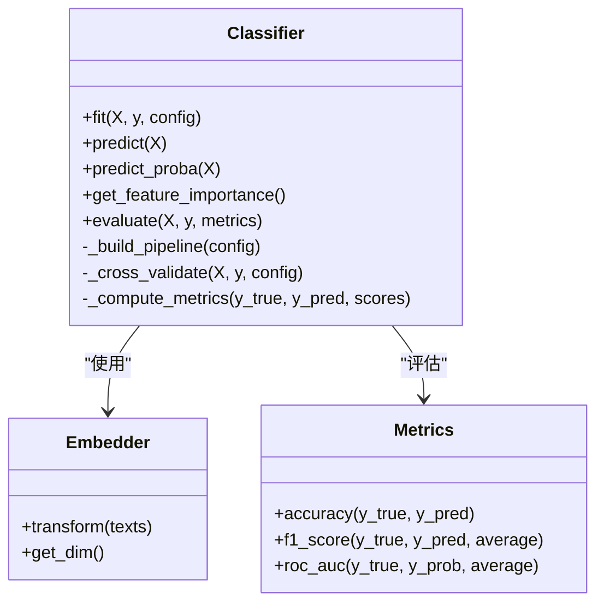
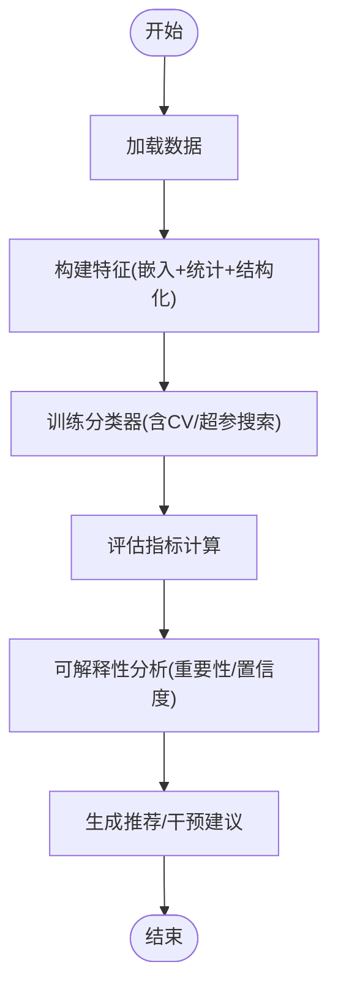
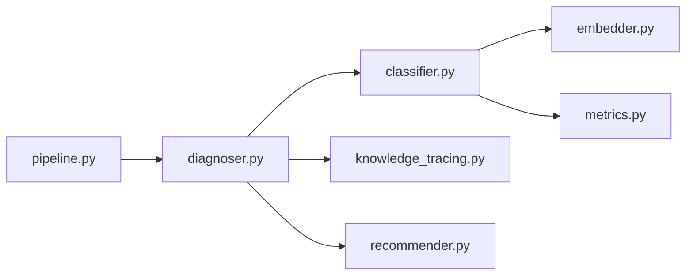

# 分类器模块

<cite>
**本文引用的文件**   
- [diagnosis/classifier.py](file://src/kag_pro/diagnosis/classifier.py)
- [diagnosis/__init__.py](file://src/kag_pro/diagnosis/__init__.py)
- [diagnosis/diagnoser.py](file://src/kag_pro/diagnosis/diagnoser.py)
- [diagnosis/recommender.py](file://src/kag_pro/diagnosis/recommender.py)
- [diagnosis/knowledge_tracing.py](file://src/kag_pro/diagnosis/knowledge_tracing.py)
- [evaluation/metrics.py](file://src/kag_pro/evaluation/metrics.py)
- [core/embedder.py](file://src/kag_pro/core/embedder.py)
- [core/pipeline.py](file://src/kag_pro/core/pipeline.py)
- [tests/test_classifier.py](file://tests/test_classifier.py)
</cite>

## 目录
1. [简介](#简介)
2. [项目结构](#项目结构)
3. [核心组件](#核心组件)
4. [架构总览](#架构总览)
5. [详细组件分析](#详细组件分析)
6. [依赖关系分析](#依赖关系分析)
7. [性能与可扩展性](#性能与可扩展性)
8. [故障排查指南](#故障排查指南)
9. [结论](#结论)
10. [附录：教育场景应用案例](#附录教育场景应用案例)

## 简介
本技术文档面向KAG-Pro的分类器模块，聚焦于其算法实现、特征工程、模型选择与训练策略，以及配置选项（超参数调优、交叉验证、评估指标）、结果解释性分析与集成使用方法。文档同时提供面向教育场景的应用案例，包括题目难度分类、知识点归属判断与学生能力分层，帮助读者快速理解并落地使用。

## 项目结构
分类器模块位于诊断子系统中，围绕“数据输入—特征表示—模型训练—预测—解释—推荐”的闭环构建。关键位置如下：
- 分类器核心实现：src/kag_pro/diagnosis/classifier.py
- 诊断编排与流程：src/kag_pro/diagnosis/diagnoser.py
- 学习追踪与能力建模：src/kag_pro/diagnosis/knowledge_tracing.py
- 基于诊断结果的推荐：src/kag_pro/diagnosis/recommender.py
- 评估指标：src/kag_pro/evaluation/metrics.py
- 文本嵌入（用于特征工程）：src/kag_pro/core/embedder.py
- 端到端流水线入口：src/kag_pro/core/pipeline.py
- 单元测试：tests/test_classifier.py

图表来源
- [diagnosis/classifier.py](file://src/kag_pro/diagnosis/classifier.py)
- [diagnosis/diagnoser.py](file://src/kag_pro/diagnosis/diagnoser.py)
- [diagnosis/knowledge_tracing.py](file://src/kag_pro/diagnosis/knowledge_tracing.py)
- [diagnosis/recommender.py](file://src/kag_pro/diagnosis/recommender.py)
- [core/embedder.py](file://src/kag_pro/core/embedder.py)
- [core/pipeline.py](file://src/kag_pro/core/pipeline.py)
- [evaluation/metrics.py](file://src/kag_pro/evaluation/metrics.py)
- [tests/test_classifier.py](file://tests/test_classifier.py)

章节来源
- [diagnosis/classifier.py](file://src/kag_pro/diagnosis/classifier.py)
- [diagnosis/diagnoser.py](file://src/kag_pro/diagnosis/diagnoser.py)
- [diagnosis/knowledge_tracing.py](file://src/kag_pro/diagnosis/knowledge_tracing.py)
- [diagnosis/recommender.py](file://src/kag_pro/diagnosis/recommender.py)
- [evaluation/metrics.py](file://src/kag_pro/evaluation/metrics.py)
- [core/embedder.py](file://src/kag_pro/core/embedder.py)
- [core/pipeline.py](file://src/kag_pro/core/pipeline.py)
- [tests/test_classifier.py](file://tests/test_classifier.py)

## 核心组件
- 分类器核心（classifier.py）
  - 负责多算法封装、特征工程接口、训练/预测流程、可解释性输出（如特征重要性、置信度）。
  - 支持多种分类算法类型（例如树模型、线性模型、神经网络等），通过统一接口暴露配置项。
- 诊断编排（diagnoser.py）
  - 将分类器与知识追踪、推荐等模块组合，形成端到端的诊断工作流。
- 知识追踪（knowledge_tracing.py）
  - 对学习者历史交互进行建模，产出能力向量或状态表征，作为分类器的输入特征之一。
- 推荐（recommender.py）
  - 基于诊断结果生成个性化学习路径或题目推荐。
- 评估指标（metrics.py）
  - 提供准确率、精确率、召回率、F1、AUC等常用指标的计算与汇总。
- 文本嵌入（embedder.py）
  - 将题目文本、解析、知识点描述等转换为稠密向量，作为分类器的重要特征来源。
- 流水线（pipeline.py）
  - 串联预处理、嵌入、训练、推理、评估等步骤，提供一键式调用入口。
- 测试（test_classifier.py）
  - 覆盖分类器主要功能点，确保接口稳定与行为正确。

章节来源
- [diagnosis/classifier.py](file://src/kag_pro/diagnosis/classifier.py)
- [diagnosis/diagnoser.py](file://src/kag_pro/diagnosis/diagnoser.py)
- [diagnosis/knowledge_tracing.py](file://src/kag_pro/diagnosis/knowledge_tracing.py)
- [diagnosis/recommender.py](file://src/kag_pro/diagnosis/recommender.py)
- [evaluation/metrics.py](file://src/kag_pro/evaluation/metrics.py)
- [core/embedder.py](file://src/kag_pro/core/embedder.py)
- [core/pipeline.py](file://src/kag_pro/core/pipeline.py)
- [tests/test_classifier.py](file://tests/test_classifier.py)

## 架构总览
分类器模块采用“模块化+流水线”的架构：数据与文本经嵌入层转化为数值特征，随后由分类器进行训练与推理；诊断编排器协调各组件完成复杂任务；评估模块贯穿训练与推理阶段，保障质量可控。

图表来源
- [core/pipeline.py](file://src/kag_pro/core/pipeline.py)
- [diagnosis/diagnoser.py](file://src/kag_pro/diagnosis/diagnoser.py)
- [diagnosis/classifier.py](file://src/kag_pro/diagnosis/classifier.py)
- [core/embedder.py](file://src/kag_pro/core/embedder.py)
- [evaluation/metrics.py](file://src/kag_pro/evaluation/metrics.py)

## 详细组件分析

### 分类器核心（classifier.py）
- 职责
  - 统一封装多种分类算法，提供一致的fit/predict接口。
  - 管理特征工程管线（文本嵌入、统计特征、结构化特征拼接）。
  - 提供训练策略（交叉验证、早停、正则化、类别不平衡处理）。
  - 输出可解释性结果（特征重要性、决策边界可视化、样本级置信度）。
- 支持的算法类型（示例）
  - 决策树/随机森林/梯度提升树：适用于中小规模表格型特征，具备良好可解释性与鲁棒性。
  - 线性模型（逻辑回归、线性SVM）：适用于高维稀疏特征，训练快、易解释。
  - 神经网络（多层感知机/轻量Transformer）：适用于大规模数据与复杂非线性关系，需更多算力与调参。
- 特征工程
  - 文本嵌入：利用embedder将题目文本、解析、知识点描述转为向量。
  - 统计特征：长度、词汇密度、句法复杂度、符号密度等。
  - 结构化特征：学科、年级、题型、标签等。
  - 融合策略：拼接、加权、降维（PCA/UMAP）等。
- 训练策略
  - 交叉验证：k折或分层k折，保证稳定性。
  - 超参搜索：网格/随机/贝叶斯优化。
  - 正则化与早停：防止过拟合。
  - 类别不平衡：重采样、代价敏感学习。
- 可解释性
  - 特征重要性：基于树模型或置换重要性。
  - 决策边界：在二维投影空间展示。
  - 置信度：概率输出与校准（Platt/Isotonic）。
- 配置选项（节选）
  - 算法选择：algorithm="rf|lr|mlp|..."
  - 嵌入维度与模型：embedding_dim, embedder_type
  - 交叉验证：cv=5, stratified=True
  - 超参搜索：n_iter, search_strategy
  - 评估指标：scoring=["accuracy","f1_macro","roc_auc_ovr"]
  - 可解释性开关：explain=True, top_k_features=10

图表来源
- [diagnosis/classifier.py](file://src/kag_pro/diagnosis/classifier.py)
- [core/embedder.py](file://src/kag_pro/core/embedder.py)
- [evaluation/metrics.py](file://src/kag_pro/evaluation/metrics.py)

章节来源
- [diagnosis/classifier.py](file://src/kag_pro/diagnosis/classifier.py)
- [core/embedder.py](file://src/kag_pro/core/embedder.py)
- [evaluation/metrics.py](file://src/kag_pro/evaluation/metrics.py)

### 诊断编排（diagnoser.py）
- 职责
  - 组装分类器、知识追踪、推荐等组件，定义端到端流程。
  - 管理数据流转、中间结果缓存与错误恢复。
  - 对外暴露统一的诊断API，便于上层系统调用。
- 典型流程
  - 读取原始数据 → 文本嵌入 → 构造特征 → 训练分类器 → 评估 → 生成诊断报告 → 触发推荐。

图表来源
- [diagnosis/diagnoser.py](file://src/kag_pro/diagnosis/diagnoser.py)
- [diagnosis/classifier.py](file://src/kag_pro/diagnosis/classifier.py)
- [diagnosis/recommender.py](file://src/kag_pro/diagnosis/recommender.py)

章节来源
- [diagnosis/diagnoser.py](file://src/kag_pro/diagnosis/diagnoser.py)
- [diagnosis/recommender.py](file://src/kag_pro/diagnosis/recommender.py)

### 知识追踪（knowledge_tracing.py）
- 职责
  - 基于学生答题序列建模能力变化，输出能力向量或状态表征。
  - 为分类器提供时序相关的动态特征，增强预测准确性。
- 适用场景
  - 学生能力分层、个性化学习路径规划、自适应测验。

章节来源
- [diagnosis/knowledge_tracing.py](file://src/kag_pro/diagnosis/knowledge_tracing.py)

### 推荐（recommender.py）
- 职责
  - 根据诊断结果与能力画像，生成题目或知识点推荐。
  - 结合难度、区分度、覆盖率等约束，平衡探索与利用。

章节来源
- [diagnosis/recommender.py](file://src/kag_pro/diagnosis/recommender.py)

### 评估指标（metrics.py）
- 职责
  - 提供分类任务的常用指标计算与聚合。
  - 支持多分类与不平衡数据的评估策略。

章节来源
- [evaluation/metrics.py](file://src/kag_pro/evaluation/metrics.py)

### 文本嵌入（embedder.py）
- 职责
  - 将自然语言文本映射为稠密向量，作为分类器的重要输入。
  - 支持不同嵌入模型与维度配置。

章节来源
- [core/embedder.py](file://src/kag_pro/core/embedder.py)

### 流水线（pipeline.py）
- 职责
  - 串联数据预处理、嵌入、训练、推理、评估等步骤，提供统一入口。
  - 支持批量处理与并行执行。

章节来源
- [core/pipeline.py](file://src/kag_pro/core/pipeline.py)

### 测试（test_classifier.py）
- 职责
  - 覆盖分类器核心方法，验证接口一致性与基本行为。
  - 包含异常路径与边界条件测试。

章节来源
- [tests/test_classifier.py](file://tests/test_classifier.py)

## 依赖关系分析
- 内部依赖
  - classifier.py 依赖 embedder.py（特征工程）与 metrics.py（评估）。
  - diagnoser.py 协调 classifier.py、knowledge_tracing.py、recommender.py。
  - pipeline.py 作为顶层编排，调用 diagnoser.py 与相关工具。
- 外部依赖
  - 机器学习库（如sklearn、xgboost、lightgbm、torch等）通过分类器内部导入。
  - 文本嵌入可能依赖预训练模型或本地向量库。

图表来源
- [diagnosis/diagnoser.py](file://src/kag_pro/diagnosis/diagnoser.py)
- [diagnosis/classifier.py](file://src/kag_pro/diagnosis/classifier.py)
- [diagnosis/knowledge_tracing.py](file://src/kag_pro/diagnosis/knowledge_tracing.py)
- [diagnosis/recommender.py](file://src/kag_pro/diagnosis/recommender.py)
- [core/embedder.py](file://src/kag_pro/core/embedder.py)
- [evaluation/metrics.py](file://src/kag_pro/evaluation/metrics.py)
- [core/pipeline.py](file://src/kag_pro/core/pipeline.py)

章节来源
- [diagnosis/diagnoser.py](file://src/kag_pro/diagnosis/diagnoser.py)
- [diagnosis/classifier.py](file://src/kag_pro/diagnosis/classifier.py)
- [diagnosis/knowledge_tracing.py](file://src/kag_pro/diagnosis/knowledge_tracing.py)
- [diagnosis/recommender.py](file://src/kag_pro/diagnosis/recommender.py)
- [core/embedder.py](file://src/kag_pro/core/embedder.py)
- [evaluation/metrics.py](file://src/kag_pro/evaluation/metrics.py)
- [core/pipeline.py](file://src/kag_pro/core/pipeline.py)

## 性能与可扩展性
- 特征工程
  - 文本嵌入批量化与缓存，减少重复计算。
  - 特征降维与选择性保留，降低维度灾难。
- 模型训练
  - 分布式/并行训练（如多进程CV、GPU加速）。
  - 早停与增量学习，缩短训练时间。
- 推理服务
  - 模型序列化与热更新，低延迟预测。
  - 请求批处理与异步IO，提高吞吐。
- 可扩展性
  - 插件化算法注册表，新增算法无需改动主流程。
  - 配置驱动，支持按任务切换不同策略。

[本节为通用指导，不直接分析具体文件]

## 故障排查指南
- 常见问题
  - 特征维度不一致：检查嵌入输出与特征拼接逻辑。
  - 类别不平衡导致指标虚高：启用分层CV与代价敏感学习。
  - 过拟合：增加正则化、早停或简化模型。
  - 推理慢：开启批处理与模型量化/蒸馏。
- 定位方法
  - 查看训练日志与指标曲线，确认收敛情况。
  - 打印特征重要性，识别噪声特征。
  - 使用单元测试复现问题，缩小范围。

章节来源
- [tests/test_classifier.py](file://tests/test_classifier.py)
- [diagnosis/classifier.py](file://src/kag_pro/diagnosis/classifier.py)
- [evaluation/metrics.py](file://src/kag_pro/evaluation/metrics.py)

## 结论
分类器模块以统一接口封装多种算法，结合文本嵌入与结构化特征，提供完整的训练、推理与可解释性能力。通过诊断编排与流水线，能够高效支撑教育场景中的题目难度分类、知识点归属判断与学生能力分层等任务。建议在工程中重视特征质量、模型选择与评估一致性，持续迭代优化。

[本节为总结性内容，不直接分析具体文件]

## 附录：教育场景应用案例

### 题目难度分类
- 目标：将题目划分为易/中/难等级别。
- 数据准备：题目文本、解析、知识点标签、历史作答统计。
- 特征工程：文本嵌入、统计特征、知识点关联强度。
- 模型选择：随机森林或梯度提升树（可解释性强）。
- 训练策略：分层k折交叉验证，F1_macro为主要指标。
- 可解释性：特征重要性排序，识别影响难度的关键因素（如题干长度、符号密度、知识点抽象度）。
- 部署：离线批量标注+在线增量更新。

章节来源
- [diagnosis/classifier.py](file://src/kag_pro/diagnosis/classifier.py)
- [core/embedder.py](file://src/kag_pro/core/embedder.py)
- [evaluation/metrics.py](file://src/kag_pro/evaluation/metrics.py)

### 知识点归属判断
- 目标：将题目映射到最相关的知识点集合。
- 数据准备：题目文本、解析、知识点描述、先修关系。
- 特征工程：知识点语义嵌入、共现统计、层级距离。
- 模型选择：多标签分类（线性模型或轻量神经网络）。
- 训练策略：带阈值的多标签概率输出，AUC-PR作为评估。
- 可解释性：知识点贡献度、决策边界可视化。
- 部署：与题库系统对接，自动打标与检索增强。

章节来源
- [diagnosis/classifier.py](file://src/kag_pro/diagnosis/classifier.py)
- [core/embedder.py](file://src/kag_pro/core/embedder.py)
- [evaluation/metrics.py](file://src/kag_pro/evaluation/metrics.py)

### 学生能力分层
- 目标：依据学生答题序列划分能力层次，支持个性化教学。
- 数据准备：学生ID、题目ID、作答结果、时间戳。
- 特征工程：知识追踪输出的能力向量、近期表现趋势、错题模式。
- 模型选择：树模型或神经网络（视数据规模而定）。
- 训练策略：时间切分验证，避免未来信息泄露。
- 可解释性：能力维度贡献、置信度区间。
- 部署：与推荐系统联动，生成差异化练习与讲解。

章节来源
- [diagnosis/knowledge_tracing.py](file://src/kag_pro/diagnosis/knowledge_tracing.py)
- [diagnosis/classifier.py](file://src/kag_pro/diagnosis/classifier.py)
- [diagnosis/recommender.py](file://src/kag_pro/diagnosis/recommender.py)