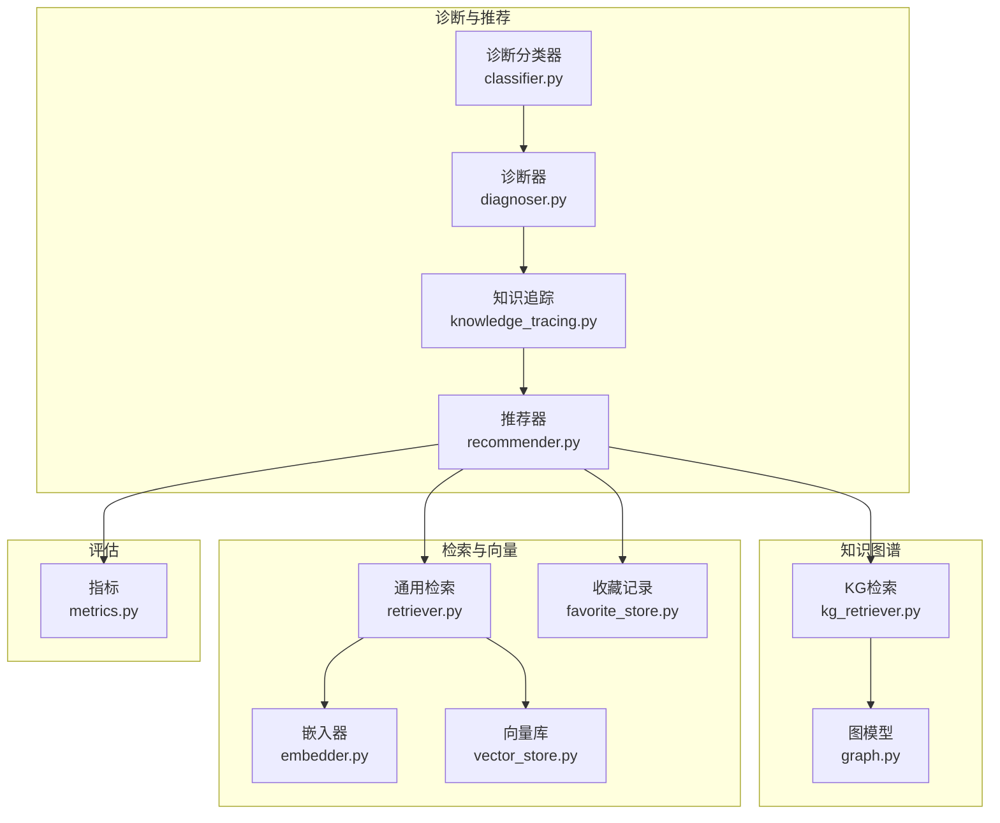
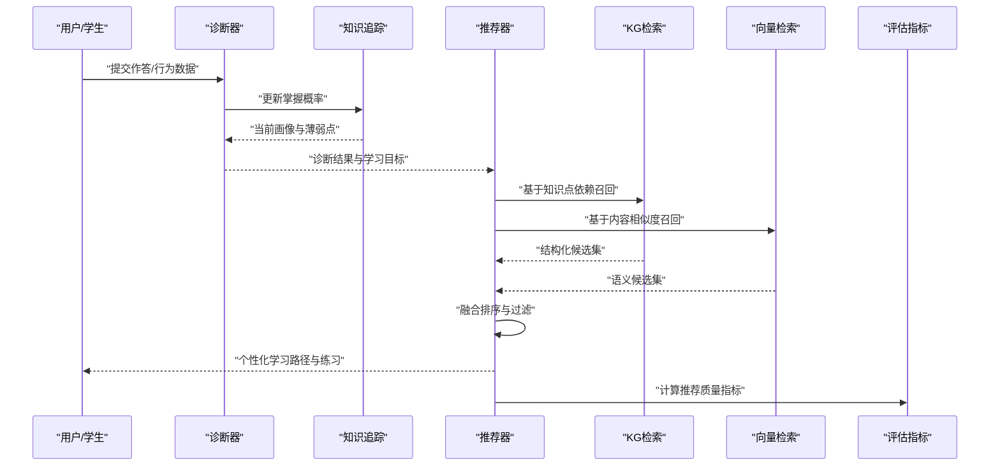
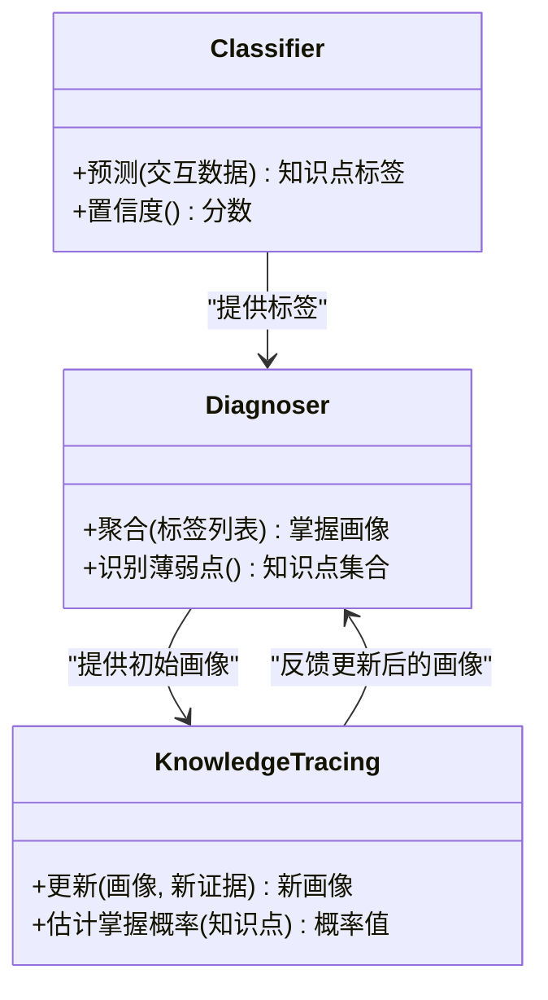
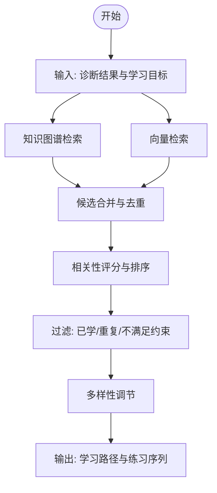
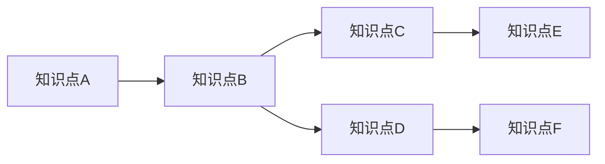
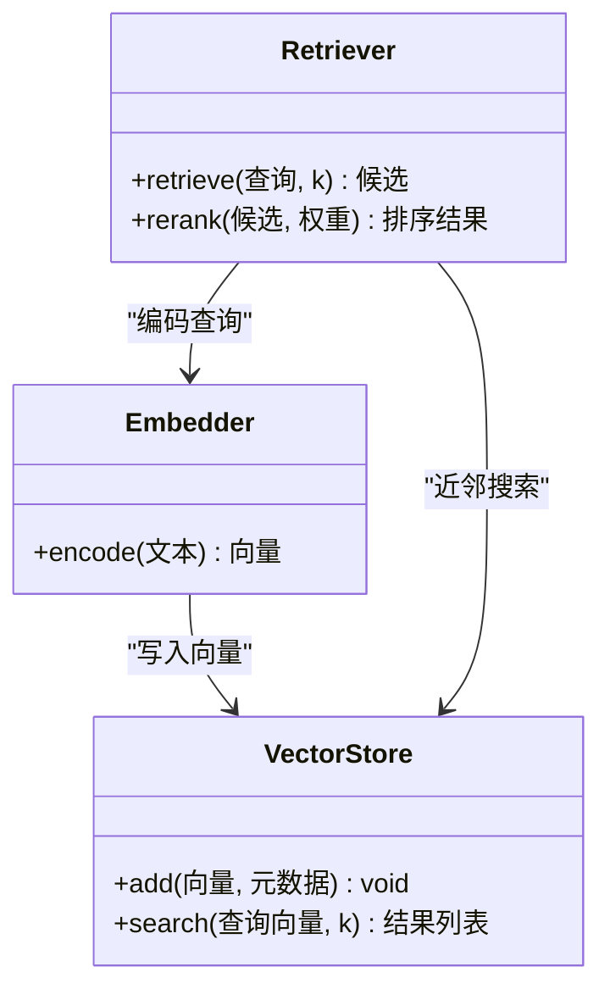
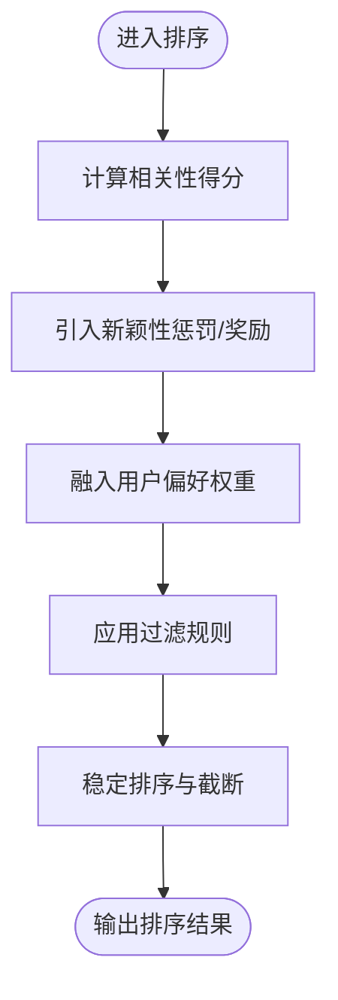
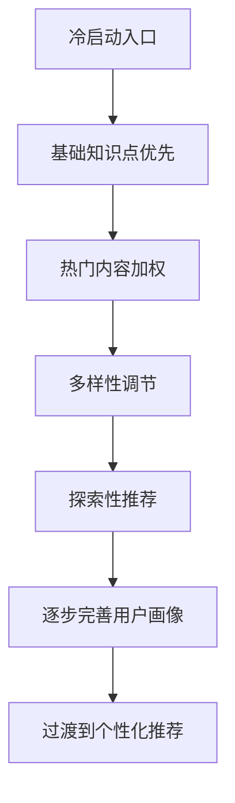
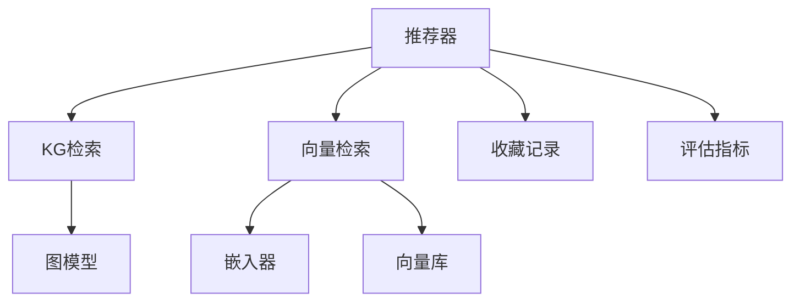

# 推荐系统

<cite>
**本文引用的文件**   
- [diagnosis/recommender.py](file://src/kag_pro/diagnosis/recommender.py)
- [diagnosis/classifier.py](file://src/kag_pro/diagnosis/classifier.py)
- [diagnosis/diagnoser.py](file://src/kag_pro/diagnosis/diagnoser.py)
- [diagnosis/knowledge_tracing.py](file://src/kag_pro/diagnosis/knowledge_tracing.py)
- [kg/kg_retriever.py](file://src/kag_pro/kg/kg_retriever.py)
- [kg/graph.py](file://src/kag_pro/kg/graph.py)
- [core/embedder.py](file://src/kag_pro/core/embedder.py)
- [core/vector_store.py](file://src/kag_pro/core/vector_store.py)
- [core/retriever.py](file://src/kag_pro/core/retriever.py)
- [core/favorite_store.py](file://src/kag_pro/core/favorite_store.py)
- [utils/config.py](file://src/kag_pro/utils/config.py)
- [evaluation/metrics.py](file://src/kag_pro/evaluation/metrics.py)
</cite>

## 目录
1. [简介](#简介)
2. [项目结构](#项目结构)
3. [核心组件](#核心组件)
4. [架构总览](#架构总览)
5. [详细组件分析](#详细组件分析)
6. [依赖关系分析](#依赖关系分析)
7. [性能考量](#性能考量)
8. [故障排查指南](#故障排查指南)
9. [结论](#结论)
10. [附录](#附录)

## 简介
本技术文档面向KAG-Pro的推荐系统模块，围绕教育场景下的个性化学习路径规划与内容推荐展开。文档覆盖以下关键主题：
- 推荐算法原理：基于内容的推荐、协同过滤思路与混合策略
- 个性化学习路径规划：知识点依赖分析、难度梯度设计、学习目标导向
- 冷启动解决方案：新用户适应与内容多样性保证
- 排序与过滤机制：相关性评分、新颖性考虑与用户偏好学习
- 配置选项：推荐数量控制、多样性调节与实时性要求
- 教育应用示例：依据学生诊断结果推荐学习内容与实践题目

## 项目结构
推荐系统相关代码主要分布在诊断（diagnosis）、知识图谱（kg）、检索与向量存储（core）以及评估（evaluation）等子模块中。整体组织遵循“按功能分层”的方式：
- diagnosis：诊断与推荐主流程，包含分类器、诊断器、知识追踪与推荐器
- kg：知识图谱构建与检索，支撑知识点依赖与结构化召回
- core：嵌入、向量库与通用检索能力，支撑基于内容与相似度召回
- evaluation：指标计算，用于评估推荐质量

图表来源
- [diagnosis/recommender.py](file://src/kag_pro/diagnosis/recommender.py)
- [diagnosis/classifier.py](file://src/kag_pro/diagnosis/classifier.py)
- [diagnosis/diagnoser.py](file://src/kag_pro/diagnosis/diagnoser.py)
- [diagnosis/knowledge_tracing.py](file://src/kag_pro/diagnosis/knowledge_tracing.py)
- [kg/kg_retriever.py](file://src/kag_pro/kg/kg_retriever.py)
- [kg/graph.py](file://src/kag_pro/kg/graph.py)
- [core/embedder.py](file://src/kag_pro/core/embedder.py)
- [core/vector_store.py](file://src/kag_pro/core/vector_store.py)
- [core/retriever.py](file://src/kag_pro/core/retriever.py)
- [core/favorite_store.py](file://src/kag_pro/core/favorite_store.py)
- [evaluation/metrics.py](file://src/kag_pro/evaluation/metrics.py)

章节来源
- [diagnosis/recommender.py](file://src/kag_pro/diagnosis/recommender.py)
- [diagnosis/classifier.py](file://src/kag_pro/diagnosis/classifier.py)
- [diagnosis/diagnoser.py](file://src/kag_pro/diagnosis/diagnoser.py)
- [diagnosis/knowledge_tracing.py](file://src/kag_pro/diagnosis/knowledge_tracing.py)
- [kg/kg_retriever.py](file://src/kag_pro/kg/kg_retriever.py)
- [kg/graph.py](file://src/kag_pro/kg/graph.py)
- [core/embedder.py](file://src/kag_pro/core/embedder.py)
- [core/vector_store.py](file://src/kag_pro/core/vector_store.py)
- [core/retriever.py](file://src/kag_pro/core/retriever.py)
- [core/favorite_store.py](file://src/kag_pro/core/favorite_store.py)
- [evaluation/metrics.py](file://src/kag_pro/evaluation/metrics.py)

## 核心组件
- 诊断分类器：将学生作答或行为映射到知识点掌握状态，为后续推荐提供输入信号
- 诊断器：聚合分类结果，形成当前学习画像与薄弱点清单
- 知识追踪：在时间维度上更新掌握概率，支持动态调整推荐难度与顺序
- 推荐器：融合多路召回与排序策略，输出个性化学习路径与练习建议
- 知识图谱检索：基于知识点依赖与先修关系进行结构化召回
- 向量检索：基于内容语义相似度的召回，结合嵌入与向量库
- 收藏记录：记录用户历史交互，辅助冷启动与多样性控制
- 评估指标：对推荐结果进行可量化评估，指导策略调优

章节来源
- [diagnosis/classifier.py](file://src/kag_pro/diagnosis/classifier.py)
- [diagnosis/diagnoser.py](file://src/kag_pro/diagnosis/diagnoser.py)
- [diagnosis/knowledge_tracing.py](file://src/kag_pro/diagnosis/knowledge_tracing.py)
- [diagnosis/recommender.py](file://src/kag_pro/diagnosis/recommender.py)
- [kg/kg_retriever.py](file://src/kag_pro/kg/kg_retriever.py)
- [kg/graph.py](file://src/kag_pro/kg/graph.py)
- [core/embedder.py](file://src/kag_pro/core/embedder.py)
- [core/vector_store.py](file://src/kag_pro/core/vector_store.py)
- [core/retriever.py](file://src/kag_pro/core/retriever.py)
- [core/favorite_store.py](file://src/kag_pro/core/favorite_store.py)
- [evaluation/metrics.py](file://src/kag_pro/evaluation/metrics.py)

## 架构总览
推荐系统采用“诊断驱动 + 多路召回 + 排序融合”的架构。诊断模块产出知识点掌握度与目标；推荐器据此触发知识图谱检索与向量检索，得到候选集后执行排序与过滤，最终生成学习路径与练习序列。

图表来源
- [diagnosis/diagnoser.py](file://src/kag_pro/diagnosis/diagnoser.py)
- [diagnosis/knowledge_tracing.py](file://src/kag_pro/diagnosis/knowledge_tracing.py)
- [diagnosis/recommender.py](file://src/kag_pro/diagnosis/recommender.py)
- [kg/kg_retriever.py](file://src/kag_pro/kg/kg_retriever.py)
- [core/retriever.py](file://src/kag_pro/core/retriever.py)
- [evaluation/metrics.py](file://src/kag_pro/evaluation/metrics.py)

## 详细组件分析

### 诊断与知识追踪
- 诊断分类器负责从原始交互数据中提取知识点标签与掌握信号
- 诊断器汇总各知识点的掌握情况，并识别薄弱环节
- 知识追踪在时序上更新掌握概率，支持动态难度调整与路径重规划

图表来源
- [diagnosis/classifier.py](file://src/kag_pro/diagnosis/classifier.py)
- [diagnosis/diagnoser.py](file://src/kag_pro/diagnosis/diagnoser.py)
- [diagnosis/knowledge_tracing.py](file://src/kag_pro/diagnosis/knowledge_tracing.py)

章节来源
- [diagnosis/classifier.py](file://src/kag_pro/diagnosis/classifier.py)
- [diagnosis/diagnoser.py](file://src/kag_pro/diagnosis/diagnoser.py)
- [diagnosis/knowledge_tracing.py](file://src/kag_pro/diagnosis/knowledge_tracing.py)

### 推荐器与多路召回
- 推荐器接收诊断结果与学习目标，触发知识图谱检索与向量检索
- 知识图谱检索利用先修关系与依赖边进行结构化召回
- 向量检索基于内容嵌入相似度进行语义召回
- 推荐器对两路候选进行融合、去重与排序，输出最终推荐序列

图表来源
- [diagnosis/recommender.py](file://src/kag_pro/diagnosis/recommender.py)
- [kg/kg_retriever.py](file://src/kag_pro/kg/kg_retriever.py)
- [core/retriever.py](file://src/kag_pro/core/retriever.py)

章节来源
- [diagnosis/recommender.py](file://src/kag_pro/diagnosis/recommender.py)
- [kg/kg_retriever.py](file://src/kag_pro/kg/kg_retriever.py)
- [core/retriever.py](file://src/kag_pro/core/retriever.py)

### 知识图谱与依赖关系
- 图模型维护知识点节点与依赖边，支持先修关系查询与路径规划
- KG检索根据薄弱知识点向上游依赖回溯，确保前置知识补齐

图表来源
- [kg/graph.py](file://src/kag_pro/kg/graph.py)
- [kg/kg_retriever.py](file://src/kag_pro/kg/kg_retriever.py)

章节来源
- [kg/graph.py](file://src/kag_pro/kg/graph.py)
- [kg/kg_retriever.py](file://src/kag_pro/kg/kg_retriever.py)

### 向量检索与内容相似度
- 嵌入器将文本内容转换为向量表示
- 向量库存储与索引这些向量，支持近邻搜索
- 通用检索接口封装相似度计算与Top-K返回

图表来源
- [core/embedder.py](file://src/kag_pro/core/embedder.py)
- [core/vector_store.py](file://src/kag_pro/core/vector_store.py)
- [core/retriever.py](file://src/kag_pro/core/retriever.py)

章节来源
- [core/embedder.py](file://src/kag_pro/core/embedder.py)
- [core/vector_store.py](file://src/kag_pro/core/vector_store.py)
- [core/retriever.py](file://src/kag_pro/core/retriever.py)

### 排序与过滤机制
- 相关性评分：综合诊断匹配度、内容相似度与先修关系强度
- 新颖性考虑：降低近期高频出现的内容权重，提升探索性
- 用户偏好学习：基于收藏记录与历史点击，动态调整权重
- 过滤规则：排除已掌握知识点、重复项与不符合难度区间的内容

图表来源
- [diagnosis/recommender.py](file://src/kag_pro/diagnosis/recommender.py)
- [core/favorite_store.py](file://src/kag_pro/core/favorite_store.py)

章节来源
- [diagnosis/recommender.py](file://src/kag_pro/diagnosis/recommender.py)
- [core/favorite_store.py](file://src/kag_pro/core/favorite_store.py)

### 冷启动解决方案
- 新用户适应：优先推荐高覆盖率的基础知识点与热门内容，快速建立画像
- 内容多样性保证：通过类别分布均衡与去重策略，避免单一主题垄断
- 探索与利用平衡：在小样本阶段提高探索比例，逐步收敛至个性化

图表来源
- [diagnosis/recommender.py](file://src/kag_pro/diagnosis/recommender.py)
- [core/favorite_store.py](file://src/kag_pro/core/favorite_store.py)

章节来源
- [diagnosis/recommender.py](file://src/kag_pro/diagnosis/recommender.py)
- [core/favorite_store.py](file://src/kag_pro/core/favorite_store.py)

### 配置选项
- 推荐数量控制：限制单次输出的条目数，兼顾体验与性能
- 多样性调节：控制不同主题/难度区间的分布比例
- 实时性要求：设置检索超时与缓存策略，保障响应时间
- 难度梯度：定义相邻知识点的难度差阈值，确保循序渐进

章节来源
- [utils/config.py](file://src/kag_pro/utils/config.py)
- [diagnosis/recommender.py](file://src/kag_pro/diagnosis/recommender.py)

### 评估与指标
- 使用评估指标对推荐结果进行量化分析，包括命中率、覆盖率、多样性与新颖性等
- 指标结果用于策略迭代与参数调优

章节来源
- [evaluation/metrics.py](file://src/kag_pro/evaluation/metrics.py)

## 依赖关系分析
推荐系统内部依赖清晰，诊断模块为上游，推荐器居中调度，KG与向量检索为下游召回源，收藏记录与评估为辅助模块。

图表来源
- [diagnosis/recommender.py](file://src/kag_pro/diagnosis/recommender.py)
- [kg/kg_retriever.py](file://src/kag_pro/kg/kg_retriever.py)
- [kg/graph.py](file://src/kag_pro/kg/graph.py)
- [core/retriever.py](file://src/kag_pro/core/retriever.py)
- [core/embedder.py](file://src/kag_pro/core/embedder.py)
- [core/vector_store.py](file://src/kag_pro/core/vector_store.py)
- [core/favorite_store.py](file://src/kag_pro/core/favorite_store.py)
- [evaluation/metrics.py](file://src/kag_pro/evaluation/metrics.py)

章节来源
- [diagnosis/recommender.py](file://src/kag_pro/diagnosis/recommender.py)
- [kg/kg_retriever.py](file://src/kag_pro/kg/kg_retriever.py)
- [kg/graph.py](file://src/kag_pro/kg/graph.py)
- [core/retriever.py](file://src/kag_pro/core/retriever.py)
- [core/embedder.py](file://src/kag_pro/core/embedder.py)
- [core/vector_store.py](file://src/kag_pro/core/vector_store.py)
- [core/favorite_store.py](file://src/kag_pro/core/favorite_store.py)
- [evaluation/metrics.py](file://src/kag_pro/evaluation/metrics.py)

## 性能考量
- 检索优化：对向量库进行索引与分区，减少近邻搜索耗时
- 缓存策略：对热点知识点与常见查询结果进行缓存，降低重复计算
- 批处理：批量编码与批量检索，提升吞吐
- 流式输出：分块返回推荐结果，改善首字节延迟
- 资源隔离：将KG检索与向量检索并行化，充分利用CPU/GPU资源

[本节为通用性能建议，无需特定文件引用]

## 故障排查指南
- 诊断异常：检查分类器输入格式与置信度阈值，确认薄弱点识别是否合理
- 召回为空：验证KG依赖边是否存在，检查向量库索引是否完整
- 排序异常：核对相关性权重与新颖性系数，确认过滤规则未误删
- 冷启动效果不佳：调整基础知识点优先级与多样性参数，增加探索比例
- 指标下降：定位具体指标（命中率/覆盖率/多样性），针对性调参

章节来源
- [diagnosis/classifier.py](file://src/kag_pro/diagnosis/classifier.py)
- [diagnosis/diagnoser.py](file://src/kag_pro/diagnosis/diagnoser.py)
- [diagnosis/recommender.py](file://src/kag_pro/diagnosis/recommender.py)
- [kg/kg_retriever.py](file://src/kag_pro/kg/kg_retriever.py)
- [core/retriever.py](file://src/kag_pro/core/retriever.py)
- [evaluation/metrics.py](file://src/kag_pro/evaluation/metrics.py)

## 结论
KAG-Pro推荐系统以诊断结果为驱动，融合知识图谱的结构化优势与向量检索的语义能力，形成稳健的多路召回与排序体系。通过冷启动策略与多样性控制，系统在初期即可提供高质量推荐；借助评估指标与配置选项，可在实际教育场景中持续优化与落地。

[本节为总结性内容，无需特定文件引用]

## 附录

### 教育场景应用示例
- 步骤一：收集学生作答与课堂表现，运行诊断分类器与诊断器，生成薄弱知识点清单
- 步骤二：知识追踪更新掌握概率，确定学习目标（如补齐先修知识或冲刺高阶概念）
- 步骤三：推荐器触发KG检索与向量检索，得到候选集并进行融合排序
- 步骤四：应用过滤与多样性调节，输出循序渐进的学习路径与配套练习
- 步骤五：收集反馈与成绩变化，用评估指标衡量推荐效果并迭代策略

章节来源
- [diagnosis/classifier.py](file://src/kag_pro/diagnosis/classifier.py)
- [diagnosis/diagnoser.py](file://src/kag_pro/diagnosis/diagnoser.py)
- [diagnosis/knowledge_tracing.py](file://src/kag_pro/diagnosis/knowledge_tracing.py)
- [diagnosis/recommender.py](file://src/kag_pro/diagnosis/recommender.py)
- [kg/kg_retriever.py](file://src/kag_pro/kg/kg_retriever.py)
- [core/retriever.py](file://src/kag_pro/core/retriever.py)
- [evaluation/metrics.py](file://src/kag_pro/evaluation/metrics.py)