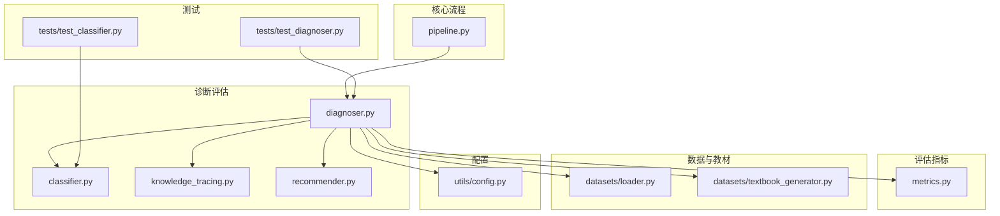
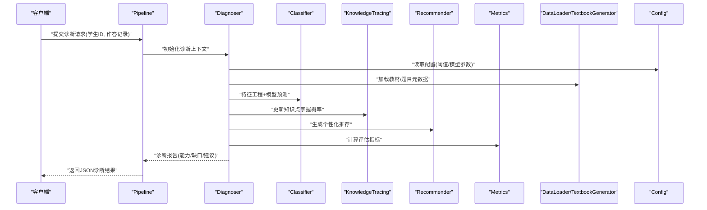
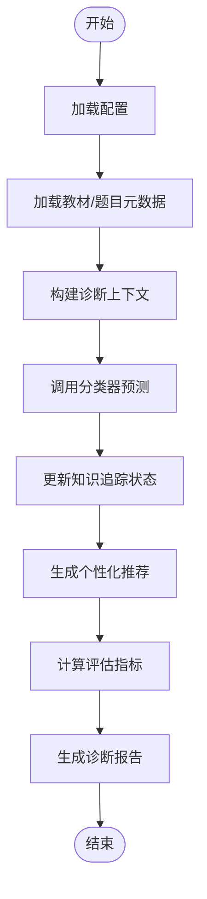
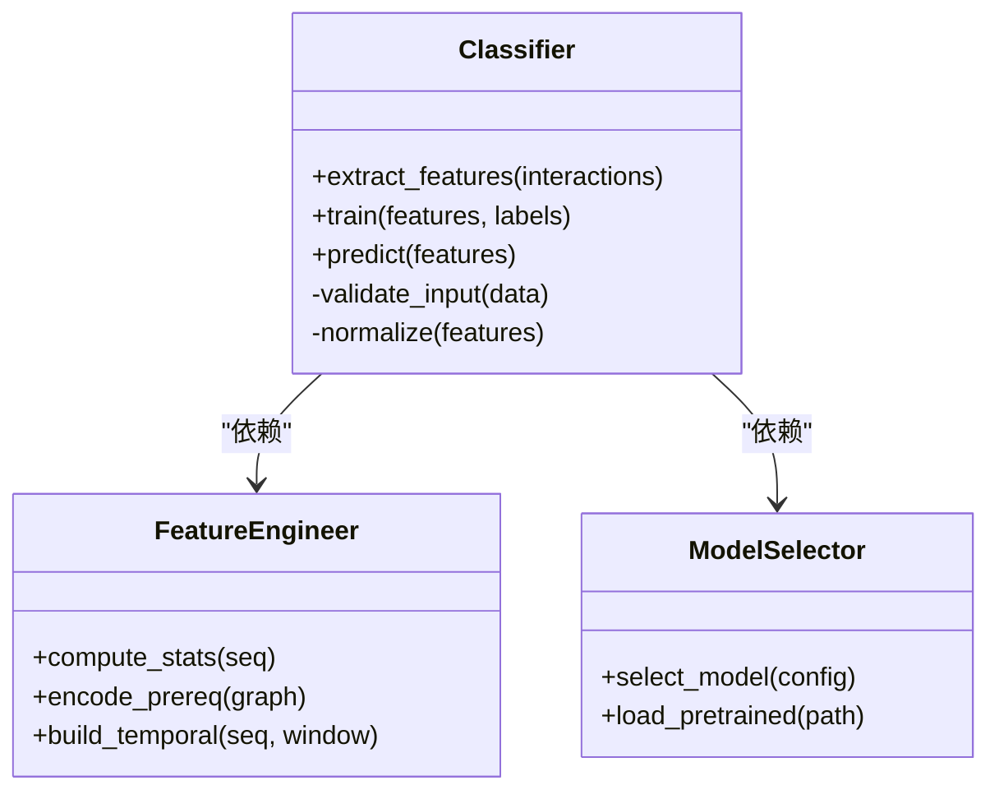
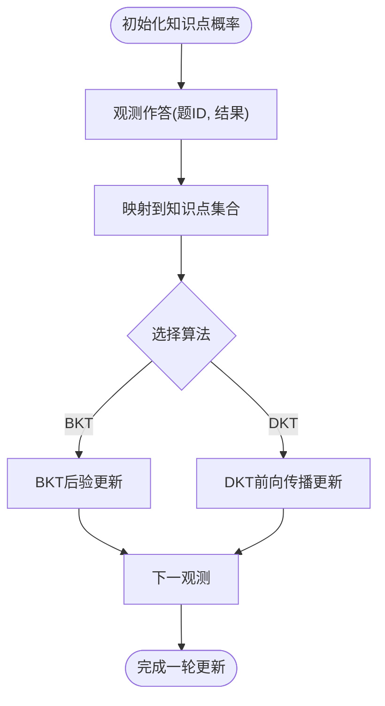
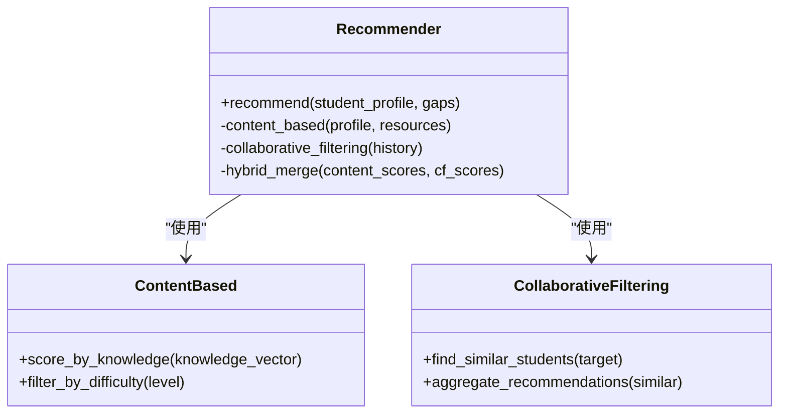
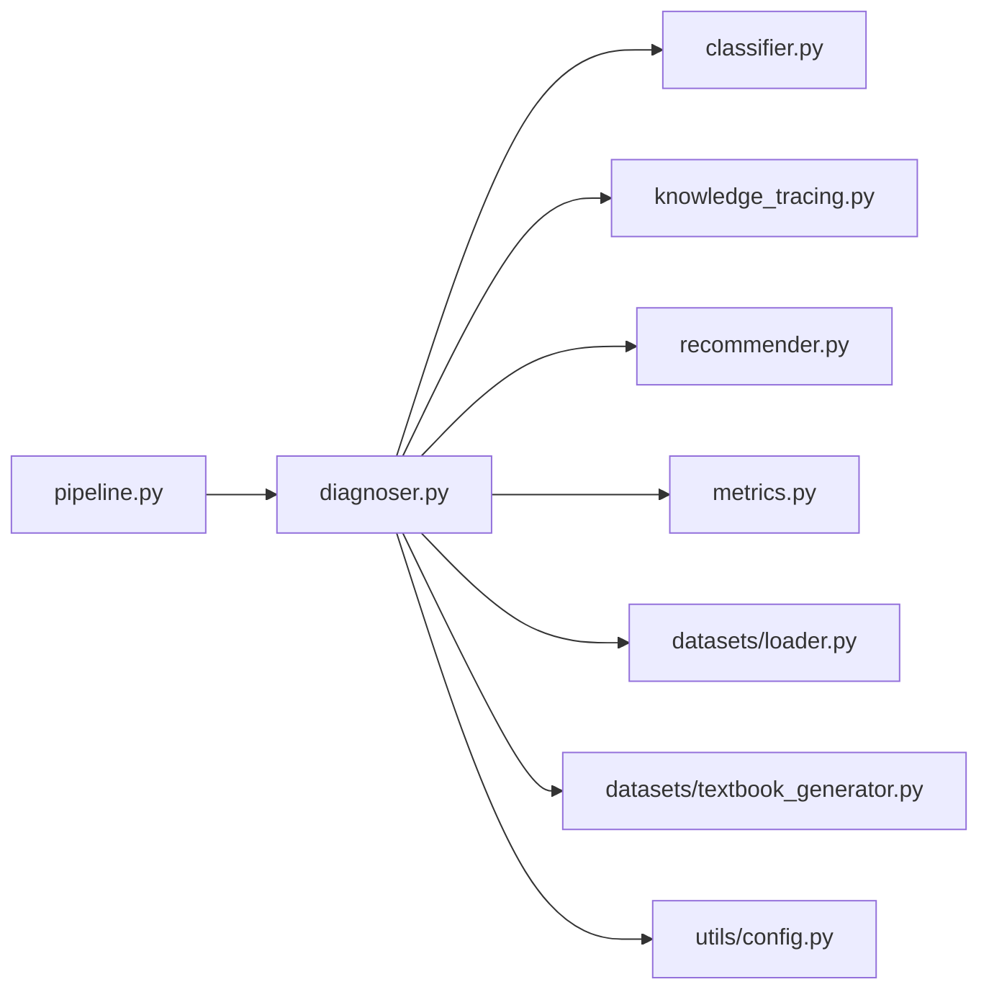

# 智能诊断评估模块

<cite>
**本文引用的文件**   
- [diagnoser.py](file://src/kag_pro/diagnosis/diagnoser.py)
- [classifier.py](file://src/kag_pro/diagnosis/classifier.py)
- [knowledge_tracing.py](file://src/kag_pro/diagnosis/knowledge_tracing.py)
- [recommender.py](file://src/kag_pro/diagnosis/recommender.py)
- [metrics.py](file://src/kag_pro/evaluation/metrics.py)
- [pipeline.py](file://src/kag_pro/core/pipeline.py)
- [loader.py](file://src/kag_pro/data/datasets/loader.py)
- [textbook_generator.py](file://src/kag_pro/data/datasets/textbook_generator.py)
- [config.py](file://src/kag_pro/utils/config.py)
- [test_diagnoser.py](file://tests/test_diagnoser.py)
- [test_classifier.py](file://tests/test_classifier.py)
</cite>

## 目录
1. [简介](#简介)
2. [项目结构](#项目结构)
3. [核心组件](#核心组件)
4. [架构总览](#架构总览)
5. [详细组件分析](#详细组件分析)
6. [依赖关系分析](#依赖关系分析)
7. [性能考量](#性能考量)
8. [故障排查指南](#故障排查指南)
9. [结论](#结论)
10. [附录](#附录)

## 简介
本技术文档面向KAG-Pro的智能诊断评估模块，聚焦以下目标：
- 解释学生能力评估模型与学习缺口识别机制
- 说明分类器的实现细节（特征工程、模型选择、预测算法）
- 文档化知识追踪技术的实现（BKT、DKT等）
- 阐述个性化推荐策略（基于内容、协同过滤、混合推荐）
- 描述诊断报告生成逻辑（能力雷达图、学习建议、问题诊断结果）
- 提供API接口规范（请求格式、响应结构、错误处理）
- 给出教育场景应用示例（能力评估与学习路径规划）

## 项目结构
诊断评估模块位于 src/kag_pro/diagnosis 下，包含诊断编排、分类器、知识追踪与推荐器等核心子模块；评估指标在 evaluation 中；数据加载与教材生成在 data/datasets 中；配置在 utils 中。测试用例覆盖诊断与分类器。

图表来源
- [diagnoser.py](file://src/kag_pro/diagnosis/diagnoser.py)
- [classifier.py](file://src/kag_pro/diagnosis/classifier.py)
- [knowledge_tracing.py](file://src/kag_pro/diagnosis/knowledge_tracing.py)
- [recommender.py](file://src/kag_pro/diagnosis/recommender.py)
- [metrics.py](file://src/kag_pro/evaluation/metrics.py)
- [pipeline.py](file://src/kag_pro/core/pipeline.py)
- [loader.py](file://src/kag_pro/data/datasets/loader.py)
- [textbook_generator.py](file://src/kag_pro/data/datasets/textbook_generator.py)
- [config.py](file://src/kag_pro/utils/config.py)
- [test_diagnoser.py](file://tests/test_diagnoser.py)
- [test_classifier.py](file://tests/test_classifier.py)

章节来源
- [diagnoser.py](file://src/kag_pro/diagnosis/diagnoser.py)
- [classifier.py](file://src/kag_pro/diagnosis/classifier.py)
- [knowledge_tracing.py](file://src/kag_pro/diagnosis/knowledge_tracing.py)
- [recommender.py](file://src/kag_pro/diagnosis/recommender.py)
- [metrics.py](file://src/kag_pro/evaluation/metrics.py)
- [pipeline.py](file://src/kag_pro/core/pipeline.py)
- [loader.py](file://src/kag_pro/data/datasets/loader.py)
- [textbook_generator.py](file://src/kag_pro/data/datasets/textbook_generator.py)
- [config.py](file://src/kag_pro/utils/config.py)
- [test_diagnoser.py](file://tests/test_diagnoser.py)
- [test_classifier.py](file://tests/test_classifier.py)

## 核心组件
- 诊断编排器：负责串联分类器、知识追踪、推荐器与评估指标，输出结构化诊断报告。
- 分类器：基于特征工程与模型选择进行能力层级或知识点掌握度预测。
- 知识追踪：维护学生对知识点的动态掌握概率，支持BKT/DKT等算法。
- 推荐器：根据诊断结果与历史交互生成个性化学习资源与练习序列。
- 评估指标：用于衡量诊断与推荐效果（如准确率、召回率、AUC等）。

章节来源
- [diagnoser.py](file://src/kag_pro/diagnosis/diagnoser.py)
- [classifier.py](file://src/kag_pro/diagnosis/classifier.py)
- [knowledge_tracing.py](file://src/kag_pro/diagnosis/knowledge_tracing.py)
- [recommender.py](file://src/kag_pro/diagnosis/recommender.py)
- [metrics.py](file://src/kag_pro/evaluation/metrics.py)

## 架构总览
诊断评估模块以“输入-处理-输出”的流水线方式组织，结合知识图谱与教材数据，形成闭环的诊断与推荐系统。

图表来源
- [pipeline.py](file://src/kag_pro/core/pipeline.py)
- [diagnoser.py](file://src/kag_pro/diagnosis/diagnoser.py)
- [classifier.py](file://src/kag_pro/diagnosis/classifier.py)
- [knowledge_tracing.py](file://src/kag_pro/diagnosis/knowledge_tracing.py)
- [recommender.py](file://src/kag_pro/diagnosis/recommender.py)
- [metrics.py](file://src/kag_pro/evaluation/metrics.py)
- [loader.py](file://src/kag_pro/data/datasets/loader.py)
- [textbook_generator.py](file://src/kag_pro/data/datasets/textbook_generator.py)
- [config.py](file://src/kag_pro/utils/config.py)

## 详细组件分析

### 诊断编排器（Diagnoser）
职责与流程
- 接收原始交互数据（学生ID、题目序列、作答结果），构建诊断上下文。
- 调用分类器进行能力/知识点预测，驱动知识追踪更新状态。
- 基于诊断结果调用推荐器生成学习资源与练习序列。
- 使用评估指标对诊断质量进行度量，并汇总为结构化报告。

关键数据结构
- 诊断上下文：包含学生ID、时间戳、交互序列、已掌握知识点集合、待评估知识点集合。
- 诊断报告：包含能力维度评分、学习缺口列表、推荐资源清单、评估指标摘要。

异常与边界
- 缺失交互数据时回退到默认策略（如冷启动推荐）。
- 模型不可用时降级为规则基线。

图表来源
- [diagnoser.py](file://src/kag_pro/diagnosis/diagnoser.py)
- [config.py](file://src/kag_pro/utils/config.py)
- [loader.py](file://src/kag_pro/data/datasets/loader.py)
- [textbook_generator.py](file://src/kag_pro/data/datasets/textbook_generator.py)
- [classifier.py](file://src/kag_pro/diagnosis/classifier.py)
- [knowledge_tracing.py](file://src/kag_pro/diagnosis/knowledge_tracing.py)
- [recommender.py](file://src/kag_pro/diagnosis/recommender.py)
- [metrics.py](file://src/kag_pro/evaluation/metrics.py)

章节来源
- [diagnoser.py](file://src/kag_pro/diagnosis/diagnoser.py)
- [test_diagnoser.py](file://tests/test_diagnoser.py)

### 分类器（Classifier）
功能要点
- 特征工程：从交互序列中提取统计特征（正确率、连续正确/错误、答题时长分布）、知识点关联特征（先修关系强度）、时序特征（最近N次表现）。
- 模型选择：支持多种分类器（如树模型、线性模型、神经网络），通过配置切换。
- 预测算法：输出能力等级或知识点掌握概率，支持多标签或多任务扩展。

复杂度与优化
- 特征提取时间复杂度与交互长度线性相关；可通过滑动窗口与增量更新降低开销。
- 模型推理可缓存中间表示，减少重复计算。

图表来源
- [classifier.py](file://src/kag_pro/diagnosis/classifier.py)

章节来源
- [classifier.py](file://src/kag_pro/diagnosis/classifier.py)
- [test_classifier.py](file://tests/test_classifier.py)

### 知识追踪（KnowledgeTracing）
算法支持
- 贝叶斯知识追踪（BKT）：基于隐变量建模知识点掌握概率，利用观测作答更新后验概率。
- 深度知识追踪（DKT）：使用循环网络或注意力机制捕捉长期依赖，输出掌握概率。

状态管理
- 维护每个知识点的掌握概率向量，随新交互逐步更新。
- 支持知识点先修关系的约束传播，提升估计一致性。

图表来源
- [knowledge_tracing.py](file://src/kag_pro/diagnosis/knowledge_tracing.py)

章节来源
- [knowledge_tracing.py](file://src/kag_pro/diagnosis/knowledge_tracing.py)

### 推荐器（Recommender）
推荐策略
- 基于内容的推荐：依据知识点标签、难度、题型匹配学生当前能力与缺口。
- 协同过滤：基于相似学生群体的偏好与成功路径进行推荐。
- 混合推荐：融合内容与协同信号，按权重或门控机制动态组合。

排序与多样性
- 引入多样性惩罚与探索项，避免推荐同质化。
- 考虑先修关系与学习路径连贯性，保证推荐的可执行性。

图表来源
- [recommender.py](file://src/kag_pro/diagnosis/recommender.py)

章节来源
- [recommender.py](file://src/kag_pro/diagnosis/recommender.py)

### 评估指标（Metrics）
指标类型
- 分类类：准确率、精确率、召回率、F1、AUC。
- 回归/概率类：对数损失、校准误差。
- 推荐类：命中率、平均倒数排名（MRR）、覆盖率。

用途
- 在诊断阶段评估能力预测质量。
- 在推荐阶段评估资源命中与排序质量。

章节来源
- [metrics.py](file://src/kag_pro/evaluation/metrics.py)

## 依赖关系分析
模块间耦合与协作
- Diagnoser 作为编排中心，依赖 Classifier、KnowledgeTracing、Recommender、Metrics。
- DataLoader 与 TextbookGenerator 提供教材与题目元数据，支撑特征工程与推荐资源池。
- Config 统一注入阈值与模型参数，便于实验与部署切换。

图表来源
- [pipeline.py](file://src/kag_pro/core/pipeline.py)
- [diagnoser.py](file://src/kag_pro/diagnosis/diagnoser.py)
- [classifier.py](file://src/kag_pro/diagnosis/classifier.py)
- [knowledge_tracing.py](file://src/kag_pro/diagnosis/knowledge_tracing.py)
- [recommender.py](file://src/kag_pro/diagnosis/recommender.py)
- [metrics.py](file://src/kag_pro/evaluation/metrics.py)
- [loader.py](file://src/kag_pro/data/datasets/loader.py)
- [textbook_generator.py](file://src/kag_pro/data/datasets/textbook_generator.py)
- [config.py](file://src/kag_pro/utils/config.py)

章节来源
- [pipeline.py](file://src/kag_pro/core/pipeline.py)
- [diagnoser.py](file://src/kag_pro/diagnosis/diagnoser.py)
- [classifier.py](file://src/kag_pro/diagnosis/classifier.py)
- [knowledge_tracing.py](file://src/kag_pro/diagnosis/knowledge_tracing.py)
- [recommender.py](file://src/kag_pro/diagnosis/recommender.py)
- [metrics.py](file://src/kag_pro/evaluation/metrics.py)
- [loader.py](file://src/kag_pro/data/datasets/loader.py)
- [textbook_generator.py](file://src/kag_pro/data/datasets/textbook_generator.py)
- [config.py](file://src/kag_pro/utils/config.py)

## 性能考量
- 特征工程增量更新：采用滑动窗口与缓存，避免全量重算。
- 知识追踪批处理：批量更新知识点概率，减少I/O与模型调用次数。
- 推荐器并行检索：对内容库与协同库并发查询，合并排序。
- 模型热加载与预热：在启动阶段预加载常用模型，缩短首请求延迟。
- 指标计算异步化：将耗时指标计算放入后台队列，不影响主流程。

[本节为通用指导，不直接分析具体文件]

## 故障排查指南
常见问题与定位
- 诊断结果为空或缺失字段：检查输入交互序列是否完整，确认数据加载与解析逻辑。
- 分类器预测异常：验证特征维度与模型期望一致，检查归一化与缺失值填充。
- 知识追踪未更新：确认知识点映射是否正确，检查先修关系与阈值设置。
- 推荐结果单一：调整多样性惩罚与探索权重，扩大候选集规模。
- 指标计算失败：核对真实标签与预测对齐，确保数值稳定与范围合法。

章节来源
- [diagnoser.py](file://src/kag_pro/diagnosis/diagnoser.py)
- [classifier.py](file://src/kag_pro/diagnosis/classifier.py)
- [knowledge_tracing.py](file://src/kag_pro/diagnosis/knowledge_tracing.py)
- [recommender.py](file://src/kag_pro/diagnosis/recommender.py)
- [metrics.py](file://src/kag_pro/evaluation/metrics.py)

## 结论
本模块通过分类器、知识追踪与推荐器的协同工作，实现了从能力评估到学习缺口的精准识别，并生成可执行的个性化学习路径。配合评估指标与配置化管理，系统具备良好的可扩展性与稳定性，适用于多学科、多学段的自适应学习场景。

[本节为总结性内容，不直接分析具体文件]

## 附录

### API接口规范
- 端点：POST /api/diagnose
- 请求体字段
  - student_id: 字符串，学生唯一标识
  - interactions: 数组，元素包含 question_id、answer、timestamp
  - options: 对象，包含 classifier、kt_algorithm、recommend_strategy、thresholds
- 响应体字段
  - status: 字符串，success/error
  - message: 字符串，简要信息
  - report: 对象
    - abilities: 对象，各能力维度得分
    - gaps: 数组，学习缺口知识点列表
    - recommendations: 数组，推荐资源与练习
    - metrics: 对象，评估指标摘要
- 错误码
  - 400: 请求参数校验失败
  - 404: 学生或资源不存在
  - 500: 内部服务异常

[本节为概念性接口定义，不直接分析具体文件]

### 教育场景应用示例
- 初中数学函数入门
  - 输入：学生在“一次函数”“二次函数”相关题目的作答序列
  - 过程：分类器预测能力等级，BKT/DKT更新掌握概率，推荐器生成针对性练习
  - 输出：能力雷达图、薄弱知识点清单、下一步学习路径
- 高中物理力学综合
  - 输入：跨章节题目作答与错题回顾
  - 过程：协同过滤发现相似学生成功路径，混合推荐平衡难度与多样性
  - 输出：阶段性复习计划与巩固练习包

[本节为概念性示例，不直接分析具体文件]