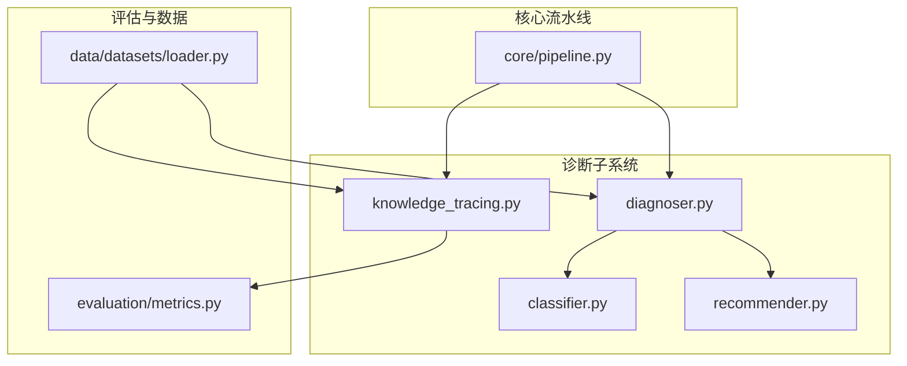
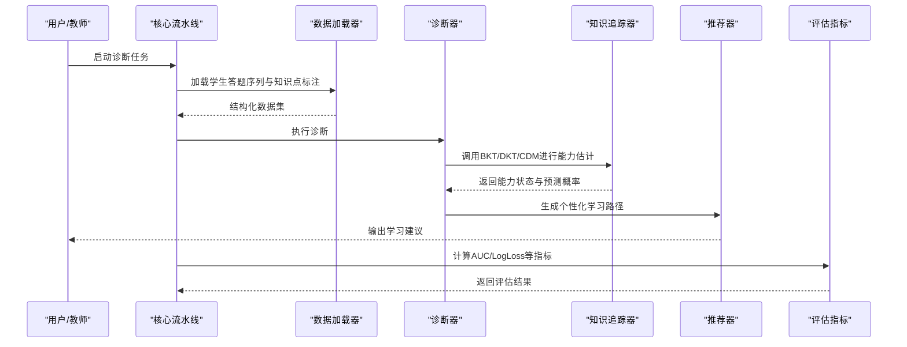
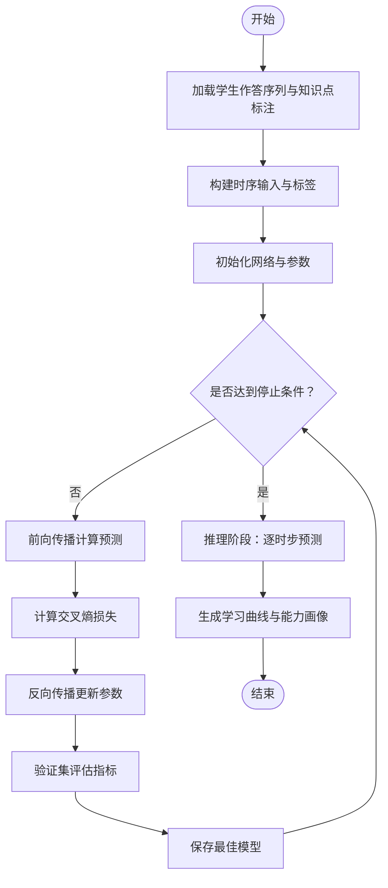
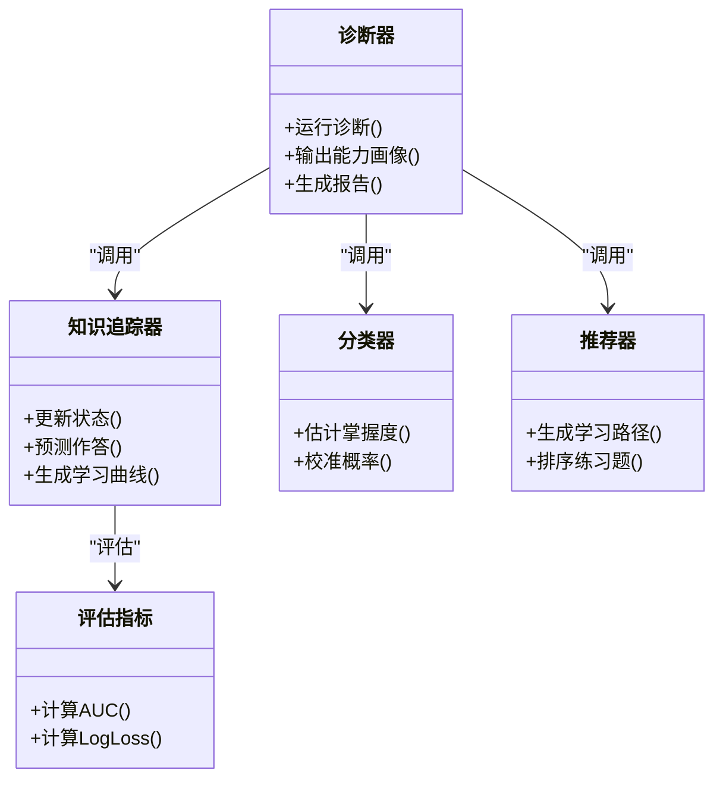

# 知识追踪

<cite>
**本文引用的文件**   
- [README.md](file://README.md)
- [diagnosis/knowledge_tracing.py](file://src/kag_pro/diagnosis/knowledge_tracing.py)
- [diagnosis/classifier.py](file://src/kag_pro/diagnosis/classifier.py)
- [diagnosis/diagnoser.py](file://src/kag_pro/diagnosis/diagnoser.py)
- [diagnosis/recommender.py](file://src/kag_pro/diagnosis/recommender.py)
- [diagnosis/__init__.py](file://src/kag_pro/diagnosis/__init__.py)
- [evaluation/metrics.py](file://src/kag_pro/evaluation/metrics.py)
- [data/datasets/loader.py](file://src/kag_pro/data/datasets/loader.py)
- [core/pipeline.py](file://src/kag_pro/core/pipeline.py)
</cite>

## 目录
1. [简介](#简介)
2. [项目结构](#项目结构)
3. [核心组件](#核心组件)
4. [架构总览](#架构总览)
5. [详细组件分析](#详细组件分析)
6. [依赖关系分析](#依赖关系分析)
7. [性能考虑](#性能考虑)
8. [故障排查指南](#故障排查指南)
9. [结论](#结论)
10. [附录](#附录)

## 简介
本技术文档聚焦KAG-Pro的知识追踪模块，系统阐述贝叶斯知识追踪（BKT）、深度知识追踪（DKT）与认知诊断模型（CDM）的理论基础，并结合仓库中诊断子系统的实现，说明状态转移概率、观测概率与学习曲线建模在工程中的落地方式。文档同时覆盖数据要求（学生答题序列、时间戳、知识点标注）、训练流程（损失函数、优化策略、过拟合处理）、应用场景（学习进度监控、能力变化趋势分析、个性化学习路径规划），并提供可操作的代码示例路径，帮助读者快速将知识追踪应用于学生能力的动态评估。

## 项目结构
知识追踪相关代码集中在 diagnosis 子包内，配合 evaluation 指标与 data/datasets 数据加载工具，以及 core.pipeline 的流水线编排，形成从数据到诊断再到推荐的闭环。

图表来源
- [diagnosis/knowledge_tracing.py](file://src/kag_pro/diagnosis/knowledge_tracing.py)
- [diagnosis/classifier.py](file://src/kag_pro/diagnosis/classifier.py)
- [diagnosis/diagnoser.py](file://src/kag_pro/diagnosis/diagnoser.py)
- [diagnosis/recommender.py](file://src/kag_pro/diagnosis/recommender.py)
- [evaluation/metrics.py](file://src/kag_pro/evaluation/metrics.py)
- [data/datasets/loader.py](file://src/kag_pro/data/datasets/loader.py)
- [core/pipeline.py](file://src/kag_pro/core/pipeline.py)

章节来源
- [README.md](file://README.md)
- [diagnosis/knowledge_tracing.py](file://src/kag_pro/diagnosis/knowledge_tracing.py)
- [diagnosis/classifier.py](file://src/kag_pro/diagnosis/classifier.py)
- [diagnosis/diagnoser.py](file://src/kag_pro/diagnosis/diagnoser.py)
- [diagnosis/recommender.py](file://src/kag_pro/diagnosis/recommender.py)
- [evaluation/metrics.py](file://src/kag_pro/evaluation/metrics.py)
- [data/datasets/loader.py](file://src/kag_pro/data/datasets/loader.py)
- [core/pipeline.py](file://src/kag_pro/core/pipeline.py)

## 核心组件
- 知识追踪器：封装BKT/DKT/CDM等算法接口，提供状态更新、预测与可视化学习曲线的统一入口。
- 诊断器：聚合多模型结果，输出学生能力画像与诊断报告。
- 分类器：面向知识点掌握度的二分类或概率校准模块，支撑CDM类方法。
- 推荐器：基于诊断结果生成个性化学习路径与练习建议。
- 评估指标：AUC、LogLoss、准确率等，用于模型选择与对比。
- 数据加载器：读取学生答题序列、时间戳与知识点标注，构建训练/验证/测试集。
- 流水线：串联数据准备、模型训练、评估与部署步骤。

章节来源
- [diagnosis/knowledge_tracing.py](file://src/kag_pro/diagnosis/knowledge_tracing.py)
- [diagnosis/diagnoser.py](file://src/kag_pro/diagnosis/diagnoser.py)
- [diagnosis/classifier.py](file://src/kag_pro/diagnosis/classifier.py)
- [diagnosis/recommender.py](file://src/kag_pro/diagnosis/recommender.py)
- [evaluation/metrics.py](file://src/kag_pro/evaluation/metrics.py)
- [data/datasets/loader.py](file://src/kag_pro/data/datasets/loader.py)
- [core/pipeline.py](file://src/kag_pro/core/pipeline.py)

## 架构总览
下图展示知识追踪在KAG-Pro中的端到端流程：数据加载后进入诊断器，诊断器调用知识追踪器进行能力估计，随后由推荐器生成学习路径；评估模块对预测质量进行度量，核心流水线负责整体编排。

图表来源
- [core/pipeline.py](file://src/kag_pro/core/pipeline.py)
- [data/datasets/loader.py](file://src/kag_pro/data/datasets/loader.py)
- [diagnosis/diagnoser.py](file://src/kag_pro/diagnosis/diagnoser.py)
- [diagnosis/knowledge_tracing.py](file://src/kag_pro/diagnosis/knowledge_tracing.py)
- [diagnosis/recommender.py](file://src/kag_pro/diagnosis/recommender.py)
- [evaluation/metrics.py](file://src/kag_pro/evaluation/metrics.py)

## 详细组件分析

### 理论基础与算法映射
- 贝叶斯知识追踪（BKT）
  - 理论要点：以隐变量表示学生对某知识点的掌握状态，通过状态转移概率与观测概率刻画学习过程。
  - 工程映射：知识追踪器提供状态初始化、转移与观测更新接口，支持按知识点维度维护能力分布。
- 深度知识追踪（DKT）
  - 理论要点：使用循环网络（如RNN/LSTM）建模学生作答序列，捕捉长期依赖与顺序效应。
  - 工程映射：知识追踪器封装序列输入、隐藏状态传递与逐时步预测，便于替换不同网络结构。
- 认知诊断模型（CDM）
  - 理论要点：将题目属性与学生能力向量结合，通过判别函数估计掌握度，常用于多维能力诊断。
  - 工程映射：分类器与诊断器协同工作，利用题目-知识点映射矩阵与参数学习得到能力向量。

章节来源
- [diagnosis/knowledge_tracing.py](file://src/kag_pro/diagnosis/knowledge_tracing.py)
- [diagnosis/classifier.py](file://src/kag_pro/diagnosis/classifier.py)
- [diagnosis/diagnoser.py](file://src/kag_pro/diagnosis/diagnoser.py)

### 数据要求与预处理
- 必需字段
  - 学生ID、题目ID、作答结果（正确/错误）、时间戳、知识点标签（单点或多点）。
- 数据结构建议
  - 以“学生-时间步”为粒度的序列记录，便于DKT的时序建模与BKT的状态更新。
  - 知识点-题目映射表，支撑CDM的题目属性矩阵构建。
- 预处理步骤
  - 清洗缺失值与异常时间戳；对齐知识点标注；划分训练/验证/测试集；必要时做序列截断或填充。

章节来源
- [data/datasets/loader.py](file://src/kag_pro/data/datasets/loader.py)

### 训练流程与优化策略
- 损失函数设计
  - BKT：基于观测概率的对数似然损失，最大化真实作答的概率。
  - DKT：逐时步交叉熵损失，衡量预测正确率与真实标签的差异。
  - CDM：结合题目属性的判别损失，常用对数几率或交叉熵形式。
- 优化策略
  - 随机梯度下降及其变体（Adam/SGD），学习率调度与早停机制。
  - 正则化（L2、Dropout）抑制过拟合；对BKT可使用先验约束提升稳定性。
- 过拟合处理
  - 验证集监控、最小验证损失保存、数据增强（如序列重采样）、简化模型复杂度。

章节来源
- [diagnosis/knowledge_tracing.py](file://src/kag_pro/diagnosis/knowledge_tracing.py)
- [diagnosis/classifier.py](file://src/kag_pro/diagnosis/classifier.py)
- [diagnosis/diagnoser.py](file://src/kag_pro/diagnosis/diagnoser.py)
- [evaluation/metrics.py](file://src/kag_pro/evaluation/metrics.py)

### 应用与示例路径
- 学习进度监控
  - 使用知识追踪器按时间步输出各知识点掌握概率，绘制学习曲线并设置阈值预警。
- 能力变化趋势分析
  - 比较不同时间段的能力向量或掌握度变化，识别薄弱知识点与进步显著领域。
- 个性化学习路径规划
  - 诊断器汇总能力画像，推荐器依据当前掌握度与目标知识点生成练习序列。

示例路径（不直接粘贴代码，仅给出定位）
- 使用知识追踪进行学生能力动态评估
  - 参考：[diagnosis/knowledge_tracing.py](file://src/kag_pro/diagnosis/knowledge_tracing.py)
  - 参考：[diagnosis/diagnoser.py](file://src/kag_pro/diagnosis/diagnoser.py)
  - 参考：[diagnosis/recommender.py](file://src/kag_pro/diagnosis/recommender.py)
  - 参考：[data/datasets/loader.py](file://src/kag_pro/data/datasets/loader.py)

章节来源
- [diagnosis/knowledge_tracing.py](file://src/kag_pro/diagnosis/knowledge_tracing.py)
- [diagnosis/diagnoser.py](file://src/kag_pro/diagnosis/diagnoser.py)
- [diagnosis/recommender.py](file://src/kag_pro/diagnosis/recommender.py)
- [data/datasets/loader.py](file://src/kag_pro/data/datasets/loader.py)

### 流程图：DKT训练与预测

图表来源
- [diagnosis/knowledge_tracing.py](file://src/kag_pro/diagnosis/knowledge_tracing.py)
- [evaluation/metrics.py](file://src/kag_pro/evaluation/metrics.py)

## 依赖关系分析
诊断子系统内部耦合清晰：诊断器协调知识追踪器与推荐器；分类器作为CDM的核心组件被诊断器调用；评估指标独立于模型，供流水线统一调用。

图表来源
- [diagnosis/diagnoser.py](file://src/kag_pro/diagnosis/diagnoser.py)
- [diagnosis/knowledge_tracing.py](file://src/kag_pro/diagnosis/knowledge_tracing.py)
- [diagnosis/classifier.py](file://src/kag_pro/diagnosis/classifier.py)
- [diagnosis/recommender.py](file://src/kag_pro/diagnosis/recommender.py)
- [evaluation/metrics.py](file://src/kag_pro/evaluation/metrics.py)

章节来源
- [diagnosis/diagnoser.py](file://src/kag_pro/diagnosis/diagnoser.py)
- [diagnosis/knowledge_tracing.py](file://src/kag_pro/diagnosis/knowledge_tracing.py)
- [diagnosis/classifier.py](file://src/kag_pro/diagnosis/classifier.py)
- [diagnosis/recommender.py](file://src/kag_pro/diagnosis/recommender.py)
- [evaluation/metrics.py](file://src/kag_pro/evaluation/metrics.py)

## 性能考虑
- 序列长度与批大小：合理设置批次与最大序列长度，平衡内存与收敛速度。
- 稀疏性与冷启动：对低频知识点采用平滑先验或共享表示，缓解冷启动问题。
- 在线更新：对BKT可采用增量更新；对DKT/CDM需权衡全量重训与微调成本。
- 指标监控：关注AUC与LogLoss的稳定性，避免单一指标导致的过拟合。

## 故障排查指南
- 数据问题
  - 检查时间戳连续性与缺失值；确认知识点标注与题目映射一致。
- 训练不稳定
  - 调整学习率与正则强度；启用早停；检查梯度爆炸/消失。
- 预测偏差
  - 分析混淆矩阵与分位数误差；对不同知识点分层评估，定位薄弱环节。
- 推荐质量低
  - 校验能力画像与目标知识点匹配度；引入多样性与难度梯度约束。

章节来源
- [diagnosis/knowledge_tracing.py](file://src/kag_pro/diagnosis/knowledge_tracing.py)
- [diagnosis/diagnoser.py](file://src/kag_pro/diagnosis/diagnoser.py)
- [diagnosis/recommender.py](file://src/kag_pro/diagnosis/recommender.py)
- [evaluation/metrics.py](file://src/kag_pro/evaluation/metrics.py)

## 结论
KAG-Pro的知识追踪模块以诊断器为核心，整合BKT/DKT/CDM三类算法，提供从数据到能力画像再到个性化推荐的完整链路。通过合理的损失设计与优化策略，结合严格的评估与故障排查，可实现对学生能力的动态评估与持续改进。

## 附录
- 术语对照
  - 状态转移概率：描述掌握状态随时间演变的概率。
  - 观测概率：描述在给定掌握状态下观察到作答结果的概率。
  - 学习曲线：随时间变化的掌握度或预测正确率轨迹。
- 扩展方向
  - 引入注意力机制与图结构，建模知识点关联与跨题迁移。
  - 融合多模态信息（如停留时长、提示次数）提升预测精度。