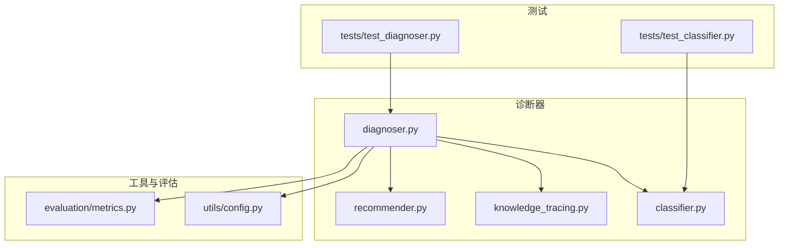
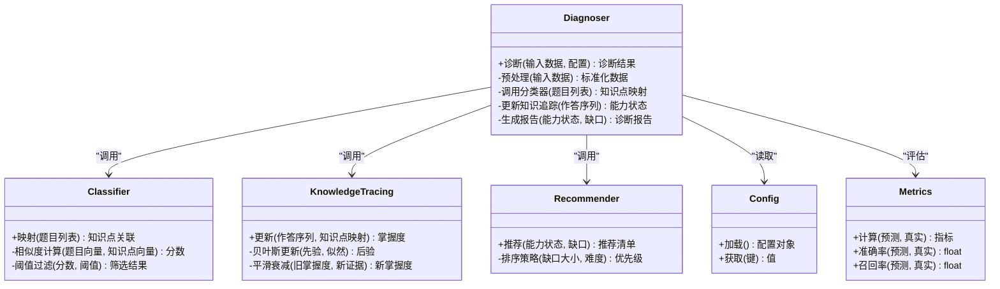
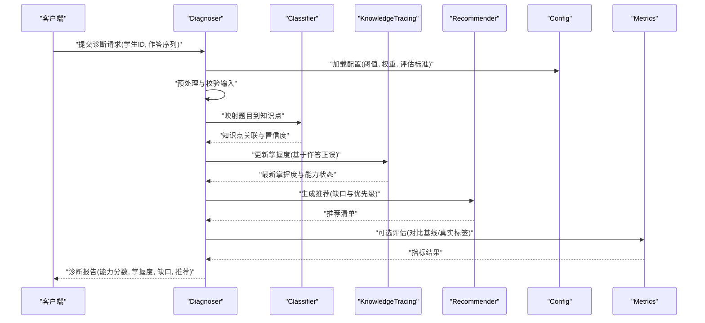
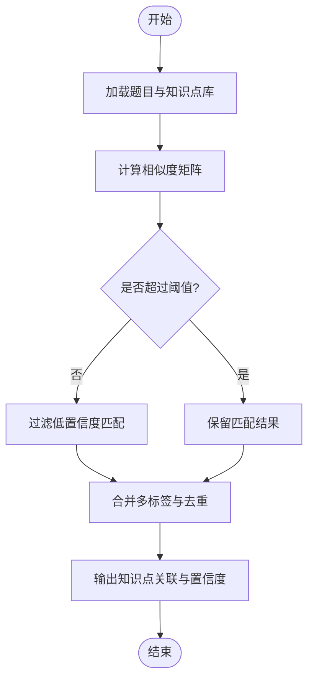
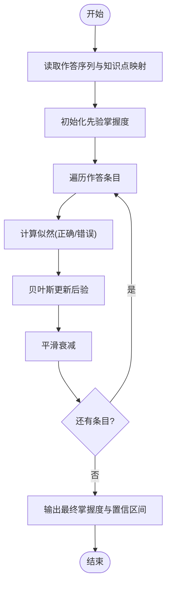
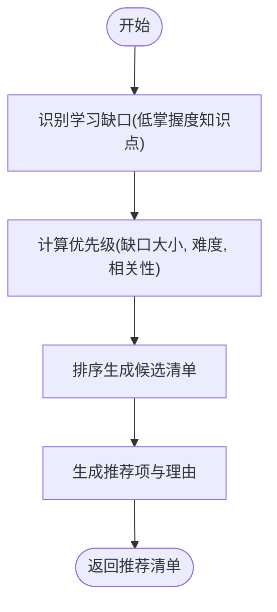
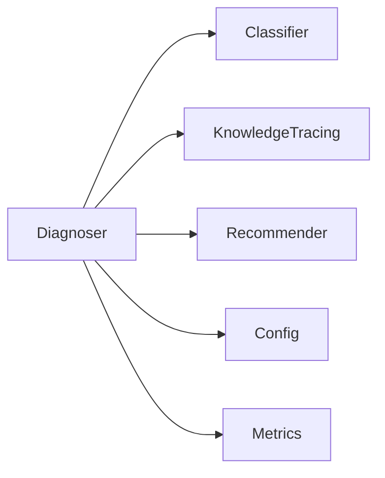

# 诊断器核心

<cite>
**本文引用的文件**   
- [diagnoser.py](file://src/kag_pro/diagnosis/diagnoser.py)
- [classifier.py](file://src/kag_pro/diagnosis/classifier.py)
- [knowledge_tracing.py](file://src/kag_pro/diagnosis/knowledge_tracing.py)
- [recommender.py](file://src/kag_pro/diagnosis/recommender.py)
- [config.py](file://src/kag_pro/utils/config.py)
- [metrics.py](file://src/kag_pro/evaluation/metrics.py)
- [test_diagnoser.py](file://tests/test_diagnoser.py)
- [test_classifier.py](file://tests/test_classifier.py)
</cite>

## 目录
1. [简介](#简介)
2. [项目结构](#项目结构)
3. [核心组件](#核心组件)
4. [架构总览](#架构总览)
5. [详细组件分析](#详细组件分析)
6. [依赖关系分析](#依赖关系分析)
7. [性能考虑](#性能考虑)
8. [故障排查指南](#故障排查指南)
9. [结论](#结论)
10. [附录：API与使用示例](#附录api与使用示例)

## 简介
本技术文档聚焦KAG-Pro的诊断器核心组件，系统性阐述其整体架构、输入数据处理、诊断流程控制与输出结果生成；深入解析诊断算法的核心逻辑（学生答题数据预处理、知识点匹配机制、能力评估模型）；文档化配置参数（阈值、权重、评估标准）；说明诊断结果的量化方法（能力分数计算、掌握度评估、学习缺口识别）；并提供完整的API接口说明与实际使用示例，帮助读者快速上手并高效集成。

## 项目结构
诊断器相关代码位于 src/kag_pro/diagnosis 目录下，包含诊断主流程、分类器、知识追踪与推荐模块；配置与指标分别位于 utils 与 evaluation 子包；测试用例位于 tests 目录。

图表来源
- [diagnoser.py](file://src/kag_pro/diagnosis/diagnoser.py)
- [classifier.py](file://src/kag_pro/diagnosis/classifier.py)
- [knowledge_tracing.py](file://src/kag_pro/diagnosis/knowledge_tracing.py)
- [recommender.py](file://src/kag_pro/diagnosis/recommender.py)
- [config.py](file://src/kag_pro/utils/config.py)
- [metrics.py](file://src/kag_pro/evaluation/metrics.py)
- [test_diagnoser.py](file://tests/test_diagnoser.py)
- [test_classifier.py](file://tests/test_classifier.py)

章节来源
- [diagnoser.py](file://src/kag_pro/diagnosis/diagnoser.py)
- [classifier.py](file://src/kag_pro/diagnosis/classifier.py)
- [knowledge_tracing.py](file://src/kag_pro/diagnosis/knowledge_tracing.py)
- [recommender.py](file://src/kag_pro/diagnosis/recommender.py)
- [config.py](file://src/kag_pro/utils/config.py)
- [metrics.py](file://src/kag_pro/evaluation/metrics.py)
- [test_diagnoser.py](file://tests/test_diagnoser.py)
- [test_classifier.py](file://tests/test_classifier.py)

## 核心组件
- 诊断主流程（Diagnoser）
  - 负责编排诊断任务：读取并校验输入、调用分类器进行题目-知识点映射、执行知识追踪以更新能力状态、汇总并输出诊断报告。
  - 关键职责包括：输入数据清洗与标准化、诊断阶段调度、中间结果缓存、错误边界处理与日志记录。
- 分类器（Classifier）
  - 将学生作答的题目映射到知识点集合，支持基于规则或模型的匹配策略，返回题目-知识点关联及置信度。
- 知识追踪（KnowledgeTracing）
  - 维护学生对各知识点的掌握度随时间演化的估计，结合历史作答序列与当前作答进行更新。
- 推荐器（Recommender）
  - 基于诊断结果生成个性化学习建议与后续练习推荐，辅助学习路径规划。

章节来源
- [diagnoser.py](file://src/kag_pro/diagnosis/diagnoser.py)
- [classifier.py](file://src/kag_pro/diagnosis/classifier.py)
- [knowledge_tracing.py](file://src/kag_pro/diagnosis/knowledge_tracing.py)
- [recommender.py](file://src/kag_pro/diagnosis/recommender.py)

## 架构总览
诊断器采用“编排+可插拔”的架构：Diagnoser作为控制器，组合Classifier、KnowledgeTracing与Recommender完成端到端诊断。配置由Config统一加载，评估指标由Metrics提供。

图表来源
- [diagnoser.py](file://src/kag_pro/diagnosis/diagnoser.py)
- [classifier.py](file://src/kag_pro/diagnosis/classifier.py)
- [knowledge_tracing.py](file://src/kag_pro/diagnosis/knowledge_tracing.py)
- [recommender.py](file://src/kag_pro/diagnosis/recommender.py)
- [config.py](file://src/kag_pro/utils/config.py)
- [metrics.py](file://src/kag_pro/evaluation/metrics.py)

## 详细组件分析

### 诊断主流程（Diagnoser）
- 输入数据处理
  - 校验必填字段（学生ID、作答序列、题目元数据等）。
  - 标准化作答格式（统一题型、选项编码、时间戳格式）。
  - 异常值处理（缺失答案、重复提交、超纲题标记）。
- 诊断流程控制
  - 阶段一：调用分类器进行题目-知识点映射。
  - 阶段二：依据映射结果与作答正误，更新知识追踪中的掌握度。
  - 阶段三：汇总能力状态，识别学习缺口（低掌握度且高频出现的知识点）。
  - 阶段四：生成结构化诊断报告（能力分数、掌握度曲线、缺口清单、推荐项）。
- 输出结果生成
  - 能力分数：按知识点维度加权聚合，得到总体与分项能力分。
  - 掌握度评估：对每个知识点给出[0,1]区间掌握度，并标注置信区间。
  - 学习缺口：根据阈值与权重识别薄弱点，形成优先修复清单。

图表来源
- [diagnoser.py](file://src/kag_pro/diagnosis/diagnoser.py)
- [classifier.py](file://src/kag_pro/diagnosis/classifier.py)
- [knowledge_tracing.py](file://src/kag_pro/diagnosis/knowledge_tracing.py)
- [recommender.py](file://src/kag_pro/diagnosis/recommender.py)
- [config.py](file://src/kag_pro/utils/config.py)
- [metrics.py](file://src/kag_pro/evaluation/metrics.py)

章节来源
- [diagnoser.py](file://src/kag_pro/diagnosis/diagnoser.py)

### 分类器（Classifier）
- 功能概述
  - 将题目文本/特征与知识点描述进行匹配，输出题目-知识点关联及其置信度。
- 核心逻辑
  - 相似度计算：基于向量表示或特征对齐计算题目与知识点的相似性得分。
  - 阈值过滤：根据配置的阈值筛选高置信度匹配，避免噪声引入。
  - 多标签输出：一道题可能关联多个知识点，需去重与合并。
- 复杂度与优化
  - 相似度计算通常为O(N×M)，N为题目数，M为知识点数；可通过索引与批处理优化。
  - 阈值自适应：可按学科或难度动态调整阈值以提升稳定性。

图表来源
- [classifier.py](file://src/kag_pro/diagnosis/classifier.py)

章节来源
- [classifier.py](file://src/kag_pro/diagnosis/classifier.py)

### 知识追踪（KnowledgeTracing）
- 功能概述
  - 维护学生对各知识点的掌握度随时间演化，结合历史作答序列与当前作答进行更新。
- 核心逻辑
  - 贝叶斯更新：以先验掌握度为基础，利用当前作答的似然函数更新后验掌握度。
  - 平滑衰减：对旧掌握度进行指数衰减，使近期表现更具影响力。
  - 置信区间：在更新过程中估计不确定性，用于稳健决策。
- 复杂度与优化
  - 单次更新为O(K)，K为知识点数量；批量更新时可并行化。
  - 数值稳定：对极端概率进行裁剪与对数空间计算以避免溢出。

图表来源
- [knowledge_tracing.py](file://src/kag_pro/diagnosis/knowledge_tracing.py)

章节来源
- [knowledge_tracing.py](file://src/kag_pro/diagnosis/knowledge_tracing.py)

### 推荐器（Recommender）
- 功能概述
  - 基于诊断结果生成个性化学习建议与后续练习推荐，辅助学习路径规划。
- 核心逻辑
  - 缺口识别：根据掌握度低于阈值的知识点确定学习缺口。
  - 优先级排序：综合缺口大小、知识点难度与相关性进行排序。
  - 推荐生成：输出推荐清单（题目/资源），附带理由与预期收益。
- 复杂度与优化
  - 排序为O(K log K)，K为候选知识点数量；可结合缓存与预计算提升性能。

图表来源
- [recommender.py](file://src/kag_pro/diagnosis/recommender.py)

章节来源
- [recommender.py](file://src/kag_pro/diagnosis/recommender.py)

## 依赖关系分析
- 内部依赖
  - Diagnoser依赖Classifier、KnowledgeTracing、Recommender完成诊断全流程。
  - 所有组件均通过Config读取阈值、权重与评估标准。
  - 可选地通过Metrics进行诊断质量评估。
- 外部依赖
  - 无强耦合的外部服务；若涉及向量检索或模型推理，应通过抽象接口隔离以便替换实现。

图表来源
- [diagnoser.py](file://src/kag_pro/diagnosis/diagnoser.py)
- [classifier.py](file://src/kag_pro/diagnosis/classifier.py)
- [knowledge_tracing.py](file://src/kag_pro/diagnosis/knowledge_tracing.py)
- [recommender.py](file://src/kag_pro/diagnosis/recommender.py)
- [config.py](file://src/kag_pro/utils/config.py)
- [metrics.py](file://src/kag_pro/evaluation/metrics.py)

章节来源
- [diagnoser.py](file://src/kag_pro/diagnosis/diagnoser.py)
- [classifier.py](file://src/kag_pro/diagnosis/classifier.py)
- [knowledge_tracing.py](file://src/kag_pro/diagnosis/knowledge_tracing.py)
- [recommender.py](file://src/kag_pro/diagnosis/recommender.py)
- [config.py](file://src/kag_pro/utils/config.py)
- [metrics.py](file://src/kag_pro/evaluation/metrics.py)

## 性能考虑
- 批处理与并行
  - 对大规模题目-知识点匹配采用批处理与向量化计算，减少循环开销。
  - 知识追踪的逐条更新可并行化，注意线程安全与锁粒度。
- 内存与I/O
  - 大题库与知识库建议使用分页加载与惰性求值，避免一次性载入导致内存峰值。
  - 中间结果缓存（如相似度矩阵、知识点索引）可显著降低重复计算成本。
- 数值稳定性
  - 概率更新时进行裁剪与对数空间计算，防止下溢/上溢。
  - 阈值与权重调参时进行网格搜索与交叉验证，确保泛化性。

## 故障排查指南
- 常见问题
  - 输入数据不完整或缺失关键字段：检查预处理阶段的校验逻辑与错误提示。
  - 知识点匹配不稳定：调整分类器阈值与相似度计算方法，查看置信度分布。
  - 掌握度更新异常：检查似然函数与衰减系数，确认数值范围与边界条件。
  - 推荐结果不相关：优化优先级评分函数，增加相关性特征与约束。
- 调试建议
  - 启用详细日志，记录每步中间结果与关键参数。
  - 使用单元测试覆盖典型场景与边界条件，参考测试文件定位问题。

章节来源
- [test_diagnoser.py](file://tests/test_diagnoser.py)
- [test_classifier.py](file://tests/test_classifier.py)

## 结论
诊断器核心通过清晰的模块化设计与可扩展的编排流程，实现了从输入数据处理到诊断报告生成的完整闭环。分类器、知识追踪与推荐器各司其职，配合统一的配置与评估体系，能够稳定输出高质量的能力诊断与个性化学习建议。建议在工程实践中注重批处理优化、数值稳定性与可观测性建设，持续提升诊断效果与系统性能。

## 附录：API与使用示例

### API接口说明
- 诊断请求
  - 输入字段
    - 学生ID：字符串标识
    - 作答序列：数组，每项包含题目ID、答案、时间戳等
    - 题目元数据：可选，包含题干、选项、难度等
  - 配置参数
    - 阈值：分类器匹配阈值、掌握度阈值
    - 权重：知识点权重、难度权重
    - 评估标准：准确率、召回率等指标开关
- 响应结构
  - 能力分数：总体与各知识点维度分数
  - 掌握度：各知识点掌握度与置信区间
  - 学习缺口：薄弱知识点清单与优先级
  - 推荐清单：后续练习与资源推荐，含理由与预期收益
- 错误处理
  - 输入校验失败：返回具体字段缺失或格式错误信息
  - 匹配失败：返回空映射或低置信度警告
  - 更新异常：返回数值越界或收敛失败的诊断信息

章节来源
- [diagnoser.py](file://src/kag_pro/diagnosis/diagnoser.py)
- [config.py](file://src/kag_pro/utils/config.py)
- [metrics.py](file://src/kag_pro/evaluation/metrics.py)

### 使用示例
- 基本诊断流程
  - 准备学生作答数据与题目元数据。
  - 加载配置（阈值、权重、评估标准）。
  - 调用诊断主流程，获取诊断报告。
  - 解析报告中的能力分数、掌握度、缺口与推荐项。
- 进阶用法
  - 自定义分类器策略：替换相似度计算与阈值过滤逻辑。
  - 扩展知识追踪模型：引入更复杂的时序建模或上下文信息。
  - 增强推荐策略：结合课程大纲与学习路径约束生成更精准推荐。

章节来源
- [diagnoser.py](file://src/kag_pro/diagnosis/diagnoser.py)
- [classifier.py](file://src/kag_pro/diagnosis/classifier.py)
- [knowledge_tracing.py](file://src/kag_pro/diagnosis/knowledge_tracing.py)
- [recommender.py](file://src/kag_pro/diagnosis/recommender.py)
- [config.py](file://src/kag_pro/utils/config.py)
- [metrics.py](file://src/kag_pro/evaluation/metrics.py)