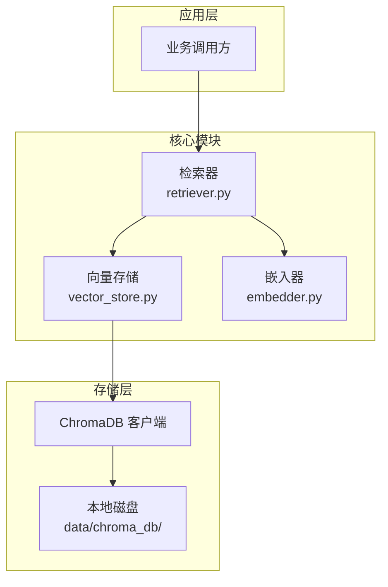
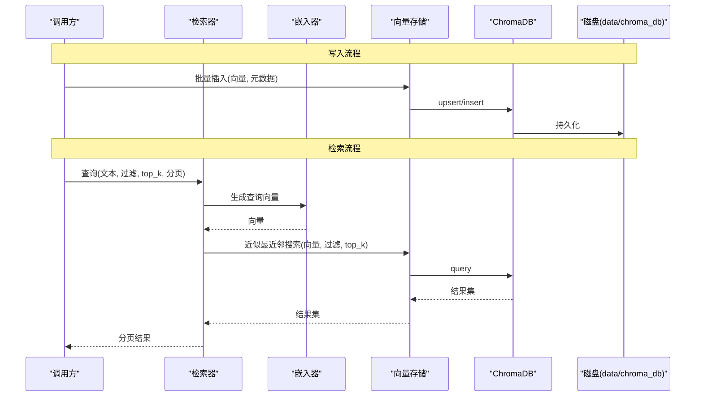
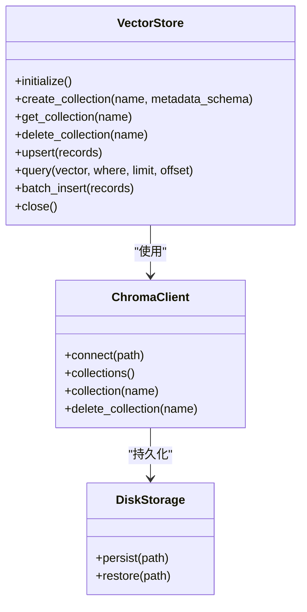
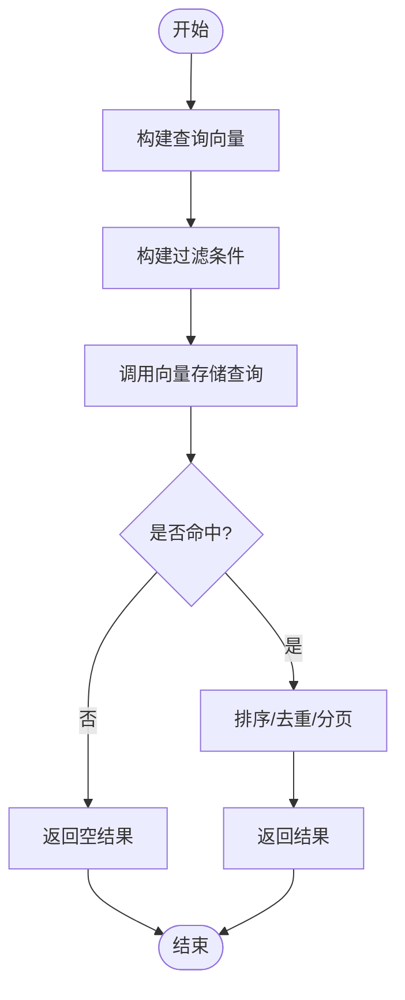
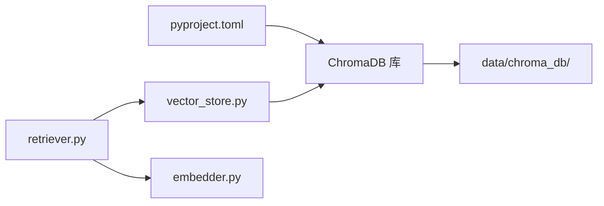

# 向量存储

<cite>
**本文引用的文件**   
- [src/kag_pro/core/vector_store.py](file://src/kag_pro/core/vector_store.py)
- [src/kag_pro/core/retriever.py](file://src/kag_pro/core/retriever.py)
- [src/kag_pro/core/embedder.py](file://src/kag_pro/core/embedder.py)
- [pyproject.toml](file://pyproject.toml)
- [data/chroma_db/](file://data/chroma_db/)
</cite>

## 目录
1. [简介](#简介)
2. [项目结构](#项目结构)
3. [核心组件](#核心组件)
4. [架构总览](#架构总览)
5. [详细组件分析](#详细组件分析)
6. [依赖关系分析](#依赖关系分析)
7. [性能考虑](#性能考虑)
8. [故障排除指南](#故障排除指南)
9. [结论](#结论)
10. [附录：API参考](#附录api参考)

## 简介
本技术文档聚焦KAG-Pro的向量存储系统，围绕ChromaDB集成、集合与元数据管理、HNSW索引策略、内存与持久化、查询优化（近似最近邻搜索、过滤、分页、并发）、性能调优（索引重建、内存配置、缓存、监控）以及完整API参考进行系统化说明。目标读者包括算法工程师、后端工程师与运维人员，力求在保持技术深度的同时兼顾可读性。

## 项目结构
与向量存储直接相关的代码位于core模块中，主要包含：
- 向量存储封装：负责ChromaDB连接、集合操作、元数据管理与批量写入
- 检索器：基于嵌入向量的近似最近邻检索，支持过滤与分页
- 嵌入器：文本到向量的转换，为检索提供输入
- 外部依赖与本地数据：通过pyproject.toml声明ChromaDB依赖；本地data/chroma_db用于持久化

图表来源
- [src/kag_pro/core/vector_store.py](file://src/kag_pro/core/vector_store.py)
- [src/kag_pro/core/retriever.py](file://src/kag_pro/core/retriever.py)
- [src/kag_pro/core/embedder.py](file://src/kag_pro/core/embedder.py)
- [pyproject.toml](file://pyproject.toml)
- [data/chroma_db/](file://data/chroma_db/)

章节来源
- [src/kag_pro/core/vector_store.py](file://src/kag_pro/core/vector_store.py)
- [src/kag_pro/core/retriever.py](file://src/kag_pro/core/retriever.py)
- [src/kag_pro/core/embedder.py](file://src/kag_pro/core/embedder.py)
- [pyproject.toml](file://pyproject.toml)
- [data/chroma_db/](file://data/chroma_db/)

## 核心组件
- 向量存储（ChromaDB封装）
  - 职责：初始化数据库连接、创建/获取集合、增删改查记录、批量写入、元数据读写、事务式提交控制
  - 关键能力：集合生命周期管理、元数据约束与校验、批量写入与错误聚合、连接复用与资源释放
- 检索器
  - 职责：将查询文本经嵌入器转为向量，执行近似最近邻搜索，支持过滤条件与分页返回
  - 关键能力：相似度度量选择、top-k参数控制、过滤表达式构建、结果排序与去重
- 嵌入器
  - 职责：文本分块与编码，输出固定维度向量
  - 关键能力：模型加载与缓存、批处理推理、异常重试与降级

章节来源
- [src/kag_pro/core/vector_store.py](file://src/kag_pro/core/vector_store.py)
- [src/kag_pro/core/retriever.py](file://src/kag_pro/core/retriever.py)
- [src/kag_pro/core/embedder.py](file://src/kag_pro/core/embedder.py)

## 架构总览
整体采用“检索驱动”的架构：上层调用检索器，检索器先通过嵌入器生成查询向量，再委托向量存储执行ANN检索；写入路径由上层构造元数据与向量后交由向量存储批量入库。ChromaDB作为嵌入式向量数据库，使用本地文件系统持久化。

图表来源
- [src/kag_pro/core/vector_store.py](file://src/kag_pro/core/vector_store.py)
- [src/kag_pro/core/retriever.py](file://src/kag_pro/core/retriever.py)
- [src/kag_pro/core/embedder.py](file://src/kag_pro/core/embedder.py)
- [data/chroma_db/](file://data/chroma_db/)

## 详细组件分析

### 向量存储（ChromaDB封装）
- 连接管理
  - 单例或上下文管理器模式确保连接复用与优雅关闭
  - 支持指定持久化路径，默认指向data/chroma_db
- 集合操作
  - 创建/获取集合：按业务域划分集合，便于隔离与权限控制
  - 删除集合：清理测试或废弃数据集
- 元数据管理
  - 字段类型约束与必填校验
  - 常用索引字段（如source_id、doc_type、timestamp）建议建立过滤索引
- 写入与批量处理
  - 批量upsert接口，内部做分片与重试
  - 失败项聚合与部分成功策略
- 读取与查询
  - 支持where过滤、limit分页、order_by可选
  - 返回向量距离、元数据与可选原始内容引用

图表来源
- [src/kag_pro/core/vector_store.py](file://src/kag_pro/core/vector_store.py)
- [pyproject.toml](file://pyproject.toml)
- [data/chroma_db/](file://data/chroma_db/)

章节来源
- [src/kag_pro/core/vector_store.py](file://src/kag_pro/core/vector_store.py)

### 检索器（ANN检索与过滤）
- 查询流程
  - 文本→向量：调用嵌入器生成查询向量
  - 过滤构建：将结构化过滤条件转换为ChromaDB where表达式
  - 检索：调用向量存储的query接口，传入top_k与分页参数
  - 结果后处理：排序、去重、格式化返回
- 并发控制
  - 对高频检索场景可引入读锁或连接池
  - 写路径采用批量合并与幂等键避免重复写入
- 容错与降级
  - 检索超时重试、回退到较小top_k或放宽过滤条件

图表来源
- [src/kag_pro/core/retriever.py](file://src/kag_pro/core/retriever.py)
- [src/kag_pro/core/embedder.py](file://src/kag_pro/core/embedder.py)
- [src/kag_pro/core/vector_store.py](file://src/kag_pro/core/vector_store.py)

章节来源
- [src/kag_pro/core/retriever.py](file://src/kag_pro/core/retriever.py)
- [src/kag_pro/core/embedder.py](file://src/kag_pro/core/embedder.py)

### 嵌入器（文本→向量）
- 模型加载与缓存：启动时预热模型，避免冷启动延迟
- 批处理：按批次编码，提升吞吐
- 维度一致性：确保所有向量维度一致，避免索引失效
- 异常处理：网络/模型加载失败时的重试与告警

章节来源
- [src/kag_pro/core/embedder.py](file://src/kag_pro/core/embedder.py)

## 依赖关系分析
- 外部依赖
  - ChromaDB：通过pyproject.toml声明，提供嵌入式向量数据库能力
- 内部依赖
  - 检索器依赖向量存储与嵌入器
  - 向量存储依赖ChromaDB客户端与本地磁盘持久化

图表来源
- [pyproject.toml](file://pyproject.toml)
- [src/kag_pro/core/vector_store.py](file://src/kag_pro/core/vector_store.py)
- [src/kag_pro/core/retriever.py](file://src/kag_pro/core/retriever.py)
- [src/kag_pro/core/embedder.py](file://src/kag_pro/core/embedder.py)
- [data/chroma_db/](file://data/chroma_db/)

章节来源
- [pyproject.toml](file://pyproject.toml)
- [src/kag_pro/core/vector_store.py](file://src/kag_pro/core/vector_store.py)
- [src/kag_pro/core/retriever.py](file://src/kag_pro/core/retriever.py)
- [src/kag_pro/core/embedder.py](file://src/kag_pro/core/embedder.py)

## 性能考虑
- 索引策略（HNSW）
  - 关键参数：M（每节点最大边数）、efConstruction（构建期搜索宽度）、efRuntime（查询期搜索宽度）
  - 经验值：M=16~32，efConstruction=200~400，efRuntime=动态调整以平衡延迟与召回
  - 高维向量（≥768）建议增大M与efConstruction以提升召回
- 内存管理
  - 合理设置批大小与并发度，避免OOM
  - 对热点集合启用内存映射与预取
- 磁盘持久化
  - 定期checkpoint与增量同步，降低恢复时间
  - 使用SSD并开启写缓冲，减少随机IO
- 查询优化
  - 使用精确过滤字段缩小候选集，再执行ANN
  - 分页查询结合游标或时间戳，避免深分页
  - 对高频查询结果做短期缓存（TTL）
- 监控指标
  - 写入吞吐、延迟分布、索引构建耗时
  - 查询QPS、P95/P99延迟、召回率与误杀率
  - 内存占用、GC停顿、磁盘IO利用率

[本节为通用性能指导，不直接分析具体文件]

## 故障排除指南
- 常见问题
  - 连接失败：检查ChromaDB进程状态与持久化路径权限
  - 维度不一致：确认嵌入器输出维度与索引配置一致
  - 过滤无效：检查where表达式语法与字段类型
  - 写入缓慢：评估批大小、磁盘IO与索引重建频率
- 诊断步骤
  - 查看ChromaDB日志与本地磁盘空间
  - 使用最小复现用例验证过滤与分页逻辑
  - 对比不同top_k与efRuntime下的延迟与召回
- 恢复策略
  - 从备份恢复集合快照
  - 重建索引并回填增量数据

章节来源
- [src/kag_pro/core/vector_store.py](file://src/kag_pro/core/vector_store.py)
- [src/kag_pro/core/retriever.py](file://src/kag_pro/core/retriever.py)

## 结论
KAG-Pro的向量存储系统以ChromaDB为核心，结合清晰的集合与元数据管理、稳定的ANN检索与完善的批处理能力，满足教育知识图谱场景下的高吞吐与低延迟需求。通过合理的HNSW参数调优、内存与磁盘配置、查询缓存与监控体系，可在大规模数据下保持稳定性能与高可用性。

[本节为总结性内容，不直接分析具体文件]

## 附录：API参考
以下API以概念形式描述，实际方法名与参数以源码为准。

- 初始化与连接
  - initialize(path): 初始化ChromaDB客户端并绑定持久化路径
  - close(): 释放连接与资源
- 集合管理
  - create_collection(name, metadata_schema): 创建集合并定义元数据约束
  - get_collection(name): 获取已有集合句柄
  - delete_collection(name): 删除集合及其数据
- 写入与更新
  - upsert(records): 批量插入或更新记录，records包含id、向量、元数据
  - batch_insert(records): 纯插入接口，适用于首次导入
- 查询与检索
  - query(vector, where=None, limit=10, offset=0): 近似最近邻检索，支持过滤与分页
  - search(text, filters=None, top_k=10, page_size=20): 高层检索接口，内部完成文本→向量转换
- 元数据操作
  - update_metadata(ids, patch): 按ID批量更新元数据
  - filter_fields(fields): 返回可用过滤字段列表与类型信息
- 维护与监控
  - rebuild_index(collection_name): 重建集合索引
  - stats(collection_name): 返回集合统计信息（条目数、维度、索引参数）
  - backup(path): 导出集合快照
  - restore(path): 从快照恢复集合

章节来源
- [src/kag_pro/core/vector_store.py](file://src/kag_pro/core/vector_store.py)
- [src/kag_pro/core/retriever.py](file://src/kag_pro/core/retriever.py)