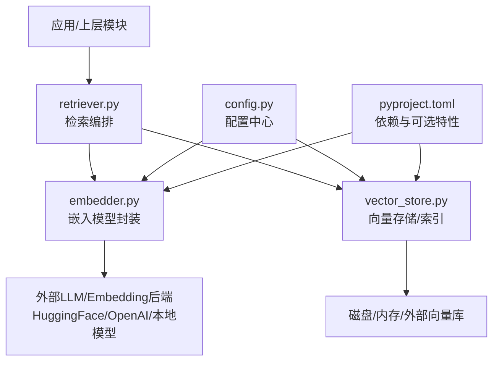
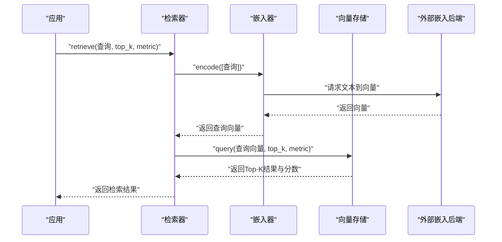
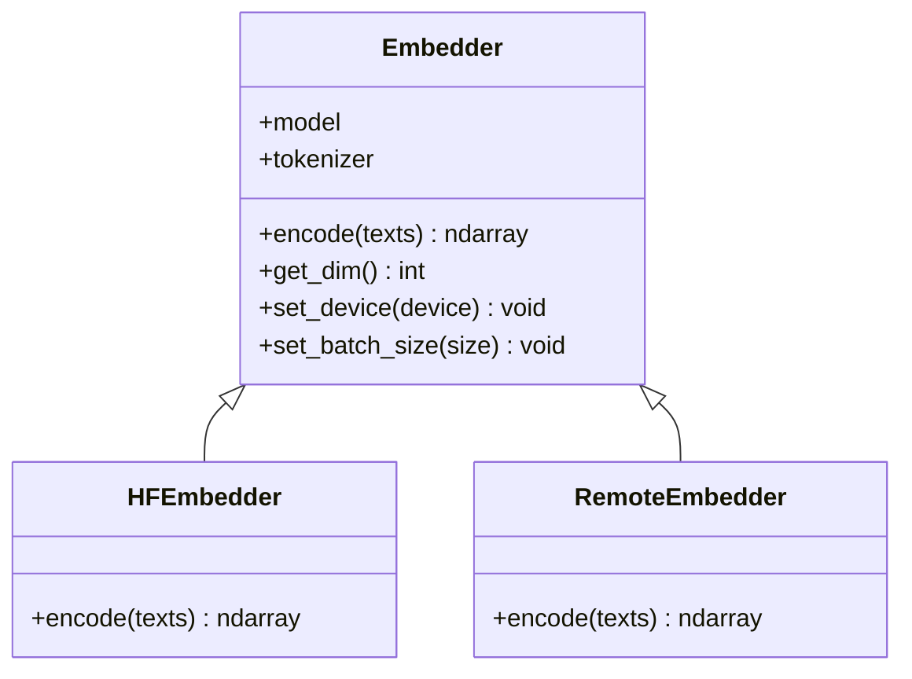
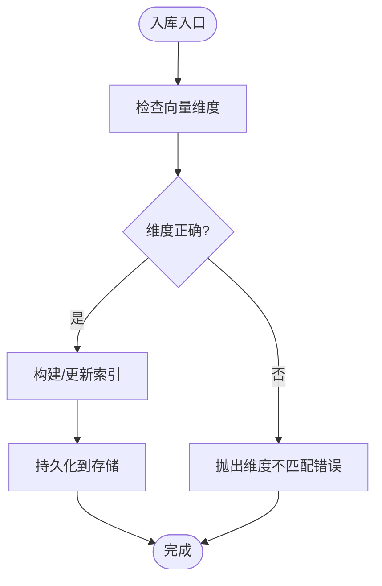
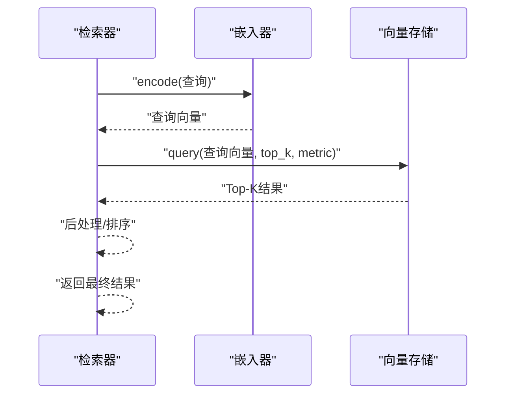
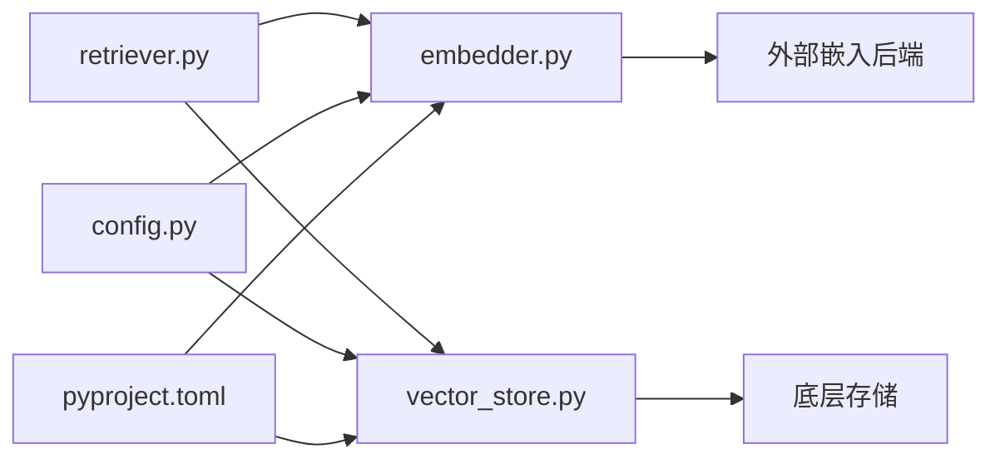

# 嵌入模型

<cite>
**本文引用的文件**   
- [src/kag_pro/core/embedder.py](file://src/kag_pro/core/embedder.py)
- [src/kag_pro/core/vector_store.py](file://src/kag_pro/core/vector_store.py)
- [src/kag_pro/core/retriever.py](file://src/kag_pro/core/retriever.py)
- [src/kag_pro/utils/config.py](file://src/kag_pro/utils/config.py)
- [pyproject.toml](file://pyproject.toml)
</cite>

## 目录
1. [简介](#简介)
2. [项目结构](#项目结构)
3. [核心组件](#核心组件)
4. [架构总览](#架构总览)
5. [详细组件分析](#详细组件分析)
6. [依赖关系分析](#依赖关系分析)
7. [性能考虑](#性能考虑)
8. [故障排查指南](#故障排查指南)
9. [结论](#结论)
10. [附录](#附录)

## 简介
本技术文档聚焦KAG-Pro的嵌入模型模块，系统阐述文本向量化技术的实现原理与工程实践。内容涵盖：
- 预训练语言模型的集成方式、语义理解机制与向量空间映射
- 支持的嵌入模型类型（通用文本嵌入、领域特定嵌入、多模态嵌入）及其配置方法
- 模型定制流程（微调策略、提示工程、上下文窗口管理）
- 向量相似度计算方法（余弦相似度、欧氏距离、点积等）的选择与应用
- 模型选择指南（场景推荐、性能对比、部署考量）
- 实际使用示例路径（加载自定义模型、优化嵌入质量）

## 项目结构
嵌入相关代码主要位于core与utils两个子包中：
- core/embedder.py：嵌入模型抽象与具体实现、批量编码、维度与分词器管理
- core/vector_store.py：向量存储接口与持久化、索引构建与查询
- core/retriever.py：检索流程编排，调用嵌入与向量库完成相似检索
- utils/config.py：配置项定义与读取，统一注入到各组件
- pyproject.toml：依赖声明与可选特性（如不同后端）

图表来源
- [src/kag_pro/core/embedder.py](file://src/kag_pro/core/embedder.py)
- [src/kag_pro/core/vector_store.py](file://src/kag_pro/core/vector_store.py)
- [src/kag_pro/core/retriever.py](file://src/kag_pro/core/retriever.py)
- [src/kag_pro/utils/config.py](file://src/kag_pro/utils/config.py)
- [pyproject.toml](file://pyproject.toml)

章节来源
- [src/kag_pro/core/embedder.py](file://src/kag_pro/core/embedder.py)
- [src/kag_pro/core/vector_store.py](file://src/kag_pro/core/vector_store.py)
- [src/kag_pro/core/retriever.py](file://src/kag_pro/core/retriever.py)
- [src/kag_pro/utils/config.py](file://src/kag_pro/utils/config.py)
- [pyproject.toml](file://pyproject.toml)

## 核心组件
- 嵌入器（Embedder）
  - 职责：封装文本到向量的转换；管理分词器与模型实例；提供批量编码与维度信息；支持多种后端（本地或远程）。
  - 关键能力：
    - 初始化时加载分词器与模型权重或连接远程服务
    - encode(texts)将文本列表转换为矩阵形式的向量
    - 暴露tokenizer与model属性供上层按需访问
    - 支持配置上下文长度、批大小、设备（CPU/GPU）
- 向量存储（VectorStore）
  - 职责：维护向量集合与元数据；支持写入、删除、按相似度检索；可持久化到磁盘或外部向量数据库。
  - 关键能力：
    - add(vectors, ids, metadatas)批量入库
    - query(query_vector, top_k, metric)返回最相似的条目
    - 支持不同相似度度量（余弦、内积、欧氏）
- 检索器（Retriever）
  - 职责：串联“文本→向量→检索”的流程；对查询进行编码后在向量库中检索；返回Top-K结果及分数。
  - 关键能力：
    - retrieve(query, top_k, metric)
    - 内部调用embedder.encode与vector_store.query
- 配置（Config）
  - 职责：集中管理嵌入模型名称、后端URL、维度、batch_size、device、metric等参数。
  - 关键能力：
    - 从环境变量或配置文件加载
    - 为embedder与vector_store提供默认值与校验

章节来源
- [src/kag_pro/core/embedder.py](file://src/kag_pro/core/embedder.py)
- [src/kag_pro/core/vector_store.py](file://src/kag_pro/core/vector_store.py)
- [src/kag_pro/core/retriever.py](file://src/kag_pro/core/retriever.py)
- [src/kag_pro/utils/config.py](file://src/kag_pro/utils/config.py)

## 架构总览
整体数据流遵循“文本→嵌入→存储→检索→结果”的流水线：

图表来源
- [src/kag_pro/core/retriever.py](file://src/kag_pro/core/retriever.py)
- [src/kag_pro/core/embedder.py](file://src/kag_pro/core/embedder.py)
- [src/kag_pro/core/vector_store.py](file://src/kag_pro/core/vector_store.py)

## 详细组件分析

### 嵌入器（Embedder）
- 设计要点
  - 抽象统一接口：无论后端是本地HuggingFace还是远程API，均通过同一接口调用
  - 上下文窗口管理：根据tokenizer最大长度截断或分段，避免越界
  - 批处理：通过batch_size提升吞吐，结合设备并行（CUDA）加速
  - 维度一致性：确保输出向量维度与下游向量库一致
- 典型流程
  - 初始化：加载分词器与模型/连接远程服务；设置设备与批大小
  - 编码：输入文本列表→分词→模型推理→归一化（可选）→返回矩阵
  - 错误处理：捕获网络异常、OOM、维度不匹配等并抛出明确错误
- 扩展点
  - 新增后端：实现统一的encode接口即可接入新的嵌入模型提供方
  - 领域适配：通过LoRA/Adapter或指令微调后的专用模型替换默认模型

图表来源
- [src/kag_pro/core/embedder.py](file://src/kag_pro/core/embedder.py)

章节来源
- [src/kag_pro/core/embedder.py](file://src/kag_pro/core/embedder.py)

### 向量存储（VectorStore）
- 设计要点
  - 统一接口：add/query/delete/list等基础操作
  - 相似度度量：支持余弦、内积、欧氏距离，并在query时指定
  - 持久化：支持内存模式与磁盘/外部库模式切换
- 典型流程
  - 入库：接收向量矩阵与对应ID、元数据，建立索引
  - 检索：给定查询向量与top_k，按指定度量返回最近邻
- 注意事项
  - 向量维度必须与嵌入器输出一致
  - 大规模数据建议启用外部向量库以获取更好性能

图表来源
- [src/kag_pro/core/vector_store.py](file://src/kag_pro/core/vector_store.py)

章节来源
- [src/kag_pro/core/vector_store.py](file://src/kag_pro/core/vector_store.py)

### 检索器（Retriever）
- 设计要点
  - 编排流程：将文本编码与向量检索组合成端到端接口
  - 度量选择：根据业务需求选择余弦、内积或欧氏
  - 结果排序：按相似度分数降序返回Top-K
- 典型流程
  - 预处理：清洗/格式化查询文本
  - 编码：调用嵌入器生成查询向量
  - 检索：调用向量存储执行相似搜索
  - 后处理：合并元数据、过滤、重排（可选）

图表来源
- [src/kag_pro/core/retriever.py](file://src/kag_pro/core/retriever.py)
- [src/kag_pro/core/embedder.py](file://src/kag_pro/core/embedder.py)
- [src/kag_pro/core/vector_store.py](file://src/kag_pro/core/vector_store.py)

章节来源
- [src/kag_pro/core/retriever.py](file://src/kag_pro/core/retriever.py)

### 配置（Config）
- 设计要点
  - 集中式配置：统一管理模型名、后端URL、维度、batch_size、device、metric等
  - 默认值与校验：提供合理默认值并对非法值进行校验
  - 环境覆盖：支持通过环境变量覆盖默认配置
- 使用方式
  - 在启动阶段加载配置并注入到Embedder与VectorStore
  - 针对不同场景（开发/测试/生产）切换配置

章节来源
- [src/kag_pro/utils/config.py](file://src/kag_pro/utils/config.py)

## 依赖关系分析
- 组件耦合
  - retriever强依赖embedder与vector_store
  - embedder依赖外部LLM/Embedding后端（HuggingFace或远程API）
  - vector_store依赖底层存储（内存/磁盘/外部库）
- 外部依赖
  - 通过pyproject.toml声明可选依赖，便于按需安装不同后端
- 潜在循环依赖
  - 当前结构清晰分层，未见循环导入风险

图表来源
- [src/kag_pro/core/retriever.py](file://src/kag_pro/core/retriever.py)
- [src/kag_pro/core/embedder.py](file://src/kag_pro/core/embedder.py)
- [src/kag_pro/core/vector_store.py](file://src/kag_pro/core/vector_store.py)
- [src/kag_pro/utils/config.py](file://src/kag_pro/utils/config.py)
- [pyproject.toml](file://pyproject.toml)

章节来源
- [src/kag_pro/core/retriever.py](file://src/kag_pro/core/retriever.py)
- [src/kag_pro/core/embedder.py](file://src/kag_pro/core/embedder.py)
- [src/kag_pro/core/vector_store.py](file://src/kag_pro/core/vector_store.py)
- [src/kag_pro/utils/config.py](file://src/kag_pro/utils/config.py)
- [pyproject.toml](file://pyproject.toml)

## 性能考虑
- 批处理与并行
  - 增大batch_size可提升吞吐，但需平衡显存占用
  - GPU优先，CPU回退；注意设备切换开销
- 上下文窗口
  - 长文本需分段或摘要后再编码，避免超出tokenizer最大长度
- 相似度度量
  - 余弦相似度适合归一化向量；内积在已归一化时等价于余弦
  - 欧氏距离对尺度敏感，通常需先标准化
- 索引与存储
  - 大规模数据建议使用外部向量库以获得更好的I/O与近似近邻搜索性能
- 缓存与复用
  - 对重复查询可做结果缓存；模型实例全局复用避免重复加载

[本节为通用指导，无需源码引用]

## 故障排查指南
- 常见错误
  - 维度不匹配：嵌入器输出维度与向量库期望不一致
    - 排查：核对配置中的维度与模型实际输出
  - OOM（显存不足）：batch_size过大或模型过大
    - 排查：降低batch_size、切换到更小模型或使用CPU
  - 网络超时：远程嵌入服务不可用
    - 排查：检查URL、鉴权、网络连通性与重试策略
  - 超长文本：超过tokenizer最大长度
    - 排查：启用分段策略或缩短上下文
- 定位手段
  - 打印关键中间变量（文本长度、向量形状、相似度分布）
  - 开启日志记录，记录每次编码与检索的参数与耗时
  - 使用最小复现用例隔离问题

章节来源
- [src/kag_pro/core/embedder.py](file://src/kag_pro/core/embedder.py)
- [src/kag_pro/core/vector_store.py](file://src/kag_pro/core/vector_store.py)
- [src/kag_pro/core/retriever.py](file://src/kag_pro/core/retriever.py)

## 结论
KAG-Pro的嵌入模型模块通过清晰的组件分层与统一接口，实现了灵活的文本向量化与检索能力。借助配置中心与可扩展的后端抽象，用户可在不同场景下快速切换模型与存储方案，并通过批处理、设备调度与度量选择等手段获得良好的性能表现。

[本节为总结性内容，无需源码引用]

## 附录

### 支持的嵌入模型类型与配置方法
- 通用文本嵌入
  - 适用场景：百科问答、通用检索
  - 配置要点：选择通用模型名、设置维度与batch_size
- 领域特定嵌入
  - 适用场景：教育、医疗、法律等垂直领域
  - 配置要点：使用领域微调模型，必要时调整提示模板与上下文窗口
- 多模态嵌入
  - 适用场景：图文联合检索
  - 配置要点：启用多模态后端，传入图像与文本联合编码

章节来源
- [src/kag_pro/core/embedder.py](file://src/kag_pro/core/embedder.py)
- [src/kag_pro/utils/config.py](file://src/kag_pro/utils/config.py)

### 模型定制流程
- 微调策略
  - 指令微调：构造任务相关的指令-回答对，提升对齐效果
  - LoRA/Adapter：低成本适配新领域，冻结主干参数
- 提示工程
  - 结构化提示：包含角色、任务、约束与示例
  - 上下文裁剪：保留关键句段，去除噪声
- 上下文窗口管理
  - 分段策略：按句子/段落切分，保持语义完整
  - 滑动窗口：重叠部分减少边界信息丢失

章节来源
- [src/kag_pro/core/embedder.py](file://src/kag_pro/core/embedder.py)
- [src/kag_pro/utils/config.py](file://src/kag_pro/utils/config.py)

### 向量相似度计算方法
- 余弦相似度
  - 特点：衡量方向一致性，对向量尺度不敏感
  - 适用：归一化向量或关注语义方向的场景
- 点积（内积）
  - 特点：在未归一化时同时受方向与幅度影响
  - 适用：已做归一化时与余弦等价
- 欧氏距离
  - 特点：对绝对距离敏感，需考虑尺度
  - 适用：需要几何距离解释的场景

章节来源
- [src/kag_pro/core/vector_store.py](file://src/kag_pro/core/vector_store.py)

### 模型选择指南
- 场景推荐
  - 通用检索：选择轻量通用模型，兼顾速度与精度
  - 领域检索：选择领域微调模型，必要时加入提示工程
  - 多模态检索：选择支持图文的多模态模型
- 性能对比
  - 评估指标：召回率、MRR、NDCG、延迟、吞吐
  - 基准数据集：构建领域代表性样本集进行A/B测试
- 部署考虑
  - 资源预算：GPU显存、CPU核数、内存
  - 服务形态：本地推理 vs 远程API
  - 可观测性：监控QPS、P99延迟、错误率

章节来源
- [src/kag_pro/core/embedder.py](file://src/kag_pro/core/embedder.py)
- [src/kag_pro/core/vector_store.py](file://src/kag_pro/core/vector_store.py)
- [src/kag_pro/core/retriever.py](file://src/kag_pro/core/retriever.py)

### 实际使用示例（路径指引）
- 加载自定义模型
  - 参考：[src/kag_pro/core/embedder.py](file://src/kag_pro/core/embedder.py)
  - 步骤：在配置中指定模型名/后端URL→初始化Embedder→验证维度与编码结果
- 优化嵌入质量
  - 参考：[src/kag_pro/core/embedder.py](file://src/kag_pro/core/embedder.py)、[src/kag_pro/utils/config.py](file://src/kag_pro/utils/config.py)
  - 步骤：调整batch_size与device→引入领域微调模型→优化提示模板→评估检索指标
- 切换相似度度量
  - 参考：[src/kag_pro/core/vector_store.py](file://src/kag_pro/core/vector_store.py)
  - 步骤：在query时指定metric（余弦/内积/欧氏）→对比Top-K结果

章节来源
- [src/kag_pro/core/embedder.py](file://src/kag_pro/core/embedder.py)
- [src/kag_pro/core/vector_store.py](file://src/kag_pro/core/vector_store.py)
- [src/kag_pro/core/retriever.py](file://src/kag_pro/core/retriever.py)
- [src/kag_pro/utils/config.py](file://src/kag_pro/utils/config.py)