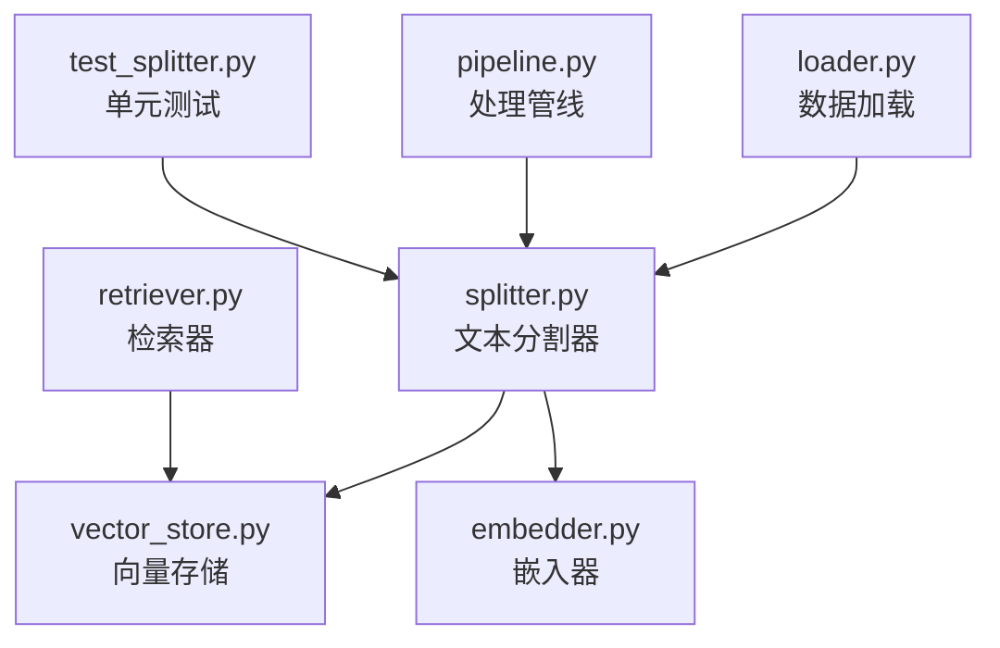
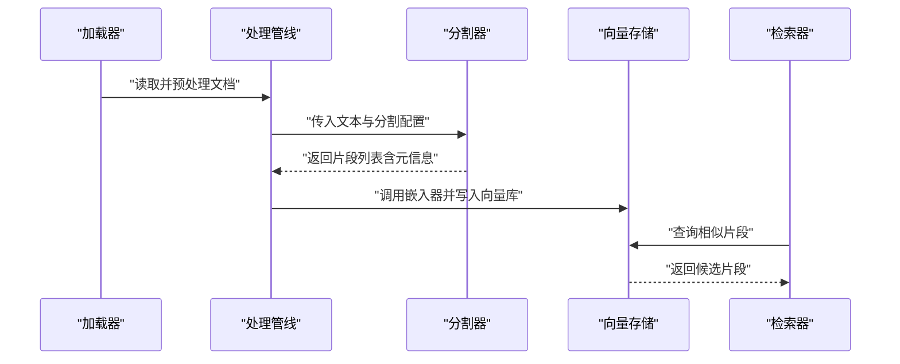
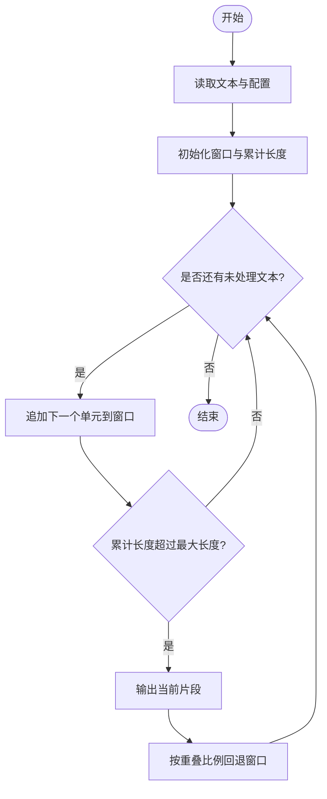
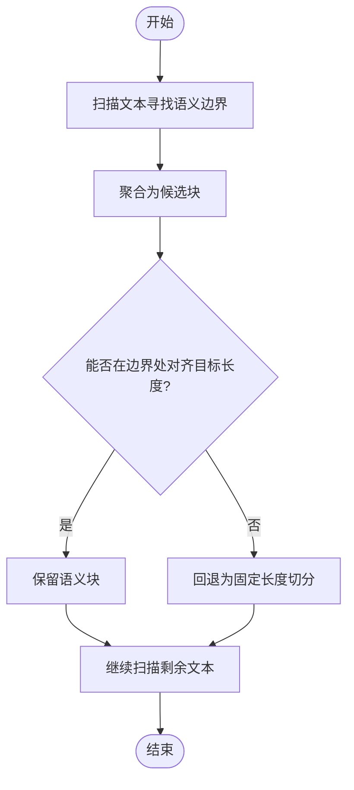
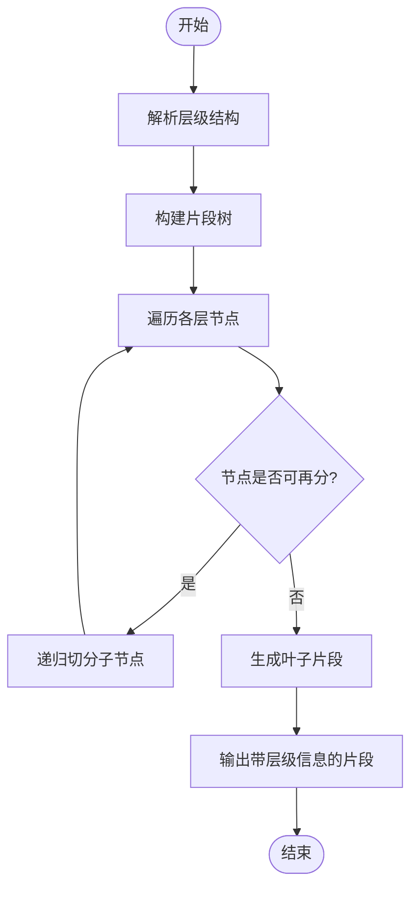
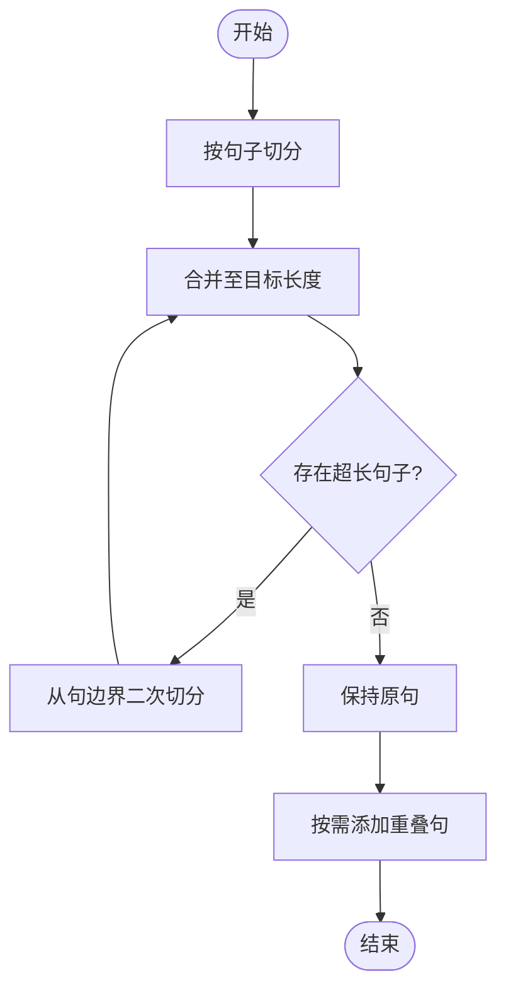
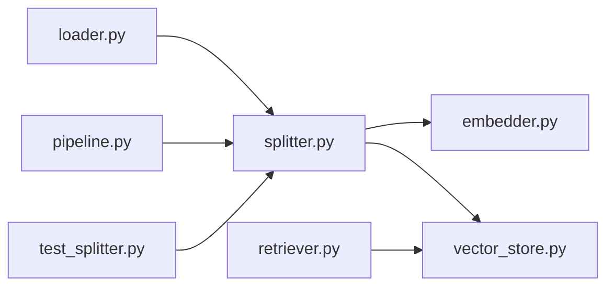

# 文本分割器

<cite>
**本文引用的文件**   
- [splitter.py](file://src/kag_pro/core/splitter.py)
- [test_splitter.py](file://tests/test_splitter.py)
- [pipeline.py](file://src/kag_pro/core/pipeline.py)
- [loader.py](file://src/kag_pro/core/loader.py)
- [retriever.py](file://src/kag_pro/core/retriever.py)
- [embedder.py](file://src/kag_pro/core/embedder.py)
- [vector_store.py](file://src/kag_pro/core/vector_store.py)
</cite>

## 目录
1. [简介](#简介)
2. [项目结构](#项目结构)
3. [核心组件](#核心组件)
4. [架构总览](#架构总览)
5. [详细组件分析](#详细组件分析)
6. [依赖关系分析](#依赖关系分析)
7. [性能考量](#性能考量)
8. [故障排查指南](#故障排查指南)
9. [结论](#结论)
10. [附录](#附录)

## 简介
本文件面向KAG-Pro的文本分割器模块，系统性阐述其算法实现、参数配置、质量控制机制、适用场景与评估指标，并提供使用示例与扩展指南。目标读者包括需要落地RAG/检索增强生成流程的工程师与研究者，以及希望基于现有接口定制分割策略的开发者。

## 项目结构
文本分割器位于核心模块中，承担“将长文档切分为可检索片段”的关键职责，并与加载器、嵌入器、向量存储和检索器协同工作。下图展示与分割器相关的核心文件及其交互关系。

图表来源
- [splitter.py](file://src/kag_pro/core/splitter.py)
- [pipeline.py](file://src/kag_pro/core/pipeline.py)
- [loader.py](file://src/kag_pro/core/loader.py)
- [embedder.py](file://src/kag_pro/core/embedder.py)
- [vector_store.py](file://src/kag_pro/core/vector_store.py)
- [retriever.py](file://src/kag_pro/core/retriever.py)
- [test_splitter.py](file://tests/test_splitter.py)

章节来源
- [splitter.py](file://src/kag_pro/core/splitter.py)
- [pipeline.py](file://src/kag_pro/core/pipeline.py)
- [loader.py](file://src/kag_pro/core/loader.py)
- [embedder.py](file://src/kag_pro/core/embedder.py)
- [vector_store.py](file://src/kag_pro/core/vector_store.py)
- [retriever.py](file://src/kag_pro/core/retriever.py)
- [test_splitter.py](file://tests/test_splitter.py)

## 核心组件
- 分割器入口：提供统一的分割函数或类方法，接收原始文本与配置，输出结构化片段集合。
- 策略选择：支持固定长度、语义边界、层次化、基于句子等多种策略，通过配置项切换。
- 质量控制：包含完整性校验、边界优化与内容重组等步骤，确保片段可用性与一致性。
- 集成点：与加载器对接输入源，与嵌入器和向量存储协作完成后续索引与检索。

章节来源
- [splitter.py](file://src/kag_pro/core/splitter.py)
- [pipeline.py](file://src/kag_pro/core/pipeline.py)

## 架构总览
下图展示了从文档到片段的端到端流程，突出分割器在整体管线中的位置与职责。

图表来源
- [pipeline.py](file://src/kag_pro/core/pipeline.py)
- [splitter.py](file://src/kag_pro/core/splitter.py)
- [vector_store.py](file://src/kag_pro/core/vector_store.py)
- [retriever.py](file://src/kag_pro/core/retriever.py)

## 详细组件分析

### 分割算法与实现原理
本节聚焦四种主要策略的实现思路与关键步骤。为避免直接粘贴代码，以下以流程图与要点说明为主，并在末尾给出对应源码路径。

#### 固定长度分割
- 核心思想：按最大长度阈值对文本进行切分，必要时引入重叠区域以保持上下文连续性。
- 关键步骤：
  - 计算段落或句子的粒度单元；
  - 滑动窗口累积至超过最大长度时落盘一个片段；
  - 根据重叠比例回退若干单位，保证相邻片段共享上下文；
  - 记录片段起止位置与来源信息以便溯源。
- 复杂度与特性：线性扫描，时间复杂度近似O(n)，空间复杂度取决于片段数量与重叠大小。
- 适用场景：通用长文、日志、对话记录等对语义边界不敏感的场景。

图表来源
- [splitter.py](file://src/kag_pro/core/splitter.py)

章节来源
- [splitter.py](file://src/kag_pro/core/splitter.py)

#### 语义边界分割
- 核心思想：优先在自然语义边界处切分，如标题、段落、列表项、问答对等，尽量保持单一片段内主题一致。
- 关键步骤：
  - 识别潜在边界标记（如换行、缩进、编号、标点组合等）；
  - 合并邻近小单元形成接近目标长度的块；
  - 若无法在边界处对齐，则回退为固定长度策略的兜底方案；
  - 输出片段时附带边界类型与置信度。
- 复杂度与特性：边界检测开销与文本结构复杂度相关，通常仍为线性或近线性。
- 适用场景：教材、论文、技术手册等具有明显层级结构的文本。

图表来源
- [splitter.py](file://src/kag_pro/core/splitter.py)

章节来源
- [splitter.py](file://src/kag_pro/core/splitter.py)

#### 层次化分割
- 核心思想：依据文档层级（如章节、小节、条目）构建多粒度片段树，上层为概览，下层为细节。
- 关键步骤：
  - 解析层级标记（标题层级、编号体系、缩进等）；
  - 自顶向下递归切分，每层维护父级上下文摘要；
  - 控制每层片段的最大长度与最小段落规模；
  - 输出带层级标签的片段集合，便于分层检索与导航。
- 复杂度与特性：递归深度受层级数影响，总体仍近似线性于文本规模。
- 适用场景：教科书、百科、规范文档等强层级结构文本。

图表来源
- [splitter.py](file://src/kag_pro/core/splitter.py)

章节来源
- [splitter.py](file://src/kag_pro/core/splitter.py)

#### 基于句子的分割
- 核心思想：以句子为基本单元，结合语义连贯性进行拼接，避免跨句割裂导致意义不完整。
- 关键步骤：
  - 句子切分（考虑多语言标点与缩写规则）；
  - 按目标长度合并句子，必要时引入重叠句；
  - 对过长句子采用内部切分策略（如从句边界）；
  - 输出片段并标注句子边界与计数。
- 复杂度与特性：句子切分可能涉及NLP工具或正则，整体仍近似线性。
- 适用场景：对话记录、问答语料、新闻快讯等以句为单位组织良好的文本。

图表来源
- [splitter.py](file://src/kag_pro/core/splitter.py)

章节来源
- [splitter.py](file://src/kag_pro/core/splitter.py)

### 分割参数配置
以下为常见配置项及其作用说明（具体字段名以源码为准）：
- 最大长度：控制单个片段的最大字符或token数，用于限制上下文窗口与检索成本。
- 重叠区域：相邻片段共享的内容比例或绝对长度，用于提升上下文保持度。
- 最小段落大小：防止产生过短片段，保障信息密度与检索稳定性。
- 分隔符设置：定义段落、句子、标题等边界识别规则，影响语义边界与层次化效果。
- 策略开关：选择固定长度、语义边界、层次化、基于句子等策略或其组合。
- 语言与方言：针对多语言文本调整句子切分与标点识别规则。

章节来源
- [splitter.py](file://src/kag_pro/core/splitter.py)

### 分割质量控制机制
- 完整性检查：验证每个片段非空、长度在合理范围、来源引用完整，避免丢失上下文。
- 边界优化：当边界落在不当位置时，尝试前移或后移至更自然的边界（如句号、标题）。
- 内容重组：对碎片化片段进行必要合并，消除重复与冗余，提升信息密度。
- 元信息维护：为每个片段附加来源、位置、层级、边界类型等元数据，便于溯源与调试。

章节来源
- [splitter.py](file://src/kag_pro/core/splitter.py)

### 适用场景与策略建议
- 学术论文：优先层次化+语义边界，兼顾最大长度与重叠，确保章节与段落完整性。
- 教材内容：层次化为主，辅以基于句子的细粒度切片，便于知识点定位。
- 对话记录：基于句子或固定长度+较大重叠，强调上下文连续性与对话连贯。
- 多语言文本：启用语言感知规则，调整句子切分与标点识别，必要时分语言处理。

[本节为概念性指导，不直接分析具体文件]

### 分割效果评估指标
- 信息密度：片段内有效信息占比，可通过去停用词后的词频或主题集中度衡量。
- 上下文保持度：相邻片段间语义衔接程度，可通过重叠区域的相似度或边界平滑度评估。
- 检索性能影响：片段数量、平均长度与重叠对召回率、准确率与延迟的影响。
- 稳定性：在不同文本分布下的鲁棒性，包括异常文本、噪声与格式差异的容忍度。

[本节为概念性指导，不直接分析具体文件]

### 实际使用示例
- 复杂文档结构：先解析层级，再在每层内应用语义边界或基于句子的策略，最后统一进行完整性检查与边界优化。
- 多语言文本：按语言分类或混合语言模型进行句子切分，分别配置分隔符与最小段落大小，再合并结果。
- 批量处理：通过处理管线串联加载器、分割器、嵌入器与向量存储，实现端到端流水线。

章节来源
- [pipeline.py](file://src/kag_pro/core/pipeline.py)
- [loader.py](file://src/kag_pro/core/loader.py)
- [embedder.py](file://src/kag_pro/core/embedder.py)
- [vector_store.py](file://src/kag_pro/core/vector_store.py)

### 自定义分割器开发指南
- 接口约定：遵循现有分割器的输入输出契约，接受文本与配置，返回片段列表及元信息。
- 扩展方式：
  - 新增策略：在策略选择逻辑中注册新策略，并实现对应的切分流程；
  - 钩子函数：在完整性检查、边界优化、内容重组阶段插入自定义逻辑；
  - 配置注入：通过配置项驱动行为，避免硬编码。
- 测试要求：覆盖典型与极端用例，包括空文本、超长文本、特殊标点与多语言混合。

章节来源
- [splitter.py](file://src/kag_pro/core/splitter.py)
- [test_splitter.py](file://tests/test_splitter.py)

## 依赖关系分析
下图展示分割器与其上下游模块的依赖关系，有助于理解其在系统中的耦合与职责边界。

图表来源
- [splitter.py](file://src/kag_pro/core/splitter.py)
- [pipeline.py](file://src/kag_pro/core/pipeline.py)
- [loader.py](file://src/kag_pro/core/loader.py)
- [embedder.py](file://src/kag_pro/core/embedder.py)
- [vector_store.py](file://src/kag_pro/core/vector_store.py)
- [retriever.py](file://src/kag_pro/core/retriever.py)
- [test_splitter.py](file://tests/test_splitter.py)

章节来源
- [splitter.py](file://src/kag_pro/core/splitter.py)
- [pipeline.py](file://src/kag_pro/core/pipeline.py)
- [loader.py](file://src/kag_pro/core/loader.py)
- [embedder.py](file://src/kag_pro/core/embedder.py)
- [vector_store.py](file://src/kag_pro/core/vector_store.py)
- [retriever.py](file://src/kag_pro/core/retriever.py)
- [test_splitter.py](file://tests/test_splitter.py)

## 性能考量
- 时间复杂度：各策略均以线性或近线性为主，瓶颈通常在句子切分与边界检测。
- 内存占用：与片段数量、重叠大小与元信息量成正比，建议流式处理大文档。
- I/O与序列化：批量写入向量库时注意批大小与并发度，避免阻塞主线程。
- 缓存与复用：对公共前缀/后缀或频繁出现的模式进行缓存，减少重复计算。
- 并行化：对独立文档或批次进行并行处理，注意资源隔离与错误隔离。

[本节为一般性指导，不直接分析具体文件]

## 故障排查指南
- 常见问题：
  - 片段过短或为空：检查最小段落大小与边界识别规则；
  - 上下文断裂：增大重叠区域或改用语义边界/基于句子策略；
  - 多语言标点误判：调整语言设置与分隔符规则；
  - 性能退化：降低重叠比例、减少不必要的边界检测或启用批处理。
- 诊断手段：
  - 查看片段元信息（来源、位置、层级、边界类型）；
  - 打印中间统计（片段数量、平均长度、重叠比例）；
  - 使用单元测试回归典型与极端用例。

章节来源
- [test_splitter.py](file://tests/test_splitter.py)
- [splitter.py](file://src/kag_pro/core/splitter.py)

## 结论
文本分割器在KAG-Pro中承担承上启下的关键角色：向上承接加载与管线编排，向下支撑嵌入与检索。通过灵活的策略选择、完善的参数配置与质量控制机制，能够适配多种文本类型与业务需求。建议在工程实践中结合评估指标持续调优，并通过扩展接口满足个性化场景。

[本节为总结性内容，不直接分析具体文件]

## 附录
- 术语表：
  - 片段：经分割器输出的最小可检索单元；
  - 重叠：相邻片段共享的内容，用于维持上下文；
  - 边界：文本中可用于切分的自然分隔位置；
  - 层级：文档的结构层次，如章、节、条等。
- 参考路径：
  - 分割器实现：[splitter.py](file://src/kag_pro/core/splitter.py)
  - 单元测试：[test_splitter.py](file://tests/test_splitter.py)
  - 管线集成：[pipeline.py](file://src/kag_pro/core/pipeline.py)
  - 数据加载：[loader.py](file://src/kag_pro/core/loader.py)
  - 嵌入与存储：[embedder.py](file://src/kag_pro/core/embedder.py), [vector_store.py](file://src/kag_pro/core/vector_store.py)
  - 检索链路：[retriever.py](file://src/kag_pro/core/retriever.py)