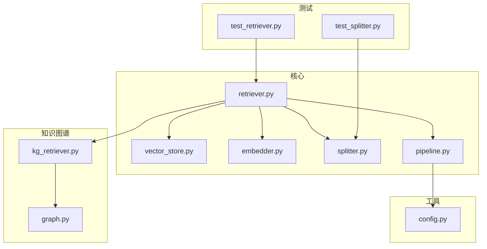
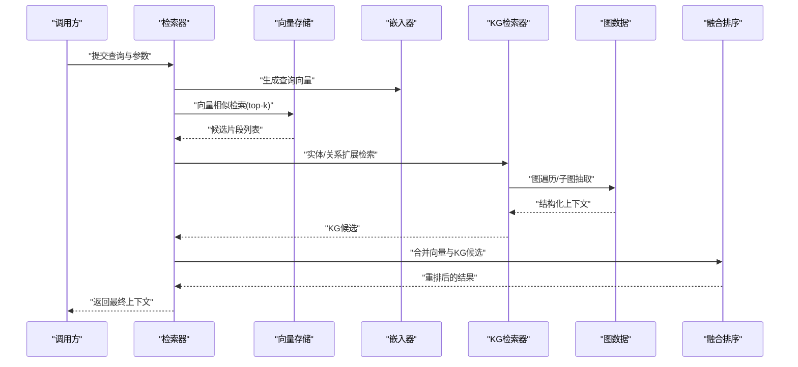
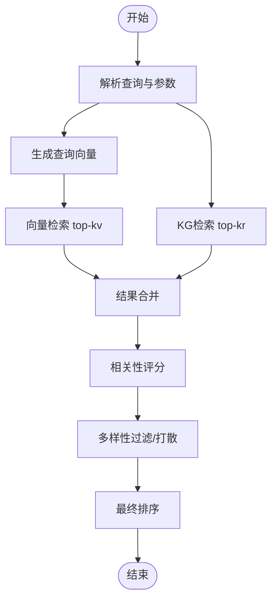
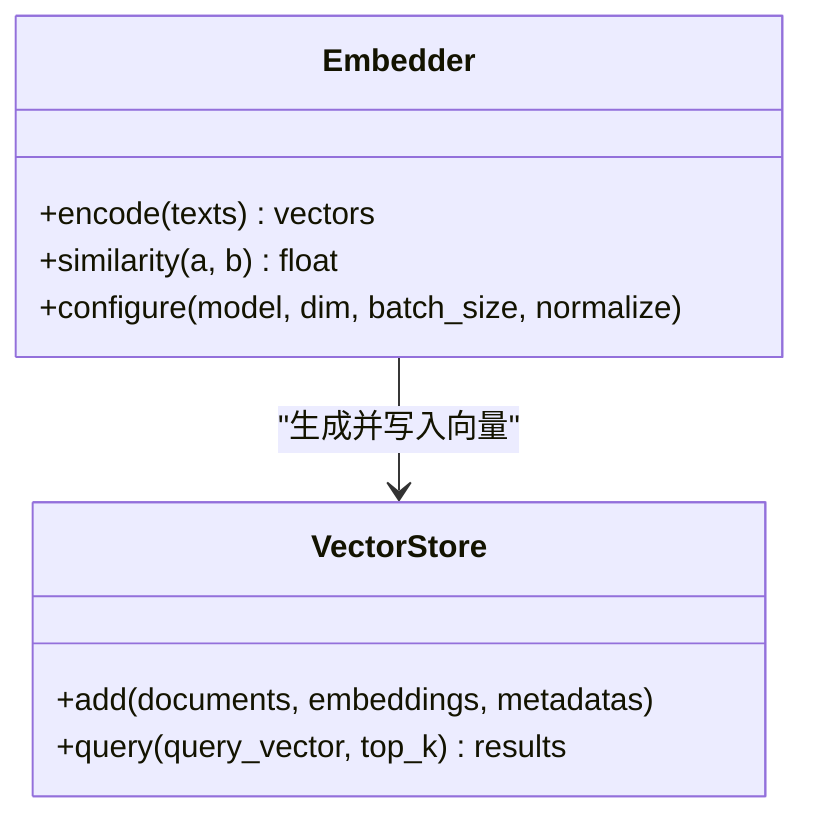
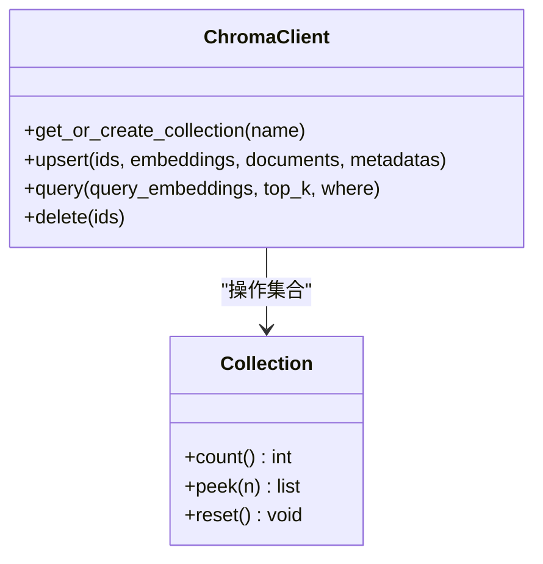
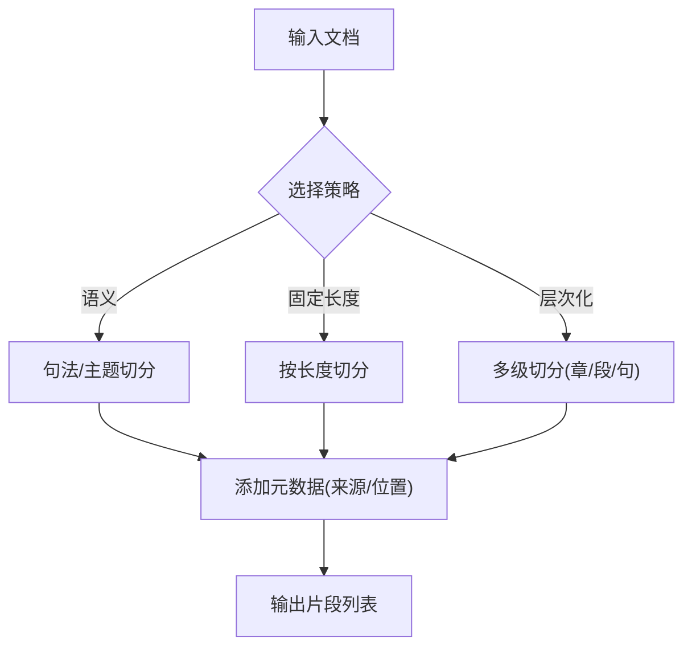
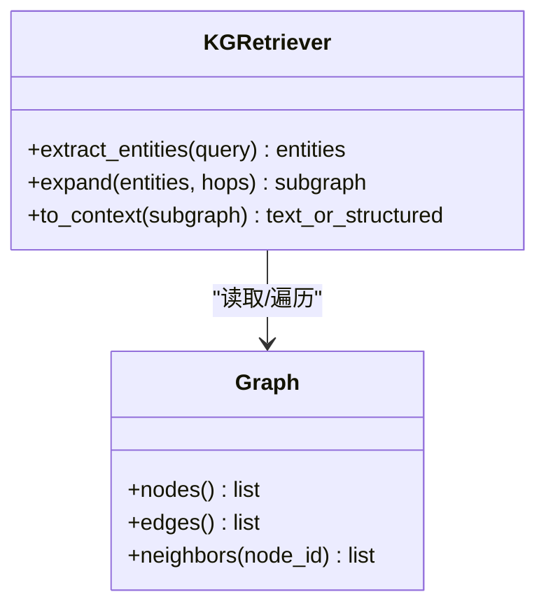
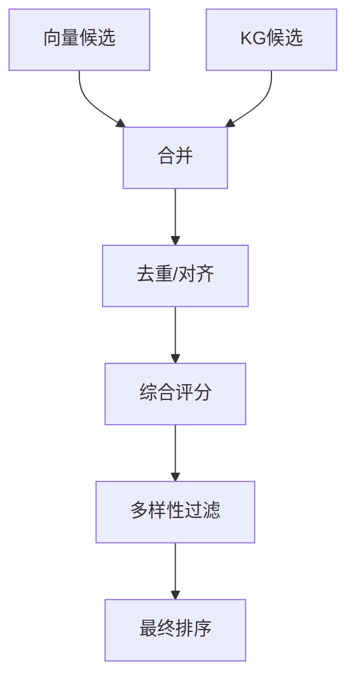
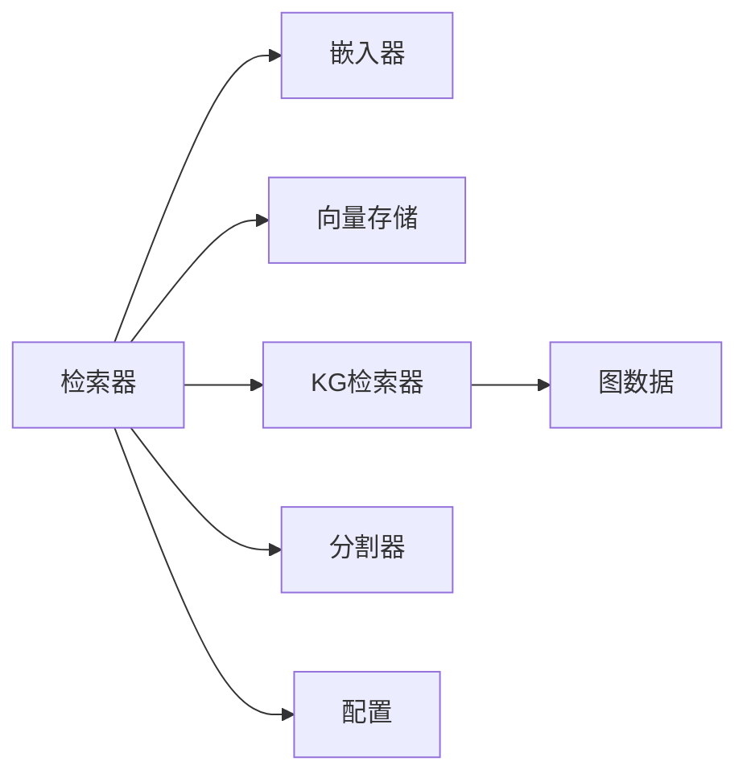

# 检索增强模块

<cite>
**本文引用的文件**   
- [retriever.py](file://src/kag_pro/core/retriever.py)
- [vector_store.py](file://src/kag_pro/core/vector_store.py)
- [embedder.py](file://src/kag_pro/core/embedder.py)
- [splitter.py](file://src/kag_pro/core/splitter.py)
- [kg_retriever.py](file://src/kag_pro/kg/kg_retriever.py)
- [graph.py](file://src/kag_pro/kg/graph.py)
- [pipeline.py](file://src/kag_pro/core/pipeline.py)
- [config.py](file://src/kag_pro/utils/config.py)
- [test_retriever.py](file://tests/test_retriever.py)
- [test_splitter.py](file://tests/test_splitter.py)
</cite>

## 目录
1. [简介](#简介)
2. [项目结构](#项目结构)
3. [核心组件](#核心组件)
4. [架构总览](#架构总览)
5. [详细组件分析](#详细组件分析)
6. [依赖关系分析](#依赖关系分析)
7. [性能考虑](#性能考虑)
8. [故障排查指南](#故障排查指南)
9. [结论](#结论)
10. [附录](#附录)

## 简介
本技术文档聚焦KAG-Pro的检索增强（RAG）模块，系统性阐述混合检索策略的实现原理与工程落地。内容覆盖：
- 向量相似度搜索与知识图谱关联检索的融合机制
- 嵌入模型配置与定制（文本向量化、语义理解、相似度计算）
- 向量存储系统架构（ChromaDB配置、索引策略、查询优化）
- 文本分割器算法（语义分割、固定长度分割、层次化分割）
- 检索结果融合排序（重排序策略、相关性评分、多样性保证）
- 检索API文档（查询语法、参数配置、性能调优）
- 实际应用场景示例（精准信息检索与问答系统）

## 项目结构
检索增强相关代码主要分布在以下路径：
- 核心检索与流程编排：core/
- 知识图谱检索与图数据：kg/
- 工具与配置：utils/
- 测试用例：tests/

图表来源
- [retriever.py:1-200](file://src/kag_pro/core/retriever.py#L1-L200)
- [vector_store.py:1-200](file://src/kag_pro/core/vector_store.py#L1-L200)
- [embedder.py:1-200](file://src/kag_pro/core/embedder.py#L1-L200)
- [splitter.py:1-200](file://src/kag_pro/core/splitter.py#L1-L200)
- [kg_retriever.py:1-200](file://src/kag_pro/kg/kg_retriever.py#L1-L200)
- [graph.py:1-200](file://src/kag_pro/kg/graph.py#L1-L200)
- [pipeline.py:1-200](file://src/kag_pro/core/pipeline.py#L1-L200)
- [config.py:1-200](file://src/kag_pro/utils/config.py#L1-L200)
- [test_retriever.py:1-200](file://tests/test_retriever.py#L1-L200)
- [test_splitter.py:1-200](file://tests/test_splitter.py#L1-L200)

章节来源
- [retriever.py:1-200](file://src/kag_pro/core/retriever.py#L1-L200)
- [vector_store.py:1-200](file://src/kag_pro/core/vector_store.py#L1-L200)
- [embedder.py:1-200](file://src/kag_pro/core/embedder.py#L1-L200)
- [splitter.py:1-200](file://src/kag_pro/core/splitter.py#L1-L200)
- [kg_retriever.py:1-200](file://src/kag_pro/kg/kg_retriever.py#L1-L200)
- [graph.py:1-200](file://src/kag_pro/kg/graph.py#L1-L200)
- [pipeline.py:1-200](file://src/kag_pro/core/pipeline.py#L1-L200)
- [config.py:1-200](file://src/kag_pro/utils/config.py#L1-L200)
- [test_retriever.py:1-200](file://tests/test_retriever.py#L1-L200)
- [test_splitter.py:1-200](file://tests/test_splitter.py#L1-L200)

## 核心组件
- 检索器（Retriever）：统一入口，协调向量检索与KG检索，执行结果融合与重排序。
- 向量存储（VectorStore）：封装ChromaDB客户端，提供集合管理、批量写入、相似性检索接口。
- 嵌入器（Embedder）：负责文本到向量转换、相似度度量、可选的提示词模板与元数据注入。
- 分割器（Splitter）：提供多种切分策略（语义、固定长度、层次化），输出可检索片段。
- 知识图谱检索器（KGRetriever）：基于图结构的实体/关系检索，返回结构化上下文。
- 流程编排（Pipeline）：串联“分割→嵌入→入库→检索→融合”等阶段。
- 配置（Config）：集中管理模型、存储、检索参数。

章节来源
- [retriever.py:1-200](file://src/kag_pro/core/retriever.py#L1-L200)
- [vector_store.py:1-200](file://src/kag_pro/core/vector_store.py#L1-L200)
- [embedder.py:1-200](file://src/kag_pro/core/embedder.py#L1-L200)
- [splitter.py:1-200](file://src/kag_pro/core/splitter.py#L1-L200)
- [kg_retriever.py:1-200](file://src/kag_pro/kg/kg_retriever.py#L1-L200)
- [graph.py:1-200](file://src/kag_pro/kg/graph.py#L1-L200)
- [pipeline.py:1-200](file://src/kag_pro/core/pipeline.py#L1-L200)
- [config.py:1-200](file://src/kag_pro/utils/config.py#L1-L200)

## 架构总览
混合检索由“向量相似度搜索 + 知识图谱关联检索”两条路径并行或串行执行，随后进行结果融合与重排序，最终输出高质量上下文。

图表来源
- [retriever.py:1-200](file://src/kag_pro/core/retriever.py#L1-L200)
- [vector_store.py:1-200](file://src/kag_pro/core/vector_store.py#L1-L200)
- [embedder.py:1-200](file://src/kag_pro/core/embedder.py#L1-L200)
- [kg_retriever.py:1-200](file://src/kag_pro/kg/kg_retriever.py#L1-L200)
- [graph.py:1-200](file://src/kag_pro/kg/graph.py#L1-L200)

## 详细组件分析

### 混合检索策略
- 双路召回：向量检索负责语义匹配，KG检索负责实体/关系约束与背景补充。
- 融合策略：对两类结果进行去重、对齐与加权合并，支持按场景调整权重。
- 重排序：引入更精细的相关性评分与多样性控制，避免重复与同质化。

图表来源
- [retriever.py:1-200](file://src/kag_pro/core/retriever.py#L1-L200)
- [kg_retriever.py:1-200](file://src/kag_pro/kg/kg_retriever.py#L1-L200)

章节来源
- [retriever.py:1-200](file://src/kag_pro/core/retriever.py#L1-L200)
- [kg_retriever.py:1-200](file://src/kag_pro/kg/kg_retriever.py#L1-L200)

### 嵌入模型配置与定制
- 文本向量化：通过嵌入器将自然语言转换为稠密向量，支持批量与流式处理。
- 语义理解：可通过提示词模板、领域微调或元数据注入提升语义表征质量。
- 相似度计算：默认余弦相似度，可按需切换为内积或欧氏距离（取决于后端）。
- 配置项：模型名称/路径、维度、批大小、缓存策略、归一化开关等。

图表来源
- [embedder.py:1-200](file://src/kag_pro/core/embedder.py#L1-L200)
- [vector_store.py:1-200](file://src/kag_pro/core/vector_store.py#L1-L200)

章节来源
- [embedder.py:1-200](file://src/kag_pro/core/embedder.py#L1-L200)
- [vector_store.py:1-200](file://src/kag_pro/core/vector_store.py#L1-L200)

### 向量存储系统（ChromaDB）
- 集合管理：创建/删除/列出集合，命名空间隔离。
- 索引策略：HNSW/IVF等近似最近邻索引，平衡召回率与延迟。
- 查询优化：top_k、where过滤、元数据筛选、分页与并发限制。
- 持久化：本地磁盘或远程后端，事务与一致性保障。

图表来源
- [vector_store.py:1-200](file://src/kag_pro/core/vector_store.py#L1-L200)

章节来源
- [vector_store.py:1-200](file://src/kag_pro/core/vector_store.py#L1-L200)

### 文本分割器算法
- 语义分割：依据句子/段落边界与主题变化进行切分，保持语义完整性。
- 固定长度分割：按字符/Token数切分，适合长文档快速索引。
- 层次化分割：多级粒度（章节→段落→句子），便于多尺度检索与回溯。
- 重叠与元数据：支持窗口重叠、来源标记、位置信息，利于后续重排与溯源。

图表来源
- [splitter.py:1-200](file://src/kag_pro/core/splitter.py#L1-L200)

章节来源
- [splitter.py:1-200](file://src/kag_pro/core/splitter.py#L1-L200)
- [test_splitter.py:1-200](file://tests/test_splitter.py#L1-L200)

### 知识图谱关联检索
- 实体识别与消歧：从查询中抽取关键实体，映射至图节点。
- 关系扩展：沿边进行多跳扩展，收集相关三元组与子图。
- 结构化上下文：将子图序列化为文本或结构化片段，供下游使用。
- 与向量检索互补：在事实型、关系型问题上显著提升准确性。

图表来源
- [kg_retriever.py:1-200](file://src/kag_pro/kg/kg_retriever.py#L1-L200)
- [graph.py:1-200](file://src/kag_pro/kg/graph.py#L1-L200)

章节来源
- [kg_retriever.py:1-200](file://src/kag_pro/kg/kg_retriever.py#L1-L200)
- [graph.py:1-200](file://src/kag_pro/kg/graph.py#L1-L200)

### 检索结果融合与重排序
- 去重与对齐：按内容指纹或ID去重，跨模态结果对齐。
- 相关性评分：结合向量相似度、KG命中度、元数据权重等综合打分。
- 多样性保证：基于最大边际相关性（MMR）或主题打散，抑制重复。
- 可配置策略：按任务类型（问答/摘要/推荐）调整权重与阈值。

图表来源
- [retriever.py:1-200](file://src/kag_pro/core/retriever.py#L1-L200)

章节来源
- [retriever.py:1-200](file://src/kag_pro/core/retriever.py#L1-L200)

### 检索API文档
- 查询语法
  - 自由文本查询：直接传入自然语言问题。
  - 结构化过滤：通过元数据字段（如来源、时间、标签）限定范围。
  - 组合条件：AND/OR/NOT逻辑组合，支持嵌套。
- 参数配置
  - top_k：返回片段数量。
  - mode：仅向量/仅KG/混合。
  - weights：向量与KG结果的融合权重。
  - diversity：多样性强度（0~1）。
  - filters：元数据过滤表达式。
- 性能调优
  - 批大小与并发：提高吞吐但增加内存占用。
  - 索引参数：HNSW的M、efConstruction、efSearch等。
  - 缓存：嵌入与中间结果缓存命中率优化。
  - 超时与重试：网络与外部服务容错。

章节来源
- [retriever.py:1-200](file://src/kag_pro/core/retriever.py#L1-L200)
- [vector_store.py:1-200](file://src/kag_pro/core/vector_store.py#L1-L200)
- [config.py:1-200](file://src/kag_pro/utils/config.py#L1-L200)

### 实际应用场景示例
- 精准信息检索
  - 步骤：加载文档→分割→嵌入→入库→查询→融合→重排→返回片段。
  - 要点：合理设置top_k与多样性；对专业术语启用KG扩展。
- 问答系统
  - 步骤：问题改写→实体抽取→KG子图→向量检索→融合→答案生成。
  - 要点：KG用于事实校验与关系推理；向量用于背景材料补充。

章节来源
- [pipeline.py:1-200](file://src/kag_pro/core/pipeline.py#L1-L200)
- [test_retriever.py:1-200](file://tests/test_retriever.py#L1-L200)

## 依赖关系分析
- 组件耦合
  - 检索器强依赖嵌入器、向量存储与KG检索器。
  - 分割器独立性强，可被上游流水线复用。
  - 配置贯穿各组件，影响行为与性能。
- 外部依赖
  - ChromaDB作为向量存储后端。
  - 图数据库/图库作为KG存储。
  - 嵌入模型服务（本地或远程）。

图表来源
- [retriever.py:1-200](file://src/kag_pro/core/retriever.py#L1-L200)
- [embedder.py:1-200](file://src/kag_pro/core/embedder.py#L1-L200)
- [vector_store.py:1-200](file://src/kag_pro/core/vector_store.py#L1-L200)
- [kg_retriever.py:1-200](file://src/kag_pro/kg/kg_retriever.py#L1-L200)
- [graph.py:1-200](file://src/kag_pro/kg/graph.py#L1-L200)
- [splitter.py:1-200](file://src/kag_pro/core/splitter.py#L1-L200)
- [config.py:1-200](file://src/kag_pro/utils/config.py#L1-L200)

章节来源
- [retriever.py:1-200](file://src/kag_pro/core/retriever.py#L1-L200)
- [embedder.py:1-200](file://src/kag_pro/core/embedder.py#L1-L200)
- [vector_store.py:1-200](file://src/kag_pro/core/vector_store.py#L1-L200)
- [kg_retriever.py:1-200](file://src/kag_pro/kg/kg_retriever.py#L1-L200)
- [graph.py:1-200](file://src/kag_pro/kg/graph.py#L1-L200)
- [splitter.py:1-200](file://src/kag_pro/core/splitter.py#L1-L200)
- [config.py:1-200](file://src/kag_pro/utils/config.py#L1-L200)

## 性能考虑
- 索引与查询
  - HNSW参数调优：增大M与efConstruction提升召回，增大efSearch降低延迟。
  - 预取与分页：大结果集分批拉取，减少单次响应体积。
- 嵌入与批处理
  - 批大小与GPU显存权衡；启用缓存减少重复计算。
- 资源与并发
  - 连接池与线程池上限；限流与熔断保护后端。
- 评估与监控
  - 记录P95/P99延迟、召回率、NDCG；异常告警与降级策略。

[本节为通用指导，不直接分析具体文件]

## 故障排查指南
- 常见问题
  - 向量维度不匹配：检查嵌入模型与存储配置是否一致。
  - 集合不存在：确认初始化与权限。
  - 查询超时：调整top_k、并发与后端超时。
  - 结果重复：开启多样性过滤或调整去重阈值。
- 定位方法
  - 打印中间结果：查看分割片段、嵌入向量、候选列表。
  - 对比不同模式：仅向量/仅KG/混合，定位瓶颈。
  - 指标观测：延迟、吞吐、错误率、缓存命中率。

章节来源
- [test_retriever.py:1-200](file://tests/test_retriever.py#L1-L200)
- [test_splitter.py:1-200](file://tests/test_splitter.py#L1-L200)

## 结论
本模块以“向量+知识图谱”的混合检索为核心，配合灵活的分割策略与可配置的融合重排序，能够在复杂业务场景中实现高相关性与高多样性的检索结果。通过合理的索引与参数调优，可在精度与延迟之间取得良好平衡。

[本节为总结性内容，不直接分析具体文件]

## 附录
- 术语表
  - 向量相似度：衡量两个向量在语义空间的接近程度。
  - 重排序：在初筛基础上进一步精细化排序的过程。
  - 多样性：结果间差异化的程度，避免同质化。
- 参考实现路径
  - 检索主流程：[retriever.py](file://src/kag_pro/core/retriever.py)
  - 向量存储接口：[vector_store.py](file://src/kag_pro/core/vector_store.py)
  - 嵌入与相似度：[embedder.py](file://src/kag_pro/core/embedder.py)
  - 文本分割策略：[splitter.py](file://src/kag_pro/core/splitter.py)
  - 知识图谱检索：[kg_retriever.py](file://src/kag_pro/kg/kg_retriever.py)
  - 图数据结构：[graph.py](file://src/kag_pro/kg/graph.py)
  - 流程编排：[pipeline.py](file://src/kag_pro/core/pipeline.py)
  - 配置管理：[config.py](file://src/kag_pro/utils/config.py)
  - 单元测试：[test_retriever.py](file://tests/test_retriever.py), [test_splitter.py](file://tests/test_splitter.py)