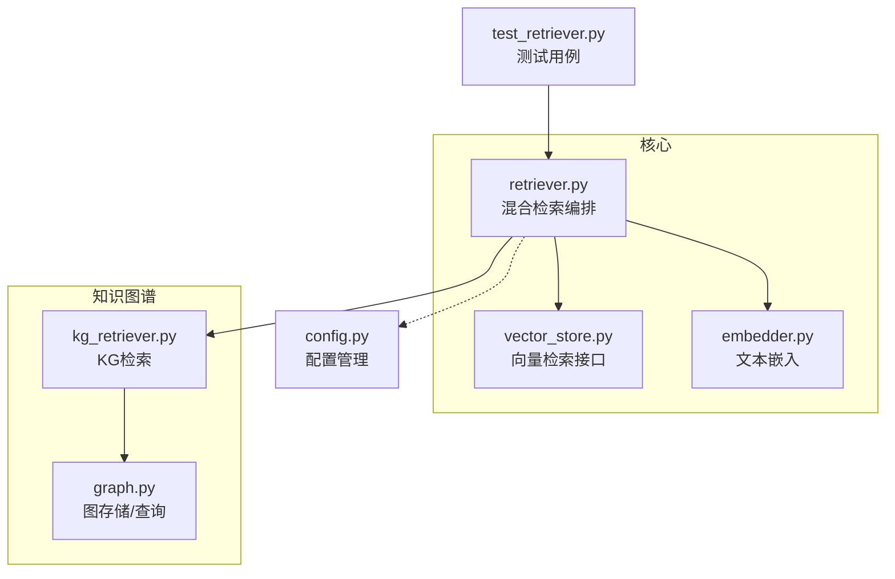
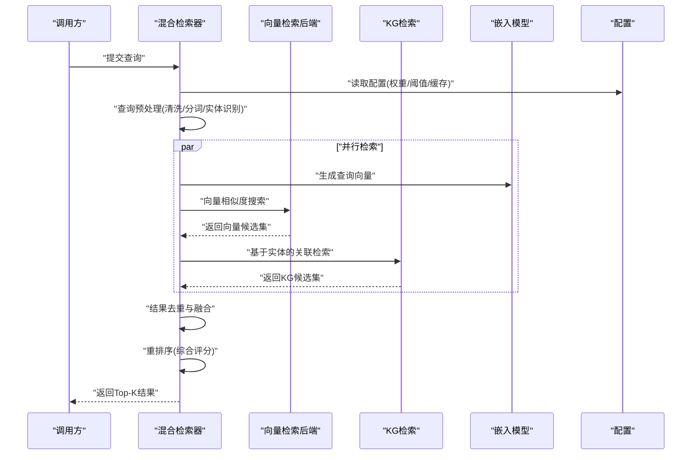
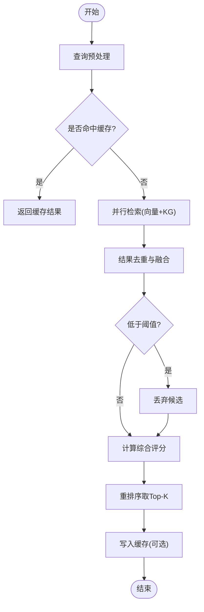
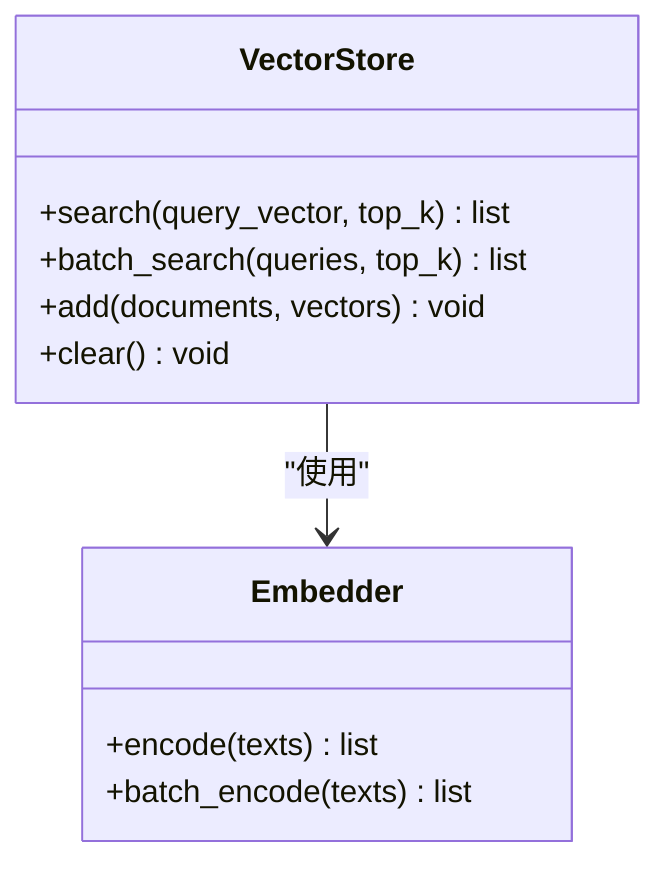
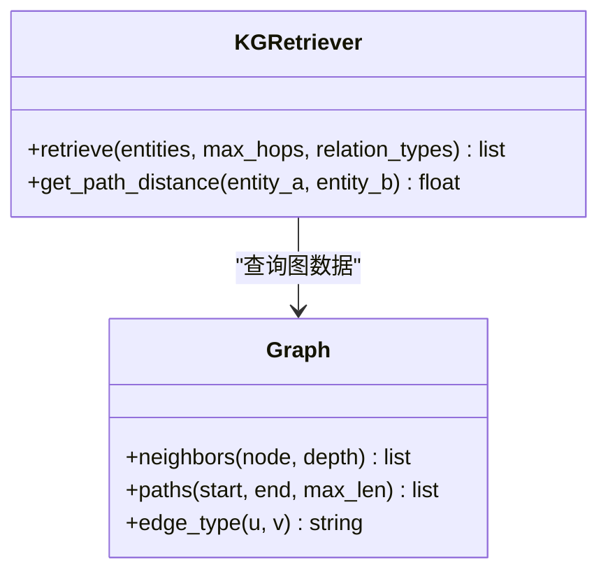
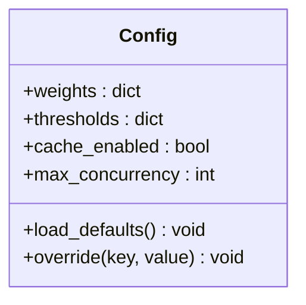
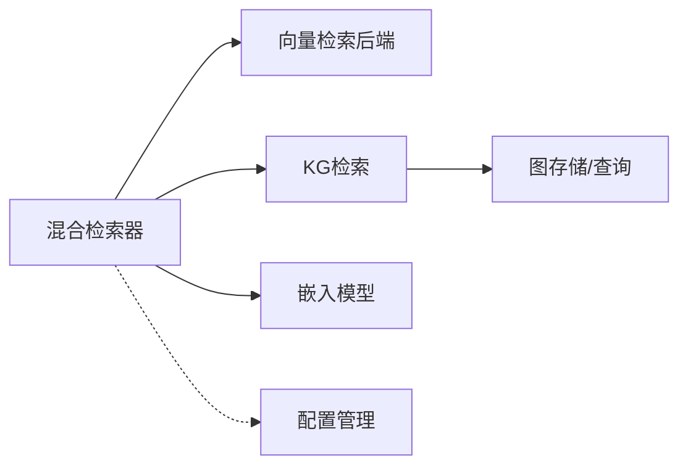

# 混合检索器

<cite>
**本文引用的文件**   
- [retriever.py](file://src/kag_pro/core/retriever.py)
- [kg_retriever.py](file://src/kag_pro/kg/kg_retriever.py)
- [vector_store.py](file://src/kag_pro/core/vector_store.py)
- [embedder.py](file://src/kag_pro/core/embedder.py)
- [graph.py](file://src/kag_pro/kg/graph.py)
- [config.py](file://src/kag_pro/utils/config.py)
- [test_retriever.py](file://tests/test_retriever.py)
</cite>

## 目录
1. [简介](#简介)
2. [项目结构](#项目结构)
3. [核心组件](#核心组件)
4. [架构总览](#架构总览)
5. [详细组件分析](#详细组件分析)
6. [依赖关系分析](#依赖关系分析)
7. [性能考虑](#性能考虑)
8. [故障排查指南](#故障排查指南)
9. [结论](#结论)
10. [附录：API使用示例](#附录api使用示例)

## 简介
本技术文档面向KAG-Pro的“混合检索器”，系统性阐述其混合检索策略与实现原理，覆盖查询预处理、并行检索、结果融合与重排序等关键阶段；并对配置参数（权重、阈值、缓存）、相关性评分算法（BM25、余弦相似度、知识图谱路径距离）进行说明。同时提供性能优化建议与完整API使用示例，帮助读者快速上手并高效调优。

## 项目结构
围绕混合检索的核心代码主要分布在以下模块：
- 核心检索编排与融合逻辑：core/retriever.py
- 向量检索后端封装：core/vector_store.py
- 文本嵌入模型封装：core/embedder.py
- 知识图谱检索与图存储：kg/kg_retriever.py、kg/graph.py
- 统一配置入口：utils/config.py
- 单元测试用例：tests/test_retriever.py

图表来源
- [retriever.py](file://src/kag_pro/core/retriever.py)
- [vector_store.py](file://src/kag_pro/core/vector_store.py)
- [embedder.py](file://src/kag_pro/core/embedder.py)
- [kg_retriever.py](file://src/kag_pro/kg/kg_retriever.py)
- [graph.py](file://src/kag_pro/kg/graph.py)
- [config.py](file://src/kag_pro/utils/config.py)
- [test_retriever.py](file://tests/test_retriever.py)

章节来源
- [retriever.py](file://src/kag_pro/core/retriever.py)
- [kg_retriever.py](file://src/kag_pro/kg/kg_retriever.py)
- [vector_store.py](file://src/kag_pro/core/vector_store.py)
- [embedder.py](file://src/kag_pro/core/embedder.py)
- [graph.py](file://src/kag_pro/kg/graph.py)
- [config.py](file://src/kag_pro/utils/config.py)
- [test_retriever.py](file://tests/test_retriever.py)

## 核心组件
- 混合检索器（核心编排）
  - 职责：接收查询，执行查询预处理；并行触发向量检索与KG检索；对多路结果进行去重、融合与重排序；返回最终Top-K结果及分数。
  - 关键点：支持可配置的权重分配、阈值过滤、缓存命中加速、异步并发控制。
- 向量检索后端
  - 职责：将查询文本向量化后在向量索引中执行相似度搜索，返回候选片段及其相似度分数。
  - 关键点：支持批量向量化、近似最近邻搜索、可选本地缓存。
- 知识图谱检索
  - 职责：基于实体识别/关键词抽取，在图中执行关联检索（邻居扩展、路径检索），返回相关三元组或子图片段及路径距离。
  - 关键点：支持最大跳数、关系类型过滤、路径去重。
- 嵌入模型
  - 职责：提供文本到向量的映射能力，供向量检索使用。
  - 关键点：支持批量编码、维度对齐、缓存复用。
- 配置管理
  - 职责：集中管理检索器权重、阈值、缓存开关、并发度等参数。
  - 关键点：支持默认值与运行时覆盖。

章节来源
- [retriever.py](file://src/kag_pro/core/retriever.py)
- [vector_store.py](file://src/kag_pro/core/vector_store.py)
- [kg_retriever.py](file://src/kag_pro/kg/kg_retriever.py)
- [embedder.py](file://src/kag_pro/core/embedder.py)
- [config.py](file://src/kag_pro/utils/config.py)

## 架构总览
下图展示了从查询输入到最终结果的端到端流程，包括预处理、并行检索、融合与重排序。

图表来源
- [retriever.py](file://src/kag_pro/core/retriever.py)
- [vector_store.py](file://src/kag_pro/core/vector_store.py)
- [kg_retriever.py](file://src/kag_pro/kg/kg_retriever.py)
- [embedder.py](file://src/kag_pro/core/embedder.py)
- [config.py](file://src/kag_pro/utils/config.py)

## 详细组件分析

### 混合检索器（编排与融合）
- 功能要点
  - 查询预处理：文本清洗、停用词处理、术语规范化、实体/关键词抽取。
  - 并行检索：通过并发机制同时发起向量检索与KG检索，减少整体延迟。
  - 结果融合：按唯一标识合并候选项，聚合多路得分。
  - 重排序：依据综合评分函数对候选进行排序，输出Top-K。
- 关键设计
  - 权重分配：为向量相似度、BM25、KG路径距离分别设置权重，支持动态调整。
  - 阈值过滤：在融合前剔除低于阈值的弱信号，降低噪声。
  - 缓存策略：对查询向量、实体集合、中间结果进行缓存，命中时直接返回。
  - 并发控制：限制并发度，避免下游服务过载。

图表来源
- [retriever.py](file://src/kag_pro/core/retriever.py)

章节来源
- [retriever.py](file://src/kag_pro/core/retriever.py)

### 向量检索后端
- 功能要点
  - 将查询文本经嵌入模型转换为向量，在向量索引中进行相似度搜索。
  - 返回候选片段与其相似度分数，支持批量查询以提升吞吐。
- 关键设计
  - 批量向量化：一次请求多个查询，减少模型调用开销。
  - 近似最近邻：权衡召回率与速度，适合大规模语料。
  - 可选缓存：对常见查询向量进行缓存，提升命中率。

图表来源
- [vector_store.py](file://src/kag_pro/core/vector_store.py)
- [embedder.py](file://src/kag_pro/core/embedder.py)

章节来源
- [vector_store.py](file://src/kag_pro/core/vector_store.py)
- [embedder.py](file://src/kag_pro/core/embedder.py)

### 知识图谱检索
- 功能要点
  - 基于实体/关键词在图中执行关联检索，支持邻居扩展与路径检索。
  - 返回相关三元组或子图片段，附带路径距离信息用于后续评分。
- 关键设计
  - 最大跳数：限制扩展深度，控制检索范围与耗时。
  - 关系过滤：仅保留指定类型的边，提高相关性。
  - 路径去重：避免重复路径影响评分稳定性。

图表来源
- [kg_retriever.py](file://src/kag_pro/kg/kg_retriever.py)
- [graph.py](file://src/kag_pro/kg/graph.py)

章节来源
- [kg_retriever.py](file://src/kag_pro/kg/kg_retriever.py)
- [graph.py](file://src/kag_pro/kg/graph.py)

### 配置管理
- 功能要点
  - 统一管理检索器权重、阈值、缓存开关、并发度等参数。
  - 提供默认值与运行时覆盖能力，便于不同场景灵活切换。
- 关键设计
  - 分层配置：全局默认配置与实例级覆盖。
  - 校验与回退：非法值自动回退至安全默认值。

图表来源
- [config.py](file://src/kag_pro/utils/config.py)

章节来源
- [config.py](file://src/kag_pro/utils/config.py)

## 依赖关系分析
- 耦合关系
  - 混合检索器依赖向量检索后端、KG检索与嵌入模型，形成松耦合的多路检索架构。
  - 配置管理贯穿各组件，提供一致的参数访问方式。
- 外部依赖
  - 向量数据库/索引库（由向量检索后端封装）。
  - 图数据库/内存图（由图组件封装）。
  - 文本嵌入模型（本地或远程服务）。
- 潜在循环依赖
  - 当前设计无直接循环依赖；若引入跨层回调需警惕。

图表来源
- [retriever.py](file://src/kag_pro/core/retriever.py)
- [vector_store.py](file://src/kag_pro/core/vector_store.py)
- [kg_retriever.py](file://src/kag_pro/kg/kg_retriever.py)
- [graph.py](file://src/kag_pro/kg/graph.py)
- [embedder.py](file://src/kag_pro/core/embedder.py)
- [config.py](file://src/kag_pro/utils/config.py)

章节来源
- [retriever.py](file://src/kag_pro/core/retriever.py)
- [vector_store.py](file://src/kag_pro/core/vector_store.py)
- [kg_retriever.py](file://src/kag_pro/kg/kg_retriever.py)
- [graph.py](file://src/kag_pro/kg/graph.py)
- [embedder.py](file://src/kag_pro/core/embedder.py)
- [config.py](file://src/kag_pro/utils/config.py)

## 性能考虑
- 索引策略
  - 向量索引：采用近似最近邻算法，平衡召回与速度；定期重建索引以纳入增量更新。
  - 图索引：对高频实体建立倒排索引，加速邻居查找；对常用关系建立预计算路径表。
- 批量查询
  - 对向量检索与嵌入模型启用批量模式，减少系统调用次数与序列化开销。
- 异步处理
  - 使用并发池并行执行向量检索与KG检索；根据下游容量限制并发度，避免雪崩。
- 缓存策略
  - 查询向量缓存：对相同查询的向量表示进行缓存。
  - 实体集合缓存：对实体识别结果进行短时缓存。
  - 结果缓存：对热点查询的最终结果进行TTL缓存。
- 资源隔离
  - 将向量检索与KG检索部署在不同资源池，避免相互干扰。
- 监控与告警
  - 记录各阶段耗时、命中率、错误率，设置阈值告警。

[本节为通用性能指导，不直接分析具体文件]

## 故障排查指南
- 常见问题
  - 向量检索为空：检查嵌入模型可用性、向量索引是否构建完成、查询向量维度是否正确。
  - KG检索超时：检查图服务健康状态、最大跳数是否过大、关系过滤是否过严。
  - 融合结果为空：检查阈值是否过高、权重是否导致某路被完全抑制。
  - 缓存未命中：确认缓存键生成规则一致、TTL过期时间合理。
- 定位方法
  - 开启调试日志，记录预处理、并发任务、融合与重排序的关键中间变量。
  - 对单路检索进行独立验证，逐步缩小问题范围。
  - 使用最小数据集复现问题，确保环境稳定。

章节来源
- [test_retriever.py](file://tests/test_retriever.py)

## 结论
KAG-Pro的混合检索器通过并行融合向量相似度与知识图谱关联检索，结合可配置的权重与阈值，实现了高召回与高相关的平衡。合理的索引策略、批量与异步处理以及多级缓存，进一步提升了系统性能与稳定性。建议在生产环境中持续监控与调优，以获得最佳效果。

[本节为总结性内容，不直接分析具体文件]

## 附录：API使用示例
以下为典型使用流程与配置要点（以路径引用代替具体代码）：
- 初始化与配置
  - 加载默认配置并进行必要覆盖（权重、阈值、缓存开关、并发度）。
  - 参考：[config.py](file://src/kag_pro/utils/config.py)
- 构建检索器
  - 注入向量检索后端、KG检索与嵌入模型实例。
  - 参考：[retriever.py](file://src/kag_pro/core/retriever.py)、[vector_store.py](file://src/kag_pro/core/vector_store.py)、[kg_retriever.py](file://src/kag_pro/kg/kg_retriever.py)、[embedder.py](file://src/kag_pro/core/embedder.py)
- 执行检索
  - 提交查询，获取Top-K结果与对应分数。
  - 参考：[retriever.py](file://src/kag_pro/core/retriever.py)
- 复杂查询场景
  - 多实体组合查询：先进行实体识别，再并行检索，最后融合。
  - 长尾查询：适当降低阈值、增大最大跳数，提升召回。
  - 实时增量：启用增量索引更新与短TTL缓存。
- 单元测试参考
  - 查看现有用例以了解典型用法与边界条件。
  - 参考：[test_retriever.py](file://tests/test_retriever.py)

章节来源
- [config.py](file://src/kag_pro/utils/config.py)
- [retriever.py](file://src/kag_pro/core/retriever.py)
- [vector_store.py](file://src/kag_pro/core/vector_store.py)
- [kg_retriever.py](file://src/kag_pro/kg/kg_retriever.py)
- [embedder.py](file://src/kag_pro/core/embedder.py)
- [test_retriever.py](file://tests/test_retriever.py)