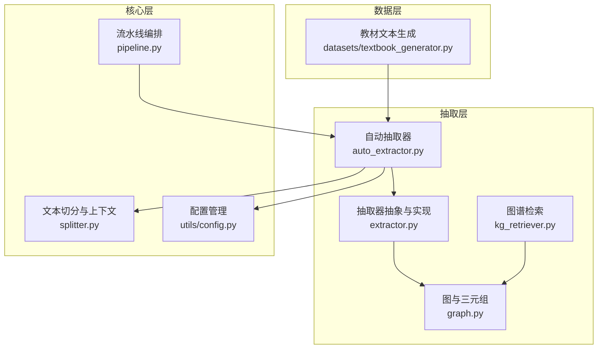
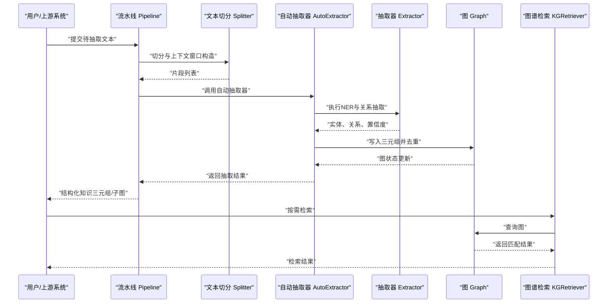
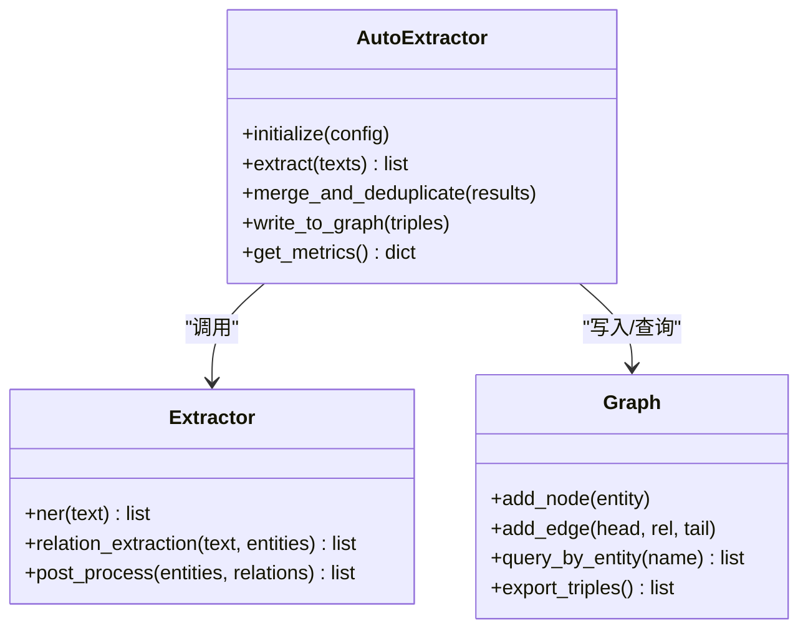
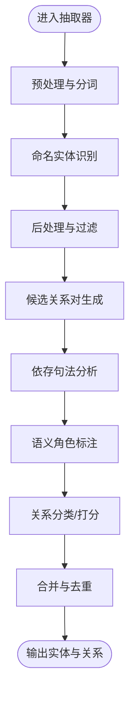
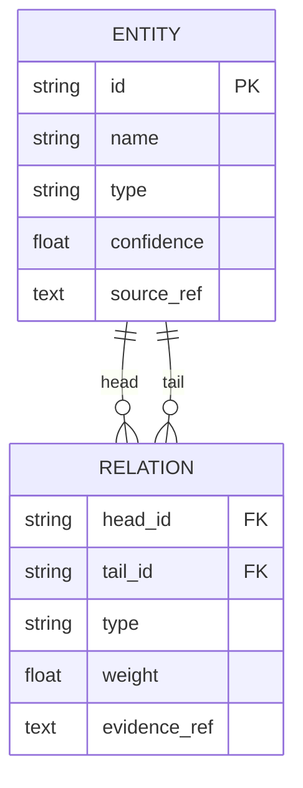
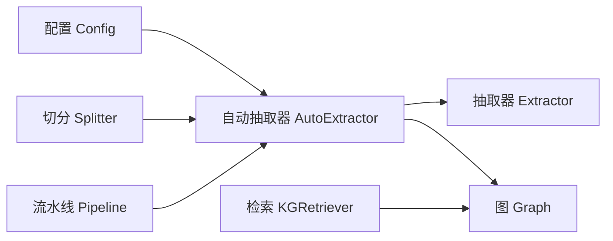

# 实体与关系抽取

<cite>
**本文引用的文件**   
- [src/kag_pro/kg/auto_extractor.py](file://src/kag_pro/kg/auto_extractor.py)
- [src/kag_pro/kg/extractor.py](file://src/kag_pro/kg/extractor.py)
- [src/kag_pro/kg/graph.py](file://src/kag_pro/kg/graph.py)
- [src/kag_pro/kg/kg_retriever.py](file://src/kag_pro/kg/kg_retriever.py)
- [src/kag_pro/core/pipeline.py](file://src/kag_pro/core/pipeline.py)
- [src/kag_pro/core/splitter.py](file://src/kag_pro/core/splitter.py)
- [src/kag_pro/utils/config.py](file://src/kag_pro/utils/config.py)
- [src/kag_pro/datasets/textbook_generator.py](file://src/kag_pro/datasets/textbook_generator.py)
- [README.md](file://README.md)
</cite>

## 目录
1. [简介](#简介)
2. [项目结构](#项目结构)
3. [核心组件](#核心组件)
4. [架构总览](#架构总览)
5. [详细组件分析](#详细组件分析)
6. [依赖分析](#依赖分析)
7. [性能考虑](#性能考虑)
8. [故障排查指南](#故障排查指南)
9. [结论](#结论)
10. [附录](#附录)

## 简介
本技术文档聚焦于KAG-Pro的实体与关系抽取模块，目标是系统化阐述从教育类文本到结构化知识（三元组）的转换流程。内容覆盖：
- 预处理、分词策略与上下文分析
- 命名实体识别（NER）算法实现要点（模型选择、特征工程、后处理）
- 关系提取机制（关系类型定义、依存句法分析与语义角色标注思路）
- 实体消歧与实体链接（候选排序与置信度计算）
- 抽取器配置项与参数调优指南
- 面向不同类型教育文本的处理示例（以路径引用代替代码片段）
- 抽取质量评估方法与错误处理策略

## 项目结构
围绕实体与关系抽取相关的关键目录与文件如下：
- kg：抽取与图谱构建核心逻辑
  - auto_extractor.py：自动抽取管线编排
  - extractor.py：抽取器抽象与具体实现
  - graph.py：图结构与三元组管理
  - kg_retriever.py：基于图的检索接口
- core：通用流水线与文本切分
  - pipeline.py：任务流水线编排
  - splitter.py：文本分段与上下文窗口
- utils：配置与工具
  - config.py：全局配置加载与校验
- datasets：数据生成与样例
  - textbook_generator.py：教材文本生成与组织

图表来源
- [src/kag_pro/kg/auto_extractor.py](file://src/kag_pro/kg/auto_extractor.py)
- [src/kag_pro/kg/extractor.py](file://src/kag_pro/kg/extractor.py)
- [src/kag_pro/kg/graph.py](file://src/kag_pro/kg/graph.py)
- [src/kag_pro/kg/kg_retriever.py](file://src/kag_pro/kg/kg_retriever.py)
- [src/kag_pro/core/pipeline.py](file://src/kag_pro/core/pipeline.py)
- [src/kag_pro/core/splitter.py](file://src/kag_pro/core/splitter.py)
- [src/kag_pro/utils/config.py](file://src/kag_pro/utils/config.py)
- [src/kag_pro/datasets/textbook_generator.py](file://src/kag_pro/datasets/textbook_generator.py)

章节来源
- [README.md](file://README.md)
- [src/kag_pro/kg/auto_extractor.py](file://src/kag_pro/kg/auto_extractor.py)
- [src/kag_pro/kg/extractor.py](file://src/kag_pro/kg/extractor.py)
- [src/kag_pro/kg/graph.py](file://src/kag_pro/kg/graph.py)
- [src/kag_pro/kg/kg_retriever.py](file://src/kag_pro/kg/kg_retriever.py)
- [src/kag_pro/core/pipeline.py](file://src/kag_pro/core/pipeline.py)
- [src/kag_pro/core/splitter.py](file://src/kag_pro/core/splitter.py)
- [src/kag_pro/utils/config.py](file://src/kag_pro/utils/config.py)
- [src/kag_pro/datasets/textbook_generator.py](file://src/kag_pro/datasets/textbook_generator.py)

## 核心组件
- 自动抽取器（AutoExtractor）
  - 职责：编排预处理、分词、上下文窗口、NER、关系抽取、实体消歧/链接、三元组装入图、结果输出等阶段；提供统一入口与可插拔策略。
  - 关键能力：多阶段流水线、失败重试与降级、指标收集与日志记录。
- 抽取器（Extractor）
  - 职责：封装NER与关系抽取的具体实现；暴露标准化输入输出契约；支持多种模型或规则策略切换。
- 图（Graph）
  - 职责：维护节点与边（三元组），提供增删改查、去重、聚合、导出等能力。
- 图谱检索（KGRetriever）
  - 职责：基于图结构的查询与检索，支持按实体、关系、子图等多维检索。
- 流水线（Pipeline）
  - 职责：将抽取器与其他核心组件（如切分器、嵌入器、验证器等）组合为端到端流程。
- 文本切分（Splitter）
  - 职责：长文本切分为段落/句子级片段，构造上下文窗口，保证跨段落的实体与关系不丢失。
- 配置（Config）
  - 职责：集中管理抽取器、模型、阈值、并行度、存储等参数，并提供默认值与校验。

章节来源
- [src/kag_pro/kg/auto_extractor.py](file://src/kag_pro/kg/auto_extractor.py)
- [src/kag_pro/kg/extractor.py](file://src/kag_pro/kg/extractor.py)
- [src/kag_pro/kg/graph.py](file://src/kag_pro/kg/graph.py)
- [src/kag_pro/kg/kg_retriever.py](file://src/kag_pro/kg/kg_retriever.py)
- [src/kag_pro/core/pipeline.py](file://src/kag_pro/core/pipeline.py)
- [src/kag_pro/core/splitter.py](file://src/kag_pro/core/splitter.py)
- [src/kag_pro/utils/config.py](file://src/kag_pro/utils/config.py)

## 架构总览
下图展示了从原始教育文本到结构化知识的端到端流程，以及各组件之间的交互关系。

图表来源
- [src/kag_pro/core/pipeline.py](file://src/kag_pro/core/pipeline.py)
- [src/kag_pro/core/splitter.py](file://src/kag_pro/core/splitter.py)
- [src/kag_pro/kg/auto_extractor.py](file://src/kag_pro/kg/auto_extractor.py)
- [src/kag_pro/kg/extractor.py](file://src/kag_pro/kg/extractor.py)
- [src/kag_pro/kg/graph.py](file://src/kag_pro/kg/graph.py)
- [src/kag_pro/kg/kg_retriever.py](file://src/kag_pro/kg/kg_retriever.py)

## 详细组件分析

### 自动抽取器（AutoExtractor）
- 设计要点
  - 阶段化编排：预处理→分词→上下文→NER→关系抽取→实体消歧/链接→图写入→结果汇总。
  - 可插拔策略：通过配置切换不同抽取器实现（例如规则型、模型型）。
  - 健壮性：异常捕获、重试、降级（回退到更保守的策略）、指标统计。
- 关键方法（概念说明）
  - 初始化：加载配置、注册抽取器、准备上下文窗口。
  - 抽取：对每个文本片段执行NER与关系抽取，合并结果，去重与冲突解决。
  - 输出：返回三元组集合及元信息（来源片段、置信度、时间戳等）。
- 与上下游集成
  - 上游：流水线负责调度与批处理。
  - 下游：图组件持久化三元组；检索组件提供查询能力。

图表来源
- [src/kag_pro/kg/auto_extractor.py](file://src/kag_pro/kg/auto_extractor.py)
- [src/kag_pro/kg/extractor.py](file://src/kag_pro/kg/extractor.py)
- [src/kag_pro/kg/graph.py](file://src/kag_pro/kg/graph.py)

章节来源
- [src/kag_pro/kg/auto_extractor.py](file://src/kag_pro/kg/auto_extractor.py)
- [src/kag_pro/kg/extractor.py](file://src/kag_pro/kg/extractor.py)
- [src/kag_pro/kg/graph.py](file://src/kag_pro/kg/graph.py)

### 抽取器（Extractor）
- NER实现要点
  - 模型选择：支持预训练序列标注模型或轻量规则模型；可通过配置切换。
  - 特征工程：词性、形态、词典先验、领域术语表、上下文窗口特征。
  - 后处理逻辑：边界修正、重叠实体合并、类别映射、置信度阈值过滤。
- 关系抽取实现要点
  - 关系类型定义：在配置中声明关系标签集，支持层级与互斥约束。
  - 依存句法分析：利用依存弧与路径启发式筛选候选头尾实体对。
  - 语义角色标注：识别谓词-论元结构，辅助判定关系方向与角色。
  - 分类策略：基于序列标注、二元分类或端到端模型；结合规则与模型融合。
- 输出规范
  - 实体：文本片段、起始/结束位置、类型、置信度。
  - 关系：头实体、尾实体、关系类型、置信度、证据片段。

图表来源
- [src/kag_pro/kg/extractor.py](file://src/kag_pro/kg/extractor.py)

章节来源
- [src/kag_pro/kg/extractor.py](file://src/kag_pro/kg/extractor.py)

### 图（Graph）
- 数据结构
  - 节点：实体ID、名称、类型、属性、置信度、来源片段索引。
  - 边：头实体ID、尾实体ID、关系类型、权重/置信度、证据片段索引。
- 操作
  - 添加/删除节点与边，支持幂等与去重。
  - 查询：按实体名、类型、关系类型、子图范围检索。
  - 导出：批量导出三元组，支持JSON/CSV等格式。
- 一致性保障
  - 事务性写入、冲突检测与合并策略（如取最高置信度）。

图表来源
- [src/kag_pro/kg/graph.py](file://src/kag_pro/kg/graph.py)

章节来源
- [src/kag_pro/kg/graph.py](file://src/kag_pro/kg/graph.py)

### 图谱检索（KGRetriever）
- 功能
  - 基于实体/关系的快速检索，支持模糊匹配与同义词扩展。
  - 子图检索：给定种子实体，返回k-hop邻域。
- 与图组件协作
  - 读取图结构，缓存热点查询结果，提升响应速度。

章节来源
- [src/kag_pro/kg/kg_retriever.py](file://src/kag_pro/kg/kg_retriever.py)

### 流水线（Pipeline）
- 编排
  - 将文本切分、抽取、图写入、检索串联成端到端流程。
  - 支持批处理、并发控制与进度回调。
- 容错
  - 单条失败不影响整体批次；记录失败原因与重试次数。

章节来源
- [src/kag_pro/core/pipeline.py](file://src/kag_pro/core/pipeline.py)

### 文本切分（Splitter）
- 策略
  - 按段落/句子切分，保留标题与编号信息。
  - 滑动窗口与重叠区域，确保跨段落的实体与关系不被割裂。
- 上下文增强
  - 为每个片段附加前后若干片段作为上下文，提高关系抽取准确率。

章节来源
- [src/kag_pro/core/splitter.py](file://src/kag_pro/core/splitter.py)

### 配置（Config）
- 管理范围
  - 抽取器策略、模型路径、阈值、并行度、图存储后端、日志级别等。
- 校验与默认值
  - 必填字段校验、类型检查、合理范围限制；提供默认值便于快速上手。

章节来源
- [src/kag_pro/utils/config.py](file://src/kag_pro/utils/config.py)

### 数据与样例（Textbook Generator）
- 作用
  - 生成/整理教育类教材文本，用于演示与测试抽取流程。
- 使用方式
  - 通过配置指定数据源路径，由流水线读取并送入抽取器。

章节来源
- [src/kag_pro/datasets/textbook_generator.py](file://src/kag_pro/datasets/textbook_generator.py)

## 依赖分析
- 内部依赖
  - AutoExtractor依赖Extractor、Graph、Splitter、Config。
  - Pipeline编排AutoExtractor与Splitter，并与Graph/KGRetriever交互。
- 外部依赖（概念）
  - 分词/句法/语义角色标注工具库（可选，取决于抽取器实现）。
  - 向量/图数据库（可选，取决于Graph实现）。

图表来源
- [src/kag_pro/utils/config.py](file://src/kag_pro/utils/config.py)
- [src/kag_pro/core/splitter.py](file://src/kag_pro/core/splitter.py)
- [src/kag_pro/kg/auto_extractor.py](file://src/kag_pro/kg/auto_extractor.py)
- [src/kag_pro/kg/extractor.py](file://src/kag_pro/kg/extractor.py)
- [src/kag_pro/kg/graph.py](file://src/kag_pro/kg/graph.py)
- [src/kag_pro/kg/kg_retriever.py](file://src/kag_pro/kg/kg_retriever.py)
- [src/kag_pro/core/pipeline.py](file://src/kag_pro/core/pipeline.py)

章节来源
- [src/kag_pro/kg/auto_extractor.py](file://src/kag_pro/kg/auto_extractor.py)
- [src/kag_pro/kg/extractor.py](file://src/kag_pro/kg/extractor.py)
- [src/kag_pro/kg/graph.py](file://src/kag_pro/kg/graph.py)
- [src/kag_pro/kg/kg_retriever.py](file://src/kag_pro/kg/kg_retriever.py)
- [src/kag_pro/core/pipeline.py](file://src/kag_pro/core/pipeline.py)
- [src/kag_pro/core/splitter.py](file://src/kag_pro/core/splitter.py)
- [src/kag_pro/utils/config.py](file://src/kag_pro/utils/config.py)

## 性能考虑
- 批处理与并发
  - 对文本片段进行批处理，合理设置并发度，避免内存峰值过高。
- 上下文窗口优化
  - 根据领域特点调整窗口大小与重叠比例，平衡召回与延迟。
- 模型与规则融合
  - 高置信度直接落库，低置信度走规则或二次校验，减少无效计算。
- 图写入优化
  - 批量写入与去重合并，降低I/O开销。
- 缓存与索引
  - 对高频实体与关系建立缓存，缩短查询时延。

[本节为通用指导，无需特定文件来源]

## 故障排查指南
- 常见问题定位
  - 分词异常：检查分词器配置与文本编码，确认标点与特殊符号处理。
  - NER漏检/误检：调整置信度阈值、扩充领域词典、增加上下文窗口。
  - 关系抽取不稳定：检查依存句法与语义角色标注工具的可用性，必要时回退到规则策略。
  - 图写入失败：确认图存储后端连通性与权限，查看去重与冲突合并日志。
- 日志与指标
  - 记录每阶段耗时、成功率、失败原因；统计实体/关系F1近似指标（基于抽样人工标注）。
- 恢复策略
  - 失败重试与指数退避；关键步骤失败时降级到保守模式，保证主流程可用。

章节来源
- [src/kag_pro/kg/auto_extractor.py](file://src/kag_pro/kg/auto_extractor.py)
- [src/kag_pro/kg/extractor.py](file://src/kag_pro/kg/extractor.py)
- [src/kag_pro/kg/graph.py](file://src/kag_pro/kg/graph.py)
- [src/kag_pro/core/pipeline.py](file://src/kag_pro/core/pipeline.py)

## 结论
KAG-Pro的实体与关系抽取模块通过清晰的流水线编排与模块化设计，实现了从教育文本到结构化知识的高效转换。其优势在于：
- 可插拔的抽取策略与稳健的后处理逻辑
- 丰富的上下文与句法/语义信息利用
- 灵活的配置与参数调优空间
- 完善的图管理与检索能力

建议在生产环境中结合领域语料持续优化阈值与规则，并建立定期评估与回归测试机制，以保证抽取质量的稳定性与可演进性。

[本节为总结性内容，无需特定文件来源]

## 附录

### 配置选项与参数调优指南
- 抽取器策略
  - 选择规则型或模型型抽取器；模型型需配置模型路径与设备。
- 阈值与数量
  - 实体置信度阈值、关系置信度阈值、Top-K候选实体数。
- 上下文窗口
  - 窗口长度、重叠比例；针对长文档可适当增大窗口。
- 依存与语义标注
  - 启用/停用依存句法与语义角色标注；若外部工具不可用，回退到规则策略。
- 并发与批大小
  - 根据资源情况调整并发度与批大小，避免OOM。
- 图存储
  - 选择本地内存图或持久化图存储；开启批量写入与去重。

章节来源
- [src/kag_pro/utils/config.py](file://src/kag_pro/utils/config.py)
- [src/kag_pro/kg/auto_extractor.py](file://src/kag_pro/kg/auto_extractor.py)

### 处理不同类型教育文本的示例（路径引用）
- 初中数学（代数与几何）
  - 数据源参考：[src/kag_pro/datasets/textbooks/gen_mid_mat_*.txt](file://src/kag_pro/datasets/textbooks/gen_mid_mat_01.txt)
  - 关注点：公式、定理、例题中的实体与关系；适当增大上下文窗口。
- 高中物理（力学与电磁学）
  - 数据源参考：[src/kag_pro/datasets/textbooks/gen_hig_phy_*.txt](file://src/kag_pro/datasets/textbooks/gen_hig_phy_01.txt)
  - 关注点：物理量、定律、实验条件；启用依存与语义标注以提升关系准确性。
- 初中化学（物质与反应）
  - 数据源参考：[src/kag_pro/datasets/textbooks/gen_mid_che_*.txt](file://src/kag_pro/datasets/textbooks/gen_mid_che_01.txt)
  - 关注点：化学式、反应方程式；注意同义表达与缩写消歧。
- 高中生物（细胞与遗传）
  - 数据源参考：[src/kag_pro/datasets/textbooks/gen_hig_bio_*.txt](file://src/kag_pro/datasets/textbooks/gen_hig_bio_01.txt)
  - 关注点：专业术语密集；扩充领域词典与实体消歧规则。

章节来源
- [src/kag_pro/datasets/textbook_generator.py](file://src/kag_pro/datasets/textbook_generator.py)

### 抽取质量评估方法与错误处理策略
- 评估方法
  - 抽样标注：随机抽取一定比例的片段进行人工标注，计算实体与关系F1。
  - 一致性检验：对比不同策略（规则/模型）的结果差异，定位不稳定场景。
  - 回溯分析：对错误案例进行根因分析，迭代优化阈值与规则。
- 错误处理
  - 分级错误：致命错误中断流程，非致命错误记录并继续。
  - 降级策略：当外部工具不可用时，自动切换到规则抽取。
  - 重试机制：网络或I/O失败采用指数退避重试。

章节来源
- [src/kag_pro/kg/auto_extractor.py](file://src/kag_pro/kg/auto_extractor.py)
- [src/kag_pro/core/pipeline.py](file://src/kag_pro/core/pipeline.py)