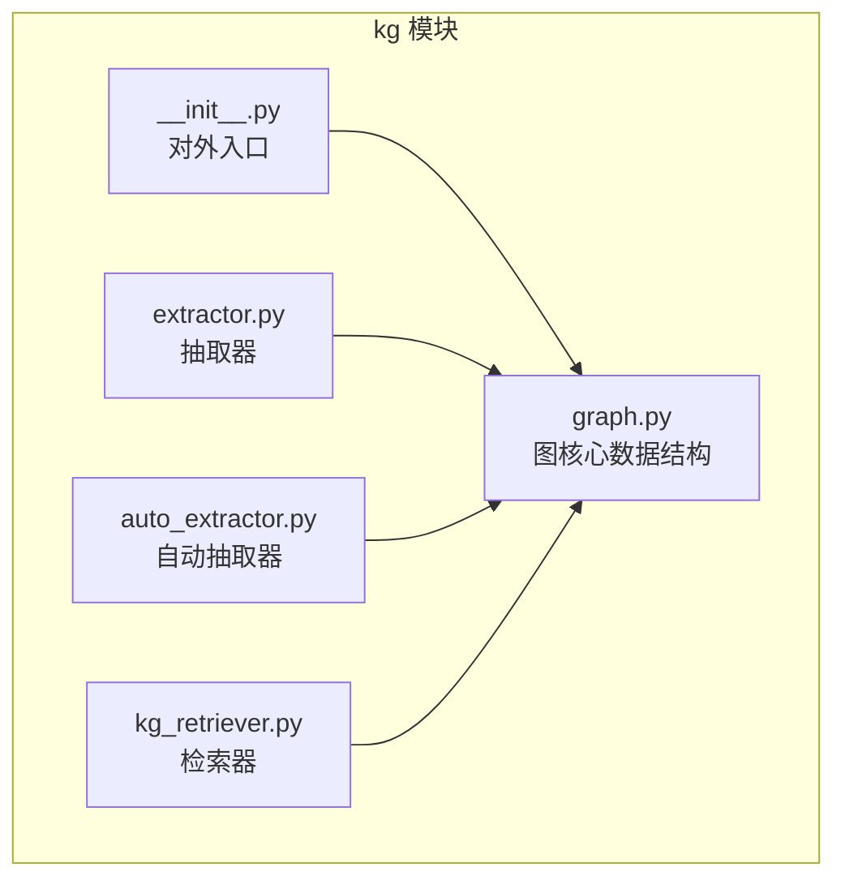
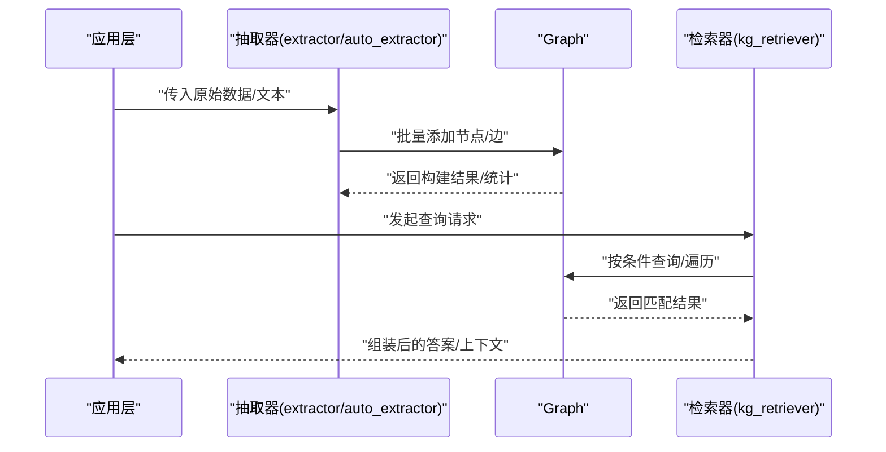
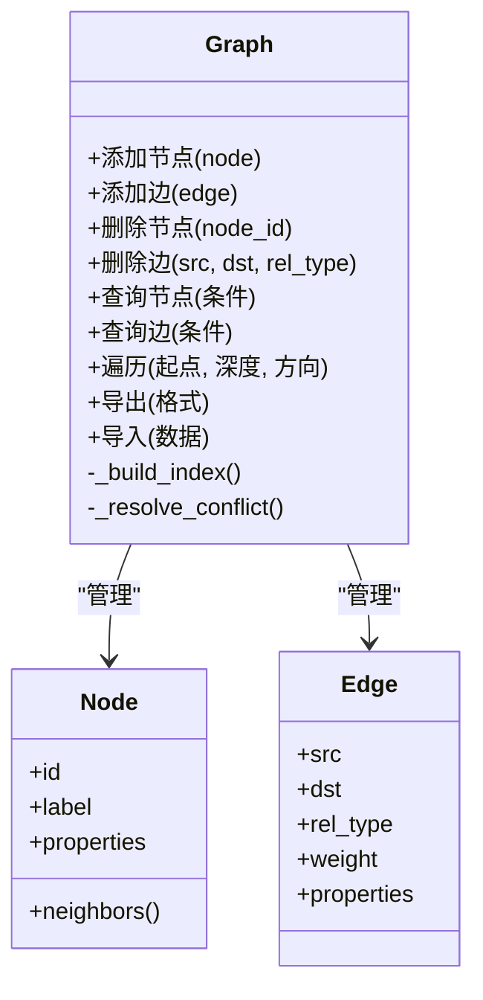
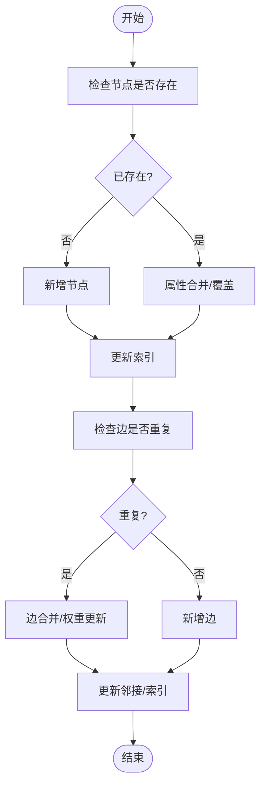
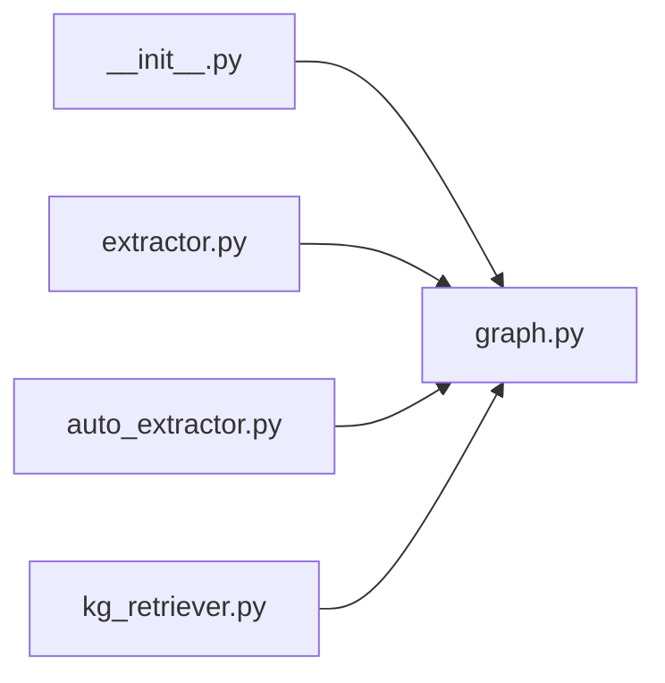

# 知识图谱核心数据结构

<cite>
**本文引用的文件**   
- [src/kag_pro/kg/graph.py](file://src/kag_pro/kg/graph.py)
- [src/kag_pro/kg/__init__.py](file://src/kag_pro/kg/__init__.py)
- [src/kag_pro/kg/extractor.py](file://src/kag_pro/kg/extractor.py)
- [src/kag_pro/kg/auto_extractor.py](file://src/kag_pro/kg/auto_extractor.py)
- [src/kag_pro/kg/kg_retriever.py](file://src/kag_pro/kg/kg_retriever.py)
</cite>

## 目录
1. [简介](#简介)
2. [项目结构](#项目结构)
3. [核心组件](#核心组件)
4. [架构总览](#架构总览)
5. [详细组件分析](#详细组件分析)
6. [依赖关系分析](#依赖关系分析)
7. [性能考虑](#性能考虑)
8. [故障排查指南](#故障排查指南)
9. [结论](#结论)
10. [附录](#附录)

## 简介
本技术文档聚焦于KAG-Pro中知识图谱的核心数据结构与实现，围绕Graph类及其内部节点(Node)、边(Edge)的数据模型展开，系统阐述实体属性管理、关系类型定义、索引策略、构建算法（添加节点、建立关系、冲突解决）、存储格式与序列化机制、核心API（查询、遍历、批量操作），并给出性能优化与内存管理最佳实践。文档力求在保持技术深度的同时，提供清晰的图示与可操作的指导，帮助读者快速理解与高效使用。

## 项目结构
与知识图谱相关的代码主要位于src/kag_pro/kg目录下，包含图数据结构的实现、抽取器、检索器等模块：
- graph.py：图的核心数据结构与操作API
- extractor.py / auto_extractor.py：从文本或结构化输入中提取三元组并构建图的流程
- kg_retriever.py：基于图的检索接口
- __init__.py：对外暴露的公共入口

图表来源
- [src/kag_pro/kg/graph.py](file://src/kag_pro/kg/graph.py)
- [src/kag_pro/kg/extractor.py](file://src/kag_pro/kg/extractor.py)
- [src/kag_pro/kg/auto_extractor.py](file://src/kag_pro/kg/auto_extractor.py)
- [src/kag_pro/kg/kg_retriever.py](file://src/kag_pro/kg/kg_retriever.py)
- [src/kag_pro/kg/__init__.py](file://src/kag_pro/kg/__init__.py)

章节来源
- [src/kag_pro/kg/graph.py](file://src/kag_pro/kg/graph.py)
- [src/kag_pro/kg/__init__.py](file://src/kag_pro/kg/__init__.py)

## 核心组件
本节概述Graph、Node、Edge三类核心对象及其职责：
- Graph：维护全局节点与边的集合，提供增删改查、遍历、索引与持久化等能力
- Node：表示实体节点，承载唯一标识、标签、属性字典及邻接信息
- Edge：表示关系边，承载源节点、目标节点、关系类型、权重/置信度、属性等

这些组件共同构成知识图谱的内存表示，支撑上层抽取与检索流程。

章节来源
- [src/kag_pro/kg/graph.py](file://src/kag_pro/kg/graph.py)

## 架构总览
下图展示知识图谱在系统中的位置与交互关系：抽取器将原始数据转换为三元组，写入Graph；检索器通过Graph提供的查询与遍历接口进行召回与推理。

图表来源
- [src/kag_pro/kg/extractor.py](file://src/kag_pro/kg/extractor.py)
- [src/kag_pro/kg/auto_extractor.py](file://src/kag_pro/kg/auto_extractor.py)
- [src/kag_pro/kg/graph.py](file://src/kag_pro/kg/graph.py)
- [src/kag_pro/kg/kg_retriever.py](file://src/kag_pro/kg/kg_retriever.py)

## 详细组件分析

### Graph类设计
Graph是知识图谱的容器与调度中心，负责：
- 节点与边的生命周期管理（创建、更新、删除）
- 多索引维护（如按标签、属性键值、关系类型等）
- 遍历与路径搜索（BFS/DFS、k跳邻居、子图提取）
- 冲突检测与合并（同构节点识别、属性覆盖策略）
- 序列化与反序列化（内存到磁盘的持久化）

关键设计要点：
- 节点唯一性：通常以“标签+主键”或“全局ID”作为唯一约束
- 边多重性：允许重边时需提供去重键（如源-目标-关系类型-时间戳）
- 索引粒度：根据查询热点选择细粒度索引（属性级、关系级、标签级）
- 事务性：批量操作支持回滚或一致性快照

图表来源
- [src/kag_pro/kg/graph.py](file://src/kag_pro/kg/graph.py)

章节来源
- [src/kag_pro/kg/graph.py](file://src/kag_pro/kg/graph.py)

### Node与Edge数据结构
- Node
  - 字段：唯一标识、标签、属性字典、邻接引用
  - 复杂度：属性访问O(1)，邻居枚举O(degree)
- Edge
  - 字段：源节点、目标节点、关系类型、权重/置信度、属性
  - 复杂度：按类型过滤O(1~logN)取决于索引

建议：
- 对高频查询的属性建立倒排索引
- 对大度数节点采用惰性加载邻居列表
- 对边属性采用稀疏存储以减少内存占用

章节来源
- [src/kag_pro/kg/graph.py](file://src/kag_pro/kg/graph.py)

### 实体属性管理与关系类型定义
- 实体属性
  - 支持字符串、数值、布尔、时间戳、JSON等类型
  - 提供类型校验与默认值策略
  - 支持增量更新与版本控制（可选）
- 关系类型
  - 预定义关系类型表，便于可视化与查询优化
  - 支持关系属性（如权重、置信度、时间窗口）

章节来源
- [src/kag_pro/kg/graph.py](file://src/kag_pro/kg/graph.py)

### 索引策略
- 标签索引：快速定位某类实体
- 属性索引：按属性键值快速筛选
- 关系索引：按关系类型或方向（入边/出边）加速遍历
- 复合索引：针对常见查询组合（如“标签+属性”）

权衡：
- 索引提升查询性能但增加写入与内存开销
- 按需启用与动态重建索引

章节来源
- [src/kag_pro/kg/graph.py](file://src/kag_pro/kg/graph.py)

### 图谱构建算法
- 节点添加
  - 存在性检查→冲突处理→插入节点→更新索引
- 关系建立
  - 两端节点存在性验证→重复边检测→插入边→更新邻接与索引
- 冲突解决
  - 同构判定规则（标签+主键）
  - 属性合并策略（覆盖/追加/加权融合）
  - 边冲突（去重键、时间优先、置信度优先）

图表来源
- [src/kag_pro/kg/graph.py](file://src/kag_pro/kg/graph.py)

章节来源
- [src/kag_pro/kg/graph.py](file://src/kag_pro/kg/graph.py)

### 存储格式与序列化机制
- 内存表示
  - 节点/边对象集合，配合哈希表与邻接表
- 持久化格式
  - 支持JSON/二进制等格式
  - 元数据（schema、索引配置、版本）与数据分离
- 序列化工具
  - 导出：图快照、子图导出、增量变更导出
  - 导入：全量导入、增量合并、冲突策略选择

章节来源
- [src/kag_pro/kg/graph.py](file://src/kag_pro/kg/graph.py)

### 核心API文档
- 节点操作
  - 添加节点：参数包括标签、主键、属性；返回节点ID
  - 更新属性：按节点ID更新指定字段
  - 删除节点：级联删除关联边（可选）
- 边操作
  - 添加边：源/目标、关系类型、权重、属性；返回边ID
  - 更新边：修改权重/属性
  - 删除边：按四元组或边ID
- 查询接口
  - 按条件筛选节点/边
  - 按标签/属性/关系类型检索
  - 子图提取（k跳邻居）
- 遍历算法
  - BFS/DFS
  - 最短路径（无权/有权）
  - 连通分量统计
- 批量操作
  - 批量导入/导出
  - 事务性提交与回滚

章节来源
- [src/kag_pro/kg/graph.py](file://src/kag_pro/kg/graph.py)

### 使用示例（步骤说明）
以下为典型操作流程的步骤说明（不直接展示代码内容）：
- 创建图谱实例
- 批量导入节点与边（含冲突策略）
- 为常用查询字段建立索引
- 执行查询与遍历
- 导出图谱快照

章节来源
- [src/kag_pro/kg/graph.py](file://src/kag_pro/kg/graph.py)

## 依赖关系分析
下图展示kg模块内各文件的依赖关系：

图表来源
- [src/kag_pro/kg/__init__.py](file://src/kag_pro/kg/__init__.py)
- [src/kag_pro/kg/graph.py](file://src/kag_pro/kg/graph.py)
- [src/kag_pro/kg/extractor.py](file://src/kag_pro/kg/extractor.py)
- [src/kag_pro/kg/auto_extractor.py](file://src/kag_pro/kg/auto_extractor.py)
- [src/kag_pro/kg/kg_retriever.py](file://src/kag_pro/kg/kg_retriever.py)

章节来源
- [src/kag_pro/kg/__init__.py](file://src/kag_pro/kg/__init__.py)
- [src/kag_pro/kg/graph.py](file://src/kag_pro/kg/graph.py)
- [src/kag_pro/kg/extractor.py](file://src/kag_pro/kg/extractor.py)
- [src/kag_pro/kg/auto_extractor.py](file://src/kag_pro/kg/auto_extractor.py)
- [src/kag_pro/kg/kg_retriever.py](file://src/kag_pro/kg/kg_retriever.py)

## 性能考虑
- 索引与查询
  - 针对热点查询建立复合索引
  - 避免过度索引导致写入放大
- 内存管理
  - 大度数节点的邻接表懒加载
  - 属性压缩与稀疏存储
- 批量与并发
  - 批量写入减少索引重建次数
  - 读写分离与只读副本
- 序列化
  - 分块导出/导入，避免一次性加载大图
  - 增量持久化降低IO压力

[本节为通用性能建议，无需特定文件来源]

## 故障排查指南
- 常见问题
  - 节点重复：检查唯一键策略与冲突合并逻辑
  - 边缺失：确认两端节点存在性与关系类型映射
  - 查询缓慢：评估索引命中与遍历范围
- 诊断方法
  - 打印图规模统计（节点/边数量、平均度数）
  - 导出子图用于离线分析
  - 记录关键操作的耗时与异常堆栈

章节来源
- [src/kag_pro/kg/graph.py](file://src/kag_pro/kg/graph.py)

## 结论
Graph、Node、Edge构成了KAG-Pro知识图谱的核心骨架。通过合理的索引策略、稳健的冲突解决与高效的序列化机制，系统能够在保证一致性的前提下提供高性能的构建、查询与遍历能力。结合抽取器与检索器的协作，形成从数据到知识的完整闭环。

[本节为总结性内容，无需特定文件来源]

## 附录
- 术语
  - 节点：知识图谱中的实体
  - 边：实体间的关系
  - 属性：节点或边的附加信息
  - 索引：加速查询的数据结构
- 参考
  - 相关源码文件见“本文引用的文件”部分

[本节为补充信息，无需特定文件来源]