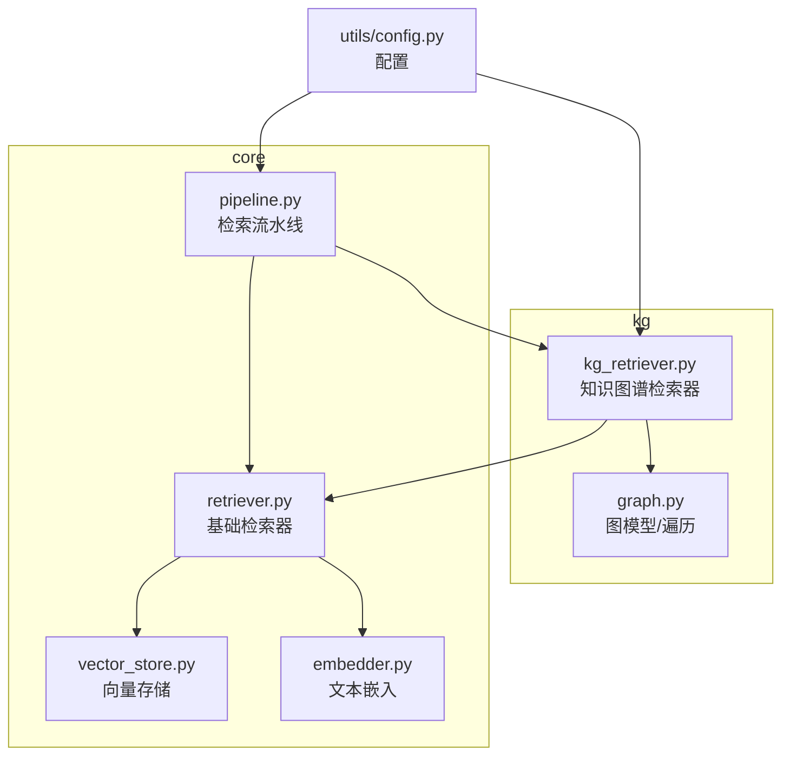
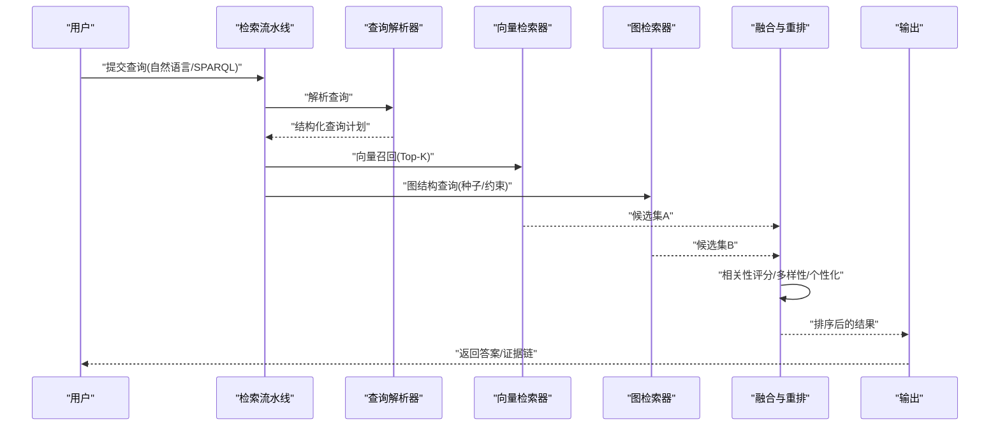
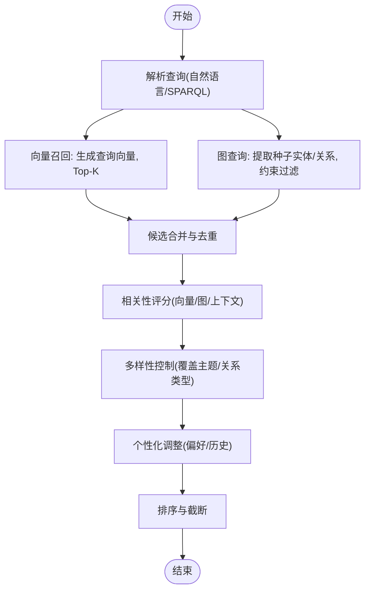
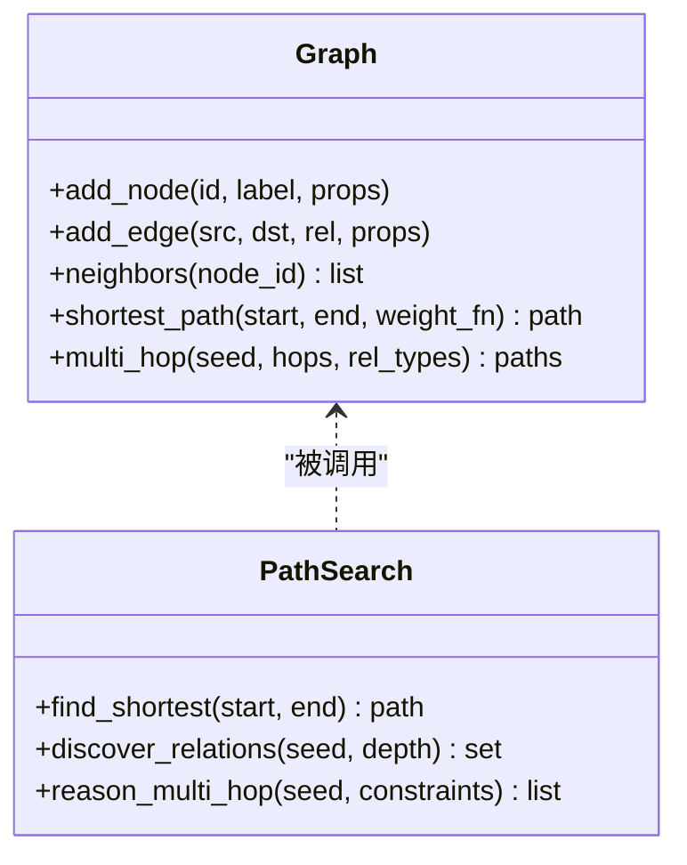
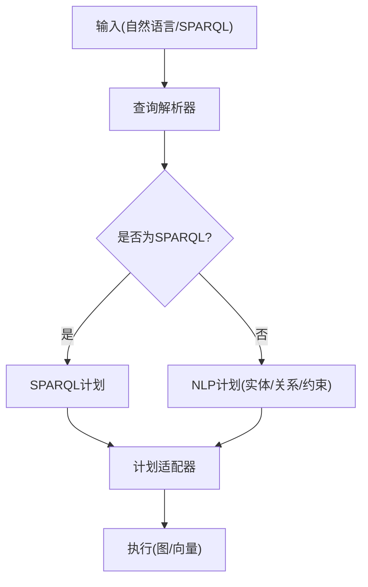
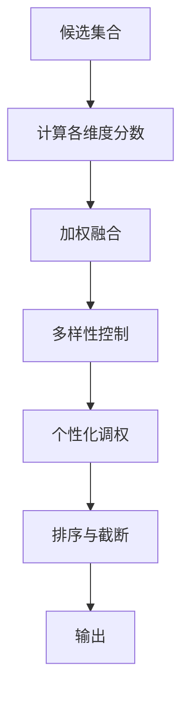
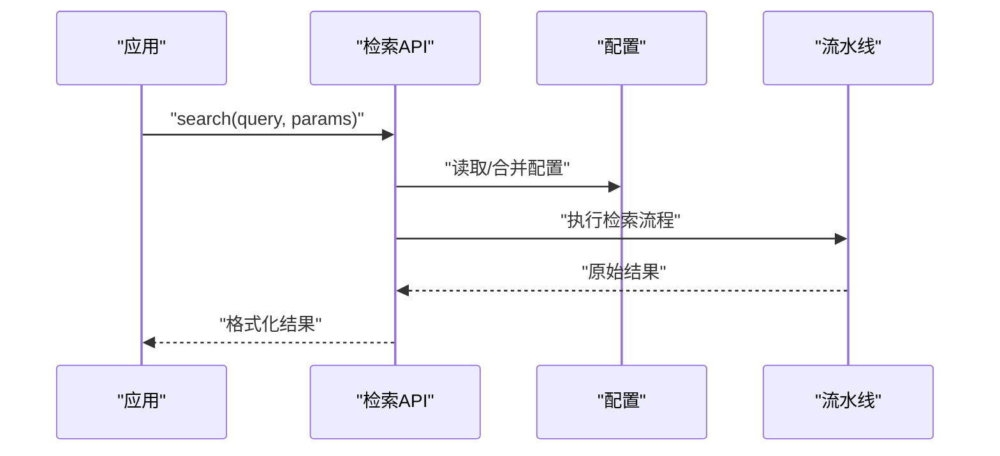
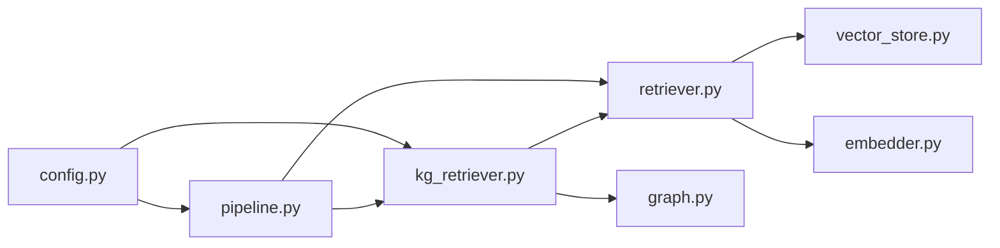

# 知识图谱检索

<cite>
**本文引用的文件**   
- [kg_retriever.py](file://src/kag_pro/kg/kg_retriever.py)
- [graph.py](file://src/kag_pro/kg/graph.py)
- [retriever.py](file://src/kag_pro/core/retriever.py)
- [vector_store.py](file://src/kag_pro/core/vector_store.py)
- [embedder.py](file://src/kag_pro/core/embedder.py)
- [pipeline.py](file://src/kag_pro/core/pipeline.py)
- [config.py](file://src/kag_pro/utils/config.py)
</cite>

## 目录
1. [简介](#简介)
2. [项目结构](#项目结构)
3. [核心组件](#核心组件)
4. [架构总览](#架构总览)
5. [详细组件分析](#详细组件分析)
6. [依赖关系分析](#依赖关系分析)
7. [性能考虑](#性能考虑)
8. [故障排查指南](#故障排查指南)
9. [结论](#结论)
10. [附录](#附录)

## 简介
本技术文档聚焦于 KAG-Pro 的知识图谱检索模块，系统阐述混合检索策略（向量相似度搜索与图结构查询的结合）、路径搜索算法（最短路径、关联发现、多跳推理）、查询语言支持（类 SPARQL 语法与自然语言解析）、结果排序与重排（相关性评分、多样性保证、个性化调整）、检索接口 API（查询构造、参数配置、结果格式化），以及性能优化技巧（索引策略、缓存机制、并行查询）。文档面向不同技术背景的读者，提供从概念到代码级的完整说明。

## 项目结构
知识图谱检索相关代码主要分布在以下模块：
- kg 层：负责知识图谱的构建、存储与检索（图结构与检索器）
- core 层：通用检索基础设施（向量检索、嵌入、流水线编排）
- utils 层：配置管理

图表来源
- [kg_retriever.py:1-200](file://src/kag_pro/kg/kg_retriever.py#L1-L200)
- [graph.py:1-200](file://src/kag_pro/kg/graph.py#L1-L200)
- [retriever.py:1-200](file://src/kag_pro/core/retriever.py#L1-L200)
- [vector_store.py:1-200](file://src/kag_pro/core/vector_store.py#L1-L200)
- [embedder.py:1-200](file://src/kag_pro/core/embedder.py#L1-L200)
- [pipeline.py:1-200](file://src/kag_pro/core/pipeline.py#L1-L200)
- [config.py:1-200](file://src/kag_pro/utils/config.py#L1-L200)

章节来源
- [kg_retriever.py:1-200](file://src/kag_pro/kg/kg_retriever.py#L1-L200)
- [graph.py:1-200](file://src/kag_pro/kg/graph.py#L1-L200)
- [retriever.py:1-200](file://src/kag_pro/core/retriever.py#L1-L200)
- [vector_store.py:1-200](file://src/kag_pro/core/vector_store.py#L1-L200)
- [embedder.py:1-200](file://src/kag_pro/core/embedder.py#L1-L200)
- [pipeline.py:1-200](file://src/kag_pro/core/pipeline.py#L1-L200)
- [config.py:1-200](file://src/kag_pro/utils/config.py#L1-L200)

## 核心组件
- 知识图谱检索器：封装“向量+图”的混合检索流程，协调图遍历与向量召回，并执行结果融合与重排。
- 图模型与遍历：提供节点、边、子图、路径等数据结构与遍历能力，支撑最短路径、关联发现与多跳推理。
- 基础检索器：统一向量检索接口，屏蔽底层向量库差异。
- 向量存储：提供高维向量的增删改查与近似最近邻搜索。
- 文本嵌入：将自然语言或片段映射为向量空间中的点。
- 检索流水线：编排“解析→候选召回→精排→输出”的端到端流程。
- 配置：集中管理检索策略、阈值、权重、并发度等参数。

章节来源
- [kg_retriever.py:1-200](file://src/kag_pro/kg/kg_retriever.py#L1-L200)
- [graph.py:1-200](file://src/kag_pro/kg/graph.py#L1-L200)
- [retriever.py:1-200](file://src/kag_pro/core/retriever.py#L1-L200)
- [vector_store.py:1-200](file://src/kag_pro/core/vector_store.py#L1-L200)
- [embedder.py:1-200](file://src/kag_pro/core/embedder.py#L1-L200)
- [pipeline.py:1-200](file://src/kag_pro/core/pipeline.py#L1-L200)
- [config.py:1-200](file://src/kag_pro/utils/config.py#L1-L200)

## 架构总览
下图展示了混合检索的整体数据流与控制流：用户输入经查询解析后，同时触发向量召回与图结构查询；中间结果在融合阶段进行相关性评分、多样性控制与个性化调整；最终按策略排序输出。

图表来源
- [pipeline.py:1-200](file://src/kag_pro/core/pipeline.py#L1-L200)
- [kg_retriever.py:1-200](file://src/kag_pro/kg/kg_retriever.py#L1-L200)
- [retriever.py:1-200](file://src/kag_pro/core/retriever.py#L1-L200)
- [graph.py:1-200](file://src/kag_pro/kg/graph.py#L1-L200)

## 详细组件分析

### 混合检索策略（向量相似度 + 图结构查询）
- 设计要点
  - 双路召回：向量侧基于语义相似性快速召回候选；图侧基于实体/关系约束精确命中。
  - 联合打分：对候选项计算综合得分，包含向量相似度、图连通性、关系强度、上下文匹配等。
  - 去重与合并：按实体/片段ID归一化，避免重复贡献。
- 关键实现位置
  - 混合检索入口与调度逻辑
  - 向量召回与图召回的参数传递
  - 融合打分函数与可配置权重

图表来源
- [kg_retriever.py:1-200](file://src/kag_pro/kg/kg_retriever.py#L1-L200)
- [retriever.py:1-200](file://src/kag_pro/core/retriever.py#L1-L200)
- [graph.py:1-200](file://src/kag_pro/kg/graph.py#L1-L200)

章节来源
- [kg_retriever.py:1-200](file://src/kag_pro/kg/kg_retriever.py#L1-L200)
- [retriever.py:1-200](file://src/kag_pro/core/retriever.py#L1-L200)
- [graph.py:1-200](file://src/kag_pro/kg/graph.py#L1-L200)

### 路径搜索算法（最短路径、关联发现、多跳推理）
- 最短路径查找
  - 目标：在带权图中寻找两节点间最小代价路径，用于解释“为什么相关”。
  - 复杂度：典型 Dijkstra/BFS 变体，时间复杂度与边数、节点数相关。
- 关联发现
  - 通过固定步长内的邻居扩展，收集潜在关联实体与关系，形成候选证据链。
- 多跳推理
  - 以种子节点为起点，沿关系类型约束进行深度受限的遍历，组合多跳路径作为推理依据。
- 关键实现位置
  - 图遍历与路径枚举
  - 路径评分与剪枝策略
  - 多跳约束与回溯控制

图表来源
- [graph.py:1-200](file://src/kag_pro/kg/graph.py#L1-L200)

章节来源
- [graph.py:1-200](file://src/kag_pro/kg/graph.py#L1-L200)

### 查询语言（类 SPARQL 语法与自然语言解析）
- 类 SPARQL 语法
  - 支持三元组模式匹配、可选模式、聚合与限制条件。
  - 编译为内部查询计划，供图检索器执行。
- 自然语言解析
  - 抽取实体、关系与约束，转换为结构化查询计划。
  - 与向量检索协同：自然语言直接生成查询向量，用于向量召回。
- 关键实现位置
  - 查询解析器与计划生成
  - 自然语言到结构化查询的转换
  - 查询计划到图/向量检索器的适配

图表来源
- [kg_retriever.py:1-200](file://src/kag_pro/kg/kg_retriever.py#L1-L200)

章节来源
- [kg_retriever.py:1-200](file://src/kag_pro/kg/kg_retriever.py#L1-L200)

### 结果排序与重排（相关性评分、多样性、个性化）
- 相关性评分
  - 向量相似度分、图连通性分、关系强度分、上下文匹配分加权求和。
- 多样性保证
  - 基于主题/关系类型的覆盖度惩罚重复，提升结果分布均匀性。
- 个性化调整
  - 结合用户偏好、历史交互、领域权重进行动态调权。
- 关键实现位置
  - 融合打分函数
  - 多样性与个性化策略
  - 排序与截断

图表来源
- [kg_retriever.py:1-200](file://src/kag_pro/kg/kg_retriever.py#L1-L200)

章节来源
- [kg_retriever.py:1-200](file://src/kag_pro/kg/kg_retriever.py#L1-L200)

### 检索接口 API（查询构造、参数配置、结果格式化）
- 查询构造
  - 支持自然语言字符串与结构化查询对象两种形式。
  - 可指定图约束（关系类型、最大跳数）、向量召回数量、阈值等。
- 参数配置
  - 通过配置对象设置混合权重、多样性系数、个性化偏好、并发度等。
- 结果格式化
  - 标准化返回结构：包含答案、证据链、评分明细、元数据。
- 关键实现位置
  - 检索器对外方法签名与参数约定
  - 配置加载与校验
  - 结果序列化与反序列化

图表来源
- [kg_retriever.py:1-200](file://src/kag_pro/kg/kg_retriever.py#L1-L200)
- [pipeline.py:1-200](file://src/kag_pro/core/pipeline.py#L1-L200)
- [config.py:1-200](file://src/kag_pro/utils/config.py#L1-L200)

章节来源
- [kg_retriever.py:1-200](file://src/kag_pro/kg/kg_retriever.py#L1-L200)
- [pipeline.py:1-200](file://src/kag_pro/core/pipeline.py#L1-L200)
- [config.py:1-200](file://src/kag_pro/utils/config.py#L1-L200)

### 复杂多条件查询与关联分析示例（步骤指引）
- 多条件查询
  - 使用结构化查询对象，指定多个关系类型与约束条件，限定最大跳数与最小连通度。
  - 结合向量召回，提高语义匹配的召回率。
- 关联分析
  - 以某实体为种子，执行多跳推理，收集路径与关系证据，输出证据链与评分明细。
- 参考实现位置
  - 查询构造与参数传递
  - 图多跳推理与路径评分
  - 结果格式化与证据链组装

章节来源
- [kg_retriever.py:1-200](file://src/kag_pro/kg/kg_retriever.py#L1-L200)
- [graph.py:1-200](file://src/kag_pro/kg/graph.py#L1-L200)

## 依赖关系分析
- 组件耦合
  - 知识图谱检索器依赖基础检索器与图模型，二者职责清晰，耦合度适中。
  - 向量检索器与嵌入模块解耦，便于替换底层向量库与嵌入模型。
- 外部依赖
  - 向量存储后端（如本地或分布式向量数据库）
  - 图存储/遍历引擎（如内存图或图数据库）
- 循环依赖
  - 当前分层清晰，未见明显循环依赖。

图表来源
- [kg_retriever.py:1-200](file://src/kag_pro/kg/kg_retriever.py#L1-L200)
- [retriever.py:1-200](file://src/kag_pro/core/retriever.py#L1-L200)
- [graph.py:1-200](file://src/kag_pro/kg/graph.py#L1-L200)
- [vector_store.py:1-200](file://src/kag_pro/core/vector_store.py#L1-L200)
- [embedder.py:1-200](file://src/kag_pro/core/embedder.py#L1-L200)
- [pipeline.py:1-200](file://src/kag_pro/core/pipeline.py#L1-L200)
- [config.py:1-200](file://src/kag_pro/utils/config.py#L1-L200)

章节来源
- [kg_retriever.py:1-200](file://src/kag_pro/kg/kg_retriever.py#L1-L200)
- [retriever.py:1-200](file://src/kag_pro/core/retriever.py#L1-L200)
- [graph.py:1-200](file://src/kag_pro/kg/graph.py#L1-L200)
- [vector_store.py:1-200](file://src/kag_pro/core/vector_store.py#L1-L200)
- [embedder.py:1-200](file://src/kag_pro/core/embedder.py#L1-L200)
- [pipeline.py:1-200](file://src/kag_pro/core/pipeline.py#L1-L200)
- [config.py:1-200](file://src/kag_pro/utils/config.py#L1-L200)

## 性能考虑
- 索引策略
  - 向量索引：采用近似最近邻索引（如 HNSW/IVF），平衡召回质量与延迟。
  - 图索引：维护邻接表与关系类型索引，加速邻居查询与多跳遍历。
- 缓存机制
  - 查询结果缓存：对高频查询进行 TTL 缓存，减少重复计算。
  - 嵌入缓存：对稳定文本片段的向量表示进行持久化缓存。
- 并行查询
  - 向量与图召回并行执行，缩短整体时延。
  - 多跳推理阶段按分支并行扩展，配合剪枝控制规模。
- 资源控制
  - 并发度与超时控制，防止雪崩效应。
  - 分页与增量更新，降低批量操作压力。

[本节为通用性能建议，不直接分析具体文件]

## 故障排查指南
- 常见问题
  - 召回为空：检查查询解析是否正确、图约束是否过严、向量阈值是否过高。
  - 结果不相关：调整混合权重、多样性系数与个性化偏好。
  - 延迟过高：增大缓存命中率、降低并发度、优化图遍历深度。
- 定位手段
  - 启用详细日志，记录查询计划、中间候选与评分明细。
  - 监控关键指标：召回率、平均延迟、错误率、缓存命中率。
- 参考实现位置
  - 异常处理与错误码定义
  - 日志与监控埋点

章节来源
- [kg_retriever.py:1-200](file://src/kag_pro/kg/kg_retriever.py#L1-L200)
- [pipeline.py:1-200](file://src/kag_pro/core/pipeline.py#L1-L200)

## 结论
KAG-Pro 的知识图谱检索模块通过“向量+图”的混合检索策略，结合路径搜索与多跳推理，实现了高召回与强解释性的检索体验。其清晰的组件分层、灵活的查询语言支持与可配置的排序重排策略，使其能够适应多样化的业务场景。通过合理的索引、缓存与并行优化，可在保证质量的同时获得良好的性能表现。

## 附录
- 术语
  - 混合检索：同时利用向量相似度与图结构信息进行候选召回与融合。
  - 多跳推理：以种子节点为起点，沿关系约束进行多步遍历，形成推理证据链。
  - 重排：在候选基础上进行相关性、多样性与个性化的再排序。