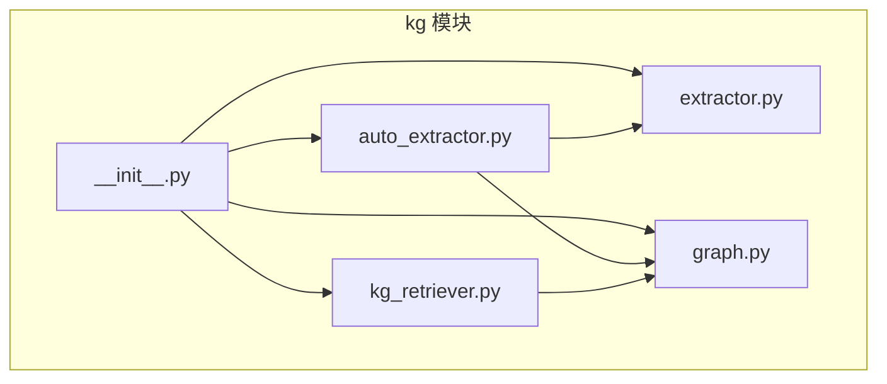
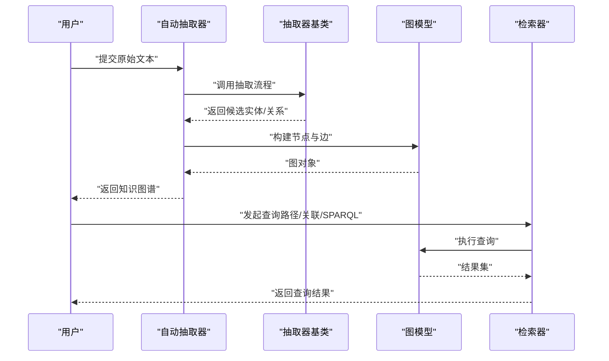
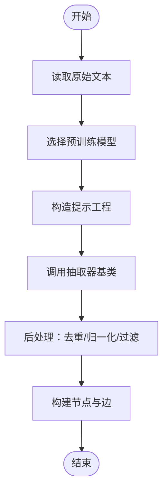
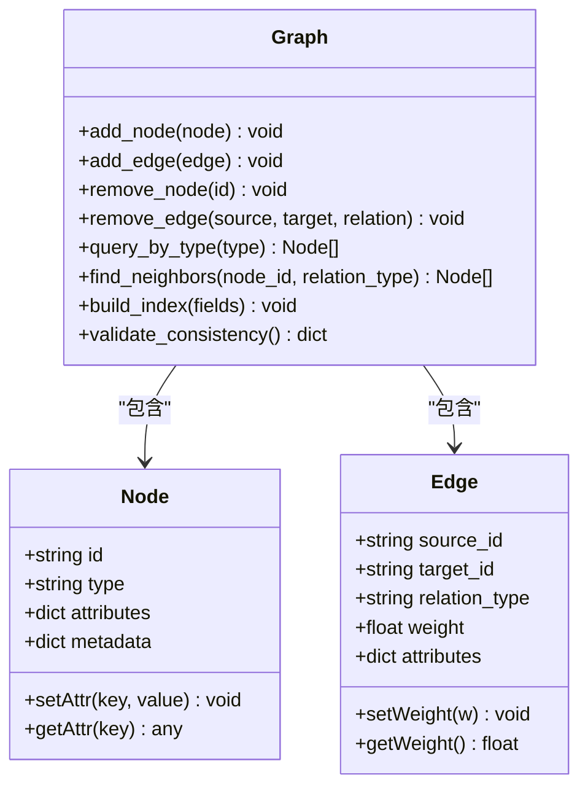
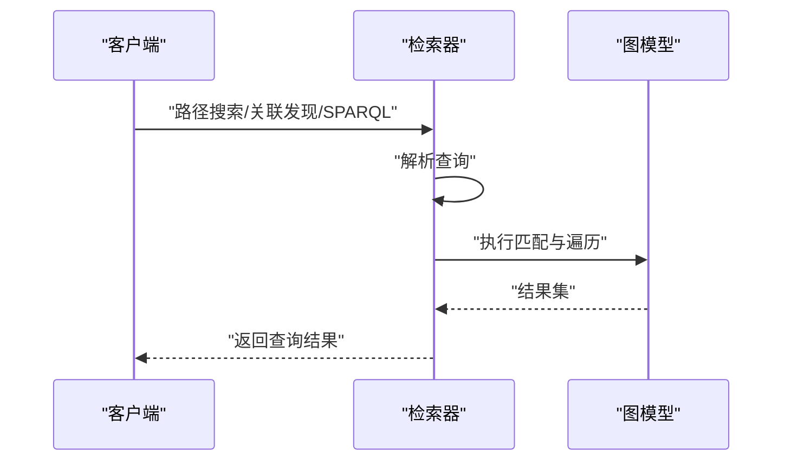
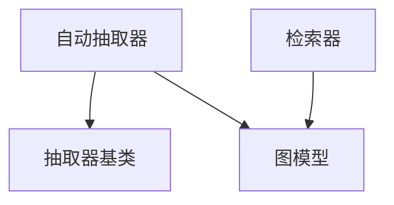

# 知识图谱模块

<cite>
**本文引用的文件**   
- [src/kag_pro/kg/__init__.py](file://src/kag_pro/kg/__init__.py)
- [src/kag_pro/kg/auto_extractor.py](file://src/kag_pro/kg/auto_extractor.py)
- [src/kag_pro/kg/extractor.py](file://src/kag_pro/kg/extractor.py)
- [src/kag_pro/kg/graph.py](file://src/kag_pro/kg/graph.py)
- [src/kag_pro/kg/kg_retriever.py](file://src/kag_pro/kg/kg_retriever.py)
</cite>

## 目录
1. [简介](#简介)
2. [项目结构](#项目结构)
3. [核心组件](#核心组件)
4. [架构总览](#架构总览)
5. [详细组件分析](#详细组件分析)
6. [依赖关系分析](#依赖关系分析)
7. [性能考虑](#性能考虑)
8. [故障排查指南](#故障排查指南)
9. [结论](#结论)
10. [附录](#附录)

## 简介
本技术文档聚焦于 KAG-Pro 的知识图谱（KG）模块，系统性阐述从原始文本到结构化知识的构建流程、实体抽取与关系提取机制、图数据结构设计、自动抽取器工作原理以及查询接口能力。文档面向不同技术背景的读者，既提供高层概览，也给出代码级分析与图示，帮助快速理解并正确使用该模块进行知识图谱的构建、查询与维护。

## 项目结构
知识图谱模块位于 src/kag_pro/kg 目录下，包含以下关键文件：
- __init__.py：模块入口与对外导出
- auto_extractor.py：自动抽取器，封装端到端抽取流水线
- extractor.py：抽取器基类与通用逻辑
- graph.py：图数据模型与基础操作
- kg_retriever.py：知识图谱检索与查询接口

图表来源
- [src/kag_pro/kg/__init__.py](file://src/kag_pro/kg/__init__.py)
- [src/kag_pro/kg/auto_extractor.py](file://src/kag_pro/kg/auto_extractor.py)
- [src/kag_pro/kg/extractor.py](file://src/kag_pro/kg/extractor.py)
- [src/kag_pro/kg/graph.py](file://src/kag_pro/kg/graph.py)
- [src/kag_pro/kg/kg_retriever.py](file://src/kag_pro/kg/kg_retriever.py)

章节来源
- [src/kag_pro/kg/__init__.py](file://src/kag_pro/kg/__init__.py)
- [src/kag_pro/kg/auto_extractor.py](file://src/kag_pro/kg/auto_extractor.py)
- [src/kag_pro/kg/extractor.py](file://src/kag_pro/kg/extractor.py)
- [src/kag_pro/kg/graph.py](file://src/kag_pro/kg/graph.py)
- [src/kag_pro/kg/kg_retriever.py](file://src/kag_pro/kg/kg_retriever.py)

## 核心组件
- 自动抽取器（AutoExtractor）：负责将原始文本输入转换为图节点与边的集合，内部协调预训练模型、提示工程与后处理逻辑。
- 抽取器基类（Extractor）：定义抽取流程的通用接口与公共步骤，便于扩展新的抽取策略。
- 图模型（Graph）：提供节点、边、属性与索引等基础数据结构与操作，支撑增删改查与遍历。
- 检索器（KGRetriever）：提供查询接口，包括路径搜索、关联发现与可能的 SPARQL 支持（视实现而定）。

章节来源
- [src/kag_pro/kg/auto_extractor.py](file://src/kag_pro/kg/auto_extractor.py)
- [src/kag_pro/kg/extractor.py](file://src/kag_pro/kg/extractor.py)
- [src/kag_pro/kg/graph.py](file://src/kag_pro/kg/graph.py)
- [src/kag_pro/kg/kg_retriever.py](file://src/kag_pro/kg/kg_retriever.py)

## 架构总览
下图展示了从原始文本到知识图谱的端到端流程，以及查询阶段的数据流向。

图表来源
- [src/kag_pro/kg/auto_extractor.py](file://src/kag_pro/kg/auto_extractor.py)
- [src/kag_pro/kg/extractor.py](file://src/kag_pro/kg/extractor.py)
- [src/kag_pro/kg/graph.py](file://src/kag_pro/kg/graph.py)
- [src/kag_pro/kg/kg_retriever.py](file://src/kag_pro/kg/kg_retriever.py)

## 详细组件分析

### 自动抽取器（AutoExtractor）
职责与流程
- 接收原始文本，调用抽取器基类的统一接口完成实体与关系的初步抽取。
- 根据配置选择或加载预训练模型，结合提示工程生成结构化输出。
- 对抽取结果进行后处理：去重、规范化、置信度过滤、冲突消解。
- 将结果写入图模型，形成可查询的知识图谱。

关键点
- 预训练模型选择：依据任务领域与资源约束选择合适的模型；在提示工程中注入领域术语与示例以增强稳定性。
- 提示工程：通过模板化提示与上下文约束提升抽取质量，减少幻觉与歧义。
- 后处理逻辑：包含实体归一化、关系类型校验、强度计算与验证策略。

图表来源
- [src/kag_pro/kg/auto_extractor.py](file://src/kag_pro/kg/auto_extractor.py)
- [src/kag_pro/kg/extractor.py](file://src/kag_pro/kg/extractor.py)

章节来源
- [src/kag_pro/kg/auto_extractor.py](file://src/kag_pro/kg/auto_extractor.py)
- [src/kag_pro/kg/extractor.py](file://src/kag_pro/kg/extractor.py)

### 抽取器基类（Extractor）
职责与接口
- 定义抽取流程的标准方法，如预处理、模型推理、结果解析与合并。
- 提供可扩展点，允许子类实现特定领域的抽取策略。
- 管理抽取过程中的中间状态与日志，便于调试与评估。

扩展建议
- 针对命名实体识别（NER）、实体消歧（DEDUP）、实体链接（EL）分别实现专用子类。
- 引入外部知识库或词典以提升链接准确率。

章节来源
- [src/kag_pro/kg/extractor.py](file://src/kag_pro/kg/extractor.py)

### 图模型（Graph）
数据结构
- 节点（Node）：包含唯一标识、类型、属性字典与元数据。
- 边（Edge）：连接两个节点，包含关系类型、权重、方向性与属性。
- 索引（Index）：为常用查询字段建立索引，加速查找与遍历。

操作能力
- 增删改查：添加/删除节点与边，更新属性，批量导入。
- 遍历与聚合：按类型、属性或关系进行子图提取与统计。
- 一致性检查：检测孤立节点、重复边、环路与类型不匹配。

图表来源
- [src/kag_pro/kg/graph.py](file://src/kag_pro/kg/graph.py)

章节来源
- [src/kag_pro/kg/graph.py](file://src/kag_pro/kg/graph.py)

### 检索器（KGRetriever）
功能范围
- 路径搜索：给定起点与终点，返回满足关系类型的路径集合。
- 关联发现：基于共同邻居或关系模式推荐潜在关联。
- SPARQL 支持：若底层图存储支持，则提供 SPARQL 查询接口；否则回退到内置查询语言。

查询流程
- 解析查询语句或参数。
- 在图模型上执行匹配与遍历。
- 返回结构化结果，支持分页与排序。

图表来源
- [src/kag_pro/kg/kg_retriever.py](file://src/kag_pro/kg/kg_retriever.py)
- [src/kag_pro/kg/graph.py](file://src/kag_pro/kg/graph.py)

章节来源
- [src/kag_pro/kg/kg_retriever.py](file://src/kag_pro/kg/kg_retriever.py)
- [src/kag_pro/kg/graph.py](file://src/kag_pro/kg/graph.py)

## 依赖关系分析
- 自动抽取器依赖抽取器基类与图模型，用于执行抽取与持久化。
- 检索器依赖图模型，用于执行查询与遍历。
- 抽取器基类可能依赖外部模型库与提示模板，具体取决于实现。

图表来源
- [src/kag_pro/kg/auto_extractor.py](file://src/kag_pro/kg/auto_extractor.py)
- [src/kag_pro/kg/extractor.py](file://src/kag_pro/kg/extractor.py)
- [src/kag_pro/kg/graph.py](file://src/kag_pro/kg/graph.py)
- [src/kag_pro/kg/kg_retriever.py](file://src/kag_pro/kg/kg_retriever.py)

章节来源
- [src/kag_pro/kg/auto_extractor.py](file://src/kag_pro/kg/auto_extractor.py)
- [src/kag_pro/kg/extractor.py](file://src/kag_pro/kg/extractor.py)
- [src/kag_pro/kg/graph.py](file://src/kag_pro/kg/graph.py)
- [src/kag_pro/kg/kg_retriever.py](file://src/kag_pro/kg/kg_retriever.py)

## 性能考虑
- 索引策略：为高频查询字段（如节点类型、关系类型、常见属性）建立索引，降低扫描成本。
- 批量操作：在构建阶段使用批量插入与事务，减少 I/O 开销。
- 流式处理：对长文本采用分块抽取与增量更新，避免内存峰值。
- 缓存与复用：对相似提示与模型推理结果进行缓存，提高吞吐。
- 查询优化：限制路径深度与分支因子，避免指数级增长；对复杂查询进行重写与剪枝。

[本节为通用指导，无需源码引用]

## 故障排查指南
常见问题与建议
- 抽取结果不稳定：检查提示模板与模型版本；增加领域示例与约束；调整置信度阈值。
- 实体消歧失败：引入外部知识库或同义词表；增加上下文窗口；细化实体类型。
- 关系强度异常：审查权重计算公式与归一化策略；检查关系验证规则。
- 查询超时：优化索引；限制查询复杂度；拆分大查询为多步小查询。
- 一致性错误：运行一致性检查，修复孤立节点与重复边；确保类型映射一致。

章节来源
- [src/kag_pro/kg/auto_extractor.py](file://src/kag_pro/kg/auto_extractor.py)
- [src/kag_pro/kg/graph.py](file://src/kag_pro/kg/graph.py)
- [src/kag_pro/kg/kg_retriever.py](file://src/kag_pro/kg/kg_retriever.py)

## 结论
KAG-Pro 的知识图谱模块提供了从文本到结构化知识的完整链路，涵盖自动抽取、图建模与查询检索。通过合理的提示工程、后处理与索引策略，可在保证质量的同时提升性能。建议在实际使用中结合领域知识与外部资源，持续优化抽取与查询效果。

[本节为总结性内容，无需源码引用]

## 附录

### API 参考（概念性）
- 构建接口
  - 输入：原始文本列表
  - 输出：图对象（含节点与边）
  - 说明：内部调用自动抽取器与图模型
- 查询接口
  - 路径搜索：指定起点、终点与关系类型，返回路径集合
  - 关联发现：基于共同邻居或模式匹配推荐关联
  - SPARQL：若底层支持，提供标准 SPARQL 查询；否则回退至内置查询语言
- 维护接口
  - 增删改节点与边
  - 批量导入与导出
  - 一致性检查与修复

[本节为概念性 API 描述，未直接分析具体文件，故无“章节来源”]