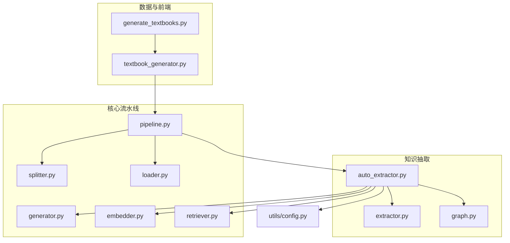
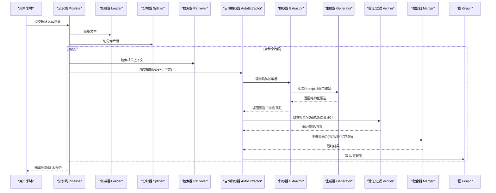
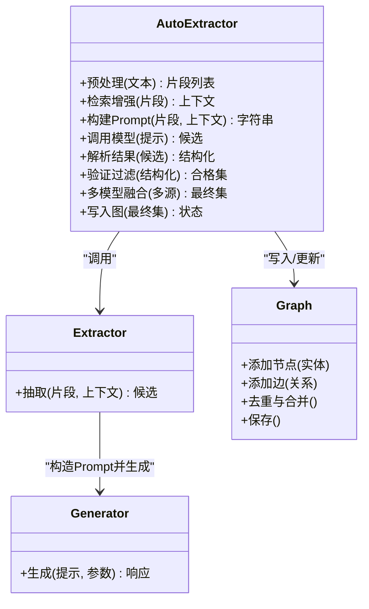
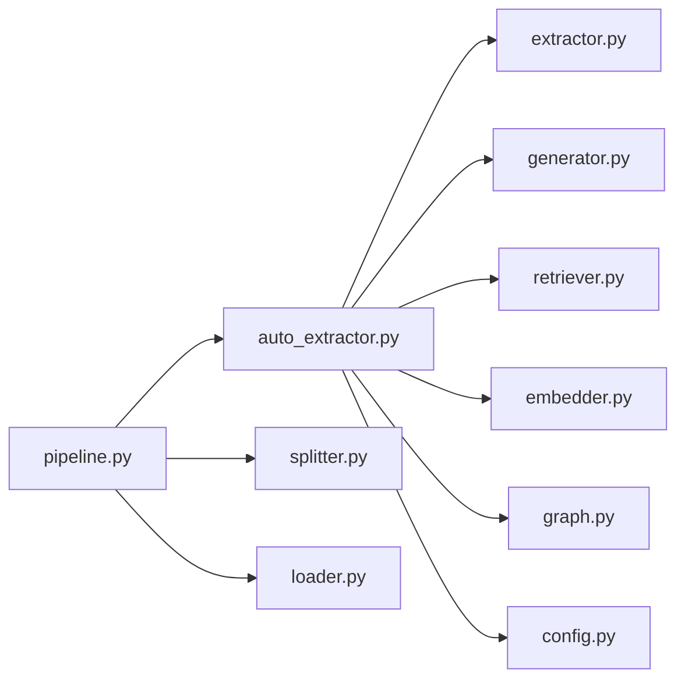
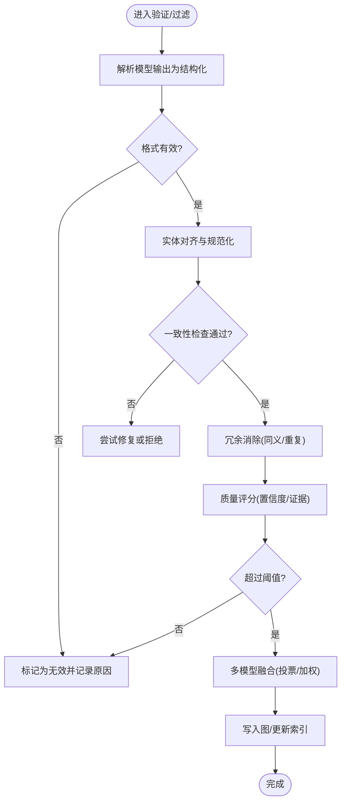

# 自动抽取器

<cite>
**本文引用的文件**   
- [src/kag_pro/kg/auto_extractor.py](file://src/kag_pro/kg/auto_extractor.py)
- [src/kag_pro/kg/extractor.py](file://src/kag_pro/kg/extractor.py)
- [src/kag_pro/kg/graph.py](file://src/kag_pro/kg/graph.py)
- [src/kag_pro/core/pipeline.py](file://src/kag_pro/core/pipeline.py)
- [src/kag_pro/core/generator.py](file://src/kag_pro/core/generator.py)
- [src/kag_pro/core/embedder.py](file://src/kag_pro/core/embedder.py)
- [src/kag_pro/core/retriever.py](file://src/kag_pro/core/retriever.py)
- [src/kag_pro/core/splitter.py](file://src/kag_pro/core/splitter.py)
- [src/kag_pro/core/loader.py](file://src/kag_pro/core/loader.py)
- [src/kag_pro/utils/config.py](file://src/kag_pro/utils/config.py)
- [src/kag_pro/data/datasets/textbook_generator.py](file://src/kag_pro/data/datasets/textbook_generator.py)
- [frontend/generate_textbooks.py](file://frontend/generate_textbooks.py)
</cite>

## 目录
1. [简介](#简介)
2. [项目结构](#项目结构)
3. [核心组件](#核心组件)
4. [架构总览](#架构总览)
5. [详细组件分析](#详细组件分析)
6. [依赖关系分析](#依赖关系分析)
7. [性能考虑](#性能考虑)
8. [故障排查指南](#故障排查指南)
9. [结论](#结论)
10. [附录](#附录)

## 简介
本技术文档面向KAG-Pro的“自动抽取器”，系统性阐述从教材文本到知识图谱的端到端自动化流程。内容覆盖：
- 输入预处理、模型调用与后处理管道
- 预训练语言模型的选型与集成方式（Prompt设计与Few-shot策略）
- 抽取结果的验证与过滤机制（一致性检查、冗余消除、质量评分）
- 多模型融合策略（投票、置信度加权、多源信息整合）
- 配置接口（模型参数、阈值、自定义规则）
- 批量处理教材并生成高质量知识图谱的使用示例
- 性能监控与调试工具使用方法

## 项目结构
围绕自动抽取器的关键代码位于kg与core子包，数据与前端脚本提供教材样例与批处理入口。下图给出与自动抽取相关的模块组织与交互概览。

图表来源
- [src/kag_pro/core/pipeline.py](file://src/kag_pro/core/pipeline.py)
- [src/kag_pro/core/splitter.py](file://src/kag_pro/core/splitter.py)
- [src/kag_pro/core/loader.py](file://src/kag_pro/core/loader.py)
- [src/kag_pro/core/generator.py](file://src/kag_pro/core/generator.py)
- [src/kag_pro/core/embedder.py](file://src/kag_pro/core/embedder.py)
- [src/kag_pro/core/retriever.py](file://src/kag_pro/core/retriever.py)
- [src/kag_pro/kg/auto_extractor.py](file://src/kag_pro/kg/auto_extractor.py)
- [src/kag_pro/kg/extractor.py](file://src/kag_pro/kg/extractor.py)
- [src/kag_pro/kg/graph.py](file://src/kag_pro/kg/graph.py)
- [src/kag_pro/utils/config.py](file://src/kag_pro/utils/config.py)
- [src/kag_pro/data/datasets/textbook_generator.py](file://src/kag_pro/data/datasets/textbook_generator.py)
- [frontend/generate_textbooks.py](file://frontend/generate_textbooks.py)

章节来源
- [src/kag_pro/kg/auto_extractor.py](file://src/kag_pro/kg/auto_extractor.py)
- [src/kag_pro/core/pipeline.py](file://src/kag_pro/core/pipeline.py)
- [src/kag_pro/utils/config.py](file://src/kag_pro/utils/config.py)

## 核心组件
- 自动抽取器（AutoExtractor）
  - 职责：编排输入预处理、提示构建、模型调用、结果解析、验证过滤、融合合并、图写入等全流程。
  - 关键能力：可插拔的抽取器实现、可配置的Prompt模板、可组合的后处理规则、多模型融合策略。
- 抽取器基类（Extractor）
  - 职责：定义统一的抽取接口与通用逻辑（如上下文组装、重试与超时控制、日志与指标上报）。
- 图模型（Graph）
  - 职责：实体/关系/属性的建模、去重与冲突消解、增量更新与持久化。
- 流水线（Pipeline）
  - 职责：加载文本、分块、索引、检索增强、调度抽取任务、聚合输出。
- 生成器（Generator）
  - 职责：封装大模型调用（含Prompt构造、Few-shot示例注入、温度/Top-p等参数控制）。
- 嵌入器（Embedder）与检索器（Retriever）
  - 职责：将片段向量化并检索相关上下文，用于增强Prompt或进行一致性校验。
- 配置（Config）
  - 职责：集中管理模型、阈值、规则、路径等运行时参数。

章节来源
- [src/kag_pro/kg/auto_extractor.py](file://src/kag_pro/kg/auto_extractor.py)
- [src/kag_pro/kg/extractor.py](file://src/kag_pro/kg/extractor.py)
- [src/kag_pro/kg/graph.py](file://src/kag_pro/kg/graph.py)
- [src/kag_pro/core/pipeline.py](file://src/kag_pro/core/pipeline.py)
- [src/kag_pro/core/generator.py](file://src/kag_pro/core/generator.py)
- [src/kag_pro/core/embedder.py](file://src/kag_pro/core/embedder.py)
- [src/kag_pro/core/retriever.py](file://src/kag_pro/core/retriever.py)
- [src/kag_pro/utils/config.py](file://src/kag_pro/utils/config.py)

## 架构总览
下图展示从教材文本到知识图谱的端到端流程，包括预处理、检索增强、模型调用、后处理与图落库。

图表来源
- [src/kag_pro/core/pipeline.py](file://src/kag_pro/core/pipeline.py)
- [src/kag_pro/core/loader.py](file://src/kag_pro/core/loader.py)
- [src/kag_pro/core/splitter.py](file://src/kag_pro/core/splitter.py)
- [src/kag_pro/core/retriever.py](file://src/kag_pro/core/retriever.py)
- [src/kag_pro/kg/auto_extractor.py](file://src/kag_pro/kg/auto_extractor.py)
- [src/kag_pro/kg/extractor.py](file://src/kag_pro/kg/extractor.py)
- [src/kag_pro/core/generator.py](file://src/kag_pro/core/generator.py)
- [src/kag_pro/kg/graph.py](file://src/kag_pro/kg/graph.py)

## 详细组件分析

### 自动抽取器（AutoExtractor）
- 设计要点
  - 以“步骤化”的方式编排：预处理→检索增强→提示构建→模型调用→解析→验证→融合→落库。
  - 支持多抽取器并行/串行执行，便于对比与融合。
  - 内置可配置的质量门控（阈值、规则），失败重试与降级策略。
- 关键流程
  - 输入预处理：清洗、规范化、段落/句子级切分、元数据保留。
  - 检索增强：基于嵌入相似度召回相关片段，拼接为Prompt上下文。
  - Prompt设计：角色设定、任务说明、约束条件、Few-shot示例、输出格式规范。
  - 模型调用：统一封装至生成器，支持并发与限流。
  - 结果解析：严格JSON/结构化字段校验，异常回退。
  - 验证与过滤：一致性检查（实体对齐、关系方向）、冗余消除（同义合并、重复边）、质量评分（置信度、证据强度）。
  - 多模型融合：多数投票、置信度加权、跨源互补。
  - 图写入：增量更新、冲突消解、版本记录。
- 扩展点
  - 新增抽取器：实现统一接口，注册到自动抽取器。
  - 新增规则：在验证/过滤阶段插入自定义规则。
  - 替换模型：通过生成器适配不同后端。

图表来源
- [src/kag_pro/kg/auto_extractor.py](file://src/kag_pro/kg/auto_extractor.py)
- [src/kag_pro/kg/extractor.py](file://src/kag_pro/kg/extractor.py)
- [src/kag_pro/core/generator.py](file://src/kag_pro/core/generator.py)
- [src/kag_pro/kg/graph.py](file://src/kag_pro/kg/graph.py)

章节来源
- [src/kag_pro/kg/auto_extractor.py](file://src/kag_pro/kg/auto_extractor.py)
- [src/kag_pro/kg/extractor.py](file://src/kag_pro/kg/extractor.py)
- [src/kag_pro/core/generator.py](file://src/kag_pro/core/generator.py)
- [src/kag_pro/kg/graph.py](file://src/kag_pro/kg/graph.py)

### 抽取器基类（Extractor）
- 职责
  - 定义抽取的统一输入输出契约。
  - 提供通用能力：重试、超时、错误分类、指标采集。
- 典型方法
  - 抽取：接收片段与上下文，返回候选三元组/属性集合。
  - 辅助：上下文裁剪、长度限制、敏感信息脱敏。
- 扩展建议
  - 针对学科领域定制Prompt与Few-shot示例。
  - 引入外部知识库进行事实核查。

章节来源
- [src/kag_pro/kg/extractor.py](file://src/kag_pro/kg/extractor.py)

### 图模型（Graph）
- 职责
  - 实体/关系/属性的建模与存储。
  - 去重、合并、冲突检测与解决。
  - 增量更新与快照导出。
- 关键操作
  - 添加节点/边、查询邻接、计算度数、导出子图。
  - 一致性校验：环检测、类型约束、基数约束。

章节来源
- [src/kag_pro/kg/graph.py](file://src/kag_pro/kg/graph.py)

### 流水线（Pipeline）
- 职责
  - 编排加载、分块、检索、抽取、落库的整体流程。
  - 提供进度、吞吐、错误率等监控指标。
- 关键流程
  - 批量读取教材文本→分块→索引→按批次触发抽取→汇总结果→输出报告。

章节来源
- [src/kag_pro/core/pipeline.py](file://src/kag_pro/core/pipeline.py)

### 生成器（Generator）
- 职责
  - 封装大模型调用，统一参数（温度、Top-p、最大长度、重试次数等）。
  - 支持多种后端适配器（HTTP/SDK/本地推理）。
- Prompt工程
  - 动态注入Few-shot示例、领域术语表、输出Schema约束。
  - 支持多轮对话式引导与自洽性校验。

章节来源
- [src/kag_pro/core/generator.py](file://src/kag_pro/core/generator.py)

### 嵌入器（Embedder）与检索器（Retriever）
- 嵌入器
  - 将文本片段映射为向量，支持批量与缓存。
- 检索器
  - 基于相似度召回Top-K相关片段，支持BM25与向量混合检索。
  - 为Prompt提供强相关上下文，提升抽取准确率。

章节来源
- [src/kag_pro/core/embedder.py](file://src/kag_pro/core/embedder.py)
- [src/kag_pro/core/retriever.py](file://src/kag_pro/core/retriever.py)

### 配置（Config）
- 管理项
  - 模型选择与参数、阈值与规则、路径与资源、并发与限流。
- 使用方式
  - 通过配置文件或环境变量注入，运行时覆盖默认值。

章节来源
- [src/kag_pro/utils/config.py](file://src/kag_pro/utils/config.py)

## 依赖关系分析
下图展示自动抽取器与其核心依赖之间的耦合关系。

图表来源
- [src/kag_pro/kg/auto_extractor.py](file://src/kag_pro/kg/auto_extractor.py)
- [src/kag_pro/kg/extractor.py](file://src/kag_pro/kg/extractor.py)
- [src/kag_pro/core/generator.py](file://src/kag_pro/core/generator.py)
- [src/kag_pro/core/retriever.py](file://src/kag_pro/core/retriever.py)
- [src/kag_pro/core/embedder.py](file://src/kag_pro/core/embedder.py)
- [src/kag_pro/kg/graph.py](file://src/kag_pro/kg/graph.py)
- [src/kag_pro/utils/config.py](file://src/kag_pro/utils/config.py)
- [src/kag_pro/core/pipeline.py](file://src/kag_pro/core/pipeline.py)
- [src/kag_pro/core/splitter.py](file://src/kag_pro/core/splitter.py)
- [src/kag_pro/core/loader.py](file://src/kag_pro/core/loader.py)

章节来源
- [src/kag_pro/kg/auto_extractor.py](file://src/kag_pro/kg/auto_extractor.py)
- [src/kag_pro/core/pipeline.py](file://src/kag_pro/core/pipeline.py)

## 性能考虑
- 并发与限流
  - 对模型调用与I/O进行并发控制，避免过载；设置队列与背压。
- 缓存与复用
  - 嵌入向量缓存、相似片段缓存、Prompt模板缓存。
- 分块策略
  - 根据语义边界与长度阈值自适应切分，减少上下文丢失与噪声。
- 检索优化
  - 混合检索（向量+关键词）、动态Top-K、相关性重排。
- 资源监控
  - 记录延迟、吞吐、错误率、Token用量与成本。

[本节为通用指导，不直接分析具体文件]

## 故障排查指南
- 常见问题定位
  - 模型调用失败：检查网络、鉴权、速率限制与重试策略。
  - 解析失败：确认输出格式是否符合Schema，增加容错与回退。
  - 抽取质量低：调整Prompt与Few-shot示例，扩大检索上下文，提高阈值。
  - 图不一致：检查实体对齐与关系方向，启用冲突消解与审计日志。
- 诊断手段
  - 开启详细日志与TraceID，追踪单次请求全链路。
  - 抽样人工复核，结合质量评分与证据片段定位问题。
  - 使用单元测试与回归测试覆盖关键路径。

章节来源
- [src/kag_pro/core/pipeline.py](file://src/kag_pro/core/pipeline.py)
- [src/kag_pro/core/generator.py](file://src/kag_pro/core/generator.py)
- [src/kag_pro/kg/auto_extractor.py](file://src/kag_pro/kg/auto_extractor.py)

## 结论
KAG-Pro自动抽取器以模块化、可配置、可扩展为核心设计理念，通过检索增强与多模型融合显著提升抽取质量与鲁棒性。配合完善的验证过滤与图模型管理，能够稳定地将教材文本转化为高质量的知识图谱。

[本节为总结性内容，不直接分析具体文件]

## 附录

### 使用示例：批量处理教材文本并生成知识图谱
- 准备教材
  - 使用数据生成脚本准备教材文本，或直接将现有txt放入数据目录。
- 运行流水线
  - 通过前端脚本或Python API启动流水线，指定输入目录、输出目录与配置。
- 查看结果
  - 检查生成的图谱文件与质量报告，必要时调整阈值与规则后重新运行。

章节来源
- [src/kag_pro/data/datasets/textbook_generator.py](file://src/kag_pro/data/datasets/textbook_generator.py)
- [frontend/generate_textbooks.py](file://frontend/generate_textbooks.py)
- [src/kag_pro/core/pipeline.py](file://src/kag_pro/core/pipeline.py)

### 配置接口参考
- 模型参数
  - 模型名称/路径、温度、Top-p、最大生成长度、重试次数、超时时间。
- 阈值与规则
  - 质量阈值、冗余相似度阈值、实体对齐阈值、关系方向校验开关。
- 检索与分块
  - Top-K、混合检索权重、分块大小与重叠比例。
- 资源与并发
  - 并发数、队列容量、限流策略、缓存开关。
- 路径与输出
  - 输入/输出目录、日志级别、报告格式。

章节来源
- [src/kag_pro/utils/config.py](file://src/kag_pro/utils/config.py)

### 流程图：验证与过滤

图表来源
- [src/kag_pro/kg/auto_extractor.py](file://src/kag_pro/kg/auto_extractor.py)
- [src/kag_pro/kg/graph.py](file://src/kag_pro/kg/graph.py)