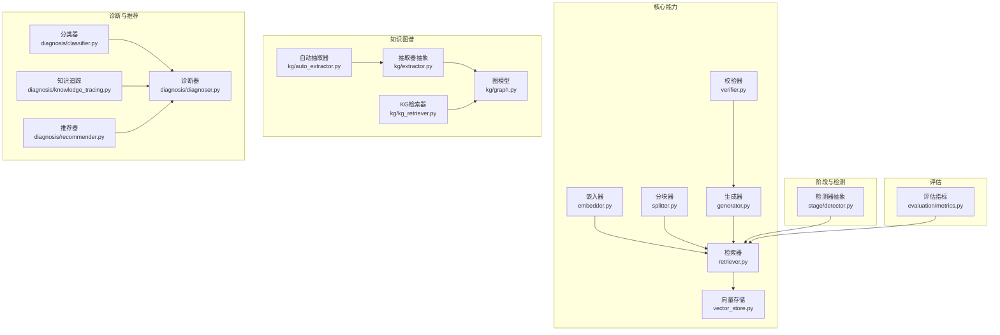
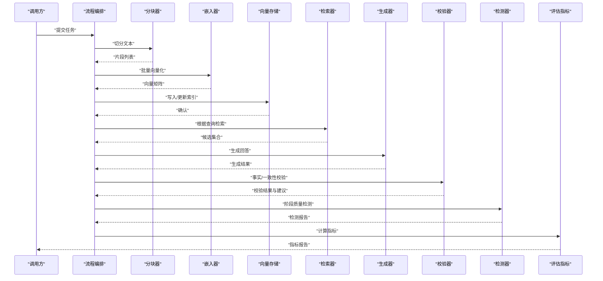
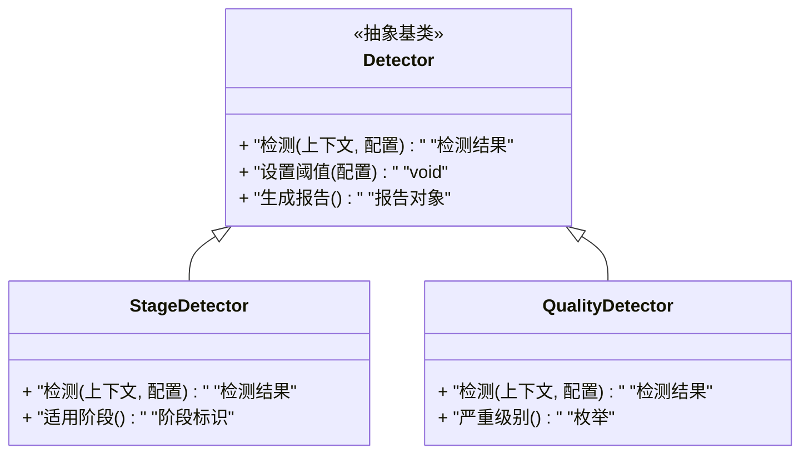
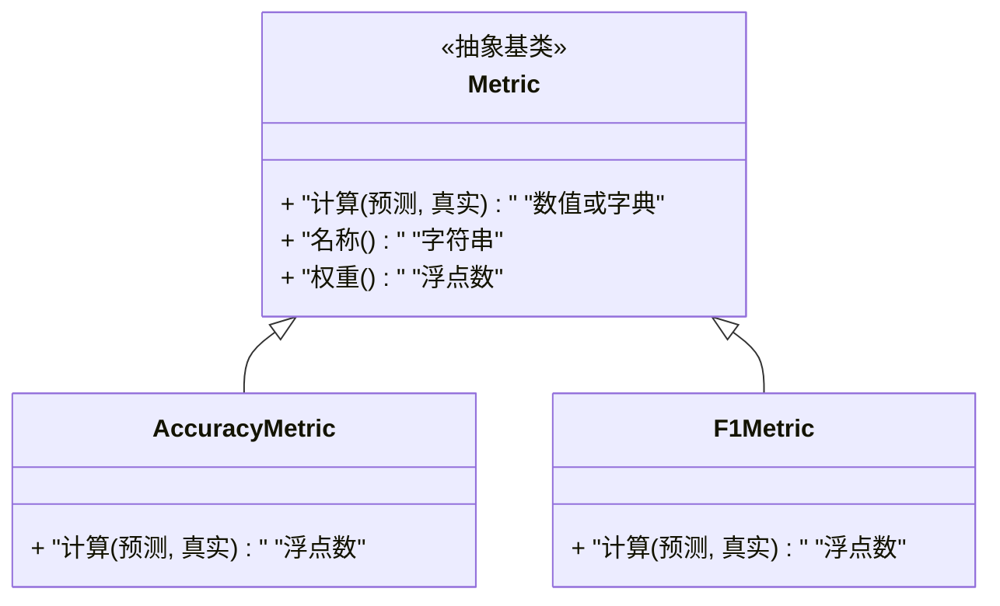
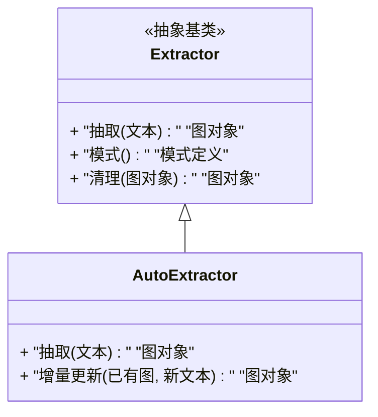
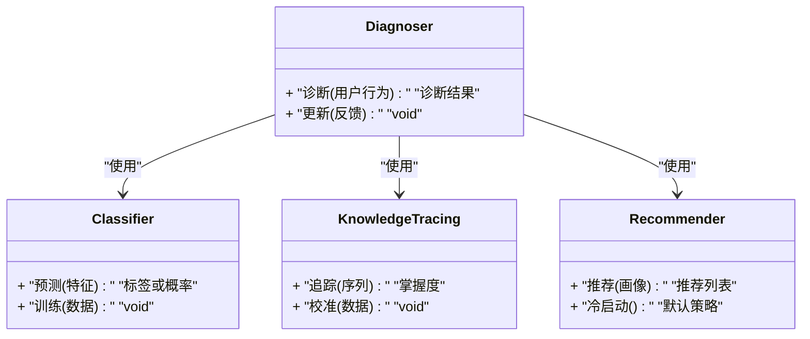
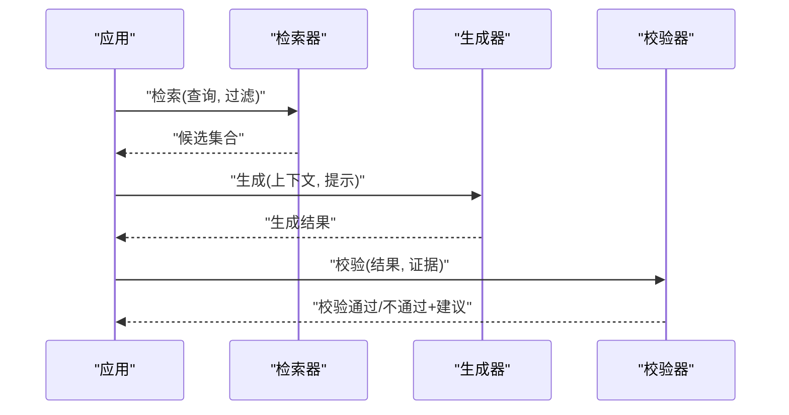
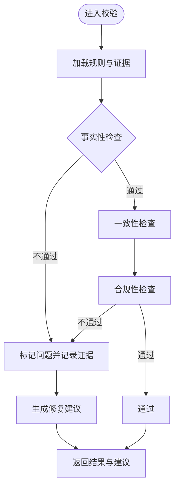
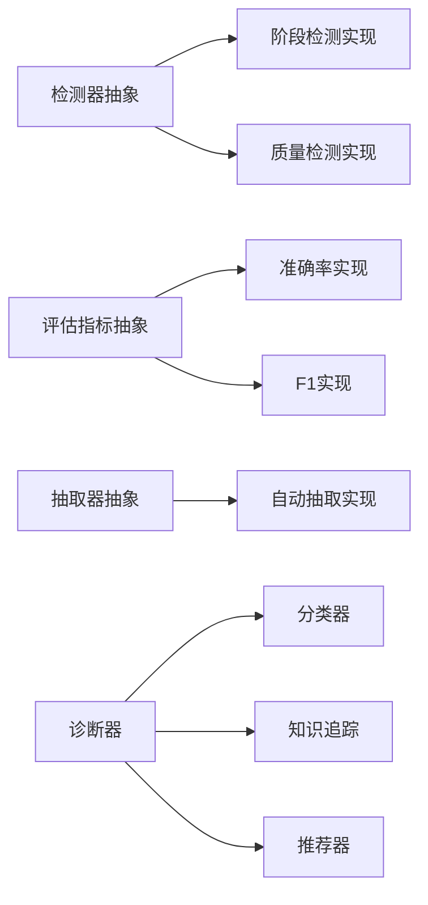

# 扩展接口规范

<cite>
**本文引用的文件**   
- [src/kag_pro/core/embedder.py](file://src/kag_pro/core/embedder.py)
- [src/kag_pro/core/retriever.py](file://src/kag_pro/core/retriever.py)
- [src/kag_pro/core/splitter.py](file://src/kag_pro/core/splitter.py)
- [src/kag_pro/core/vector_store.py](file://src/kag_pro/core/vector_store.py)
- [src/kag_pro/core/generator.py](file://src/kag_pro/core/generator.py)
- [src/kag_pro/core/verifier.py](file://src/kag_pro/core/verifier.py)
- [src/kag_pro/stage/detector.py](file://src/kag_pro/stage/detector.py)
- [src/kag_pro/evaluation/metrics.py](file://src/kag_pro/evaluation/metrics.py)
- [src/kag_pro/kg/graph.py](file://src/kag_pro/kg/graph.py)
- [src/kag_pro/kg/auto_extractor.py](file://src/kag_pro/kg/auto_extractor.py)
- [src/kag_pro/kg/extractor.py](file://src/kag_pro/kg/extractor.py)
- [src/kag_pro/kg/kg_retriever.py](file://src/kag_pro/kg/kg_retriever.py)
- [src/kag_pro/diagnosis/classifier.py](file://src/kag_pro/diagnosis/classifier.py)
- [src/kag_pro/diagnosis/diagnoser.py](file://src/kag_pro/diagnosis/diagnoser.py)
- [src/kag_pro/diagnosis/knowledge_tracing.py](file://src/kag_pro/diagnosis/knowledge_tracing.py)
- [src/kag_pro/diagnosis/recommender.py](file://src/kag_pro/diagnosis/recommender.py)
- [tests/test_stage.py](file://tests/test_stage.py)
- [tests/test_diagnoser.py](file://tests/test_diagnoser.py)
- [tests/test_classifier.py](file://tests/test_classifier.py)
</cite>

## 目录
1. [简介](#简介)
2. [项目结构](#项目结构)
3. [核心组件](#核心组件)
4. [架构总览](#架构总览)
5. [详细组件分析](#详细组件分析)
6. [依赖关系分析](#依赖关系分析)
7. [性能考虑](#性能考虑)
8. [故障排查指南](#故障排查指南)
9. [结论](#结论)
10. [附录](#附录) 

## 简介
本文件面向KAG-Pro的扩展点与接口契约，系统化梳理验证器、检测器、评估指标等关键抽象基类与接口约定。文档覆盖：
- 必需方法与可选方法的约定
- 参数规范、返回值格式与异常处理机制
- 接口版本兼容性与向后兼容保证策略
- 实现示例路径与最佳实践（单一职责、依赖倒置）
- 接口测试方法与工具推荐

## 项目结构
KAG-Pro采用分层与按功能域组织相结合的结构。与扩展接口密切相关的目录包括：
- core：嵌入、检索、分块、向量存储、生成、校验等核心能力
- stage：阶段式检测器抽象
- evaluation：评估指标抽象
- kg：知识图谱抽取与检索相关接口
- diagnosis：诊断与推荐相关接口

图表来源
- [src/kag_pro/core/embedder.py](file://src/kag_pro/core/embedder.py)
- [src/kag_pro/core/retriever.py](file://src/kag_pro/core/retriever.py)
- [src/kag_pro/core/splitter.py](file://src/kag_pro/core/splitter.py)
- [src/kag_pro/core/vector_store.py](file://src/kag_pro/core/vector_store.py)
- [src/kag_pro/core/generator.py](file://src/kag_pro/core/generator.py)
- [src/kag_pro/core/verifier.py](file://src/kag_pro/core/verifier.py)
- [src/kag_pro/stage/detector.py](file://src/kag_pro/stage/detector.py)
- [src/kag_pro/evaluation/metrics.py](file://src/kag_pro/evaluation/metrics.py)
- [src/kag_pro/kg/graph.py](file://src/kag_pro/kg/graph.py)
- [src/kag_pro/kg/auto_extractor.py](file://src/kag_pro/kg/auto_extractor.py)
- [src/kag_pro/kg/extractor.py](file://src/kag_pro/kg/extractor.py)
- [src/kag_pro/kg/kg_retriever.py](file://src/kag_pro/kg/kg_retriever.py)
- [src/kag_pro/diagnosis/classifier.py](file://src/kag_pro/diagnosis/classifier.py)
- [src/kag_pro/diagnosis/diagnoser.py](file://src/kag_pro/diagnosis/diagnoser.py)
- [src/kag_pro/diagnosis/knowledge_tracing.py](file://src/kag_pro/diagnosis/knowledge_tracing.py)
- [src/kag_pro/diagnosis/recommender.py](file://src/kag_pro/diagnosis/recommender.py)

章节来源
- [src/kag_pro/core/embedder.py](file://src/kag_pro/core/embedder.py)
- [src/kag_pro/core/retriever.py](file://src/kag_pro/core/retriever.py)
- [src/kag_pro/core/splitter.py](file://src/kag_pro/core/splitter.py)
- [src/kag_pro/core/vector_store.py](file://src/kag_pro/core/vector_store.py)
- [src/kag_pro/core/generator.py](file://src/kag_pro/core/generator.py)
- [src/kag_pro/core/verifier.py](file://src/kag_pro/core/verifier.py)
- [src/kag_pro/stage/detector.py](file://src/kag_pro/stage/detector.py)
- [src/kag_pro/evaluation/metrics.py](file://src/kag_pro/evaluation/metrics.py)
- [src/kag_pro/kg/graph.py](file://src/kag_pro/kg/graph.py)
- [src/kag_pro/kg/auto_extractor.py](file://src/kag_pro/kg/auto_extractor.py)
- [src/kag_pro/kg/extractor.py](file://src/kag_pro/kg/extractor.py)
- [src/kag_pro/kg/kg_retriever.py](file://src/kag_pro/kg/kg_retriever.py)
- [src/kag_pro/diagnosis/classifier.py](file://src/kag_pro/diagnosis/classifier.py)
- [src/kag_pro/diagnosis/diagnoser.py](file://src/kag_pro/diagnosis/diagnoser.py)
- [src/kag_pro/diagnosis/knowledge_tracing.py](file://src/kag_pro/diagnosis/knowledge_tracing.py)
- [src/kag_pro/diagnosis/recommender.py](file://src/kag_pro/diagnosis/recommender.py)

## 核心组件
本节聚焦于扩展点中最常用的抽象基类与接口契约，说明其职责边界、方法约定与异常语义。

- 嵌入器（Embedder）
  - 职责：将文本或结构化输入转换为向量表示
  - 典型方法：向量化、批量向量化、维度查询
  - 返回：数值型向量或矩阵；维度信息用于下游一致性检查
  - 异常：维度不匹配、外部服务不可用、资源不足

- 检索器（Retriever）
  - 职责：基于查询向量或关键词从向量库或图谱中召回候选
  - 典型方法：检索、过滤、重排
  - 返回：候选集合及评分；支持分页与排序
  - 异常：索引损坏、空结果、超时

- 分块器（Splitter）
  - 职责：将长文本切分为适合处理的片段
  - 典型方法：按长度/语义/层级切分
  - 返回：片段列表及其元数据（如起始位置、重叠度）
  - 异常：非法输入、切分策略冲突

- 向量存储（VectorStore）
  - 职责：持久化与检索向量
  - 典型方法：写入、删除、相似度检索、元数据过滤
  - 返回：成功状态、命中结果集
  - 异常：连接失败、容量不足、并发冲突

- 生成器（Generator）
  - 职责：基于上下文与提示生成内容
  - 典型方法：生成、流式生成、采样控制
  - 返回：生成文本、置信度、日志
  - 异常：令牌限制、模型不可用、输出校验失败

- 校验器（Verifier）
  - 职责：对生成结果进行事实性、一致性、合规性校验
  - 典型方法：校验、修复建议、证据定位
  - 返回：布尔判定、问题清单、修复建议
  - 异常：规则缺失、外部依赖错误

- 检测器（Detector，阶段式）
  - 职责：在流水线各阶段执行质量/风险检测
  - 典型方法：检测、阈值配置、报告生成
  - 返回：检测结果、严重级别、可操作建议
  - 异常：配置错误、检测逻辑异常

- 评估指标（Metrics）
  - 职责：计算任务级或样本级指标
  - 典型方法：精确率、召回率、F1、自定义指标
  - 返回：标量或字典形式的指标值
  - 异常：标签缺失、类别不平衡导致的除零

- 知识图谱相关（Graph/Extractor/AutoExtractor/KGRetriever）
  - 职责：构建、维护与检索图谱实体/关系
  - 典型方法：节点/边增删改查、子图检索、路径推理
  - 返回：图对象、查询结果集
  - 异常：模式不一致、循环引用、查询超时

- 诊断与推荐（Classifier/Diagnoser/KnowledgeTracing/Recommender）
  - 职责：学习者画像、知识点掌握度估计、个性化推荐
  - 典型方法：预测、追踪、推荐
  - 返回：概率分布、掌握度、推荐列表
  - 异常：数据稀疏、模型未训练、特征缺失

章节来源
- [src/kag_pro/core/embedder.py](file://src/kag_pro/core/embedder.py)
- [src/kag_pro/core/retriever.py](file://src/kag_pro/core/retriever.py)
- [src/kag_pro/core/splitter.py](file://src/kag_pro/core/splitter.py)
- [src/kag_pro/core/vector_store.py](file://src/kag_pro/core/vector_store.py)
- [src/kag_pro/core/generator.py](file://src/kag_pro/core/generator.py)
- [src/kag_pro/core/verifier.py](file://src/kag_pro/core/verifier.py)
- [src/kag_pro/stage/detector.py](file://src/kag_pro/stage/detector.py)
- [src/kag_pro/evaluation/metrics.py](file://src/kag_pro/evaluation/metrics.py)
- [src/kag_pro/kg/graph.py](file://src/kag_pro/kg/graph.py)
- [src/kag_pro/kg/auto_extractor.py](file://src/kag_pro/kg/auto_extractor.py)
- [src/kag_pro/kg/extractor.py](file://src/kag_pro/kg/extractor.py)
- [src/kag_pro/kg/kg_retriever.py](file://src/kag_pro/kg/kg_retriever.py)
- [src/kag_pro/diagnosis/classifier.py](file://src/kag_pro/diagnosis/classifier.py)
- [src/kag_pro/diagnosis/diagnoser.py](file://src/kag_pro/diagnosis/diagnoser.py)
- [src/kag_pro/diagnosis/knowledge_tracing.py](file://src/kag_pro/diagnosis/knowledge_tracing.py)
- [src/kag_pro/diagnosis/recommender.py](file://src/kag_pro/diagnosis/recommender.py)

## 架构总览
下图展示扩展点在系统中的交互关系与数据流向。

图表来源
- [src/kag_pro/core/splitter.py](file://src/kag_pro/core/splitter.py)
- [src/kag_pro/core/embedder.py](file://src/kag_pro/core/embedder.py)
- [src/kag_pro/core/vector_store.py](file://src/kag_pro/core/vector_store.py)
- [src/kag_pro/core/retriever.py](file://src/kag_pro/core/retriever.py)
- [src/kag_pro/core/generator.py](file://src/kag_pro/core/generator.py)
- [src/kag_pro/core/verifier.py](file://src/kag_pro/core/verifier.py)
- [src/kag_pro/stage/detector.py](file://src/kag_pro/stage/detector.py)
- [src/kag_pro/evaluation/metrics.py](file://src/kag_pro/evaluation/metrics.py)

## 详细组件分析

### 检测器接口（阶段式）
检测器作为流水线中的横切关注点，负责在各阶段执行质量与风险控制。

图表来源
- [src/kag_pro/stage/detector.py](file://src/kag_pro/stage/detector.py)

章节来源
- [src/kag_pro/stage/detector.py](file://src/kag_pro/stage/detector.py)

### 评估指标接口
评估指标提供统一的计算入口，便于横向对比不同实现。

图表来源
- [src/kag_pro/evaluation/metrics.py](file://src/kag_pro/evaluation/metrics.py)

章节来源
- [src/kag_pro/evaluation/metrics.py](file://src/kag_pro/evaluation/metrics.py)

### 知识图谱抽取器接口
抽取器定义从非结构化文本到图谱结构的转换契约。

图表来源
- [src/kag_pro/kg/extractor.py](file://src/kag_pro/kg/extractor.py)
- [src/kag_pro/kg/auto_extractor.py](file://src/kag_pro/kg/auto_extractor.py)
- [src/kag_pro/kg/graph.py](file://src/kag_pro/kg/graph.py)

章节来源
- [src/kag_pro/kg/extractor.py](file://src/kag_pro/kg/extractor.py)
- [src/kag_pro/kg/auto_extractor.py](file://src/kag_pro/kg/auto_extractor.py)
- [src/kag_pro/kg/graph.py](file://src/kag_pro/kg/graph.py)

### 诊断与推荐接口
诊断器组合分类器、知识追踪与推荐器，形成学习分析与干预闭环。

图表来源
- [src/kag_pro/diagnosis/diagnoser.py](file://src/kag_pro/diagnosis/diagnoser.py)
- [src/kag_pro/diagnosis/classifier.py](file://src/kag_pro/diagnosis/classifier.py)
- [src/kag_pro/diagnosis/knowledge_tracing.py](file://src/kag_pro/diagnosis/knowledge_tracing.py)
- [src/kag_pro/diagnosis/recommender.py](file://src/kag_pro/diagnosis/recommender.py)

章节来源
- [src/kag_pro/diagnosis/diagnoser.py](file://src/kag_pro/diagnosis/diagnoser.py)
- [src/kag_pro/diagnosis/classifier.py](file://src/kag_pro/diagnosis/classifier.py)
- [src/kag_pro/diagnosis/knowledge_tracing.py](file://src/kag_pro/diagnosis/knowledge_tracing.py)
- [src/kag_pro/diagnosis/recommender.py](file://src/kag_pro/diagnosis/recommender.py)

### 检索与生成工作流（时序）
展示从检索到生成再到校验的关键调用链。

图表来源
- [src/kag_pro/core/retriever.py](file://src/kag_pro/core/retriever.py)
- [src/kag_pro/core/generator.py](file://src/kag_pro/core/generator.py)
- [src/kag_pro/core/verifier.py](file://src/kag_pro/core/verifier.py)

章节来源
- [src/kag_pro/core/retriever.py](file://src/kag_pro/core/retriever.py)
- [src/kag_pro/core/generator.py](file://src/kag_pro/core/generator.py)
- [src/kag_pro/core/verifier.py](file://src/kag_pro/core/verifier.py)

### 复杂逻辑流程图（示例：校验器决策）
校验器通常包含多步判断与修复建议生成。

图表来源
- [src/kag_pro/core/verifier.py](file://src/kag_pro/core/verifier.py)

章节来源
- [src/kag_pro/core/verifier.py](file://src/kag_pro/core/verifier.py)

## 依赖关系分析
- 低耦合高内聚：每个扩展点以抽象基类定义最小必要接口，具体实现仅依赖自身领域对象
- 依赖倒置：上层流程编排依赖抽象而非具体实现，便于替换与测试
- 可能的环依赖：避免在抽取器与图谱之间直接双向依赖，应通过接口或事件解耦

图表来源
- [src/kag_pro/stage/detector.py](file://src/kag_pro/stage/detector.py)
- [src/kag_pro/evaluation/metrics.py](file://src/kag_pro/evaluation/metrics.py)
- [src/kag_pro/kg/extractor.py](file://src/kag_pro/kg/extractor.py)
- [src/kag_pro/kg/auto_extractor.py](file://src/kag_pro/kg/auto_extractor.py)
- [src/kag_pro/diagnosis/diagnoser.py](file://src/kag_pro/diagnosis/diagnoser.py)
- [src/kag_pro/diagnosis/classifier.py](file://src/kag_pro/diagnosis/classifier.py)
- [src/kag_pro/diagnosis/knowledge_tracing.py](file://src/kag_pro/diagnosis/knowledge_tracing.py)
- [src/kag_pro/diagnosis/recommender.py](file://src/kag_pro/diagnosis/recommender.py)

章节来源
- [src/kag_pro/stage/detector.py](file://src/kag_pro/stage/detector.py)
- [src/kag_pro/evaluation/metrics.py](file://src/kag_pro/evaluation/metrics.py)
- [src/kag_pro/kg/extractor.py](file://src/kag_pro/kg/extractor.py)
- [src/kag_pro/kg/auto_extractor.py](file://src/kag_pro/kg/auto_extractor.py)
- [src/kag_pro/diagnosis/diagnoser.py](file://src/kag_pro/diagnosis/diagnoser.py)
- [src/kag_pro/diagnosis/classifier.py](file://src/kag_pro/diagnosis/classifier.py)
- [src/kag_pro/diagnosis/knowledge_tracing.py](file://src/kag_pro/diagnosis/knowledge_tracing.py)
- [src/kag_pro/diagnosis/recommender.py](file://src/kag_pro/diagnosis/recommender.py)

## 性能考虑
- 批处理与缓存：嵌入与检索尽量批量执行，结合内存/磁盘缓存减少重复计算
- 惰性加载：图谱与向量索引按需加载，避免启动时全量载入
- 异步与超时：对外部模型与存储的调用需设置超时与重试上限
- 资源隔离：为不同扩展点分配独立线程池或进程池，防止相互阻塞
- 指标采样：大规模评估时采用分层抽样与早停策略

[本节为通用指导，无需代码来源]

## 故障排查指南
- 常见异常类型
  - 配置错误：缺失必填字段、类型不匹配
  - 外部依赖不可用：网络超时、认证失败、配额耗尽
  - 数据异常：空输入、维度不一致、标签缺失
  - 并发问题：锁竞争、死锁、资源泄漏
- 定位步骤
  - 启用详细日志与TraceID，关联上下游调用
  - 复现最小用例，逐步注释排除
  - 使用断言与契约检查快速暴露不合法状态
- 恢复策略
  - 降级：回退到默认策略或离线规则
  - 熔断：对不稳定依赖快速失败
  - 补偿：失败重试与幂等写入

章节来源
- [tests/test_stage.py](file://tests/test_stage.py)
- [tests/test_diagnoser.py](file://tests/test_diagnoser.py)
- [tests/test_classifier.py](file://tests/test_classifier.py)

## 结论
通过明确的抽象基类与接口契约，KAG-Pro实现了可扩展、可替换、可测试的模块化架构。遵循单一职责与依赖倒置原则，配合完善的异常处理与兼容性策略，可在保持稳定的同时持续演进系统能力。

[本节为总结性内容，无需代码来源]

## 附录

### 接口版本兼容性与向后兼容保证
- 版本号策略：采用主版本.次版本.修订号，主版本变更可能破坏兼容
- 新增字段与方法：默认值必须存在，旧实现仍可运行
- 废弃标记：弃用API需保留至少两个次版本并提供迁移指引
- 行为变更：不得改变现有方法的语义与副作用，必要时引入新方法
- 配置项：新增配置项需提供默认值且不影响旧配置

[本节为通用策略说明，无需代码来源]

### 实现示例路径（继承与实现）
- 自定义检测器：参考阶段检测器抽象的实现方式
  - [src/kag_pro/stage/detector.py](file://src/kag_pro/stage/detector.py)
- 自定义评估指标：参考指标抽象与具体实现
  - [src/kag_pro/evaluation/metrics.py](file://src/kag_pro/evaluation/metrics.py)
- 自定义抽取器：参考抽取器抽象与自动抽取实现
  - [src/kag_pro/kg/extractor.py](file://src/kag_pro/kg/extractor.py)
  - [src/kag_pro/kg/auto_extractor.py](file://src/kag_pro/kg/auto_extractor.py)
- 自定义诊断器：参考诊断器与其依赖组件
  - [src/kag_pro/diagnosis/diagnoser.py](file://src/kag_pro/diagnosis/diagnoser.py)
  - [src/kag_pro/diagnosis/classifier.py](file://src/kag_pro/diagnosis/classifier.py)
  - [src/kag_pro/diagnosis/knowledge_tracing.py](file://src/kag_pro/diagnosis/knowledge_tracing.py)
  - [src/kag_pro/diagnosis/recommender.py](file://src/kag_pro/diagnosis/recommender.py)

章节来源
- [src/kag_pro/stage/detector.py](file://src/kag_pro/stage/detector.py)
- [src/kag_pro/evaluation/metrics.py](file://src/kag_pro/evaluation/metrics.py)
- [src/kag_pro/kg/extractor.py](file://src/kag_pro/kg/extractor.py)
- [src/kag_pro/kg/auto_extractor.py](file://src/kag_pro/kg/auto_extractor.py)
- [src/kag_pro/diagnosis/diagnoser.py](file://src/kag_pro/diagnosis/diagnoser.py)
- [src/kag_pro/diagnosis/classifier.py](file://src/kag_pro/diagnosis/classifier.py)
- [src/kag_pro/diagnosis/knowledge_tracing.py](file://src/kag_pro/diagnosis/knowledge_tracing.py)
- [src/kag_pro/diagnosis/recommender.py](file://src/kag_pro/diagnosis/recommender.py)

### 接口测试方法与工具推荐
- 单元测试框架：pytest，结合fixture管理测试数据与模拟对象
- 模拟与桩：使用标准库或第三方库对外部依赖进行mock
- 契约测试：对接口签名与返回结构进行断言，确保向后兼容
- 回归测试：覆盖关键路径与异常分支，建立基线用例集
- 性能测试：对检索、生成、评估等热点路径进行基准测试

章节来源
- [tests/test_stage.py](file://tests/test_stage.py)
- [tests/test_diagnoser.py](file://tests/test_diagnoser.py)
- [tests/test_classifier.py](file://tests/test_classifier.py)