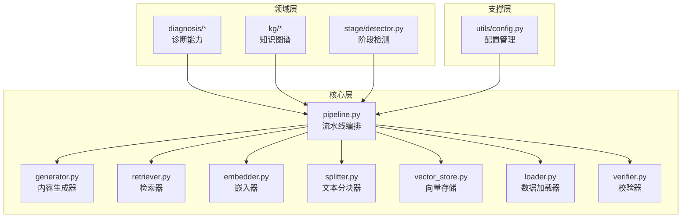
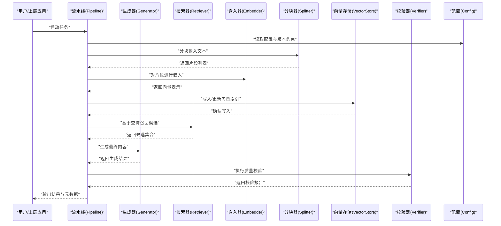
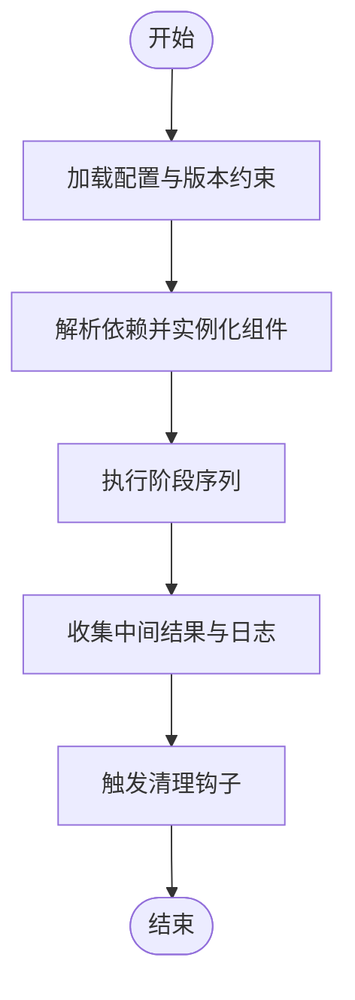
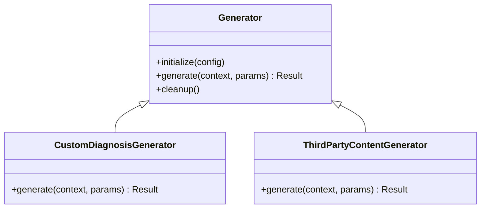
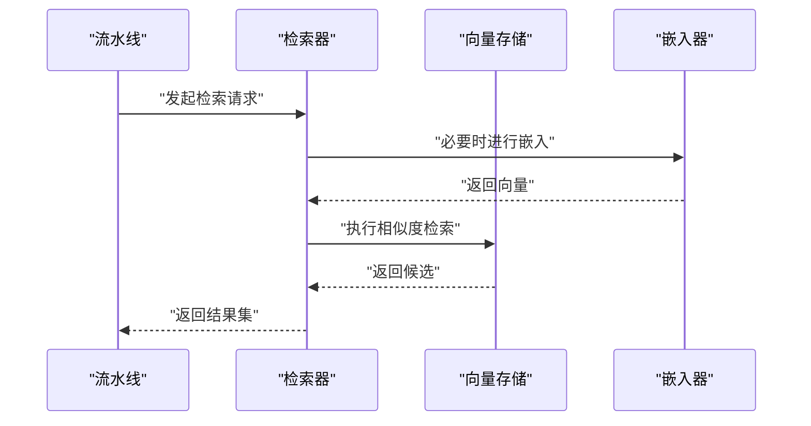
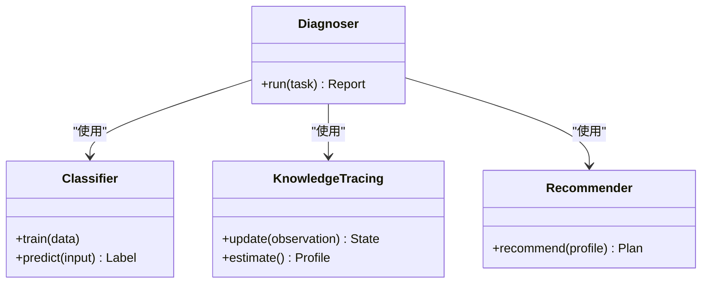
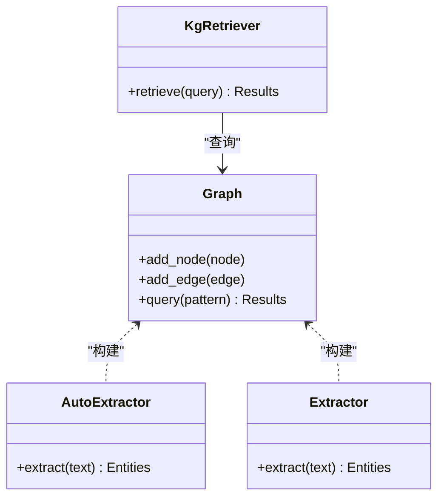
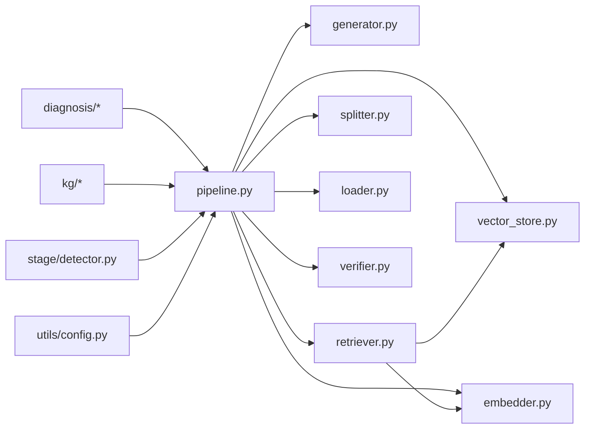

# 扩展点设计

<cite>
**本文引用的文件**   
- [src/kag_pro/core/pipeline.py](file://src/kag_pro/core/pipeline.py)
- [src/kag_pro/core/generator.py](file://src/kag_pro/core/generator.py)
- [src/kag_pro/core/retriever.py](file://src/kag_pro/core/retriever.py)
- [src/kag_pro/core/embedder.py](file://src/kag_pro/core/embedder.py)
- [src/kag_pro/core/splitter.py](file://src/kag_pro/core/splitter.py)
- [src/kag_pro/core/vector_store.py](file://src/kag_pro/core/vector_store.py)
- [src/kag_pro/core/loader.py](file://src/kag_pro/core/loader.py)
- [src/kag_pro/core/favorite_store.py](file://src/kag_pro/core/favorite_store.py)
- [src/kag_pro/core/paper_generator.py](file://src/kag_pro/core/paper_generator.py)
- [src/kag_pro/core/paper_store.py](file://src/kag_pro/core/paper_store.py)
- [src/kag_pro/core/verifier.py](file://src/kag_pro/core/verifier.py)
- [src/kag_pro/diagnosis/classifier.py](file://src/kag_pro/diagnosis/classifier.py)
- [src/kag_pro/diagnosis/diagnoser.py](file://src/kag_pro/diagnosis/diagnoser.py)
- [src/kag_pro/diagnosis/knowledge_tracing.py](file://src/kag_pro/diagnosis/knowledge_tracing.py)
- [src/kag_pro/diagnosis/recommender.py](file://src/kag_pro/diagnosis/recommender.py)
- [src/kag_pro/kg/graph.py](file://src/kag_pro/kg/graph.py)
- [src/kag_pro/kg/auto_extractor.py](file://src/kag_pro/kg/auto_extractor.py)
- [src/kag_pro/kg/extractor.py](file://src/kag_pro/kg/extractor.py)
- [src/kag_pro/kg/kg_retriever.py](file://src/kag_pro/kg/kg_retriever.py)
- [src/kag_pro/stage/detector.py](file://src/kag_pro/stage/detector.py)
- [src/kag_pro/utils/config.py](file://src/kag_pro/utils/config.py)
- [tests/test_pipeline.py](file://tests/test_pipeline.py)
- [tests/test_diagnoser.py](file://tests/test_diagnoser.py)
- [tests/test_classifier.py](file://tests/test_classifier.py)
- [tests/test_retriever.py](file://tests/test_retriever.py)
- [tests/test_splitter.py](file://tests/test_splitter.py)
- [tests/test_stage.py](file://tests/test_stage.py)
</cite>

## 目录
1. [简介](#简介)
2. [项目结构](#项目结构)
3. [核心组件](#核心组件)
4. [架构总览](#架构总览)
5. [详细组件分析](#详细组件分析)
6. [依赖关系分析](#依赖关系分析)
7. [性能考量](#性能考量)
8. [故障排查指南](#故障排查指南)
9. [结论](#结论)
10. [附录](#附录)

## 简介
本文件面向KAG-Pro的扩展点设计与插件化机制，目标是帮助开发者在不侵入核心代码的前提下，新增算法实现、自定义处理器与第三方集成。文档将围绕以下主题展开：
- 扩展点接口规范：抽象基类定义、必需方法与可选方法约定
- 注册与发现机制：动态加载、依赖注入、生命周期管理
- 开发示例：自定义诊断算法、内容生成器、评估指标
- 配置与管理：版本兼容性检查、热重载支持
- 测试策略与质量保证
- 最佳实践与常见问题

## 项目结构
KAG-Pro采用分层与模块化组织方式，核心能力集中在 src/kag_pro 下，按功能域划分模块：
- core：流水线编排与通用处理组件（生成、检索、嵌入、分块、向量存储、验证等）
- diagnosis：诊断相关能力（分类、知识追踪、推荐）
- kg：知识图谱构建与检索
- stage：阶段检测与流程控制
- utils：通用工具与配置
- tests：单元测试与集成测试

图表来源
- [src/kag_pro/core/pipeline.py](file://src/kag_pro/core/pipeline.py)
- [src/kag_pro/core/generator.py](file://src/kag_pro/core/generator.py)
- [src/kag_pro/core/retriever.py](file://src/kag_pro/core/retriever.py)
- [src/kag_pro/core/embedder.py](file://src/kag_pro/core/embedder.py)
- [src/kag_pro/core/splitter.py](file://src/kag_pro/core/splitter.py)
- [src/kag_pro/core/vector_store.py](file://src/kag_pro/core/vector_store.py)
- [src/kag_pro/core/loader.py](file://src/kag_pro/core/loader.py)
- [src/kag_pro/core/verifier.py](file://src/kag_pro/core/verifier.py)
- [src/kag_pro/diagnosis/classifier.py](file://src/kag_pro/diagnosis/classifier.py)
- [src/kag_pro/kg/graph.py](file://src/kag_pro/kg/graph.py)
- [src/kag_pro/stage/detector.py](file://src/kag_pro/stage/detector.py)
- [src/kag_pro/utils/config.py](file://src/kag_pro/utils/config.py)

章节来源
- [src/kag_pro/core/pipeline.py](file://src/kag_pro/core/pipeline.py)
- [src/kag_pro/core/generator.py](file://src/kag_pro/core/generator.py)
- [src/kag_pro/core/retriever.py](file://src/kag_pro/core/retriever.py)
- [src/kag_pro/core/embedder.py](file://src/kag_pro/core/embedder.py)
- [src/kag_pro/core/splitter.py](file://src/kag_pro/core/splitter.py)
- [src/kag_pro/core/vector_store.py](file://src/kag_pro/core/vector_store.py)
- [src/kag_pro/core/loader.py](file://src/kag_pro/core/loader.py)
- [src/kag_pro/core/verifier.py](file://src/kag_pro/core/verifier.py)
- [src/kag_pro/diagnosis/classifier.py](file://src/kag_pro/diagnosis/classifier.py)
- [src/kag_pro/kg/graph.py](file://src/kag_pro/kg/graph.py)
- [src/kag_pro/stage/detector.py](file://src/kag_pro/stage/detector.py)
- [src/kag_pro/utils/config.py](file://src/kag_pro/utils/config.py)

## 核心组件
本节聚焦于可扩展的核心组件及其在流水线中的角色，明确扩展点位置与职责边界：
- 流水线编排（Pipeline）：负责阶段调度、参数传递、错误传播与生命周期钩子
- 生成器（Generator）：内容生成的可插拔实现，支持多种模型或规则引擎
- 检索器（Retriever）：从向量库或知识图谱中召回候选
- 嵌入器（Embedder）：文本到向量的转换，支持多后端
- 分块器（Splitter）：长文本切分为片段，便于索引与检索
- 向量存储（VectorStore）：向量数据的持久化与查询
- 加载器（Loader）：外部数据源接入
- 校验器（Verifier）：输出质量与一致性校验

这些组件通过统一的接口契约被流水线调用，从而为扩展提供清晰的接入点。

章节来源
- [src/kag_pro/core/pipeline.py](file://src/kag_pro/core/pipeline.py)
- [src/kag_pro/core/generator.py](file://src/kag_pro/core/generator.py)
- [src/kag_pro/core/retriever.py](file://src/kag_pro/core/retriever.py)
- [src/kag_pro/core/embedder.py](file://src/kag_pro/core/embedder.py)
- [src/kag_pro/core/splitter.py](file://src/kag_pro/core/splitter.py)
- [src/kag_pro/core/vector_store.py](file://src/kag_pro/core/vector_store.py)
- [src/kag_pro/core/loader.py](file://src/kag_pro/core/loader.py)
- [src/kag_pro/core/verifier.py](file://src/kag_pro/core/verifier.py)

## 架构总览
下图展示了扩展点在系统中的位置与交互关系。核心流水线作为中枢，协调各扩展点完成端到端任务；诊断与知识图谱作为领域扩展，复用核心能力；配置模块贯穿全局，提供运行时参数与版本约束。

图表来源
- [src/kag_pro/core/pipeline.py](file://src/kag_pro/core/pipeline.py)
- [src/kag_pro/core/generator.py](file://src/kag_pro/core/generator.py)
- [src/kag_pro/core/retrieiver.py](file://src/kag_pro/core/retriever.py)
- [src/kag_pro/core/embedder.py](file://src/kag_pro/core/embedder.py)
- [src/kag_pro/core/splitter.py](file://src/kag_pro/core/splitter.py)
- [src/kag_pro/core/vector_store.py](file://src/kag_pro/core/vector_store.py)
- [src/kag_pro/core/verifier.py](file://src/kag_pro/core/verifier.py)
- [src/kag_pro/utils/config.py](file://src/kag_pro/utils/config.py)

## 详细组件分析

### 流水线编排（Pipeline）
- 职责：阶段编排、上下文传递、异常传播、生命周期钩子（初始化、运行、清理）
- 扩展点：
  - 阶段注册表：以类型或名称为键，映射到具体实现
  - 依赖注入：根据配置解析并实例化所需组件
  - 版本兼容：在启动时校验各组件版本与约束
- 典型流程：
  - 解析配置 -> 创建组件实例 -> 执行阶段 -> 收集结果 -> 触发清理

图表来源
- [src/kag_pro/core/pipeline.py](file://src/kag_pro/core/pipeline.py)
- [src/kag_pro/utils/config.py](file://src/kag_pro/utils/config.py)

章节来源
- [src/kag_pro/core/pipeline.py](file://src/kag_pro/core/pipeline.py)
- [src/kag_pro/utils/config.py](file://src/kag_pro/utils/config.py)

### 生成器（Generator）
- 职责：接收上下文与提示，产出结构化或非结构化内容
- 扩展点：
  - 统一接口：输入上下文、参数、返回结果与元数据
  - 可选钩子：预/后处理、缓存、重试
- 使用场景：
  - 自定义诊断算法的输出格式化
  - 第三方内容生成服务集成

图表来源
- [src/kag_pro/core/generator.py](file://src/kag_pro/core/generator.py)

章节来源
- [src/kag_pro/core/generator.py](file://src/kag_pro/core/generator.py)

### 检索器（Retriever）
- 职责：根据查询条件从向量库或知识图谱召回候选
- 扩展点：
  - 统一接口：输入查询、过滤条件、返回候选集
  - 后端切换：向量检索、图检索、混合检索
- 与嵌入器协作：先嵌入再检索，或按需实时嵌入

图表来源
- [src/kag_pro/core/retriever.py](file://src/kag_pro/core/retriever.py)
- [src/kag_pro/core/vector_store.py](file://src/kag_pro/core/vector_store.py)
- [src/kag_pro/core/embedder.py](file://src/kag_pro/core/embedder.py)

章节来源
- [src/kag_pro/core/retriever.py](file://src/kag_pro/core/retriever.py)
- [src/kag_pro/core/vector_store.py](file://src/kag_pro/core/vector_store.py)
- [src/kag_pro/core/embedder.py](file://src/kag_pro/core/embedder.py)

### 嵌入器（Embedder）
- 职责：将文本转换为向量表示，支持多后端与批量处理
- 扩展点：
  - 统一接口：输入文本批次、返回向量矩阵
  - 资源管理：连接池、批大小、超时与重试

章节来源
- [src/kag_pro/core/embedder.py](file://src/kag_pro/core/embedder.py)

### 分块器（Splitter）
- 职责：将长文本切分为适合处理的片段
- 扩展点：
  - 策略选择：固定长度、语义分割、层级切分
  - 元数据保留：段落、标题、页码等

章节来源
- [src/kag_pro/core/splitter.py](file://src/kag_pro/core/splitter.py)

### 向量存储（VectorStore）
- 职责：向量数据的增删改查与索引维护
- 扩展点：
  - 统一接口：upsert、query、delete、list
  - 持久化与分布式支持

章节来源
- [src/kag_pro/core/vector_store.py](file://src/kag_pro/core/vector_store.py)

### 加载器（Loader）
- 职责：从外部数据源加载原始数据，标准化格式
- 扩展点：
  - 数据源适配：文件系统、数据库、API
  - 增量加载与断点续传

章节来源
- [src/kag_pro/core/loader.py](file://src/kag_pro/core/loader.py)

### 校验器（Verifier）
- 职责：对生成结果进行质量与一致性校验
- 扩展点：
  - 规则校验：格式、必填字段、范围
  - 统计校验：分布、异常值检测

章节来源
- [src/kag_pro/core/verifier.py](file://src/kag_pro/core/verifier.py)

### 诊断模块（Diagnosis）
- 分类器（Classifier）：对用户表现进行分类或标签预测
- 诊断器（Diagnoser）：综合诊断流程编排
- 知识追踪（KnowledgeTracing）：学习轨迹建模与状态估计
- 推荐器（Recommender）：基于诊断结果推荐学习路径

图表来源
- [src/kag_pro/diagnosis/classifier.py](file://src/kag_pro/diagnosis/classifier.py)
- [src/kag_pro/diagnosis/diagnoser.py](file://src/kag_pro/diagnosis/diagnoser.py)
- [src/kag_pro/diagnosis/knowledge_tracing.py](file://src/kag_pro/diagnosis/knowledge_tracing.py)
- [src/kag_pro/diagnosis/recommender.py](file://src/kag_pro/diagnosis/recommender.py)

章节来源
- [src/kag_pro/diagnosis/classifier.py](file://src/kag_pro/diagnosis/classifier.py)
- [src/kag_pro/diagnosis/diagnoser.py](file://src/kag_pro/diagnosis/diagnoser.py)
- [src/kag_pro/diagnosis/knowledge_tracing.py](file://src/kag_pro/diagnosis/knowledge_tracing.py)
- [src/kag_pro/diagnosis/recommender.py](file://src/kag_pro/diagnosis/recommender.py)

### 知识图谱（KG）
- 图模型（Graph）：节点、边与属性管理
- 自动抽取（AutoExtractor）：从文本中抽取实体与关系
- 抽取器（Extractor）：规则或模型驱动的抽取
- 图谱检索（KgRetriever）：基于图的查询与推理

图表来源
- [src/kag_pro/kg/graph.py](file://src/kag_pro/kg/graph.py)
- [src/kag_pro/kg/auto_extractor.py](file://src/kag_pro/kg/auto_extractor.py)
- [src/kag_pro/kg/extractor.py](file://src/kag_pro/kg/extractor.py)
- [src/kag_pro/kg/kg_retriever.py](file://src/kag_pro/kg/kg_retriever.py)

章节来源
- [src/kag_pro/kg/graph.py](file://src/kag_pro/kg/graph.py)
- [src/kag_pro/kg/auto_extractor.py](file://src/kag_pro/kg/auto_extractor.py)
- [src/kag_pro/kg/extractor.py](file://src/kag_pro/kg/extractor.py)
- [src/kag_pro/kg/kg_retriever.py](file://src/kag_pro/kg/kg_retriever.py)

### 阶段检测（Stage Detector）
- 职责：识别当前任务所处阶段，驱动流程分支与策略选择
- 扩展点：
  - 阶段枚举与判定逻辑
  - 与流水线的集成钩子

章节来源
- [src/kag_pro/stage/detector.py](file://src/kag_pro/stage/detector.py)

### 配置管理（Config）
- 职责：集中管理运行时参数、组件版本约束与特性开关
- 扩展点：
  - 配置源：文件、环境变量、远程配置中心
  - 版本兼容性检查：最小/最大版本范围、弃用警告

章节来源
- [src/kag_pro/utils/config.py](file://src/kag_pro/utils/config.py)

## 依赖关系分析
下图展示核心组件之间的直接依赖关系，有助于理解扩展点耦合度与替换成本。

图表来源
- [src/kag_pro/core/pipeline.py](file://src/kag_pro/core/pipeline.py)
- [src/kag_pro/core/generator.py](file://src/kag_pro/core/generator.py)
- [src/kag_pro/core/retriever.py](file://src/kag_pro/core/retriever.py)
- [src/kag_pro/core/embedder.py](file://src/kag_pro/core/embedder.py)
- [src/kag_pro/core/splitter.py](file://src/kag_pro/core/splitter.py)
- [src/kag_pro/core/vector_store.py](file://src/kag_pro/core/vector_store.py)
- [src/kag_pro/core/loader.py](file://src/kag_pro/core/loader.py)
- [src/kag_pro/core/verifier.py](file://src/kag_pro/core/verifier.py)
- [src/kag_pro/diagnosis/classifier.py](file://src/kag_pro/diagnosis/classifier.py)
- [src/kag_pro/kg/graph.py](file://src/kag_pro/kg/graph.py)
- [src/kag_pro/stage/detector.py](file://src/kag_pro/stage/detector.py)
- [src/kag_pro/utils/config.py](file://src/kag_pro/utils/config.py)

章节来源
- [src/kag_pro/core/pipeline.py](file://src/kag_pro/core/pipeline.py)
- [src/kag_pro/core/generator.py](file://src/kag_pro/core/generator.py)
- [src/kag_pro/core/retriever.py](file://src/kag_pro/core/retriever.py)
- [src/kag_pro/core/embedder.py](file://src/kag_pro/core/embedder.py)
- [src/kag_pro/core/splitter.py](file://src/kag_pro/core/splitter.py)
- [src/kag_pro/core/vector_store.py](file://src/kag_pro/core/vector_store.py)
- [src/kag_pro/core/loader.py](file://src/kag_pro/core/loader.py)
- [src/kag_pro/core/verifier.py](file://src/kag_pro/core/verifier.py)
- [src/kag_pro/diagnosis/classifier.py](file://src/kag_pro/diagnosis/classifier.py)
- [src/kag_pro/kg/graph.py](file://src/kag_pro/kg/graph.py)
- [src/kag_pro/stage/detector.py](file://src/kag_pro/stage/detector.py)
- [src/kag_pro/utils/config.py](file://src/kag_pro/utils/config.py)

## 性能考量
- 批处理与并发：嵌入与检索应支持批量操作与异步并发，降低I/O开销
- 缓存策略：对高频查询与生成结果进行缓存，注意失效与一致性
- 内存管理：大文本分块与向量矩阵需控制峰值内存占用
- 资源池：连接池、线程池与GPU资源池提升吞吐
- 监控与度量：关键路径耗时、错误率与资源利用率上报

[本节为通用指导，不直接分析具体文件]

## 故障排查指南
- 版本冲突：检查配置中的版本约束与组件实际版本，定位不兼容项
- 依赖缺失：确认组件实例化所需的依赖是否可用（如外部服务、密钥）
- 数据不一致：校验嵌入维度、向量索引与查询条件是否匹配
- 生成失败：查看生成器日志与校验器报告，定位提示词或参数问题
- 检索超时：调整检索器超时与重试策略，检查向量存储健康状态

章节来源
- [src/kag_pro/utils/config.py](file://src/kag_pro/utils/config.py)
- [src/kag_pro/core/pipeline.py](file://src/kag_pro/core/pipeline.py)
- [src/kag_pro/core/verifier.py](file://src/kag_pro/core/verifier.py)

## 结论
KAG-Pro通过明确的扩展点与统一的接口契约，实现了高内聚、低耦合的插件化架构。开发者可在不修改核心代码的情况下，灵活替换或增强各组件能力。配合完善的配置管理与测试策略，系统具备良好的可维护性与演进性。

[本节为总结性内容，不直接分析具体文件]

## 附录

### 扩展点接口规范（建议）
- 抽象基类约定：
  - initialize(config): 初始化与资源准备
  - run(context, params): 核心处理逻辑
  - cleanup(): 释放资源与清理状态
- 可选钩子：
  - pre_process(context): 预处理
  - post_process(result): 后处理
  - on_error(error): 错误处理回调
- 版本信息：
  - version: 组件版本字符串
  - compatible_with: 兼容的版本范围

[本节为通用规范建议，不直接分析具体文件]

### 注册与发现机制（建议）
- 注册表：以类型或名称为键，保存实现类或工厂函数
- 动态加载：基于配置扫描包路径，自动发现并注册实现
- 依赖注入：根据声明式依赖解析并构造实例
- 生命周期：启动时初始化、运行时调用、关闭时清理

[本节为通用机制建议，不直接分析具体文件]

### 开发示例（建议）
- 自定义诊断算法：
  - 继承诊断器基类，实现诊断流程与结果聚合
  - 注册到流水线，并在配置中启用
- 自定义内容生成器：
  - 实现生成器接口，封装第三方API或本地模型
  - 添加缓存与重试逻辑，提升稳定性
- 自定义评估指标：
  - 实现指标计算函数，纳入校验器或独立评估流程
  - 输出结构化报告供后续分析

[本节为示例建议，不直接分析具体文件]

### 配置与管理（建议）
- 版本兼容性检查：
  - 在配置中声明最小/最大版本，启动时校验并告警
- 热重载支持：
  - 监听配置变更，动态刷新组件实例与路由表
  - 保证无中断切换与状态迁移安全

[本节为通用管理建议，不直接分析具体文件]

### 测试策略与质量保证（建议）
- 单元测试：覆盖各组件接口与边界条件
- 集成测试：端到端流水线验证，包含异常路径
- 回归测试：版本升级后的行为一致性验证
- 性能基准：吞吐、延迟与资源消耗基线

章节来源
- [tests/test_pipeline.py](file://tests/test_pipeline.py)
- [tests/test_diagnoser.py](file://tests/test_diagnoser.py)
- [tests/test_classifier.py](file://tests/test_classifier.py)
- [tests/test_retriever.py](file://tests/test_retriever.py)
- [tests/test_splitter.py](file://tests/test_splitter.py)
- [tests/test_stage.py](file://tests/test_stage.py)

### 最佳实践与常见问题（建议）
- 最佳实践：
  - 单一职责：每个扩展点只关注一个能力
  - 幂等设计：避免重复执行导致副作用
  - 可观测性：记录关键日志与指标
- 常见问题：
  - 循环依赖：通过接口解耦与延迟加载解决
  - 配置漂移：集中化管理与变更审计
  - 资源泄漏：确保清理钩子可靠执行

[本节为通用实践建议，不直接分析具体文件]