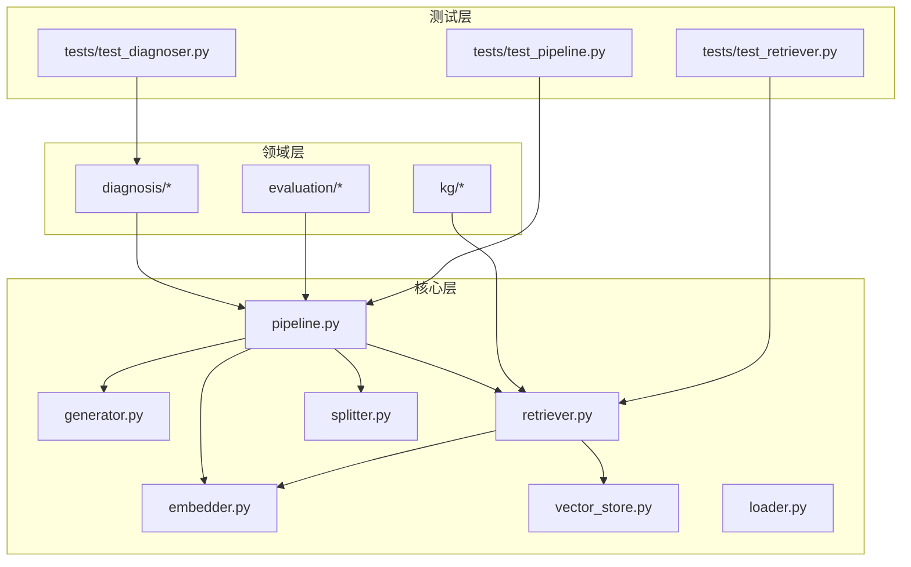
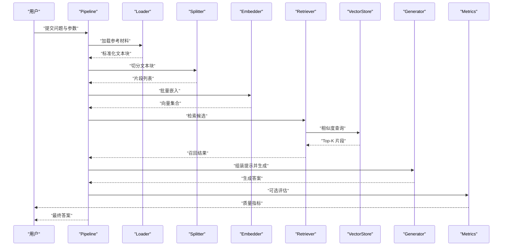
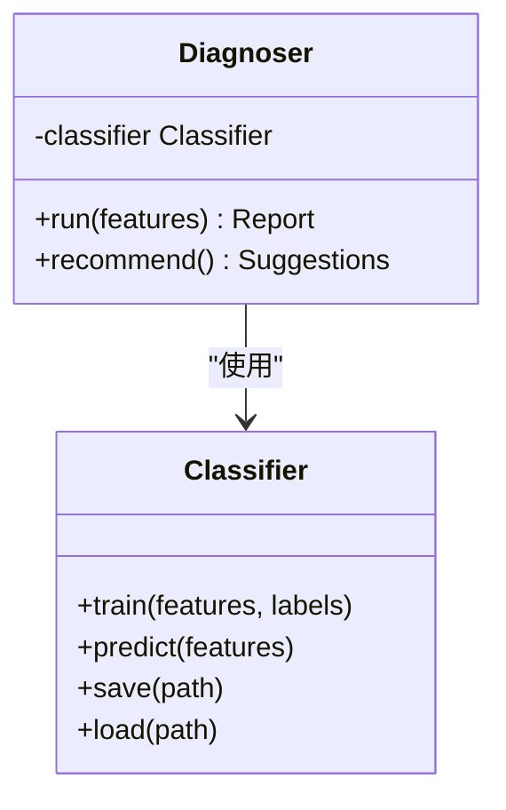
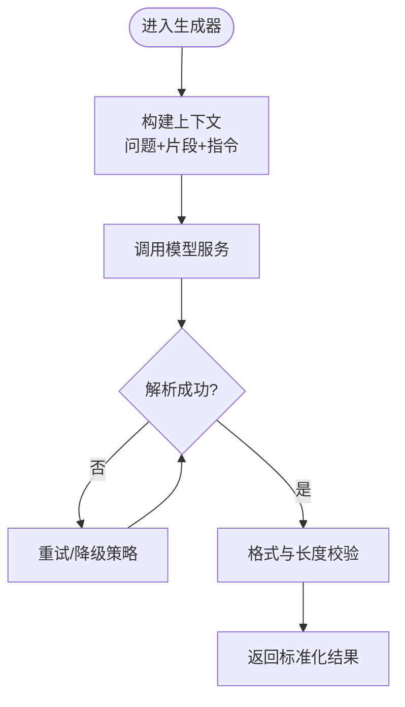
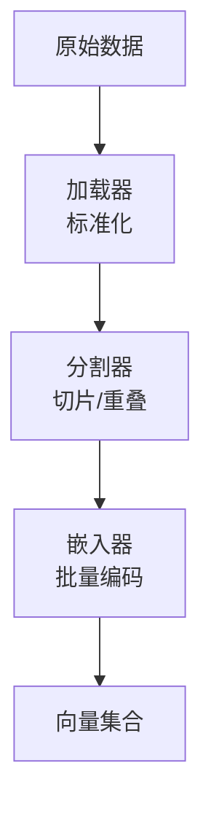
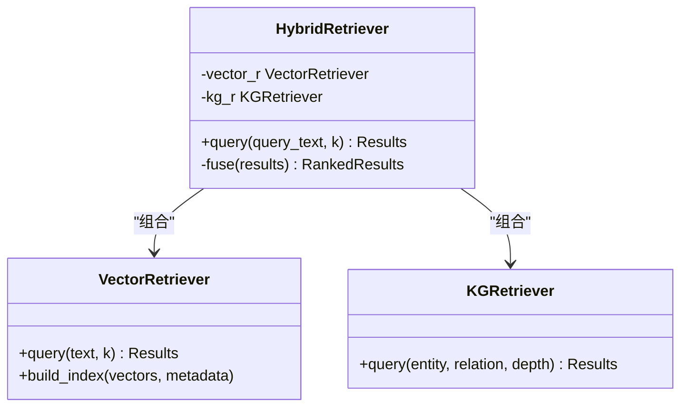
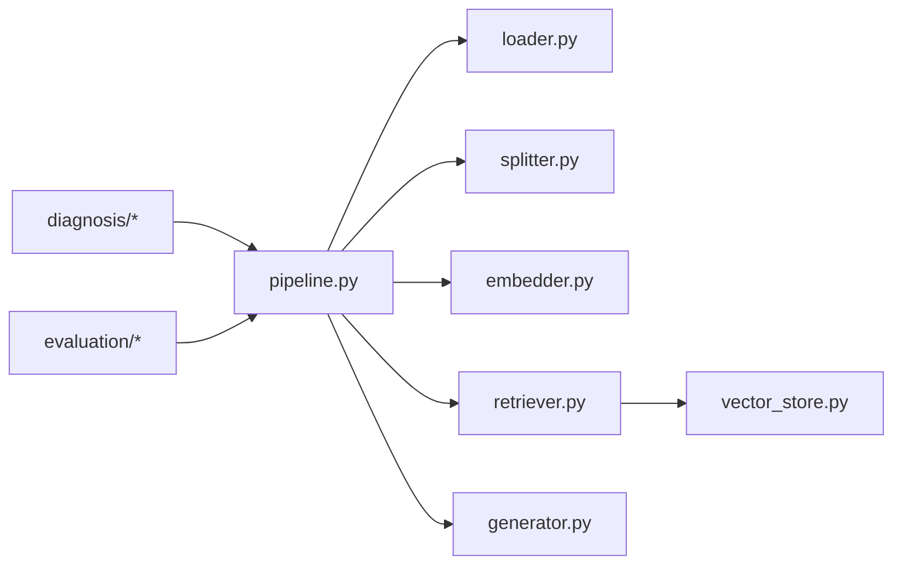

# 插件开发指南

<cite>
**本文引用的文件**   
- [README.md](file://README.md)
- [pyproject.toml](file://pyproject.toml)
- [src/kag_pro/core/pipeline.py](file://src/kag_pro/core/pipeline.py)
- [src/kag_pro/core/generator.py](file://src/kag_pro/core/generator.py)
- [src/kag_pro/core/retriever.py](file://src/kag_pro/core/retriever.py)
- [src/kag_pro/core/embedder.py](file://src/kag_pro/core/embedder.py)
- [src/kag_pro/core/splitter.py](file://src/kag_pro/core/splitter.py)
- [src/kag_pro/core/vector_store.py](file://src/kag_pro/core/vector_store.py)
- [src/kag_pro/core/loader.py](file://src/kag_pro/core/loader.py)
- [src/kag_pro/diagnosis/classifier.py](file://src/kag_pro/diagnosis/classifier.py)
- [src/kag_pro/diagnosis/diagnoser.py](file://src/kag_pro/diagnosis/diagnoser.py)
- [src/kag_pro/kg/kg_retriever.py](file://src/kag_pro/kg/kg_retriever.py)
- [src/kag_pro/evaluation/metrics.py](file://src/kag_pro/evaluation/metrics.py)
- [tests/test_pipeline.py](file://tests/test_pipeline.py)
- [tests/test_diagnoser.py](file://tests/test_diagnoser.py)
- [tests/test_retriever.py](file://tests/test_retriever.py)
</cite>

## 目录
1. [简介](#简介)
2. [项目结构](#项目结构)
3. [核心组件](#核心组件)
4. [架构总览](#架构总览)
5. [详细组件分析](#详细组件分析)
6. [依赖分析](#依赖分析)
7. [性能考虑](#性能考虑)
8. [故障排查指南](#故障排查指南)
9. [结论](#结论)
10. [附录](#附录)

## 简介
本指南面向希望在 KAG-Pro 中开发自定义插件的工程师，覆盖诊断算法、内容生成器与数据处理管道的实现方法。文档将说明插件的目录结构与命名约定、配置要求、调试与测试策略、性能优化与内存管理最佳实践，以及打包分发与版本管理流程，并提供从简单验证器到复杂混合检索器的完整示例路径与模板建议。

## 项目结构
KAG-Pro 采用分层模块化组织：核心能力位于 core 包，领域能力（如诊断、知识图谱）位于各自子包，评估指标在 evaluation，测试用例在 tests。插件应遵循相同风格，保持高内聚低耦合，并通过接口契约与核心模块交互。

图表来源
- [src/kag_pro/core/pipeline.py](file://src/kag_pro/core/pipeline.py)
- [src/kag_pro/core/generator.py](file://src/kag_pro/core/generator.py)
- [src/kag_pro/core/retriever.py](file://src/kag_pro/core/retriever.py)
- [src/kag_pro/core/embedder.py](file://src/kag_pro/core/embedder.py)
- [src/kag_pro/core/splitter.py](file://src/kag_pro/core/splitter.py)
- [src/kag_pro/core/vector_store.py](file://src/kag_pro/core/vector_store.py)
- [src/kag_pro/diagnosis/diagnoser.py](file://src/kag_pro/diagnosis/diagnoser.py)
- [src/kag_pro/kg/kg_retriever.py](file://src/kag_pro/kg/kg_retriever.py)
- [src/kag_pro/evaluation/metrics.py](file://src/kag_pro/evaluation/metrics.py)
- [tests/test_pipeline.py](file://tests/test_pipeline.py)
- [tests/test_diagnoser.py](file://tests/test_diagnoser.py)
- [tests/test_retriever.py](file://tests/test_retriever.py)

章节来源
- [README.md](file://README.md)
- [pyproject.toml](file://pyproject.toml)

## 核心组件
- 管道编排 pipeline：负责串联加载、切分、嵌入、检索、生成等阶段，提供统一的输入输出契约与错误传播机制。
- 生成器 generator：封装提示词组装、模型调用与结果后处理，支持多种生成策略。
- 检索器 retriever：统一向量检索与知识图谱检索入口，支持多路召回与融合排序。
- 嵌入器 embedder：文本向量化抽象，屏蔽不同后端差异。
- 分割器 splitter：按语义或规则对长文本进行分段，控制上下文窗口与检索粒度。
- 向量存储 vector_store：索引构建、写入与相似度查询。
- 数据加载 loader：统一读取外部数据源并标准化为内部表示。

章节来源
- [src/kag_pro/core/pipeline.py](file://src/kag_pro/core/pipeline.py)
- [src/kag_pro/core/generator.py](file://src/kag_pro/core/generator.py)
- [src/kag_pro/core/retriever.py](file://src/kag_pro/core/retriever.py)
- [src/kag_pro/core/embedder.py](file://src/kag_pro/core/embedder.py)
- [src/kag_pro/core/splitter.py](file://src/kag_pro/core/splitter.py)
- [src/kag_pro/core/vector_store.py](file://src/kag_pro/core/vector_store.py)
- [src/kag_pro/core/loader.py](file://src/kag_pro/core/loader.py)

## 架构总览
下图展示了典型问答链路：用户问题经管道编排，依次通过加载、切分、嵌入、检索（向量+KG）、生成与评估。插件可替换任意环节的实现以扩展能力。

图表来源
- [src/kag_pro/core/pipeline.py](file://src/kag_pro/core/pipeline.py)
- [src/kag_pro/core/loader.py](file://src/kag_pro/core/loader.py)
- [src/kag_pro/core/splitter.py](file://src/kag_pro/core/splitter.py)
- [src/kag_pro/core/embedder.py](file://src/kag_pro/core/embedder.py)
- [src/kag_pro/core/retriever.py](file://src/kag_pro/core/retriever.py)
- [src/kag_pro/core/vector_store.py](file://src/kag_pro/core/vector_store.py)
- [src/kag_pro/core/generator.py](file://src/kag_pro/core/generator.py)
- [src/kag_pro/evaluation/metrics.py](file://src/kag_pro/evaluation/metrics.py)

## 详细组件分析

### 诊断算法插件（分类器与诊断器）
- 目标：基于学习行为或知识掌握度进行诊断与推荐，作为管道中的“诊断阶段”插件。
- 关键类与方法
  - 分类器 classifier：定义训练/推理接口、特征工程与阈值策略。
  - 诊断器 diagnoser：编排分类器、聚合证据、输出诊断报告与建议。
- 集成点：在 pipeline 中插入诊断节点，或在生成前/后进行诊断干预。

图表来源
- [src/kag_pro/diagnosis/classifier.py](file://src/kag_pro/diagnosis/classifier.py)
- [src/kag_pro/diagnosis/diagnoser.py](file://src/kag_pro/diagnosis/diagnoser.py)

章节来源
- [src/kag_pro/diagnosis/classifier.py](file://src/kag_pro/diagnosis/classifier.py)
- [src/kag_pro/diagnosis/diagnoser.py](file://src/kag_pro/diagnosis/diagnoser.py)
- [tests/test_diagnoser.py](file://tests/test_diagnoser.py)

### 内容生成器插件
- 目标：封装提示词模板、模型调用与结果校验，支持多策略组合。
- 设计要点：
  - 输入规范化：将检索到的片段与问题组装成结构化上下文。
  - 输出约束：返回标准化对象，便于后续评估与审计。
  - 容错重试：网络异常与超时重试策略。

图表来源
- [src/kag_pro/core/generator.py](file://src/kag_pro/core/generator.py)

章节来源
- [src/kag_pro/core/generator.py](file://src/kag_pro/core/generator.py)

### 数据处理管道插件（加载、切分、嵌入）
- 加载器 loader：对接多数据源，输出统一的数据块。
- 分割器 splitter：按段落、句子或滑动窗口切分，控制重叠率与最大长度。
- 嵌入器 embedder：批量向量化，支持缓存与批大小调优。

图表来源
- [src/kag_pro/core/loader.py](file://src/kag_pro/core/loader.py)
- [src/kag_pro/core/splitter.py](file://src/kag_pro/core/splitter.py)
- [src/kag_pro/core/embedder.py](file://src/kag_pro/core/embedder.py)

章节来源
- [src/kag_pro/core/loader.py](file://src/kag_pro/core/loader.py)
- [src/kag_pro/core/splitter.py](file://src/kag_pro/core/splitter.py)
- [src/kag_pro/core/embedder.py](file://src/kag_pro/core/embedder.py)

### 检索器插件（向量检索与混合检索）
- 向量检索：基于向量存储进行相似度搜索，支持 Top-K、过滤条件与权重。
- 知识图谱检索：结合图结构关系进行实体/关系级召回。
- 混合检索：多路召回后融合排序，提升鲁棒性与准确率。

图表来源
- [src/kag_pro/core/retriever.py](file://src/kag_pro/core/retriever.py)
- [src/kag_pro/core/vector_store.py](file://src/kag_pro/core/vector_store.py)
- [src/kag_pro/kg/kg_retriever.py](file://src/kag_pro/kg/kg_retriever.py)

章节来源
- [src/kag_pro/core/retriever.py](file://src/kag_pro/core/retriever.py)
- [src/kag_pro/core/vector_store.py](file://src/kag_pro/core/vector_store.py)
- [src/kag_pro/kg/kg_retriever.py](file://src/kag_pro/kg/kg_retriever.py)
- [tests/test_retriever.py](file://tests/test_retriever.py)

## 依赖分析
- 组件耦合
  - pipeline 强依赖 loader、splitter、embedder、retriever、generator。
  - retriever 依赖 embedder 与 vector_store；KG 检索器独立于向量存储但可与之协同。
  - diagnosis 与 evaluation 作为横切关注点，可在 pipeline 中按需挂载。
- 外部依赖
  - 向量数据库与模型服务通过抽象接口接入，便于替换与扩展。

图表来源
- [src/kag_pro/core/pipeline.py](file://src/kag_pro/core/pipeline.py)
- [src/kag_pro/core/loader.py](file://src/kag_pro/core/loader.py)
- [src/kag_pro/core/splitter.py](file://src/kag_pro/core/splitter.py)
- [src/kag_pro/core/embedder.py](file://src/kag_pro/core/embedder.py)
- [src/kag_pro/core/retriever.py](file://src/kag_pro/core/retriever.py)
- [src/kag_pro/core/vector_store.py](file://src/kag_pro/core/vector_store.py)
- [src/kag_pro/core/generator.py](file://src/kag_pro/core/generator.py)
- [src/kag_pro/diagnosis/diagnoser.py](file://src/kag_pro/diagnosis/diagnoser.py)
- [src/kag_pro/evaluation/metrics.py](file://src/kag_pro/evaluation/metrics.py)

章节来源
- [src/kag_pro/core/pipeline.py](file://src/kag_pro/core/pipeline.py)
- [src/kag_pro/core/retriever.py](file://src/kag_pro/core/retriever.py)
- [src/kag_pro/core/generator.py](file://src/kag_pro/core/generator.py)

## 性能考虑
- 批处理与并行
  - 嵌入与检索尽量使用批量 API，减少往返开销。
  - 合理设置 batch_size 与并发度，避免 OOM。
- 索引与缓存
  - 向量索引增量更新，冷启动时预构建。
  - 对热点片段与中间结果做轻量缓存。
- 内存管理
  - 及时释放大对象引用，避免持有全量上下文。
  - 流式处理长文本，降低峰值内存。
- 评估与监控
  - 引入延迟、吞吐、命中率等指标，定位瓶颈。
  - 对生成结果进行抽样评估，持续回归。

[本节为通用指导，不直接分析具体文件]

## 故障排查指南
- 常见问题
  - 管道阶段失败：检查各阶段输入输出契约与类型一致性。
  - 检索为空：确认索引是否构建完成、查询向量维度匹配。
  - 生成超时：调整重试次数与超时阈值，检查模型服务状态。
- 定位手段
  - 单元测试：针对单个组件编写断言，快速隔离问题。
  - 集成测试：端到端验证 pipeline 链路，模拟真实数据分布。
  - 日志与指标：记录关键步骤耗时与异常堆栈。

章节来源
- [tests/test_pipeline.py](file://tests/test_pipeline.py)
- [tests/test_diagnoser.py](file://tests/test_diagnoser.py)
- [tests/test_retriever.py](file://tests/test_retriever.py)

## 结论
通过在 pipeline 中按契约替换或新增组件，开发者可以灵活扩展诊断算法、生成策略与检索方案。遵循本文的结构规范、测试与性能建议，可显著提升插件的可维护性与稳定性。

[本节为总结性内容，不直接分析具体文件]

## 附录

### 插件目录结构与命名约定
- 目录建议
  - src/plugins/<plugin_name>/：插件根目录
  - src/plugins/<plugin_name>/core.py：主入口，注册组件
  - src/plugins/<plugin_name>/config.py：配置项与默认值
  - src/plugins/<plugin_name>/models.py：数据模型与序列化
  - src/plugins/<plugin_name>/utils.py：工具函数
  - tests/test_<plugin_name>.py：单元测试
- 命名约定
  - 模块名小写下划线分隔，类名大驼峰，常量全大写。
  - 配置文件键名小写下划线，层级清晰。

[本节为概念性内容，不直接分析具体文件]

### 配置文件要求
- 必备字段
  - 插件名称、版本、描述
  - 组件注册表（名称→类路径）
  - 运行时参数（模型地址、向量库连接、阈值等）
- 校验与默认值
  - 提供 schema 校验与默认值回退，确保健壮性。

[本节为概念性内容，不直接分析具体文件]

### 插件开发示例（从简单到复杂）
- 简单验证器
  - 目标：对生成结果进行基础校验（非空、长度、格式）。
  - 集成点：在 pipeline 末尾插入验证阶段。
- 复杂混合检索器
  - 目标：组合向量检索与 KG 检索，并进行融合排序。
  - 集成点：替换 pipeline 中的检索器实现。

[本节为概念性内容，不直接分析具体文件]

### 调试与测试方法
- 单元测试
  - 针对每个组件的最小可用场景编写断言，覆盖边界条件。
- 集成测试
  - 构造最小数据集，端到端运行 pipeline，断言关键指标。
- 回归测试
  - 保存基准结果，变更代码后对比差异。

章节来源
- [tests/test_pipeline.py](file://tests/test_pipeline.py)
- [tests/test_diagnoser.py](file://tests/test_diagnoser.py)
- [tests/test_retriever.py](file://tests/test_retriever.py)

### 性能优化与内存管理最佳实践
- 批处理与异步
  - 合并请求、提高吞吐。
- 索引与缓存
  - 预构建索引、热点缓存。
- 资源回收
  - 显式关闭连接、释放句柄。

[本节为通用指导，不直接分析具体文件]

### 打包、分发与版本管理
- 打包
  - 使用标准 Python 打包工具，声明依赖与入口点。
- 分发
  - 私有仓库或 PyPI，附带 README 与示例。
- 版本管理
  - 语义化版本，变更日志与维护者信息。

章节来源
- [pyproject.toml](file://pyproject.toml)

### 模板代码与脚手架工具
- 模板清单
  - 诊断算法模板：包含训练/推理/保存加载骨架。
  - 生成器模板：提示词组装、调用与校验骨架。
  - 检索器模板：向量/KG 双路检索与融合骨架。
- 脚手架
  - 一键创建插件目录、配置文件与测试骨架。

[本节为概念性内容，不直接分析具体文件]