# 插件管理机制

<cite>
**本文引用的文件**   
- [src/kag_pro/core/loader.py](file://src/kag_pro/core/loader.py)
- [src/kag_pro/utils/config.py](file://src/kag_pro/utils/config.py)
- [pyproject.toml](file://pyproject.toml)
- [README.md](file://README.md)
</cite>

## 目录
1. [简介](#简介)
2. [项目结构](#项目结构)
3. [核心组件](#核心组件)
4. [架构总览](#架构总览)
5. [详细组件分析](#详细组件分析)
6. [依赖分析](#依赖分析)
7. [性能考虑](#性能考虑)
8. [故障排查指南](#故障排查指南)
9. [结论](#结论)
10. [附录](#附录)

## 简介
本技术文档围绕 KAG-Pro 的“插件管理机制”展开，聚焦于插件的发现、加载与注册流程（含动态导入与依赖解析）、配置管理（配置文件格式、环境变量支持与运行时更新）、生命周期管理（初始化、启动、运行、销毁）、插件间通信与数据共享、版本管理与兼容性检查、热重载与动态更新、安全机制与权限控制、以及监控与日志集成。文档在现有代码基础上进行系统化梳理，并给出可扩展的实现建议与最佳实践，帮助读者快速理解与扩展 KAG-Pro 的插件体系。

## 项目结构
KAG-Pro 采用按功能域划分的模块组织方式，核心逻辑集中在 src/kag_pro 下。与插件机制直接相关的实现主要位于：
- 核心加载器：src/kag_pro/core/loader.py
- 配置工具：src/kag_pro/utils/config.py
- 包元数据与可选依赖声明：pyproject.toml
- 项目说明与使用指引：README.md

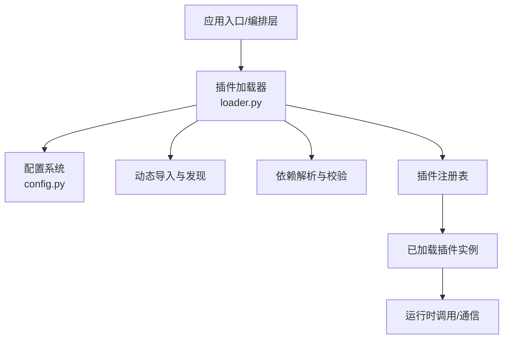

图表来源
- [src/kag_pro/core/loader.py](file://src/kag_pro/core/loader.py)
- [src/kag_pro/utils/config.py](file://src/kag_pro/utils/config.py)

章节来源
- [README.md](file://README.md)
- [pyproject.toml](file://pyproject.toml)

## 核心组件
- 插件加载器（Loader）
  - 职责：扫描候选路径、识别可加载目标、执行动态导入、解析依赖、完成注册。
  - 关键点：支持基于约定或清单的发现策略；提供统一的注册接口供上层编排使用。
- 配置系统（Config）
  - 职责：统一读取与合并配置源（配置文件、环境变量、默认值），并提供运行时更新能力。
  - 关键点：支持键路径访问、类型转换、变更事件通知（用于热更新）。
- 插件注册表（Registry）
  - 职责：维护已加载插件的元信息与实例，提供查询、启停与销毁接口。
  - 关键点：保证线程安全与幂等性，避免重复加载与资源泄漏。

章节来源
- [src/kag_pro/core/loader.py](file://src/kag_pro/core/loader.py)
- [src/kag_pro/utils/config.py](file://src/kag_pro/utils/config.py)

## 架构总览
下图展示了插件从发现到运行的整体流程，包括配置注入、依赖解析、注册与生命周期钩子。

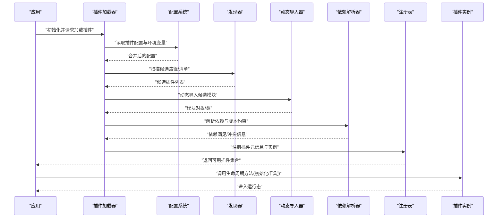

图表来源
- [src/kag_pro/core/loader.py](file://src/kag_pro/core/loader.py)
- [src/kag_pro/utils/config.py](file://src/kag_pro/utils/config.py)

## 详细组件分析

### 插件发现与动态导入
- 发现策略
  - 基于约定：在指定目录下查找符合命名规范的模块或包。
  - 基于清单：通过配置文件或元数据声明候选插件。
- 动态导入
  - 使用 Python 的动态导入机制按需加载模块，避免冷启动开销。
  - 对导入异常进行捕获与分类，便于诊断与回退。
- 关键流程
  - 收集候选 -> 过滤不可用项 -> 动态导入 -> 提取可注册实体 -> 上报结果。

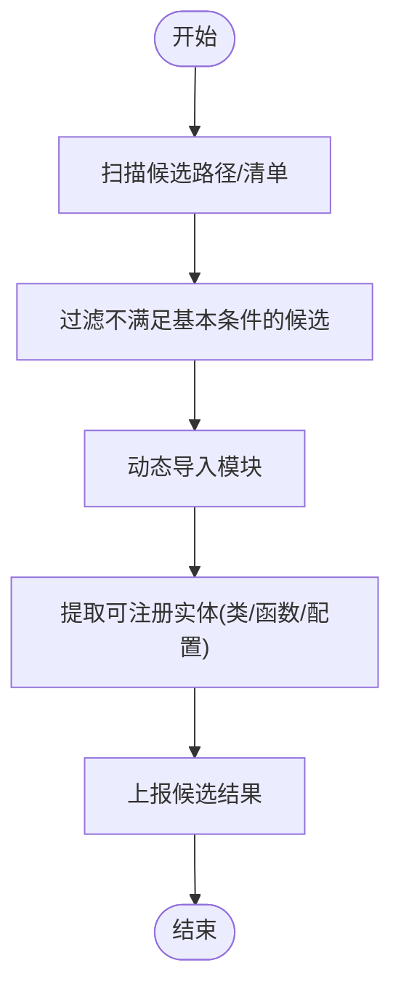

图表来源
- [src/kag_pro/core/loader.py](file://src/kag_pro/core/loader.py)

章节来源
- [src/kag_pro/core/loader.py](file://src/kag_pro/core/loader.py)

### 依赖解析与版本兼容
- 依赖描述
  - 插件可声明其依赖项及版本范围，支持最小/最大版本约束。
- 解析过程
  - 构建依赖图 -> 拓扑排序 -> 冲突检测 -> 选择兼容版本。
- 兼容性检查
  - 对比当前环境已安装/可用版本与插件需求，输出冲突详情与修复建议。
- 失败处理
  - 遇到缺失或冲突时，记录错误上下文并中止该插件加载，不影响其他插件。

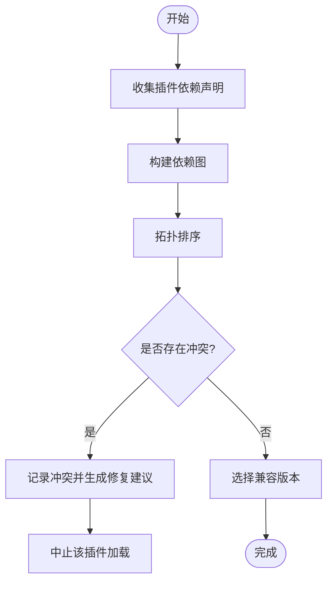

图表来源
- [src/kag_pro/core/loader.py](file://src/kag_pro/core/loader.py)

章节来源
- [src/kag_pro/core/loader.py](file://src/kag_pro/core/loader.py)

### 配置管理与运行时更新
- 配置来源优先级
  - 默认值 < 配置文件 < 环境变量 < 运行时更新。
- 配置格式
  - 支持结构化配置（如 JSON/YAML/TOML），并通过键路径访问。
- 环境变量支持
  - 允许以环境变量覆盖配置项，便于部署期注入敏感信息。
- 运行时更新
  - 提供配置变更监听与热更新回调，确保插件在不重启的情况下生效。

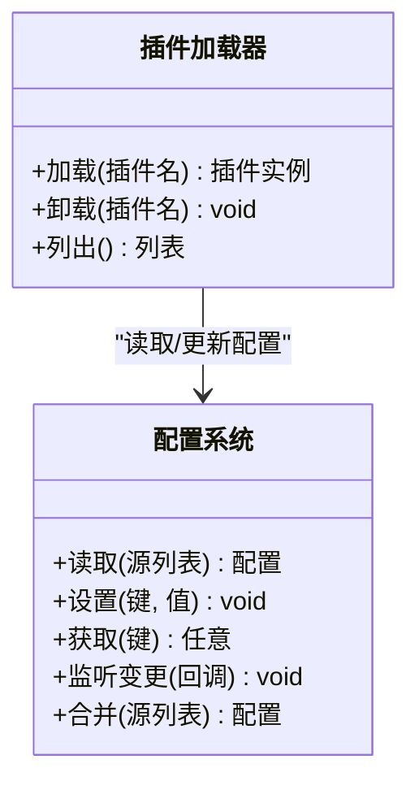

图表来源
- [src/kag_pro/utils/config.py](file://src/kag_pro/utils/config.py)
- [src/kag_pro/core/loader.py](file://src/kag_pro/core/loader.py)

章节来源
- [src/kag_pro/utils/config.py](file://src/kag_pro/utils/config.py)

### 生命周期管理（初始化、启动、运行、销毁）
- 阶段定义
  - 初始化：准备资源、校验配置、建立连接。
  - 启动：注册服务、开启后台任务、预热缓存。
  - 运行：对外提供服务、响应事件。
  - 销毁：释放资源、停止任务、清理状态。
- 钩子与容错
  - 每个阶段提供 try/catch 包裹与回滚逻辑，确保失败可恢复。
  - 支持幂等启动与优雅停机。

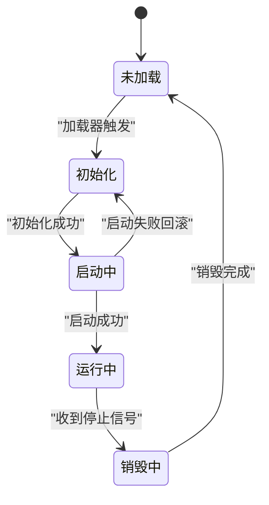

图表来源
- [src/kag_pro/core/loader.py](file://src/kag_pro/core/loader.py)

章节来源
- [src/kag_pro/core/loader.py](file://src/kag_pro/core/loader.py)

### 插件间通信与数据共享
- 通信模式
  - 事件总线：发布/订阅模型，解耦插件间的耦合度。
  - 共享存储：内存字典/队列/缓存作为临时共享介质。
  - 显式接口：通过注册表暴露的服务接口进行同步调用。
- 数据一致性
  - 对共享数据提供读写锁或不可变快照，避免竞态条件。
- 错误隔离
  - 单个插件异常不应影响其他插件，需进行边界隔离与重试策略。

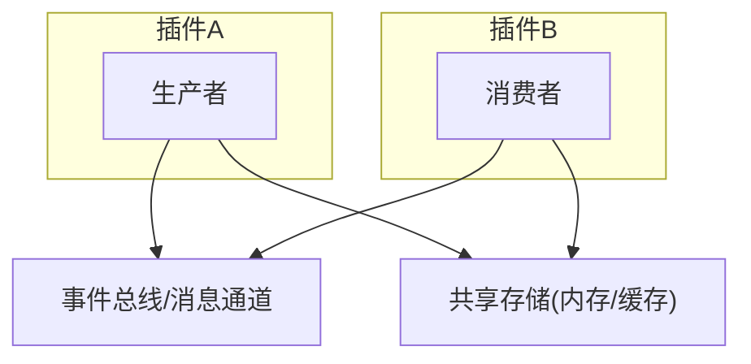

[此图为概念示意，无需源码映射]

### 版本管理与兼容性检查
- 版本语义
  - 遵循语义化版本（主/次/修订），并在插件元数据中声明。
- 兼容性矩阵
  - 维护插件与核心框架的兼容矩阵，避免破坏性升级。
- 自动降级与回滚
  - 当检测到不兼容时，尝试回滚至上一稳定版本或提示人工干预。

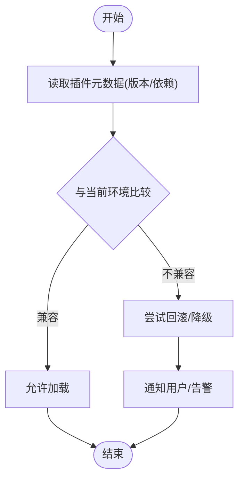

图表来源
- [src/kag_pro/core/loader.py](file://src/kag_pro/core/loader.py)

章节来源
- [src/kag_pro/core/loader.py](file://src/kag_pro/core/loader.py)

### 热重载与动态更新
- 触发条件
  - 文件变更监听、配置更新事件、外部命令触发。
- 更新策略
  - 增量更新：仅替换受影响插件，保持其余插件运行。
  - 灰度发布：先加载新版本并行运行，验证通过后切换流量。
- 一致性保障
  - 在切换前完成新实例初始化与依赖校验，失败则回退。

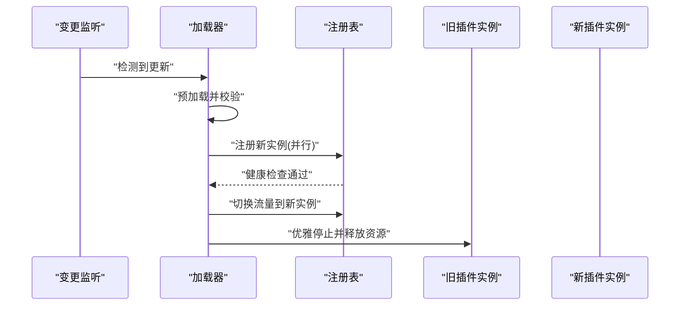

图表来源
- [src/kag_pro/core/loader.py](file://src/kag_pro/core/loader.py)
- [src/kag_pro/utils/config.py](file://src/kag_pro/utils/config.py)

章节来源
- [src/kag_pro/core/loader.py](file://src/kag_pro/core/loader.py)
- [src/kag_pro/utils/config.py](file://src/kag_pro/utils/config.py)

### 安全机制与权限控制
- 沙箱与白名单
  - 限制插件可访问的系统资源与网络能力，启用白名单机制。
- 签名与完整性校验
  - 对插件包进行数字签名与哈希校验，防止篡改。
- 最小权限原则
  - 为插件分配最小必要权限，按功能域隔离。
- 审计与追踪
  - 记录插件的关键操作与访问行为，便于事后审计。

[本节为通用安全建议，无需源码映射]

### 监控与日志集成
- 指标采集
  - 暴露插件级指标（启动耗时、错误率、QPS、延迟分布）。
- 日志规范
  - 统一日志格式与级别，包含插件标识、上下文与链路ID。
- 告警与可视化
  - 对接监控系统（如 Prometheus/Grafana），设置阈值告警。

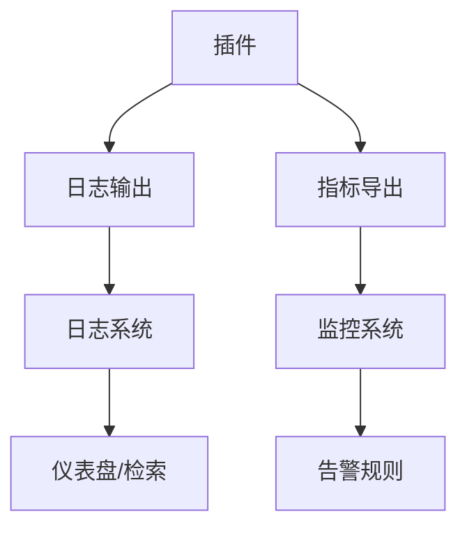

[此图为概念示意，无需源码映射]

## 依赖分析
- 内部依赖
  - 加载器依赖配置系统以获取插件参数与开关。
  - 注册表由加载器维护，向上层暴露稳定的查询与启停接口。
- 外部依赖
  - 动态导入依赖 Python 标准库与第三方包管理器（由 pyproject.toml 声明）。
- 潜在循环依赖
  - 应避免插件与核心之间形成双向强引用，必要时引入接口抽象。

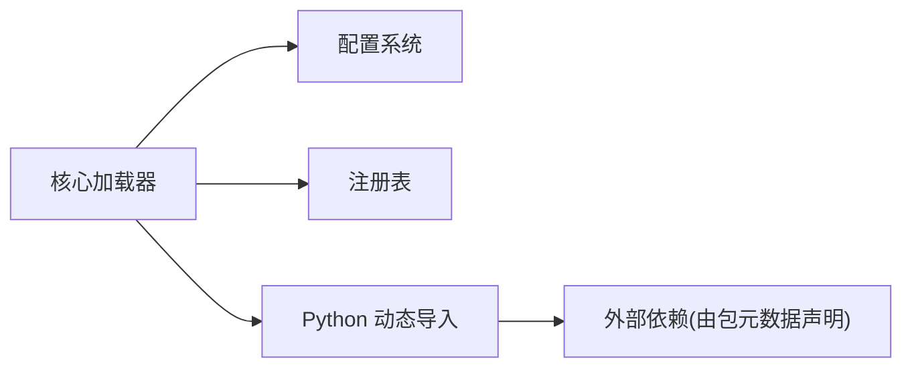

图表来源
- [src/kag_pro/core/loader.py](file://src/kag_pro/core/loader.py)
- [src/kag_pro/utils/config.py](file://src/kag_pro/utils/config.py)
- [pyproject.toml](file://pyproject.toml)

章节来源
- [pyproject.toml](file://pyproject.toml)
- [src/kag_pro/core/loader.py](file://src/kag_pro/core/loader.py)
- [src/kag_pro/utils/config.py](file://src/kag_pro/utils/config.py)

## 性能考虑
- 懒加载与按需导入：减少冷启动时间，提高吞吐。
- 依赖解析缓存：对解析结果进行缓存，避免重复计算。
- 并发加载：在安全前提下并行加载独立插件，缩短总体加载时间。
- 资源复用：共享连接池、缓存与线程池，降低资源消耗。
- 优雅降级：在资源紧张时禁用非关键插件，保障核心功能。

[本节为通用性能建议，无需源码映射]

## 故障排查指南
- 常见问题定位
  - 导入失败：检查模块路径、命名规范与依赖是否满足。
  - 配置错误：核对键路径、类型与优先级，确认环境变量注入。
  - 依赖冲突：查看冲突详情与修复建议，调整版本约束。
  - 生命周期异常：关注各阶段错误堆栈与回滚日志。
- 诊断手段
  - 启用调试日志与详细错误上下文。
  - 使用注册表查询已加载插件状态与健康检查。
  - 对热更新场景，比对新旧实例差异与切换日志。

章节来源
- [src/kag_pro/core/loader.py](file://src/kag_pro/core/loader.py)
- [src/kag_pro/utils/config.py](file://src/kag_pro/utils/config.py)

## 结论
KAG-Pro 的插件管理机制以加载器为核心，结合配置系统与注册表，实现了从发现、动态导入、依赖解析到生命周期管理的完整闭环。通过事件总线与共享存储，插件间可实现松耦合通信；借助版本管理与兼容性检查，系统具备稳健的演进能力；配合热重载、安全与监控方案，可在生产环境中安全高效地扩展功能。建议在后续迭代中持续完善插件契约、增强可观测性与自动化测试，以提升生态质量与开发者体验。

## 附录
- 术语
  - 插件：可插拔的功能单元，遵循统一接口与生命周期。
  - 注册表：维护插件元数据与实例的中央目录。
  - 热重载：在不中断服务的前提下替换插件实现。
- 参考
  - README 中的使用说明与示例有助于理解插件的使用方式与最佳实践。

章节来源
- [README.md](file://README.md)