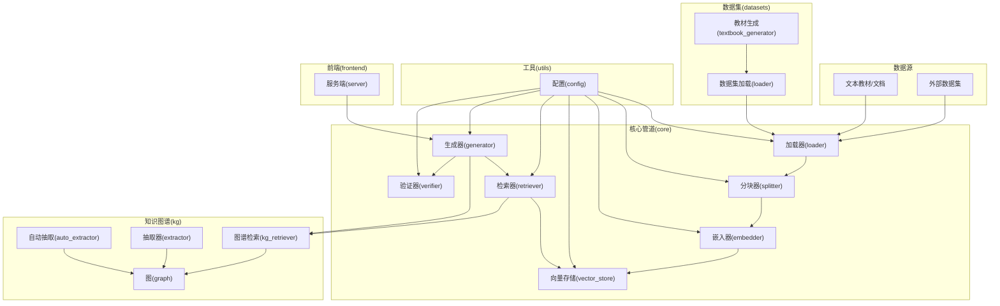
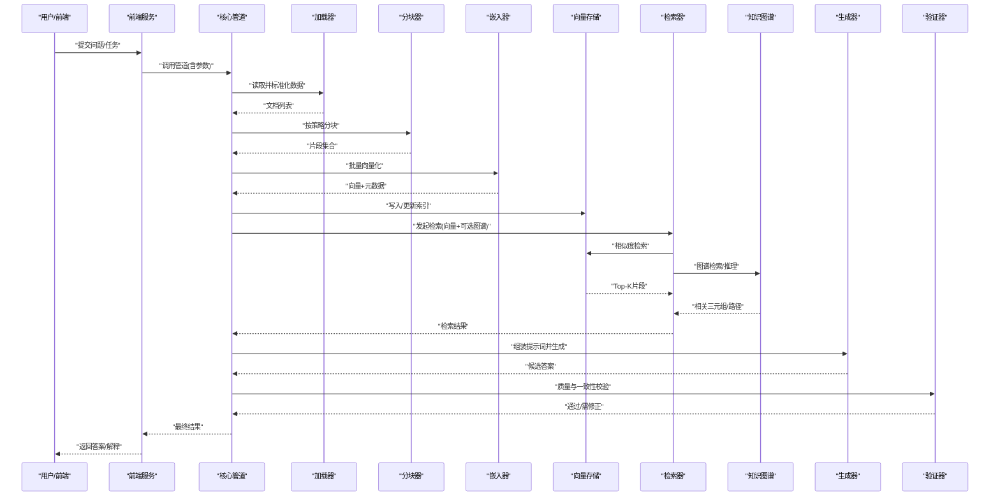
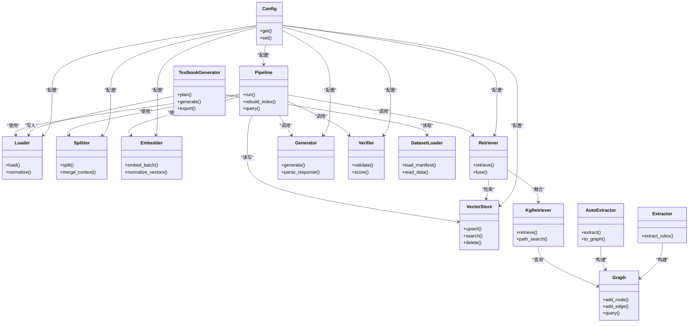

# 数据流设计

<cite>
**本文引用的文件**   
- [README.md](file://README.md)
- [DATA_MANIFEST.md](file://DATA_MANIFEST.md)
- [src/kag_pro/core/pipeline.py](file://src/kag_pro/core/pipeline.py)
- [src/kag_pro/core/loader.py](file://src/kag_pro/core/loader.py)
- [src/kag_pro/core/splitter.py](file://src/kag_pro/core/splitter.py)
- [src/kag_pro/core/embedder.py](file://src/kag_pro/core/embedder.py)
- [src/kag_pro/core/vector_store.py](file://src/kag_pro/core/vector_store.py)
- [src/kag_pro/core/retriever.py](file://src/kag_pro/core/retriever.py)
- [src/kag_pro/core/generator.py](file://src/kag_pro/core/generator.py)
- [src/kag_pro/core/verifier.py](file://src/kag_pro/core/verifier.py)
- [src/kag_pro/kg/graph.py](file://src/kag_pro/kg/graph.py)
- [src/kag_pro/kg/auto_extractor.py](file://src/kag_pro/kg/auto_extractor.py)
- [src/kag_pro/kg/extractor.py](file://src/kag_pro/kg/extractor.py)
- [src/kag_pro/kg/kg_retriever.py](file://src/kag_pro/kg/kg_retriever.py)
- [src/kag_pro/datasets/textbook_generator.py](file://src/kag_pro/datasets/textbook_generator.py)
- [src/kag_pro/datasets/loader.py](file://src/kag_pro/datasets/loader.py)
- [src/kag_pro/utils/config.py](file://src/kag_pro/utils/config.py)
- [frontend/server.py](file://frontend/server.py)
- [notebooks/00_rag_prototype.ipynb](file://notebooks/00_rag_prototype.ipynb)
</cite>

## 目录
1. [简介](#简介)
2. [项目结构](#项目结构)
3. [核心组件](#核心组件)
4. [架构总览](#架构总览)
5. [详细组件分析](#详细组件分析)
6. [依赖关系分析](#依赖关系分析)
7. [性能考虑](#性能考虑)
8. [故障排查指南](#故障排查指南)
9. [结论](#结论)
10. [附录](#附录)

## 简介
本文件面向KAG-Pro的数据流设计与实现，系统性阐述从原始数据输入到最终结果输出的完整流转过程。文档覆盖数据格式转换、预处理与后处理逻辑、组件间数据传递机制（数据结构定义、序列化与传输协议）、缓存策略与内存管理、大数据集处理方式与性能优化技巧、数据流监控与调试工具、数据一致性与事务处理机制，以及数据迁移与版本管理的最佳实践。目标是帮助开发者快速理解并高效扩展系统的数据管道。

## 项目结构
KAG-Pro采用分层与模块化组织方式：
- 核心数据管道位于 src/kag_pro/core，包含加载、分块、向量化、检索、生成与验证等阶段。
- 知识图谱相关能力位于 src/kag_pro/kg，提供图构建、抽取与检索。
- 数据集与教材生成位于 src/kag_pro/datasets，负责教材类数据的构造与导出。
- 配置与通用工具位于 src/kag_pro/utils。
- 前端服务位于 frontend，用于交互与可视化。
- 示例与原型在 notebooks 中。

图表来源
- [src/kag_pro/core/pipeline.py](file://src/kag_pro/core/pipeline.py)
- [src/kag_pro/core/loader.py](file://src/kag_pro/core/loader.py)
- [src/kag_pro/core/splitter.py](file://src/kag_pro/core/splitter.py)
- [src/kag_pro/core/embedder.py](file://src/kag_pro/core/embedder.py)
- [src/kag_pro/core/vector_store.py](file://src/kag_pro/core/vector_store.py)
- [src/kag_pro/core/retriever.py](file://src/kag_pro/core/retriever.py)
- [src/kag_pro/core/generator.py](file://src/kag_pro/core/generator.py)
- [src/kag_pro/core/verifier.py](file://src/kag_pro/core/verifier.py)
- [src/kag_pro/kg/graph.py](file://src/kag_pro/kg/graph.py)
- [src/kag_pro/kg/auto_extractor.py](file://src/kag_pro/kg/auto_extractor.py)
- [src/kag_pro/kg/extractor.py](file://src/kag_pro/kg/extractor.py)
- [src/kag_pro/kg/kg_retriever.py](file://src/kag_pro/kg/kg_retriever.py)
- [src/kag_pro/datasets/textbook_generator.py](file://src/kag_pro/datasets/textbook_generator.py)
- [src/kag_pro/datasets/loader.py](file://src/kag_pro/datasets/loader.py)
- [src/kag_pro/utils/config.py](file://src/kag_pro/utils/config.py)
- [frontend/server.py](file://frontend/server.py)

章节来源
- [README.md](file://README.md)
- [DATA_MANIFEST.md](file://DATA_MANIFEST.md)

## 核心组件
本节概述数据流中的关键组件及其职责：
- 加载器：统一接入多种数据源（本地文本、外部数据集），输出标准化文档对象。
- 分块器：将长文档切分为适合检索的片段，维护上下文与元数据。
- 嵌入器：将文本片段转换为向量表示，支持批量与并发控制。
- 向量存储：持久化与查询向量索引，支持相似度检索与过滤。
- 检索器：融合向量检索与知识图谱检索，返回候选片段与图谱证据。
- 生成器：基于检索结果调用大模型进行答案生成，支持提示词模板与参数控制。
- 验证器：对生成结果进行一致性、事实性与质量校验，必要时触发修正或降级。
- 知识图谱：提供实体/关系抽取、图构建与图谱检索，增强可解释性。
- 教材生成：面向教学场景的数据合成与结构化输出。
- 配置：集中管理各组件参数、路径与后端服务地址。

章节来源
- [src/kag_pro/core/loader.py](file://src/kag_pro/core/loader.py)
- [src/kag_pro/core/splitter.py](file://src/kag_pro/core/splitter.py)
- [src/kag_pro/core/embedder.py](file://src/kag_pro/core/embedder.py)
- [src/kag_pro/core/vector_store.py](file://src/kag_pro/core/vector_store.py)
- [src/kag_pro/core/retriever.py](file://src/kag_pro/core/retriever.py)
- [src/kag_pro/core/generator.py](file://src/kag_pro/core/generator.py)
- [src/kag_pro/core/verifier.py](file://src/kag_pro/core/verifier.py)
- [src/kag_pro/kg/graph.py](file://src/kag_pro/kg/graph.py)
- [src/kag_pro/kg/auto_extractor.py](file://src/kag_pro/kg/auto_extractor.py)
- [src/kag_pro/kg/extractor.py](file://src/kag_pro/kg/extractor.py)
- [src/kag_pro/kg/kg_retriever.py](file://src/kag_pro/kg/kg_retriever.py)
- [src/kag_pro/datasets/textbook_generator.py](file://src/kag_pro/datasets/textbook_generator.py)
- [src/kag_pro/datasets/loader.py](file://src/kag_pro/datasets/loader.py)
- [src/kag_pro/utils/config.py](file://src/kag_pro/utils/config.py)

## 架构总览
下图展示端到端数据流：从原始文本到检索增强生成，再到结果验证与输出；同时体现知识图谱增强的双向通道。

图表来源
- [src/kag_pro/core/pipeline.py](file://src/kag_pro/core/pipeline.py)
- [src/kag_pro/core/loader.py](file://src/kag_pro/core/loader.py)
- [src/kag_pro/core/splitter.py](file://src/kag_pro/core/splitter.py)
- [src/kag_pro/core/embedder.py](file://src/kag_pro/core/embedder.py)
- [src/kag_pro/core/vector_store.py](file://src/kag_pro/core/vector_store.py)
- [src/kag_pro/core/retriever.py](file://src/kag_pro/core/retriever.py)
- [src/kag_pro/kg/kg_retriever.py](file://src/kag_pro/kg/kg_retriever.py)
- [src/kag_pro/core/generator.py](file://src/kag_pro/core/generator.py)
- [src/kag_pro/core/verifier.py](file://src/kag_pro/core/verifier.py)
- [frontend/server.py](file://frontend/server.py)

## 详细组件分析

### 数据加载与标准化
- 目标：将多源异构数据统一为内部文档对象，便于后续分块与检索。
- 关键点：
  - 支持本地文本与外部数据集加载。
  - 字段规范化（如标题、正文、来源、时间戳、标签）。
  - 错误容错与跳过机制，保证流水线健壮性。
- 典型流程：
  - 解析输入路径/清单 -> 读取内容 -> 清洗与编码 -> 构造文档对象 -> 输出迭代器。

章节来源
- [src/kag_pro/core/loader.py](file://src/kag_pro/core/loader.py)
- [src/kag_pro/datasets/loader.py](file://src/kag_pro/datasets/loader.py)
- [DATA_MANIFEST.md](file://DATA_MANIFEST.md)

### 文本分块与上下文保持
- 目标：将长文档切分为适合检索的片段，保留必要上下文与元信息。
- 关键点：
  - 按语义/长度/段落等多策略切分。
  - 维护片段ID、父文档ID、重叠窗口、位置偏移。
  - 支持增量更新与去重。
- 典型流程：
  - 输入文档 -> 应用分块策略 -> 生成片段列表 -> 附加元数据 -> 输出。

章节来源
- [src/kag_pro/core/splitter.py](file://src/kag_pro/core/splitter.py)

### 向量化与索引构建
- 目标：将文本片段转为向量并写入向量存储，建立高效相似度检索索引。
- 关键点：
  - 批量嵌入、并发控制、失败重试。
  - 向量维度、归一化、距离度量可配置。
  - 索引持久化与热更新。
- 典型流程：
  - 接收片段 -> 批量嵌入 -> 写入向量存储 -> 更新统计指标。

章节来源
- [src/kag_pro/core/embedder.py](file://src/kag_pro/core/embedder.py)
- [src/kag_pro/core/vector_store.py](file://src/kag_pro/core/vector_store.py)

### 检索融合与证据聚合
- 目标：结合向量检索与知识图谱检索，返回高质量候选与可解释证据。
- 关键点：
  - 向量相似度Top-K与阈值过滤。
  - 图谱路径/邻居检索与相关性打分。
  - 结果融合排序与去重。
- 典型流程：
  - 查询编码 -> 并行检索(向量/图谱) -> 合并排序 -> 返回片段与证据。

章节来源
- [src/kag_pro/core/retriever.py](file://src/kag_pro/core/retriever.py)
- [src/kag_pro/kg/kg_retriever.py](file://src/kag_pro/kg/kg_retriever.py)

### 生成与提示工程
- 目标：基于检索结果生成准确、连贯且可解释的答案。
- 关键点：
  - 动态提示词组装（问题、上下文、证据、约束）。
  - 温度、最大长度、停止条件等参数可调。
  - 流式输出与超时控制。
- 典型流程：
  - 组装提示 -> 调用生成接口 -> 解析响应 -> 结构化输出。

章节来源
- [src/kag_pro/core/generator.py](file://src/kag_pro/core/generator.py)

### 结果验证与质量控制
- 目标：确保生成结果的事实性、一致性与可用性。
- 关键点：
  - 规则校验（格式、必填字段、范围）。
  - 事实性检查（与检索证据对齐）。
  - 置信度评分与回退策略。
- 典型流程：
  - 接收候选答案 -> 执行多项校验 -> 输出评分/修正建议 -> 决定通过或重试。

章节来源
- [src/kag_pro/core/verifier.py](file://src/kag_pro/core/verifier.py)

### 知识图谱构建与检索
- 目标：从文本中抽取实体与关系，构建可查询的知识图谱，增强检索可解释性。
- 关键点：
  - 自动抽取与人工标注辅助。
  - 图节点/边建模与属性管理。
  - 图谱检索与路径推理。
- 典型流程：
  - 文本/片段 -> 抽取器 -> 图更新 -> 图谱检索 -> 返回证据。

章节来源
- [src/kag_pro/kg/graph.py](file://src/kag_pro/kg/graph.py)
- [src/kag_pro/kg/auto_extractor.py](file://src/kag_pro/kg/auto_extractor.py)
- [src/kag_pro/kg/extractor.py](file://src/kag_pro/kg/extractor.py)
- [src/kag_pro/kg/kg_retriever.py](file://src/kag_pro/kg/kg_retriever.py)

### 教材生成与数据集构建
- 目标：面向教学场景，自动生成结构化教材与配套数据集。
- 关键点：
  - 主题规划、内容生成、结构化输出。
  - 与数据加载器对接，形成闭环。
- 典型流程：
  - 主题/大纲 -> 生成内容 -> 格式化导出 -> 入库/索引。

章节来源
- [src/kag_pro/datasets/textbook_generator.py](file://src/kag_pro/datasets/textbook_generator.py)
- [src/kag_pro/datasets/loader.py](file://src/kag_pro/datasets/loader.py)

### 配置与环境管理
- 目标：统一管理各组件参数、路径与后端服务地址。
- 关键点：
  - 环境变量与配置文件双轨。
  - 默认值与覆盖策略。
  - 运行时参数注入。

章节来源
- [src/kag_pro/utils/config.py](file://src/kag_pro/utils/config.py)

### 前端与服务集成
- 目标：提供Web界面与API，驱动数据管道运行与结果展示。
- 关键点：
  - 请求路由与参数校验。
  - 异步任务与进度反馈。
  - 结果渲染与下载。

章节来源
- [frontend/server.py](file://frontend/server.py)

## 依赖关系分析
核心组件之间的依赖关系如下：

图表来源
- [src/kag_pro/core/pipeline.py](file://src/kag_pro/core/pipeline.py)
- [src/kag_pro/core/loader.py](file://src/kag_pro/core/loader.py)
- [src/kag_pro/core/splitter.py](file://src/kag_pro/core/splitter.py)
- [src/kag_pro/core/embedder.py](file://src/kag_pro/core/embedder.py)
- [src/kag_pro/core/vector_store.py](file://src/kag_pro/core/vector_store.py)
- [src/kag_pro/core/retriever.py](file://src/kag_pro/core/retriever.py)
- [src/kag_pro/core/generator.py](file://src/kag_pro/core/generator.py)
- [src/kag_pro/core/verifier.py](file://src/kag_pro/core/verifier.py)
- [src/kag_pro/kg/graph.py](file://src/kag_pro/kg/graph.py)
- [src/kag_pro/kg/auto_extractor.py](file://src/kag_pro/kg/auto_extractor.py)
- [src/kag_pro/kg/extractor.py](file://src/kag_pro/kg/extractor.py)
- [src/kag_pro/kg/kg_retriever.py](file://src/kag_pro/kg/kg_retriever.py)
- [src/kag_pro/datasets/textbook_generator.py](file://src/kag_pro/datasets/textbook_generator.py)
- [src/kag_pro/datasets/loader.py](file://src/kag_pro/datasets/loader.py)
- [src/kag_pro/utils/config.py](file://src/kag_pro/utils/config.py)

章节来源
- [src/kag_pro/core/pipeline.py](file://src/kag_pro/core/pipeline.py)
- [src/kag_pro/utils/config.py](file://src/kag_pro/utils/config.py)

## 性能考虑
- 批处理与并发：
  - 嵌入与检索阶段启用批量操作与并发限制，避免资源争用。
- 内存管理：
  - 流式读取与惰性计算，减少峰值内存占用。
  - 大向量分片写入与压缩存储。
- 索引优化：
  - 合理选择Top-K与相似度阈值，平衡召回率与延迟。
  - 定期重建与增量更新策略。
- 缓存策略：
  - 热点片段与常用查询结果缓存，设置过期与失效策略。
- 网络与I/O：
  - 连接池与重试退避，降低外部服务抖动影响。
- 监控与告警：
  - 记录吞吐、延迟、错误率，设置阈值告警。

[本节为通用指导，不直接分析具体文件]

## 故障排查指南
- 常见问题定位：
  - 加载失败：检查数据路径、权限与编码。
  - 分块异常：确认分块策略与边界条件。
  - 嵌入错误：核对模型维度与输入长度限制。
  - 检索无结果：调整Top-K、阈值与权重。
  - 生成超时：缩短上下文或降低温度。
  - 验证失败：查看校验规则与证据对齐情况。
- 日志与追踪：
  - 在各阶段输出结构化日志，包含输入摘要、耗时与关键指标。
  - 为每次查询分配唯一追踪ID，贯穿全流程。
- 诊断工具：
  - 使用笔记本原型进行交互式调试与可视化。
  - 前端服务提供状态页与慢查询分析。

章节来源
- [notebooks/00_rag_prototype.ipynb](file://notebooks/00_rag_prototype.ipynb)
- [frontend/server.py](file://frontend/server.py)

## 结论
KAG-Pro的数据流以“加载-分块-嵌入-索引-检索-生成-验证”为主线，辅以知识图谱增强与教材生成能力，形成可扩展、可观测、可运维的端到端管道。通过合理的批处理、缓存与监控策略，可在大规模数据与高并发场景下保持稳定性能与高质量输出。

[本节为总结性内容，不直接分析具体文件]

## 附录

### 数据格式与序列化约定
- 文档对象：包含标题、正文、来源、时间戳、标签等字段。
- 片段对象：继承文档元数据，增加片段ID、父文档ID、位置偏移与重叠信息。
- 向量对象：包含向量数组、维度、归一化标志与关联ID。
- 检索结果：包含片段列表、证据列表、分数与排序原因。
- 生成结果：包含答案文本、引用来源、置信度与校验报告。

章节来源
- [src/kag_pro/core/loader.py](file://src/kag_pro/core/loader.py)
- [src/kag_pro/core/splitter.py](file://src/kag_pro/core/splitter.py)
- [src/kag_pro/core/embedder.py](file://src/kag_pro/core/embedder.py)
- [src/kag_pro/core/retriever.py](file://src/kag_pro/core/retriever.py)
- [src/kag_pro/core/generator.py](file://src/kag_pro/core/generator.py)
- [src/kag_pro/core/verifier.py](file://src/kag_pro/core/verifier.py)

### 传输协议与接口
- 前端与服务：HTTP/REST或WebSocket，用于提交任务与获取进度/结果。
- 组件间通信：进程内函数调用为主，必要时使用消息队列或RPC。
- 外部服务：嵌入与生成接口遵循各自SDK/REST约定，统一封装于配置与适配器层。

章节来源
- [frontend/server.py](file://frontend/server.py)
- [src/kag_pro/utils/config.py](file://src/kag_pro/utils/config.py)

### 数据一致性与事务处理
- 写入原子性：向量与图谱更新采用事务或幂等键，避免部分成功导致不一致。
- 版本化：为索引与图谱引入版本号，支持回滚与对比。
- 校验点：在关键阶段插入校验与补偿逻辑，确保端到端一致性。

章节来源
- [src/kag_pro/core/vector_store.py](file://src/kag_pro/core/vector_store.py)
- [src/kag_pro/kg/graph.py](file://src/kag_pro/kg/graph.py)

### 数据迁移与版本管理
- 清单驱动：使用数据清单管理数据源与版本，便于审计与回溯。
- 增量迁移：支持增量导入与差异合并，减少全量重建成本。
- 兼容策略：向前兼容旧格式，逐步淘汰废弃字段。

章节来源
- [DATA_MANIFEST.md](file://DATA_MANIFEST.md)
- [src/kag_pro/datasets/loader.py](file://src/kag_pro/datasets/loader.py)