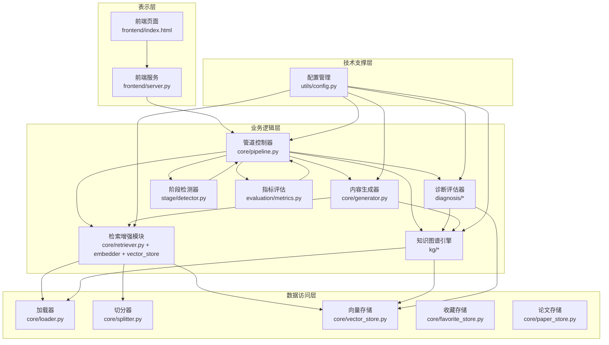
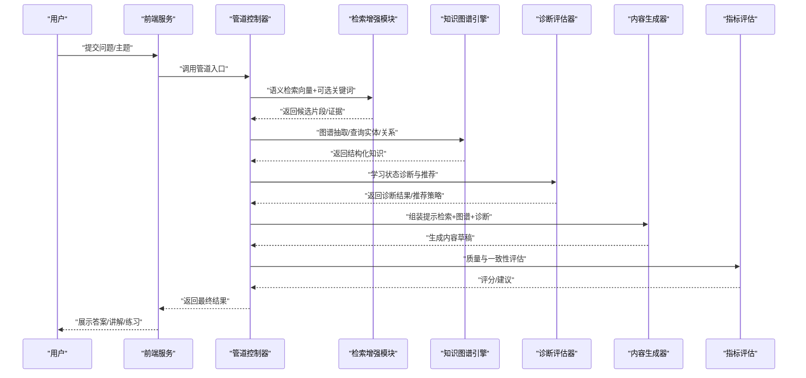
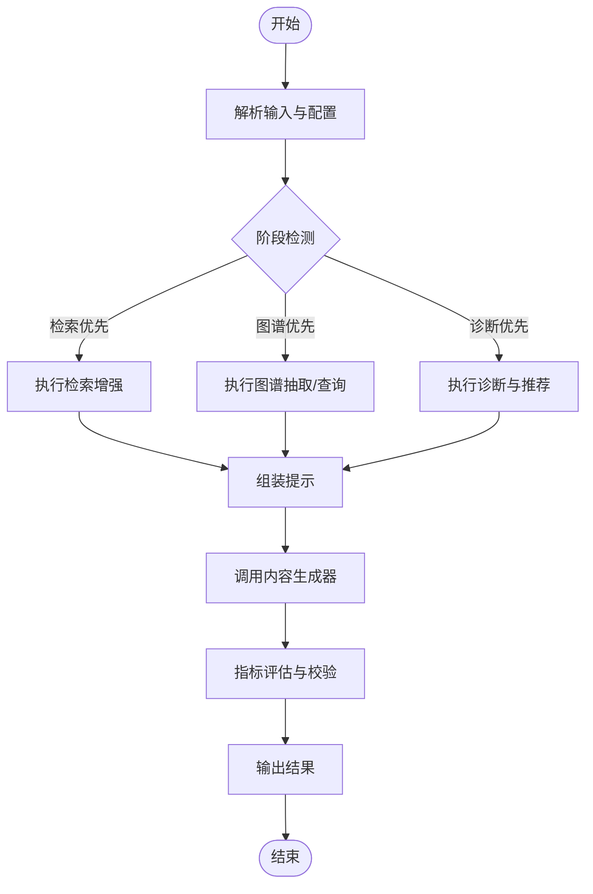
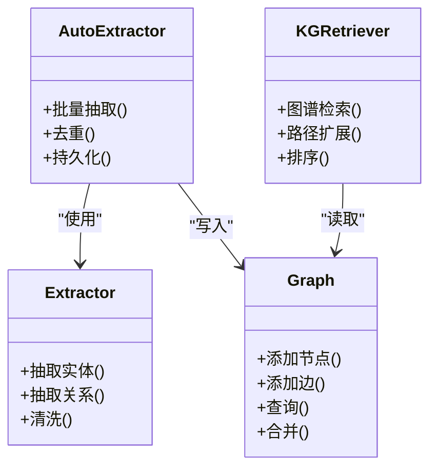
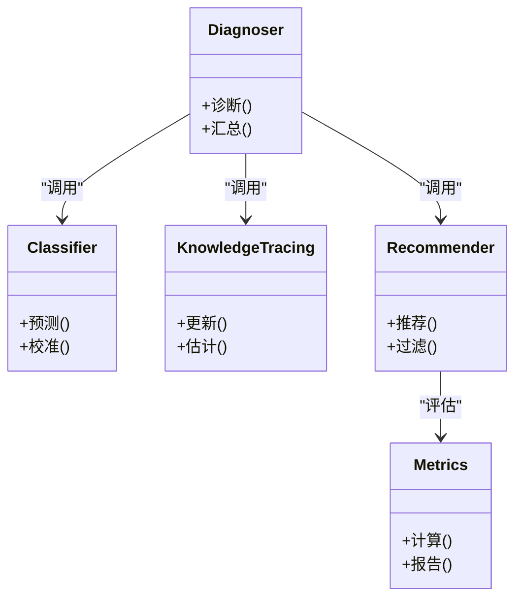
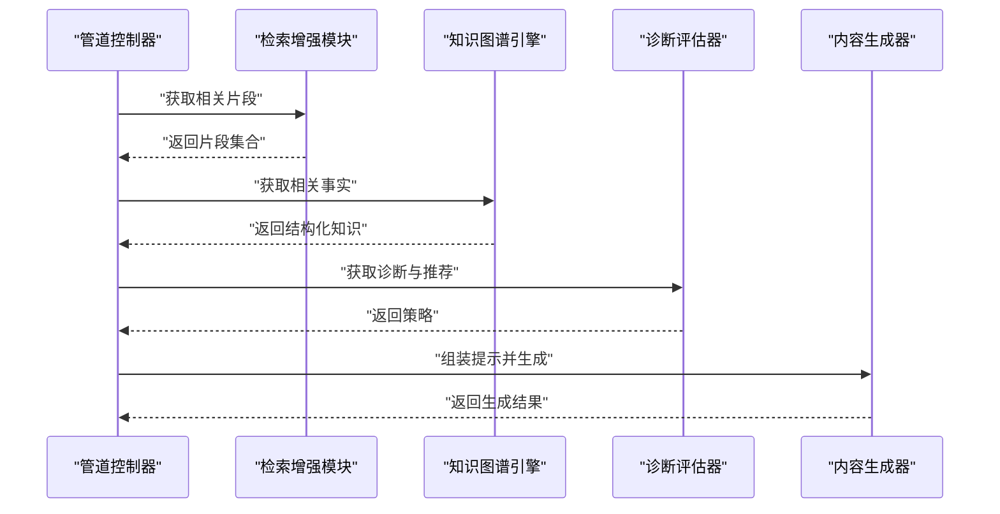
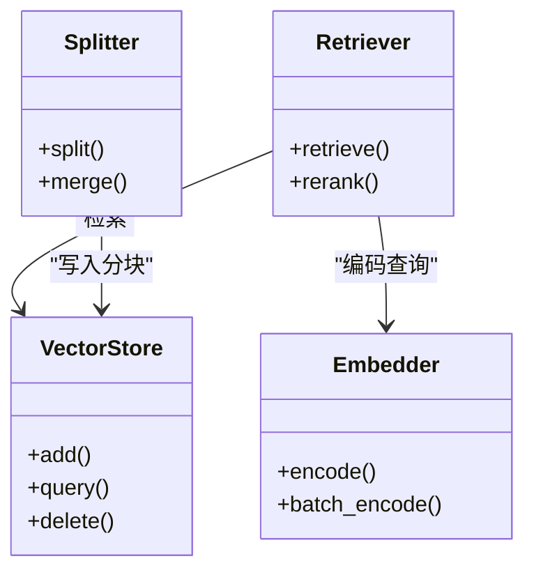
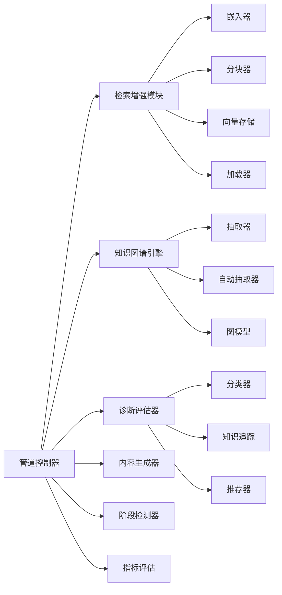

# 整体架构概览

<cite>
**本文引用的文件**   
- [src/kag_pro/core/pipeline.py](file://src/kag_pro/core/pipeline.py)
- [src/kag_pro/kg/graph.py](file://src/kag_pro/kg/graph.py)
- [src/kag_pro/kg/extractor.py](file://src/kag_pro/kg/extractor.py)
- [src/kag_pro/kg/auto_extractor.py](file://src/kag_pro/kg/auto_extractor.py)
- [src/kag_pro/kg/kg_retriever.py](file://src/kag_pro/kg/kg_retriever.py)
- [src/kag_pro/core/retriever.py](file://src/kag_pro/core/retriever.py)
- [src/kag_pro/core/embedder.py](file://src/kag_pro/core/embedder.py)
- [src/kag_pro/core/vector_store.py](file://src/kag_pro/core/vector_store.py)
- [src/kag_pro/core/generator.py](file://src/kag_pro/core/generator.py)
- [src/kag_pro/core/loader.py](file://src/kag_pro/core/loader.py)
- [src/kag_pro/core/splitter.py](file://src/kag_pro/core/splitter.py)
- [src/kag_pro/diagnosis/diagnoser.py](file://src/kag_pro/diagnosis/diagnoser.py)
- [src/kag_pro/diagnosis/classifier.py](file://src/kag_pro/diagnosis/classifier.py)
- [src/kag_pro/diagnosis/knowledge_tracing.py](file://src/kag_pro/diagnosis/knowledge_tracing.py)
- [src/kag_pro/diagnosis/recommender.py](file://src/kag_pro/diagnosis/recommender.py)
- [src/kag_pro/evaluation/metrics.py](file://src/kag_pro/evaluation/metrics.py)
- [src/kag_pro/stage/detector.py](file://src/kag_pro/stage/detector.py)
- [src/kag_pro/utils/config.py](file://src/kag_pro/utils/config.py)
- [README.md](file://README.md)
</cite>

## 目录
1. [引言](#引言)
2. [项目结构](#项目结构)
3. [核心组件](#核心组件)
4. [架构总览](#架构总览)
5. [详细组件分析](#详细组件分析)
6. [依赖关系分析](#依赖关系分析)
7. [性能考虑](#性能考虑)
8. [故障排查指南](#故障排查指南)
9. [结论](#结论)
10. [附录](#附录)

## 引言
本文件为 KAG-Pro 系统的整体架构概览，聚焦知识增强生成（KAG）的整体实现思路与分层设计。系统围绕“检索—图谱—诊断—生成”的闭环展开：以检索增强模块获取相关上下文，结合知识图谱引擎进行结构化推理与校验，通过诊断评估器对学习者状态与内容质量进行评估，最终由内容生成器产出高质量、可解释的学习材料。文档同时给出系统架构图与组件关系图，说明从用户输入到结果输出的完整处理流程，并讨论可扩展性与可维护性策略。

## 项目结构
仓库采用按功能域划分的模块化组织方式，核心代码位于 src/kag_pro 下，前端与示例脚本位于 frontend，测试位于 tests，数据与示例文本位于 data 与 notebooks。

- 表示层（对外接口）
  - 前端服务与页面：frontend/server.py、frontend/index.html
- 业务逻辑层（编排与领域能力）
  - 管道控制器：core/pipeline.py
  - 知识图谱引擎：kg/graph.py、kg/extractor.py、kg/auto_extractor.py、kg/kg_retriever.py
  - 诊断评估器：diagnosis/diagnoser.py、diagnosis/classifier.py、diagnosis/knowledge_tracing.py、diagnosis/recommender.py
  - 内容生成器：core/generator.py
  - 检索增强模块：core/retriever.py、core/embedder.py、core/vector_store.py
  - 阶段检测器：stage/detector.py
  - 指标评估：evaluation/metrics.py
- 数据访问层（I/O 与存储）
  - 加载与切分：core/loader.py、core/splitter.py
  - 向量存储：core/vector_store.py
  - 偏好与论文持久化：core/favorite_store.py、core/paper_store.py
- 技术支撑层（配置与工具）
  - 配置管理：utils/config.py

图表来源
- [src/kag_pro/core/pipeline.py](file://src/kag_pro/core/pipeline.py)
- [src/kag_pro/kg/graph.py](file://src/kag_pro/kg/graph.py)
- [src/kag_pro/kg/extractor.py](file://src/kag_pro/kg/extractor.py)
- [src/kag_pro/kg/auto_extractor.py](file://src/kag_pro/kg/auto_extractor.py)
- [src/kag_pro/kg/kg_retriever.py](file://src/kag_pro/kg/kg_retriever.py)
- [src/kag_pro/core/retriever.py](file://src/kag_pro/core/retriever.py)
- [src/kag_pro/core/embedder.py](file://src/kag_pro/core/embedder.py)
- [src/kag_pro/core/vector_store.py](file://src/kag_pro/core/vector_store.py)
- [src/kag_pro/core/generator.py](file://src/kag_pro/core/generator.py)
- [src/kag_pro/core/loader.py](file://src/kag_pro/core/loader.py)
- [src/kag_pro/core/splitter.py](file://src/kag_pro/core/splitter.py)
- [src/kag_pro/diagnosis/diagnoser.py](file://src/kag_pro/diagnosis/diagnoser.py)
- [src/kag_pro/diagnosis/classifier.py](file://src/kag_pro/diagnosis/classifier.py)
- [src/kag_pro/diagnosis/knowledge_tracing.py](file://src/kag_pro/diagnosis/knowledge_tracing.py)
- [src/kag_pro/diagnosis/recommender.py](file://src/kag_pro/diagnosis/recommender.py)
- [src/kag_pro/evaluation/metrics.py](file://src/kag_pro/evaluation/metrics.py)
- [src/kag_pro/stage/detector.py](file://src/kag_pro/stage/detector.py)
- [src/kag_pro/utils/config.py](file://src/kag_pro/utils/config.py)

章节来源
- [README.md](file://README.md)

## 核心组件
- 管道控制器（Pipeline Controller）
  - 职责：统一编排检索、图谱抽取/查询、诊断评估、内容生成与后处理；协调阶段检测与指标评估；暴露端到端执行入口。
  - 关键能力：阶段判定、参数路由、错误回退、结果聚合。
- 知识图谱引擎（KG Engine）
  - 职责：从文本中自动或半自动抽取实体与关系，构建与维护图谱；提供基于图谱的检索与推理辅助。
  - 关键能力：节点/边建模、抽取策略、图谱查询、增量更新。
- 诊断评估器（Diagnosis & Evaluation）
  - 职责：学习状态诊断（分类、知识追踪）、个性化推荐；对生成内容进行质量与一致性评估。
  - 关键能力：特征提取、模型推断、推荐策略、指标计算。
- 内容生成器（Content Generator）
  - 职责：在检索与图谱知识增强的前提下，生成结构化、连贯且可解释的学习内容。
  - 关键能力：提示组装、模板填充、约束生成、引用溯源。
- 检索增强模块（Retrieval-Augmented）
  - 职责：将原始文本向量化并索引，支持语义检索；与图谱检索融合，提升召回与相关性。
  - 关键能力：嵌入、分块、向量索引、混合检索。

章节来源
- [src/kag_pro/core/pipeline.py](file://src/kag_pro/core/pipeline.py)
- [src/kag_pro/kg/graph.py](file://src/kag_pro/kg/graph.py)
- [src/kag_pro/kg/extractor.py](file://src/kag_pro/kg/extractor.py)
- [src/kag_pro/kg/auto_extractor.py](file://src/kag_pro/kg/auto_extractor.py)
- [src/kag_pro/kg/kg_retriever.py](file://src/kag_pro/kg/kg_retriever.py)
- [src/kag_pro/core/retriever.py](file://src/kag_pro/core/retriever.py)
- [src/kag_pro/core/embedder.py](file://src/kag_pro/core/embedder.py)
- [src/kag_pro/core/vector_store.py](file://src/kag_pro/core/vector_store.py)
- [src/kag_pro/core/generator.py](file://src/kag_pro/core/generator.py)
- [src/kag_pro/diagnosis/diagnoser.py](file://src/kag_pro/diagnosis/diagnoser.py)
- [src/kag_pro/diagnosis/classifier.py](file://src/kag_pro/diagnosis/classifier.py)
- [src/kag_pro/diagnosis/knowledge_tracing.py](file://src/kag_pro/diagnosis/knowledge_tracing.py)
- [src/kag_pro/diagnosis/recommender.py](file://src/kag_pro/diagnosis/recommender.py)
- [src/kag_pro/evaluation/metrics.py](file://src/kag_pro/evaluation/metrics.py)
- [src/kag_pro/stage/detector.py](file://src/kag_pro/stage/detector.py)
- [src/kag_pro/core/loader.py](file://src/kag_pro/core/loader.py)
- [src/kag_pro/core/splitter.py](file://src/kag_pro/core/splitter.py)
- [src/kag_pro/utils/config.py](file://src/kag_pro/utils/config.py)

## 架构总览
KAG-Pro 采用分层与模块化相结合的架构：
- 表示层：接收用户请求，渲染交互界面，转发至后端管道。
- 业务逻辑层：以管道控制器为核心，串联检索、图谱、诊断、生成等能力。
- 数据访问层：封装 I/O、分块、嵌入、向量存储与外部数据源。
- 技术支撑层：集中配置、日志、监控等横切关注点。

图表来源
- [src/kag_pro/core/pipeline.py](file://src/kag_pro/core/pipeline.py)
- [src/kag_pro/core/retriever.py](file://src/kag_pro/core/retriever.py)
- [src/kag_pro/kg/kg_retriever.py](file://src/kag_pro/kg/kg_retriever.py)
- [src/kag_pro/diagnosis/diagnoser.py](file://src/kag_pro/diagnosis/diagnoser.py)
- [src/kag_pro/core/generator.py](file://src/kag_pro/core/generator.py)
- [src/kag_pro/evaluation/metrics.py](file://src/kag_pro/evaluation/metrics.py)

## 详细组件分析

### 管道控制器（Pipeline Controller）
- 角色定位：系统编排中枢，负责阶段判定、参数路由、异常回退与结果聚合。
- 关键流程：
  - 解析输入与配置
  - 触发检索增强
  - 调用知识图谱抽取/查询
  - 驱动诊断评估与推荐
  - 组合提示并调用生成器
  - 运行指标评估与后处理
- 扩展点：新增阶段可通过注册机制接入；不同任务类型可切换策略。

图表来源
- [src/kag_pro/core/pipeline.py](file://src/kag_pro/core/pipeline.py)
- [src/kag_pro/stage/detector.py](file://src/kag_pro/stage/detector.py)
- [src/kag_pro/evaluation/metrics.py](file://src/kag_pro/evaluation/metrics.py)

章节来源
- [src/kag_pro/core/pipeline.py](file://src/kag_pro/core/pipeline.py)
- [src/kag_pro/stage/detector.py](file://src/kag_pro/stage/detector.py)
- [src/kag_pro/evaluation/metrics.py](file://src/kag_pro/evaluation/metrics.py)

### 知识图谱引擎（KG Engine）
- 角色定位：从非结构化文本中抽取实体与关系，构建可查询的知识结构，并为检索与生成提供事实依据。
- 关键能力：
  - 抽取器：规则/模型驱动的实体识别与关系抽取
  - 自动抽取：批量处理与流水线化
  - 图谱模型：节点/边定义、属性与版本管理
  - 图谱检索：路径查询、邻居扩展、相似度匹配
- 与检索增强协作：将结构化知识与向量检索结果融合，提高准确性与可解释性。

图表来源
- [src/kag_pro/kg/graph.py](file://src/kag_pro/kg/graph.py)
- [src/kag_pro/kg/extractor.py](file://src/kag_pro/kg/extractor.py)
- [src/kag_pro/kg/auto_extractor.py](file://src/kag_pro/kg/auto_extractor.py)
- [src/kag_pro/kg/kg_retriever.py](file://src/kag_pro/kg/kg_retriever.py)

章节来源
- [src/kag_pro/kg/graph.py](file://src/kag_pro/kg/graph.py)
- [src/kag_pro/kg/extractor.py](file://src/kag_pro/kg/extractor.py)
- [src/kag_pro/kg/auto_extractor.py](file://src/kag_pro/kg/auto_extractor.py)
- [src/kag_pro/kg/kg_retriever.py](file://src/kag_pro/kg/kg_retriever.py)

### 诊断评估器（Diagnosis & Evaluation）
- 角色定位：对学习者的知识掌握度进行分类与追踪，并据此生成个性化推荐；同时对生成内容进行质量评估。
- 关键能力：
  - 分类器：基于特征或模型的类别判定
  - 知识追踪：动态估计掌握概率
  - 推荐器：根据诊断结果选择合适资源或难度
  - 指标评估：一致性、可读性、覆盖率等维度度量
- 与生成器协作：将诊断信号注入提示，控制生成风格与深度。

图表来源
- [src/kag_pro/diagnosis/diagnoser.py](file://src/kag_pro/diagnosis/diagnoser.py)
- [src/kag_pro/diagnosis/classifier.py](file://src/kag_pro/diagnosis/classifier.py)
- [src/kag_pro/diagnosis/knowledge_tracing.py](file://src/kag_pro/diagnosis/knowledge_tracing.py)
- [src/kag_pro/diagnosis/recommender.py](file://src/kag_pro/diagnosis/recommender.py)
- [src/kag_pro/evaluation/metrics.py](file://src/kag_pro/evaluation/metrics.py)

章节来源
- [src/kag_pro/diagnosis/diagnoser.py](file://src/kag_pro/diagnosis/diagnoser.py)
- [src/kag_pro/diagnosis/classifier.py](file://src/kag_pro/diagnosis/classifier.py)
- [src/kag_pro/diagnosis/knowledge_tracing.py](file://src/kag_pro/diagnosis/knowledge_tracing.py)
- [src/kag_pro/diagnosis/recommender.py](file://src/kag_pro/diagnosis/recommender.py)
- [src/kag_pro/evaluation/metrics.py](file://src/kag_pro/evaluation/metrics.py)

### 内容生成器（Content Generator）
- 角色定位：在检索与图谱知识增强的基础上，生成符合教学规范的结构化内容。
- 关键能力：
  - 提示组装：整合检索片段、图谱事实与诊断信息
  - 约束生成：遵循格式、长度、难度等约束
  - 引用溯源：标注来源片段与知识点
- 与检索和图谱协作：确保生成内容的准确性与可解释性。

图表来源
- [src/kag_pro/core/generator.py](file://src/kag_pro/core/generator.py)
- [src/kag_pro/core/retriever.py](file://src/kag_pro/core/retriever.py)
- [src/kag_pro/kg/kg_retriever.py](file://src/kag_pro/kg/kg_retriever.py)
- [src/kag_pro/diagnosis/diagnoser.py](file://src/kag_pro/diagnosis/diagnoser.py)

章节来源
- [src/kag_pro/core/generator.py](file://src/kag_pro/core/generator.py)

### 检索增强模块（Retrieval-Augmented）
- 角色定位：将文本向量化并建立索引，支持语义检索；与图谱检索融合，提升召回与相关性。
- 关键能力：
  - 嵌入器：文本到向量映射
  - 分块器：长文本切分为可检索单元
  - 向量存储：高效近邻搜索
  - 检索器：多路召回与重排
- 与加载器协作：从文件系统或外部数据源加载原始语料。

图表来源
- [src/kag_pro/core/retriever.py](file://src/kag_pro/core/retriever.py)
- [src/kag_pro/core/embedder.py](file://src/kag_pro/core/embedder.py)
- [src/kag_pro/core/vector_store.py](file://src/kag_pro/core/vector_store.py)
- [src/kag_pro/core/splitter.py](file://src/kag_pro/core/splitter.py)
- [src/kag_pro/core/loader.py](file://src/kag_pro/core/loader.py)

章节来源
- [src/kag_pro/core/retriever.py](file://src/kag_pro/core/retriever.py)
- [src/kag_pro/core/embedder.py](file://src/kag_pro/core/embedder.py)
- [src/kag_pro/core/vector_store.py](file://src/kag_pro/core/vector_store.py)
- [src/kag_pro/core/splitter.py](file://src/kag_pro/core/splitter.py)
- [src/kag_pro/core/loader.py](file://src/kag_pro/core/loader.py)

### 阶段检测器（Stage Detector）
- 角色定位：根据输入特征与上下文决定当前处理阶段（如检索优先、图谱优先、诊断优先），指导管道路由。
- 关键能力：规则/模型驱动的阶段判定、阈值控制、策略切换。

章节来源
- [src/kag_pro/stage/detector.py](file://src/kag_pro/stage/detector.py)

### 配置管理（Configuration）
- 角色定位：集中管理系统参数、模型路径、存储路径、阈值与开关。
- 关键能力：环境变量覆盖、默认值、运行时热更新。

章节来源
- [src/kag_pro/utils/config.py](file://src/kag_pro/utils/config.py)

## 依赖关系分析
- 内聚与耦合
  - 管道控制器作为编排中心，与其他模块松耦合，通过明确接口交互。
  - 检索增强与知识图谱各自独立演进，通过“结构化知识 + 向量证据”的融合降低耦合。
- 直接依赖
  - 管道控制器依赖检索、图谱、诊断、生成、评估与阶段检测。
  - 检索增强依赖嵌入器、分块器、向量存储与加载器。
  - 知识图谱依赖抽取器与自动抽取器，并对自身图模型读写。
- 外部依赖
  - 向量数据库/本地存储、嵌入模型、LLM 生成接口、评测指标库等。

图表来源
- [src/kag_pro/core/pipeline.py](file://src/kag_pro/core/pipeline.py)
- [src/kag_pro/core/retriever.py](file://src/kag_pro/core/retriever.py)
- [src/kag_pro/core/embedder.py](file://src/kag_pro/core/embedder.py)
- [src/kag_pro/core/splitter.py](file://src/kag_pro/core/splitter.py)
- [src/kag_pro/core/vector_store.py](file://src/kag_pro/core/vector_store.py)
- [src/kag_pro/core/loader.py](file://src/kag_pro/core/loader.py)
- [src/kag_pro/kg/extractor.py](file://src/kag_pro/kg/extractor.py)
- [src/kag_pro/kg/auto_extractor.py](file://src/kag_pro/kg/auto_extractor.py)
- [src/kag_pro/kg/graph.py](file://src/kag_pro/kg/graph.py)
- [src/kag_pro/diagnosis/classifier.py](file://src/kag_pro/diagnosis/classifier.py)
- [src/kag_pro/diagnosis/knowledge_tracing.py](file://src/kag_pro/diagnosis/knowledge_tracing.py)
- [src/kag_pro/diagnosis/recommender.py](file://src/kag_pro/diagnosis/recommender.py)
- [src/kag_pro/evaluation/metrics.py](file://src/kag_pro/evaluation/metrics.py)

## 性能考虑
- 检索性能
  - 使用高效的向量索引与近似最近邻算法；合理设置分块大小与重叠比例，平衡召回与延迟。
  - 引入缓存与预取策略，减少重复计算。
- 图谱构建与查询
  - 增量抽取与批处理；图查询优化（索引、路径限制）。
- 生成效率
  - 提示压缩与选择性注入；流式生成与并行采样。
- 资源管理
  - 模型权重与向量索引的内存驻留策略；按需加载与卸载。
- 评估与监控
  - 在线指标采集与离线回归对比；A/B 测试与灰度发布。

[本节为通用性能建议，不直接分析具体文件]

## 故障排查指南
- 常见问题定位
  - 检索失败：检查嵌入器与向量存储连通性、索引是否重建、查询向量维度是否一致。
  - 图谱异常：验证抽取器输出格式、图模型约束、去重与合并策略。
  - 生成质量低：审查提示组装逻辑、检索片段相关性、图谱事实覆盖度。
  - 诊断偏差：核对分类器与知识追踪的特征工程与训练数据。
- 日志与调试
  - 在管道各阶段记录输入输出摘要与耗时；对关键决策（阶段选择、阈值）打点。
  - 利用指标评估模块输出报告，定位退化环节。
- 恢复策略
  - 失败重试与降级（如仅用检索或仅用图谱）；快照回滚与增量修复。

章节来源
- [src/kag_pro/core/pipeline.py](file://src/kag_pro/core/pipeline.py)
- [src/kag_pro/evaluation/metrics.py](file://src/kag_pro/evaluation/metrics.py)

## 结论
KAG-Pro 以“检索—图谱—诊断—生成”的闭环为核心，通过分层与模块化设计实现了高内聚、低耦合的可扩展架构。管道控制器作为编排中枢，协调各子系统完成从用户输入到高质量输出的全流程。未来可在以下方向持续演进：
- 增强多模态检索与跨模态对齐
- 引入更细粒度的知识本体与因果推理
- 强化在线学习与自适应推荐
- 完善可观测性与自动化运维

[本节为总结性内容，不直接分析具体文件]

## 附录
- 术语表
  - 知识增强生成（KAG）：在生成过程中融合检索与结构化知识，以提升准确性与可解释性。
  - 向量检索：基于语义相似度的文本片段召回。
  - 知识追踪：动态估计学习者对知识点的掌握程度。
- 参考
  - README 中的项目目标与使用说明可作为快速上手指引。

章节来源
- [README.md](file://README.md)