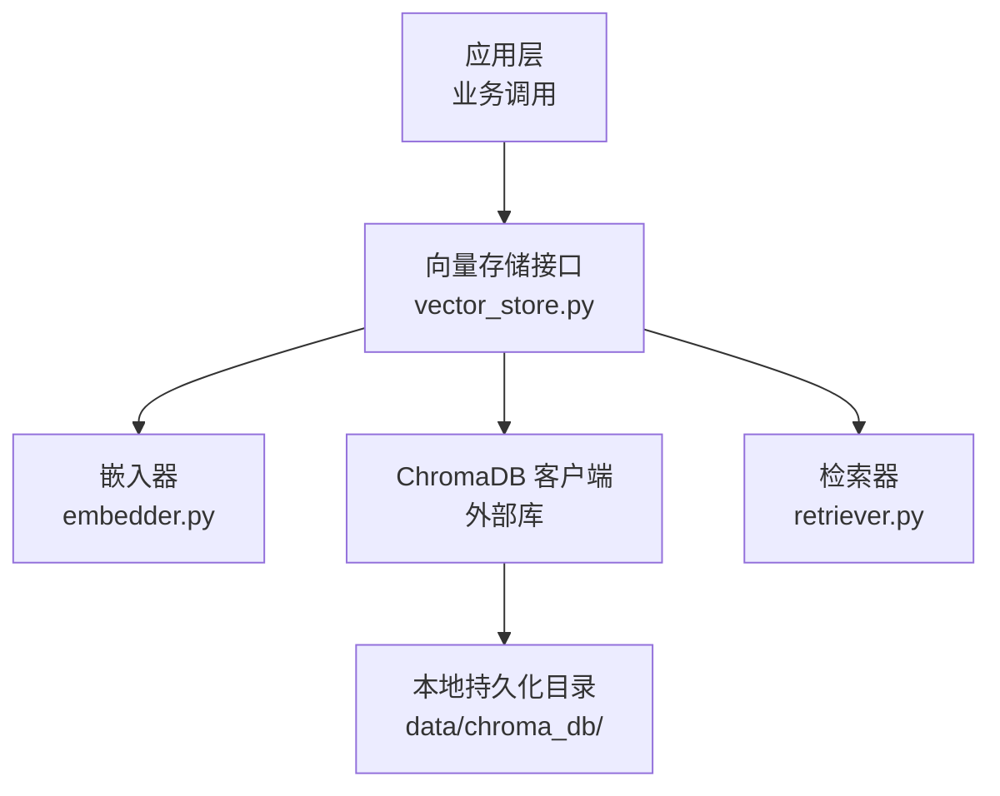
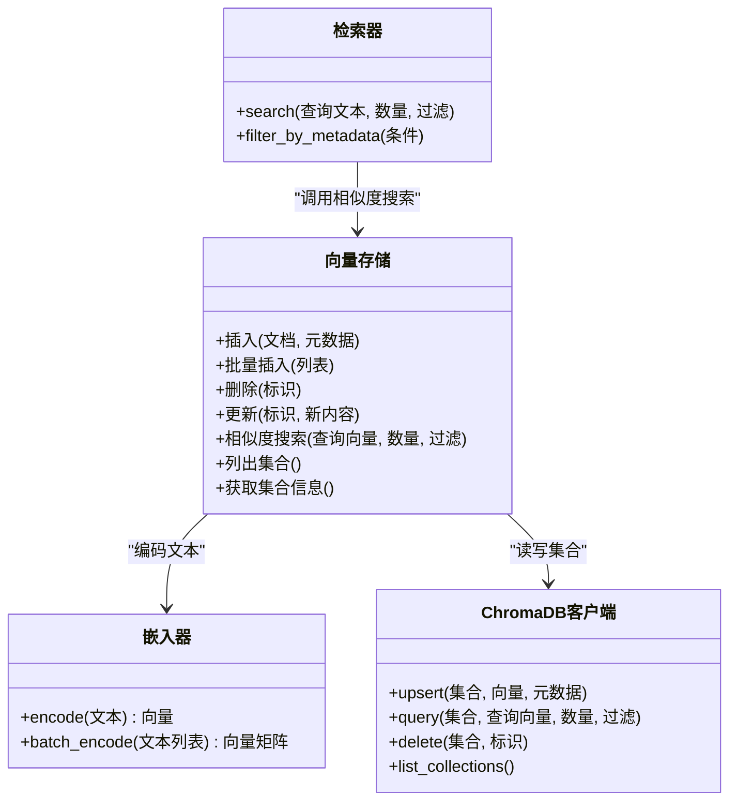
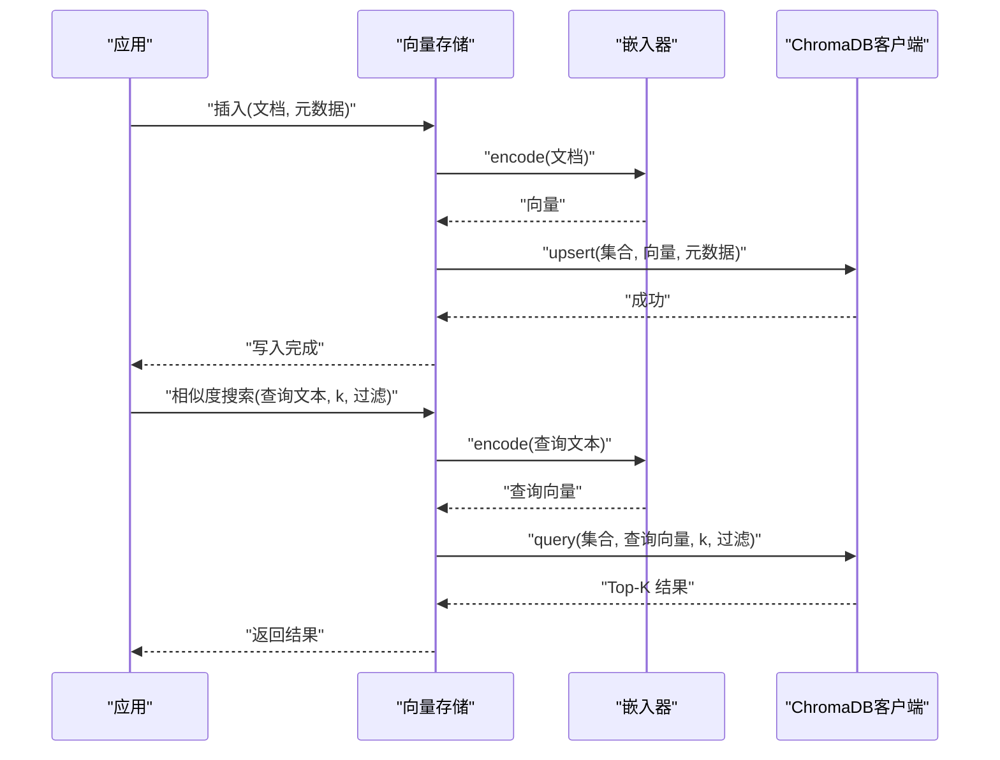
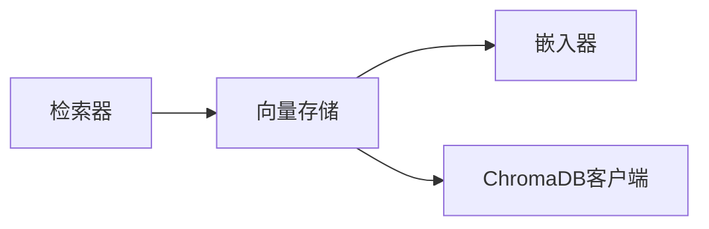

# 向量存储组件

<cite>
**本文引用的文件**   
- [src/kag_pro/core/vector_store.py](file://src/kag_pro/core/vector_store.py)
- [src/kag_pro/core/embedder.py](file://src/kag_pro/core/embedder.py)
- [src/kag_pro/core/retriever.py](file://src/kag_pro/core/retriever.py)
- [data/chroma_db/](file://data/chroma_db/)
</cite>

## 目录
1. [简介](#简介)
2. [项目结构](#项目结构)
3. [核心组件](#核心组件)
4. [架构总览](#架构总览)
5. [详细组件分析](#详细组件分析)
6. [依赖分析](#依赖分析)
7. [性能考虑](#性能考虑)
8. [故障排除指南](#故障排除指南)
9. [结论](#结论)
10. [附录](#附录)

## 简介
本技术文档聚焦于 KAG-Pro 的向量存储组件，围绕其基于 ChromaDB 的集成、索引构建与查询优化进行系统化说明。文档覆盖以下方面：
- 向量数据库的设计架构与存储策略
- 接口定义：数据插入、相似度搜索、批量操作与元数据管理
- 存储引擎配置：持久化设置、备份策略与扩展性考量
- 检索算法：余弦相似度、欧几里得距离等度量方法
- 使用示例：CRUD 操作与高级查询
- 一致性、事务与并发访问控制
- 性能调优建议与故障排除

## 项目结构
KAG-Pro 的向量存储相关代码位于 src/kag_pro/core 目录下，其中 vector_store.py 提供统一的向量存储抽象与实现；embedder.py 负责文本到向量的嵌入生成；retriever.py 封装检索流程。data/chroma_db 为本地持久化目录（若启用）。

图表来源
- [src/kag_pro/core/vector_store.py](file://src/kag_pro/core/vector_store.py)
- [src/kag_pro/core/embedder.py](file://src/kag_pro/core/embedder.py)
- [src/kag_pro/core/retriever.py](file://src/kag_pro/core/retriever.py)
- [data/chroma_db/](file://data/chroma_db/)

章节来源
- [src/kag_pro/core/vector_store.py](file://src/kag_pro/core/vector_store.py)
- [src/kag_pro/core/embedder.py](file://src/kag_pro/core/embedder.py)
- [src/kag_pro/core/retriever.py](file://src/kag_pro/core/retriever.py)
- [data/chroma_db/](file://data/chroma_db/)

## 核心组件
- 向量存储抽象与实现：对外暴露统一的插入、删除、更新、查询接口，内部对接 ChromaDB 集合与元数据表。
- 嵌入器：将原始文本转换为固定维度的向量，供向量存储写入与检索。
- 检索器：封装相似度搜索、过滤与结果后处理逻辑。

章节来源
- [src/kag_pro/core/vector_store.py](file://src/kag_pro/core/vector_store.py)
- [src/kag_pro/core/embedder.py](file://src/kag_pro/core/embedder.py)
- [src/kag_pro/core/retriever.py](file://src/kag_pro/core/retriever.py)

## 架构总览
整体采用“应用层 → 向量存储接口 → 嵌入器 + 向量数据库”的分层设计。向量存储作为统一入口，屏蔽底层 ChromaDB 细节，向上提供一致的 API；嵌入器负责将文本编码为向量；检索器在存储之上提供语义检索能力。

图表来源
- [src/kag_pro/core/vector_store.py](file://src/kag_pro/core/vector_store.py)
- [src/kag_pro/core/embedder.py](file://src/kag_pro/core/embedder.py)
- [src/kag_pro/core/retriever.py](file://src/kag_pro/core/retriever.py)

## 详细组件分析

### 向量存储接口与实现
- 职责
  - 提供统一的 CRUD 与相似度搜索接口
  - 管理集合生命周期（创建、列举、信息）
  - 维护元数据字段与约束
  - 协调嵌入器完成文本→向量转换
- 关键能力
  - 单条/批量插入：支持一次性写入多条记录，附带元数据
  - 删除与更新：按唯一标识定位并修改或移除条目
  - 相似度搜索：返回 Top-K 相似结果，支持元数据过滤
  - 集合管理：列举集合、获取集合统计信息
- 典型流程
  - 插入：接收文档与元数据 → 调用嵌入器生成向量 → 通过 ChromaDB 客户端 upsert → 落盘持久化（如启用）
  - 搜索：接收查询文本 → 嵌入器编码为查询向量 → ChromaDB 执行 query → 返回带分数与元数据的候选集

图表来源
- [src/kag_pro/core/vector_store.py](file://src/kag_pro/core/vector_store.py)
- [src/kag_pro/core/embedder.py](file://src/kag_pro/core/embedder.py)
- [src/kag_pro/core/retriever.py](file://src/kag_pro/core/retriever.py)

章节来源
- [src/kag_pro/core/vector_store.py](file://src/kag_pro/core/vector_store.py)

### 嵌入器
- 职责
  - 将自然语言文本映射为固定维度向量
  - 支持批量编码以提升吞吐
- 关键点
  - 维度一致性：确保所有向量维度一致，便于索引与检索
  - 批处理：减少模型调用开销，提高插入与检索效率
  - 错误处理：对空输入、超长文本等进行校验与降级

章节来源
- [src/kag_pro/core/embedder.py](file://src/kag_pro/core/embedder.py)

### 检索器
- 职责
  - 封装相似度搜索流程
  - 提供元数据过滤与结果排序
- 关键点
  - 过滤条件：支持按元数据键值筛选
  - 结果后处理：去重、截断、格式化输出

章节来源
- [src/kag_pro/core/retriever.py](file://src/kag_pro/core/retriever.py)

### 存储引擎与 ChromaDB 集成
- 集合命名与分区
  - 建议按业务域划分集合，避免跨域污染
  - 使用元数据标记版本、来源、时间戳等
- 元数据管理
  - 定义必填字段与可选字段
  - 建立索引友好的键（如类别、标签）
- 持久化
  - 本地模式：数据写入 data/chroma_db/ 目录
  - 远程模式：连接外部服务（需额外配置）

章节来源
- [src/kag_pro/core/vector_store.py](file://src/kag_pro/core/vector_store.py)
- [data/chroma_db/](file://data/chroma_db/)

## 依赖分析
- 直接依赖
  - 向量存储依赖嵌入器进行文本编码
  - 向量存储依赖 ChromaDB 客户端进行集合读写
  - 检索器依赖向量存储提供的相似度搜索能力
- 间接依赖
  - 嵌入器可能依赖第三方模型库（由 embedder.py 内部实现决定）
  - ChromaDB 客户端依赖底层存储后端（本地文件或远程服务）

图表来源
- [src/kag_pro/core/vector_store.py](file://src/kag_pro/core/vector_store.py)
- [src/kag_pro/core/embedder.py](file://src/kag_pro/core/embedder.py)
- [src/kag_pro/core/retriever.py](file://src/kag_pro/core/retriever.py)

章节来源
- [src/kag_pro/core/vector_store.py](file://src/kag_pro/core/vector_store.py)
- [src/kag_pro/core/embedder.py](file://src/kag_pro/core/embedder.py)
- [src/kag_pro/core/retriever.py](file://src/kag_pro/core/retriever.py)

## 性能考虑
- 批量操作
  - 优先使用批量插入与批量查询以降低网络与序列化开销
- 索引与度量
  - 根据数据规模选择合适的数据结构与索引参数
  - 余弦相似度适合归一化后的向量；欧几里得距离对尺度敏感
- 缓存与预热
  - 热点集合可考虑内存缓存以减少冷启动延迟
- 资源隔离
  - 不同业务域使用独立集合，避免相互干扰
- 监控与指标
  - 记录插入/查询耗时、失败率、集合大小与元数据分布

[本节为通用指导，不直接分析具体文件]

## 故障排除指南
- 常见问题
  - 维度不一致：检查嵌入器输出维度是否稳定
  - 元数据缺失：确保必填字段存在且类型正确
  - 集合不存在：首次使用前显式创建集合
  - 磁盘空间不足：检查 data/chroma_db/ 所在卷容量
- 诊断步骤
  - 验证集合是否存在与基本信息
  - 检查最近一次插入/查询的错误日志
  - 缩小查询范围（降低 k、增加过滤条件）以定位问题
- 恢复策略
  - 从备份恢复集合
  - 重建索引（必要时清空集合后重新导入）

章节来源
- [src/kag_pro/core/vector_store.py](file://src/kag_pro/core/vector_store.py)
- [data/chroma_db/](file://data/chroma_db/)

## 结论
KAG-Pro 的向量存储组件通过统一的接口抽象与 ChromaDB 集成，提供了可扩展、易用的向量数据管理能力。结合嵌入器与检索器，形成完整的语义检索链路。在生产环境中，应重视元数据治理、批量操作与监控指标，以获得稳定高效的检索体验。

[本节为总结性内容，不直接分析具体文件]

## 附录

### 接口定义与使用示例
- 数据插入
  - 单条插入：传入文档与元数据，内部完成编码与写入
  - 批量插入：传入列表，提升吞吐
- 相似度搜索
  - 传入查询文本与 Top-K，支持元数据过滤
- 删除与更新
  - 按唯一标识删除或更新条目
- 集合管理
  - 列举集合、获取集合信息

章节来源
- [src/kag_pro/core/vector_store.py](file://src/kag_pro/core/vector_store.py)

### 配置选项与最佳实践
- 持久化设置
  - 本地路径：指向 data/chroma_db/
  - 远程地址：按需配置外部服务
- 备份策略
  - 定期快照集合目录或导出元数据与向量
  - 制定回滚与恢复流程
- 扩展性考虑
  - 多集合分片：按业务域拆分
  - 读写分离：只读副本用于高并发查询

章节来源
- [src/kag_pro/core/vector_store.py](file://src/kag_pro/core/vector_store.py)
- [data/chroma_db/](file://data/chroma_db/)

### 检索算法与度量方法
- 余弦相似度
  - 适用于方向性匹配，对向量长度不敏感
- 欧几里得距离
  - 适用于绝对距离衡量，对尺度敏感
- 选择建议
  - 归一化向量优先余弦相似度
  - 非归一化且关注绝对差异时考虑欧几里得距离

章节来源
- [src/kag_pro/core/vector_store.py](file://src/kag_pro/core/vector_store.py)

### 一致性、事务与并发
- 一致性
  - 单条写入原子性由底层存储保证
  - 批量写入尽量在同一事务内提交（若底层支持）
- 并发控制
  - 避免同一标识的并发写冲突
  - 读多写少场景下，合理设置超时与重试
- 幂等性
  - 插入接口建议具备幂等特性，防止重复写入

章节来源
- [src/kag_pro/core/vector_store.py](file://src/kag_pro/core/vector_store.py)